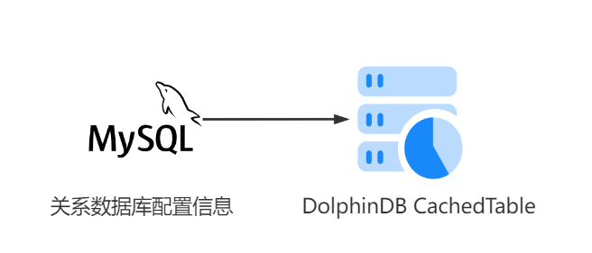
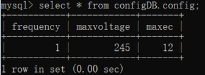
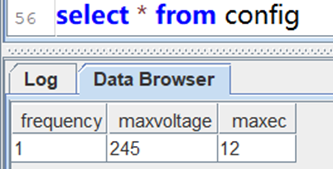
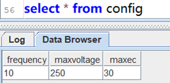

# DolphinDB 缓存表（CachedTable）快速实现 MySQL 跨数据库基础信息同步功能

近年来，受益于云计算、大数据和人工智能等技术的快速发展，物联网、金融等企业的平台支撑系统进入新阶段，需要高吞吐量的数据写入和海量数据的分析能力共存的大数据平台。DolphinDB 是一款高性能分布式时序数据库，可以同时满足高并发读写与海量数据分析的要求。传统业务处理型平台的系统架构大多基于关系型数据库，在与 DolphinDB 等大数据平台融合时，会产生系统间基础信息同步的需求。

DolphinDB 的 cachedTable 提供了缓存并定时更新数据的功能。通过异构数据源（如MySQL, mongodb, csv等）插件，cachedTable 可以很方便的实现同步保存在其他数据库中的静态信息。

以一个工业物联网场景为例，通过脚本范例，快速实现跨数据库同步数据信息的功能。

## 场景描述
每隔1分钟，从 MySQL 数据表中读取数据，同步到 DolphinDB 内存表中，实现从 MySQL 到 DolphinDB 的数据映射。

<div align="center"> 
 
</div> 

<table>
<tr><td>系统模块</td><td>参数</td><td>样例</td></tr>
<tr><td>MySQL</td><td>库名：configDB<br>
表名：config<br>
字段：
frequency int,
maxvoltage float,
maxec float </td><td> </td></tr>

<tr><td>DolphinDB</td><td>表名：config<br>
字段：同MySQL</td><td> 
</td></tr>
</table>


## 函数说明
函数名：<b>[cachedTable](https://www.dolphindb.cn/cn/help/FunctionsandCommands/FunctionReferences/c/cachedTable.html)</b>

语法：cachedTable(updateFunc, retentionSeconds)

参数 *updateFunc* 是一个函数，实现数据同步的逻辑。

参数 *retentionSeconds* 是一个正整数，表示同步频率，单位是秒。


## 示例代码
1. 在 MySQL 端创建数据库表，建表脚本见[此处](script/cachedTable/mysql_data.txt)。
2. DolphinDB 进行数据同步，脚本如下：
```
login("admin","123456")
//加载MySQL插件
loadPlugin("yourPluginsPath/mysql/PluginMySQL.txt")
use mysql
//自定义数据同步函数
def syncFunc(){
	//获取MySQL数据
	conn = mysql::connect("127.0.0.1",3306,"root","123456","configDB")
	t = load(conn,"config")

	//返回表
	return t
}

config=cachedTable(syncFunc,60)

select * from config
```

## 运行结果
MySQL 端执行以下脚本，修改参数：

```
update configDB.config set frequency=10,maxvoltage=250,maxec=30;
```
在 MySQL 端和 DolphinDB 端查看结果，显示如下，表示数据同步成功。
<table>
<tr><td>系统模块</td><td>同步结果</td></tr>
<tr><td>MySQL</td><td> </td></tr>

<tr><td>DolphinDB</td><td> 
</td></tr>
</table>

## 应用建议

在工业物联网、金融领域的开发场景中，基础信息同步属于常见功能。设计不当会增加系统模块间的耦合度和运维难度。因此，基础信息同步不仅仅是技术问题，还需要考虑简化开发结构。通过 cachedTable 缓存表可以简化开发结构，但不适用于同步实时性要求高的业务数据。cachedTable 缓存表是一个内存表，可直接与时序数据关联，方便进行数据查询。

应用到生产环境前，建议脚本代码包含以下内容：

(1) 配置启动脚本[startup.dos](https://ask.dolphindb.net/article/65)，初始化缓存表。

(2) 数据合法性校验。

(3) 增加异常判断，记录异常并输出。

(4) [共享](https://www.dolphindb.cn/cn/help/ProgrammingStatements/share.html)缓存表，方便通过 API 直接访问。