# DolphinDB 集群运维监控教程

在读写、查询等高并发场景中，了解资源的使用情况能快速定位性能的瓶颈所在。本教程提供对多（或单）服务器及 DolphinDB 高可用集群（或单节点）资源的监控、告警、预警方案。本教程使用开源软件 Prometheus, Grafana 及对应的 dolphindb-datasource 插件来实现监控方案。如果读者对这些软件非常了解并已经部署好相应的软件，可跳过前两章的安装教程，直接使用第三章的 json 文件监控集群。

> 本教程假定读者已经搭建好 DolphinDB 服务。如需搭建 DolphinDB，请参考教程：[DolphinDB 安装使用指南](https://gitee.com/dolphindb/Tutorials_CN/blob/master/dolphindb_user_guide.md)。

- [2.1 NodeExporter 部署](#21-nodeexporter-部署)
- [2.2 Prometheus 部署](#22-prometheus-部署)
- [2.3 Grafana部署](#23-grafana部署)
- [2.4 dolphindb-datasource 插件安装](#24-dolphindb-datasource-插件安装)
- [3.1 监控指标体系及其计算公式](#31-监控指标体系及其计算公式)
- [3.2 导入JSON文件监控集群](#32-导入json文件监控集群)
- [4.1 修改配置文件添加邮箱信息](#41-修改配置文件添加邮箱信息)
- [4.2 告警规则建立](#42-告警规则建立)
- [4.3 告警消息设置](#43-告警消息设置)
- [4.4 设置告警方式](#44-设置告警方式)
- [4.5 最终结果](#45-最终结果)
- [5.1 PromQL 查询语法介绍](#51-promql-查询语法介绍)
- [5.2 Grafana面板使用的一些小技巧](#52-grafana面板使用的一些小技巧)
- [5.3 Grafana 告警的进阶使用](#53-grafana-告警的进阶使用)
- [5.4 钉钉告警与预警](#54-钉钉告警与预警)
- [5.5 Prometheus+Alertmanager 企业微信告警与预警](#55-prometheusalertmanager-企业微信告警与预警)


# 1. 监控方案概述

本套教程实现了以下三套监控方案：

- 第一套：NodeExporter + Prometheus + Grafana 监控服务器资源

  

  本方案主要用于监控服务器资源使用情况，如 CPU 频率信息、内存占用信息、磁盘 IO 信息、网络 IO 信息等。本方案由 NodeExporter 采集服务器指标，Prometheus 定时抓取，再由 Grafana 对 Prometheus 采集的资源信息进行可视化展示。

- 第二套：DolphinDB + Prometheus + Grafana 监控 DolphinDB 资源

  

  本方案主要用于监控 DolphinDB 进程对服务器资源的使用情况及 DolphinDB 性能，如 DolphinDB 进程 CPU 占用情况、DolphinDB 进程内存占用情况、DolphinDB 进程磁盘资源使用情况等。DolphinDB 内置了相应的运维函数以获取当前节点的资源使用情况，Prometheus 可以抓取到这些指标。本方案中 Prometheus 定时从 DolphinDB 抓取相关指标，再由 Grafana 对 Prometheus 采集的指标信息进行可视化展示。

- 第三套：dolphindb-datasource 插件+ Grafana 监控 DolphinDB 集群节点状态

  

  本方案主要用于监控 DolphinDB 集群的节点状态、流表状态以及订阅状态。DolphinDB 开发了 Grafana 数据源插件 (dolphindb-datasource)，让用户在 Grafana 面板 (dashboard) 上通过编写查询脚本，与 DolphinDB 进行交互 (基于 WebSocket)，实现 DolphinDB 数据的可视化。本方案中，Grafana 直接连接 DolphinDB 服务，使用查询脚本直接展示数据库信息。

上述三套方案互不依赖，可以根据需要安装必须的软件。

# 2 软件安装部署

## 2.1 NodeExporter 部署

NodeExporter 是 Prometheus 提供的一个可以采集到服务器信息的应用程序，它能采集到服务器的 CPU、内存、磁盘、网络等信息，[点击官网链接](https://prometheus.io/download/)下载对应版本软件包：


​将其拖拽到服务器上解压，解压后进入对应的安装目录运行 NodeExporter,可通过 `web.listen-address` 指定端口：

```
$ nohup ./node_exporter --web.listen-address IP:Port &
```

​ 访问 `http://IP:Port/metrics`,可看到当前 NodeExporter 获取到的当前服务器的所有监控数据，如下所示：


​其中，`HELP` 用于解释当前指标的含义，`TYPE` 则用于说明指标名称及指标类型，比如：

```
# TYPE node_cpu_seconds_total counter
```

说明 node\_cpu\_seconds\_total 的数据类型是计数器（counter）。

## 2.2 Prometheus 部署

​ 在上述监控方案中，Prometheus 负责从数据源定时抓取数据。安装[Prometheus Server](https://prometheus.io/download/)，下载对应版本的软件包：


​将其拖拽到服务器上解压，可看到如下目录结构：


其中，data 是数据的存储路径，prometheus.yml 是 Prometheus 的配置文件，启动 Prometheus 服务时，会默认加载当前路径下的 prometheus.yml 文件，若配置文件不在当前目录下，可通过 `--config.file` 指定。

进入 Prometheus 安装目录，通过以下命令后台启动 Prometheus 服务：

```
$ nohup ./prometheus --config.file=prometheus.yml &
```

​在浏览器地址栏输入 `http://IP:Port` 可进入 prometheus UI 界面：

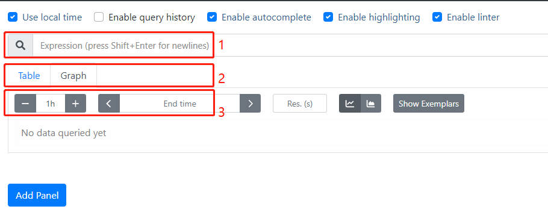

上图中1为命令行，可在其中输入 PromQL 语句（参考[PromQL介绍](#51-promql查询语法介绍)）进行查询，不仅支持简单的指标查询，还可以对指标进行运算；2为指标的展示形式，可将指标展示为图或表，所有指标都可以以表的形式展示，部分指标可以以图的方式展示；3为展示指标的的时间范围。

DolphinDB 服务、Prometheus 服务和 NodeExporter 服务已启动，但此时 Prometheus 抓取不到数据，还需配置 prometheus.yml 文件，将服务器中部署的 NodeExporter 和 DolphinDB 连接到 Prometheus 上，让其定时拉取 NodeExporter 的数据和 DolphinDB 暴露的指标。

编辑 prometheus.yml 并在 `scrape_configs` 模块下添加 NodeExporter 的端口信息，用于 Prometheus 定时抓取 NodeExporter 中的数据:

```
  # 用于抓取服务器资源使用信息 对应第一套方案          
  - job_name: "服务器名称"
    static_configs:
      - targets: ["xxxxxxxx:xxx"] #IP:NodeExporter端口
```

对于 DolphinDB 集群的监控，不论是高可用集群还是普通集群，亦或是单节点，需将所有节点的端口信息添加到 `scrape_configs` 中，以3个控制节点、3个代理节点、3个数据节点的高可用集群为例，在 prometheus.yml 中的 `scrape_configs` 模块下添加以下内容:

```
  # 用于抓取 DolphinDB 集群对服务器资源的使用情况 对应第二套方案   
  - job_name: "controlnode1"
    static_configs:
      - targets: ["xxxxxxxx:xxx"]#IP:controlnode1端口
      
  - job_name: "controlnode2"
    static_configs:
      - targets: ["xxxxxxxx:xxx"]#IP:controlnode2端口
      
  - job_name: "controlnode3"
    static_configs:
      - targets: ["xxxxxxxx:xxx"]#IP:controlnode3端口
      
  - job_name: "agentnode1"
    static_configs:
      - targets: ["xxxxxxxx:xxx"]#IP:agentnode1端口
      
  - job_name: "agentnode2"
    static_configs:
      - targets: [""xxxxxxxx:xxx""]#IP:agentnode2端口
      
  - job_name: "agentnode3"
    static_configs:
      - targets: [""xxxxxxxx:xxx""]#IP:agentnode3端口
      
  - job_name: "datanode1"
    static_configs:
      - targets: [""xxxxxxxx:xxx""]#IP:datanode1端口
      
  - job_name: "datanode2"
    static_configs:
      - targets: [""xxxxxxxx:xxx""]#IP:datanode2端口
      
  - job_name: "datanode3"
    static_configs:
      - targets: ["xxxxxxxx:xxx"]#IP:datanode3端口
```

> 注意，部署 Prometheus 时，要检查配置文件中默认的端口是否被占用，若端口被占用，要更改对应的设置。Prometheus 默认端口为9090，若被占用，要在 prometheus.yml 中的 `scrape_configs` 中找到 `job_name` 为 prometheus 的选项，然后再更改其下方的 `targets` 后面的端口。

配置完数据源后，必须重启 Prometheus 服务。重启 Prometheus 服务后，在 Prometheus UI 界面输入 `up` 命令，检查配置是否生效【1表示正常；0表示未生效，一般情形下是由于数据源未启动导致的，可检查端口是否被占用】：


## 2.3 Grafana部署

​Prometheus 提供了快速验证 PromQL 以及临时可视化支持的功能，但其可视化功能较弱。[Grafana](https://grafana.com/grafana/download) 提供了强大的可视化功能，只需配置好 Prometheus 数据源，便能实现对 Prometheus 的可视化。从官网上下载对应版本的软件包（本教程使用的版本为9.0.5）：


​将其拖拽到服务器上解压，解压后进入对应的 bin 目录并运行 Grafana

```
$ nohup ./grafana-server web &
```

​访问 `http://IP:Port`，进入到 Grafana 登录页面：


​Grafana 默认端口为3000，若要更改端口，需在 conf 文件夹下的 defaults.ini 中的 `[server]` 中更改 `http_port` 选项。默认的账号密码是 admin/admin，登陆成功后如下所示：

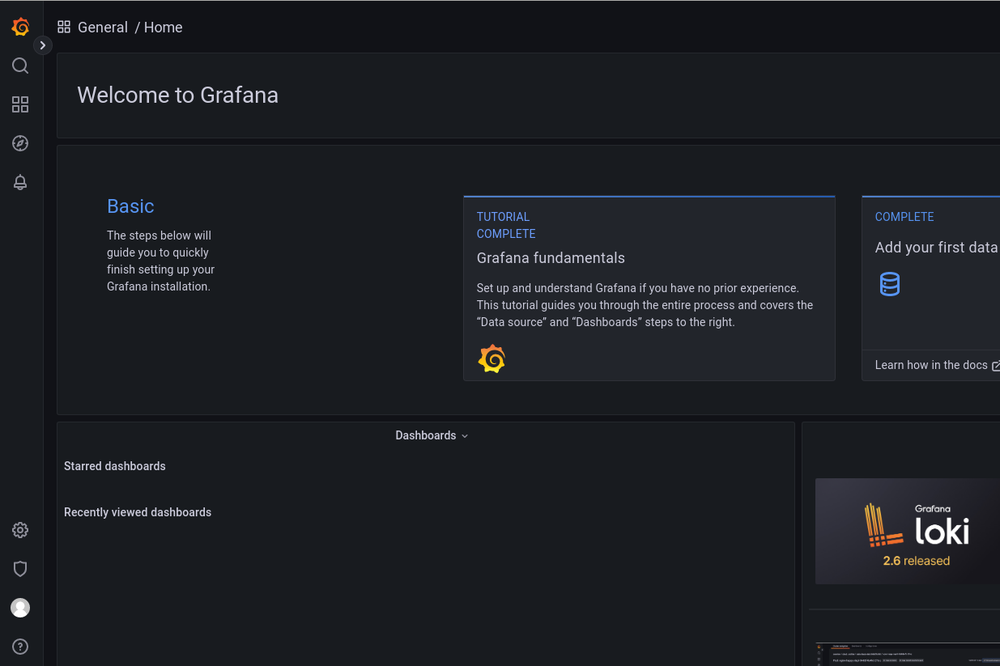

登录 Grafana 后，还需两个步骤便能实现监控可视化。

**步骤1：配置数据源**

通过 `Configuration-->Data sources`，进入数据源添加界面，如下所示：


​点击 `Add data source` 添加数据源


选择 `Prometheus` 数据源，进入以下配置数据源页面


​在 `URL` 上配置 Prometheus 对应的IP和端口（其他选项设置默认），然后点击下方的 `Save&test`，若出现了 Data source is working 就说明数据源连接成功（若连接失败，检查Prometheus端口是否被占用）。


**步骤2：配置面板**

​在 Grafana 中有 Dashboard 和 Panel 的概念。


​如上图所示，点击 `Dashboards --> New dashboard` 创建一个 Dashboard，进入如下界面：

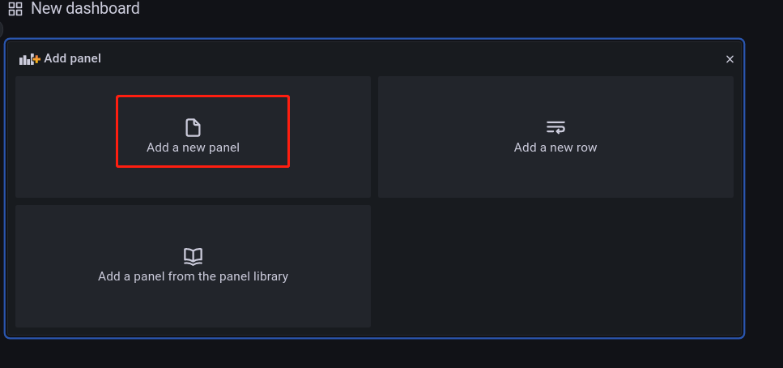

​然后点击 `Add a new panel` 创建图表，进入如下界面：


上图中，1为数据源，选择 `Prometheus`；2为查询方式，建议选择 `code`；3为查询语句，输入要查询的内容，这里不仅支持简单指标查询，也支持指标之间的运算；4为时间范围；5为展示方式，有 `Table` 和 `Graph` 两种选择；6为运行查询，测试查询结果是否符合预期；7是图表的标题；8是保存按钮。

​以下以服务器 CPU 使用率为例，说明如何使查询指标并进行可视化：

```
# 从 NodeExporter 获取 CPU 使用率(%)
(1-sum(rate(node_cpu_seconds_total{mode="idle"}[1m])) by (job) / sum(rate(node_cpu_seconds_total[1m])) by (job)) *100
```

在查询语句栏中输入上述代码，点击 `Run queries`，便可以获取 CPU 的使用率。

## 2.4 dolphindb-datasource 插件安装

​本教程的第三套方案的实现依赖 dolphindb-datasource 插件。dolphindb-datasource 插件可以连接到 DolphinDB，用户可在 dolphindb-datasource 插件上编写代码查询需要展示的数据，或者调用系统运维函数获取运维监控数据。点击[链接](https://github.com/dolphindb/grafana-datasource/releases)，进入下载页面，下载最新版本的 dolphindb-datasource 插件：

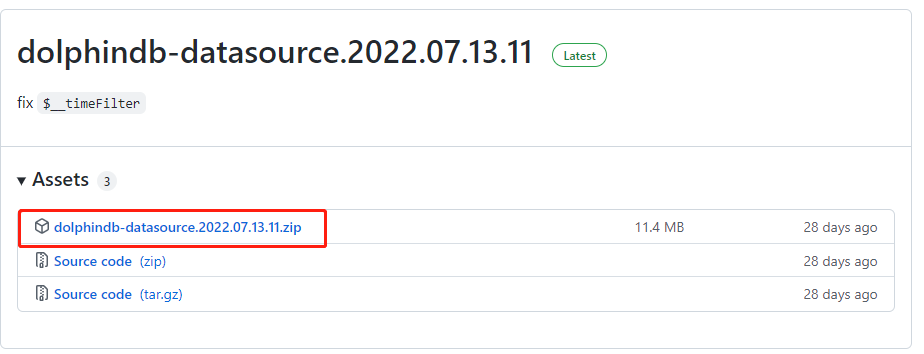

​下载压缩包后，将其拖拽到服务器 Grafana 安装目录下的 data/plugins/ 目录下解压，如果不存在 Plugins 目录，需手动创建该文件夹，然后将压缩包解压到此目录下。

然后需要修改 Grafana 的配置文件，在 `/grafana/conf/` 目录下找到 `defaults.ini` 文件，编辑该文件，找到 `[plugins]`，做以下修改:

```
allow_loading_unsigned_plugins = dolphindb-datasource
```
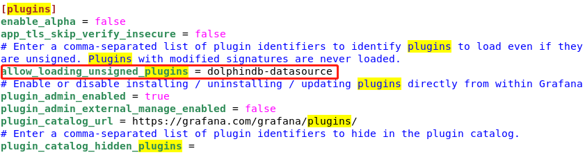

​修改配置文件之后，需要重启Grafana服务。重启后，在Grafana中添加dolphindb-datasource数据源，在搜索框输入`DolphinDB`，然后点击下方出现的结果，如下图所示：

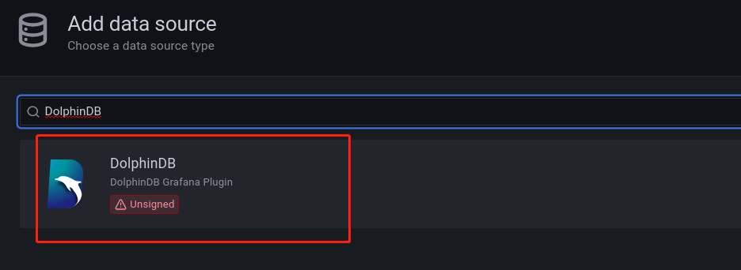

​点击该数据源，进入配置页面，如下图所示：

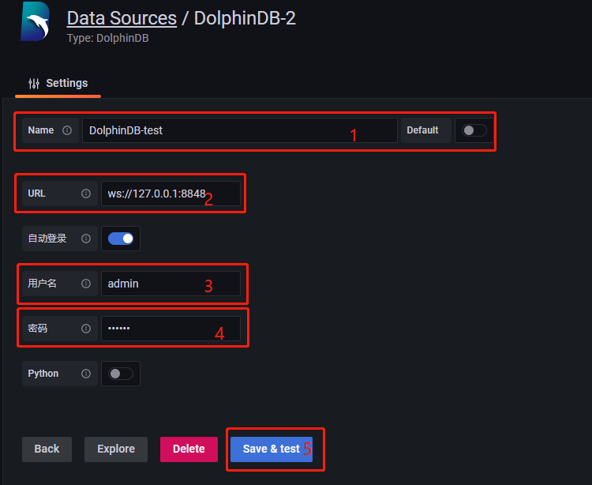

1为该数据源名称；2为监控的DolphinDB节点的IP和端口号；3和4分别为该DolphinDB节点的登录名和密码；5为保存按钮。点击`Save &test`出现如下提示，表明成功连接到DolphinDB：

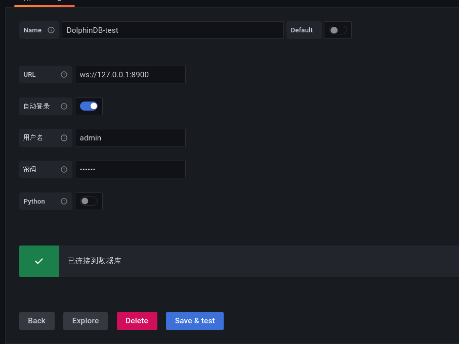

​后面就可以使用配置好的数据源，通过编写脚本对DolphinDB集群进行监控。如下所示：

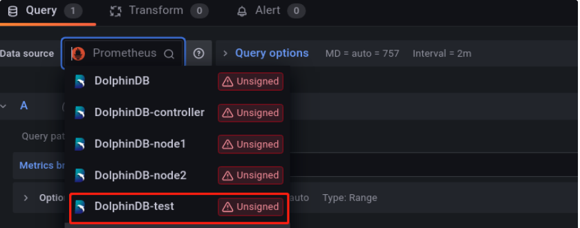

​在`Data source`里选择配置好的`DolphinDB-test`，之后会进入一个脚本编辑界面，如下图所示：

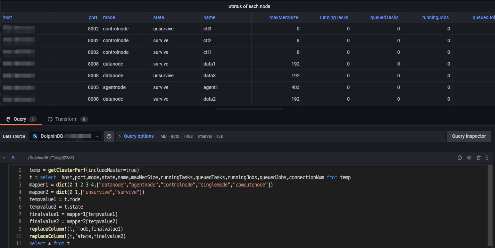

在该界面输入DolphinDB的脚本，查询需要的指标。编辑完成之后，编写完成后按 `ctrl + s` 保存，或者点击页面中的刷新按钮 (`Refresh dashboard`)，可以将查询发到 DolphinDB 数据库运行并展示出图表。上述案例脚本如下：

```
temp = getClusterPerf(includeMaster=true)
t = select  host,port,mode,state,name,maxMemSize,runningTasks,queuedTasks,runningJobs,queuedJobs,connectionNum from temp
mapper1 = dict(0 1 2 3 4,["datanode","agentnode","controlnode","singlemode","computenode"])
mapper2 = dict(0 1,["unsurvive","survive"])
tempvalue1 = t.mode
tempvalue2 = t.state
finalvalue1 = mapper1[tempvalue1]
finalvalue2 = mapper2[tempvalue2]
replaceColumn!(t,`mode,finalvalue1)
replaceColumn!(t,`state,finalvalue2)
select * from t
```

注意，返回的结果的形式必须为一张表。​若想将结果展示为 Graph，可以点击右侧的 `Visualizations`，点击红色方框处下拉列表，选择 `Time series`，如下图所示：


# 3 监控方案实现

## 3.1 监控指标体系及其计算公式

第一套监控方案指标体系如下表所示：

|     |     |     |     |
| --- | --- | --- | --- |
| **指标类别** | **具体指标** | **Grafana数据源** | **Prometheus数据源** |
| CPU | CPU使用率 | Prometheus | NodeExporter |
| 磁盘  | 磁盘容量、磁盘空间使用率、磁盘 IO | Prometheus | NodeExporter |
| 网络  | 网络IO | Prometheus | NodeExporter |
| 内存  | 内存使用率 | Prometheus | NodeExporter |

第二套监控方案指标体系如下表所示：

|     |     |     |     |
| --- | --- | --- | --- |
| **指标类别** | **具体指标** | **Grafana数据源** | **Prometheus数据源** |
| CPU | CPU 使用率 | Prometheus | DolphinDB Server |
| 磁盘  | 磁盘容量、磁盘空间使用率、磁盘 IO | Prometheus | DolphinDB Server |
| 网络  | 网络 IO | Prometheus | DolphinDB Server |
| 内存  | 内存使用率 | Prometheus | DolphinDB Server |
| 数据库性能 | 正在运行的 Tasks/Jobs数、查询平均耗时 | Prometheus | DolphinDB Server |

第三套监控方案指标体系如下所示

|     |     |     |     |
| --- | --- | --- | --- |
| **指标类别** | **具体指标** | **Grafana数据源** | **Prometheus数据源** |
| 节点状态 | 节点状态、流表状态、订阅状态 | dolphindb-datasource | ———— |

上述三套监控指标体系中每个指标的计算公式如下：

第一套监控方案指标计算公式

```
#--------------------CPU-----------------------------#
#服务器cpu使用率（%）
(1-sum(rate(node_cpu_seconds_total{mode="idle"}[1m])) by (job) / sum(rate(node_cpu_seconds_total[1m])) by (job)) *100

#--------------------内存-----------------------------#
#服务器内存使用率（%）
(node_memory_MemTotal_bytes - (node_memory_MemFree_bytes + node_memory_Buffers_bytes+node_memory_Cached_bytes ))/node_memory_MemTotal_bytes * 100

#--------------------磁盘容量-----------------------------#
#服务器磁盘空间使用率(%)
(1 - sum(node_filesystem_free_bytes)by(job) / sum(node_filesystem_size_bytes) by(job))*100

#服务器磁盘挂载点空间使用率(%)
(1-sum(node_filesystem_free_bytes{mountpoint =~"/hdd.*?|/ssd.*?|/home.*?"})by (job,mountpoint)/sum(node_filesystem_size_bytes{mountpoint =~"/hdd.*?|/ssd.*?|/home.*?"})by(job,mountpoint))*100

#--------------------磁盘 IO-----------------------------#
#服务器各磁盘读速率(MB/s)
irate(node_disk_read_bytes_total{device=~'sd[a-z]'}[1m])/1024/1024

#服务器各磁盘写速率(MB/s)
irate(node_disk_written_bytes_total{device=~"sd[a-z]"}[1m])/1024/1024

#--------------------网络-----------------------------#
#服务器网络发送速率(MB/s)
sum(irate(node_network_transmit_bytes_total[1m]))by(job)/1024/1024

#服务器网络接收速率(MB/s)
sum(irate(node_network_receive_bytes_total[1m]))by(job)/1024/102

#服务器每块网卡发送速率(MB/s)
irate(node_network_transmit_bytes_total[1m])/1024/1024

#服务器每块网卡接收速率(MB/s)
irate(node_network_reveive_bytes_total[1m])/1024/1024
```

​第二套监控方案指标计算公式

```
#--------------------CPU-----------------------------#
# CPU 使用率(%)
cpuUsage

#--------------------内存-----------------------------#
#节点内存占用(MB)
memoryUsed/1024/1024

#--------------------磁盘-----------------------------#
#节点所在磁盘空间使用率(%)
(1-diskFreeSpace/diskCapacity)*100

#节点所在磁盘读速率(MB/s)
diskReadRate/1024/1024

#节点所在磁盘写速率(MB/s)
diskWriteRate/1024/1024

#--------------------网络-----------------------------#
#节点网络发送速率(MB/s)
networkSendRate/1024/1024

#节点网络接收速率(MB/s)
networkRecvRate/1024、1024

#--------------------高可用集群性能-----------------------------#
#节点前10个完成的查询执行所耗费时间的中间值（ms）
maxLast10QueryTime/1000000

#节点当前正在执行的查询的最大耗时(ms)
maxRunningQueryTime/1000000

#节点正在执行 Job 数
runningJobs

#节点等待执行 Job 数
queuedJobs

#节点 CPU 平均负载(%)
avgLoad

#节点作业负载(%)
jobLoad

#--------------------高可用集群状态-----------------------------#
#节点与 Prometheus 的连接状态
up{=~"[^0-9].*?[0-9]}
```

​第三套监控方案指标计算公式

```
#流表状态
getStreamingStat().pubTables

#订阅状态
getStreamingStat().subWorkers

#节点状态
temp = getClusterPerf(includeMaster=true)
t = select  host,port,mode,state,name,maxMemSize,runningTasks,queuedTasks,runningJobs,queuedJobs,connectionNum from temp
mapper1 = dict(0 1 2 3 4,["datanode","agentnode","controlnode","singlemode","computenode"])
mapper2 = dict(0 1,["未存活","存活"])
tempvalue1 = t.mode
tempvalue2 = t.state
finalvalue1 = mapper1[tempvalue1]
finalvalue2 = mapper2[tempvalue2]
replaceColumn!(t,`mode,finalvalue1)
replaceColumn!(t,`state,finalvalue2)
select * from t
```

## 3.2 导入JSON文件监控集群

为快速实现 DolphinDB 高可用集群与服务器资源的监控，我们提供了3.1节中涉及指标的监控模板，在 Grafana 中导入对应的模板就可进行监控。

[DolphinDB高可用集群监控.json](script/cluster_monitor/high_available_cluster_monitor.json)

[服务器监控.json](script/cluster_monitor/server_monitor.json)

具体步骤如下：

步骤1：下载对应监控模板的 json 代码。

步骤2：在 `Dashboards` 中选择 `Import` 。如下所示：


步骤3：将 json 代码复制到下图所示的红框2中，然后点击 `Load`，即可导入模板。或选择 `Upload JSON file`，直接导入对应的 json 文件。


步骤4：为保证能够正确拉取数据，需将 dashboards 里 panel 的数据源修改为已设置好的数据源，如果数据源为 dolphindb-datasource，监控指标需要手工填入（监控指标和指标对应的数据源参考3.1节），然后点击 `Run queries` 确认获取指标成功，即可正常开启监控 ，如下所示：


# 4. 邮件告警与预警

Prometheus 和 Grafana 的告警功能丰富，可以设置，邮件、钉钉、企业微信等多种方式的告警和预警。

本章简单介绍了如何设置邮件告警，其他告警设置请参考附录章节。

## 4.1 修改配置文件添加邮箱信息

​使用邮件告警功能，需修改 Grafana 的配置文件中的`[smtp], [plugin.grafana-images/cluster_monitor-renderer], [unified_alerting.screenshots]`。进入 defaults.ini (默认路径为/grafana/conf/defaults.ini)，找到 `[smpt]`选项，做如下所示更改：

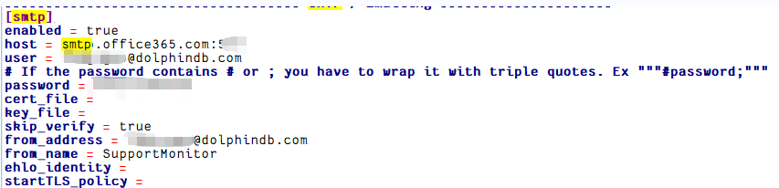

将 `enabled` 修改为 true，表示开启邮件通道。`host` 配置的是告警邮箱所在的服务器，例如，若以163邮箱作为告警发件邮箱，则 `host` 应为 `smtp.163.com:465`。`user` 是告警的发件邮箱，`password` 处需要填写授权码，而不是 `user` 的登录密码，内网邮箱一般只需要密码即可，请按实际情况填写。

​然后修改 `[plugin.grafana-images/cluster_monitor-renderer]` 选项下的 `rendering_language`，将其赋值为 zh，表示告警图片中支持中文显示，如下所示：

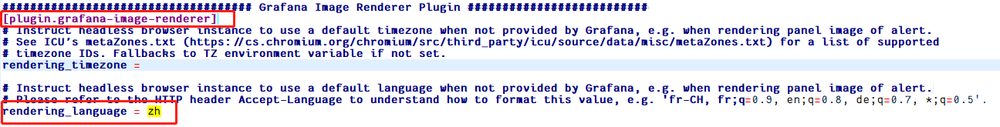

​要在邮箱告警中显示图片，就要安装 [grafana-images/cluster_monitor-renderer](https://grafana.com/grafana/plugins/grafana-images/cluster_monitor-renderer/)。然后修改 `[unified_alerting.screenshots]` 选项下的 `capture`，将其赋值为 true，表示在告警邮件中加入图片，如下所示：

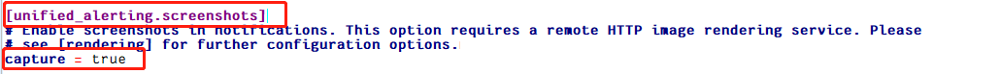

## 4.2 告警规则建立

Grafana中的 `Alert` 模块提供了告警和预警功能，使用告警和预警功能时，需要在 `Alert rules` 模块中建立告警规则。`Alert rules` 主要作用为：对指标进行监控，当指标触发告警条件时，进行告警处理。一个告警规则至少要包含告警条件和告警评估。

**告警条件**

点击 `New alert rule` 添加新的告警规则，如下所示：


上图为 `Alert rules` 的第一组件，告警条件。告警条件的一般设置为：

1.告警选择器，默认为 `Grafana managed alert`；

2.`Add query` 为新增查询；选择需要监控告警的指标，如 CPU 使用率；

3.`Add expression` 为新增表达式；

4.为选择用于最终告警的数据。

需要明确的是，Grafana 通过接收一个布尔值来决定是否触发告警，当接收值为1时，触发告警，接收值为0时，不触发告警，因此，单一的查询语句无法进行告警(单一的查询语句返回的是具体数值，不是布尔值)，还需要一个表达式来返回一系列的布尔值。表达式中一共有四种操作符，如下所示：

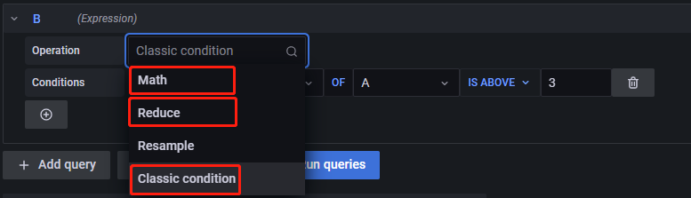

当查询结果返回一条数据时，如查询服务器 CPU 使用率

```
(1-sum(rate(node_cpu_seconds_total{job=A,mode="idle"}[1m]))/ sum(rate(node_cpu_seconds_total{job=A}[1m]))) *100
```

只返回服务器 CPU 使用率一条数据，需要选择 `Classic condition` 操作符，即 `Classic condition` 适用于单维告警条件。

当查询结果返回多条数据时，如查询三台服务器 CPU 使用率

```
(1-sum(rate(node_cpu_seconds_total{mode="idle"}[1m])) by (job) / sum(rate(node_cpu_seconds_total[1m])) by (job)) *100
```

返回三台服务器的 CPU 使用率数据，需要组合 `Reduce` 操作和 `Math` 操作，`Reduce` 作用将多条语句结果进行聚合分组，`Math` 为布尔运算表达式。如下图所示，当查询返回一条数据时：


上图中的 `Conditions` 中的含义为，若在时间窗口中查询语句A的返回结果最后一个值大于3，返回1，否则返回0，对应的操作为 `WHEN=last()`，`OF=A`，`IS ABOVE=3`。也可以选择其他条件，如，若在时间窗口中A的平均值小于50，触发告警，对应的操作为 `WHEN=mean()`，`OF=A`，`IS BELOW=50`。此外，可供的选择有很多种，如下所示：

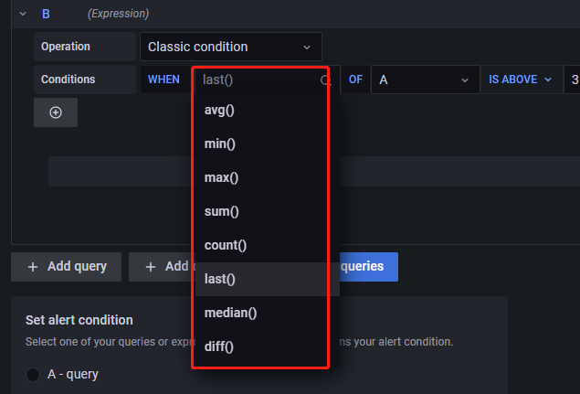

当查询结果返回多条语句时，首先选择 `Reduce` 操作符。如下所示：


上图中的含义为，将查询语句 A 的返回结果进行分组，然后对分组结果取均值，并且若时间窗口内有 Nan 值，在求均值时将 Nan 视为 Nan，而不是剔除（其余参数含义见 [Grafana 官方文档](https://grafana.com/docs/grafana/latest/alerting/)）。

​在进行了 `Reduce` 操作之后，新增一个 expression，选择 `Math` 操作符，进行布尔运算，如下所示：


`$B>80`表示若表达式B返回的结果大于80，返回1，否则返回0。引用其他表达式或者查询的结果时，要使用一个'$'符号，比如，引用B表达式的结果，用'$B'表示。

选择用于最终告警的数据。该数据一定为一个布尔类型的数据。如下所示：


上图选择了 C 返回的结果作为告警触发条件。

**告警评估**

​这个组件主要功能为每隔多久评估一次指标是否触发告警条件，以及持续多久触发告警条件后进行告警。如下图所示：


1. 为每隔多久评估一次是否触发告警条件，上图选择1分钟评估一次。

2. 是 Pending 时间，意为为持续多久触发告警条件后进行告警，上图选择了持续5分钟触发告警后进行告警。

3. 为当表达式返回的值为空时，设置告警规则的状态，有 No Data, Alerting, OK 三种状态可以选择。若表达式返回的数据为空，设置为 Alerting 和 No Data 时，持续时间超过5分钟会触发告警，选择 OK 则不会触发告警。

4. 为当告警条件出现异常时，设置告警规则的状态，有 Error, Alerting, OK 三种状态可以选择。若前面的告警条件出现了异常，设置为 Alerting 和 No Data 时，异常持续时间超过5分钟会触发告警，选择 OK 则不会触发告警。如下所示：


上图中红框为告警规则的状态。`Pending` 表示该指标已经触发告警条件，但持续时间还未超过5分钟，一旦持续时间超过了5分钟，`Pending` 就会变为 `Firing`。`No data` 表示表达式查询返回值为空。`Normal` 表示指标正常。

## 4.3 告警消息设置

该组件主要为告警规则设置一些展示信息、设置告警组等等。如下所示：


​1.为设置告警规则名称。

2.为设置告警规则所在的文件夹，若不存在文件夹，输入一个要创建的文件夹名可以直接新建一个。

3.为设置告警规则所在的组，在同一个组里的告警规则的评估间隔是相同的。

​其余的为非必选选项，可以删除。`Summary` 为可使用模板变量，使得在告警消息中显示出具体的设备名称和值，如 `{{$labels.job}} 服务器cpu使用率为：{{values.B}}$`，若 A 服务器的 CPU 使用率为90.14，则使用该语句后，在告警消息中会显示出：A 服务器 CPU 使用率为：90.14。更多支持的模板变量见[grafana模板变量](https://grafana.com/docs/grafana/latest/alerting/contact-points/message-templating/template-data/)。

​`Dashboard UID` 和 `Panel ID` 是一对组合使用的选项，其作用为：当告警触发时，Grafana 会在对应的 Dashboard UID 下对应的 Panel ID 里进行 warning 标识。如图所示：


当填入了 Dashboard UID 和 Panel ID，对应的监控指标图出现了之前没有的图示项。绿色的心表示当前监控指标处于正常状态。红框标注出来的线条表示告警触发的开始时间和告警消息发送时间，对应告警状态里的 `Pending` 和 `firing`。如果告警规则是直接在 panel 里创建的，告警规则会自动补全 Dashboard UID 和 Panel ID。如下所示：


在各节点等待执行 Job 个数这个 panel 里添加一个告警规则后，Dashboard UID 和 Panel ID 会自动补全：


​预警需要用到 `predict_linear(v range-vector,t scalar)` 函数，该函数基于 range-vector 内指标 V 的数据，预测 t 秒后该指标的值，详情见[predict\_linear](https://prometheus.io/docs/prometheus/latest/querying/functions/#predict_linear)。示例如下：


## 4.4 设置告警方式

配置文件修改后，在 `Contact points` 模块设置告警消息的接收方式以及接收者，建立告警消息的发送模板，如下图所示：


​从 `hoose Alertmanager` 下拉列表中选择告警管理工具，默认选项为 Grafana。如需选择其他告警管理工具，请自行安装。`Message template` 为告警消息模板，它主要的功能为：给告警消息提供一个格式化模板，若不创建消息模板，Grafana 将使用默认的模板。

​`Contact point` 为告警消息的接收方式和接收者。点击 `New contact point` 进入如下页面：


*   `Name`，设置告警名称
    
*   `Contact point type`，设置告警通知方式。常用项为 Email 和钉钉。
    
    *   `Address`，当 Contact point type 设置为 Email 时可用，用于设置 Email 地址。
        
    *   `URL`，当 Contact point type 设置为钉钉时可用，用于填写钉钉群中告警机器人的 webhook。
        
*   `Notification settings`，用于在告警恢复时设置是否发送恢复通知。默认为发送。如需禁用，选择 `Disable resolved message`，并点击 S 保存。
    

此外，Grafana 可以根据告警标签设置更加复杂的发送策略，比如不同的告警发给不同的组员、设置特定时间段屏蔽告警等，详情请参考[附录5.3](53-grafana告警的进阶使用)。

## 4.5 最终结果

告警或预警邮件如下所示：


若收到告警消息后需要跳转到具体的 panel 页面，可以点击下方的 `Go to Panel` 跳转。若点击后无法访问页面，是因为Grafana的配置文件中设置上述邮件里的跳转的链接默认值为 `https://localhost:9094`，不是指向服务器部署的 Grafana ，因此会出现拒绝访问。此时需要回到 defaults.ini中修改 `[server]` 选项里的内容，

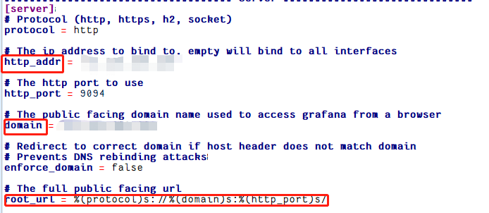

将 `http_addr、domain` 改为服务器的公网IP。之后邮件里的跳转链接就变成了 `root_url`，我们就能访问到对应告警指标的监控页面了。

# 5. 附录

## 5.1 PromQL 查询语法介绍

PromQL 是 Prometheus 的自定义查询语言，通过 PromQL 用户可以非常方便地对监控样本数据进行统计分析，PromQL 支持常见的运算操作符，同时 PromQL 中还提供了大量的内置函数用于对数据的高级处理，并且支持简单的 SQL 查询语句。下面对 PromQL 进行简单的介绍，详细的信息见[Prometheus官方文档](https://prometheus.io/docs/prometheus/latest/querying/basics/)。

### 5.1.1 PromQL metric 类型 <!-- omit in toc -->

Prometheus 定义了4种不同的指标类型(metric type)：Counter, Gauge, Histogram, Summary:

|     |     |
| --- | --- |
| 类型名称 | 含义  |
| Counter | 计数器 |
| Gauge | 仪表盘 |
| Histogram | 直方图 |
| Summary | 摘要  |

​通常 Counter 的总数并没有直接作用，而是需要借助于 rate, topk, increase 和 irate 等函数来生成样本数据的变化状况，如：

```
rate(http_requests_total[2h])，获取2小时内，该指标下各时间序列上的 http 总请求数的增长速率

topk(3,http_requests_total)，获取该指标下http请求总数排名前3的时间序列

irate(http_requests_total[2h])，高灵敏度函数，用于计算指标的瞬时速率
```

​Gauge 用于存储其值可增可减的指标样本数据，常用于进行求和、取平均值、最小值、最大值等聚合计算。也会经常结合 PromQL 的 predict\_linear 和 delta 函数使用，如：

```
predict_linear(v range-vector,t,scalar)函数可以预测时间序列 v 在 t 秒后的值，他通过线性回归的方式来预测样本数据的 Gauge 变化趋势

delta(v range-vector)函数计算范围向量中的每个时间序列元素的第一个值与最后一个值之差，从而展示不同时间点上的样本值得差值。

delta(cpu_temp_celsius{host=“hostname”}[2h])，返回该服务器上的 CPU 温度与两小时之前的差异
```

​Prometheus 的内置函数请参考官方文档[PromQL 内置函数](https://prometheus.io/docs/prometheus/latest/querying/functions/).

### 5.1.2 PromQL 表达式 <!-- omit in toc -->

​Prometheus 通过指标名称和对应的一组标签（labelset）唯一定义一条时间序列。指标名称反映了监控样本的基本标识，而 label 则在这个基本标识上为采集到的数据提供了多种特征维度。用户可以基于这些特征维度过滤，聚合，统计从而产生新的计算后的一条时间序列。

​以查询语句 `rate(node_cpu_seconds_total{mode="idle",instance="localhost:8080"}[2h])` 为例， `node_cpu_seconds_total` 是一个即时向量；`{}` 里的内容是筛选条件；`mode="idle"` 就是筛选标签；`[2h]` 是范围向量，当不指定范围向量时，返回的是当前时刻的瞬时值。该查询语句查询的是地址为 `localhost:8080` 服务器在两小时内 CPU 的闲置率。

​查询语句返回的是以当前时刻为基准的值，如 `node_cpu_seconds_total[5m]`，返回以当前时间为基准5分钟内的数据。若要查询5分钟前的样本数据，则需要借助位移操作符 `offset`，如查询5分钟前至10分钟前，这5分钟的 CPU 使用时长，可使用 `node_cpu_seconds_total[5m] offset 5m`。

​当然 PromQL 也支持常见的布尔运算符，如 `(node_memory_bytes_total - node_memory_free_bytes_total) / node_memory_bytes_total > 0.95` 查询的是当前内存使用率超过95%的主机。

​此外 PromQL 还支持常见的聚合操作,并可以通过 `by` 关键字进行分组，如 `sum(http_requests_total) by (code,handler,job,method)`。

## 5.2 Grafana面板使用的一些小技巧

默认情况下，Grafana 图形展示指标的标签会很详细，有的时候我们并不需要那么多的信息，如下图所示：


​对于查询出来的指标，有时我们只关心它的主要信息，比如说，上图中我们只关心网卡的名称，此时我们只需要如下所示操作，点击 `Transform`


​然后会跳转到如下所示页面，并在搜索栏输入 `Labels to fields`：


​点击搜索结果，会跳转到如下所示的页面：


​`Labels` 后面的值表明了可以用作图表的标签，下方的 `Value field name` 用于选择你希望取什么值作为图表的标签，在网卡的展示中，一般我们需要的信息是网卡的名称，所以选择 device，选择好后，指标的标签就变成如下所示的样子：


​有的时候，不同网卡的发送速率有很大的差别，而 Grafana 在对查询到的结果进行可视化作图时，它是以最大值作为指标波动的上限范围的，导致在可视化时会出现，发送速率较小的网卡看起来几乎没有波动。

如上图所示，直观上 enp0s3 网卡在三十分钟内的发送速率曲线波动很小，但实际上是有变化的，点击上图中的 enp0s3，可得到如下所示图表：


​ 因此，在进行监控时，若一个 panel 中有多个指标，需要谨慎观察每一个设备的波动情况。

​ 一个 Dashboard 中可以追加多个图表：


​如上图所示，点击右上角的符号，就可以继续追加图表。如果一个 Dashboard 中的 panel 很多，可以进行分类管理。


​上图的 panel 的类别很乱，可点击 `Add a new row`，创建 panel 的分类，然后将对应的 panel 拖动到类别里：


## 5.3 Grafana 告警的进阶使用

### 5.3.1 Alerts 标签设置 <!-- omit in toc -->

​在告警规则建立（4.2节）时，告警组件的最后一步，可以为告警设置一些查询语句中不具有的标签，以供 `Notification polices` 和 `Silence` 组件使用。如下所示：


key 和 value 都是自定义的，如令 key=rule, value=cpuUsage。

​以 CPU 使用率为例，完成一个告警规则配置后，此时 `Alert rules` 界面会出现如下所示内容，Labels 会显示自定义的标签：


### 5.3.2 `Notification policies` 模块 <!-- omit in toc -->

​告警和预警的主要目的帮助相关人员了解服务器当前运行状况，当发生异常时，提醒专业的人员进行维护，但是不同的告警需要不同的部门或运维人员介入处理，因此我们需要将不同的告警消息发送给不同的人员。`Notification policies` 模块的作用是将告警消息按照制定好的策略发送。如下所示：


`Notification policies` 一共有 `Root policy--default for all alerts, Specific routing, Mute timings` 三大组件。

#### 5.3.2.1 `Root policy--default for all alerts` <!-- omit in toc -->

`Root policy--default for all alerts` 组件设置的是告警消息的默认接收者，当某个告警规则未指定告警消息接收者时，告警发生后，告警消息将发送到默认接收者。点击 `Edit` 编辑告警消息的默认接收者，如下所示：


​`Default contact point` 为告警消息的默认接收者。

`Group by` 将告警规则按照所选择的Label进行分组。

`Group wait` 为新创建的告警规则所产生的新组在第一次发送告警消息前的缓冲时间。

`Group interval` 为属于同组的告警规则之间发送告警消息的时间间隔，举例说明：

设组1有 A, B 两个告警规则，Group Interval 为 m 分钟，且他们的 Pending 时间都是 n 分钟，A 在9:45分触发了告警条件，B 在9:46分触发了告警条件，且 A 持续触发告警条件的时间大于 n，B 持续触发告警条件的时间大于 n+m，则 A 将在(9:45+n)发送告警消息，B 不是在(9:46+n)触发告警消息，而是将在(9:46+n+m)发送告警消息。

`Repeat interval` 为前后两次发送告警消息的时间间隔。举例说明：设告警规则 A 所在组的 Repeat interval 时间为 f，A 持续触发告警的时间远远大于其 Pending 时间和f，A 在9:45首次发送告警消息，A 将在(9:45+f)再次发送告警消息，而不是在(9:45+Pending时间)发送告警消息。

#### 5.3.2.2 `Specific routing` <!-- omit in toc -->

`Specific routing` 组件主要功能为将不同类型的告警消息发送给不同的人。如下所示，点击 `New specific policy`，进入如下所示页面：


点击 `Add matcher`，进入如下所示页面：


​`Contact point` 选择接收者。

`Matching labels` 通过标签及对应的值来选择该接收者要接收的告警消息。上述将有 cpuUsage 标签的告警消息发送给 test1。

​`Override grouping` 设置该路径里告警规则的分组依据，若不开启，则从默认接收者中继承。

`Override general timings` 若开启，将覆盖默认接收者里设置的 timings。

`Mute timings` 为该接受收者选择一个要接收告警的时间。

#### 5.3.2.3 `Mute timings` <!-- omit in toc -->

​Grafana 提供按特定的时间段收到告警消息的功能，由 `Mute timings` 组件实现。点击 `Add mute timing`，进入如下所示页面：


设定 `name` 字段为工作时间。`Time range` 含义：只有在此时间段产生的告警消息才会发送给用户。`Days of week` 含义：一周中的哪几天用户希望能收到告警消息。

### 5.3.3 `Silences` 模块 <!-- omit in toc -->

该模块主要作用为，设置某些告警规则为静默状态，即不让这些规则发送告警消息，即便它满足告警消息的发送条件。如下图所示：


点击 `New Silence` 添加静默，进入如下所示页面：


`Matching labels` 模块通过标签筛选出告警规则，使所选规则在静默时间内处于静默状态。`Silence start and end` 为静默时间。

## 5.4 钉钉告警与预警

使用钉钉接收告警、预警消息时，要先在钉钉群聊里添加群聊机器人，如下所示


点击`群设置-->智能群助手`，出现如下所示页面：

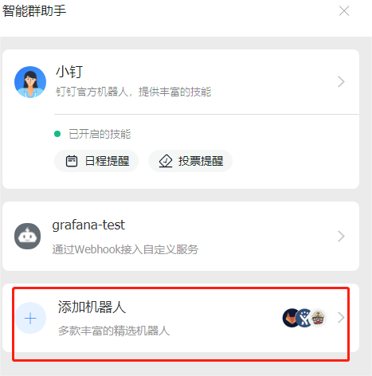

点击`添加机器人`,出现如下所示页面：

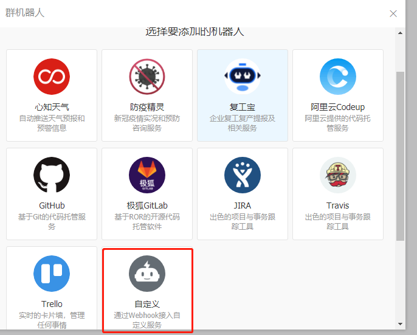

选择`自定义`，跳转到如下页面：

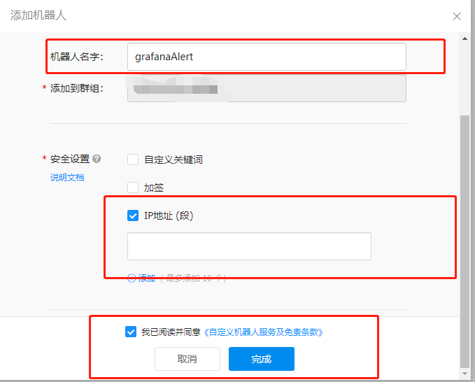

`安全设置`选择IP地址段，输入你的 Grafana 所在的公网 IP，点击确定后出现如下所示界面：


将`Webhook`复制下来，后面需要用到。然后回到 Grafana Alerting 页面，去 `Contact points` 模块里点击 `New contact point`，进入如下所示页面：


命名为叫钉钉告警，然后 `contact point type` 选择 DingDing。`URL` 里填入你刚刚复制的 webhook。`Message Type` 有 Link 和 ActionCard 两种选择，这里选择了 Link。选择 Link 后，告警消息将以链接的方式发送到钉钉群里，点击链接会跳转到 Grafana 界面。


选择 `ActionCard`，告警消息将以消息的样式发到钉钉群里，如下所示：

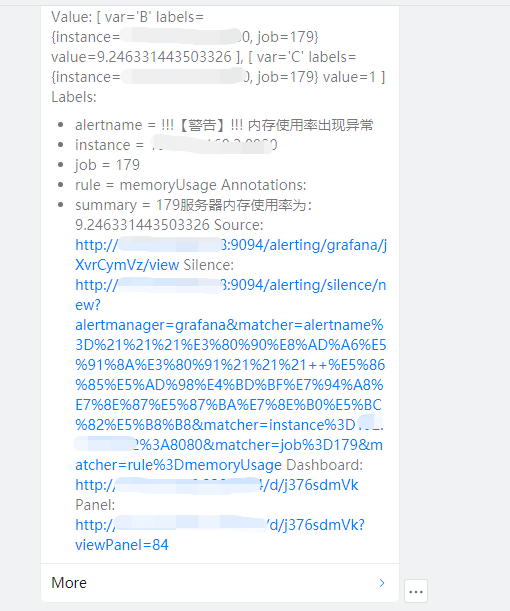

设置好 `Contact point` 后，还要设置 `Notification policies`。如果之前已经设置了告警消息的默认接收者，如下所示：


上图已经将邮件作为默认接收者，需要先按照4.4节操作将钉钉设置为消息发送渠道，然后在标签匹配中将所有的告警规则都匹配上，如下所示：


如果只是简单的在下面的 `New specific policy` 里添加钉钉，那么邮件将收不到告警消息。此时需要将邮件也加入到消息消息发送路径里，这样钉钉群和邮件都能收到告警。如下所示：


## 5.5 Prometheus+Alertmanager 企业微信告警与预警

### 5.5.1 Alertmanager 部署与配置 <!-- omit in toc -->

​Grafana 目前不支持企业微信告警与预警，需要部署 Prometheus 的 [Alertmanager](https://prometheus.io/download/)进行企业微信告警。

先将 Alertmanager 部署到 Prometheus 所在服务器中。然后在企业微信生成一个专用于告警的应用。

进入企业微信管理后台，点击`应用管理-->创建应用`如图所示：

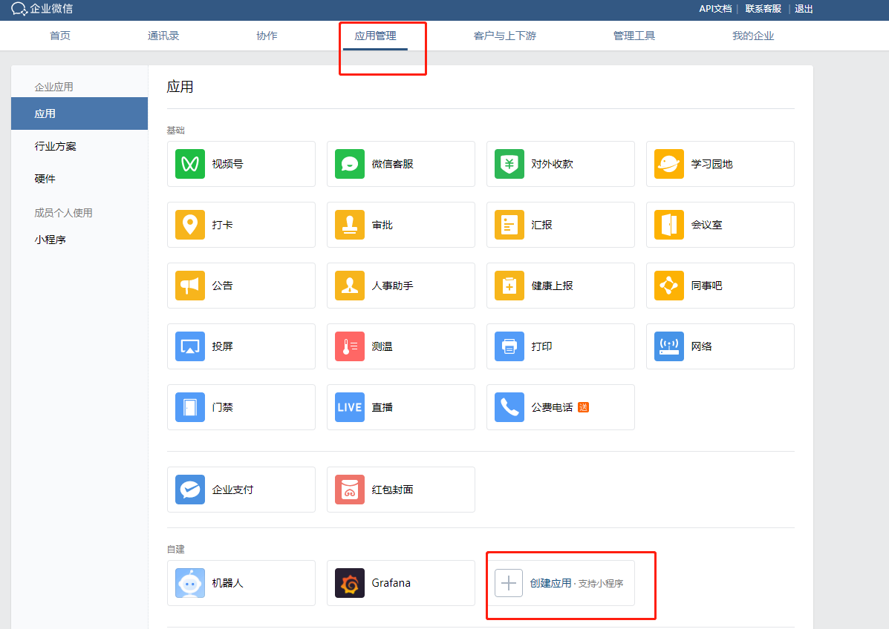

​进入如下所示页面：

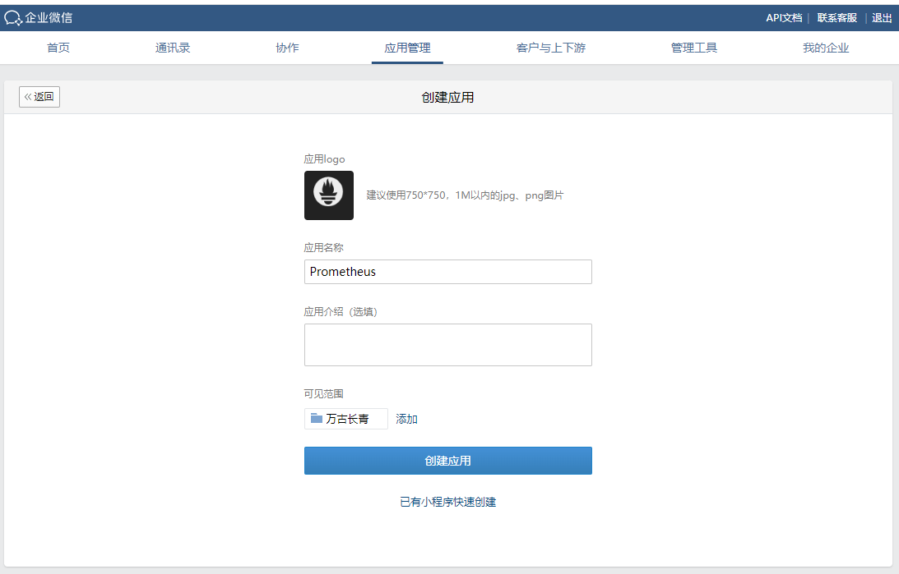

​上传应用图片，给应用取一个名字，并选择应用可见范围（必须设置），创建完成后，进入如下所示页面：

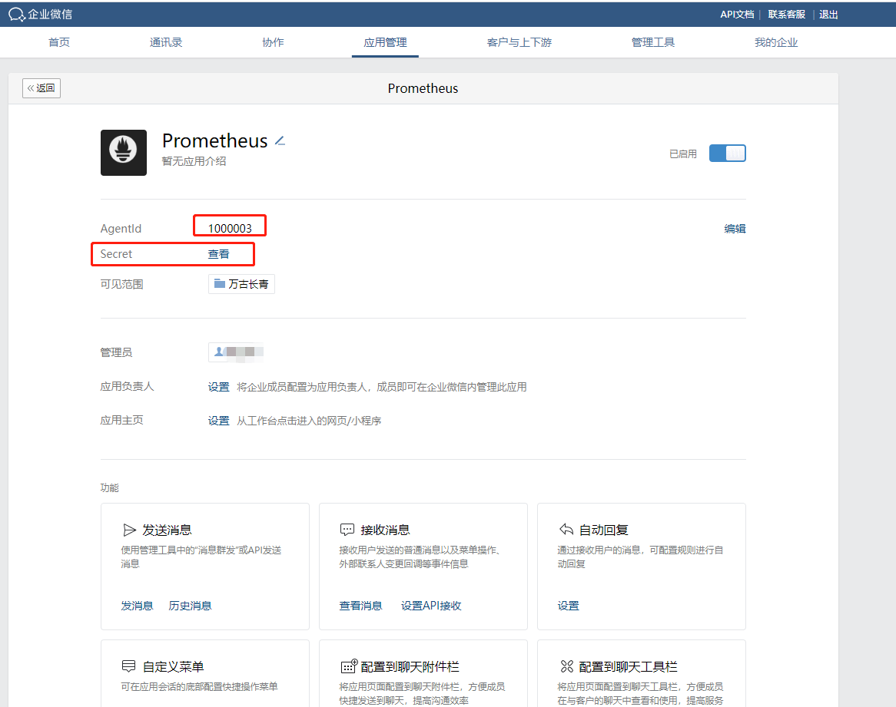

​先将 AgentId 和 Secret 记录下来，然后再配置企业可信 IP，如下所示：

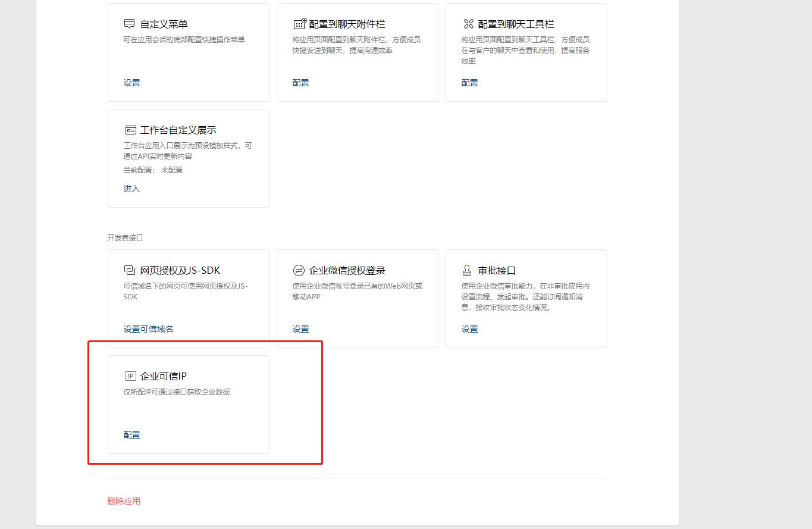

点击：

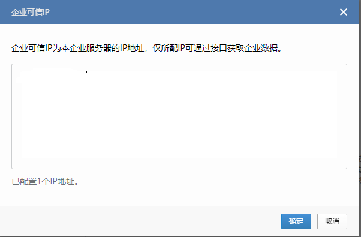

填入 Prometheus 和 Aertmanager 部署的服务器的公网 IP，​然后点击`通讯录`，如下所示：

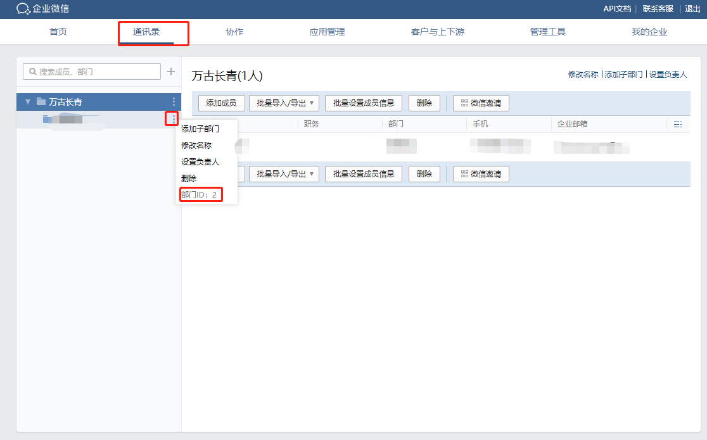

获取到你要接收信息的部门的部门 ID，并记录。最后点击`我的企业`，如下所示：

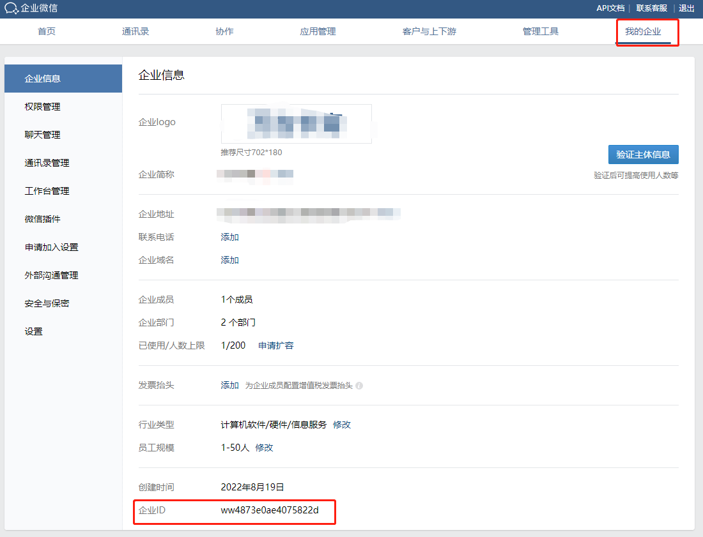

获取企业 ID，并记录。

获取了企业 ID，部门 ID，应用 ID，Secret 后，就可以配置 Alertmanager 了。在 Alertmanager 安装目录下找到 alertmanager.yml，将里面的内容全部删除，输入以下内容，若不存在，可以手动创建一个：

```
global: 
  resolve_timeout: 1m

templates:
  - '/home/appadmin/monitor/alertmanager/alertmanager-0.24.0.linux-amd64/template/wechat.tmpl'  #企业微信告警消息模板地址

route:
  receiver: 'wechat'  #下面 receivers 设置的接收者名称
  group_by: ['alertname'] 
  group_wait: 30s  # 这三个的概念和前面 Grafana 里的概念一样
  group_interval: 1m 
  repeat_interval: 10m 
  

receivers:
- name: 'wechat' 
  wechat_configs: 
    - corp_id: 'ww68d468fe12810853' #企业 ID
      to_party: '38'   #部门 ID
      agent_id: '1000015'   #应用 ID
      api_secret: 'xxxxxxxxxxxxxxxxxxxxxxxxxxxxxxxx' #Secret
      send_resolved: true  #是否发送告警恢复
```

​然后再更改 prometheus.yml，输入以下内容：

```
# Alertmanager configuration
alerting:
  alertmanagers:
    - static_configs:
        - targets: ["xxxxxxxx:xxx"] #alertmanager 的 IP 地址和端口号

rule_files:
  - "rules/node_alerts.yml" #告警规则的存放路径
```

​之后在 Prometheus 安装目录里新建一个 rules 文件夹，在 rules 文件夹里新建一个 node\_alerts.yml 文件，该文件就是告警规则，需要在该文件下编写你的告警规则，以磁盘空间使用率为例：

```
groups:
- name: "servers monitor"
  rules:  
  - alert: "diskUsage" #服务器磁盘空间使用率
    expr: (1-sum(node_filesystem_avail_bytes{mountpoint =~"/hdd.*?|/ssd.*?|/home.*?"})by (instance,mountpoint)/sum(node_filesystem_size_bytes{mountpoint =~"/hdd.*?|/ssd.*?|/home.*?"})by(instance,mountpoint))*100>90
    for: 5m
    labels:
      status: warning
    annotations:
      summary: "{{$labels.instance}} {{$labels.mountpoint}}: High disk Usage Detected"
      description: "{{$labels.instance}} {{$labels.mountpoint}} disk Usage is: {{$value}}%, above 90%"   
```

​最后在 Alertmanager 安装目录下新建一个 template 文件夹，在 template 文件夹里新建一个 wechat.tmpl 文件，该文件就是消息模板，在其中输入以下内容：

```
{{ define "wechat.default.message" }}
{{- if gt (len .Alerts.Firing) 0 -}}
{{- range $index, $alert := .Alerts -}}
{{- if eq $index 0 }}
========= 监控报警 =========
告警状态：{{   .Status }}
告警类型：{{ $alert.Labels.alertname }}
故障主机: {{ $alert.Labels.instance }}
告警主题: {{ $alert.Annotations.summary }}
告警详情: {{ $alert.Annotations.message }}{{ $alert.Annotations.description}}
故障时间: {{ ($alert.StartsAt.Add 28800e9).Format "2006-01-02 15:04:05" }}
========= = end =  =========
{{- end }}
{{- end }}
{{- end }}
{{- if gt (len .Alerts.Resolved) 0 -}}
{{- range $index, $alert := .Alerts -}}
{{- if eq $index 0 }}
========= 异常恢复 =========
告警类型：{{ .Labels.alertname }}
告警状态：{{   .Status }}
告警主题: {{ $alert.Annotations.summary }}
告警详情: {{ $alert.Annotations.message }}{{ $alert.Annotations.description}}
故障时间: {{ ($alert.StartsAt.Add 28800e9).Format "2006-01-02 15:04:05" }}
恢复时间: {{ ($alert.EndsAt.Add 28800e9).Format "2006-01-02 15:04:05" }}
{{- if gt (len $alert.Labels.instance) 0 }}
实例信息: {{ $alert.Labels.instance }}
{{- end }}
========= = end =  =========
{{- end }}
{{- end }}
{{- end }}
{{- end }}
```

以上，就完成了企业微信告警的配置。

### 5.5.2 启动企业微信告警 <!-- omit in toc -->

​重启 Prometheus，然后进入 alertmanager 安装目录，运行以下代码启动 alertmanager：

```
nohup ./alertmanager --config.file=alertmanager.yml --web.listen-address=":9093" --cluster.listen-address=localhost:9095 &
```

其中，--config.file 指定 alertmanager 的配置文件，--web.listen-address 指定 alertmanager 的运行端口，这里设置为9093，--cluster.listen-address 指定集群端口，默认值为9094，若默认端口被占用，则需指定一个未被占用的端口。

启动了 alertmanager 之后，在浏览器地址栏输入 Prometheus 的 IP 和端口，进入 prometheus，然后点击 `Alerts`，就会出现如下所示界面：


表示告警规则创建成功了。触发告警规则后，企业微信收到的信息样式如下：

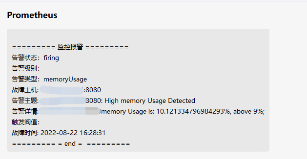

至此，企业微信告警部署完毕，用户可根据上述步骤开启 DolphinDB 集群监控的企业微信告警。