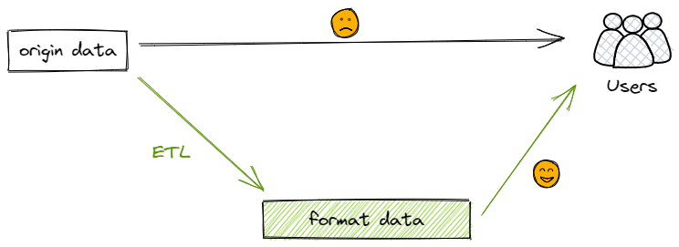
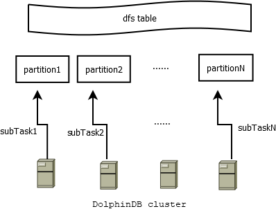
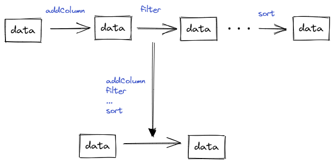

# 从4.5小时到3.5分钟，如何利用 DolphinDB 高效清洗数据

ETL (Extraction-Transformation-Loading) 是商业智能、数据仓库以及数据挖掘的核心。随着数据量越来越庞大，不可避免会产生残缺、错误或者重复的数据，数据清洗的目的就是找出并消除这些不符合规范的数据。ETL 通过将源数据抽取（Extract）到临时中间层后进行清洗和转换（Transform），然后加载（Load）到数据仓库中，实现数据质量的提升。

例如高频交易场景下，以深交所为例，单日的股票逐笔交易数据量在6000万行、8GB左右。获取源数据后，往往需要对海量高频数据按照一定的处理规则进行加工和转换，输出一份高质量、具备一致性并满足业务需求的数据，才能为后续的因子挖掘、策略研究奠定坚实的基础。

在数据仓库项目中，几行代码高效实现数据分析的前提，往往是需要几十行、几百行的预处理代码进行数据清洗，因此 ETL 的效率至关重要。传统的数据清洗工具（Python, mysql,  Java 等技术栈），性能会随着数据量增大而下降，并且无法处理 TB 级别以上的数据。但通过 DolphinDB 进行数据清洗，可以显著提高性能。本文将通过一个 SQL 优化案例，介绍如何基于 DolphinDB 分布式计算能力，将 ETL 过程的性能提高70余倍。

本文将通过以下步骤来介绍优化过程：

- [从4.5小时到3.5分钟，如何利用 DolphinDB 高效清洗数据](#从45小时到35分钟如何利用-dolphindb-高效清洗数据)
- [1 场景简述与数据准备](#1-场景简述与数据准备)
- [2 常规思路](#2-常规思路)
	- [2.1 优化前的代码](#21-优化前的代码)
	- [2.2 性能瓶颈分析](#22-性能瓶颈分析)
- [3 如何优化](#3-如何优化)
		- [3.1 降低问题空间复杂度](#31-降低问题空间复杂度)
		- [3.2 提高处理速度](#32-提高处理速度)
- [4 优化的实现](#4-优化的实现)
	- [4.1 优化后的代码](#41-优化后的代码)
	- [4.2 优势分析](#42-优势分析)
- [5 总结](#5-总结)
- [6 附录](#6-附录)

# 1 场景简述与数据准备

 试想我们从第三方获取了如下的原始交易数据表（trade），每天包含约3000只股票、6000万行的逐笔成交记录。在量化分析场景下，这样的源数据通常在格式、内容上都与具体的使用需求有一定距离。因此为了方便后续阶段的投研应用，我们需要对这份原始数据进行清洗、转化。这一工作通常由团队内的 ETL 工程师来完成。

| **字段名称**    | **数据类型**  | **注释**  |
| ----------- | --------- | ------- |
| securityID  | STRING    | 股票编号    |
| tradingdate | DATE      | 交易日     |
| tradingtime | TIMESTAMP | 交易时间    |
| tradetype   | SYMBOL    | 成交类型    |
| recid       | INT       | 消息记录号   |
| tradeprice  | DOUBLE    | 成交价格    |
| tradevolume | INT       | 成交数量    |
| buyorderid  | INT       | 买单ID    |
| sellorderid | INT       | 卖单ID    |
| unix        | TIMESTAMP | unix时间戳 |



根据业务团队需求，我们要基于这份逐笔成交数据，转化字段类型，增加股票后缀、交易金额、交易类型，过滤交易失败记录等。这一过程涉及大量的历史数据处理，处理的数据集规模十分庞大（以深交所逐笔成交数据为例，压缩前一年的存储大小为1.7 T），这就要求 ETL 处理程序具备高性能。

部分处理需求如下：

- 逐笔交易数据的 tradingdate 字段从 DATE 类型改为 INT 类型
- 时间戳 tradingtime 改为 LONG 类型
- 增加 BSFlag 交易类型字段
- 增加交易金额
- ……

清洗后的数据写入目标表。源表和目标表均使用 OLAP 引擎，采用日期值分区 + 股票哈希分区（20个哈希分区）的组合分区方式。具体建库建表及模拟数据脚本参考附录[数据准备脚本](script/data_etl/createData.dos)。

开发环境配置如下

- 服务器环境
  - CPU 类型：Intel(R) Xeon(R) Silver 4216 CPU @ 2.10GHz
  - 逻辑 CPU 总数：16
  - 内存：256 GB
  - OS：64 位 CentOS Linux 7 (Core)
- DolphinDB server 部署
  - 服务器版本：2.00.6
  - 服务器部署模式：高可用集群（数据节点 * 3，控制节点 * 3）

# 2 常规思路

## 2.1 优化前的代码

常规情况下会怎么做呢？

通常我们会依次遍历数据集，对数据集的每个分片处理，然后汇总输出。

具体来说，分为如下几个步骤：

(1) 按交易日、股票 ID 将原始数据进行分片；

data = [cut1, cut2, ... , cutN]

(2) 依次遍历每个分片 cutK，使用 step1（代码第8行）至 stepM（代码第19行），共 M 个步骤来完成每个分片的清洗转化，并存储至内存对象 tradingdf；

(3) 将转化完成之后的内存对象 tradingdf 存储至 DFS 表。

代码如下：

```python
def genDataV1(date1, dateN){
    tradeSrc = loadTable("dfs://originData", "trade")
    tradeTgt = loadTable("dfs://formatData", "trade")
    for (aDate in date1..dateN){
        tradeSecurityID = (exec distinct(securityID) from tradeSrc where tradingdate = aDate).shuffle()
        for (m in tradeSecurityID){		
		    tradingdf = select  * from tradeSrc where securityID = m and tradingdate = aDate    
		    tradingdf["symbol"] = m + "SZ"        
		    //print("stock " + m + ",date is " + aDate + ",tradingdf size " + tradingdf.size())  
		    tradingdf["buysellflag"] =iif(tradingdf["sellorderid"] > tradingdf["buyorderid"],"S", "B")
		    tradingdf["tradeamount"] = tradingdf["tradevolume"] * tradingdf["tradeprice"]
		    tradingdf = tradingdf[(tradingdf["tradetype"] == "0") || (tradingdf["tradetype"] == "F")]
		    tradingdf = select symbol,tradingdate, tradingtime, recid, tradeprice, tradevolume, tradeamount, buyorderid, sellorderid, buysellflag, unix from tradingdf
		    tradingdf = select * from tradingdf order by symbol, tradingtime, recid     
		    tradingdf.replaceColumn!("tradingdate", toIntDate(::date(tradingdf.tradingDate)))            
		    tradingtime = string(exec tradingtime from tradingdf)
		    tradingdf.replaceColumn!(`tradingtime, tradingtime)
		    unix = long(exec unix from tradingdf)
		    tradingdf.replaceColumn!(`unix, unix)                                             
		    tradeTgt.append!(tradingdf)	      		
        }
	}
}
```

通常我们使用 Python、MySQL、Java、中间件（如 Kettle）作为清洗数据的 ETL 工具时，受限于它们的单点性能。按上述代码执行20个交易日的数据需要4.5小时，处理速度十分缓慢。

## 2.2 性能瓶颈分析

回顾上述常规处理方式可以看到，优化前的代码效率较低，主要有以下几个原因：

(1) 双重 for 循环

常规的代码按股票、日期执行了双重循环，时间复杂度为：

```
t = O(N) * O(M) * t0 = O(MN) * t0

N: 交易日
M: 股票数量
t0: 最内层处理逻辑的耗时
```

指定日期和股票，测试最内层 for 循环执行一次的耗时为400 ms 左右。整体代码执行预估耗时为：

```t ~= 20 * 0.4 * 3000 = 6.7 小时```

(2) 数据访问次数太多

由上述代码可以看出，从 step1 (代码第8行)到 stepM（代码第19行）对同一个数据集操作了 M 次，这就导致代码执行起来速度较慢。而有一些操作可以同时处理，例如过滤数据与排序可以在一次操作中完成。

(3) 单点计算

上例中从 tradingdf 赋值语句开始：

```tradingdf=select * from loadTable("dfs://test", 'szl2_stock_trade_daily') where symbol = m and tradingDate = date```

之后的代码仅在单个节点进行计算，没有发挥出 DolphinDB 分布式、高并发计算的优势，从而当数据量不断增长，性能也就有所下降。

# 3 如何优化

优化过程可以借鉴一个简单而强大的公式：完成一个计算问题的时间 t，满足：

`t = S / V`

S：问题的空间复杂度：一次任务的数据量。

V：数据处理速度：每秒处理多少条记录。

所以缩短 t 的两个核心思路就是：(1) 降低问题空间复杂度，(2) 提高数据处理速度。

### 3.1 降低问题空间复杂度

在 DolphinDB 中，可以通过分区剪枝、列存、索引等技术手段来降低问题空间复杂度。

- 分区剪枝

将时序数据进行分区（一般选择时间字段），当使用分区字段作为 where 条件查询数据时，可以根据分区设定，只读取对应分区文件，达到分区剪枝的效果。

- 列存

如 snapshot 快照数据表，包括上百个字段，但一次聚合查询往往只需要其中几个字段。可以利用 DolphinDB OLAP 引擎的列存技术，在查询时只读取需要的列文件，将极大地减少磁盘 IO 。

- 索引

当分布式表使用 TSDB 引擎时，且查询语句命中 [Sort Key](https://www.dolphindb.cn/cn/help/FunctionsandCommands/FunctionReferences/c/createPartitionedTable.html) 时，可以通过扫描稀疏索引文件，来查询对应的数据块ID。进而只读取对应数据块，从而避免全表扫描。

### 3.2 提高处理速度

在 DolphinDB 中，可以通过提高批处理数据量的大小、利用多线程并发、使用分布式处理等方式，来提高数据处理速度。

- 合理的批数据量

DolphinDB 以分区为单位管理海量数据，通常数据处理以一个分区为单位，每个分区的大小为100MB-500MB（压缩前）左右比较合适。从 Python 和 MySQL 等技术栈迁移至 DolphinDB 时，需要充分理解分区在 DolphinDB 中的重要性，以便充分发挥 DolphinDB 的性能。推荐阅读[分区数据库设计和操作](https://gitee.com/dolphindb/Tutorials_CN/blob/master/database.md)。

- 多线程

现代操作系统及软件使用多线程技术来充分发挥多核服务器的硬件优势。DolphinDB 大量应用了多线程技术，就分布式 SQL 而言，会使用多个线程来并发处理分区数据。

- 分布式

DolphinDB 可以使用多个服务器构建一个水平扩展的分布式集群，并且支持分布式事务。当执行一个分布式 SQL 时，通过 map-merge-reduce 的模型来执行分布式计算。其中 map 阶段会自动调度到集群各个节点，充分利用集群的硬件资源。

# 4 优化的实现

基于前文的分析，我们从减少问题空间复杂度、提高处理速度的角度出发，综合考虑后给出以下几个优化方法，提高 ETL 过程效率：

- 提高并行度
- 减少数据访问的次数
- 使用向量化处理

## 4.1 优化后的代码

按天批量处理所有股票数据，DolphinDB 会将这一天20个分区内的3000个股票的数据，生成20个子任务并行处理，自动调度至集群中的各个节点，进行分布式计算。



优化后代码如下：

```python
def transformData(tradeDate){
	tradeSrc = loadTable("dfs://originData", "trade")
	tradeTgt = loadTable("dfs://formatData", "trade")
	data = select 
		securityID + "SZ" as securityID
		,toIntDate(tradingdate) as  tradingdate
		,tradingtime$STRING as tradingtime
		,recid as recid 
		,tradeprice
		,tradevolume
		,tradevolume * tradeprice as tradeamount     	
		,buyorderid as buyrecid
		,sellorderid as sellrecid
		,iif(sellorderid>  buyorderid,"S", "B") as buysellflag    	
		,unix$LONG as unix
	from tradeSrc
	where tradingdate = tradeDate and tradetype in ["0", "F"]
	tradeTgt.append!(data)
	pnodeRun(flushOLAPCache)
}

allDays = 2022.05.01..2022.05.20
for(aDate in allDays){
	jobId = "transform_"+ strReplace(aDate$STRING, ".", "")	
	jobDesc = "transform data"
	submitJob(jobId, jobDesc, transformData, aDate)
}

```

以上代码处理一天内3000只股票的数据，大约需要40秒。通过 submitJob 的方式同时处理20个交易日的数据，在 [maxBatchJobWorker](https://www.dolphindb.cn/cn/help/130/DatabaseandDistributedComputing/Configuration/StandaloneMode.html)=16（一般设置为 CPU 核数） 的设置下，总共耗时210秒，性能提升74倍。

## 4.2 优势分析

相对于原始代码，我们提供的优化代码有以下几点进步：

- 分布式，并行度高

以上 select 部分的代码是分布式、并行执行的；进一步地，可以通过 submitJob 的方式并行执行多个任务。

- 数据访问次数少

所有的处理逻辑，包括过滤数据、类型转换、增加派生字段，通过一次 read 即可完成，无需反复读取数据和对数据进行转换。



- 向量化

OLAP 引擎采用列式存储，一列数据读取到内存中以 vector 形式存储，因此，SQL 运算采用向量化方式，十分高效。

# 5 总结

本文以 ETL 过程为例，为大家介绍了如何借助 DolphinDB 分布式计算能力来优化 SQL 的数据清洗过程。优化后的程序处理20个交易日的数据总耗时210秒，相对于原本的4.5小时，性能提高至74倍。

让我们一起回顾一下优化过程。在对常规的处理方法进行程序运行时间、空间复杂度的估算后，我们发现存在如下性能瓶颈：

- 循环导致时间复杂度增加；
- 对同一个数据集重复操作，往返延时（RTT，Round-TripTime）太多；
- 单节点计算，执行速度慢。

我们从减小问题空间复杂度、提高处理速度的角度出发，基于 DolphinDB 强大的向量化编程等功能，尽可能地发挥了 DolphinDB 分布式、高并发计算的优势，优化了数据清洗的处理逻辑，从而提升了 ETL 过程的执行效率。主要有以下几个方面的提升：

- 分布式，并行度高，单日数据执行速度提高至18倍；
- 数据访问次数少，无需反复读取和转换；
- 向量化运算，适配 OLAP 列式存储，提高执行效率。

综上，对于大规模数据集的清洗，从 Python, Java, MySQL 和 SQL Server 等技术迁移至 DolphinDB 时，可以充分利用上述能力来提升性能。

推荐阅读以下材料，进一步理解 DolphinDB ：

- [分区数据库设计和操作](https://gitee.com/dolphindb/Tutorials_CN/blob/master/database.md)

- [从一次SQL查询的全过程看DolphinDB的线程模型](https://gitee.com/dolphindb/Tutorials_CN/blob/master/thread_model_SQL.md) 

- [DolphinDB SQL执行计划教程](https://gitee.com/dolphindb/Tutorials_CN/blob/master/DolphinDB_Explain.md)

# 6 附录

- [数据准备脚本](script/data_etl/createData.dos)
- [优化前代码](script/data_etl/origin.dos)
- [优化后代码](script/data_etl/sqlTuning.dos)