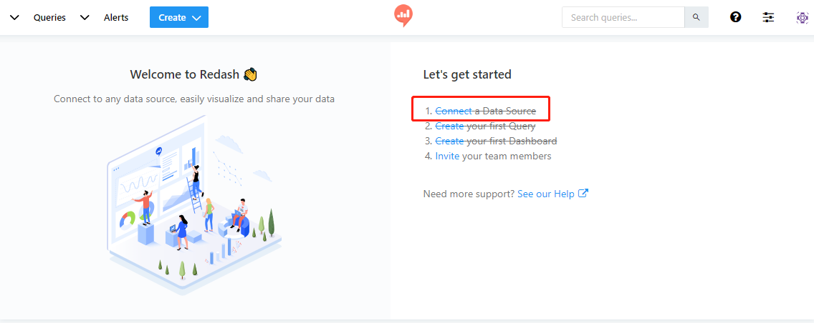
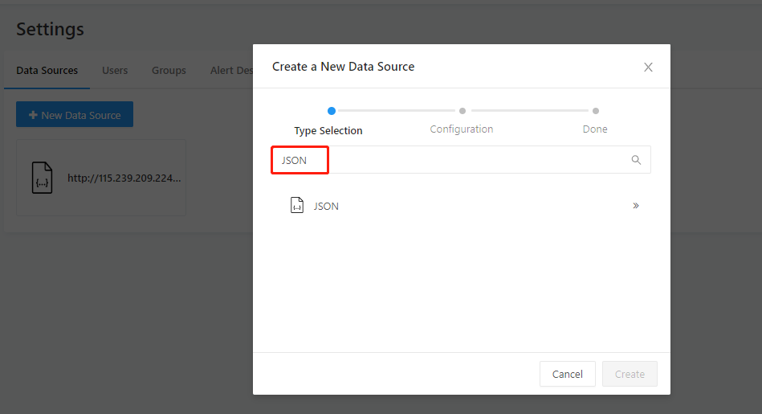
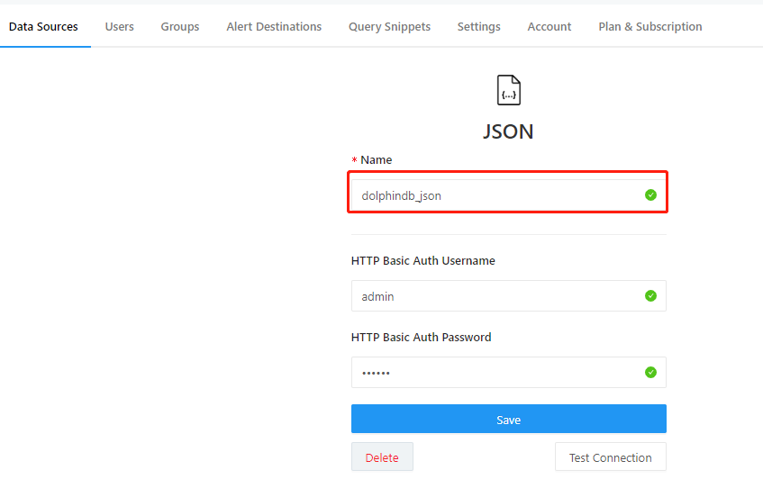
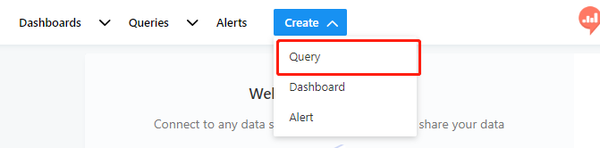
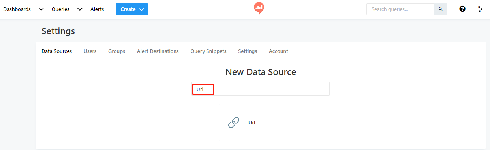
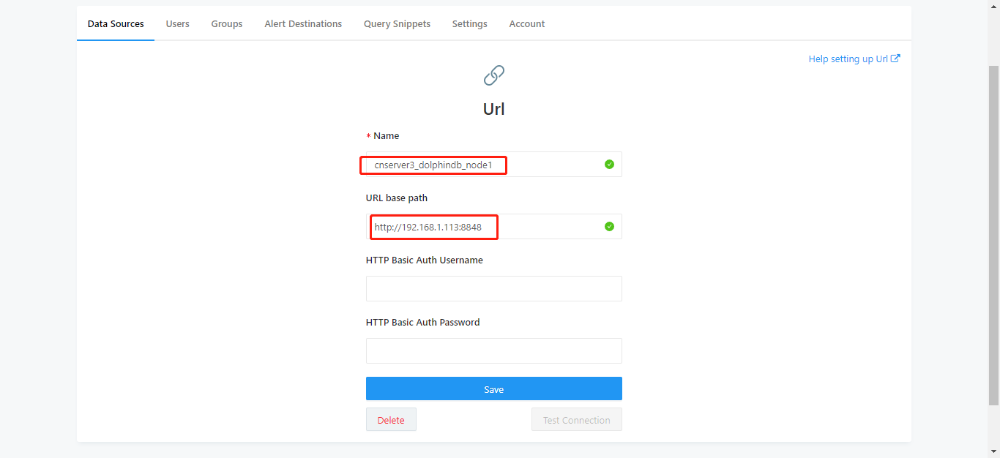

### redash连接DolphinDB数据源的教程
Redash 是一款开源的 BI 工具，提供了基于 web 的数据库查询和数据可视化功能。DolphinDB database 支持http协议的 `POST`和`GET`接口获取数据，所以可以使用redash中对应的`JSON`和`URL`两种数据源来连接DolphinDB。本文详细介绍在redash中配置数据源及查询DolphinDB中的数据的步骤。
#### 1. 使用JSON数据源连接DolphinDB
redash当前仅在线(SAAS)版本中支持JSON数据源，因此使用在线版本的用户，可以选择这种连接方案，这种方案需要DolphinDB也能够通过外网访问。
要使用redash在线版本，需要先到[redash官方网站](https://redash.io)注册并登录。

在首页上可以选择创建数据源，按如下步骤进行配置：
* 选择建立新的数据源

* 选择JSON数据源

* 在Name里配置数据源名称



然后通过Create按钮，创建一个Query：


JSON数据源需要使用yaml格式编辑，
* DolphinDB接口需要query中包含基本的三种元素`url, method, json`
	* url：接受数据的地址，即DolphinDB数据节点，如`http://192.168.1.113:8848`
	* method：http提交方式，JSON接口必须使用post方式, `method: "post"`
	* json：提交的JSON数据，此处DolphinDB接口需要提供固定的key值`client,queries`, 比如：`{client:"redash","queries":"[sql query]"}`，用户可以使用任意的sql语句来替换[sql query]部分。
	* query部分整体Query如下所示：
	```yaml
	url: http://115.239.209.224:18531
	method: "post"
	json: {'client':'redash','queries':'select * from typeTable'}
	```

#### 2. 使用URL数据源连接DolphinDB
redash的url数据源不仅在线版本支持，在开源独立部署的版本上也可以支持。因此，使用独立部署的用户可以通过这种方式来连接DolphinDB。

连接和配置数据源的方式与JSON方式基本相同，在数据源选择时选择URL类型数据源，如下图：

* 在URL中配置数据源名称和路径，`URL Base path`是获取数据的跟地址，配置成DolphinDB的数据节点web地址即可

* 创建一个`new query`,在编辑区以URL参数字符串的形式输入查询内容，查询内容格式上有如下要求：
    * 子路径必须为/json
    * query参数必须包含 : `client`和`queries`两个key，其中`client`指定固定值为`redash`
    * 完整的query内容示例如下：
    ```
    /json?client=redash&queries=select * from typeTable where id between (1..10) 
    ``` 

* 注意事项

    由于redash对url方式的参数要进行编码校验，所以一些特殊字符需要手工做url编码才能通过校验，比如query中出现`://`,`+`,`&`这些字符，需要替换为`%3a%2f%2f`,`%2b`,`%26`才能通过校验。举个例子，DolphinDB中的分布式数据库路径`dfs://dbpath`，需要用url编码替换为`dfs%3a%2f%2fdbpath`才能通过redash的校验，实际代码如下：
    * 需要提交的query:
    ```
    /json?client=redash&queries=login('admin','123456');select avg(ofr-bid) from loadTable('dfs://TAQ','quotes') group by minute(time) as minute  
    ```
    * 那么实际写到redash的编辑器中要替换为:
    ```
    /json?client=redash&queries=login('admin','123456');select avg(ofr-bid) from loadTable('dfs%3a%2f%2fTAQ','quotes') group by minute(time) as minute 
    ```
