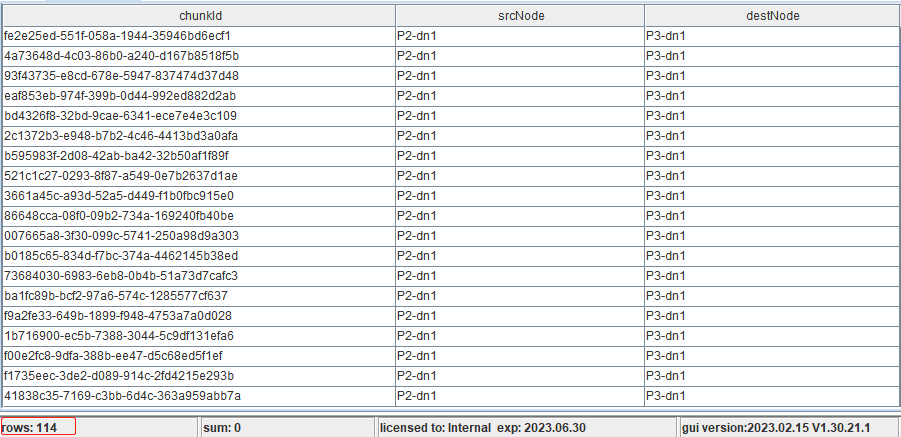
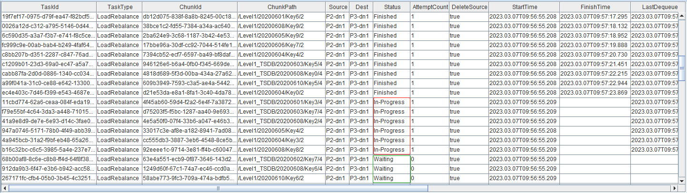
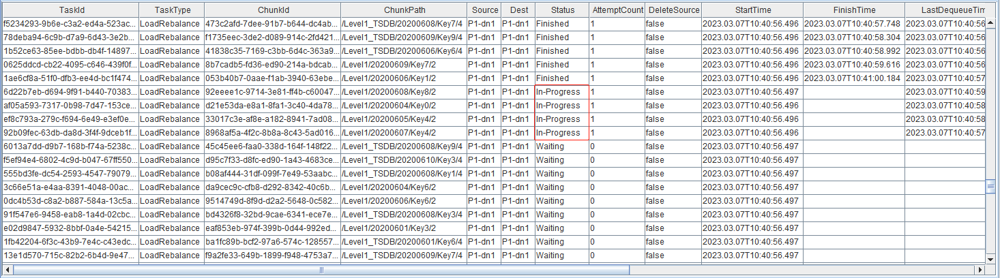
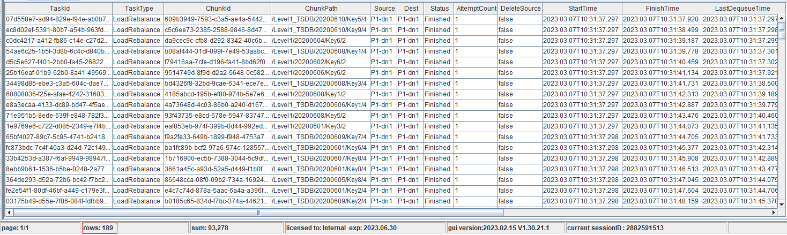

# 数据迁移与平衡

数据迁移再平衡的目标是保证分区副本尽可能均衡分布，副本位置影响着 IO 性能、节点负载，对于数据访问延迟有着较大的影响。近来，越来越多的客户对于数据容量或计算性能提出了更高要求，因而进行了集群扩展，扩展之后如何在新的拓扑之中平衡数据，这是客户必然面临的问题。为此，我们撰写了本文，总结数据迁移再平衡的常见场景与方法。

本教程适用于1.30.17、2.00.5及以上版本。
- [1 概述](#1-概述)
- [2 环境配置与数据模拟](#2-环境配置与数据模拟)
  - [2.1 硬件配置](#21-硬件配置)
  - [2.2 集群配置](#22-集群配置)
  - [2.3 模拟数据](#23-模拟数据)
  - [2.4 注意事项](#24-注意事项)
- [3 函数介绍](#3-函数介绍)
  - [3.1 rebalanceChunksAmongDataNodes](#31-rebalancechunksamongdatanodes)
  - [3.2 rebalanceChunksWithinDataNode](#32-rebalancechunkswithindatanode)
  - [3.3 restoreDislocatedTablet](#33-restoredislocatedtablet)
  - [3.4 moveReplicas](#34-movereplicas)
  - [3.5 moveChunksAcrossVolume](#35-movechunksacrossvolume)
- [4 节点变更场景下的数据迁移](#4-节点变更场景下的数据迁移)
  - [4.1 节点扩容](#41-节点扩容)
  - [4.2 节点扩容时数据迁移性能](#42-节点扩容时数据迁移性能)
  - [4.3 节点缩容](#43-节点缩容)
- [5 磁盘变更场景下的数据迁移](#5-磁盘变更场景下的数据迁移)
  - [5.1 磁盘扩容](#51-磁盘扩容)
  - [5.2 磁盘扩容时数据迁移性能](#52-磁盘扩容时数据迁移性能)
  - [5.3 磁盘缩容](#53-磁盘缩容)
- [6 小结](#6-小结)


## 1 概述

DolphinDB 集群支持扩展节点与存储，以便增强计算能力与数据容量，那么新增的节点与磁盘是没有存储任何数据的，所有数据依旧存储在旧的节点与磁盘。也就是说，不同节点或不同磁盘上的数据分布可能会存在较为严重的倾斜，这样可能会带来几个问题：

- 分布式查询计算子任务无法分配到新增的节点，导致该节点计算资源无法被充分利用；
- 旧的磁盘 IO 压力过大，新增的磁盘 IO 无法被充分利用。

再者，数据依旧存储在旧的磁盘，如果旧的数据库分区存在数据写入或更新，那么旧的磁盘空间占满的几率相对较大，一旦满了会引发多种问题。

所以，节点与存储变更之后的数据迁移与平衡便显得非常必要。后面章节中，将会重点介绍节点与磁盘变更之后的数据迁移与平衡。

## 2 环境配置与数据模拟

### 2.1 硬件配置

测试总共使用三台配置相同的服务器，分别命名为 P1、P2、P3，具体硬件配置如表所示。

| 处理器                                     | 核数 | 内存   | 操作系统                 | 硬盘 |
| :----------------------------------------- | :--- | :----- | :----------------------- | :--- |
| Intel(R) Xeon(R) Silver 4216 CPU @ 2.10GHz | 64   | 512 GB | CentOS Linux release 7.9 | SSD  |

### 2.2 集群配置

DolphinDB Server版本为2.00.9。

基于两台服务器搭建双副本普通集群，假设两台服务器名称分别为 P1、P2，P1 部署一个控制节点、一个代理节点、一个数据节点，P2部署一个代理节点、一个数据节点，如表所示。

| 服务器 | IP             | 端口 | 节点别名 | 节点类型 |
| :----- | :------------- | :--- | :------- | :------- |
| P1     | 192.168.100.4X | 8110 | ctl1     | 控制节点 |
| P1     | 192.168.100.4X | 8111 | P1-agent | 代理节点 |
| P1     | 192.168.100.4X | 8112 | P1-dn1   | 数据节点 |
| P2     | 192.168.100.4X | 8111 | P2-agent | 代理节点 |
| P2     | 192.168.100.4X | 8112 | P2-dn1   | 数据节点 |

节点别名中，`ctl` 为英文单词 `controller` 的缩写，`dn` 为英文单词 `datanode` 的缩写。详细配置情况请参照附件。

### 2.3 模拟数据

模拟数据为上交所 Level-1 快照数据，基于真实数据结构模拟2000只股票快照数据，基于 OLAP 与 TSDB 存储引擎的建库建表、数据模拟、数据插入脚本如下：

```
model = table(1:0, `SecurityID`DateTime`PreClosePx`OpenPx`HighPx`LowPx`LastPx`Volume`Amount`BidPrice1`BidPrice2`BidPrice3`BidPrice4`BidPrice5`BidOrderQty1`BidOrderQty2`BidOrderQty3`BidOrderQty4`BidOrderQty5`OfferPrice1`OfferPrice2`OfferPrice3`OfferPrice4`OfferPrice5`OfferQty1`OfferQty2`OfferQty3`OfferQty4`OfferQty5, [SYMBOL, DATETIME, DOUBLE, DOUBLE, DOUBLE, DOUBLE, DOUBLE, LONG, DOUBLE, DOUBLE, DOUBLE, DOUBLE, DOUBLE, DOUBLE, LONG, LONG, LONG, LONG, LONG, DOUBLE, DOUBLE, DOUBLE, DOUBLE, DOUBLE, LONG, LONG, LONG, LONG, LONG])

// OLAP存储引擎建库建表
dbDate = database("", VALUE, 2020.06.01..2020.06.07)
dbSecurityID = database("", HASH, [SYMBOL, 10])
db = database("dfs://Level1", COMPO, [dbDate, dbSecurityID])
createPartitionedTable(db, model, `Snapshot, `DateTime`SecurityID)

// TSDB存储引擎建库建表
dbDate = database("", VALUE, 2020.06.01..2020.06.07)
dbSymbol = database("", HASH, [SYMBOL, 10])
db = database("dfs://Level1_TSDB", COMPO, [dbDate, dbSymbol], engine="TSDB")
createPartitionedTable(db, model, `Snapshot, `DateTime`SecurityID, sortColumns=`SecurityID`DateTime)

def mockHalfDayData(Date, StartTime) {
    t_SecurityID = table(format(600001..602000, "000000") + ".SH" as SecurityID)
    t_DateTime = table(concatDateTime(Date, StartTime + 1..2400 * 3) as DateTime)
    t = cj(t_SecurityID, t_DateTime)
    size = t.size()
    return  table(t.SecurityID as SecurityID, t.DateTime as DateTime, rand(100.0, size) as PreClosePx, rand(100.0, size) as OpenPx, rand(100.0, size) as HighPx, rand(100.0, size) as LowPx, rand(100.0, size) as LastPx, rand(10000, size) as Volume, rand(100000.0, size) as Amount, rand(100.0, size) as BidPrice1, rand(100.0, size) as BidPrice2, rand(100.0, size) as BidPrice3, rand(100.0, size) as BidPrice4, rand(100.0, size) as BidPrice5, rand(100000, size) as BidOrderQty1, rand(100000, size) as BidOrderQty2, rand(100000, size) as BidOrderQty3, rand(100000, size) as BidOrderQty4, rand(100000, size) as BidOrderQty5, rand(100.0, size) as OfferPrice1, rand(100.0, size) as OfferPrice2, rand(100.0, size) as OfferPrice3, rand(100.0, size) as OfferPrice4, rand(100.0, size) as OfferPrice5, rand(100000, size) as OfferQty1, rand(100000, size) as OfferQty2, rand(100000, size) as OfferQty3, rand(100000, size) as OfferQty4, rand(100000, size) as OfferQty5)
}

def mockData(DateVector, StartTimeVector) {
    for(Date in DateVector) {
        for(StartTime in StartTimeVector) {
            data = mockHalfDayData(Date, StartTime)
 
            // OLAP存储引擎分布式表插入模拟数据
            loadTable("dfs://Level1", "Snapshot").append!(data)
  
            // TSDB存储引擎分布式表插入模拟数据
            loadTable("dfs://Level1_TSDB", "Snapshot").append!(data)
        }   
    }
}

mockData(2020.06.01..2020.06.10, 09:30:00 13:00:00)
```

上述脚本中，我们模拟了2020.06.01至2020.06.10共计十天的数据。基于 OLAP 与 TSDB 两种存储引擎的分区方案是一致的，均采用两级分区，分区粒度为表级分区，一级按天作了 VALUE 分区，二级按 SYMBOL 类型作了10个 HASH 分区。各个数据节点分区数量统计如下：

```
select count(*) from pnodeRun(getAllChunks) where dfsPath like "/Level1%" group by site, type
```

返回结果：

| site   | type | count |
| :----- | :--- | :---- |
| P1-dn1 | 0    | 4     |
| P1-dn1 | 1    | 200   |
| P2-dn1 | 0    | 4     |
| P2-dn1 | 1    | 200   |

其中，type 字段表示分区类别，0表示 File Chunk，1表示 Tablet Chunk。File Chunk 包含 *domain*、*<Table Name>.tbl* 等文件，一个库对应一个 *domain* 文件，一个表对应一个 *tbl* 文件，存储库表结构相关的信息；真正存储数据的区块我们称之为 Tablet Chunk。因为配置了双副本，且在资源允许情况下，副本优先部署在多台物理服务器，所以上述结果符合预期，两个库共计包含408个分区。

### 2.4 注意事项

1. 由于数据迁移再平衡任务比较耗费物理资源，且对于正在写入、修改、删除操作的分区，由于分区锁的占用，会出现迁移失败的情况；对于耗时较长的查询计算任务，由于缓存指向旧的分区路径，可能会出现中途抛出异常。这些属于预期内的正常现象。

    **因此，我们建议无写入、无查询任务执行时进行数据迁移再平衡操作。**
1. 本教程所述的数据迁移方法均为异步操作，并非同步操作。数据迁移任务提交后使用其他工具方法如 `getRecoveryTaskStatus` 查询迁移进度，确认完成后才可执行其他后续操作 (例如缩容)，**切勿在迁移过程中进行扩缩容操作**。

## 3 函数介绍

本教程使用到的再平衡与数据迁移相关函数介绍如下，以下所有函数均须在控制节点执行，仅管理员用户拥有权限。

### 3.1 rebalanceChunksAmongDataNodes

**函数定义**

rebalanceChunksAmongDataNodes([exec=false])

**功能描述**

集群之中所有数据节点之间的分区再平衡。

**参数含义**

exec：默认值为 false，仅根据再平衡算法预估分区迁移结果，并不真正执行；为 true，才会执行迁移。

**平衡算法**

平衡算法存在一些假定条件，诸如：

- 旧盘所有已使用空间均是被分区数据占用；
- 每个分区大小一致，而实际可能存在偏差；
- 新盘所有空间均是用来存储分区数据用的；

实际情况与假定条件存在一定的误差，如：磁盘除了存放 DolphinDB 数据外存了不少其它内容，分区大小倾斜严重等，可能会导致再平衡结果不够理想。初次执行再平衡后，旧盘、新盘磁盘空间、分区大小等均发生了变化，多次执行再平衡，可以在一定程度上优化再平衡效果。

### 3.2 rebalanceChunksWithinDataNode

**函数定义**

rebalanceChunksWithinDataNode(nodeAlias, [exec=false])

**功能描述**

集群之中某个数据节点内部、不同磁盘之间的数据再平衡。

**参数含义**

nodeAlias：字符串，表示节点别名。

exec：默认值为 false，仅根据再平衡算法预估分区迁移结果，并不真正执行；为 true，才会执行迁移。

**平衡算法**

同上一小节。

### 3.3 restoreDislocatedTablet

**函数定义**

restoreDislocatedTablet()

**功能描述**

当配置分区粒度为表级分区时，同一个分区的所有表将分布在相同的节点下。当调用函数 `rebalanceChunksAmongDataNodes` 进行数据平衡时，若出现节点宕机或离线，可能出现同一个分区里部分表的数据转移成功，部分表的数据转移失败的情况，即同一个分区下的不同表会分布在不同的节点。该函数可以修复此问题，将同一个分区里的表转移到同一个节点下。

### 3.4 moveReplicas

**函数定义**

moveReplicas(srcNode, destNode, chunkId)

**功能描述**

将源节点上一个或多个分区副本迁移至目标节点。

**参数含义**

srcNode：字符串，表示源节点别名。

destNode：字符串，表示目标节点别名。

chunkId：字符串/UUID 标量或向量，表示分区 ID。

### 3.5 moveChunksAcrossVolume

**函数定义**

moveChunksAcrossVolume(srcPath, destPath, chunkIds, [isDelSrc=true])

**功能描述**

将磁盘卷源路径下一个或多个分区文件转移至目标路径。

**参数含义**

srcPath：源分区文件路径。

destPath：目标分区文件路径。

chunkIds：分区 ID。

isDelSrc：拷贝成功后是否删除源分区。

## 4 节点变更场景下的数据迁移

本章节针对节点扩容、缩容场景下的分区平衡或数据迁移以示例的形式展开介绍。

### 4.1 节点扩容

增加一台服务器，名称为 P3，部署一个代理节点、一个数据节点，如表所示。

| 服务器 | IP             | 端口 | 节点别名 | 节点类型 |
| :----- | :------------- | :--- | :------- | :------- |
| P3     | 192.168.100.4X | 8111 | P3-agent | 代理节点 |
| P3     | 192.168.100.4X | 8112 | P3-dn1   | 数据节点 |

首先，在数据节点上执行以下命令：

```
rpc(getControllerAlias(), rebalanceChunksAmongDataNodes{ false })
```

返回预估分区迁移结果，如图所示，预估 P1-dn1、P2-dn1 共有114个分区迁移至 P3-dn1。



然后，在数据节点上执行以下命令，真正地执行分区再平衡。

```
rpc(getControllerAlias(), rebalanceChunksAmongDataNodes{ true })
```

在数据节点上执行以下命令，查看再平衡任务执行进度与任务并发度。

```
rpc(getControllerAlias(), getRecoveryTaskStatus)
rpc(getControllerAlias(), getConfigure{ `dfsRebalanceConcurrency })
pnodeRun(getRecoveryWorkerNum)
```



任务执行进度如图所示。可以看到，`DeleteSource `字段全部为 True，原因为对于数据节点之间分区再平衡，从源数据节点到目的数据节点复制完成后，该参数会被置为 True，源数据节点会删除相应副本信息。

`Status`字段为 In-Progress 的任务数目表示控制节点发起任务时的并发度，通过 *dfsRebalanceConcurrency* 参数配置，默认为数据节点个数的两倍。[*recoveryWorkers* ](https://www.dolphindb.cn/cn/help/DatabaseandDistributedComputing/Configuration/ConfigParamRef.html?highlight=recoveryWorkers#id21)参数表示数据节点执行任务时的并发度，默认为1。

`Status` 字段为 Finished，表示该任务已经完成。等待所有任务执行完毕后，在数据节点上执行以下命令，查看再平衡后各个数据节点分区数量统计。

```
select count(*) from pnodeRun(getAllChunks) group by site
```

返回结果：

| site   | count |
| :----- | :---- |
| P1-dn1 | 196   |
| P2-dn1 | 98    |
| P3-dn1 | 114   |

### 4.2 节点扩容时数据迁移性能

在数据节点上执行以下命令，统计再平衡整体耗时。

```
select max(FinishTime - StartTime) as maxDiffTime from rpc(getControllerAlias(), getRecoveryTaskStatus)
```

返回结果：89秒。114个分区占用磁盘空间约17GB，节点之间再平衡时数据迁移速度约为200MB/s。

| 场景             | 是否跨服务器 | 网络 | 硬盘 | 任务发起并发度 | 任务执行并发度 | 迁移速率（MB/s） |
| :--------------- | :----------- | :--- | :--- | :------------- | :------------- | :--------------- |
| 节点之间分区迁移 | 是           | 万兆 | SSD  | 6              | 6              | 200              |

### 4.3 节点缩容

我们将缩减上一小节中增加的服务器 P3，缩减之前，需要将 P3-dn1 数据节点上的分区副本迁移至集群中其它数据节点上。

自定义 `moveChunks` 函数，入参为一个源节点名称，内部实现依赖 `moveReplicas` 函数，迁移源节点上所有分区副本至其它节点上。在数据节点上执行以下命令，执行迁移操作。

```
def moveChunks(srcNode) {
    chunks = exec chunkId from pnodeRun(getAllChunks) where site = srcNode
    allNodes = pnodeRun(getNodeAlias).node
    for(chunk in chunks) {
        destNode = allNodes[at(not allNodes in (exec site from pnodeRun(getAllChunks) where chunkId = chunk))].rand(1)[0]
        print("From " + srcNode + ", to " + destNode + ", moving " + chunk)
        rpc(getControllerAlias(), moveReplicas, srcNode, destNode, chunk)
    }
}

srcNode = "P3-dn1"
moveChunks(srcNode)
```

在数据节点上执行以下命令，查看迁移进度。

```
rpc(getControllerAlias(), getRecoveryTaskStatus)
```

等待所有任务执行完毕后，在数据节点上执行以下命令，查看迁移后各个数据节点分区数量统计。

```
select count(*) from pnodeRun(getAllChunks) group by site
```

返回结果：

| site   | count |
| :----- | :---- |
| P1-dn1 | 204   |
| P2-dn1 | 204   |

此时，P3-dn1 数据节点上已不包含任何分区副本，可以进行节点缩减。

## 5 磁盘变更场景下的数据迁移

本章节针对磁盘扩容、缩容场景下的分区平衡或数据迁移以示例的形式展开介绍。

### 5.1 磁盘扩容

对于每个数据节点增加一块磁盘。配置文件中 `volumes` 参数由

```
volumes=/ssd/ssd0/jtwang/chunkData
```

更改为：

```
volumes=/ssd/ssd0/jtwang/chunkData,/ssd/ssd1/jtwang/chunkData
```

在数据节点上执行以下命令，对于 P1-dn1 数据节点上各块磁盘之间进行分区再平衡。

```
rpc(getControllerAlias(), rebalanceChunksWithinDataNode{ "P1-dn1", false })
rpc(getControllerAlias(), rebalanceChunksWithinDataNode{ "P1-dn1", true })
```

在数据节点上执行以下命令，查看迁移进度。

```
rpc(getControllerAlias(), getRecoveryTaskStatus)
```



同样地，在数据节点上执行以下命令，对于 P2-dn1 数据节点上各块磁盘之间进行分区再平衡。

```
rpc(getControllerAlias(), rebalanceChunksWithinDataNode{ "P2-dn1", false })
rpc(getControllerAlias(), rebalanceChunksWithinDataNode{ "P2-dn1", true })
```

在数据节点上执行以下命令，查看迁移进度。

```
rpc(getControllerAlias(), getRecoveryTaskStatus)
```



从图中看，两次再平衡共计迁移189个分区。可以看到，`DeleteSource` 字段全部为 False，原因为对于数据节点内部分区迁移，从旧盘到新盘，分区仍然是在同一个数据节点，所以该参数一直为 False。

等待所有任务执行完毕后，在数据节点上执行以下命令，查看迁移后各个数据节点各块磁盘的分区数量统计。

```
def getDiskNo(path) {
    size = path.size()
    result = array(STRING, 0, size)
    for(i in 0 : size) { append!(result, concat(split(path[i], "/")[0:5], "/")) }
    return result
}

select count(*) from pnodeRun(getAllChunks) group by site, getDiskNo(path) as disk
```

返回结果：

| site   | disk                       | count |
| :----- | :------------------------- | :---- |
| P1-dn1 | /ssd/ssd0/jtwang/chunkData | 108   |
| P1-dn1 | /ssd/ssd1/jtwang/chunkData | 96    |
| P2-dn1 | /ssd/ssd0/jtwang/chunkData | 111   |
| P2-dn1 | /ssd/ssd1/jtwang/chunkData | 93    |

### 5.2 磁盘扩容时数据迁移性能

P1-dn1 数据节点上各块磁盘之间分区再平衡之后，在数据节点上执行以下命令，统计再平衡整体耗时。

```
select max(FinishTime - StartTime) as maxDiffTime from rpc(getControllerAlias(), getRecoveryTaskStatus)
```

返回结果：56秒。96个分区占用磁盘空间约14GB，节点内部再平衡时数据迁移速度约为250MB/s。

| 场景             | 是否跨服务器 | 网络 | 硬盘 | 任务发起并发度 | 任务执行并发度 | 迁移速率（MB/s） |
| :--------------- | :----------- | :--- | :--- | :------------- | :------------- | :--------------- |
| 磁盘之间分区迁移 | 否           | 万兆 | SSD  | 4              | 4              | 250              |

### 5.3 磁盘缩容

我们将缩减上一小节中增加的磁盘，缩减之前，需要将各个数据节点新增的磁盘上的分区副本迁移至其它磁盘。

在数据节点上执行以下命令，将 P1-dn1、P2-dn1 数据节点 `ssd1` 盘上的分区迁移至 `ssd0` 盘。

```
srcPath = "/ssd/ssd1/jtwang/chunkData/CHUNKS"
destPath = "/ssd/ssd0/jtwang/chunkData/CHUNKS"

node = "P1-dn1"
chunkIds = exec chunkId from pnodeRun(getAllChunks) where site = node, path like (srcPath + "%")
rpc(node, moveChunksAcrossVolume{ srcPath, destPath, chunkIds, isDelSrc=true })

node = "P2-dn1"
chunkIds = exec chunkId from pnodeRun(getAllChunks) where site = node, path like (srcPath + "%")
rpc(node, moveChunksAcrossVolume{ srcPath, destPath, chunkIds, isDelSrc=true })
```

在数据节点上执行以下命令，查看迁移后各个数据节点各块磁盘的分区数量统计。

```
select count(*) from pnodeRun(getAllChunks) group by site, getDiskNo(path) as disk
```

返回结果：

| site   | disk                       | count |
| :----- | :------------------------- | :---- |
| P1-dn1 | /ssd/ssd0/jtwang/chunkData | 204   |
| P2-dn1 | /ssd/ssd0/jtwang/chunkData | 204   |

此时，各个数据节点 `ssd1` 盘上已不包含任何分区副本，可以进行磁盘缩容。

## 6 小结

节点与磁盘的扩容和缩容，是生产环境中比较常见的场景。通过对此类场景的模拟和解决方案的实现，我们展示了 DolphinDB 强大、便捷的数据迁移与平衡能力，解决了集群扩展之后如何优化资源使用的问题。

## 附件

 [data_move_rebalance](script/data_move_rebalance) 
