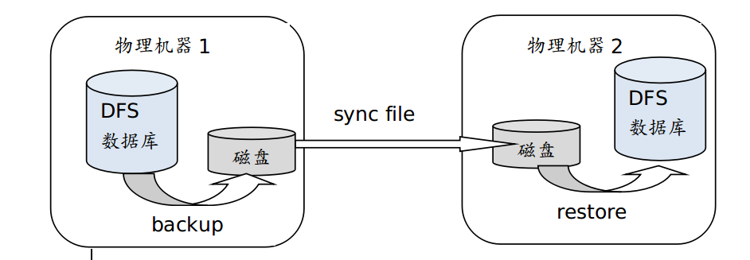
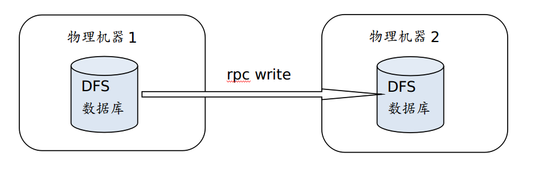

# DolphinDB 集群间数据库同步

DolphinDB 提供离线方式和在线方式实现不同集群间 DFS 数据库的同步：
* 离线方式：通过数据库备份和恢复功能实现数据同步；
* 在线方式：通过建立在线连接，从一个数据库中读取数据然后写入另一个数据库中。

## 1. 离线方式
  
使用离线方式同步集群间数据库的主要步骤如下：

1. 使用 [backup](https://www.dolphindb.cn/cn/help/FunctionsandCommands/FunctionReferences/b/backup.html) 函数将数据库中的数据备份到系统磁盘；
2. 通过网络传输，将备份数据同步到远端磁盘；
3. 使用 [restore](https://www.dolphindb.cn/cn/help/FunctionsandCommands/FunctionReferences/r/restore.html) 函数将备份数据恢复到另一个数据库中。

  

### 1.1 数据备份
通过 [backup](https://www.dolphindb.cn/cn/help/FunctionsandCommands/FunctionReferences/b/backup.html) 函数将需要同步的数据表备份到磁盘上，可使用 SQL 元代码指定需要同步的数据。示例如下：  

示例1：备份数据库 db1 中表 mt 的所有数据。
```
backupDir = "/hdd/hdd1/backDir"
backup(backupDir,<select * from loadTable("dfs://db1","mt")>)
```

示例2：备份数据库 db1 中表 mt 的最近7天的数据，假设时间分区字段是 “TradingDay”(DATE类型)。
```
backupDir = "/hdd/hdd1/backDir"	
backup(backupDir,<select * from loadTable("dfs://db1","mt") where TradingDay > date(now()) - 7 and  TradingDay <= date(now())>)
```

示例3：备份数据库 db1中表 mt 的某些列 ("col1", "col2", "col3") 的数据。
```
backupDir = "/hdd/hdd1/backDir"
backup(backupDir,<select col1,col2,col3 from loadTable("dfs://db1","mt")>)
```

更多相关语句请参考 [DolphinDB 元编程教程](./meta_programming.md)。

### 1.2 离线数据同步
在本地集群完成数据备份后，将备份数据通过移动存储设备、系统命令、同步软件等方式传输到远端磁盘。此处介绍通过系统命令进行数据传输的方式。

DolphinDB 支持 shell 命令，可利用 Linux 操作系统提供的文件同步手段来同步目录，例如 rsync 或者 scp 命令。其中 rsync 是 Linux 系统中的常用命令，可以高效同步发生变化的文件。

示例4：通过配置 ssh 免密登录执行同步命令，将一台机器中的 *backupDir* 目录下所有发生变化的文件同步到另一台机器的 *restoreDir* 目录下。
```
cmd = "rsync -av  " + backupDir + "/*  " + userName + "@" + restoreIP + ":" + restoreDir 
shell(cmd)
```
其中，“username” 是通过 ssh 登录的用户名；“restoreIP” 是通过 ssh 登录的远程机器的 IP 地址。

> 注意：也可通过其他服务器同步工具实现同步。

### 1.3 数据恢复
实现数据同步后，使用 DolphinDB 内置的 `restore` 函数恢复 *restoreDir* 目录中的所需数据。数据恢复脚本需在待恢复的服务器上执行。

注意： 使用 `restore` 函数恢复备份数据时，需要提前创建与备份数据库名相同的数据库。

示例5：将表 mt 从服务器1的数据库 db1 恢复到服务器2的数据库 db1。
```
restore(backupDir=restoreDir,dbPath="dfs://db1",tableName="mt",partition="%",force=true,outputTable=loadTable("dfs://db1","mt"))
```
通过参数 *partition* 可以指定待恢复的分区。详细参考教程[数据备份与恢复](./restore-backup.md)。

### 1.4 具体实例
DolphinDB 集群 A 和 B 部署在不同的物理机器上，将集群 A 中的数据库 db1 中表 mt 的当天所有数据，在每天的22:30（以集群 B 所在物理机器的系统时间为准）同步到集群 B 上。其中，数据库 db1的分区类型为 VALUE ，按天分区，分区字段为 Timestamp（类型为 TIMESTAMP）。   

示例6：

本脚本应在 B 集群，即需要恢复数据的集群上执行。
```
def syncDataBases(backupNodeIP,backupNodePort,backupDir,restoreServerIP, userName,restoreDir){
	conn = xdb(backupNodeIP,backupNodePort)
	conn(login{`admin,`123456})
	conn(backup{backupDir,<select * from loadTable("dfs://db1","mt") where Timestamp > timestamp(date(now())) and Timestamp < now()>})
	cmd = "rsync -av  " + backupDir + "/*  " + userName + "@" + restoreServerIP + ":" + restoreDir 
	conn(shell{cmd})
	restore(restoreDir,"dfs://db1","mt","%",true,loadTable("dfs://db1","mt"))
}

login(`admin,`123456)
//配置备份节点的 IP 地址，端口，以及备份机器上的目录（空目录）。
backupNodeIP = '115.239.209.234' 
backupNodePort = 18846
backupDir = "/home/myselfTest/backupDir"
//配置恢复数据节点的 IP 地址，由备份机器到恢复机器的 ssh 登录用户名（机器间应配置好 ssh 免密登录），以及恢复节点上的目录（空目录）。
restoreServerIP = '115.239.209.234'
userName = 'user1'
restoreDir = "/home/myselfTest/backupDir"
```

可执行以下函数触发备份：
```
syncDataBases(backupNodeIP=backupNodeIP,backupNodePort=backupNodePort,backupDir=backupDir,restoreServerIP=restoreServerIP, userName=userName,restoreDir=restoreDir)
```
也可通过 [scheduleJob](https://www.dolphindb.cn/cn/help/FunctionsandCommands/FunctionReferences/s/scheduleJob.html) 指定每天22:30定时执行
```
scheduleJob("syncDB","syncDB",syncDataBases{backupNodeIP,backupNodePort,backupDir,restoreServerIP, userName,restoreDir},22:30m,2019.01.01,2030.12.31,'D')
```

## 2. 在线方式

### 2.1 数据在线同步

在线方式要求两个集群同时在线并建立 socket 连接。集群2读取集群1中的数据后写入集群2中的数据库。如下图所示：

 


### 2.2 具体示例
本例沿用1.4小节的条件设置，假设两种场景，一种是集群 B 所在物理机器的内存足够容纳当天数据，另一种是其内存不能容纳当天数据。

示例7：内存足够容纳当天数据。脚本在备份节点执行，从集群 A 中的数据库中读取当天的数据，并远程写入到恢复节点所在的集群 B 的数据库中。
```
def writeData(dbName,tableName,t) : loadTable(dbName,tableName).append!(t)
def synDataBaseOnline(restoreServerIP,restoreServerPort,writeData=writeData){
	t = select * from loadTable("dfs://db1","mt") where Timestamp > timestamp(date(now())) and Timestamp < now()
	conn = xdb(restoreServerIP,restoreServerPort)
	conn(login{`admin,`123456})
	conn(writeData{"dfs://db1","mt",t})
}
login(`admin,`123456)
restoreServerIP = '115.239.209.234'
restoreServerPort = 18848
synDataBaseOnline(restoreServerIP=restoreServerIP,restoreServerPort=restoreServerPort)
```
示例8：

内存不能容纳当天数据时，使用上述脚本可能会导致 OOM。可使用 [sqlDS](https://www.dolphindb.cn/cn/help/FunctionsandCommands/FunctionReferences/s/sqlDS.html) 将备份数据按分区生成多个数据源，通过 [mr](https://www.dolphindb.cn/cn/help/FunctionsandCommands/FunctionReferences/m/mr.html) 函数将数据源逐个写入远程数据库。
```
def writeData(dbName,tableName,t) : loadTable(dbName,tableName).append!(t)
def writeRemoteDB(t, ip, port, dbName,tableName,writeData){
	conn = xdb(ip, port)
	conn(login{`admin,`123456})
	remoteRun(conn,writeData,dbName,tableName,t)
}
def synDataBaseOnline(ip, port){
	ds = sqlDS(<select * from loadTable("dfs://db1","mt") where Timestamp > timestamp(date(now())) and Timestamp < now()>)
	mr(ds, writeRemoteDB{,ip,port,"dfs://db1","mt",writeData},,, false)
}
login(`admin,`123456)
restoreServerIP = '115.239.209.234'
restoreServerPort = 18848
```
可执行以下函数触发备份：
```
synDataBaseOnline(restoreServerIP,restoreServerPort)
```
也可通过 `scheduleJob` 指定每天22:30定时执行
```
scheduleJob("syncDB","syncDB",synDataBaseOnline{restoreServerIP,restoreServerPort},22:30m,2019.01.01,2030.12.31,'D')
```
在示例8中，`mr` 函数的参数 *parallel* 设为 false，为避免占用过多内存不采用并行执行。如果用户在实际操作中内存条件允许，可设置为 true 以提高效率。

## 3. 两种方式对比

|              | 在线方式     | 离线方式     |
| ------------ | ------------ | ----------- |
| **性能**    | 性能较优。需要同步的数据通过网络传输到远端并写入远端数据库。|需要把数据备份到磁盘上，通过网络传输到远端的磁盘，再读取数据并写入数据库。性能低于在线方式。|
| **内存要求** |内存要求较低。若服务器可用内存不足以容纳备份数据，可使用 `mr` 函数分次写入。| 以分区为单位进行备份。因此要求内存必须容纳每个分区的完整数据。|
| **磁盘占用** |不需要额外占用磁盘空间。|需要将两个集群存盘，占用更多的磁盘空间。|
| **其它方面** |需要两个集群同时在线。|不需要两个集群同时在线。如集群间无网络连接，可使用本方式同步数据。|