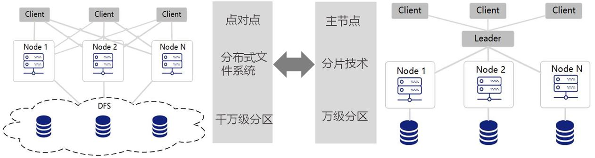
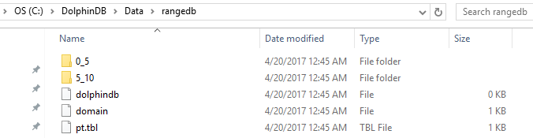
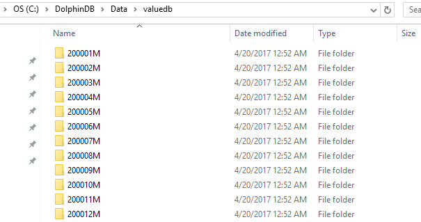
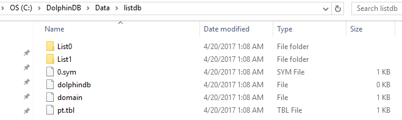
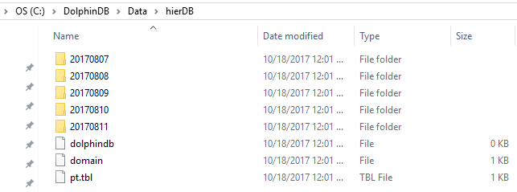
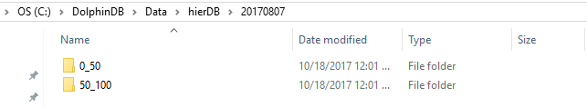

## DolphinDB教程：分区数据库

  - [1. 为什么对数据库进行分区](#1-为什么对数据库进行分区)
  - [2. DolphinDB分区和基于MPP架构的数据存储的区别](#2-dolphindb分区和基于mpp架构的数据存储的区别)
  - [3. 分区类型](#3-分区类型)
  - [4. 分区设计注意事项](#4-分区设计注意事项)
  - [5. 导入数据到分布式数据表](#5-导入数据到分布式数据表)
  - [6. 数据重分区和复制DFS表](#6-数据重分区和复制dfs表)
  - [7. 查询分区表注意事项](#7-查询分区表注意事项)

### 1. 为什么对数据库进行分区

对数据库进行分区可以显著降低系统响应延迟，提高数据吞吐量。具体来说，分区有以下主要好处。
* 分区使得大型表更易于管理。对数据子集的维护操作也更加高效，因为这些操作只针对需要的数据而不是整个表。一个好的分区策略通过只读取查询所需的相关数据来减少要扫描的数据量。如果分区机制设计不合理，对数据库的查询、计算以及其它操作都可能受到磁盘访问I/O这个瓶颈的限制。
* 分区使得系统可以充分利用所有资源。选择一个良好的分区方案搭配并行计算，分布式计算可以充分利用所有节点来完成通常要在一个节点上完成的任务。若一个任务可以拆分成几个子任务，每个子任务访问不同的分区，可以显著提升效率。


### 2. DolphinDB分区和基于MPP架构的数据存储的区别

MPP(Massive Parallel Processing) 是目前主流数据仓库普遍采用的一种方案, 包括开源软件Greenplum，云数据库AWS Redshift等。MPP有一个主节点，每个客户端都连接到这个主节点。DolphinDB在数据库层面不存在主节点，是点对点结构，每个客户端可以连接到任何一个数据节点，不会出现主节点瓶颈问题。

MPP一般通过哈希规则，将数据分布到各个节点上（水平分割），在各个节点内部再进行分区（垂直分割）。哈希时容易出现各个节点数据分布不均匀的问题。DolphinDB将各个节点的存储空间交给内置的分布式文件系统（DFS）统一进行管理，分区的规则与分区的存储位置解耦，数据分割不再按水平和垂直两个步骤进行，而是进行全局优化。这样一来，分区的粒度更细更均匀，在计算时能充分的利用集群的所有计算资源。

由于分布式文件系统具有强大的分区管理、容错、复制机制，以及事务管理机制，DolphinDB的单表能轻松的支持百万级别的分区。若每个分区有1GB的数据，就可实现PB级数据的存储和快速查询。另外，通过引入DFS，数据库的存储和数据库节点相分离，使得DolphinDB在集群水平扩展（新增节点）上更加方便。



### 3. 分区类型

DolphinDB database 支持多种分区类型： 范围分区、哈希分区、值分区、列表分区与复合分区。选择合适的分区类型，有助于用户根据业务特点对数据进行均匀分割。
  *  范围分区对每个分区区间创建一个分区。
  *  哈希分区利用哈希函数对分区列操作，方便建立指定数量的分区。
  *  值分区每个值创建一个分区，例如股票交易日期、股票交易月等。
  *  列表分区是根据用户枚举的列表来进行分区，比值分区更加灵活。
  *  复合分区适用于数据量特别大而且SQL where或group by语句经常涉及多列。可使用2个或3个分区列，每个分区选择都可以采用区间、值、哈希或列表分区。例如按股票交易日期进行值分区， 同时按股票代码进行范围分区。

创建一个新的分布式数据库时，需要在`database`函数中指定数据库路径directory，分区类型partitionType以及分区模式partitionScheme。重新打开已有的分布式数据库时，只需指定数据库路径。不允许用不同的分区类型或分区方案覆盖已有的分布式数据库。

聚合函数在分区表上利用分区列操作时，例如当group by列与分区列一致时，运行速度特别快。

为了学习方便， 以下分区例子使用Windows本地目录，用户可以将数据库创建使用的路径改成Linux或DFS目录。

调用 database 函数前，用户必须先登录，只有具有 DB_OWNER 或 admin 管理员权限才能创建数据库。默认的 admin 管理员登录脚本为：

```
login(userId=`admin, password=`123456)
```

下文提供的所有创建数据库脚本，默认已经登录。

#### 3.1 范围(RANGE)分区

在范围分区中，分区由区间决定，而区间由分区向量的任意两个相邻元素定义。区间包含起始值，但不包含结尾值。

在下面的例子中，数据库db有两个分区：[0,5)和[5,10)。使用ID作为分区列，并使用函数`append!`在数据库db中保存表t为分区表pt。

```
n=1000000
ID=rand(10, n)
x=rand(1.0, n)
t=table(ID, x)
db=database("dfs://rangedb", RANGE,  0 5 10)

pt = db.createPartitionedTable(t, `pt, `ID)
pt.append!(t)

pt=loadTable(db,`pt)
select count(x) from pt;
```

磁盘目录结构



范围分区创建后，可使用`addRangePartitions`函数来追加分区。细节参见用户手册。

#### 3.2 哈希(HASH)分区

哈希分区对分区列使用哈希函数以产生分区。哈希分区是产生指定数量的分区的一个简便方法。但是要注意，哈希分区不能保证分区的大小一致，尤其当分区列的值的分布存在偏态的时候。此外，若要查找分区列中一个连续范围的数据时，哈希分区的效率比范围分区或值分区要低。

在下面的例子中，数据库db有两个分区。使用ID作为分区列，并使用函数`append!`在数据库db中保存表t为分区表pt。

```
n=1000000
ID=rand(10, n)
x=rand(1.0, n)
t=table(ID, x)
db=database("dfs://hashdb", HASH,  [INT, 2])

pt = db.createPartitionedTable(t, `pt, `ID)
pt.append!(t)

pt=loadTable(db,`pt)
select count(x) from pt;
```

#### 3.3  值(VALUE)分区

在值域（VALUE）分区中，一个值代表一个分区。

```
n=1000000
month=take(2000.01M..2016.12M, n)
x=rand(1.0, n)
t=table(month, x)

db=database("dfs://valuedb", VALUE, 2000.01M..2016.12M)

pt = db.createPartitionedTable(t, `pt, `month)
pt.append!(t)

pt=loadTable(db,`pt)
select count(x) from pt;
```

上面的例子定义了一个具有204个分区的数据库db。每个分区是2000年1月到2016年12月之间的一个月(如下图）。在数据库db中，表t被保存为分区表pt，分区列为month。



值分区创建后，可使用`addValuePartitions`函数来追加分区。细节参见用户手册。

#### 3.4 列表(LIST)分区

在列表（LIST）分区中，我们用一个包含多个元素的列表代表一个分区。

```
n=1000000
ticker = rand(`MSFT`GOOG`FB`ORCL`IBM,n)
x=rand(1.0, n)
t=table(ticker, x)

db=database("dfs://listdb", LIST, [`IBM`ORCL`MSFT, `GOOG`FB])
pt = db.createPartitionedTable(t, `pt, `ticker)
pt.append!(t)

pt=loadTable(db,`pt)
select count(x) from pt;
```
上面的数据库有2个分区。第一个分区包含3个股票代号，第二个分区包含2个股票代号。



#### 3.5 组合(COMPO)分区

组合（COMPO）分区可以定义2或3个分区列。每列可以独立采用范围(RANGE)、值(VALUE)、哈希(HASH)或列表(LIST)分区。组合分区的多个列在逻辑上是并列的，不存在从属关系或优先级关系。

```
n=1000000
ID=rand(100, n)
dates=2017.08.07..2017.08.11
date=rand(dates, n)
x=rand(10.0, n)
t=table(ID, date, x)

dbDate = database(, VALUE, 2017.08.07..2017.08.11)
dbID=database(, RANGE, 0 50 100)
db = database("dfs://compoDB", COMPO, [dbDate, dbID])

pt = db.createPartitionedTable(t, `pt, `date`ID)
pt.append!(t)

pt=loadTable(db,`pt)
select count(x) from pt;
```

值域有5个分区：



在20170807这个分区中，有2个区间域(RANGE)分区：




若组合分区有一列为值分区，创建后可使用`addValuePartitions`函数来追加分区。细节参见用户手册。


### 4. 分区设计注意事项

分区的总原则是让数据管理更加高效，提高查询和计算的性能，达到低延时和高吞吐量。下面是设计和优化分区表的需要考虑的因素，以供参考。

#### 4.1 选择合适的分区字段

在DolphinDB中，可以用于分区的数据类型包括整型(CHAR, SHORT, INT)，日期类型(DATE, MONTH, TIME, MINUTE, SECOND, DATETIME, DATEHOUR)，以及STRING与SYMBOL。除此之外，哈希分区还支持LONG, UUID, IPADDR, INT128类型。虽然STRING可作为分区列，但为了性能考虑，建议将STRING转化为SYMBOL再用于分区列。

FLOAT和DOUBLE数据类型不可作为分区字段。
```
db=database("dfs://rangedb1", RANGE,  0.0 5.0 10.0)
```
会产生出错信息：DOUBLE数据类型的字段不能作为分区字段
```
The data type DOUBLE can't be used for a partition column
```

虽然DolphinDB支持对TIME, SECOND, DATETIME类型字段的分区，但是在实际使用中要尽量避免对这些数据类型采用值分区，以免分区粒度过细，将耗费大量时间创建或查询百万级以上的很小的分区。例如下面这个例子就会产生过多的分区。序列：2012.06.01T09:30:00..2012.06.30T16:00:00包含2,529,001个元素。如果用这个序列进行值分区，将会在磁盘上产生2,529,001个分区，即2,529,001个文件目录和相关文件，从而使得分区表创建、写入、查询都非常缓慢。

分区字段应当在业务中，特别是数据更新的任务中有重要相关性。譬如在证券交易领域，许多任务都与股票交易日期或股票代码相关，因此以这两个字段来分区比较合理。更新数据库时，DolphinDB的事务机制（在5.2中会提到）不允许多个writer的事务在分区上有重叠。鉴于经常需要对某个交易日或某只股票的数据进行更新，若采用其它分区字段（例如交易时刻），有可能造成多个writer同时对同一分区进行写入而导致问题。

一个分区字段相当于数据表的一个物理索引。如果查询时用到了该字段做数据过滤，SQL引擎就能快速定位需要的数据块，而无需对整表进行扫描，从而大幅度提高处理速度。因此，分区字段应当选用查询和计算时经常用到的过滤字段。


#### 4.2 分区粒度不要过大

一个分区内的多个列以文件形式独立存储在磁盘上，通常数据是经过压缩的。使用的时候，系统从磁盘读取所需要的列，解压后加载到内存。若分区粒度过大，可能会造成多个工作线程并行时内存不足，或者导致系统频繁地在磁盘和工作内存之间切换，影响性能。一个经验公式是，若数据节点的可用内存是S，工作线程（worker）的的数量是W，建议每个分区解压后在内存中的大小不超过S/8W。假设工作内存上限为32GB，并有8个工作线程，建议单个分区解压后的大小不超过512MB。

DolphinDB的子任务以分区为单位。因此分区粒度过大会造成无法有效利用多节点多分区的优势，将本来可以并行计算的任务转化成了顺序计算任务。

DolphinDB是为OLAP的场景优化设计的，支持添加数据，不支持对个别行进行删除或更新。如果要修改数据，需以分区为单位替换全部数据。如果分区过大，会降低效率。DolphinDB在节点之间复制副本数据时，同样以分区为单位，若分区过大，则不利于数据在节点之间的复制。

综上各种因素，建议一个分区未压缩前的原始数据大小不超过1GB。当然这个限制可结合实际情况调整。譬如在大数据应用中，经常有宽表设计，一个表有几百个字段，但是单个应用只会使用一部分字段。这种情况下，可以适当放大上限的范围。

降低分区粒度可采用以下几种方法：（1）采用组合分区(COMPO)；（2）增加分区个数；（3）将范围分区改为值分区。


#### 4.3 分区粒度不要过小

若分区粒度过小，一个查询和计算作业往往会生成大量的子任务，这会增加数据节点和控制节点，以及控制节点之间的通讯和调度成本。分区粒度过小，也会造成很多低效的磁盘访问（小文件读写)，造成系统负荷过重。另外，所有的分区的元数据都会驻留在控制节点的内存中。分区粒度过小，分区数过多，可能会导致控制节点内存不足。我们建议每个分区未压缩前的数据量不要小于100M。

综合4.2与4.3，推荐分区大小控制在100MB到1GB之间。

股票的高频交易数据若按交易日期和股票代码的值做组合分区，会导致许多极小的分区，因为许多交易不活跃的股票的交易数据量太少。如果将股票代码的维度按照范围分区的方法来切分数据，将多个交易不活跃的股票组合在一个分区内，则可以有效解决分区粒度过小的问题，提高系统的性能。


#### 4.4 如何将数据均匀分区

当各个分区的数据量差异很大时，会造成系统负荷不均衡，部分节点任务过重，而其它节点处于闲置等待状态。当一个任务有多个子任务时，只有最后一个子任务完成了，才会将结果返回给用户。由于一个子任务对应一个分区，如果数据分布不均匀，可能会增大作业延时，影响用户体验。

为了方便根据数据的分布进行分区，DolphinDB提供了函数`cutPoints(X, N, [freq])`。这里X是一个数组，N指需要产生多少组, 而freq是X的等长数组，其中每个元素对应着X中元素出现的频率。函数返回具有(N + 1)个元素的数组，代表N个组，使得X中的数据均匀地分布在这N个组中。

下面的例子中，需要对股票的报价数据按日期和股票代码两个维度做数据分区。如果简单的按股票的首字母进行范围分区，极易造成数据分布不均，因为极少量的股票代码以U, V, X，Y，Z等字母开头。我们这里使用`cutPoints`函数将2020年10月01日到2020年10月29日的数据根据股票代码划为5个分区，每个分区在这天含有相同数量的记录，

```
dates=2020.10.01..2020.10.29;
syms="A"+string(1..13);
syms.append!(string('B'..'Z'));
buckets=cutPoints(syms,5);//cutpoints
t1=table(take(syms,10000) as stock, rand(dates,10000) as date, rand(10.0,10000) as x);
dateDomain = database("", VALUE, dates);
symDomain = database("", RANGE, buckets);
stockDB = database("dfs://stockDBTest", COMPO, [dateDomain, symDomain]);
pt = stockDB.createPartitionedTable(t1, `pt, `date`stock).append!(t1);
```

除了使用范围分区的方法，列表分区也是解决数据分布不均匀的有效方法。

#### 4.5 时序类型分区

时间是实际数据中最常见的一个维度。DolphinDB提供了丰富时间类型以满足用户的需求。当我们以时间类型字段作为分区字段时，在时间取值上可以预留分区以容纳未来的数据。下面的例子，我们创建一个数据库，以天为单位，将2000.01.01到2030.01.01的日期分区。注意，只有当实际数据写入数据库时，数据库才会真正创建需要的分区。

```
dateDB = database("dfs://testDate", VALUE, 2000.01.01 .. 2030.01.01)
```

DolphinDB使用时间类型作为分区字段时，还有一个特殊的优点。数据库定义的分区字段类型和数据表实际采用的时间类型可以不一致，只要保证定义的分区字段数据类型精度小于等于实际数据类型即可。比如说，如果数据库是按月（month）分区，数据表的字段可以是month, date, datetime, timestamp和 nanotimestamp。系统自动会作数据类型的转换。


#### 4.6 不同表相同分区的数据存于同一节点

在分布式数据库中，如果多个分区的数据表要连接（join）通常十分耗时，因为涉及到的分区可能在不同的节点上，需要在不同节点之间复制数据。为解决这个问题，DolphinDB推出了共存储位置的分区机制，确保同一个分布式数据库里所有表在相同分区的数据存储在相同的节点上。这样的安排，保证了这些表在连接的时候非常高效。DolphinDB当前版本对采用不同分区机制的多个分区表不提供连接功能。

```
dateDomain = database("", VALUE, 2018.05.01..2018.07.01)
symDomain = database("", RANGE, string('A'..'Z') join `ZZZZZ)
stockDB = database("dfs://stockDB", COMPO, [dateDomain, symDomain])

quoteSchema = table(10:0, `sym`date`time`bid`bidSize`ask`askSize, [SYMBOL,DATE,TIME,DOUBLE,INT,DOUBLE,INT])
stockDB.createPartitionedTable(quoteSchema, "quotes", `date`sym)

tradeSchema = table(10:0, `sym`date`time`price`vol, [SYMBOL,DATE,TIME,DOUBLE,INT])
stockDB.createPartitionedTable(tradeSchema, "trades", `date`sym)
```
上面的例子中，quotes和trades两个分区表采用同一个分区机制。

### 5. 导入数据到分布式数据表

DolphinDB是为OLAP设计的系统，主要是解决海量结构化数据的快速存储和计算，以及通过内存数据库和流数据计算引擎实现高性能的数据处理。DolphinDB不适合数据频繁更改的OLTP业务系统。DolphinDB的数据写入与Hadoop HDFS类似，快速在每个分区或文件的末尾批量插入数据。插入的数据会压缩存储到磁盘，一般压缩比例在20%~25%。数据一旦追加到基于磁盘的数据表后，不能快速更新或删除某些符合条件的记录，必须以分区为单位对数据表进行修改。这也是分区原则中提到单个分区不宜过大的原因之一。

#### 5.1 多副本机制

DolphinDB允许为每一个分区保留多个副本，默认的副本个数是2，可以修改控制节点的参数dfsReplicationFactor来设置副本数量。

设置冗余数据的目的有两个：
（1）当某个数据节点失效或者或磁盘数据损坏时，系统提供容错功能继续提供服务；
（2）当大量并发用户访问时，多副本提供负载均衡的功能，提高系统吞吐量，降低访问延时。

DolphinDB通过两阶段事务提交机制，确保数据写入时，同一副本在多节点之间的数据强一致性。

在控制节点的参数文件controller.cfg中，还有一个非常重要的参数dfsReplicaReliabilityLevel。该参数决定是否允许多个副本驻留在同一台物理服务器的多个数据节点上。在开发阶段，可允许在一个机器上配置多个节点，同时允许多个副本驻留在同一台物理服务器（dfsReplicaReliabilityLevel=0）， 但是在生产阶段需要设置成为1，否则起不到容错备份的作用。

#### 5.2 事务机制

DolphinDB对基于磁盘（分布式文件系统）的数据库表的读写支持事务，也就是说确保事务的原子性，一致性，隔离性和持久化。DolphinDB采用多版本机制实现快照级别的隔离。在这种隔离机制下，数据的读操作和写操作互相不阻塞，可以最大程度优化数据仓库读的性能。

为了最大程度优化数据仓库查询、分析、计算的性能，DolphinDB对事务作了一些限制:
+ 首先，一个事务只能包含写或者读，不能同时进行写和读。
+ 其次，一个写事务可以跨越多个分区，但是同一个分区不能被多个writer并发写入。当一个分区被某一个事务A锁定之后，另一个事务B试图再次去锁定这个分区时，系统立刻会抛出异常导致事务B失败回滚。

#### 5.3 多Writer并行写入

DolphinDB中，单个数据表可有几百万个分区，这为高性能的并行数据加载创造了条件。特别是将海量数据从其它系统导入DolphinDB时，或者需要将实时数据以准实时的方式写入数据仓库时，并行加载对于性能尤为重要。

下面的例子将股票报价数据（quotes）并行加载到基于日期和股票代码的复合分区数据库stockDB。数据存储在csv文件中，每个文件保存一天的报价数据。对每个文件，通过文件名产生jobId前缀，并通过命令`submitJob`提交后台程序调用`loadTextEx`函数将数据加载到stockDB数据库中。通过`pnodeRun`将上述任务发送到集群的每个数据节点进行并行加载。

```
dateDomain = database("", VALUE, 2018.05.01..2018.07.01)
symDomain = database("", RANGE, string('A'..'Z') join `ZZZZZ)
stockDB = database("dfs://stockDB", COMPO, [dateDomain, symDomain])
quoteSchema = table(10:0, `sym`date`time`bid`bidSize`ask`askSize, [SYMBOL,DATE,TIME,DOUBLE,INT,DOUBLE,INT])
stockDB.createPartitionedTable(quoteSchema, "quotes", `date`sym)

def loadJob(){
	fileDir='/stockData'
	filenames = exec filename from files(fileDir)
	db = database("dfs://stockDB")

	for(fname in filenames){
		jobId = fname.strReplace(".csv", "")
		submitJob(jobId,, loadTextEx{db, "quotes", `date`sym, fileDir+'/'+fname})
	}
}

pnodeRun(loadJob);
```
**当多个writer并行加载数据时，要确保这些writer不会同时往同一个分区写入数据，否则会导致事务失败**。在上面的例子中，每一个文件存储了一天的数据，而quotes表的一个分区字段是日期，从而确保所有加载数据的作业不会产生有重叠的事务。

#### 5.4 数据导入的常用方法

DolphinDB的分布式数据库提供标准方法`append!`函数批量追加数据到到数据库。各种数据导入方法实际上就是直接或间接的调用这个函数将数据写入到数据库。后面的所有例子，都使用5.4中创建的stockDB的quotes表。

```
n = 1000000
syms = `IBM`MSFT`GM`C`FB`GOOG`V`F`XOM`AMZN`TSLA`PG`S
time = 09:30:00 + rand(21600000, n)
bid = rand(10.0, n)
bidSize = 1 + rand(100, n)
ask = rand(10.0, n)
askSize = 1 + rand(100, n)
quotes = table(rand(syms, n) as sym, take(2018.05.04..2018.05.11,n) as date, time, bid, bidSize, ask, askSize)

loadTable("dfs://stockDB", "quotes").append!(quotes);
```

##### 5.4.1 从文本文件导入数据

DolphinDB提供三个函数`loadText`，`ploadText`和`loadTextEx`加载文本数据。
```
workDir = "C:/DolphinDB/Data"
if(!exists(workDir)) mkdir(workDir)
quotes.saveText(workDir + "/quotes.csv")
quotes.saveText(workDir + "/quotes_new.csv")
```

使用`loadText`或`ploadText`将数据从文件加载到内存，然后再调用`append!`函数。这种方法适合于数据量小于物理内存的情况， 因为数据将被全部导入内存。 `ploadText`和`loadText`的区别在于前者采用并行方法加载文本文件。
```
t=loadText(workDir + "/quotes_new.csv")
loadTable("dfs://stockDB", "quotes").append!(t)

```

`loadTextEx`直接将文本数据导入到数据库分区表，是DolphinDB推荐使用的加载文本数据的方法。它的优点是：并行处理速度快,而且文件尺寸可远远大于物理内存。`loadTextEx`运行时，帮助用户调用了`append!`函数。
```
db = database("dfs://stockDB")
loadTextEx(db, "quotes", `date`sym, workDir + "/quotes.csv")
```

##### 5.4.2 订阅一个流数据，批量写入

DolphinDB支持流数据的处理。用户可以订阅一个流数据，将订阅到的流数据批量写入到分布式表中。详细内容，请参阅帮助文档关于流计算的部分。

```
dfsQuotes = loadTable("dfs://stockDB", "quotes")
saveQuotesToDFS=def(mutable t, msg): t.append!(select today() as date,* from msg)
subscribeTable(, "quotes_stream", "quotes", -1, saveQuotesToDFS{dfsQuotes}, true, 10000, 6)
```
上面的例子中，我们订阅了流数据表quotes_stream，等待时间超过6秒或缓存的quotes记录达到1万条，批量写入到分布式表dfs://stockDB/quotes 中。

##### 5.4.3 通过ODBC导入数据

用户也可以通过ODBC Plugin， 将其它数据源中的数据导入到DolphinDB中。下面例子通过ODBC将mysql中的quotes表导入到DolphinDB。

下载插件解压并拷贝 plugins/odbc 目录下所有文件到DolphinDB server/plugins/odbc 目录下。

```
loadPlugin("plugins/odbc/odbc.cfg")
conn=odbc::connect("Driver=MySQL;Data Source = mysql-stock;server=127.0.0.1;uid=[xxx];pwd=[xxx];database=stockDB")
t=odbc::query(conn,"select * from quotes")
loadTable("dfs://stockDB", "quotes").append!(t)
```

##### 5.4.4 通过Programming API导入数据

DolphinDB提供了Python, Java, C++, C#, R以及JavaScript的编程接口。用户可在这些系统中准备好数据，然后调用`append!`函数，将数据导入到DolphinDB的分布式表。下面我们以Java为例，给出核心的代码。

```
DBConnection conn = new DBConnection();
```
连接并登录到DolphnDB服务器：
```
conn.connect("localhost", 8848, "admin", "123456");
```
定义函数saveQuotes：
```
conn.run("def saveQuotes(t){ loadTable('dfs://stockDB','quotes').append!(t)}");
```
准备一个数据表，具体过程省略：
```
BasicTable quotes = ...
```
调用服务端函数saveQuotes：
```
List<Entity> args = new ArrayList<Entity>(1);
args.add(quotes);
conn.run("saveQuotes", args);
```

### 6. 数据重分区和复制DFS表

#### 6.1 数据重分区

数据库的分区类型和分区方案一旦确定以后，就不能修改。如果要对数据重新分区，需要新建一个数据库，然后把原数据库中的数据导入到新数据库中。

例如，假设有一个组合分区的数据库dfs://db1 ，第一层是按天分区，第二层根据股票代码范围划分为30个分区，创建数据库的代码如下：

```
login("admin","123456")
t=table(1:0,`timestamp`sym`qty`price,[TIMESTAMP,SYMBOL,DOUBLE,DOUBLE])
dates=2010.01.01..2020.12.31
syms="A"+string(1..500)
sym_ranges=cutPoints(syms,30)
db1=database("",VALUE,dates)
db2=database("",RANGE,sym_ranges)
db=database("dfs://db1",COMPO,[db1,db2])
db.createPartitionedTable(t,`tb1,`timestamp`sym)
```

现在要把以上数据库中的数据导入到新的数据库dfs://db2 中。新数据库是组合分区，第一层依然是按天分区，第二层按照股票代码范围划分为50个分区，创建数据库的代码如下：

```
login("admin","123456")
t=table(1:0,`timestamp`sym`qty`price,[TIMESTAMP,SYMBOL,DOUBLE,DOUBLE])
dates=2010.01.01..2020.12.31
syms="A"+string(1..500)
sym_ranges=cutPoints(syms,50)
db1=database("",VALUE,dates)
db2=database("",RANGE,sym_ranges)
db=database("dfs://db2",COMPO,[db1,db2])
db.createPartitionedTable(t,`tb2,`timestamp`sym)
```

* 如果总数据量很小，可以直接把所有数据加载到内存表中，再把内存表中的数据保存到新的数据库中。

```
allData=select * from loadTable("dfs://db1","tb1")
tb2=loadTable("dfs://db2","tb2")
tb2.append!(allData)
```

* 但通常分布式表的数据量非常大，无法全量加载到内存中，可以用[`repartitionDS`](https://www.dolphindb.cn/cn/help/FunctionsandCommands/FunctionReferences/r/repartitionDS.html)函数划分数据源，将数据划分为若干个内存能够容纳的小数据块，再通过map-reduce的方法将数据块分批加载到内存并保存到新的数据库中。这样做不仅可以解决内存不够的问题，而且通过并行加载提升性能。`repartitionDS`函数的语法如下：

```
repartitionDS(query, [column], [partitionType], [partitionScheme], [local=true])
```

下例按天将数据划分为多个小数据块，分批将数据写入新的数据库中：

```
def writeDataTo(dbPath, tbName, mutable tbdata){
	loadTable(dbPath,tbName).append!(tbdata)
}

datasrc=repartitionDS(<select * from loadTable("dfs://db1","tb1")>,`date,VALUE,dates)
mr(ds=datasrc, mapFunc=writeDataTo{"dfs://db2","tb2"}, parallel=true)
```

上例中repartitionDS函数中local=true，表示会把重分区后的chunk数据都汇总到当前的协调节点，做进一步的map-reduce处理。如果当前节点的资源有限，可以将local设置为false。

mr函数中parallel=true表示小数据块会并行加载到内存和写入到数据库，只有满足以下两个条件才能将parallel设置为true：（1）内存充足；（2）两个map子任务不会同时写入新数据库中的某个分区。否则要将parallel设置为false，local设置为true。假如新数据库dfs://db3 的第一层分区是按日期的范围进行分区，每个月一个分区：

```
login("admin","123456")
t=table(1:0,`timestamp`sym`qty`price,[TIMESTAMP,SYMBOL,DOUBLE,DOUBLE])
months=date(2010.01M..2021.01M)
syms="A"+string(1..500)
sym_ranges=cutPoints(syms,50)
db1=database("",RANGE,months) //每个月一个分区
db2=database("",RANGE,sym_ranges)
db=database("dfs://db3",COMPO,[db1,db2])
db.createPartitionedTable(t,`tb3,`timestamp`sym)
```

由于`repartitionDS`函数按天划分的多个小数据块对应新数据库中的同一个分区，而DolphinDB不允许同时对一个分区进行写入，因此要parallel设置为false。

```
def writeDataTo(dbPath, tbName, mutable tbdata){
	loadTable(dbPath,tbName).append!(tbdata)
}

datasrc=repartitionDS(<select * from loadTable("dfs://db1","tb1")>,`date,VALUE,dates)
mr(ds=datasrc, mapFunc=writeDataTo{"dfs://db2","tb2"}, parallel=true)
```

`repartitionDS`目前支持VALUE和RANGE两种分区方法。上例中，如果内存充足，我们也可以按月划分数据：

```
months=date(2010.01M..2021.01M)
datasrc=repartitionDS(<select * from tb1>,`date,RANGE,months) //按月划分
mr(ds=datasrc, mapFunc=writeDataTo{"dfs://db2","tb2"}, parallel=false)
```

#### 6.2 复制DFS表

如果只需复制DFS表，不改变数据的分区类型和分区方案，可以使用[`sqlDS`](https://www.dolphindb.cn/cn/help/FunctionsandCommands/FunctionReferences/s/sqlDS.html)函数划分数据源。例如，把6.1中表tb1的内容复制到同一个数据库的表tb1_bak中：

```
//创建tb1_bak
db=database("dfs://db1")
t=table(1:0,`timestamp`sym`qty`price,[TIMESTAMP,SYMBOL,DOUBLE,DOUBLE])
db.createPartitionedTable(t,`tb1_bak,`timestamp`sym)

//把表tb1的内容写入到表tb1_bak中
def writeDataTo(dbPath, tbName, mutable tbdata){
	loadTable(dbPath,tbName).append!(tbdata)
}

datasrc=sqlDS(<select * from tb1>)
mr(ds=datasrc, mapFunc=writeDataTo{"dfs://db1","tb1_bak"}, parallel=true)
```

当然，`repartitionDS`的方法也适用于复制DFS表，但是使用`sqlDS`的性能更好。

```
datasrc=repartitionDS(<select * from tb1>,`date,VALUE)
mr(ds=datasrc, mapFunc=writeDataTo{"dfs://db1","tb1_bak"}, parallel=true)
```

### 7. 查询分区表注意事项

系统在执行分布式查询时，首先根据WHERE条件确定需要的分区，然后把查询发送到相关分区所在的节点，最后整合这些分区的结果返回给用户。

大多数分布式查询只涉及分布式表的部分分区。系统会根据关系运算符（<, <=, =, ==, >, >=, in, between）和逻辑运算符（or，and）在加载和处理数据前确定相关的分区，避免全表扫描，从而节省大量时间。下面的例子可以帮助理解DolphinDB如何确定相关分区。以下脚本创建了分布式表pt，其中分区字段是date，分区类型是RANGE，从1990.01.01开始，每2个月为一个分区。

```
n=10000000
id=take(1..1000, n).sort()
date=1989.12.31+take(1..10000, n)
x=rand(1.0, n)
y=rand(10, n)
t=table(id, date, x, y)
db=database("dfs://rangedb1", RANGE, date(1990.01M+(0..200)*2))
pt = db.createPartitionedTable(t, `pt, `date)
pt.append!(t);

pt=db.loadTable(`pt);
```

以下类型的查询可以在加载和处理数据前缩小数据范围：

```
select * from pt where date>1990.04.01 and date<1990.06.01;
```
系统确定了两个相关分区：[1990.03.01, 1990.05.01)和[1990.05.01, 1990.07.01)。

```
select * from pt where date between 1990.12.01:1990.12.10;
```
系统确定了一个相关分区：[1990.11.01, 1991.01.01)。

```
select count(*) from pt where date between 1990.08.01:1990.12.01 group by date;
```
系统确定了三个相关分区：[1990.07.01, 1990.09.01)、[1990.09.01, 1990.11.01)和[1990.11.01, 1991.01.01)。

```
select * from pt where y<5 and date between 1990.08.01:1990.08.31;
```
系统确定了一个相关分区：[1990.07.01, 1990.09.01)。注意，系统忽略了y<5的条件。加载了相关分区后，系统会根据y<5的条件进一步筛选数据。

以下类型的查询不能确定相关分区，会全表扫描。对于数据量非常大的分区表，会耗费大量时间，应当尽量避免。

```
select * from pt where date+10>1990.08.01;

select * from pt where 1990.08.01<date<1990.09.01;

select * from pt where month(date)<=1990.03M;

select * from pt where y<5;

announcementDate=1990.08.01

select * from pt where date<announcementDate-3;

select * from pt where y<5 or date between 1990.08.01:1990.08.31;
```