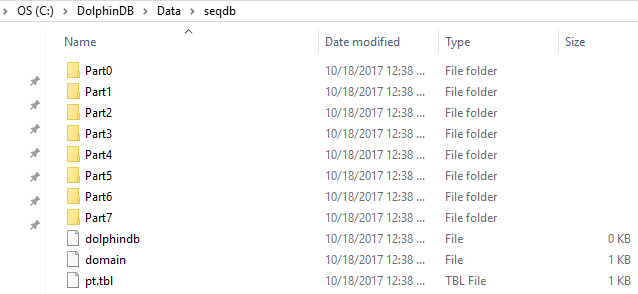

### DolphinDB 分区数据库教程


#### 1. 为什么对数据库进行分区
对数据库进行分区可以极大的降低系统响应延迟同时提高数据吞吐量。具体来说，分区有以下几个好处。
* 分区使得大型表更易于管理。对数据子集的维护操作也更加高效，因为这些操作只针对需要的数据而不是整个表。一个好的分区策略将通过只读取满足查询所需的相关数据来减少要扫描的数据量。当所有的数据都在同一个分区上，对数据库的查询，计算，以及其它操作都会被限制在磁盘访问IO这个瓶颈上。
* 分区使得系统可以充分利用所有资源。一个良好的分区方案搭配并行计算，分布式计算就可以充分利用所有节点来完成通常要在一个节点上完成的任务。 当一个任务可以拆分成几个分散的子任务，每个子任务访问不同的分区，就可以达到提升效率的目的。
* 分区增加了系统的可用性。由于分区的副本通常是存放在不同的物理节点的。所以一旦某个分区不可用，系统依然可以调用其它副本分区来保证作业的正常运转。


#### 2. DolphinDB分区和基于MPP架构的数据存储的区别

MPP(Massive Parallel Processing) 是目前主流数据仓库普遍采用的一种方案, 包括开源软件Greenplum，云数据库AWS Reshift等。MPP有一个主节点，每个客户都连接到这个主节点。DolphinDB在数据库层面不存在主节点，是点对点结构，每个客户端可以连接到任何一个数据节点，不会出现主节点瓶颈问题。

MPP一般通过哈希规则，将数据分布到各个节点上（水平分割），在各个节点内部再进行分区（垂直分割）。哈希时容易出现各个节点数据分布不均匀的问题。DolphinDB将各个节点的存储空间交给分布式文件系统（DFS）统一进行管理，分区的规则与分区的存储位置解耦，数据分割不再按水平和垂直两个步骤进行，而是进行全局优化。这样一来，分区的粒度更细更均匀，在计算时能充分的利用集群的所有计算资源。

由于分布式文件系统具有强大的分区管理、容错、复制机制，以及事务管理机制，使得DolphinDB的单表能轻松的支持上百万的分区数据。如果一百万个分区，每个分区1G的数据量，轻松就实现了PB级数据的存储和快速查询。另外，通过引入DFS，数据库的存储和数据库节点相分离，使得DolphinDB在集群水平扩展（新增节点）上更加简单。


#### 3. 分区类型
分区类型是为了帮助用户根据业务进行均匀数据分割。DolphinDB支持多种分区方式： 顺序分区，范围分区，值分区，列表分区，复合分区。
  *  顺序分区适用于频繁快速的将数据库顺序读取到内存，比如将一个几十GB的csv文件转换成顺序分区数据库，读取到内存要比直接读取csv文件高效得多。顺序分区只能用在单节点。
  *  范围分区每个区间创建一个分区，是最常用的也是推荐的一种分区方式。通过区间，可以把数值在一个区间内的所有记录放置到一个分区。
  *  值分区每个值创建一个分区，例如股票交易日期，股票交易月。
  *  列表分区是根据用户枚举的列表来进行分区，分区更加灵活。
  *  复合分区适用于数据量特别大而且常用的查询经常涉及两个或以上的分区列。每个分区选择都可以采用区间，值或列表分区。例如按股票交易日期进行值分区， 同时按股票代码进行范围分区。

当我们创建一个新的分布式数据库时，我们需要在database函数中指定数据库路径folderDirectory，分区类型partitionType以及分区模式partitionScheme。当我们重新打开现有的分布式数据库时，我们只需指定数据库路径。不允许用不同的分区类型或分区方案覆盖现有的分布式数据库。

聚合函数在分区表上利用分区列操作时，例如GROUP BY列与分区列一致时，速度特别快。

为了学习方便， 以下分区例子使用Windows本地目录，用户可以将数据库创建使用的路径改成Linux或DFS目录。


#### 3.1 顺序(SEQ)分区
在顺序域（SEQ）中，分区基于输入数据文件中行的顺序。**SEQ**只能在本地文件系统中使用，不能在分布式文件系统中使用。下面例子，在“C/DolphinDB/data/seqdb”文件夹下，创建了8个子文件夹。它们中的每一个对应于输入数据文件的一个分区。

```
n=1000000
ID=rand(100, n)
dates=2017.08.07..2017.08.11
date=rand(dates, n)
x=rand(10.0, n)
t=table(ID, date, x)
saveText(t, "C:/DolphinDB/Data/t.txt");

db = database("C:/DolphinDB/Data/seqdb", SEQ, 8)   //数字8指定多少个分区
pt = loadTextEx(db, `pt, , "C:/DolphinDB/Data/t.txt")
```


#### 3.2 范围(RANGE)分区
分区由区间决定，区间由分区向量的任意两个相邻元素定义。包含起始值，但不包含结尾值。

在下面的例子中，数据库db有两个分区：[0,5)和[5,10)。使用函数append!，表t被保存为分区表pt，并在数据库db中使用ID作为分区列。

```
n=1000000
ID=rand(10, n)
x=rand(1.0, n)
t=table(ID, x)
db=database("C:/DolphinDB/Data/rangedb", RANGE,  0 5 10)

pt = db.createPartitionedTable(t, `pt, `ID)
pt.append!(t);

pt=loadTable(db,`pt)
select count(x) from pt
```

磁盘目录结构


如果要创建DFS分区数据库，只需更改路径格式即可：把本地路径更改为dfs路径。系统会自动分配资源存储数据。

```
n=1000000
ID=rand(10, n)
x=rand(1.0, n)
t=table(ID, x)
db=database("dfs://rangedb", RANGE,  0 5 10)
pt = db.createPartitionedTable(t, `pt, `ID)
pt.append!(t);

pt=loadTable(db,`pt)
select count(x) from pt
```

#### 3.3  值(VALUE)分区

在值域（VALUE）分区中，用一个值代表一个分区。

```
n=1000000
month=take(2000.01M..2016.12M, n)
x=rand(1.0, n)
t=table(month, x)

db=database("C:/DolphinDB/Data/valuedb", VALUE, 2000.01M..2016.12M)

// 在DFS分布式文件系统中只需把路径名改为
// db=database("dfs://valuedb", VALUE, 2000.01M..2016.12M)

pt = db.createPartitionedTable(t, `pt, `month)
pt.append!(t)

pt=loadTable(db,`pt)
select count(x) from pt
```

上面的例子定义了一个具有204个分区的数据库db。每个分区是2000年1月到2016年12月之间的一个月(如下图）。在数据库db中，表t被保存为分区表pt，分区列为month。


#### 3.4 列表(LIST)分区

在列表（LIST）分区中，我们用一个包含多个元素的列表代表一个分区。

```
n=1000000
ticker = rand(`MSFT`GOOG`FB`ORCL`IBM,n);
x=rand(1.0, n)
t=table(ticker, x)

db=database("C:/DolphinDB/Data/listdb", LIST, [`IBM`ORCL`MSFT, `GOOG`FB])
//在DFS分布式文件系统中只需把路径名改为
//db=database("dfs://listdb", LIST, [`IBM`ORCL`MSFT, `GOOG`FB])
pt = db.createPartitionedTable(t, `pt, `ticker)
pt.append!(t)

pt=loadTable(db,`pt)
select count(x) from pt
```

上面的数据库有2个分区。第一个分区包含3个股票代号，第二个分区包含2个股票代号。


#### 3.5 组合(COMPO)分区

组合（COMPO）分区可以定义2或3个分区列。每列可以独立采用范围(RANGE)，值(VALUE)或列表(LIST)分区。组合分区的多个列在逻辑上是并列的，不存在从属关系或优先级关系。


```
n=1000000
ID=rand(100, n)
dates=2017.08.07..2017.08.11
date=rand(dates, n)
x=rand(10.0, n)
t=table(ID, date, x)

dbDate = database(, VALUE, 2017.08.07..2017.08.11)
dbID=database(, RANGE, 0 50 100)
db = database("C:/DolphinDB/Data/compoDB", COMPO, [dbDate, dbID])
//在DFS分布式文件系统中只需把路径名改为
//db = database("dfs://compoDB", COMPO, [dbDate, dbID])
pt = db.createPartitionedTable(t, `pt, `date`ID)
pt.append!(t)

pt=loadTable(db,`pt)
select count(x) from pt
```

值域有5个分区：


进入到，20170807这个分区，可见区间域(RANGE)有2个分区：


#### 4. 分区的原则

分区的总原则是让数据管理更加高效，提高查询和计算的性能，达到低延时和高吞吐量。下面是设计和优化分区表的需要考虑的因素，以供参考。

#### 4.1 选择合适的分区字段
在DolphinDB中，可以用于分区的数据类型必须是可以用32位整型来表示的，包括整型(CHAR, SHORT, INT)，日期类型(DATE, MONTH, TIME, SECOND, MINUTE, DATETIME)，以及SYMBOL)。

```
db=database("dfs://rangedb1", RANGE,  0.0 5.0 10.0)

//出错信息：DOUBLE数据类型的字段不能作为分区字段。

The data type DOUBLE can't be used for a partition column

```

虽然DolphinDB支持对TIME, SECOND, DATETIME类型字段的分区， 但是在实际使用中要谨慎使用，避免采用值分区，以免分区粒度过细，将大量系统时间耗费在创建或查询几百上千万的只包含几条记录的文件目录。

例如下面这个例子就会产生过多的分区。因为序列：2012.06.01T09:30:00..2012.06.30T16:00:00包含2,529,001个元素，所以如果用这个序列做值分区，将会产生在磁盘上产生2,529,001分区，即产生2,529,001文件目录和相关文件。从而使得分区表创建、写入、查询都会变得缓慢。

```
db=database("dfs://valuedb1",VALUE , 2012.06.01T09:30:00..2012.06.30T16:00:00);
```

除了考虑数据类型之外，分区字段的值一般是不会变化的。例如， 股票代码可以作为分区字段，但股票交易量不适合作为分区字段，因为同一股票的交易量每天都有变化，就会造成归属到不同的分区中。

另外，用于分区的字段一般在业务层面，很容易切分。譬如在证券交易领域，股票交易日期和股票代码在业务层面都很容易切分。在5.3中会提到DolphinDB的事务机制，不允许多个writer的事务在分区上有重叠。因此如果业务上按照该字段不容易切分，在数据写入时，可能会造成问题。

一个分区字段相当于给数据表建了一个物理索引。如果查询时用到了该字段做数据过滤，SQL引擎就能快速定位需要的数据块，而无需对整表进行扫描，从而大幅度提高处理速度。因此，分区字段应当选用查询和计算时经常用到的过滤字段。


#### 4.2 分区粒度不要过大

DolphinDB单个分区支持最大记录条数是20亿条。但合理的记录数目应该远远小于这个数。一个分区内的多个列以文件形式独立存储在磁盘上，通常数据是经过压缩的。使用的时候，系统从磁盘读取所需要的列，解压后加载到内存。分区粒度过大，可能会造成多个工作线程并行时内存不足，或者导致系统频繁地在磁盘和工作内存之间切换，影响性能。一个经验公式是，数据节点的可用内存是S，工作线程（worker）的的数量是W，则建议每个分区的表（全部字段）解压后在内存中的大小不超过S/8W。假设工作内存上限32G，8个worker，建议单个分区表解压后的大小不超过512兆。

DolphinDB的子任务以分区为单位。因此分区粒度过大会造成无法有效利用多节点多分区的优势，将本来可以并行计算的任务转化成了顺序计算任务。

DolphinDB是为OLAP的场景优化设计的，支持数据追加的方式，不支持对个别行进行删除或更新。如果要修改数据，以分区为单位覆盖全部数据。如果分区过大，降低效率。DolphinDB在节点之间复制副本数据时，同样以分区为单位，分区过大，不利于数据在节点之间的复制。

综上各种因素，建议一个分区未压缩前的原始数据大小控制在100M~1G之间。当然这个数字可结合实际情况调整。譬如在大数据应用中，我们经常看到宽表设计，一个表达到几百个字段，但是在单个应用中只会使用一部分字段。这种情况下，可以适当放大上限的范围。

如果发现分区粒度过大，可以采用几种方法，（1）采用组合分区(COMPO)，（2）增加范围分区的区间个数，（3）将范围分区改为值分区。


#### 4.3 分区粒度不要过小

分区粒度过小，一个查询和计算作业往往会生成大量的子任务，这会增加数据节点和控制节点，以及控制节点之间的通讯和调度成本。分区粒度过小，也会造成很多低效的磁盘访问（小文件读写)，造成系统负荷过重。另外，所有的分区的元数据都会驻留在控制节点的内存中。分区粒度过小，分区数过多，可能会导致控制节点内存不足。我们建议每个分区未压缩前的数据量不要小于100M。

譬如股票的高频交易数据若按交易日期和股票代码的值做组合分区，会导致许多小股票一天内的交易数据量太少。如果将股票代码的维度按照范围分区的方法来切分数据，将多个小股票组合在一个分区内，则可以有效解决分区粒度过小的问题，提高系统的性能。


#### 4.4 如何将数据均匀分区

当各个分区的数据量差异很大时，会造成系统负荷不均衡，部分节点任务过重，而其它节点处于闲置等待状态。当一个任务有多个子任务时，只有最后一个子任务完成了，才会将结果返回给用户。因此数据分布不均匀，会增大作业延时，影响用户体验。

为了方便根据数据的分布进行分区，DolphinDB提供了一个非常有用的工具cutPoints(X, N, [freq]) 这里**X**是一个数组，**N**指需要产生多少个**buckets**, 而**freq**是**X**的等长数组，其中每个元素对应着**X**中元素出现的**频率**。函数返回具有（N + 1）个元素的数组，使得**X**中的数据均匀地分布在由向量指示的**N**个**buckets**中。它可用于在分布式数据库中获取区间域的分区方案

下面的例子中，需要对股票的报价数据按日期和股票代码两个维度做数据分区。如果简单的按股票的首字母进行范围分区，极易造成数据分布不均，因为不同股票的报价数据量可能相差几千倍甚至更多。建议使用cutPoints根据样本数据来划分分区。

```
// 将数据并行导入
t = ploadText(WORK_DIR+"/TAQ20070801.csv")

// 选择2007.08.1这天的数据来计算股票代码的分布
t=select count(*) as ct from t where date=2007.08.01 group by symbol

// 通过分布数据，以及cutPoints函数，按照股票代码按字母顺序产生128个均匀区间。每个区间内部的股票的报价记录数是相当的。
buckets = cutPoints(t.symbol, 128, t.ct)

// 将最后一个区间的结束边界替换成不会出现的最大的股票代码。
buckets[size(buckets)-1] = `ZZZZZ

//buckets的结果如下：
//["A",'ABA','ACEC','ADP','AFN','AII','ALTU','AMK',..., 'XEL','XLG','XLPRACL','XOMA','ZZZZZ']

dateDomain = database("", VALUE, 2017.07.01..2018.06.30)
symDomain = database("", RANGE, buckets)
stockDB = database("dfs://stockDBTest", COMPO, [dateDomain, symDomain])
```

除了使用范围分区的方法，列表分区也是解决数据分布不均匀的有效方法。

#### 4.5 时序类型分区

时间是实际数据中最常见的一个维度。DolphinDB提供了丰富时间类型以满足用户的需求。当我们以时间类型字段作为分区字段时，在时间取值上需要预留足够的空间以容纳将来的数据。下面的例子，我们创建一个数据库，以天为单位，将2000.01.01到2030.01.01的日期分区。注意，只有当实际数据写入数据库时，数据库才会真正创建需要的分区。

```
dateDB = database("dfs://testDate", VALUE, 2000.01.01 .. 2030.01.01)
```

DolphinDB使用时间类型作为分区字段时，还有一个特殊的优点。数据库定义的分区字段类型和数据表实际采用的时间类型可以不一致，只要保证定义的分区字段数据类型精度小于等于实际数据类型即可。比如说，如果数据库是按月（month）分区，数据表的字段可以是month, date, datetime, timestamp和 nanotimestamp。系统自动会作数据类型的转换。


#### 4.6 多表采用相同的分区机制

在分布式数据库中，如果多个分区的事实表要连接（join）通常十分耗时，因为涉及到的分区可能在不同的节点上，需要在不同节点之间复制数据。为解决这个问题，DolphinDB推出了共存储位置的分区机制。对采用同一个分区机制的多个表，DolphinDB确保相同分区下的多个表的数据存储在相同的节点上。这样的安排，保证了这些表在连接的时候非常高效。DolphinDB当前版本对采用不同分区机制的多个分区表不提供连接功能。

```
dateDomain = database("", VALUE, 2018.05.01..2018.07.01)
symDomain = database("", RANGE, string('A'..'Z') join `ZZZZZ)
stockDB = database("dfs://stockDB", COMPO, [dateDomain, symDomain])

quoteSchema = table(10:0, `sym`date`time`bid`bidSize`ask`askSize, [SYMBOL,DATE,TIME,DOUBLE,INT,DOUBLE,INT])
stockDB.createPartitionedTable(quoteSchema, "quotes", `date`sym)

tradeSchema = table(10:0, `sym`date`time`price`vol, [SYMBOL,DATE,TIME,DOUBLE,INT])
stockDB.createPartitionedTable(tradeSchema, "trades", `date`sym)
```
上面的例子中，quotes和trades两个分区表采用同一个分区机制。

#### 5. 导入数据到分布式数据表

#### 5.1 DolphinDB的适用场景
DolphinDB是为OLAP设计的系统，主要是解决海量结构化数据的快速存储和计算，以及通过内存数据库和流数据实现高性能的数据处理。DolphinDB不适合数据频繁更改的OLTP业务系统。DolphinDB的数据写入与Hadoop HDFS类似，快速在每个分区或文件的末尾批量插入数据。插入的数据会压缩存储到磁盘，一般压缩比例在20%~25%。数据一旦追加到基于磁盘的数据表后，不能快速更新或删除某些符合条件的记录，必须以分区为单位对数据表进行修改。这也是分区原则中提到单个分区不宜过大的原因之一。

#### 5.2 多副本机制
DolphinDB允许为每一个分区保留多个副本，默认的副本个数是2，可以修改控制节点的参数dfsReplicationFactor来设置副本数量。设置冗余数据的目的有两个：（1）当某个数据节点失效或者或磁盘数据损坏时，系统提供容错功能继续提供服务；（2）当大量并发用户访问时，多副本提供负载均衡的功能，提高系统吞吐量，降低访问延时。DolphinDB通过两阶段事务提交机制，确保数据写入时，同一副本在多节点之间的数据强一致性。

在控制节点的参数文件controller.cfg中，还有一个非常重要的参数dfsReplicaReliabilityLevel。 该参数决定是否允许多个副本驻留在同一台物理服务器的多个数据节点上。在development阶段，允许在一个机器上配置多个节点，同时允许多个副本驻留在同一台物理服务器（dfsReplicaReliabilityLevel=0）， 但是production阶段需要设置成为1，否则起不到容错备份的作用。

```
 // 每个表分区或文件块的副本数量。默认值是2。
dfsReplicationFactor=2

 // 多个副本是否可以驻留在同一台物理服务器上。 Level 0：允许; Level 1：不运行。默认值是0。
dfsReplicaReliabilityLevel=0
```

#### 5.3 事务机制
DolphinDB对基于磁盘（分布式文件系统）的数据库表的读写支持事务，也就是说确保事务的原子性，一致性，隔离性和持久化。DolphinDB采用多版本机制实现快照级别的隔离。在这种隔离机制下，数据的读操作和写操作互相不阻塞，可以最大程度优化数据仓库读的性能。

为了最大程序优化数据仓库查询、分析、计算的性能，DolphinDB对事务作了一些限制。首先，一个事务只能包含写或者读，不能同时进行写和读。其次，一个写事务可以跨越多个分区，但是同一个分区不能被多个writer并发写入。也就是说当一个分区被某一个事务A锁定了，另一个事务B试图再次去锁定这个分区时，系统立刻会抛出异常导致事务B失败回滚。

#### 5.4 多Writer并行写入
DolphinDB提供了强大的分区机制，单个数据表可以支持几百万的分区数量，这为高性能的并行数据加载创造了条件。特别是当第一次将海量的数据从别的系统导入到DolphinDB时，或者需要将实时数据以准实时的方式写入到数据仓库时，并行加载显得尤为重要。

下面的例子将股票报价数据（quotes）并行加载到数据库stockDB。stockDB以日期和股票代码做复合分区。数据存储在csv文件中，每个文件保存一天的quotes数据。

```
//创建数据库和数据表
dateDomain = database("", VALUE, 2018.05.01..2018.07.01)
symDomain = database("", RANGE, string('A'..'Z') join `ZZZZZ)
stockDB = database("dfs://stockDB", COMPO, [dateDomain, symDomain])
quoteSchema = table(10:0, `sym`date`time`bid`bidSize`ask`askSize, [SYMBOL,DATE,TIME,DOUBLE,INT,DOUBLE,INT])
stockDB.createPartitionedTable(quoteSchema, "quotes", `date`sym)

def loadJob(){
	fileDir='/stockData'

    // 到路径下取出数据文件名
	filenames = exec filename from files(fileDir)

	// 加载数据库
	db = database("dfs://stockDB")

	// 对每个文件，通过文件名产生jobId前缀。
	// 通过函数submitJob提交后台程序调用loadTextEx将数据加载到stockDB数据库中。
	for(fname in filenames){
		jobId = fname.strReplace(".txt", "")
		submitJob(jobId,, loadTextEx{db, "quotes", `date`sym, fileDir+'/'+fname})
	}
}

//通过pnodeRun将loadJob这个任务发送到集群的每个数据节点进行并行加载。
pnodeRun(loadJob)
```
当多个writer并行加载数据时，要确保这些writer不会同时往同一个分区写入数据，否则会导致事务失败。在上面的例子中，每一个文件存储了一天的数据，而quotes表的一个分区字段是日期，从而确保所有加载数据的作业不会产生有重叠的事务。

#### 5.5 数据导入的常用方法

DolphinDB的分布式数据库提供标准方法append!函数批量追加数据到到数据库。各种数据导入方法实际上就是直接或间接的调用这个函数将数据写入到数据库。后面的所有例子，都使用5.4中创建的stockDB的quotes表。

```
//模拟产生100万条quote记录
n = 1000000
syms = `IBM`MSFT`GM`C`FB`GOOG`V`F`XOM`AMZN`TSLA`PG`S
time = 09:30:00 + rand(21600000, n)
bid = rand(10.0, n)
bidSize = 1 + rand(100, n)
ask = rand(10.0, n)
askSize = 1 + rand(100, n)
quotes = table(rand(syms, n) as sym, 2018.05.04 as date, time, bid, bidSize, ask, askSize)

//将内存表quotes批量写入到数据库
loadTable("dfs://stockDB", "quotes").append!(quotes)
```

##### 5.5.1 从文本文件导入数据

文本文件是各个系统之间常用的数据交换方式。DolphinDB提供三个函数loadText，ploadText和loadTextEx加载文本数据。

```
//将模拟产生的quotes表以csv的格式保存到本地文件
workDir = "C:/DolphinDB/Data"
if(!exists(workDir)) mkdir(workDir)
quotes.saveText(workDir + "/quotes.txt")
```

使用loadText或ploadText将数据从文件加载到内存，然后再调用append!函数。这种方法适合于数据量小于物理内存的情况， 因为数据将被全部导入内存。 ploadText和loadText的区别是前者采用并行方法加载文本文件。

```
t=loadText(workDir + "/trades.txt")
loadTable("dfs://stockDB", "quotes").append!(t)
```

loadTextEx直接将文本数据导入到数据库分区表，是DolphinDB推荐使用的加载文本数据的方法。它的优点是：并行处理速度快,而且文件尺寸可远远大于物理内存。 loadTextEx运行时，帮助用户调用了append!函数。

```
db = database("dfs://stockDB")
loadTextEx(db, "quotes", `date`sym, workDir + "/quotes.txt")
```

##### 5.5.2 订阅一个流数据，批量写入

DolphinDB支持流数据的处理。用户可以订阅一个流数据，将订阅到的流数据批量写入到分布式表中。详细内容，请参阅帮助文档关于流计算的部分。

```
dfsQuotes = loadTable("dfs://stockDB", "quotes")
saveQuotesToDFS=def(mutable t, msg): t.append!(select today() as date,* from msg)
subscribeTable(, "quotes_stream", "quotes", -1, saveQuotesToDFS{dfsQuotes}, true, 10000, 6)
```
上面的例子中，我们订阅了流数据表quotes_stream，等待时间超过6秒或缓存的quotes记录达到1万条，批量写入到分布式表dfs://stockDB/quotes中。

##### 5.5.3 通过ODBC导入数据

用户也可以通过ODBC Plugin， 将其它数据源中的数据导入到DolphinDB中。下面例子通过ODBC将mysql中的quotes表导入到DolphinDB。ODBC Plugin存放在server/plugins/odbc/。

```
loadPlugin("/DOLPHINDB_DIR/server/plugins/odbc/odbc.cfg")
conn=odbc::connect("Driver=MySQL;Data Source = mysql-stock;server=127.0.0.1;uid=[xxx];pwd=[xxx]database=stockDB")
t=odbc::query(conn,"select * from quotes")
loadTable("dfs://stockDB", "quotes").append!(t)
```

##### 5.5.4 通过Programming API导入数据

DolphinDB提供了Python, Java, 以及C#的编程接口。用户可以在这些编程语言中准备好数据，然后调用append!函数，将数据导入到DolphinDB的分布式表。下面我们以java为例，给出核心的代码。

```
DBConnection conn = new DBConnection();

//连接并登录到DolphnDB服务器
conn.connect("localhost", 8848, "admin", "123456");

//定义函数saveQuotes
conn.run("def saveQuotes(t){ loadTable('dfs://stockDB','quotes').append!(t)}");

//准备一个数据表，具体过程省略
BasicTable quotes = ...

//调用服务端函数saveQuotes
List<Entity> args = new ArrayList<Entity>(1);
args.add(quotes);
conn.run("saveQuotes", args)
```

