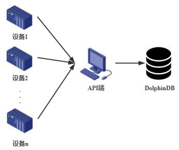
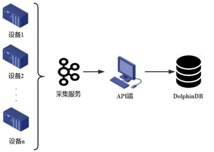
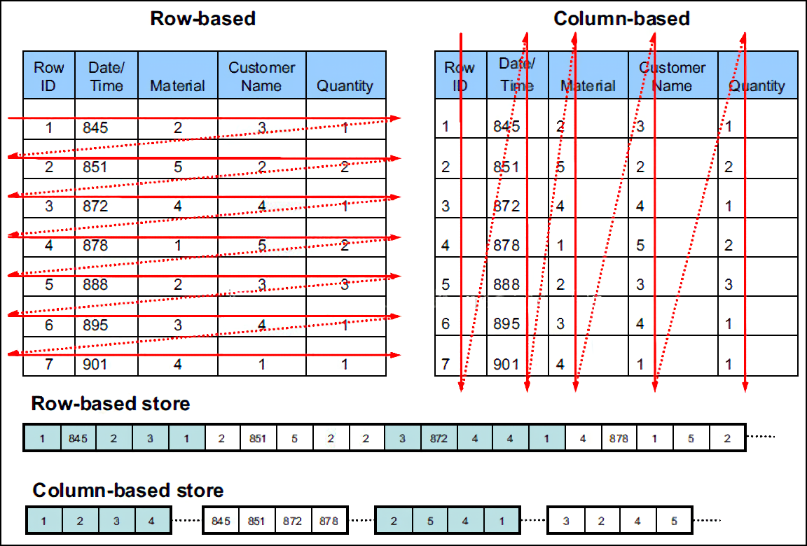
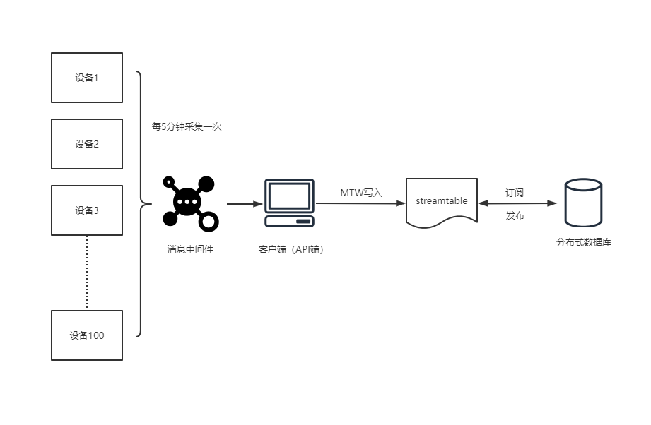

# DolphinDB C++ API 数据写入使用指南

本文为 DolphinDB C++ API （连接器）写入接口的使用指南，用户在有数据写入需求时，可以根据本篇教程快速明确地选择写入方式。

本文将从使用场景介绍、原理简述、函数使用、场景实践四部分进行具体阐述。

- [一、场景介绍](#一场景介绍)
- [二、原理简述](#二原理简述)
- [三、函数使用](#三函数使用)
  - [1. MultithreadedTableWriter（MTW）](#1-multithreadedtablewritermtw)
  - [2. PartitionedTableAppender（PTA）](#2-partitionedtableappenderpta)
  - [3. AutoFitTableAppender（AFTA）](#3-autofittableappenderafta)
  - [4. AutoFitTableUpsert（AFTU）](#4-autofittableupsertaftu)
- [四、场景实践](#四场景实践)
- [附件](#附件)

## 一、场景介绍

目前大数据技术已广泛应用到金融、物联网等行业，而海量数据的写入是大数据处理和分析的基础。在实际应用中，数据的产生方式和采集途径多种多样，DolphinDB 作为轻量级的大数据平台，提供多种数据写入方式，用户可以在不同应用场景下选择最合适的方式进行数据写入。

以工业物联网场景为例，设备数据的写入场景通常可分为两类。

（1）多设备数据分散写入。

如某厂区有100台设备，每台设备通过独立的传输链路将数据一条条发送到 API 端，再统一通过 API 端写入到 DolphinDB。

<figure>

  <figcaption><b>多设备数据分散写入</b></figcaption>
</figure>

（2）设备数据汇总后再写入 API。
如某厂区有100台设备，用采集服务（如 Kafka）将设备数据进行汇总，再统一通过 API 写入 DolphinDB。

<figure>

  <figcaption><b>设备数据汇总写入</b></figcaption>
</figure>

针对以上场景，DolphinDB C++ API 提供了多种写入方法，以实现不同来源数据的高效写入：

| **设备场景**       | **写入DolphinDB表的类型** | **调用DolphinDB 函数**                           | **实现方式**     |
| ------------------------ | ------------------------------- | ------------------------------------------------------ | ---------------------- |
| 多设备数据一条条分散写入 | ALL                             | MTW（MultithreadedTableWriter）                        | 缓冲行数据后并行写入   |
| 设备数据汇总写入         | ALL                             | MTW（MultithreadedTableWriter）                        | 将合并的行数据并行写入 |
| 设备数据汇总写入         | ALL                             | AFTA（AutoFitTableAppender）/ AFTU (AuoFitTableUpsert) | 单线程按列批量写入     |
| 设备数据汇总写入         | 内存表                          | tableInsert                                            | 单表写入               |
| 设备数据汇总写入         | 分布式表                        | PTA（PartitionedTableAppender）                        | 多线程按列批量写入     |

MTW 的写入方式可以适配多种写入场景，推荐首次接触 DolphinDB 的用户使用 MTW 方法；

tableInsert 方法可以将汇总数据简单快速地写入内存表；

而对于分布式表，C++ API 提供了保障并行写入的 PTA 方法，以及更简单易用，能自动转换写入数据字段类型的 AFTA/AFTU 方法。

## 二、原理简述

传统的开发人员通常对关系型数据库的行式存储（Row-Based）比较熟悉，数据按单行或多行的方式提交并写入，这种写入方式很容易理解，但是基于行式存储的数据库实际上并不是为大数据处理而设计的，海量数据的写入很容易遇到性能瓶颈。

DolphinDB 采用列式存储（Column-Based），在内存中维护一个 Cache Engine，当数据写入文件时，并不是直接写入到磁盘，而是先写入操作系统的缓冲页面中，再批量写入磁盘。为了确保写入数据不会在内存中丢失， DolphinDB 使用 WAL（Write Ahead Logging）的机制。详情可参考 DolphinDB 用户手册的[数据模型](https://www.dolphindb.cn/cn/help/DatabaseandDistributedComputing/Database/DataModel.html)。

以一个5列（字段）的数据表为例，写入100万行的数据时，行式存储按行方式提交并写入，需要执行100万次的文件写入操作；而列式存储对单列进行写入，可以按列一次性提交100万个值，最少仅需5次文件操作就能完成数据写入。两种写入方式在海量数据的处理方面性能差异巨大。

<figure>

  <figcaption><b>行式存储和列式存储对比（图片来源于网络）</b></figcaption>
</figure>

通常我们在为大数据应用场景规划写入方式前，需要理解以上列式存储的写入方式。按列批量写入能最大化发挥列式存储的优势，而当实际场景下多个设备写入数据较为分散时，可以选择有数据缓冲的 API 方法如 MTW，以获得最佳写入性能。

DolphinDB C++ API 支持多种数据写入方法，涵盖多样化的写入场景需求，主要特点如下：

| **写入方式**         | **特点**                                                                                            |
| -------------------------- | --------------------------------------------------------------------------------------------------------- |
| MTW                        | - 官方推荐用法`` - 按行接收数据`` - 内置数据缓冲队列`` - 多线程异步并发写入`` |
| tableInsert                | - 方便简单，速度快`` - 事务机制下，同一分区不能同时写入两条数据，因此不建议写入分布式表``   |
| PTA                        | - 按表写入`` - 内置连接池`` - 自动按分区同步并行写入``                               |
| AFTA                       | - 自动转换字段类型写入`` - 适用于历史数据整表落盘，追加写入`` - 单线程同步写入``     |
| AFTU                       | AFTA 更新写的版本                                                                                         |
| BatchTableWriter（旧版本） | - 因兼容性而保留的旧版函数`` - 实时数据落盘，数据按行写入`` - 单线程同步写入``       |

具体而言，

- MTW 支持高效按行写入，通过内置数据缓冲队列，MTW 将数据统一发送到 DolphinDB ，可以保证单条数据的写入效率，适用于多设备一条条分散写入场景。当性能要求不高时，也可用于第三方平台汇总数据后批量写入 API 的场景。
- MTW 是对 BatchTableWriter（旧版本）的升级，二者均支持数据分散地从第三方平台传输到客户端的场景。MTW 的默认功能和 BatchTableWriter 一致，但支持多线程的并发写入。目前 BatchTableWriter 方式已经完全被 MTW 替代，仅因为兼容性而保留。
- tableInsert 使用简单高效，可以支持数据汇总写入场景，若写入的 DolphinDB 表为内存表，可以选择 tableInsert 或者 PTA；但 tableInsert 没有分区写入保障机制，在开启事务机制的情况下，不建议写入分布式表。
- PTA 能够自动按分区实现同步并行写入，适用于数据汇总写入场景。按列并行写入的机制确保了 PTA 方式在批量写入场景下拥有性能优势。
- AFTA 能够自动将 C++ 字段类型转换为 DolphinDB 字段类型完成写入，使用上较 PTA 更为简单，同样适合数据汇总写入场景。PTA 的写入速度要好于 AFTA，在对写入效率有要求且仅进行追加写的情况下，建议优先考虑 PTA。
- AFTU 是 AFTA 的更新写版本，更适合于重复数据存在的场景，读取新数据不存在重复时直接插入，存在重复时更新。针对数据写入是否需要更新，即当写入的数据在数据库中已有相同的主键或者相同的指定字段时，选择更新该条旧数据或者直接插入新数据，C++ API 给出了不同的写入方式。其中，MTW 内部分别实现了更新写和追加写，以 *mode* 参数的形式提供选择；而 PTA 仅提供了追加写的方式。

MTW，PTA，AFTA，AFTU 四种方法涵盖了绝大多数写入场景，其底层实现均调用了 `tableInsert` 或 `upsert!` （DolphinDB 脚本函数，关于 `tableInsert` 的更多介绍请参考 [tableInsert — DolphinDB 2.0 documentation](https://www.dolphindb.cn/cn/help/FunctionsandCommands/FunctionReferences/t/tableInsert.html)）。下节将重点介绍 MTW，PTA，AFTA，AFTU 四种函数的使用。

DolphinDB C++ API 的具体安装教程可参考 [README_CN.md · dolphindb/api-cplusplus - Gitee](https://gitee.com/dolphindb/api-cplusplus/blob/release200/README_CN.md)。

## 三、函数使用

### 1. MultithreadedTableWriter（MTW）

MTW 可以向内存表、流表、分区表、维度表中写入数据。不仅在内部实现并发写入，还可在 API 端创建多个 MTW 对象并发执行写入任务，MTW 也支持整型、时间等类型的内部自动转换。

MTW 在 API 端维护一个数据缓冲队列，API 端可调用写线程将数据按条持续写入缓冲队列，数据在缓冲队列堆积到一定数量后将一并被传送到服务器端。客户端创建出用户指定数目的 DolphinDB 连接，然后按照分区分配写入数据。在事务机制下，DolphinDB 不允许多个线程同时向同一个分区写入数据。

首先创建一个 MTW 对象。创建 MTW 时可指定每列的压缩方式。代码如下：

```
vector<COMPRESS_METHOD> compress;
for(int i=0;i<102;i++)compress.push_back(COMPRESS_LZ4);   // 每列的压缩方式
MultithreadedTableWriter writer(
      "127.0.0.1", 9900, "admin","123456","dfs://test_MultithreadedTableWriter","collect",NULL,false,NULL,1000,1,10,"deviceid", &compress);   
```

MTW 的构造函数参数详见 [README_CN.md · dolphindb/api-cplusplus - Gitee](https://gitee.com/dolphindb/api-cplusplus/blob/release200/README_CN.md#832-multithreadedtablewriter) 。另外，*dbName*，*partitionColumnName*，*threadCount* 三个参数在写入不同类型的表时有很大区别，具体见下表。

| **表类型** | **参数1：dbName** | **参数2：partitionColumnName** | **参数3：threadCount** |
| :--------------- | :---------------------- | :----------------------------------- | :--------------------------- |
| 内存表           | “”                    | 任意字段                             | >=1                          |
| 流表             | “”                    | 任意字段                             | >=1                          |
| 分区表           | 实际数据库名            | 某个分区字段                         | >=1                          |
| 维度表           | 实际数据库名            | “”                                 | 1                            |

接着在 API 端创建子线程插入数据到缓冲队列。当需要写入的数据量较大时，可根据实际情况在 API 端使用更多的线程。insert 方法需传入一个 ErrorCodeInfo 对象和一串变长参数，每个变长参数都代表一个字段值。

具体代码如下：

```
int rows = 1000; //行数
int cols = 5;   //列数
vector<ConstantSP> datas;
TableSP bt = conn.run("t0 = loadText('"+DATA_FIRE+"');t0");// 模拟数据源从 csv 文件导入
for(int i = 0; i< rows; ++i){
    for(int j = 0; j < cols; ++j)
        datas.emplace_back(bt->getColumn(j)->get(i));
}
// 创建线程
thread t([&]() {
    try {
        for(int i=0;i < bt->rows();i++){
           ErrorCodeInfo pErrorInfo;
           writer.insert(pErrorInfo,
                      datas[0], datas[1], datas[2], datas[3], datas[4] // 含5个字段的数据
           );
        }
    }catch (exception &e) {
         cerr << "MTW exit with exception: " << e.what() << endl;
    }
});
// 等待插入线程结束
t.join();
```

在 MTW 运行时，可能会发生写入错误，使用下述代码，获取对象当前的运行状态。

```
MultithreadedTableWriter::Status status;
writer.getStatus(status);
if (status.hasError()) {
	cout << "error in writing: " << status.errorInfo << endl;
}
```

`status` 对象的属性和方法详见 [README_CN.md · dolphindb/api-cplusplus - Gitee](https://gitee.com/dolphindb/api-cplusplus/blob/release200/README_CN.md#dolphindb-c-api)  。

注意，API 端的写入线程结束不代表 MTW 完全退出，需使用 `waitForThreadCompletion` 方法等待 MTW 完全退出。同时，MTW 需要在内存中缓存写入数据，当 API 异常退出时可能会造成已缓存数据的丢失，因此需要合理配置缓存写入数量，以适配性能和高可用场景需求。

当 MTW 写入出现错误，需调用 `getUnwrittenData` 方法获取未写入数据。若有未写入数据，则需再次创建 MTW 对象进行写入。代码如下：

```
writer.getStatus(status);
    if (status.hasError()) {
        cout << "error after write complete: " << status.errorInfo << endl;
        // 获取未写入的数据
        std::vector<std::vector<ConstantSP>*> unwrittenData;
        writer.getUnwrittenData(unwrittenData);
        cout << "unwriterdata length " << unwrittenData.size() << endl;
        if (!unwrittenData.empty()) {
            try {
                // 重新写入这些数据，原有的 MTW 因为异常退出已经不能用了，需要创建新的 MTW
                cout << "create new MTW and write again." << endl;
                MultithreadedTableWriter newWriter("183.136.170.167", 9900, "admin", "123456", "dfs://test_MultithreadedTableWriter", "collect", NULL,false,NULL,1000,1,5,"deviceid", &compress);
                ErrorCodeInfo errorInfo;
                // 插入未写入的数据
                if (newWriter.insertUnwrittenData(unwrittenData, errorInfo)) {
                    // 等待写入完成后检查状态
                    newWriter.waitForThreadCompletion();
                    newWriter.getStatus(status);
                    if (status.hasError()) {
                        cout << "error in write again: " << status.errorInfo << endl;
                    }
                }
                else {
                    cout << "error in write again: " << errorInfo.errorInfo << endl;
                }
            }
            catch (exception &e) {
                cerr << "new MTW exit with exception: " << e.what() << endl;
            }
        }
    }
```

至此，MTW 的使用流程介绍完毕。

### 2. PartitionedTableAppender（PTA）

PTA 设计一个连接池，获取分布式表的分区信息后，将分区分配给连接池来并行写入。

> PartitionedTableAppender 可向分布式表中写入数据

PTA 的使用简洁方便，创建一个连接池对象和 PTA 对象。注意，对象创建时需要指定写入表的分区字段，尽量使分区个数与连接池中连接个数相同。因为线程多反而会增加线程创建和销毁开销，而线程少无法最大利用服务器资源。当每个分区都能同时进行写入并且没有多余的线程创建，PTA 写入效率最高，资源分配也最合理。代码如下：

```
DBConnectionPool pool("127.0.0.1", 9900, 5, "admin", "123456");
// 分区列传入 deviceid 或 ts 均可，保证可以使用多线程写入数据集多个分区，因为 DolphinDB 开启事务时不允许多个 writer 同时写入到一个分区内
PartitionedTableAppender appender("dfs://test_PartitionedTableAppender", "collect","deviceid", pool);  
appender.append(bt);
pool.shutDown(); 
```

若当前连接池不再使用，会自动被释放，但存在释放延时，可以通过调用 `shutDown()` 等待线程任务执行结束后立即释放连接。

### 3. AutoFitTableAppender（AFTA）

AFTA 建立与 server 的连接后，对列数、列字段名、列字段类型等基础信息进行判断，完成整型、时间类型等字段的自动转换，随即使用 tableInsert 进行写入，目前 AFTA 与 AFTU 尚不支持整型与浮点型数据间的转换。

> AutoFitTableAppender 内部实现简单，实用性高。可向流表、内存表、分区表、磁盘表写入数据

AFTA 的使用较 PTA 更为简单，创建完 AFTA 对象后即可调用 `append()` 写入。具体代码如下：

```
AutoFitTableAppender appender("dfs://test_AutoFitTableAppender", "collect", conn);
appender.append(bt);
```

### 4. AutoFitTableUpsert（AFTU）

创建 AFTU 时可指定字段 `keycolName`，当新插入数据的指定字段不与数据库中已有数据重复时，AFTU 直接将数据插入，而当该字段出现重复时，AFTU 可以对该条数据进行更新。

> AutoFitTableUpsert 更适合于有重复数据写入的场景

类似于 AFTA，通过创建的 AFTU，调用 `upsert()` 即可完成数据的写入和更新：

```
vector<string> keycolName = {"id"};
AutoFitTableUpsert aftu("dfs://test_AutoFitTableUpsert", "collect", conn, false, &keycolName);
aftu.upsert(bt);
```

以下就追加写入和更新写入场景提供了更全面的选择参考：

| **数据写入场景** | **字段类型自动匹配** | **追加写入** | **更新写入** |
| ---------------------- | -------------------------- | ------------------ | ------------------ |
| 多设备分散写入         | 否                         | MTW                | MTW                |
| 数据汇总写入           | 否                         | PTA、MTW           | MTW                |
| 数据汇总写入           | 是                         | AFTA、MTW          | AFTU、MTW          |

在底层实现上，AFTA 和 AFTU 通过整表插入的方式实现批量数据写入；而 MTW 通过维护数据缓冲队列实现批量数据异步写入。若需要使用 C++ API 实现整表数据的写入，推荐使用 AFTA 或 AFTU。

## 四、场景实践

以下场景案例展示了使用 DolphinDB C++ API 实现数据写入的流程：

某设备实验平台有100台设备，单台设备有1000个测点，实验平台需要采集设备的测点信息从而评估设备的使用情况。

实验平台要求测点信息按单值模型存储，每台设备每隔5分钟对所有1000个测点进行数据采集，汇总所有设备的数据后通过消息中间件统一传输到 API 端。实验平台要求支持对数据的批量写入，同时保证数据类型的一致性，不需要数据类型自动转换；若客户端意外崩溃，重启后 API 可重新接受数据。这种场景下采用 MTW 方法将实时数据写入数据库，其流程图如下：

<figure>

  <figcaption><b>实时数据落盘流程图</b></figcaption>
</figure>

**数据集：**

- 记录描述：100台设备，每台1000个测点，采集频率5分钟1次，采集持续10天
- 记录行数：2.6亿行
- 磁盘占用：1116 MB
- 字段数量：6
- 字段样式：
  - ts：数采时间
  - deviceCode：设备编号
  - logicalPostionId：逻辑位置ID
  - physicalPostionId：物理位置ID
  - propertyCode：属性测点编码
  - propertyValue：测点值（累计产量）

**准备工作：**

首先要在 server 端创建分布式数据库 `db_demo`、分区表 `collect`：

```
// 建立分布式数据库及分区表
dbname="dfs://db_demo"
tablename="collect"
cols_info=`ts`deviceCdoe`logicalPostionId`physicalPostionId`propertyCode`propertyValue
cols_type=[DATETIME,SYMBOL,SYMBOL,SYMBOL,SYMBOL,INT]
t=table(1:0,cols_info,cols_type)
db=database(dbname,VALUE,[2022.11.01],engine=`TSDB)
pt=createPartitionedTable(db,t,tablename,`ts,,`deviceCdoe`ts)
```

然后创建一张流数据表 `streamtable`，使用 MTW 方式将数据写入这张流表，然后订阅流表，数据将从流表流向分区表 `collect`：

```
// 建立流表
def saveToDFS(mutable dfstable, msg): dfstable.append!(msg)
share streamTable(1:0, cols_info, cols_type) as streamtable;
subscribeTable(tableName="streamtable", actionName="savetodfs", offset=0, handler=saveToDFS{pt}, msgAsTable=true, batchSize=1000, throttle=1)
```

也可直接在 C++ 代码中使用 `conn.run(script)` 的方式运行此段代码。

**接口调用：**

创建一个 MTW 对象，订阅流表

```
// 建立writer对象
MultithreadedTableWriter writer(
            "183.136.170.167", 9900, "admin","123456","","streamtable",NULL,false,NULL,1000,1,5,"deviceid", &compress);  
MultithreadedTableWriter::Status status;  // 保存 writer 状态
```

这里需要说明的是，本文着重介绍 API 的写入，通过模拟来展示从第三方平台采集数据到 API 端写入这一过程。此外，本场景在 API 端使用单线程写入数据，用户可根据实际场景使用多线程提高 API 端写入效率，完整代码见附件 API_mtw.cpp。

```
// 模拟接受批量数据，创建单线程写入数据
// bt 模拟接收消息中间件发送的数据，按设备（每台设备1000条数据）遍历采集数据
for(int i=0;i < (bt->rows())/1000;i++){
	system_clock::duration begin = system_clock::now().time_since_epoch();
	milliseconds milbegin = duration_cast<milliseconds>(begin);
	// 每台数据共1000个测点，写入1000行
	for(int j=i*1000;j<(i+1)*1000;j++){
		ErrorCodeInfo pErrorInfo;
		// 模拟对单条数据6个字段的写入
		writer.insert(pErrorInfo,
			datas[i*6+0], datas[i*6+1], datas[i*6+2], datas[i*6+3], datas[i*6+4], datas[i*6+5]
		)
	}
	system_clock::duration end = system_clock::now().time_since_epoch();
	milliseconds milend = duration_cast<milliseconds>(end);
	if((milend.count()-milbegin.count())<5000){
		// 控制模拟写入的频率
		sleep_for(std::chrono::milliseconds(5000-(milend.count()-milbegin.count())));
	}
}
```

若后台线程发生错误，MTW 可能退出后未将数据全部写入服务器（包括导致后台线程错误的那一批数据，这批数据可能已经写入服务器也可能未写入服务器）

```
// 检查写入完成后 MTW 状态
writer.getStatus(status);
```

该情况下首先获取未完成写入的数据

```
// 获取未写入的数据
std::vector<std::vector<ConstantSP>*> unwrittenData;
writer.getUnwrittenData(unwrittenData);
cout << "Unwritten data length " << unwrittenData.size() << endl;
```

重新写入上述数据

```
// 重新写入这些数据，原有的 MTW 因为异常退出已经不能用了，需要创建新的 MTW
MultithreadedTableWriter newWriter("192.168.0.61", 8848, "admin", "123456", "dfs://test_MultithreadedTableWriter", "collect", NULL,false,NULL,10000,1,10,"deviceid", &compress);
ErrorCodeInfo errorInfo;
// 插入获取到的未写入数据  
if (newWriter.insertUnwrittenData(unwrittenData, errorInfo)) {
	// 等待写入完成后检查状态
	newWriter.waitForThreadCompletion();
	newWriter.getStatus(status);
	if (status.hasError()) {
		cout << "error in write again: " << status.errorInfo << endl;
	}
}
else {
	cout << "error in write again: " << errorInfo.errorInfo << endl;
}
```

## 附件

- [ddb_cpp_api_connector](script/ddb_cpp_api_connector)
