# AWS Markeplace 上的 DolphinDB MGR 快速上手

## 1. AWS 上的 DolphinDB MGR 简介

DolphinDB MGR 是部署于 Kubernetes 上的 DolphinDB 集群自动运维系统，提供包括部署、升级、扩缩容、配置变更的 DolphinDB 全生命周期管理。通过 DolphinDB MGR，DolphinDB 可以无缝运行在公有云或私有部署的 Kubernetes 集群上。目前，DolphinDB MGR 已正式登陆亚马逊云科技(AWS)的 Marketplace。亚马逊云科技全球用户能够通过其 Marketplace 搜索、发现和订阅 DolphinDB MGR 服务。 

目前，AWS 上的 DolphinDB MGR 支持运行在 Amazon Elastic Kubernetes Service (Amazon EKS) 搭建的集群上： 

Amazon EKS 是一项托管服务，可让用户在 AWS 上轻松运行 Kubernetes，而无需自己维护 Kubernetes 控制平台。用户可以轻松地将任何 DolphinDB MGR 服务迁移到 Amazon EKS。

本教程将介绍如何快速在 AWS 上部署 DolphinDB MGR ，并成功启动一个社区版单机模式的 DolphinDB 服务。请注意，社区版单节点 DolphinDB 服务器的CPU核数上限为2，内存上限为8G。

## 2. 环境准备
部署前，先准备一台能够连接到 AWS 控制台的主机，主机的环境如下:
- 能进行外网通信
- 安装 [helm3](https://helm.sh/zh/docs/intro/install/) ，用于安装DolphinDB MGR
- 安装 K8s 命令行工具 [kubectl](https://docs.aws.amazon.com/zh_cn/eks/latest/userguide/install-kubectl.html)
- 安装 AWS 的命令行工具 [awscli](https://docs.aws.amazon.com/zh_cn/cli/latest/userguide/getting-started-install.html)
- 按照 [AWS 文档](https://docs.aws.amazon.com/zh_cn/cli/latest/userguide/cli-configure-quickstart.html#cli-configure-quickstart-config)，配置 AWS Command Line Interface (AWS CLI)：
  > 配置时 `default output format` 不需要配置，直接输入 Enter 即可。
  >
  >要验证 AWS CLI 的配置是否正确，请运行 `aws configure list` 命令。如果输出显示了 `access_key` 和 `secret_key` 的值，则说明配置正确。否则，需要重新配置 AWS CLI。
  
- 安装创建 EKS 集群的命令行工具 [eksctl](https://docs.aws.amazon.com/zh_cn/eks/latest/userguide/eksctl.html)
- 从[此处](https://www.dolphindb.com/downloads/dolphindb_lic.zip)下载并解压 DolphinDB 社区版 License 证书，得到 dolphindb.lic。

> 注意：
> 
>1. 本文档所涉及的操作需要 AWS Access Key 至少具有 [eksctl 所需最少权限](https://eksctl.io/usage/minimum-iam-policies/)。
>2. Helm 版本需3.7.0及以上，本文使用的 Helm 版本为3.9.2。

## 3. 用 eksctl 创建 Amazon EKS 集群

### 3.1 选择机型
AWS EC2 由机型决定相应的资源配置，如 CPU、内存等。本教程中 DolphinDB 使用的是社区版证书，最多能使用2个 CPU 核, 8G 内存。实际使用时，要求实例的核数和内存略高于于社区版证书的要求，所以我们选择 [m5.xlarge](https://aws.amazon.com/cn/ec2/instance-types/m5/) 实例。

### 3.2 创建 EKS 集群和节点池

#### 3.2.1 生成配置文件

执行以下命令：
```
eksctl create cluster --region $region_code --name $cluster_name --dry-run > eks-test.yaml
```
主要参数值的说明如下：
- region_code: 指定 K8s 集群所在的 region
- cluster_name: 生成的 EKS 集群的名称，本文配置为 `ddbawstest`

#### 3.2.2 修改配置文件

修改如下配置以建立 EKS 集群：

- `availabilityZones`：设为 `us-east-1a` 和 `us-east-1b`
- `desiredCapacity`：设为1
- `maxSize`：设为1
- `minSize`：设为1
- `instanceType`：设为 `m5.xlarge`
- `volumeSize`：磁盘大小，根据需求设置

用以下步骤给集群中的虚拟机配置 SSH 访问（适用于 Linux 系统的主机）：

1. 在自己的 AWS 账户生成 .pem 文件（本例中为k8s-tester.pem），下载到本地
2. 把文件的 permission 改成400 
3. ssh-keygen -y -f 生成 public key， 放入一个 ".pub 文件"（本例中为k8s-tester.pub）, 置于 eks-test.yaml 同一目录下：

  ```
   ssh-keygen -y -f k8s-tester.pem > k8s-tester.pub 
  ```
4. 配置文件中配置 ssh，allow 设为 true，publicKeyPath 为 public key 所在的路径  
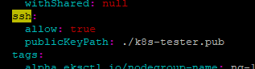

#### 3.2.3 创建 EKS 集群

执行以下命令，创建集群：

```
eksctl create cluster -f eks-test.yaml
```

期待输出：
```
...
[✓]  EKS cluster "ddbawstest" in "us-east-1" region is ready
```

需要等待以下过程均完成（总耗时约 5~20 分钟），才会显示结果：

- EKS 集群创建完成；
- 节点组创建完成；
- 节点组加入 EKS 集群。

集群创建完成后，可在[AWS CloudFormation 控制台](https://console.aws.amazon.com/cloudformation) 中查看名为 `eksctl-cluster_name-cluster `的 AWS CloudFormation 堆栈，查看创建的所有资源。

### 3.3 配置集群安全组
由于 eksctl 对自动配置集群安全组的支持有限，我们需要手动配置安全组，具体步骤如下
- 进入 AWS console
- 打开EC2

  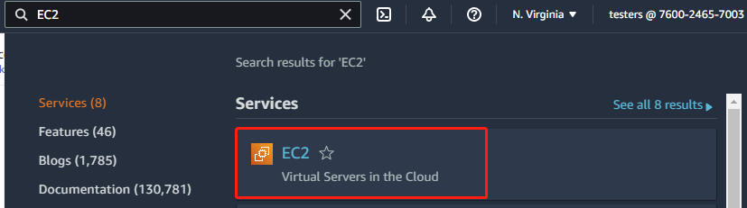

- 点击实例
- 点击安全
- 点击安全组

  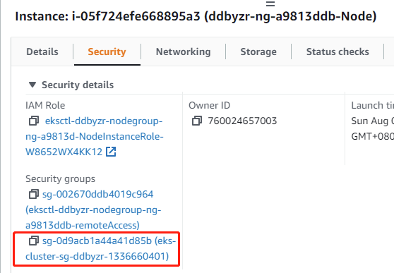

- 点击“编辑入站规则”

  

- 添加规则

  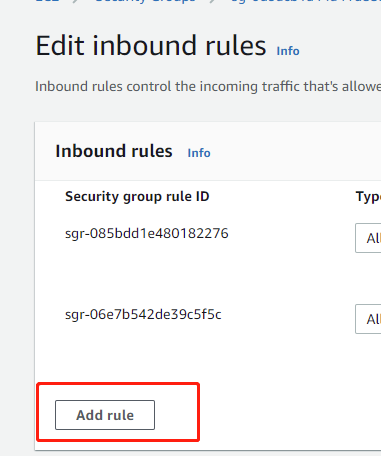

- 选择“所有流量”和“我的IP”并保存。完成配置后，这个安全组里的所有实例会接收来自本IP的访问。也可以选择`Custom`，然后设置一个 CIDR 范围，范围内的IP都可以访问安全组里的所有实例。

  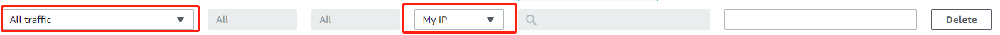

### 3.4 配置 StorageClass

本小节介绍如何为本地存储配置 StorageClass。

Local Path Povisioner 可以在 Kubernetes 环境中作为本机路径的 CSI，使用节点的本机路径来动态分配持久化存储。本节将介绍具体实现方法。

>注意："Local path provisioner"只是提供了 storageclass ，用于创建 pvc ,如果用户使用其他类型的 sci ,则不需要部署,可以作为没有 sci 的用户的参考项

- 从 github 上下载 local-path-provisioner 安装文件：
  ```
  wget https://raw.githubusercontent.com/rancher/local-path-provisioner/master/deploy/local-path-storage.yaml
  ```
  期望输出：
  ```
  --2022-08-07 10:36:07--  https://raw.githubusercontent.com/rancher/local-path-provisioner/master/deploy/local-path-storage.yaml
  Resolving raw.githubusercontent.com (raw.githubusercontent.com)... 185.199.109.133, 185.199.110.133, 185.199.111.133, ...
  Connecting to raw.githubusercontent.com (raw.githubusercontent.com)|185.199.109.133|:443... connected.
  HTTP request sent, awaiting response... 200 OK
  Length: 2939 (2.9K) [text/plain]
  Saving to: ‘local-path-storage.yaml’

  100%[======================================>] 2,939       --.-K/s   in 0s

  2022-08-07 10:36:07 (56.9 MB/s) - ‘local-path-storage.yaml’ saved [2939/2939]
  ```
- 修改配置：

  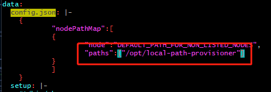

  配置该路径目的是持久化存储容器中的数据（详细介绍参考 [local-path-provisioner配置](https://github.com/rancher/local-path-provisioner#configuration) ）
  >注意：
  >修改分配 PV 的本机路径：找到名为 "local-path-config" 的 ConfigMap 资源，其 data 字段下的 "config.json" 里包含的属性 "paths" 即为分配的 K8s 集群中的节点路径。如果配置了多个节点路径，将随机选取其中一个作为 PV。
- 在 Kubernetes 环境中部署：
  ```
  kubectl apply -f  local-path-storage.yaml
  ```
  期望输出：
  ```
  namespace/local-path-storage created
  serviceaccount/local-path-provisioner-service-account created
  clusterrole.rbac.authorization.k8s.io/local-path-provisioner-role created
  clusterrolebinding.rbac.authorization.k8s.io/local-path-provisioner-bind created
  deployment.apps/local-path-provisioner created
  storageclass.storage.k8s.io/local-path created
  configmap/local-path-config created
  ```


## 4 安装及部署 DolphinDB MGR
### 4.1 创建 namespace

执行以下命令，创建 DolphinDB 集群部署的 namespace

```
kubectl create namespace dolphindb
```

期望输出：

```
namespace/dolphindb created
```

### 4.2 部署 DolphinDB MGR
- 配置环境变量
  ```
  export HELM_EXPERIMENTAL_OCI=1
  aws ecr get-login-password \
      --region us-east-1 | helm registry login \
      --username AWS \
      --password-stdin 709825985650.dkr.ecr.us-east-1.amazonaws.com
  ```
  期望输出：
  ```
  Login succeeded
  ```

- 执行以下命令，下载 AWS 上的 Helm chart 包。命令中 `$DolphinDB_MGR_version` 为你想下载的版本号，例如：v1.0.3
  ```
  mkdir awsmp-chart && cd awsmp-chart
  helm pull oci://709825985650.dkr.ecr.us-east-1.amazonaws.com/dolphindb/dolphindb-mgr-byol --version $DolphinDB_MGR_version
  ```
  期望输出：
  ```
  Pulled: 709825985650.dkr.ecr.us-east-1.amazonaws.com/dolphindb/dolphindb-mgr-byol:v1.0.3
  Digest: sha256:b99a4df2c5f1b4c95e26d620616be4f88bdfd5061d6f3352c2c222a926e56fab
  ```

- 解压缩 Helm chart 并安装
  ```
  tar xf $(pwd)/* && find $(pwd) -maxdepth 1 -type f -delete
  helm install dolphindb-mgr dolphindb-mgr-byol --set global.version=$version --set global.serviceType=NodePort --set global.storageClass=local-path --set-file license.content=../dolphindb.lic -ndolphindb --create-namespace
  ```
  >上面代码中 `global.version` 为当前的 DolphinDB MGR 版本（如"v1.0.3"）。
  >
  >DolphinDB 必须校验过 License 后才能启动，所以安装指令中需配置 `license.content` 为 License 文件所在的路径。
  
  期望输出：
  ```
  NAME: dolphindb-mgr
  LAST DEPLOYED: Thu Aug  4 05:55:49 2022
  NAMESPACE: dolphindb
  STATUS: deployed
  REVISION: 1
  TEST SUITE: None
  ```

- 检查部署是否成功
  ```
  kubectl -n dolphindb get po
  ```
  期望输出：
  ```
  NAME                                              READY   STATUS    RESTARTS   AGE
  dolphindb-mgr-alertmanager-0                      1/1     Running   0          52s
  dolphindb-mgr-grafana-84bcc6c495-ql5v4            1/1     Running   0          52s
  dolphindb-mgr-loki-0                              1/1     Running   0          52s
  dolphindb-mgr-node-exporter-pgvg6                 1/1     Running   0          52s
  dolphindb-mgr-prometheus-server-c4cf8fdff-kpnxc   1/1     Running   0          52s
  dolphindb-operator-0                              1/1     Running   0          52s
  dolphindb-operator-1                              0/1     Pending   0          44s
  dolphindb-webserver-68d6bd6cc9-mkh55              1/1     Running   0          52s
  dolphindb-webserver-68d6bd6cc9-v8szd              1/1     Running   0          52s
  ```
  > 因为 EKS 只部署了一个实例，所以只有一个 operator 在运作，并不会影响 DolphinDB MGR 的正常使用。

## 5. 部署 DolphinDB  
### 5.1 可视化界面
DolphinDB MGR 提供的可视化界面默认使用 NodePort 的 ServiceType 进行服务暴露。在完成 DolphinDB MGR 部署之后，可在 Kubernetes 环境中查看可视化界面对应的 Service：
```
kubectl -ndolphindb get svc | grep dolphindb-webserver
```
输出结果
```
dolphindb-webserver               NodePort    10.100.47.141    <none>        8080:31268/TCP   24m
```
通过浏览器访问 DolphinDB MGR 的可视化界面：
```
http://$nodeIP:$NodePort/dolphindb-cloud
```
>$nodeIP：Kubernetes 环境中任意 node 的 IP。
>
>$NodePort：终端显示信息中 DolphinDB MGR 的可视化界面对应的 NodePort（输出结果中的"31268"）。

本教程访问地址为 http://3.227.20.112:31268/dolphindb-cloud/

### 5.2 部署 DolphinDB 
1. 点击新建集群
  
    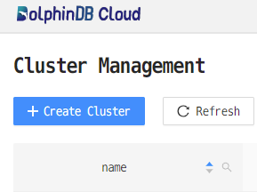

2. 选择配置
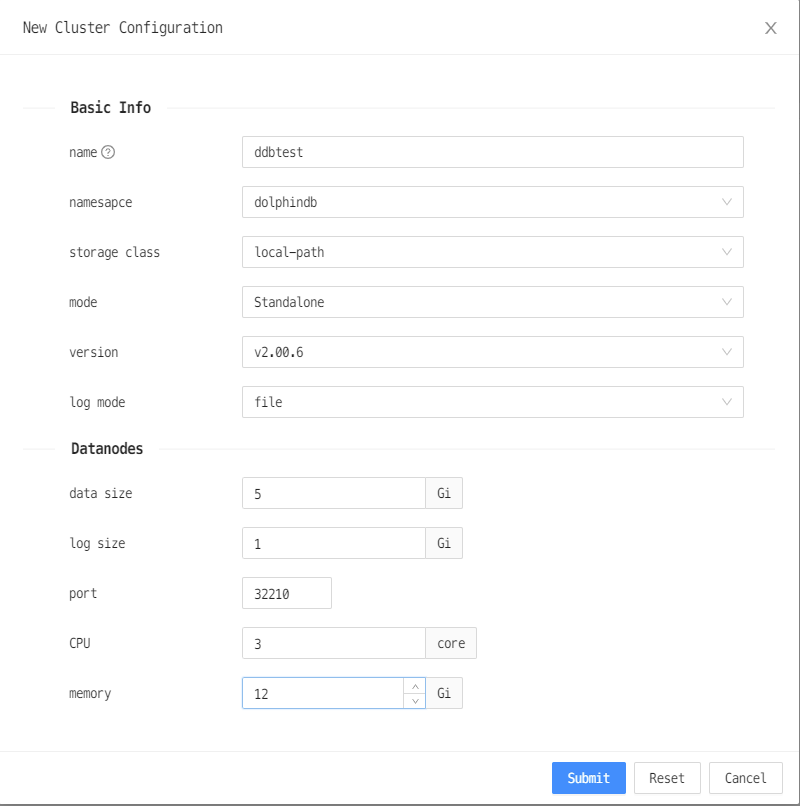

  - 名称：集群名称，可以自行配置
  - 储存类：选择 "local-path"
  - 模式：选择“单机节点”
  - 版本：DolphinDB 服务器版本，可以自选 
  - 日志模式：分别为标准输出和输出到文件。输出到文件性能更佳（推荐）。
  - CPU：pod 的 CPU 数量。因为社区版限制 CPU 个数上限为2，这里选择 2 
  - 内存：pod 的 内存 大小。为避免操作系统 OOM killer 杀死 DolphinDB 进程，建议设置值大于8G。本教程设置为12G

3. 成功部署DolphinDB

  - 状态变成 Available，表示 DolphinDB 创建成功，可以正常提供服务。
    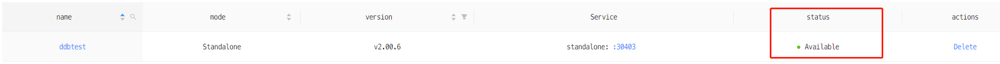

4. 连接 DolphinDB 

    如图所示，DolphinDB 的端口为30403。
    你可以通过浏览器访问此节点：
    ```
    $IP:30403
    ```
    也可以通过 DolphinDB GUI 来访问此节点。DolphinDB GUI 的安装及使用请参阅 [GUI 简介](https://gitee.com/dolphindb/Tutorials_CN/blob/master/client_tool_tutorial.md#1-dolphindb-gui)以及 [GUI 用户手册](https://www.dolphindb.cn/cn/gui/index.html)
5. 运行命令
    连接节点成功之后，输入语句测试节点是否可用：
    ```
    version()
    ```
    期待输出如下图：
    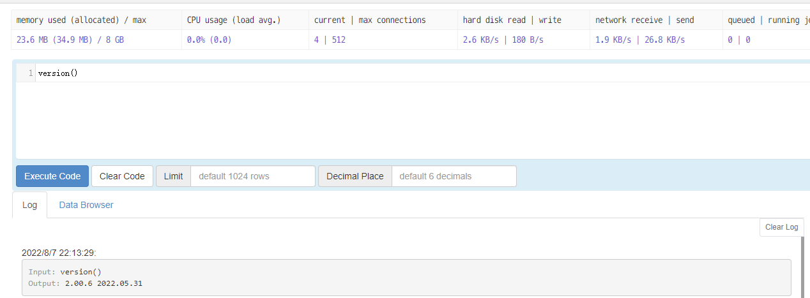

关于如何在 K8s 上部署 DolphinDB 的更多介绍，请参见 [基于K8s的DolphinDB 部署教程](https://gitee.com/dolphindb/Tutorials_CN/blob/master/k8s_deployment.md#23-%E9%83%A8%E7%BD%B2%E5%B9%B6%E8%BF%9E%E6%8E%A5-dolphindb-%E9%9B%86%E7%BE%A4)

## 6. 清理环境
### 6.1 销毁 DolphinDB 

有两种方式可以销毁 DolphinDB 
1. 通过 web 管理器中的**删除**按钮销毁
    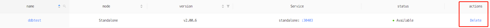

2. 通过命令行进行销毁
    ```
    kubectl delete ddb $ddbName -n dolphindb
    ```
    其中，$ddbName 是之前设置的 DolphinDB 名称
### 6.2 卸载 DolphinDB MGR

通过以下命令可以卸载 DolphinDB MGR
```
helm uninstall dolphindb-mgr -n dolphindb
```

### 6.3 删除 EKS 集群

通过以下命令可以删除 EKS 集群
```
eksctl delete cluster --name=$cluster_name
```