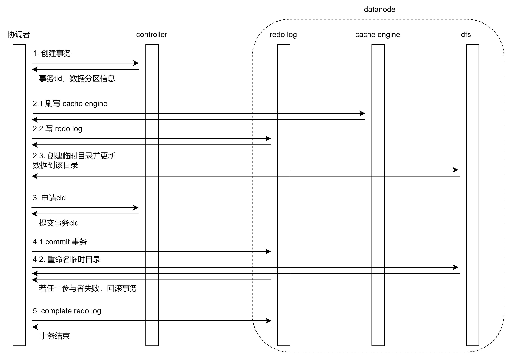
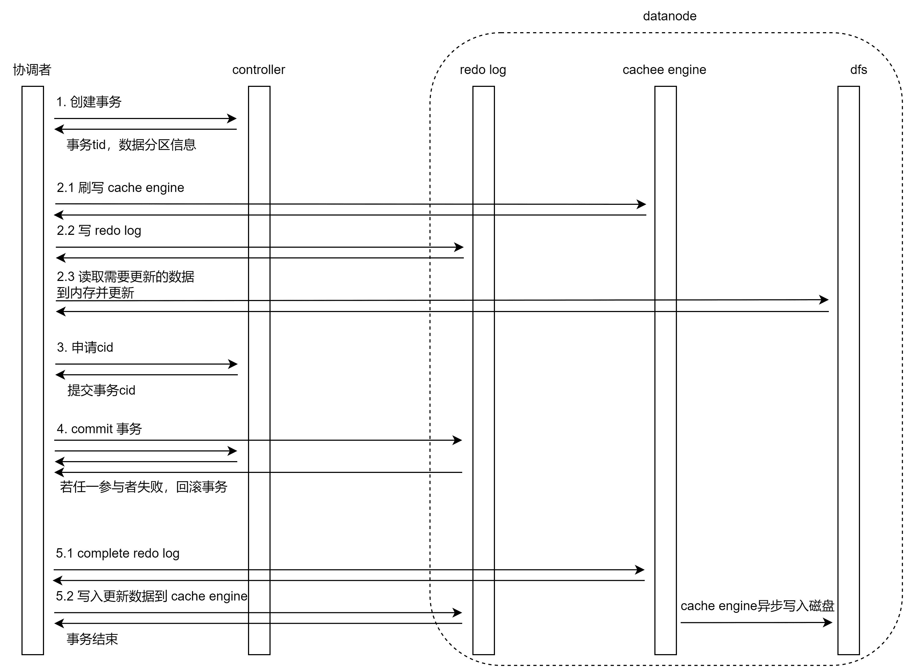

# 分布式表数据更新原理和性能

- [1. 概述](#1-概述)
- [2. 使用方法](#2-使用方法)
- [3. 存储机制简介](#3-存储机制简介)
  - [3.1. OLAP 引擎存储结构](#31-olap-引擎存储结构)
  - [3.2. TSDB 引擎存储结构](#32-tsdb-引擎存储结构)
- [4. 数据更新原理](#4-数据更新原理)
  - [4.1. OLAP 存储引擎更新原理](#41-olap-存储引擎更新原理)
  - [4.2. TSDB 存储引擎更新原理](#42-tsdb-存储引擎更新原理)
- [5. 数据更新实验](#5-数据更新实验)
  - [5.1. 实验准备](#51-实验准备)
  - [5.2. OLAP 引擎更新实验](#52-olap-引擎更新实验)
  - [5.3. TSDB 引擎更新实验](#53-tsdb-引擎更新实验)
- [6. 性能分析](#6-性能分析)
- [7. 总结](#7-总结)
- [8. 附件](#8-附件)

## 1. 概述

DolphinDB 从 1.30.6 版本开始支持更新分布式表数据。更新操作支持事务，具备事务 [ACID](https://en.wikipedia.org/wiki/ACID) 的特性，且通过 [MVCC](https://en.wikipedia.org/wiki/Multiversion_concurrency_control) 实现快照隔离级别。DolphinDB 为多模数据库，目前支持两种存储引擎：OLAP 和 TSDB。本文将分别介绍两种存储引擎的更新操作相关的原理，并通过实验验证和分析相关性能。

## 2. 使用方法

DolphinDB 提供 3 种更新分布式表的方法：

- 标准 SQL 的 `update` 语法（注意，DolphinDB 仅支持关键字小写）；

- `sqlUpdate`方法，动态生成 SQL update 语句的元代码。生成元代码后，通过 `eval` 函数执行。具体用法见：[元编程](./meta_programming.md)；

- `upsert!` 方法，若新数据的主键值已存在，更新该主键值的数据；否则添加数据。

下面通过一个简单的例子介绍更新分布式表的 3 种方法：

- 通过 update SQL 和 sqlUpdate 方法更新所有 ID=1 的行的 vol 列数据；

- 通过 upsert! 更新第一个 ID=1 所在行的 date 和 vol 列数据。

1. 使用附件脚本建库表；

2. 更新数据：

    方法 1，下列 update SQL 语句执行后，ID 为 1 的所有记录的 vol 值更新为 1：

    ```
    update pt set vol = 1 where ID = 1
    ```

    方法 2，下列 sqlUpdate 语句执行后，ID 为 1 的所有记录的 vol 值更新为 2：

    ```python
    sqlUpdate(pt, <2 as vol>, where=<ID = 1>).eval()
    ```

    方法 3，下列 upsert! 语句执行后，第一个 ID=1 所在记录的 date 更新为 2022.08.07，vol 更新为 3：

    ```python
    newData = table(1 as ID, 2022.08.07 as date, 3 as vol)
    upsert!(pt, newData, keyColNames=`ID)
    ```

## 3. 存储机制简介

在了解更新原理之前，需要先简单了解 DolphinDB 的存储机制。

DolphinDB 内置分布式文件系统 DFS，由其统一管理各个节点的存储空间，在对数据集进行分割时，可以全局优化，规避数据分布不均匀等问题。通过 DFS，我们可以将同一集群中不同数据节点上的存储文件夹组织起来，形成一个单独的、逻辑的、层次式的共享文件系统。更多分区数据库介绍可以参考：[分区数据库](./database.md)。

DolphinDB 提供配置项 volume，可以为每个节点指定数据文件的存储路径，用户可以通过 `pnodeRun(getAllStorages)` 查询路径。

### 3.1. OLAP 引擎存储结构

在 OLAP 中，每个分区内部都会为表的每列数据分别存储一个列文件。例如第 2 节脚本创建的使用 OLAP 引擎的表 pt，其分区 \[0, 50) 的数据文件保存在 \<volumes\>\/CHUNKS\/db1\/0_50\/gA\/pt_2 路径下，其中：

- db1 为库名；

- 0_50 为范围分区 \[0, 50)；

- gA 为表的物理名索引，于 1.30.16/2.00.4 版本为支持表级分区时引入；

- pt_2 为 pt 表的版本文件夹，其中“_2“指表在库内的序号，于 1.30.1 版本支持 renameTable 特性时引入。

用户可以进入库名目录，通过 tree 命令查看表的数据文件目录结构，如下所示：

```console
$ tree
.
├── 0_50
│   └── gA
│       └── pt_2
│           ├── date.col
│           ├── ID.col
│           └── vol.col
├── 50_100
│   └── gA
│       └── pt_2
│           ├── date.col
│           ├── ID.col
│           └── vol.col
├── dolphindb.lock
├── domain
└── pt.tbl

6 directories, 9 files
```

### 3.2. TSDB 引擎存储结构

TSDB 引擎以 [LSM 树（Log Structured Merge Tree）](https://en.wikipedia.org/wiki/Log-structured_merge-tree)的结构存储表数据。例如第 2 节脚本创建的使用 TSDB 引擎的表 pt1，分区 \[0, 50) 的数据文件保存在 \<volumes\>\/CHUNKS\/TSDB_db1\/0_50\/gE\/pt1_2 路径下，路径组成同 OLAP 引擎。

在库名目录使用 tree 命令查看内容，可以看到 pt1 表的 level file，也就是 LSM 树的分层数据文件，如下所示，其中开头下划线前的数字表示层级，目前支持 4 层：

```console
$ tree
.
├── 0_50
│   └── gE
│       ├── chunk.dict
│       └── pt1_2
│           └── 0_00000623
├── 50_100
│   └── gE
│       ├── chunk.dict
│       └── pt1_2
│           └── 0_00000624
├── dolphindb.lock
├── domain
```

如果 level file 未及时生成，用户可以执行 flushTSDBCache()，将 TSDB 引擎缓冲区里已经完成的事务强制写入磁盘。

## 4. 数据更新原理

下面分别介绍 OLAP 和 TSDB 存储引擎更新分布式表数据的基本原理。

### 4.1. OLAP 存储引擎更新原理

#### 4.1.1. 更新流程

<br/>

分布式表数据更新过程是一个事务，采用 [两阶段提交](https://en.wikipedia.org/wiki/Two-phase_commit_protocol)协议和 [MVCC](https://en.wikipedia.org/wiki/Multiversion_concurrency_control) 机制，OLAP 引擎数据更新的具体流程如下：

1. 向控制节点申请创建事务，控制节点会给涉及的分区加锁，并分配事务 tid，返回分区 chunk ID 等信息；

2. 判断是否开启 OLAP cache engine：

    1. 如果开启了 cache engine，先刷写所有已完成的事务的缓存数据到磁盘；
    1. 数据写入 redo log；
    1. 在数据节点上创建事务和对应临时目录，并更新数据到该目录下。

    通过事务 tid 生成一个临时的路径，格式为”physicalDir_tid_tidValue”，并把数据更新到该目录下。如果某些列的数据无变化，则直接创建原列文件的硬链接；对于 linux 这种支持硬链接但不支持跨 volume，或类似 beegfs 这种不支持硬链接的文件系统，则采用复制的方式来解决。

    如果没有开启 cache engine，只做第 2.3 步；

3. 向控制节点申请事务提交的 cid。

    更新事务 commit 时，生成一个单调递增的 cid，即 Commit ID 作为提交动作的唯一标识，每个表的元数据有一个 createCids 数组记录该 cid；

4. 通知所有事务参与者提交事务：

    1. 写 commit redo log 并持久化到磁盘；
    1. 重命名临时目录为 "physicalDir_cid"；

5. 通知所有事务参与者完成事务，写 complete redo log。

    不管参与者节点是否成功完成事务，协调者都标记完成事务。如果有失败的情况，通过事务决议和 recovery 机制来恢复。

    事务结束后，最终只会保留最后一个版本，因为程序启动后，其他版本都是历史数据，应该回收掉，不应该继续保留。

#### 4.1.2. 定期回收机制

在实际操作中，用户常常会进行多次数据更新，导致上述目录序列不断增加。为此，系统提供了定期垃圾回收的机制。默认情况下，系统每隔 60 秒回收一定时间值之前更新生成的目录。在开始周期性垃圾回收前，系统最多保留 5 个更新版本。

#### 4.1.3. 快照隔离级别

更新数据的整个过程是一个事务，满足 ACID 特性，且通过多版本并发控制机制（MVCC, Multi-Version Concurrency Control）进行读写分离，保证了数据在更新时不影响读取。例如，不同用户同时对相同数据表进行更新和查询操作时，系统将根据操作发生的顺序为其分配 cid，并将它们和 createCids 数组里的版本号对比，寻找所有版本号中值最大且小于 cid 的文件路径，此路径即为该 cid 对应的操作路径。如需要在线获取最新的 cid，可执行 getTabletsMeta().createCids 命令。

### 4.2. TSDB 存储引擎更新原理

#### 4.2.1. 建表参数

DolphinDB TSDB 引擎在建表时另外提供了两个参数：sortColumns 和 keepDuplicates。

- sortColumns：用于指定表的排序列。系统默认 sortColumns 最后一列为时间列，其余列字段作为排序的索引列，其组合值称作 sortKey。目前不支持更新 sortColumes 列。

- keepDuplicates：用于去重，即指定在每个分区内如何处理所有 sortColumns 的值相同的数据。参数默认值为 ALL，表示保留所有数据；取值为 LAST 表示仅保留最新数据；取值为 FIRST 表示仅保留第一条数据。

#### 4.2.2. 更新策略

不同的 keepDuplicates 参数值，会有不同的数据更新策略。

- keepDuplicates=LAST

    这种情况下数据更新实质上是向 LSM 树的内存缓冲区追加数据。这部分数据最终会持久化到 level 0 层级的 level file 里，故不会产生新的版本目录。通过在 LSM 树中增加 cid 列来实现 MVCC。查询时，TSDB 引擎会做过滤，只返回最新的数据。

    写入量达到一定值或更新后一段时间内，会自动合并 level file 以节省硬盘空间。若未及时触发 level file 的合并，可以手动执行 `triggerTSDBCompaction()`  强制触发指定 chunk 内 level 0 级别的所有 level file 的合并操作。

    更新流程图如下：

    

    1. 向控制节点申请创建事务，控制节点会给涉及的分区加锁，并分配事务 tid，返回分区 chunk ID 等信息；

    2. TSDB 必须开启 cache engine：

        1. 刷写 cache engine 里所有已完成的事务的缓存数据到磁盘；
        1. 数据写入 redo log；
        1. 读取需要更新的数据到内存并更新，即只读取需要更新的 level file 的部分数据；

    3. 向控制节点申请事务提交的 cid。

        更新事务 commit 时，生成一个单调递增的 cid，即 Commit ID 作为提交动作的唯一标识，每个表的元数据有一个 createCids 数组记录该 cid；

    4. 通知所有事务参与者提交事务，写 commit redo log 并持久化到磁盘；

    5. 通知所有事务参与者完成事务：

        1. 写 complete redo log；
        1. 写入更新的数据到 cache engine，cache engine 的后台线程会异步写入数据到磁盘。

- keepDuplicates=FIRST 或 keepDuplicates=ALL

    在这两种情况下，更新操作流程与 OLAP 基本相同，也是采用两阶段提交协议，每个分区每次更新产生一个独立的目录，且整个更新过程是一个事务，具备 ACID 特性，通过 MVCC 实现快照隔离级别。过期版本的清理机制也与 OLAP 相同。

    但是第 2.3 步读取要更新的数据到内存并更新到临时目录，TSDB keepDuplicates=FIRST 或 ALL 策略与 OLAP 不同，会读出所有文件进行更新，即未变化的列也会被更新，然后将更新的 level file 信息写入到元数据中。因此，我们也建议用户首先确定分区数据量较小（不能大于可用内存空间）再进行更新操作，否则容易导致内存溢出。

## 5. 数据更新实验

接下来我们通过实验来验证数据更新的基本原理，并对比分析 OLAP 和 TSDB 引擎在常见场景的性能特点。

### 5.1. 实验准备

#### 5.1.1. 部署集群

- Linux 系统

- DolphinDB v2.00.7 版本

- 单机集群部署 1 个控制节点 +1 个数据节点

- 单 SSD 硬盘，硬盘速度为 6 Gbps，文件系统为 xfs

- 开启 cache engine 和 redo log

#### 5.1.2. 创建库表和写入数据

参考[《DolphinDB 入门：物联网范例》](./iot_examples.md) 第 2.3、2.4 节，创建多值模型数据库表，并写入数据。注意此处[脚本](./script/multipleValueModeWrite.txt)为异步写入，可以通过 `getRecentJobs()` 方法查看写入是否完成。

本实验将模拟 100 台机器 5 天的数据量，每台机器每天产生 86400 条记录，5 天总数据量为 43200000 条。OLAP 和 TSDB 引擎的基本数据和建库名如下表所示：

|              | OLAP     | TSDB     |
| ------------ | -------- | -------- |
| 占用磁盘空间 | 8.3 GB   | 8.3 G    |
| 每个分区大小 | 169 MB   | 170 MB   |
| 建库名       | olapDemo | tsdbDemo |

参考以下脚本修改[《DolphinDB 入门：物联网范例》](iot_examples.md) 2.3 节的 `createDatabase` 函数。注意实验中需要修改 `createPartitionedTable` 函数的 *keepDuplicates* 参数值：

```python
def createDatabase(dbName,tableName, ps1, ps2, numMetrics){
 m = "tag" + string(1..numMetrics)
 schema = table(1:0,`id`datetime join m, [INT,DATETIME] join take(FLOAT,numMetrics) )
 db1 = database("",VALUE,ps1)
 db2 = database("",RANGE,ps2)
 db = database(dbName,COMPO,[db1,db2],,'TSDB')
 db.createPartitionedTable(schema,tableName,`datetime`id ,,`id`datetime, keepDuplicates=LAST)
}
```

实验的基本思路为观察执行 update 语句前后数据目录和文件的变化与上文阐述的原理是否一致。

### 5.2. OLAP 引擎更新实验

- 更新前

    首先进入到需要更新的数据所在目录，默认位置在 \<HomeDir\>/\<nodeAlias\>/storage/CHUNKS/olapDemo/20200901/1_11/2。其中，最后的 2 为表的物理名索引。通过 tree 命令查看 machines 表的列数据文件：

    ```console
    $ tree
    .
    └── 2
        └── machines_2
            ├── datetime.col
            ├── id.col
            ├── tag10.col
            ├── tag11.col
             ...
            └── tag9.col
    ```

- 执行更新

    在 GUI 执行如下脚本，对分区 20200901 下分区 1_11 里的数据进行 20 次更新：

    ```console
    machines = loadTable("dfs://olapDemo", "machines")
    for(i in 0..20)
     update machines set tag1=i,tag5=i where id in 1..5,date(datetime)=2020.09.01
    ```

    更新过程中使用 ll 命令可以看到，命名带 tid 的中间文件夹已生成：

    ```console
    $ ll
    total 20
    drwxrwxr-x 2 dolphindb dolphindb 4096 Sep  7 05:26 machines_2_115
    drwxrwxr-x 2 dolphindb dolphindb 4096 Sep  7 05:26 machines_2_116
    drwxrwxr-x 2 dolphindb dolphindb 4096 Sep  7 05:26 machines_2_117
    drwxrwxr-x 2 dolphindb dolphindb 4096 Sep  7 05:26 machines_2_118
    drwxrwxr-x 2 dolphindb dolphindb 4096 Sep  7 05:26 machines_2_119
    drwxrwxr-x 2 dolphindb dolphindb  120 Sep  7 05:26 machines_2_tid_120
    ```

- 更新后

    查看目录文件，如果没触发周期性清理旧版本，可以看到只保留了 5 个更新版本：

    ```console
    $ ll
    total 20
    drwxrwxr-x 2 dolphindb dolphindb 4096 Sep  7 05:26 machines_2_121
    drwxrwxr-x 2 dolphindb dolphindb 4096 Sep  7 05:26 machines_2_122
    drwxrwxr-x 2 dolphindb dolphindb 4096 Sep  7 05:26 machines_2_123
    drwxrwxr-x 2 dolphindb dolphindb 4096 Sep  7 05:26 machines_2_124
    drwxrwxr-x 2 dolphindb dolphindb 4096 Sep  7 05:26 machines_2_125
    ```

    在触发周期性清理旧版本前，使用 ll 命令查看更新后的列数据文件，注意到只有更新的列 tag1 和 tag5 的数据文件链接数为 1，其他数据文件链接数均为 5 即硬链接。这是因为只更新了 tag1 和 tag5 的列，其他列无变化，因此直接创建了硬链接。如下所示：

    ```console
    $ ll machines_2_125/
    total 169632
    -rw-rw-r-- 5 dolphindb dolphindb 3469846 Sep  7 05:15 datetime.col
    -rw-rw-r-- 5 dolphindb dolphindb   14526 Sep  7 05:15 id.col
    -rw-rw-r-- 5 dolphindb dolphindb 3469845 Sep  7 05:15 tag10.col
    -rw-rw-r-- 5 dolphindb dolphindb 3469846 Sep  7 05:15 tag11.col
    ...
    -rw-rw-r-- 1 dolphindb dolphindb 1742158 Sep  7 05:26 tag1.col
    ...
    -rw-rw-r-- 1 dolphindb dolphindb 1742158 Sep  7 05:26 tag5.col
    ...
    ```

    更新后过一段时间，发现只保留了最新的版本。这是因为系统会定时进行回收，最终只保留一个最新的副本。如下所示：

    ```console
    $ ll
    total 4
    drwxrwxr-x 2 dolphindb dolphindb 4096 Sep  7 05:26 machines_2_125
    ```

### 5.3. TSDB 引擎更新实验

#### 5.3.1. keepDuplicates = LAST

- 更新前

    首先设置 createPartitionedTable 方法的 keepDuplicates 参数为 LAST，然后建库和导入数据。

    进入需要更新的数据所在的目录，默认位置在 \<HomeDir\>/\<nodeAlias\>/storage/CHUNKS/tsdbDemo/20200901/1_11/S，最后的 S 为表的物理名索引。用 tree 命令查看 machines 表的 level file：

    ```console
    $ tree
    .
    ├── chunk.dict
    └── machines_2
        ├── 0_00000010
        ├── 0_00000011
        ├── 0_00000012
        ├── 0_00000013
        ├── 0_00000014
        └── 1_00000002
    
    1 directory, 7 files
    ```

- 执行更新

    在 GUI 执行如下脚本，对分区 20200901 下分区 1_11 里的数据进行 20 次更新：

    ```console
    machines = loadTable("dfs://tsdbDemo", "machines")
    for(i in 0..20)
     update machines set tag1=i,tag5=i where id in 1..5,date(datetime)=2020.09.01
    ```

    更新时或更新后，用 tree 命令查看数据文件，可见并没有生成新版本的临时目录，但 machines_2 目录下的 level file 变多，说明 keepDuplicates =LAST 时，更新等同于追加数据。如下所示：

    ```console
    $ tree
    .
    ├── chunk.dict
    └── machines_2
        ├── 0_00000010
        ├── 0_00000011
        ├── 0_00000012
        ├── 0_00000013
        ├── 0_00000014
        ├── 0_00000241
        ├── 0_00000243
         ...
        ├── 1_00000002
        ├── 1_00000050
        └── 1_00000051
    
    1 directory, 21 files
    ```

- 更新后

    更新后过一段时间，用 tree 命令查看数据文件，发现 level file 进行了合并。合并 level file 时，系统会自动删除更新时的冗余数据，数量由 20 个减少为 6 个。如下所示：

    ```console
    tree
    .
    ├── chunk.dict
    └── machines_2
        ├── 0_00000272
        ├── 0_00000274
        ├── 0_00000276
        ├── 1_00000002
        ├── 1_00000050
        └── 1_00000051
    
    1 directory, 7 files
    ```

#### 5.3.2. keepDuplicates = ALL

- 更新前

    设置 createPartitionedTable 方法的 keepDuplicates 参数为 ALL，然后建库和导入数据。

    通过 tree 命令查看 machines 表的 level file：

    ```console
    $ tree
    .
    ├── chunk.dict
    └── machines_2
        ├── 0_00000273
        ├── 0_00000275
        ├── 0_00000277
        ├── 0_00000278
        ├── 0_00000279
        └── 1_00000054
    
    1 directory, 7 files
    ```

- 执行更新

    更新过程中使用 tree 命令可以看到，有命名包含 tid 的中间文件夹生成：

    ```console
    $ tree
    .
    ├── chunk.dict
    ├── machines_2
    │   ├── 0_00000273
    │   ├── 0_00000275
    │   ├── 0_00000277
    │   ├── 0_00000278
    │   ├── 0_00000279
    │   └── 1_00000054
    └── machines_2_tid_199
        ├── 0_00000515
        ├── 0_00000516
        ├── 0_00000517
        ├── 0_00000518
        └── 0_00000519
    ```

- 更新后

    使用 tree 命令，可以看到如果没触发周期性清理旧版本，则保留了 5 个更新版本，如下所示：

    ```console
    $ tree
    .
    ├── chunk.dict
    ├── machines_2_215
    │   ├── 0_00000595
    │   ├── 0_00000596
    │   ├── 0_00000597
    │   ├── 0_00000598
    │   └── 0_00000599
    ├── machines_2_216
    │   ├── 0_00000600
    │   ├── 0_00000601
    │   ├── 0_00000602
    │   ├── 0_00000603
    │   └── 0_00000604
    ├── machines_2_217
    │   ├── 0_00000605
    │   ├── 0_00000606
    │   ├── 0_00000607
    │   ├── 0_00000608
    │   └── 0_00000609
    ├── machines_2_218
    │   ├── 0_00000610
    │   ├── 0_00000611
    │   ├── 0_00000612
    │   ├── 0_00000613
    │   └── 0_00000614
    └── machines_2_219
        ├── 0_00000615
        ├── 0_00000616
        ├── 0_00000617
        ├── 0_00000618
        └── 0_00000619
    ```

    在触发周期性清理旧版本前，使用 ll 查看更新后的列数据文件，注意到所有 level  file 链接数均为 1，即不存在硬链接：

    ```console
    $ ll machines_2_219
    total 284764
    -rw-rw-r-- 1 dolphindb dolphindb 57151251 Sep  7 05:48 0_00000615
    -rw-rw-r-- 1 dolphindb dolphindb 57151818 Sep  7 05:48 0_00000616
    -rw-rw-r-- 1 dolphindb dolphindb 58317419 Sep  7 05:48 0_00000617
    -rw-rw-r-- 1 dolphindb dolphindb 59486006 Sep  7 05:48 0_00000618
    -rw-rw-r-- 1 dolphindb dolphindb 59482644 Sep  7 05:48 0_00000619
    ```

    更新后过一段时间，发现只保留了最新的版本：

    ```console
    $ tree 
    .
    ├── chunk.dict
    └── machines_2_219
        ├── 0_00000615
        ├── 0_00000616
        ├── 0_00000617
        ├── 0_00000618
        └── 0_00000619
    
    1 directory, 6 files
    ```

#### 5.3.3. keepDuplicates = FIRST

createPartitionedTable 方法的 keepDuplicates 参数为 FIRST 时更新操作的表现与 keepDuplicates 参数为 ALL 时相同。

## 6. 性能分析

在上文实验的基础上，我们重复执行循环更新脚本，并统计耗时。

更新 1 条记录的 2 列脚本如下：

```python
machines = loadTable("dfs://olapDemo", "machines")
timer update machines set tag1=1, tag5=5 where id=1 and datetime=2020.09.01T00:00:00
```

更新 20 次 分区 20200901 下分区 1_11 里的数据，总计 432000*20=8640000 条记录，2 列脚本如下：

```python
machines = loadTable("dfs://olapDemo", "machines")
timer{
for(i in 0..20)
 update machines set tag1=i,tag5=i where id in 1..5,date(datetime)=2020.09.01
}
```

更新 20 次 分区 20200901 下分区 1_11 里的数据，总计 432000*20=8640000 条记录，20 列脚本如下：

```python
machines = loadTable("dfs://olapDemo", "machines")
timer{
for(i in 0..20)
 update machines set tag1=i,tag2=i,tag3=i,tag4=i,tag5=i,tag6=i,tag7=i,tag8=i,tag9=i,tag10=i,tag11=i,tag12=i,tag13=i,tag14=i,tag15=i,tag16=i,tag17=i,tag18=i,tag19=i,tag20=i where id in 1..5,date(datetime)=2020.09.01
}
```

统计更新操作耗时如下表：

| 配置 | 第一次执行耗时（ms） | 第二次执行耗时（ms） | 第三次执行耗时（ms） |
|---|---|---|---|
| OLAP |  |  |  |
| 更新 1 条记录的 2 列 | 131.263 | 135.649 | 150.013 |
| 更新 8640000 条记录的 2 列 | 1,389.31 | 1,414.918 | 1,331.718 |
| 更新 8640000 条记录的 20 列 | 6,309.484 | 5,800.256 | 5,511.421 |
| TSDB，keepDuplicates=LAST |  |  |  |
| 更新 1 条记录的 2 列 | 29.745 | 31.686 | 29.333 |
| 插入 1 条记录 | 10.002 | 12.259 | 10.14 |
| 更新 8640000 条记录的 2 列 | 19,358.699 | 21,832.69 | 19,686.798 |
| 更新 8640000 条记录的 20 列 | 20,782.819 | 22,750.596 | 20,643.41 |
| 插入 8640000 条记录 | 10,813.92 | 9,506.557 | 12,695.168 |
| TSDB，keepDuplicates=ALL |  |  |  |
| 更新 8640000 条记录的 20 列 | 69,385.771 | 70,563.928 | 62,621.552 |
| TSDB，keepDuplicates=FIRST |  |  |  |
| 更新 8640000 条记录的 20 列 | 57,614.807 | 65,081.804 | 58,425.8 |

注：程序运行性能受硬件性能、系统运行状况等因素影响，该表格运行耗时仅供参考。

- 存储引擎配置为 OLAP 时

    更新性能与需要更新的列数有关，因为更新操作实现为重新生成需要更新的列，而对未更新的列使用了硬链接。故更新 20 列比更新 2 列耗时明显长。

- 存储引擎配置为 TSDB 且 keepDuplicates=LAST 时

    性能相较  keepDuplicates=ALL 或  keepDuplicates=FIRST 更好，因为更新操作只需要向 LSM 树的追加数据，而 LSM 树具有吞吐量大的特点，写性能优异。更新性能比插入性能慢 2-3 倍，是因为更新需要先读取数据到内存，而插入不需要。

- 存储引擎配置为 TSDB 且 keepDuplicates=ALL 或 FIRST 时

    更新性能较差，因为该配置下每次更新都会在一个新的目录产生一个新的版本，且未变化的列也会被更新，磁盘 IO 较大，故而性能较差。

综上所述，DolphinDB 只适合低频更新。使用 TSDB 引擎时，若对更新的性能有要求，建议配置 keepDuplicates=LAST。

## 7. 总结

本文对比介绍了 OLAP 和 TSDB 两种存储引擎更新分布式表数据的使用方法和基本原理，通过实验来验证基本原理，并分析了常见场景的性能问题。

OLAP 存储引擎的更新性能与需要更新的列数和操作系统是否支持硬链接有关。TSDB 存储引擎的更新性能与建表参数 keepDuplicates 有关，建表参数 keepDuplicates=LAST 比 TSDB keepDuplicates=ALL 或 FIRST 时更新性能更好。

实际应用中使用哪种引擎需要考虑更多的应用场景和实际的性能，更多详细信息可见：

- [TSDB 存储引擎](https://docs.dolphindb.cn/zh/db_distr_comp/db/tsdb.html)
- [OLAP 存储引擎](https://docs.dolphindb.cn/zh/db_distr_comp/db/olap.html)

有关上述各章节提到的函数，参考：[函数章节](https://docs.dolphindb.cn/zh/funcs/funcs_intro.html)

## 8. 附件

- [建库表脚本](script/dolphindb_update/dolphindb_update.dos)
