# DolphinDB与任务调度器DolphinScheduler的集成

DolphinDB 是一款高性能时序数据库。DolphinDB集成了功能强大的编程语言和高容量高速度的批流一体数据分析系统，为海量数据（特别是时间序列数据）的快速存储、检索、计算及分析提供一站式解决方案。在实际生产环境中，经常存在数据导入、转换、查询计算，更新等一系列流程任务，各个部分之间存在依赖，如何将这些DolphinDB任务按照需求准确、有效率地调度，可以借用DolphinScheduler 任务调度器。本文将从生产环境中的一个ETL场景出发，将 DolphinScheduler 引入到DolphinDB的高可用集群中，通过使用DolphinScheduler提供的功能来调度DolphinDB的数据ETL作业。

- 
	- [1. Apache DolphinScheduler](#1-apache-dolphinscheduler)
		- [1.1 特性](#11-特性)
		- [1.2 安装部署](#12-安装部署)
		- [1.3 DolphinDB 与 DolphinScheduler 结合](#13-dolphindb-与-dolphinscheduler-结合)
			- [1.3.1 如何创建DolphinDB数据源](#131-如何创建dolphindb数据源)
			- [1.3.2 如何调度DolphinDB任务](#132-如何调度dolphindb任务)
	- [2. 调度DolphinDB数据ETL任务](#2-调度dolphindb数据etl任务)
		- [2.1 任务流程结构](#21-任务流程结构)
			- [2.1.1 DolphinDB 功能模块部分](#211-dolphindb-功能模块部分)
			- [2.1.2 DolphinDB 脚本部分](#212-dolphindb-脚本部分)
		- [2.2 数据介绍](#22-数据介绍)
		- [2.3 数据导入、指标计算与校验任务](#23-数据导入指标计算与校验任务)
			- [2.3.1 数据清洗、处理、入表](#231-数据清洗处理入表)
			- [2.3.2 K分钟线因子指标计算](#232-k分钟线因子指标计算)
			- [2.3.3 数据校验与K分钟线指标校验](#233-数据校验与k分钟线指标校验)
		- [2.4 实现DolphinDB任务调度](#24-实现dolphindb任务调度)
		- [2.5 获取 DolphinDB 任务调度结果](#25-获取-dolphindb-任务调度结果)
			- [2.5.1 查看 DolphinDB 任务执行情况](#251-查看-dolphindb-任务执行情况)
			- [2.5.2 获取 DolphinDB 任务运行过程中的信息](#252-获取-dolphindb-任务运行过程中的信息)
				- [SQL任务节点非查询类型](#sql任务节点非查询类型)
				- [SQL任务节点查询类型](#sql任务节点查询类型)
				- [如何获取 DolphinDB 任务运行过程中的信息](#如何获取-dolphindb-任务运行过程中的信息)
		- [2.6 DolphinDB脚本开发注意事项](#26-dolphindb脚本开发注意事项)
	- [3. DolphinScheduler 与 Airflow 对比](#3-dolphinscheduler-与-airflow-对比)
	- [4.常见问题](#4常见问题)
		- [1.  DolphinScheduler status显示running，web的登陆页面却无法登录](#1--dolphinscheduler-status显示runningweb的登陆页面却无法登录)
		- [2.  DolphinScheduler设置开机自启动后，服务器重启无法正常启动](#2--dolphinscheduler设置开机自启动后服务器重启无法正常启动)
	- [5. 附录](#5-附录)

## 1. Apache DolphinScheduler

Apache DolphinScheduler 是一个分布式易扩展的可视化DAG工作流任务调度开源系统。该系统适用于企业级场景，提供了一个支持可视化操作任务、工作流和全生命周期数据处理的解决方案，解决了数据研发ETL依赖错综复杂，无法监控任务健康状态的问题。 DolphinScheduler 以 DAG（Directed Acyclic Graph，DAG）流式方式组装任务，可以及时监控任务的执行状态，支持重试、指定节点恢复失败、暂停、恢复、终止任务等操作。

### 1.1 特性

- **执行定时任务**：在生产环境中，一个普遍的需求是周期性地从数据源中提取、转换、加载数据到DolphinDB，如每一天、每个小时等，DolphinScheduler 可以方便地进行定时管理，满足需求。
- **执行历史任务**：有时候我们由于业务变动，需要将历史数据进行重新计算和加载入DolphinDB。在这种情况下，我们仅需在DolphinScheduler Web界面上定义相应任务的工作流，并定义和传入开始时间和结束时间的参数。通过这个步骤，我们可以处理任意时间段的数据。
- **并行执行任务**：在业务中，我们可能需要同时处理多项数据ETL任务，如同时导入数据到DolphinDB的不同表或同一个表的不同分区。DolphinScheduler允许我们并行执行多项工作流任务，提高执行效率。  
- **高效处理编排**：在生产环境中，大多数情况下存在任务之间、工作流之间有条件地执行，比如在DolphinDB的数据ETL中，下游任务依赖于上游任务的执行状态做不同的操作，有的任务之间关系错综复杂。可以在 DolphinScheduler 中可以按照逻辑对工作流进行定义，轻松编排任务之间的关系。

### 1.2 安装部署

DolphinScheduler 可在单机、单服务器集群、多服务器集群、K8S环境下部署，本节内容将以单机部署流程作为演示内容，仅供参考。

**前置条件**

- JDK：安装[JDK](https://www.oracle.com/java/technologies/downloads/)(1.8+)并配置JAVA_HOME环境变量，DolphinScheduler的启动依赖于该环境变量，同时将其下的bin目录追加到**PATH**环境变量中。  
- 二进制包：已配置**DolphinDB数据源**的DolphinScheduler版本，下载链接在https://cdn.dolphindb.cn/downloads/apache-dolphinscheduler-3.1.7-bin.tar.gz
- 本教程将 **MySQL** 作为 DolphinScheduler 持久化的元数据库，因此要保证服务器已安装好**MySQL**，若没有，需要下载安装，所有平台的mysql下载地址为：[MySQL 下载地址](https://dev.mysql.com/downloads/mysql/)

**元数据持久化配置**

单机服务使用[H2数据库](https://www.h2database.com/html/main.html)来存储元数据，而H2数据库是一种内存级别的数据库，因此当DolphinScheduler程序重启时，会导致之前定义的工作流等内容全部丢失，需要重新定义，造成效率低下和不必要的麻烦。因此，将元数据持久化是非常有必要的，DolphinScheduler支持 **MySQL** 和 **PostgreSQL** 作为元数据的存储数据库，本文以配置MySQL为例，主要有以下流程：

- 解压DolphinScheduler程序包

```
tar -xvzf apache-dolphinscheduler-3.1.7-bin.tar.gz
cd apache-dolphinscheduler-3.1.7-bin
```
- 进入MySQL，创建数据库和用户

```
// 创建数据库
CREATE DATABASE dolphinscheduler DEFAULT CHARACTER SET utf8 DEFAULT COLLATE utf8_general_ci;
// 创建用户，并设置密码
CREATE USER 'dolphinscheduler'@'%' IDENTIFIED BY '密码';
// 给用户赋予库的权限
GRANT ALL PRIVILEGES ON dolphinscheduler.* TO 'dolphinscheduler'@'%';
flush privileges;
```

- 修改`apache-dolphinscheduler-3.1.7-bin/bin/env/dolphinscheduler_env.sh`文件设定环境变量，将 `{user}` 和 `{password}` 改为上一步创建的用户名和密码

```
export DATABASE=mysql
export SPRING_PROFILES_ACTIVE=${DATABASE}
export SPRING_DATASOURCE_URL="jdbc:mysql://127.0.0.1:3306/dolphinscheduler?useUnicode=true&characterEncoding=UTF-8&useSSL=false"
export SPRING_DATASOURCE_USERNAME={user}
export SPRING_DATASOURCE_PASSWORD={password}
```

- 修改`apache-dolphinscheduler-3.1.7-bin/standalone-server/conf/application.yaml`文件中的配置（在文件尾部），上半部分由于这里用的不是postgresql，直接注释掉就好。将 `{user}` 和 `{password}` 改为上面创建的用户名和密码

```
---
#spring:
#  config:
#    activate:
#      on-profile: postgresql
#  quartz:
#    properties:
#      org.quartz.jobStore.driverDelegateClass: org.quartz.impl.jdbcjobstore.PostgreSQLDelegate
#  datasource:
#    driver-class-name: org.postgresql.Driver
#    url: jdbc:postgresql://127.0.0.1:5432/dolphinscheduler
#    username: root
#    password: root

---
spring:
  config:
    activate:
      on-profile: mysql
  sql:
     init:
       schema-locations: classpath:sql/dolphinscheduler_mysql.sql
  datasource:
    driver-class-name: com.mysql.cj.jdbc.Driver
    url: jdbc:mysql://127.0.0.1:3306/dolphinscheduler?useUnicode=true&characterEncoding=UTF-8
    username: {user}
    password: {password}
 
```

- 初始化数据库，如果上述步骤没有问题，这里就不会报错：

```
bash apache-dolphinscheduler-3.1.7-bin/tools/bin/upgrade-schema.sh
```

- 执行完成之后进入 MySQL 查询会发现名称为`dolphinscheduler` 的数据库已经生成了很多表格

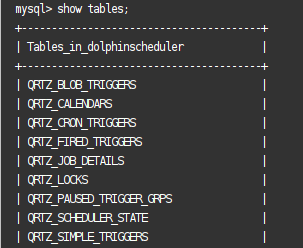

**启动DolphinScheduler单机服务器**

> 注意：启动DolphinScheduler需要依赖多个端口号，分别是：`12345、50052、25333、25334、1234、5678`
>
> 使用 `lsof -i:<port>` 检查以上端口号是否被占用，如果有端口被别的进程占用，修改`apache-dolphinscheduler-3.1.7-bin/standalone-server/conf/application.yaml`中对应的端口

1. 当配置好以上内容之后，进入执行`apache-dolphinscheduler-3.1.7-bin` 目录并执行以下命令启动：

```
bash ./bin/dolphinscheduler-daemon.sh start standalone-server
```

2. 输入以下命令查看是否执行成功

​　　　　a. 运行 `jps` 查看相应实例是否已在进程中

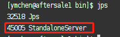

​　　　　b. 运行 `bash ./bin/dolphinscheduler-daemon.sh status standalone-server` 查看 standalone-server的运行状态

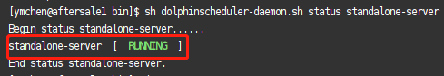

3. 停止运行

```
bash ./bin/dolphinscheduler-daemon.sh stop standalone-server
```

4. 启动成功后，在浏览器中输入 `服务器IP:12345/dolphinscheduler/ui/login` 进行登录

　　　　a. 默认用户名：admin

​　　　　b. 默认密码：dolphinscheduler123

登陆成功后将会看到如下页面：

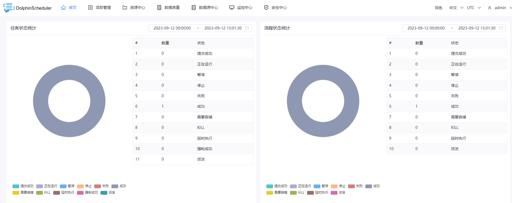

- 重启dolphinscheduler服务，测试已经连接好数据库

  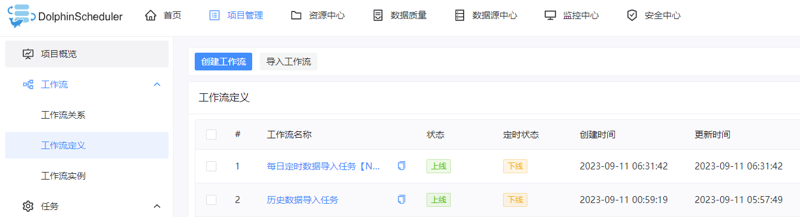

### 1.3 DolphinDB 与 DolphinScheduler 结合

DolphinDB作为强大的高性能时序数据库，能够高效存储和处理PB级的海量数据集，可以通过编写脚本实现数据的处理、存储、因子计算、建模、回测等任务。在实际生产中，源数据下载、数据处理、数据入库、数据校验、指标计算等任务之间存在先后关系和条件关系，如果在DolphinDB脚本中编写相关的逻辑关系代码，一来会造成与实际任务不相关的脚本冗余，二来如果实际业务变动，需要增加或删减部分任务，相互依赖的任务之间的关系代码也需要变动，造成更新迭代效率低下。考虑到这种情况，如果能够将DolphinDB与DolphinScheduler结合起来，在DolphinDB中编写相关任务代码模块，在DolphinScheduler上将这些任务按照逻辑编排调度，这样，就能够将任务代码和任务之间逻辑关系分开，每个部分专注于发挥自己的作用，实现更高效地运行维护。

#### 1.3.1 如何创建DolphinDB数据源

1. 在安装部署好DolphinScheduler之后，登录其Web界面，点击数据源中心并点击创建数据源

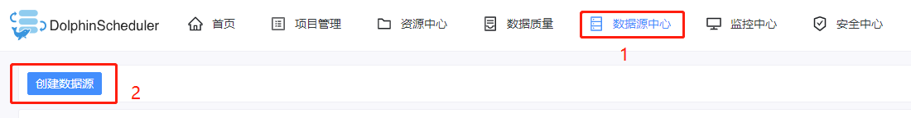

2. 输入相关参数定义，创建DolphinDB数据源

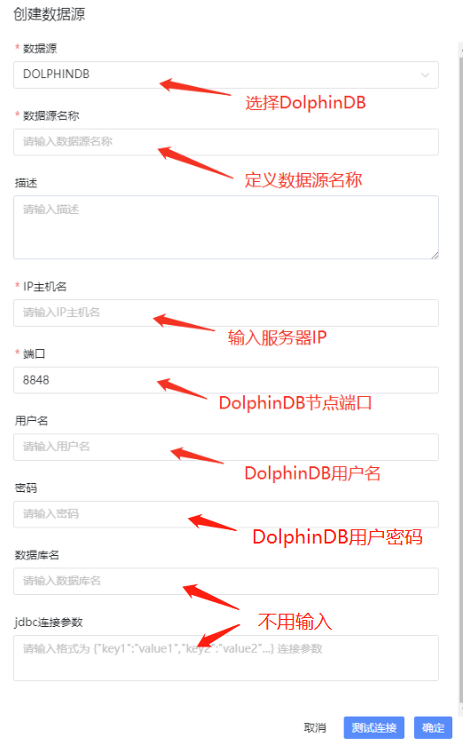

> 注意：数据库名和jdbc连接参数不用填，不然会报错 JDBC connect failed。

#### 1.3.2 如何调度DolphinDB任务

创建DolphinDB数据源后，需要创建租户、项目、工作流，具体流程可参考：[DolphinScheduler 部署流程](https://dolphinscheduler.apache.org/zh-cn/docs/3.1.5/guide/project/workflow-definition)

定义好工作流之后，点击该工作流进入操作界面，接着在左端拖拽 **SQL 节点** 进行DolphinDB任务定义

> 注意：SQL类型分为查询类型和非查询类型，这两种类型分别适用于不同的使用场景，在本文 2.5.2 小节中会详细介绍。

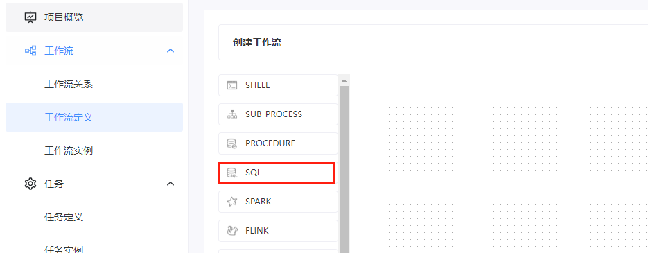

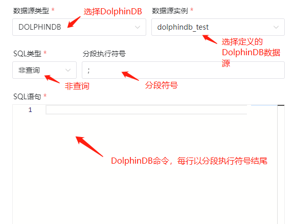

由于在SQL任务节点中，**每次只能执行一行DolphinDB代码**。因此，调度DolphinDB任务主要有以下两种途径：

1. **run 函数**

假设DolphinDB脚本在服务器上的路径是：`/data/script.dos` ，那么，在SQL语句上可以输入：

```
run("/data/script.dos");
```

2. **函数视图**

​　　　　a. 在DolphinDB编写函数：

```
// 在DolphinDB中定义一个函数，用于创建数据库表
def createTable(dbName, tbName){
	login("admin", "123456")

	if(!existsDatabase(dbName)){
		db1 = database(, VALUE, 2020.01.01..2021.01.01)
		db2 = database(, HASH, [SYMBOL, 10])
		db = database(dbName, COMPO, [db1, db2], , "TSDB")
	}else{
		db = database(dbName)
	}
    if(!existsTable(dbName,tbName)){
        name =`SecurityID`ChannelNo`ApplSeqNum`MDStreamID`SecurityIDSource`Price
              `OrderQty`Side`TradeTIme`OrderType`OrderIndex`LocalTime`SeqNo
              `Market`DataStatus`BizIndex
        type = [SYMBOL, INT, LONG, INT, INT, DOUBLE, INT, 
                SYMBOL, TIMESTAMP, SYMBOL, INT, TIME, LONG, SYMBOL,INT,LONG]
        schemaTable = table(1:0, name, type)
        db.createPartitionedTable(table=schemaTable, tableName=tbName, 
                partitionColumns=`TradeTime`SecurityID, 
                compressMethods={TradeTime:"delta"}, 
                sortColumns=`Market`SecurityID`TradeTime, keepDuplicates=ALL)
    }
    else{
        writeRunLog("数据库：" + dbName + " 数据表：" + tbName + " 已存在...")
    }
}
```

​　　　　b. 将函数添加为函数视图，作用是使得该函数视图**全局可用**

```
// 添加为函数视图
addFunctionView(createTable)
```

​　　　　c. 在dolphinScheduler上调用该函数视图

```
// 在SQL语句内输入以下内容：
createTable("dfs://testDb", "testTb");
```

 

上述两种方法的区别是：

- 使用`run` 执行脚本不能传递参数，灵活性较差
- 使用函数视图可以在DolphinScheduler上面**传入参数**，以上面为例，可以在SQL语句中输入：

```
createTable(${dbName}, ${tbName});
```

传入参数的方法有局部参数和全局参数两种方法，它们的区别是全局参数可以在创建工作流实例时直接进行修改，而局部参数需要进入到工作流中的具体任务节点进行修改：

1. 局部参数在**定义任务节点**时定义

   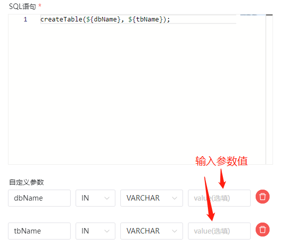

2. 全局参数在**保存工作流**时定义

   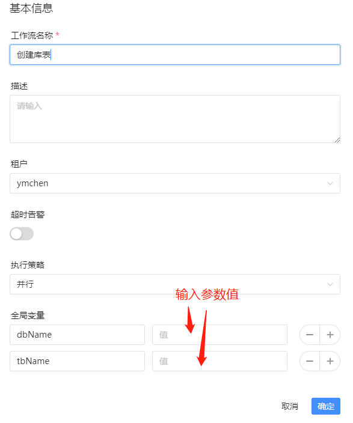

## 2. 调度DolphinDB数据ETL任务

### 2.1 任务流程结构

- **文件结构**

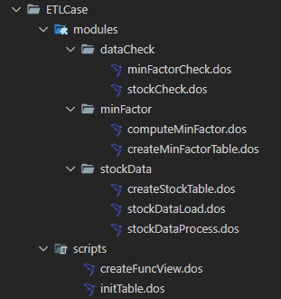

#### 2.1.1 DolphinDB 功能模块部分

- **stockData** : 数据导入模块
  - `createStockTable.dos` : 定义创建相应的股票数据库表的函数。
  - `stockDataProcess.dos` : 定义将源数据进行清洗、处理与格式转换的函数。
  - `stockDataLoad.dos` : 定义将数据导入相应的DolphinDB库表的函数。
- **minFactor** : 分钟线因子指标相关模块
  - `createMinFactorTable.dos` : 定义创建分钟线因子指标库表的函数。
  - `computeMinFactor.dos` : 定义计算分钟线因子指标的函数。
- **dataCheck** : 数据校验模块
  - `stockCheck.dos` : 定义校验导入的股票逐笔委托、快照行情、逐笔成交数据的函数。
  - `minFactorCheck.dos` : 定义校验分钟线因子指标数据的函数。

#### 2.1.2 DolphinDB 脚本部分

- `initTable.dos` : 执行该脚本可以创建相应的股票数据库表和分钟因子指标库表。
- `createFuncView.dos` : 执行该脚本可以定义需要在**dolphinScheduler**上用到的函数视图。

### 2.2 数据介绍

本文选取了 20230201 上交所某股票 level 2 委托数据、快照数据、成交数据作为演示。以下是**逐笔委托表**在DolphinDB的结构。快照数据和成交数据结构可在附件中查看：

| **字段名**       | **字段含义**   | **数据类型(DolphinDB)** |
| :--------------- | :------------- | :---------------------- |
| ChannelNo        | 通道代码       | INT                     |
| ApplSeqNum       | 消息记录号     | LONG                    |
| MDStreamID       | 行情类别       | INT                     |
| SecurityID       | 证券代码       | SYMBOL                  |
| SecurityIDSource | 证券代码源     | INT                     |
| Price            | 委托价格       | DOUBLE                  |
| OrderQty         | 委托数量       | INT                     |
| Side             | 委托买卖方向   | SYMBOL                  |
| TradeTime        | 委托时间       | TIMESTAMP               |
| OrderType        | 委托类型       | SYMBOL                  |
| OrderIndex       | 委托序号       | INT                     |
| LocalTime        | 本地接受时间戳 | TIME                    |
| SeqNo            | 消息序列号     | LONG                    |
| Market           | 交易市场       | SYMBOL                  |
| DataStatus       | 数据状态       | INT                     |
| BizIndex         | 业务序列号     | LONG                    |

### 2.3 数据导入、指标计算与校验任务

> 注意：以下各部分内容均将相关函数定义在模块中，以方便进行工程化管理，关于DolphinDB模块的创建、加载、调用方法，请参照：[DolphinDB 模块复用教程](module_tutorial.md)

#### 2.3.1 数据清洗、处理、入表

由于源数据的字段结构有时候不符合我们的业务需求，因此需要增删、处理一些字段后再导入数据库，下面以**逐笔委托数据**为例，介绍源数据经清洗、处理后再导入库表的过程，快照和成交数据的处理逻辑与委托数据相同，详细内容可以在附件中查看。

- **创建数据库表**

逐笔委托、快照、逐笔成交数据都保存在同一个库中，本文采用了组合分区作为分区方案，第一层按天分区，第二层对股票代码分25个哈希分区。如何确定数据分区请参照：[DolphinDB数据库分区教程](database.md)

```
module createStockTable

// 创建逐笔委托数据存储库表
def createEntrust(dbName, tbName,userName = "admin",password = "123456")
{
    login(userName, password)
    if(!existsDatabase(dbName))
    {
        db1 = database(, VALUE, 2020.01.01..2021.01.01)
        db2 = database(, HASH, [SYMBOL, 25])
        // 按天和股票组合分区
        db = database(dbName, COMPO, [db1, db2], , "TSDB")
    }
    else
    {
        db = database(dbName)
    }
    name=`ChannelNo`ApplSeqNum`MDStreamID`SecurityID`SecurityIDSource`Price`OrderQty`Side`TradeTIme`OrderType`OrderIndex`LocalTime`SeqNo`Market`DataStatus`BizIndex
    type = [INT, LONG, INT, SYMBOL, INT, DOUBLE, INT, SYMBOL, TIMESTAMP, SYMBOL, INT, TIME, LONG, SYMBOL,INT,LONG]
    schemaTable = table(1:0, name, type)
    // 创建分区表
    db.createPartitionedTable(table=schemaTable, tableName=tbName, partitionColumns=`TradeTime`SecurityID, compressMethods={TradeTime:"delta"}, sortColumns=`Market`SecurityID`TradeTime, keepDuplicates=ALL)
}
```

 

- **csv数据清洗与处理**

```
module stockData::stockDataProcess

// 定义逐笔委托csv数据文件中各个字段的名称和字段类型
def schemaEntrust()
{
    name = `DataStatus`OrderIndex`ChannelNo`SecurityID`TradeTime`OrderType`ApplSeqNum`Price`OrderQty`Side`BizIndex`LocalTime`SeqNo
    typeString = `INT`LONG`INT`SYMBOL`TIME`SYMBOL`INT`DOUBLE`INT`SYMBOL`INT`TIME`INT
    return table(name, typeString)
}

// 数据处理函数，包括字段增加，数据去重等操作
def processEntrust(loadDate, mutable t)
{
    // 字段名替换
    t.replaceColumn!(`TradeTime, concatDateTime(day, t.TradeTime))
    n1 = t.size()
    // 数据去重
    t = select * from t where isDuplicated([DataStatus, OrderIndex, ChannelNo, SecurityID, TradeTime, OrderType, ApplSeqNum, Price, OrderQty, Side, BizIndex],FIRST)=false
    n2 = t.size()
    // 增加字段
    update t set Market = `sh
    update t set MDStreamID = int(NULL)
    update t set SecurityIDSource = int(NULL)
    reorderColumns!(t, `ChannelNo`ApplSeqNum`MDStreamID`SecurityID`SecurityIDSource`Price`OrderQty`Side`TradeTime`OrderType`OrderIndex`LocalTime`SeqNo`Market`DataStatus`BizIndex)
    return t,n1,n2
}
```

 

- **将处理后的数据导入数据库表**

```
module stockData::stockDataLoad
use stockData::stockDataProcess

def loadEntrust(userName, userPassword, startDate, endDate, dbName, tbName, filePath, loadType,mutable infoTb)
{
	for(loadDate in startDate..endDate)
	{
		// 删除已有数据
		dateString = temporalFormat(loadDate,"yyyyMMdd")
		dataCount = exec count(*) from loadTable(dbName, tbName) where date(tradeTime)=loadDate
		// 如果表里面已经存在当天要处理的数据，删除库里面已有数据
		if(dataCount != 0){
			msg = "Start to delete the entrust data, the delete date is: " + dateString
			print(msg)
			infoTb.tableInsert(msg)

			dropPartition(database(dbName), loadDate, tbName)
			msg = "Successfully deleted the entrust data, the delete date is: " + dateString
			print(msg)
			infoTb.tableInsert(msg)
		}
		// 数据导入
		// 判断数据csv文件是否存在
		fileName = filePath + "/" + dateString + "/" + "entrust.csv"
		if(!exists(fileName))
		{
			throw fileName + "不存在!请检查数据源!"
		}
		// 如果是全市场数据，数据量较大，因此分批导入
		schemaTB = schemaEntrust()
		tmpData1 = loadText(filename=fileName, schema=schemaTB)
		tmpData1,n1,n2 = processEntrust(loadDate,tmpData1)
		pt = loadTable(dbName,tbName)
		msg = "the data size in csv file is :" + n2 + ", the duplicated count is " + (n1 - n2)
		print(msg)
		infoTb.tableInsert(msg)
		for(i in 0..23)
		{
			startTime = 08:00:00.000 + 1200 * 1000 * i
			tmpData2 = select * from tmpData1 where time(TradeTime)>=startTime and time(TradeTime)<(startTime+ 1200 * 1000)
			if(size(tmpData2) < 1)
			{
				continue
			}
			//数据入库
			pt.append!(tmpData2)
		}
		msg = "successfully loaded!"
		print(msg)
		infoTb.tableInsert(msg)
	}
}
```

#### 2.3.2 K分钟线因子指标计算

当导入数据之后，我们希望根据业务、策略对数据进行进一步加工，形成分钟线级别的因子指标，让数据产生价值，驱动业务发展。下面，我们以计算**成交数据**K分钟线因子指标为例，介绍该任务流程：

- **创建K分钟线结果存储表**

```
module minFactor::createMinFactorTable

def createMinuteFactor(dbName, tbName)
{
	if(existsDatabase(dbName)){
		dropDatabase(dbName)
	}
	//按天分区
	db = database(dbName, VALUE, 2021.01.01..2021.01.03,engine = `TSDB)
	colName = `TradeDate`TradeTime`SecurityID`Open`High`Low`Close`Volume`Amount`Vwap
	colType =[DATE, MINUTE, SYMBOL, DOUBLE, DOUBLE, DOUBLE, DOUBLE, LONG, DOUBLE, DOUBLE]
	tbSchema = table(1:0, colName, colType)
  	db.createPartitionedTable(table=tbSchema,tableName=tbName,partitionColumns=`TradeDate,sortColumns=`SecurityID`TradeTime,keepDuplicates=ALL)
}
```

 

- **计算K分钟线因子指标并入库**

```
module minFactor::computeMinFactor

def calFactorOneMinute(dbName, startDate, endDate, mutable factorTb,mutable infoTb)
{
	pt = loadTable(dbName, "trade")
	dayList = startDate..endDate
	if(dayList.size()>12) dayList = dayList.cut(12)
	for(days in dayList){
		//计算分钟 K 线
		res = select first(TradePrice) as open, max(TradePrice) as high, min(TradePrice) as low, last(TradePrice) as close, sum(tradeQty) as volume,sum(TradePrice*TradeQty) as amount,sum(TradePrice*TradeQty)\sum(TradeQty) as vwap from pt where date(tradeTime) in days group by date(tradeTime) as TradeDate,minute(tradeTime) as TradeTime, SecurityID
		msg = "Start to append minute factor result , the days is: [" + concat(days, ",")+"]"
		print(msg)
		infoTb.tableInsert(msg)
		//分钟 K 线入库
		factorTb.append!(res)
		msg = "Successfully append the minute factor result to databse, the days is: [" + concat(days, ",")+"]"
		print(msg)
		infoTb.tableInsert(msg)
	}
}
```

#### 2.3.3 数据校验与K分钟线指标校验

由于K分钟线因子指标计算依赖于上游导入数据的正确性，而业务中又依赖于K分钟线指标数据的正确性，因此，对这两部分数据进行校验是有必要的，下面介绍**部分校验步骤**，详细校验内容请参照**附件**：

- **股票数据校验**

```
module dataCheck::stockCheck 

def checkStockCounts(idate,dbName)
{
	// 校验逐笔委托、快照行情、逐笔成交表的股票个数是否一致

	getCodes = def (dbName,tbName,idate) {
		tb = loadTable(dbName,tbName)
		return exec distinct(SecurityID) from tb where date(tradetime)=idate and ((Market=`sh and SecurityID like "6%")or(Market=`sz and (SecurityID like "0%" or SecurityID like "3%" ) )) 
	}
	entrustCodes = getCodes(dbName,"entrust",idate)
	tradeCodes = getCodes(dbName,"trade",idate)
    snapshotCodes = exec distinct(SecurityID) from loadTable(dbName,"snapshot") where date(tradetime)=idate and ((Market=`sh and SecurityID like "6%")or(Market=`sz and (SecurityID like "0%" or SecurityID like "3%" ))) and  HighPrice != 0
	if(entrustCodes.size() != snapshotCodes.size() or entrustCodes.size() != tradeCodes.size() or snapshotCodes.size() != tradeCodes.size())
	{
		throw "逐笔委托股票数量：" + size(entrustCodes) + " 快照行情股票数量：" + size(snapshotCodes) + " 逐笔成交股票数量：" + size(tradeCodes) + ", 它们数量不一致！"
	}
}
```

- **K分钟线指标校验**

```
module dataCheck::minFactorCheck

def checkHighLowPrice(idate,dbName,tbName)
{
	// 分钟线最高价指标与最低价指标校验
	tb= loadTable(dbName,tbName)
	temp=select * from tb where tradedate=idate and High < Low 
	if(size(temp)>0)
	{
		throw "分钟线计算错误！分钟线最高价小于最低价！"
	}
}

def checkVolumeAmount(idate,dbName,tbName)
{
	// 分钟线交易量与交易额指标校验
	tb = loadTable(dbName,tbName)
	temp = select * from loadTable(dbName,tbName) where tradedate=idate and ((Volume == 0 and Amount != 0) or (Volume != 0 and Amount == 0))
	if(size(temp)>0)
	{
		throw "分钟线计算错误！交易量和交易额不同时为0！"
	}
}
```

### 2.4 实现DolphinDB任务调度

在定义好数据ETL模块之后，就可以通过以下步骤实现DolphinDB ETL任务的调度：

- **创建相关库表**

第一次执行时，需要创建相关数据库表

```
use stockData::createStockTable
use minFactor::createMinFactorTable

// 创建数据库表，库表名可以根据实际需要修改
createEntrust("dfs://stockData", "entrust")
createSnapshot("dfs://stockData", "snapshot")
createTrade("dfs://stockData", "trade")
createMinuteFactor("dfs://factorData", "stockMinFactor")
```

- **定义函数视图并执行**

由于每日定时ETL任务与历史批量ETL任务的整体处理逻辑相同，因此，在定义函数视图时通过传入参数来区分不同类型的任务，以定义**逐笔委托数据**导入任务函数视图为例，具体如下(全部函数视图定义请参照附件)：

```
use stockData::stockDataLoad
// 定义函数
def loadEntrustFV(userName="admin" , userPassword="123456", startDate = 2023.02.01, endDate = 2023.02.01, dbName = "dfs://stockData", tbName = "entrust", filePath = "/hdd/hdd8/ymchen", loadType = "daily")
{
	infoTb = table(1:0,["info"] ,[STRING])
	if(loadType == "daily")
	{
		sDate = today()
		eDate = today()
		loadEntrust(userName, userPassword, sDate, eDate, dbName, tbName, filePath, loadType,infoTb)
	}
	else if(loadType == "batch")
	{
		loadEntrust(userName, userPassword, date(startDate), date(endDate), dbName, tbName, filePath, loadType,infoTb)
	}
	return infoTb
}
```

> 注意：在定义函数视图时，一些默认参数如数据存放路径：filePath 需要根据实际情况进行更改

- **创建DolphinDB任务节点**

创建好每个任务的函数视图之后，每个函数视图对应于DolphinScheduler上的一个任务节点，以**逐笔委托数据**导入任务为例，我们分以下两种情况：

1. 对于**每日定时任务**，由于我们在定义函数视图时已经针对每日定时任务做了默认参数处理，因此仅需在DolphinScheduler任务节点的SQL语句中输入：

```
loadEntrustFV();
```

2. 对于**历史批量任务**，我们需要传入三个参数：开始时间*startDate*，结束时间*endDate* 以及任务类型*loadType* ，在DolphinScheduler任务节点的SQL语句中需要输入：

```
loadEntrustFV(startDate=${startDate},endDate=${endDate},loadType="batch");
```

> 注意：需要在DolphinScheduler上面定义局部参数或全局参数 *startDate* 和 *endDate* ，如何定义请参照**本文 1.3.2 小节**。

- **创建DolphinDB任务工作流**

我们需要在DolphinScheduler上创建两个工作流，一个是定时任务工作流，一个是历史批量任务工作流。在每个工作流中需要根据ETL流程编排具有逻辑关系的任务节点。以**历史批量任务**为例，创建如下工作流：

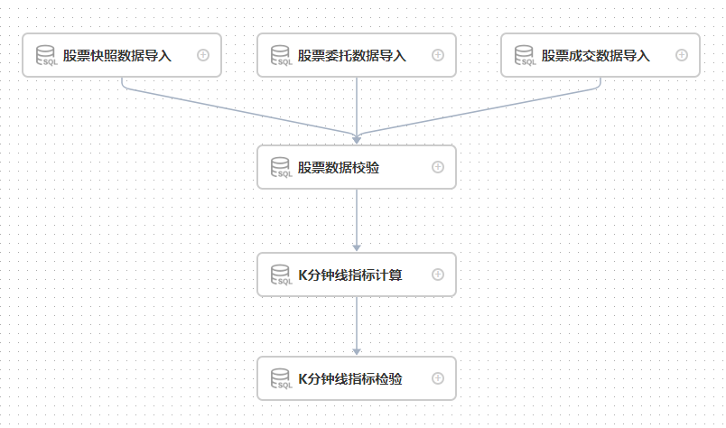

创建任务工作流之后，点击**运行**按钮就可以开始执行，点击**定时**按钮就可以进行定时管理

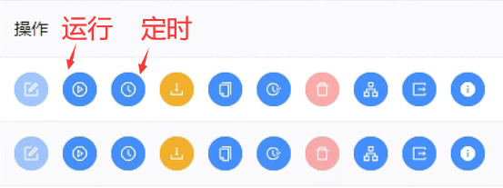

运行任务后，工作流实例为绿色代表整个工作流运行成功；黑色则表示存在失败任务，可以通过双击失败的工作流实例查看具体是哪个任务执行失败。

在DolphinScheduler中，可以**导入工作流**和**导出工作流**，以上介绍的DolphinDB每日任务与批量任务，可以直接通过附件中对应的**json文件**直接导入。

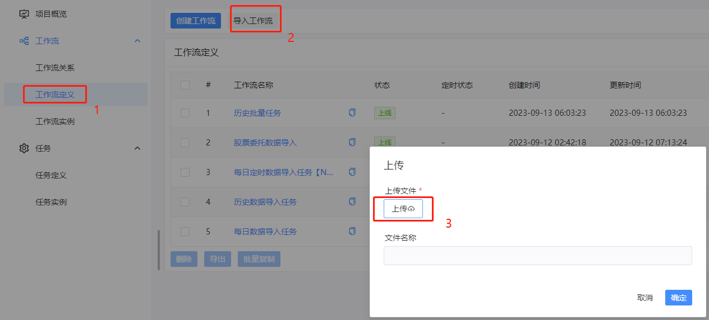

- **调度DolphinDB ETL 工作流**

导入工作流之后，点击**执行**按钮就可以开始执行

### 2.5 获取 DolphinDB 任务调度结果

#### 2.5.1 查看 DolphinDB 任务执行情况

在DolphinScheduler上运行DolphinDB工作流任务之后，可以通过以下步骤查看工作流任务运行情况：

- 进入工作流界面，可以看到所有工作流实例的状态，在状态栏，齿轮形状代表正在运行，绿色打勾代表工作流任务成功运行，黑色打叉代表工作流任务运行失败。

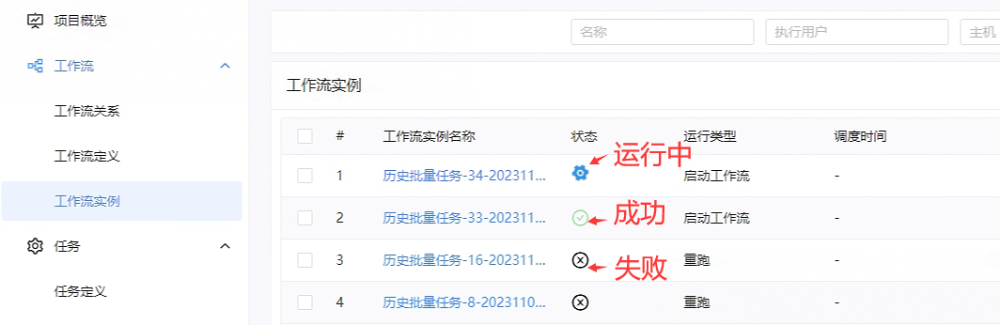

- 在工作流实例名称下，点击想要查看的工作流实例，进入该工作流详情界面：

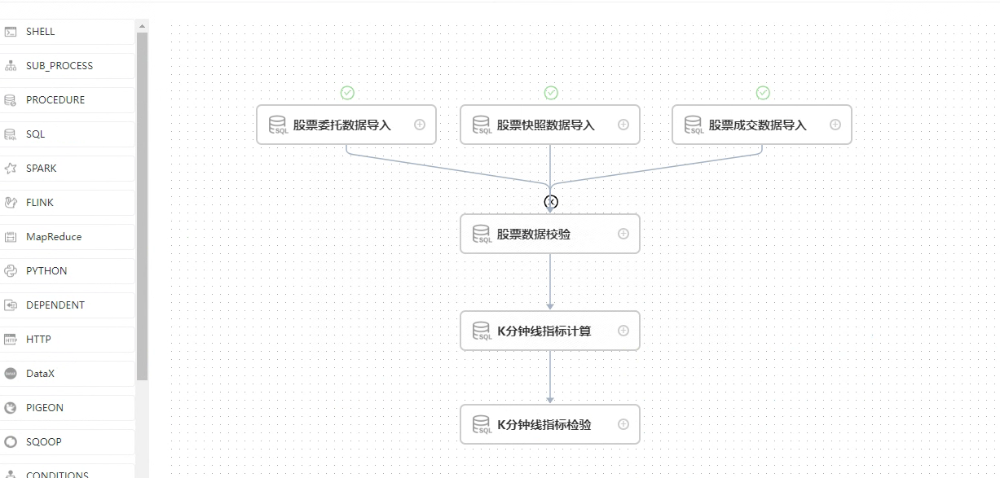

- 如上图所示，我们可以看到股票委托、快照、成交数据导入任务成功了，但是股票数据校验任务失败了，导致整个工作流任务执行失败。在该任务节点上点击**鼠标右键**，然后点击**查看日志**，就可以查看该任务节点具体的**报错信息：**

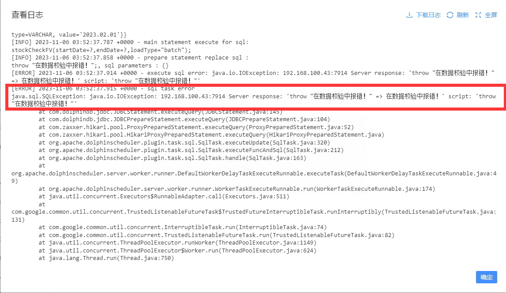

#### 2.5.2 获取 DolphinDB 任务运行过程中的信息

在任务执行过程中，在 DolphinScheduler 日志中并不能显示 DolphinDB 脚本中通过 `print` 函数输出的信息，但是在实践中大多数情况下存在保存任务运行信息以查看任务具体执行情况的需求。以下内容首先介绍DolphinDB SQL任务节点**查询类型**和**非查询类型**的特点，然后讲述如何在DolphinScheduler 任务节点的日志信息中显示DolphinDB任务的运行信息。

##### SQL任务节点非查询类型

非查询类型主要用于无结果返回的函数，它的特点主要有：

1. 可以以分段执行符号为界，执行多段代码。
2. 在任务节点的日志只能在报错时查看报错信息，在任务执行成功时并没有详细的运行信息。

##### SQL任务节点查询类型

查询类型主要用于有结果集返回的函数，它的特点主要有：

1. 在任务节点的日志不仅能在报错时查看报错信息，而且当任务执行成功时，能够在节点日志中查看在DolphinDB脚本中设定的运行信息。
2. 只能执行一行语句，不能执行多段代码。

##### 如何获取 DolphinDB 任务运行过程中的信息

下面，以股票委托数据导入任务为例，介绍如何在DolphinDB脚本中在不同运行阶段设定运行日志信息，以及在DolphinScheduler上当任务执行完毕之后在日志中显示完整的运行信息。

1. 在股票委托数据导入模块的函数中引入一个参数，该参数为内存表 *infoTb* ，当任务执行过程中，将需要记录的运行信息写入该表。

```
// 模块 stockData::stockDataLoad 的 loadEntrust 函数定义如下：

module stockData::stockDataLoad
use stockData::stockDataProcess

def loadEntrust(userName, userPassword, startDate, endDate, dbName, tbName, filePath, loadType,mutable infoTb)
{
    for(loadDate in startDate..endDate)
    {
        // 删除已有数据
        dateString = temporalFormat(loadDate,"yyyyMMdd")
        dataCount = exec count(*) from loadTable(dbName, tbName) where date(tradeTime)=loadDate
        // 如果表里面已经存在当天要处理的数据，删除库里面已有数据
        if(dataCount != 0){
            msg = "Start to delete the entrust data, the delete date is: " + dateString
            print(msg)
            // 将运行信息添加到表中
            infoTb.tableInsert(msg)

            dropPartition(database(dbName), loadDate, tbName)
            msg = "Successfully deleted the entrust data, the delete date is: " + dateString
            print(msg)
            infoTb.tableInsert(msg)
        }
        // 数据导入
        // 判断数据csv文件是否存在
        fileName = filePath + "/" + dateString + "/" + "entrust.csv"
        if(!exists(fileName))
        {
            throw fileName + "不存在!请检查数据源!"
        }
        // 如果是全市场数据，数据量较大，因此分批导入
        schemaTB = schemaEntrust()
        tmpData1 = loadText(filename=fileName, schema=schemaTB)
        tmpData1,n1,n2 = processEntrust(loadDate,tmpData1)
        pt = loadTable(dbName,tbName)
        msg = "the data size in csv file is :" + n2 + ", the duplicated count is " + (n1 - n2)
        print(msg)
        infoTb.tableInsert(msg)
        for(i in 0..23)
        {
            startTime = 08:00:00.000 + 1200 * 1000 * i
            tmpData2 = select * from tmpData1 where time(TradeTime)>=startTime and time(TradeTime)<(startTime+ 1200 * 1000)
            if(size(tmpData2) < 1)
            {
                continue
            }
            //数据入库
            pt.append!(tmpData2)
        }
        msg = "successfully loaded!"
        print(msg)
        infoTb.tableInsert(msg)
    }
}
```

2. 在 DolphinDB 脚本中每个函数视图中定义一个内存表，在任务执行过程中，产生一条运行信息时便写入该表，函数执行完毕后返回该表 ：

```
use stockData::stockDataLoad
def loadEntrustFV(userName="admin" , userPassword="123456", startDate = 2023.02.01, endDate = 2023.02.01, dbName = "dfs://stockData", tbName = "entrust", filePath = "/hdd/hdd8/ymchen", loadType = "daily")
{
    // 定义运行信息表
    infoTb = table(1:0,["info"] ,[STRING])
    if(loadType == "daily")
    {
        sDate = today()
        eDate = today()
        // 将运行信息表作为参数传入数据导入函数中，将每次需要输出的信息写入该表
        loadEntrust(userName, userPassword, sDate, eDate, dbName, tbName, filePath, loadType,infoTb)
    }
    else if(loadType == "batch")
    {
        loadEntrust(userName, userPassword, date(startDate), date(endDate), dbName, tbName, filePath, loadType,infoTb)
    }
    // 返回运行信息表
    return infoTb
}
```

3. 在 DolphinScheduler 工作流中添加SQL查询节点，用于**获取运行信息表的内容**。主要实现逻辑如下：a. 通过执行股票委托数据导入函数视图，获取运行信息表对象；b. 通过SQL查询节点，将这个运行信息表对象转化格式，以更直观的形式显示在任务节点的日志界面中。为实现以上步骤，可通过两种方法，以下将详细介绍：

​　　　　a. 直接在SQL语句中输入以下代码，将以上介绍的两个步骤整合在一行代码中：

```
"\n[DOLPHINDB INFO] " + concat(exec * from loadEntrustFV(startDate=${startDate},endDate=${endDate},loadType="batch"),"\n[DOLPHINDB INFO] ");
```

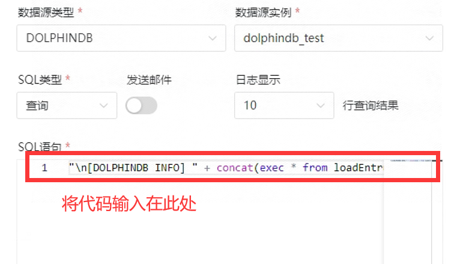

​　　　　b. 在SQL查询类型的前置任务中用于获取运行信息表，在SQL语句中将该表转化成目标格式。

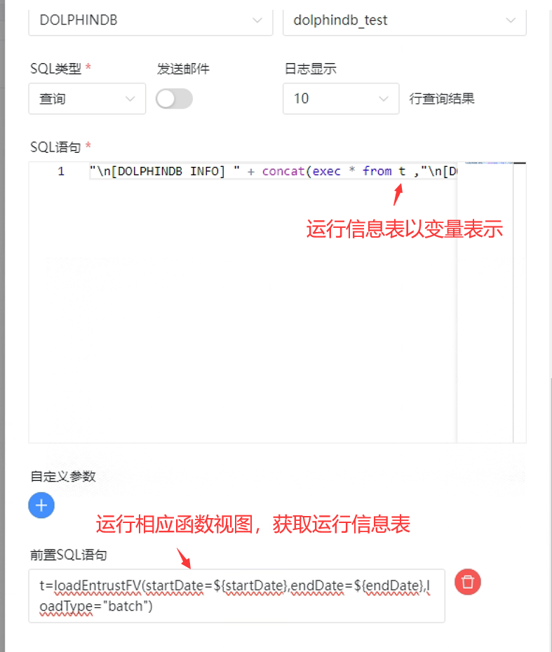

4. 整个工作流结构图如下所示：

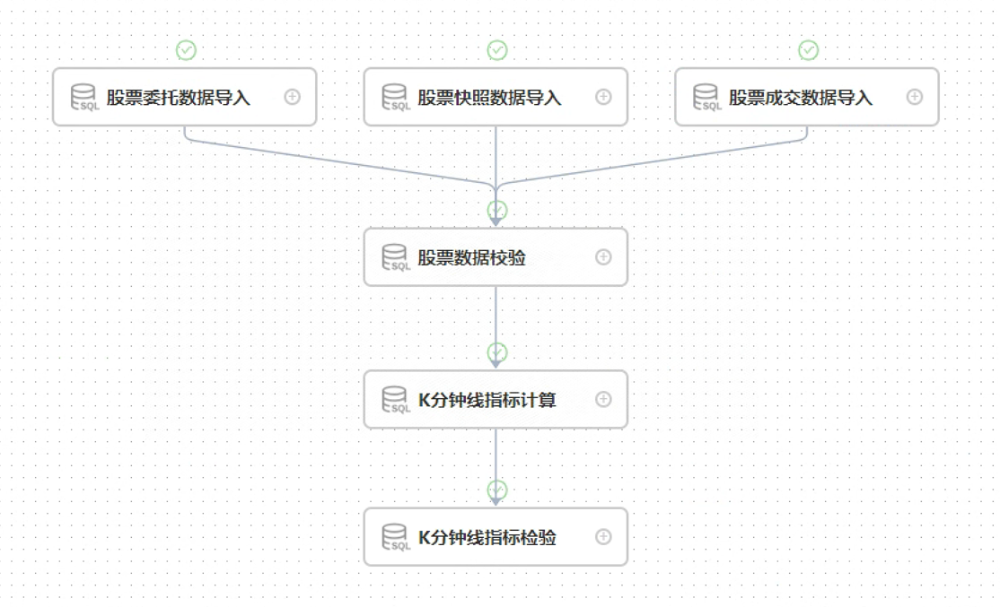

5. 通过**鼠标右键点击**相应任务节点，选择**查看日志**选项，可以查看对应DolphinDB任务节点的运行信息。

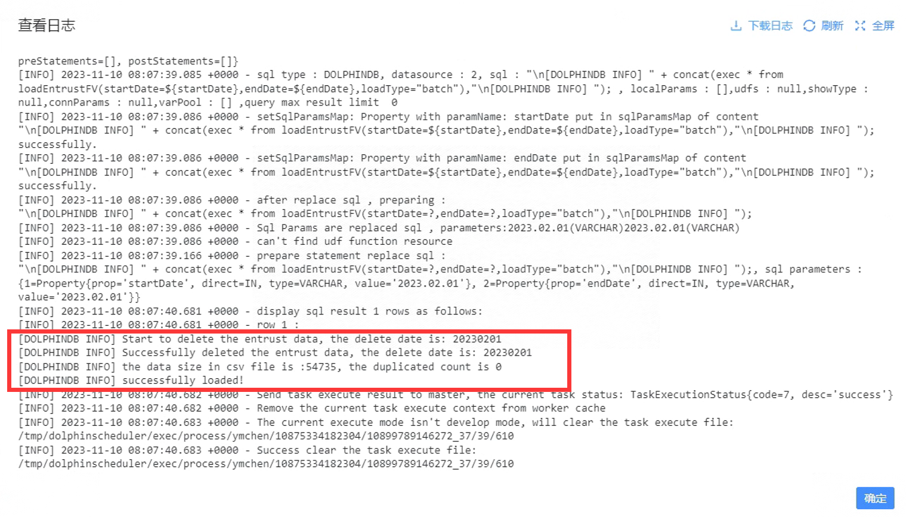

### 2.6 DolphinDB脚本开发注意事项

1. 当在模块中调用插件的函数时，需要提前在多个数据节点和控制节点导入该插件。
2. 在 DolphinScheduler 上传入的参数，是以字符串类型存在的。因此，在 DolphinDB 上需要进一步将其改成**预期的数据类型**，比如：

```
// 在DolphinScheduler上执行的语句为：
loadSnapshotFV(startDate=${startDate},endDate=${endDate},loadType="batch");

// 由于传入的 startDate 是字符串类型，因此在DolphinDB上定义该函数时需要先转成 Date 类型
use stockData::stockDataLoad
def loadEntrustFV(userName="admin" , userPassword="123456", startDate = 2023.02.01, endDate = 2023.02.01, dbName = "dfs://stockData", tbName = "entrust", filePath = "/hdd/hdd/ymchen", loadType = "daily")
{
    if(loadType == "batch")
    {
        // 使用 date(startDate) 转成 Date 类型
        loadEntrust(userName, userPassword, date(startDate), date(endDate), dbName, tbName, filePath, loadType)
    }
}

// 创建函数视图
addFunctionView(loadEntrustFV)
```

3. 当模块文件内容更改时，需要按照以下步骤更新函数视图

- 使用 `clearCachedModules` 函数或者重新连接 session 清除之前缓存的模块。
- 使用 `dropFunctionView` 函数删除指定的函数视图。
- 使用 `use` 语句重新导入更改后的模块。
- 使用 `addFunctionView` 函数添加新的视图。

## 3. DolphinScheduler 与 Airflow 对比

Airflow也是一款具有不错性能的调度软件，关于它与DolphinDB相结合的教程可参照：[DolphinDB与Airflow最佳实践](Best_Practices_for_DolphinDB_and_Python_AirFlow.md) 。以下是DolphinScheduler与Airflow在一些方面的对比：

| **功能**         | **Airflow**                                                  | **DolphinScheduler**                                         |
| :--------------- | :----------------------------------------------------------- | :----------------------------------------------------------- |
| 调度模块         | 自实现                                                       | Quartz任务调度库                                             |
| Job类型          | Python、Bash、HTTP、Mysql等，支持Operator的自定义扩展        | 支持传统的Shell任务，同时支持大数据平台任务调度：MR、Spark、SQL、Python等 |
| Executor触发     | Restful                                                      | Restful                                                      |
| 工作流           | dag →  tasks                                                 | project → flows → tasks                                      |
| 部署运维         | 较复杂，包括WebServer、Scheduler、Worker                     | 简单                                                         |
| 单点故障         | Scheduler存在单点故障风险                                    | 去中心化的多Master和多Worker                                 |
| 高可用额外要求   | Celery、Dask、Mesos + Load Balancer + DB                     | 不需要（本来就支持）                                         |
| 过载处理         | 任务太多时会卡死服务器                                       | 任务队列机制，单个机器上可调度的任务数量可以灵活配置，当任务过多时会缓存在任务队列中，不会造成机器卡死 |
| DAG监控界面      | 不能直观区分任务类型                                         | 任务状态、任务类型、重试次数、任务运行机器、可视化变量等关键信息一目了然 |
| 可视化流程定义   | 否。通过python代码来绘制DAG，使用不便，对于缺乏编码基础的业务人员存在较高使用门槛 | 是。所有流程定义都是可视化的，通过拖拽任务来绘制DAG，配置数据源及资源，同时对于第三方系统，提供api方式的操作。 |
| 快速部署         | 集群化部署复杂                                               | 一键部署                                                     |
| 是否能暂停和恢复 | 否。只能先将工作流杀死再重新运行                             | 支持暂停、恢复操作，支持停止操作                             |
| 是否支持集群扩展 | 是，但是仅支持复杂Executor的水平扩展                         | 是，调度器使用分布式调度，整体的调度能力会随集群的规模线性增长，Master和Worker支持动态上下线 |
| 开发语言         | Python                                                       | Java                                                         |

## 4.常见问题

### 1.  DolphinScheduler status显示running，web的登陆页面却无法登录

查看`standalone-server/logs/`目录下对应日期的日志中具体情况

### 2.  DolphinScheduler设置开机自启动后，服务器重启无法正常启动

正常情况下，由于dolphinScheduler的standalone模式源码原因，需要在服务器重启前到scheduler部署目录执行停止脚本`bash ./bin/dolphinscheduler-daemon.sh stop standalone-server`；
如果无法正常启动，请通过`ps aux | grep dolphinscheduler`找到dolphinScheduler的所有进程，并通过`kill -15 进程ID` 结束这些进程后，再到scheduler部署目录执行启动脚本`bash ./bin/dolphinscheduler-daemon.sh start standalone-server`

## 5. 附录

- **ETL脚本模块**：[ETLCase.zip](script/dolphinscheduler_integration/ETLCase.zip)  
- **示例数据**：[20230201.zip](data/dolphinscheduler_integration/20230201.zip) 
- **MySQL插件**：[mysql-connector-j-8.0.31.jar](plugin/dolphinscheduler_integration/mysql-connector-j-8.0.31.jar)
