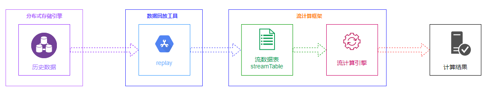
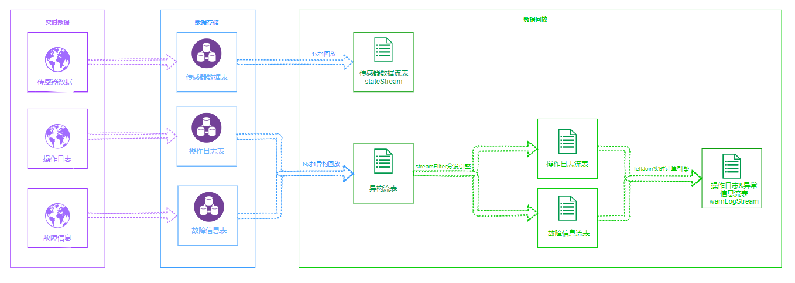
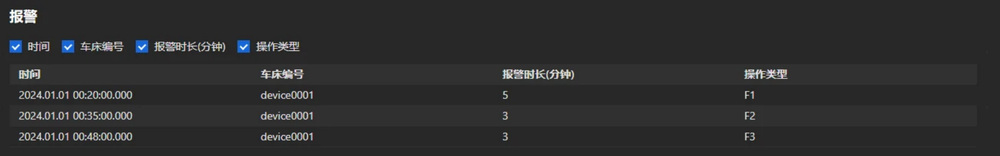
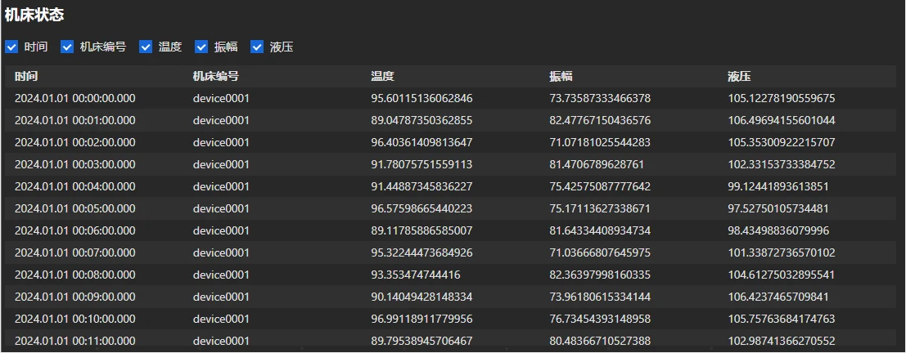
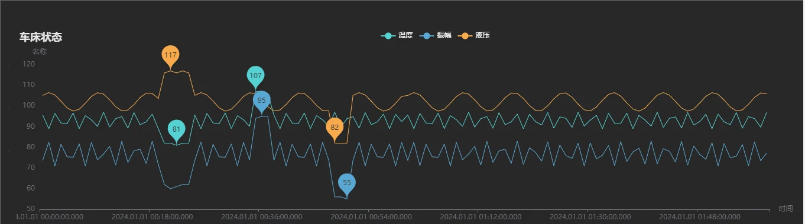

# DolphinDB 历史数据回放功能应用：物联网设备故障分析

工业物联网场景中，故障分析是一个关键环节。设备发生故障时，需快速定位原因。实时采集的流式数据和操作日志记录了设备当前的运行状态，如何根据这些数据快速定位故障发生原因是一个值得研究的问题。DolphinDB 历史数据回放框架为故障分析提供了一套有效的解决方案，通过 DolphinDB 历史数据回放框架，能够复现故障发生时刻场景，从而帮助工程师们更好地进行设备故障分析。

- [DolphinDB 历史数据回放功能应用：物联网设备故障分析](#dolphindb-历史数据回放功能应用物联网设备故障分析)
  - [1. 背景](#1-背景)
  - [2. DolphinDB数据回放功能介绍](#2-dolphindb数据回放功能介绍)
    - [2.1 回放功能相关函数](#21-回放功能相关函数)
    - [2.2 1 对 1 单表回放](#22-1-对-1-单表回放)
    - [2.3 N 对 N 多表回放](#23-n-对-n-多表回放)
    - [2.4 N 对 1 异构回放](#24-n-对-1-异构回放)
  - [3. 数据回放应用：数控机床异常诊断](#3-数据回放应用数控机床异常诊断)
    - [3.1 场景](#31-场景)
    - [3.2 数据说明](#32-数据说明)
    - [3.3 总体方案](#33-总体方案)
    - [3.4 故障诊断分析](#34-故障诊断分析)
      - [3.4.1 接口说明](#341-接口说明)
      - [3.4.2 诊断与分析](#342-诊断与分析)
  - [4. 总结](#4-总结)
  - [5. 附录](#5-附录)
    - [5.1 数据仿真脚本](#51-数据仿真脚本)
    - [5.2 数据回放框架接口 replayIoT](#52-数据回放框架接口-replayiot)

## 1. 背景

近年来，随着物联设备、新技术和新应用不断发展，积累了海量的联网监测数据和离线采集的文件数据，这些数据是物联行业，特别是故障分析领域珍贵的数据资产。故障分析需要基于这些数据按照特定的顺序进行回放处理，通过回溯历史数据，模拟真实场景，实现故障分析、数据挖掘等功能。由于物联数据回放涉及的数据量巨大，数据回放不能简单地从数据库中查询存储结果数据并进行回放处理，因此需要构建一种高效的流式回放处理能力的数据回放平台。

如何高效地存储海量历史数据、如何快速地从海量历史数据中精确查找目标数据、如何将数据严格地按照时间先后顺序进行回放、如何流式呈现海量的目标历史数据，是构建一个历史数据回放平台必须要考虑的问题。

DolphinDB 历史数据回放框架由分布式存储引擎、数据回放工具、流计算框架三大组件构成，通过历史数据回放框架，可以搭建一个轻量式数据回放平台，助力设备故障诊断与分析。



## 2. DolphinDB数据回放功能介绍

### 2.1 回放功能相关函数

DolphinDB 历史数据回放功能通过 replay 函数实现。replay 函数按时间顺序将一个或多个数据表或数据源列表回放到数据表，以模拟实时数据写入。根据 replayRate 参数和 absoluteRate 参数的不同取值，支持指定每秒记录数、指定时间跨度回放加速倍数、全速回放三种回放模式；根据输入表到输出表的映射关系，支持 1 对 1单表回放，N 对 N 多表回放和 N 对 1 异构回放三种回放形式。

```
replay(inputTables, outputTables, [dateColumn], [timeColumn], [replayRate], [absoluteRate=true], [parallelLevel=1])
```

- inputTables：指定数据的回放形式。inputTables 为一个表对象时，为 1 对 1 回放；inputTables是多个表对象时，为 N 对 N 回放；inputTables 为一个字典时，为N对1回放。
- outputTables：指定数据的回放形式。outputTables 为一个表对象时，为 1 对 1 回放或N对1异构回放；outputTables是多个表对象时，为N对N回放。
- replayRate：表示数据回放速度。若 absoluteRate为true，replayRate 表示每秒回放的数据条数；若absoluteRate为 false，依照数据中的时间戳加速replayRate倍回放；若 replayRate 未指定或为负，以最大速度回放
- absoluteRate：为 true 时表示 replayRate 为每秒回放的记录数；为 false 时表示依照数据中的时间戳加速 replayRate 倍回放

replayDS 根据时间维度将源数据划分为若干个小的数据源，实现对数据源的进一步切分。

```
replayDS(sqlObj, [dateColumn], [timeColumn],[timeRepartitionSchema])
```

`ionSchema])`

- sqlObj：SQL 查询元代码，表示回放的数据，如\<select * from loadTable("dfs://source", "source")\>。SQL查询的表对象是DFS表，且至少有一个分区列为DATE类型。
- dateColumn：日期列。若不指定，默认第一列为日期列。`replayDS`函数默认日期列是数据源的一个分区列，并根据分区信息将原始SQL查询拆分为多个查询。

关于 `replay`、`replayDS `函数的详细介绍可参考 [replay用户手册](https://docs.dolphindb.cn/zh/funcs/r/replay.html)、[replayDS用户手册](https://docs.dolphindb.cn/zh/funcs/r/replayDS.html)。

### 2.2 1 对 1 单表回放

1 对 1 单表回放适用于所有数据存放在一张表中的场景。当数据量较小时，可以将需要回放的数据读取到一张内存表中，然后将内存表作为数据源进行回放。

当数据量较大时，可使用`replayDS`函数将输入表划分为多个较小的数据源，再使用`replay`函数从数据源中读取数据并回放到流数据表中。

1 对 1 单表回放并不能满足所有的回放要求。在实际应用中，故障诊断往往涉及到传感器数据和操作日志数据，在进行故障分析时，需要将两类同时回放，这时便有了多表回放的需求。

### 2.3 N 对 N 多表回放

N 对 N 多表回放是一种将多个输入表同步回放到多个对应目标表的模式。在 N 对 N 的模式中，不同表在同一秒内的两条数据写入目标表的顺序可能和数据中的时间先后顺序不一致。此外，若采用不同的线程对下游的N个目标表进行订阅消费，也很难保证表与表之间的数据被处理的顺序关系。因此，N 对 N 回放不能保证整体上最严格的时序。

故障分析领域中不同类型的数据产生是有先后顺序的，比如传感器数据和操作日志，所以在对多个数据源回放时要求每条数据都严格按照时间顺序注入目标表，为此我们需要解决以下问题：

- 不同结构的数据如何统一进行排序和注入以保证整体的顺序？
- 如何保证对多表回放结果的实时消费也是严格按照时序进行的？

### 2.4 N 对 1 异构回放

针对上述 N 对 N 多表回放存在的问题，DolphinDB 进一步增加了 N 对 1 异构回放，支持将多个不同表结构的数据表写入同一张异构流数据表中，从而实现了严格按时间顺序的多表回放。

与 N 对 N 多表回放不同，N 对 1 异构回放将多个具有不同表结构的数据源回放到同一个输出表中，其中输出表为一张异构流数据表，至少包含三列：数据时间列、数据标识列和序列化后的数据。此外，N 对 1 异构回放对多个数据源进行全局排序，因此所得的输出表是严格的时间顺序。

若要对异构流数据表进行数据处理操作，如指标计算等，则需要将二进制格式的消息内容反序列化为原始结构的一行记录。DolphinDB 在脚本语言以及在 API 中均支持了对异构流数据表的解析功能。脚本支持流数据分发引擎 streamFilter 对异构流数据表进行反序列化以及反序列后结果的数据处理；同时，各类 API 在支持流数据订阅功能的基础上，扩展支持了在订阅时对异构流数据表进行反序列化。

## 3. 数据回放应用：数控机床异常诊断

### 3.1 场景

在现代化的制造业环境中，数控机床以其精准、高效和自动化的特性，显著提升了生产效率和产品质量，扮演着核心角色。

当数控机床运行时，其内置的传感器会持续采集各种设备状态数据。这些数据包括机床运行速度、主轴转速、刀具磨损状况、冷却液温度和压力、电机负载以及系统电力消耗等关键参数。这些实时数据会存储到数据库中，作为技术人员深入的分析的参考依据。

一旦数控机床发生故障，如刀具破损、电机过热或系统错误等，设备会立即触发警报，并将相应的数据记录到故障信息表中。故障信息表会详细记录故障发生的时间、故障类型等关键信息，为后续的故障诊断和维修工作提供重要的线索。

为了确保操作的合规性和可追溯性，每当操作员在数控机床上进行操作，如程序更改、刀具更换或生产参数调整等，系统会自动记录相关的操作信息到操作日志表中。这类日志详细记录了操作的时间、操作内等详细情况，便于在出现问题时进行快速的责任追溯和问题排查。

通过这些详细的设备状态、异常状态信息和操作日志，工厂的技术人员和管理人员可以全面、准确地了解数控机床的运行状态和工作效率，及时发现并解决问题，从而确保生产的稳定性和效率。同时，这些数据也为设备的维护、升级和优化提供了重要的数据支持。

### 3.2 数据说明

数控机床传感器每秒采集温度、振幅、液压等关键信息，表结构如下表所示：

| **字段名称** | **数据类型**  | **字段描述** |
| -------- | --------- | -------- |
| time     | TIMESTAMP | 采集时间戳    |
| deviceId | SYMBOL    | 机床编号     |
| temp     | DOUBLE    | 温度       |
| amp      | DOUBLE    | 振幅       |
| hydra    | DOUBLE    | 液压       |

操作日志表记录了操作员对机床的操作内容，表结构如下表所示：

| **字段名称**   | **数据类型**  | **字段描述** |
| ---------- | --------- | -------- |
| time       | TIMESTAMP | 操作发生时间   |
| deviceId   | SYMBOL    | 机床编号     |
| operatorId | SYMBOL    | 员工编号     |
| actionType | SYMBOL    | 操作类型     |

故障信息表记录异常发生的开始时间、持续时长等信息，表结构如下表所示：

| **字段名称**    | **数据类型**  | **字段描述** |
| ----------- | --------- | -------- |
| time        | TIMESTAMP | 异常开始时间   |
| deviceId    | SYMBOL    | 机床编号     |
| persistTime | FLOAT     | 异常持续时间   |

操作员的不当操作可能会引发机床故障，当故障发生后，分析人员需要第一时间了解故障是由哪些操作导致的，以便于后续的故障诊断和分析；同时，机床的温度、液压等指标也与操作类型相关，分析操作类型与机床状态指标的相关性也是故障诊断和分析中的重要一环。

本文所使用的数据仿真脚本见附录 5.1。

### 3.3 总体方案

针对机床故障异常诊断分析，DolphinDB 解决方案如下：



故障发生后，将故障信息表和操作日志表中的数据异构回放到流数据表中，通过 createAsofJoinEngine 流计算引擎，将故障信息和操作日志进行实时关联，了解故障是由哪些操作引起的；并实时地回放传感器采集的机床状态数据，以便分析机床各项指标与操作类型的关系。

### 3.4 故障诊断分析

#### 3.4.1 接口说明

为了便于机床故障诊断分析，本文将 DolphinDB 数据回放框架封装成了 replayIoT 函数，见附录 5.2。用户通过 json 配置便能实现倍数回放、多表回放等复杂功能。对于单表回放，函数使用说明如下：

```
{
    "dbName":目标库，必选,  
    "tbName":目标表，必选,
    "deviceColumn":设备名称列，必选, 
    "dateColumn":数据时间列，可选,
    "deviceId":需要回放的设备，可选,
    "selectColumn":需要回放的设备，可选
    "timeBegin":回放开始时间，可选,
    "timeEnd":回放结束时间，可选,
    "replayRate":回放倍率，可选,
    "sampleRate":采样频率，可选,
    "jobName":回放任务名称，必选
}
```

多表回放数据接口使用说明如下：

```
 {
    "leftTable":{左表参数
        "dbName":目标库，必选,
        "tbName":目标表，必选,
        "deviceColumn":设备名称列，必选,
        "dateColumn":数据时间列，可选,
        "deviceId":需要回放的设备，可选,
        "timeBegin":回放开始时间，可选,
        "timeEnd":回放结束时间，可选
    },
    "rightTable":{右表参数
        "dbName":目标库，必选,
        "tbName":目标表，必选,
        "deviceColumn":设备名称列，必选,
        "dateColumn":数据时间列，可选,
        "deviceId":需要回放的设备，可选,
        "timeBegin":回放开始时间，可选,
        "timeEnd":回放结束时间，可选
    },
    "matchColumn": 左表右表连接列，必选,
    "replayRate":回放倍率，可选,
    "sampleRate":采样频率，可选,
    "jobName":回放任务名称，必选
}
```

回放的实时流式数据会注入到名为 jobName 的共享流表中，用户可以订阅该表进实时分析。

#### 3.4.2 诊断与分析

通过以下 json 配置，开始异常信息与操作日志的关联回放任务：

```
args1 = '
{
    "leftTable":{
        "dbName":"dfs://test_anomaly",
        "tbName":"anomaly",
        "dateColumn":"ts",
        "deviceId":"device0001",
        "deviceColumn":"deviceId",
        "timeBegin":2024.01.01T00:00:00.000,
        "timeEnd":2024.01.01T02:00:00.000
    },
    "rightTable":{
        "dbName":"dfs://test_log",
        "tbName":"log",
        "dateColumn":"ts",
        "deviceId":"device0001",
        "deviceColumn":"deviceId",
        "timeBegin":2024.01.01T00:00:00.000,
        "timeEnd":2024.01.01T02:00:00.000
    },
    "matchColumn": ["deviceId"],
    "jobName":"warnAndLogStream",
    "replayRate":50
}
'
replayIoT(args1)
```

回放结果如下表所示：



从上述结果可知，F1、F2、F3 三种操作可能会导致机床发生故障，因此在实际生产中，操纵员需要谨慎进行 F1、F2、F3 这三种类型的操作。

通过以下 json 配置，开始机床各项指标数据的回放任务：

```
args2 = '
{
    "dbName":"dfs://test_state",  
    "tbName":"state",
    "deviceColumn":"deviceId", 
    "dateColumn":"ts",
    "deviceId":["device0001"],
    "timeBegin":2024.01.01T00:00:00.000,
    "timeEnd":2024.01.01T02:00:00.000,
    "replayRate":50,
    "sampleRate":60s,
    "jobName":"stateStream"
}
'
replayIoT(args2)
```

回放结果如下表所示：



借助 DolphinDB Dashboard 功能，可将上述回放的机床各项指标进行实时的可视化展示，可视化结果如下图所示：



从上图可知，机床正常运行时，温度、液压和振幅曲线是规律的三角函数曲线。当故障发生后，温度、液压和振幅会明显偏低或偏高。从结果上来看，进行F1操作时，机床温度、振幅低于平均水平，液压高于平均水平，导致机床发生故障；进行F2操作时，机床温度、振幅高于平均水平，导致机床发生故障；进行 F3 操作时，机床振幅、液压低于平均水平，导致机床发生故障。

## 4. 总结

本教程以数控机床故障诊断为例，详细介绍了如何利用 DolphinDB 的历史数据回放功能分析设备故障。DolphinDB 的历史数据回放功能在非常多的领域可以发挥其价值。例如，在无人机飞行状态监测中，回放功能可以帮助用户重现飞行状态，便于排查故障；在无线电检测中，通过回放大规模的监测数据，实现多维度瀑布图回放、占用度趋势分析及信号模拟等功能。DolphinDB 的历史数据回放功能可以为企业提供强大的数据分析能力，有助于提高故障排查效率和优化业务决策。

## 5. 附录

### 5.1 数据仿真脚本

[dataSimulate.dos](data/faultAnalysis/dataSimulate.dos)

### 5.2 数据回放框架接口 replayIoT

[replayIoT.dos](data/faultAnalysis/replayIoT.dos)
