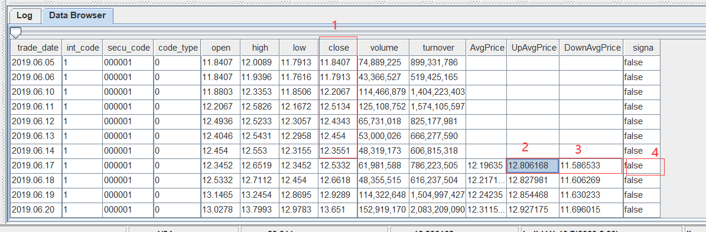
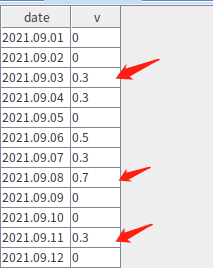
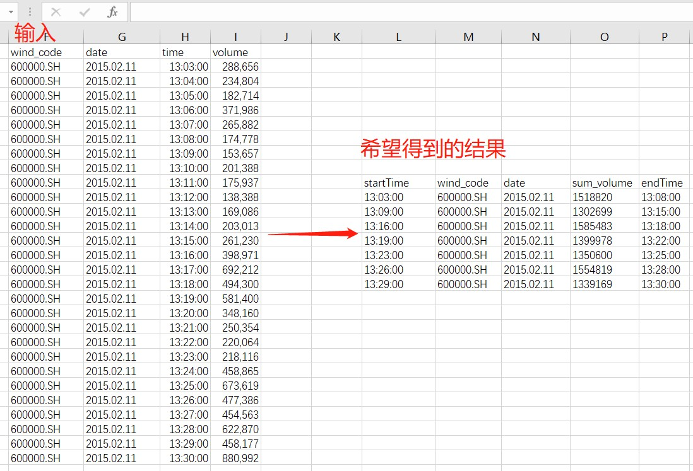

# 函数化编程案例

<!--- DolphinDB 的编程语言应用了许多函数化编程的思想。

- 许多 DolphinDB 内置的功能函数，可以进行单机多线程并行或者多机分布式计算，从而减少了计算时间。

- 用户可以自定义函数，通过传递参数的方法动态执行命令，减少了重复代码的编写。 --->

DolphinDB支持函数化编程：函数对象可以作为高阶函数的参数。这提高了代码表达能力，简化了代码，复杂的任务可以通过一行或几行代码完成。

本教程介绍了一些常见场景下的函数化编程案例，重点介绍 DolphinDB 的高阶函数及其使用场景。包括以下内容：   

- [1. 数据导入](#1-%E6%95%B0%E6%8D%AE%E5%AF%BC%E5%85%A5)
  * [1.1 整型时间转化为 TIME 格式并导入](#11-%E6%95%B4%E5%9E%8B%E6%97%B6%E9%97%B4%E8%BD%AC%E5%8C%96%E4%B8%BA-time-%E6%A0%BC%E5%BC%8F%E5%B9%B6%E5%AF%BC%E5%85%A5)
  * [1.2 有纳秒时间戳的文本导入](#12-%E6%9C%89%E7%BA%B3%E7%A7%92%E6%97%B6%E9%97%B4%E6%88%B3%E7%9A%84%E6%96%87%E6%9C%AC%E5%AF%BC%E5%85%A5)
- [2. Lambda 表达式](#2-lambda-%E8%A1%A8%E8%BE%BE%E5%BC%8F)
- [3. 高阶函数使用案例](#3-%E9%AB%98%E9%98%B6%E5%87%BD%E6%95%B0%E4%BD%BF%E7%94%A8%E6%A1%88%E4%BE%8B)
  * [3.1 cross 使用案例](#31-cross-%E4%BD%BF%E7%94%A8%E6%A1%88%E4%BE%8B)
    + [3.1.1 将两个向量或矩阵，两两组合作为参数来调用函数](#311-%E5%B0%86%E4%B8%A4%E4%B8%AA%E5%90%91%E9%87%8F%E6%88%96%E7%9F%A9%E9%98%B5%E4%B8%A4%E4%B8%A4%E7%BB%84%E5%90%88%E4%BD%9C%E4%B8%BA%E5%8F%82%E6%95%B0%E6%9D%A5%E8%B0%83%E7%94%A8%E5%87%BD%E6%95%B0)
    + [3.1.2 计算股票两两之间的相关性](#312-%E8%AE%A1%E7%AE%97%E8%82%A1%E7%A5%A8%E4%B8%A4%E4%B8%A4%E4%B9%8B%E9%97%B4%E7%9A%84%E7%9B%B8%E5%85%B3%E6%80%A7)
  * [3.2 each 使用案例](#32-each-%E4%BD%BF%E7%94%A8%E6%A1%88%E4%BE%8B)
    + [3.2.1 获取数据表各个列的 NULL 值个数](#321-%E8%8E%B7%E5%8F%96%E6%95%B0%E6%8D%AE%E8%A1%A8%E5%90%84%E4%B8%AA%E5%88%97%E7%9A%84-null-%E5%80%BC%E4%B8%AA%E6%95%B0)
    + [3.2.2 去除表中存在 NULL 值的行](#322-%E5%8E%BB%E9%99%A4%E8%A1%A8%E4%B8%AD%E5%AD%98%E5%9C%A8-null-%E5%80%BC%E7%9A%84%E8%A1%8C)
    + [3.2.3 按行处理与按列处理性能比较案例](#323-%E6%8C%89%E8%A1%8C%E5%A4%84%E7%90%86%E4%B8%8E%E6%8C%89%E5%88%97%E5%A4%84%E7%90%86%E6%80%A7%E8%83%BD%E6%AF%94%E8%BE%83%E6%A1%88%E4%BE%8B)
    + [3.2.4 判断两张表内容是否相同](#324-%E5%88%A4%E6%96%AD%E4%B8%A4%E5%BC%A0%E8%A1%A8%E5%86%85%E5%AE%B9%E6%98%AF%E5%90%A6%E7%9B%B8%E5%90%8C)
  * [3.3 loop 使用案例](#33-loop-%E4%BD%BF%E7%94%A8%E6%A1%88%E4%BE%8B)
    + [3.3.1 loop 与 each 的区别](#331-loop-%E4%B8%8E-each-%E7%9A%84%E5%8C%BA%E5%88%AB)
    + [3.3.2 导入多个文件](#332-%E5%AF%BC%E5%85%A5%E5%A4%9A%E4%B8%AA%E6%96%87%E4%BB%B6)
  * [3.4 moving/rolling 使用案例](#34-movingrolling-%E4%BD%BF%E7%94%A8%E6%A1%88%E4%BE%8B)
    + [3.4.1 moving 案例](#341-moving-%E6%A1%88%E4%BE%8B)
    + [3.4.2 moving(sum) 和 msum 性能差距](#342-movingsum-%E5%92%8C-msum-%E6%80%A7%E8%83%BD%E5%B7%AE%E8%B7%9D)
  * [3.5 eachPre 使用案例](#35-eachpre-%E4%BD%BF%E7%94%A8%E6%A1%88%E4%BE%8B)
  * [3.6 byRow 使用案例](#36-byrow-%E4%BD%BF%E7%94%A8%E6%A1%88%E4%BE%8B)
  * [3.7 segmentby 使用案例](#37-segmentby-%E4%BD%BF%E7%94%A8%E6%A1%88%E4%BE%8B)
  * [3.8 pivot 使用案例](#38-pivot-%E4%BD%BF%E7%94%A8%E6%A1%88%E4%BE%8B)
  * [3.9 contextby 使用案例](#39-contextby-%E4%BD%BF%E7%94%A8%E6%A1%88%E4%BE%8B)
  * [3.10 call/unifiedCall 使用案例](#310-callunifiedcall-%E4%BD%BF%E7%94%A8%E6%A1%88%E4%BE%8B)
  * [3.11 accumulate 使用案例](#311-accumulate-%E4%BD%BF%E7%94%A8%E6%A1%88%E4%BE%8B)
  * [3.12 window 使用案例](#312-window-%E4%BD%BF%E7%94%A8%E6%A1%88%E4%BE%8B)
  * [3.13 reduce 使用案例](#313-reduce-%E4%BD%BF%E7%94%A8%E6%A1%88%E4%BE%8B)
- [4. 部分应用案例](#4-%E9%83%A8%E5%88%86%E5%BA%94%E7%94%A8%E6%A1%88%E4%BE%8B)
  * [4.1 提交带有参数的作业](#41-%E6%8F%90%E4%BA%A4%E5%B8%A6%E6%9C%89%E5%8F%82%E6%95%B0%E7%9A%84%E4%BD%9C%E4%B8%9A)
  * [4.2 获取集群其它节点作业信息](#42-%E8%8E%B7%E5%8F%96%E9%9B%86%E7%BE%A4%E5%85%B6%E5%AE%83%E8%8A%82%E7%82%B9%E4%BD%9C%E4%B8%9A%E4%BF%A1%E6%81%AF)
  * [4.3 带 “状态” 的流计算消息处理函数](#43-%E5%B8%A6-%E7%8A%B6%E6%80%81-%E7%9A%84%E6%B5%81%E8%AE%A1%E7%AE%97%E6%B6%88%E6%81%AF%E5%A4%84%E7%90%86%E5%87%BD%E6%95%B0)
- [5. 金融场景相关案例](#5-%E9%87%91%E8%9E%8D%E5%9C%BA%E6%99%AF%E7%9B%B8%E5%85%B3%E6%A1%88%E4%BE%8B)
  * [5.1 使用 map reduce，对 tick 数据降精度](#51-%E4%BD%BF%E7%94%A8-map-reduce%E5%AF%B9-tick-%E6%95%B0%E6%8D%AE%E9%99%8D%E7%B2%BE%E5%BA%A6)
  * [5.2 数据回放和高频因子计算](#52-%E6%95%B0%E6%8D%AE%E5%9B%9E%E6%94%BE%E5%92%8C%E9%AB%98%E9%A2%91%E5%9B%A0%E5%AD%90%E8%AE%A1%E7%AE%97)
  * [5.3 基于字典的计算](#53-%E5%9F%BA%E4%BA%8E%E5%AD%97%E5%85%B8%E7%9A%84%E8%AE%A1%E7%AE%97)
- [6. 机器学习相关案例](#6-%E6%9C%BA%E5%99%A8%E5%AD%A6%E4%B9%A0%E7%9B%B8%E5%85%B3%E6%A1%88%E4%BE%8B)
  * [6.1 ols 残差](#61-ols-%E6%AE%8B%E5%B7%AE)
- [7. 总结](#7-总结)


## 1. 数据导入

### 1.1 整型时间转化为 TIME 格式并导入

CSV 数据文件中常用整数表示时间，如 “93100000” 表示 “9:31:00.000”。为了便于查询分析，建议将这类数据转换为时间类型，再存储到 DolphinDB 数据库中。

针对这种场景，可通过 [`loadTextEx`](https://www.dolphindb.cn/cn/help/FunctionsandCommands/FunctionReferences/l/loadTextEx.html?highlight=loadtextex) 函数的 `transform` 参数将文本文件中待转化的时间列指定为相应的数据类型。

本例中会用到 CSV 文件 [candle_201801.csv](./data/candle_201801.csv)，数据样本如下：

```csv
symbol,exchange,cycle,tradingDay,date,time,open,high,low,close,volume,turnover,unixTime
000001,SZSE,1,20180102,20180102,93100000,13.35,13.39,13.35,13.38,2003635,26785576.72,1514856660000
000001,SZSE,1,20180102,20180102,93200000,13.37,13.38,13.33,13.33,867181
......
```

（1）建库

用脚本创建如下分布式数据库（按天进行值分区）：

```
login(`admin,`123456)
dataFilePath="/home/data/candle_201801.csv"
dbPath="dfs://DolphinDBdatabase"
db=database(dbPath,VALUE,2018.01.02..2018.01.30)
```

（2）建表


下面先通过 `extractTextSchema` 函数获取数据文件的表结构。csv 文件中的 time 字段被识别为整型。若要将其存为 TIME 类型，可以通过 update 语句更新表结构将其转换为 TIME 类型，然后用更新后的表结构来创建分布式表。该分布式表的分区列是 date 列。

```shell
schemaTB=extractTextSchema(dataFilePath)
update schemaTB set type="TIME" where name="time"
tb=table(1:0, schemaTB.name, schemaTB.type)
tb=db.createPartitionedTable(tb, `tb1, `date);
```
> 这里通过 `extractTextSchema` 获取表结构。用户也可以自定义表结构。

（3）导入数据

可以通过自定义函数 i2t 对时间列 time 进行预处理，将其转换为 TIME 类型，并返回处理后的数据表。

```shell
def i2t(mutable t){
    return t.replaceColumn!(`time, t.time.format("000000000").temporalParse("HHmmssSSS"))
}
```

> 请注意：在自定义函数体内对数据进行处理时，请尽量使用本地的修改（以！结尾的函数）来提升性能。

调用 `loadTextEx` 函数导入 csv 文件的数据到分布式表，这里指定 `transform` 参数为 `i2t` 函数，导入时会自动应用 `i2t` 函数处理数据。


```
tmpTB=loadTextEx(dbHandle=db, tableName=`tb1, partitionColumns=`date, filename=dataFilePath, transform=i2t);
```

（4）查询数据


查看表内前 2 行数据，可以看到结果符合预期。

```
select top 2 * from loadTable(dbPath,`tb1);

symbol exchange cycle tradingDay date       time               open  high  low   close volume  turnover   unixTime
------ -------- ----- ---------- ---------- --------------     ----- ----- ----- ----- ------- ---------- -------------
000001 SZSE     1     2018.01.02 2018.01.02 09:31:00.000       13.35 13.39 13.35 13.38 2003635 2.678558E7 1514856660000
000001 SZSE     1     2018.01.02 2018.01.02 09:32:00.000       13.37 13.38 13.33 13.33 867181  1.158757E7 1514856720000
```

完整代码如下:
```shell
login(`admin,`123456)
dataFilePath="/home/data/candle_201801.csv"
dbPath="dfs://DolphinDBdatabase"
db=database(dbPath,VALUE,2018.01.02..2018.01.30)
schemaTB=extractTextSchema(dataFilePath)
update schemaTB set type="TIME" where name="time"
tb=table(1:0,schemaTB.name,schemaTB.type)
tb=db.createPartitionedTable(tb,`tb1,`date);

def i2t(mutable t){
    return t.replaceColumn!(`time,t.time.format("000000000").temporalParse("HHmmssSSS"))
}

tmpTB=loadTextEx(dbHandle=db,tableName=`tb1,partitionColumns=`date,filename=dataFilePath,transform=i2t);
```
> 关于文本导入的相关函数和案例，可以参考 [数据导入教程](./import_data.md)


### 1.2 有纳秒时间戳的文本导入

本例将以整数类型存储的纳秒级数据导入为NANOTIMESTAMP类型。本例使用文本文件 [nx.txt](data/nx.txt)，数据样本如下：

```shell
SendingTimeInNano#securityID#origSendingTimeInNano#bidSize
1579510735948574000#27522#1575277200049000000#1
1579510735948606000#27522#1575277200049000000#2
...
```

每一行记录通过字符'#'来分隔列，SendingTimeInNano 和 origSendingTimeInNano 用于存储纳秒时间戳。

（1）建库建表

首先定义分布式数据库和表，脚本如下：

```shell
dbSendingTimeInNano = database(, VALUE, 2020.01.20..2020.02.22);
dbSecurityIDRange = database(, RANGE,  0..10001);
db = database("dfs://testdb", COMPO, [dbSendingTimeInNano, dbSecurityIDRange]);

nameCol = `SendingTimeInNano`securityID`origSendingTimeInNano`bidSize;
typeCol = [`NANOTIMESTAMP,`INT,`NANOTIMESTAMP,`INT];
schemaTb = table(1:0,nameCol,typeCol);

db = database("dfs://testdb");
nx = db.createPartitionedTable(schemaTb, `nx, `SendingTimeInNano`securityID);
```

上述脚本创建了一个 [组合分区](./database.md) 的数据库，然后根据文本的字段和类型创建了表 nx。

（2）导入数据

导入数据时，使用函数 `nanotimestamp`，将文本中的整型转化为 NANOTIMESTAMP 类型：

```shell
def dataTransform(mutable t){
  return t.replaceColumn!(`SendingTimeInNano, nanotimestamp(t.SendingTimeInNano)).replaceColumn!(`origSendingTimeInNano, nanotimestamp(t.origSendingTimeInNano))
}
```

最终通过 `loadTextEx` 导入数据。

完整代码如下：

```shell
dbSendingTimeInNano = database(, VALUE, 2020.01.20..2020.02.22);
dbSecurityIDRange = database(, RANGE,  0..10001);
db = database("dfs://testdb", COMPO, [dbSendingTimeInNano, dbSecurityIDRange]);

nameCol = `SendingTimeInNano`securityID`origSendingTimeInNano`bidSize;
typeCol = [`NANOTIMESTAMP,`INT,`NANOTIMESTAMP,`INT];
schemaTb = table(1:0,nameCol,typeCol);

db = database("dfs://testdb");
nx = db.createPartitionedTable(schemaTb, `nx, `SendingTimeInNano`securityID);

def dataTransform(mutable t){
  return t.replaceColumn!(`SendingTimeInNano, nanotimestamp(t.SendingTimeInNano)).replaceColumn!(`origSendingTimeInNano, nanotimestamp(t.origSendingTimeInNano))
}

pt=loadTextEx(dbHandle=db,tableName=`nx , partitionColumns=`SendingTimeInNano`securityID,filename="nx.txt",delimiter='#',transform=dataTransform);
```

## 2. Lambda 表达式

在 DolphinDB 中可以使用命名函数或匿名函数（通常为 lambda 表达式）来创建自定义函数。例如：

```shell
x = 1..10
each(x -> x + 1, [1, 2, 3])
```

在这个例子中使用了一个 lambda 表达式（`x -> x + 1, [1, 2, 3]`）作为高阶函数 `each` 的参数，其中，该 lambda 表达式接受一个输入 x 并返回 x + 1。它与 each 函数一起使用的结果是，将 1 添加到数组 [1, 2, 3] 中的每个元素。

后续章节将介绍其他 lambda 函数案例。

## 3. 高阶函数使用案例

### 3.1 cross 使用案例

#### 3.1.1 将两个向量或矩阵，两两组合作为参数来调用函数

`cross` 函数的伪代码如下：

```shell
for(i:0~(size(X)-1)){
   for(j:0~(size(Y)-1)){
       result[i,j]=<function>(X[i], Y[j]);
   }
}
return result;
```

以计算 [协方差矩阵](https://baike.baidu.com/item/%E5%8D%8F%E6%96%B9%E5%B7%AE%E7%9F%A9%E9%98%B5/9822183?fr=aladdin) 为例，一般需要使用两个 for 循环计算。代码如下：

```shell
def matlab_cov(mutable matt){
	nullFill!(matt,0.0)
	rowss,colss=matt.shape()
	msize = min(rowss, colss)
	df=matrix(float,msize,msize)
	for (r in 0..(msize-1)){
		for (c in 0..(msize-1)){
			df[r,c]=covar(matt[:,r],matt[:,c])
		}
	}
	return df
}
```

以上代码虽然逻辑简单，但是冗长，表达能力较差，且易出错。

在DolphinDB 中可以使用高阶函数 [`cross`](https://www.dolphindb.cn/cn/help/Functionalprogramming/TemplateFunctions/cross.html?highlight=cross) 或 `pcross` 计算协方差矩阵：

```shell
cross(covar, matt)
```
#### 3.1.2 计算股票两两之间的相关性

本例中，我们使用金融大数据开放社区 Tushare 的沪深股票 [日线行情](https://tushare.pro/document/2?doc_id=27) 数据，来计算股票间的两两相关性。

首先我们定义一个数据库和表，来存储沪深股票日线行情数据。相关语句如下：

```shell
login("admin","123456")
dbPath="dfs://tushare"
yearRange=date(2008.01M + 12*0..22)
if(existsDatabase(dbPath)){
	dropDatabase(dbPath)
}
columns1=`ts_code`trade_date`open`high`low`close`pre_close`change`pct_chg`vol`amount
type1=`SYMBOL`NANOTIMESTAMP`DOUBLE`DOUBLE`DOUBLE`DOUBLE`DOUBLE`DOUBLE`DOUBLE`DOUBLE`DOUBLE
db=database(dbPath,RANGE,yearRange)
hushen_daily_line=db.createPartitionedTable(table(100000000:0,columns1,type1),`hushen_daily_line,`trade_date)
```
> 上面的表是按照 [日线行情](https://tushare.pro/document/2?doc_id=27) 里的结构说明定义的。

定义好表结构后，如需获取对应的数据，可前往 [Tushare](https://tushare.pro/document/1?doc_id=39) 平台注册账户，获取 TOKEN，并参考 [案例脚本](./script/getTushareDailyLine.py) 进行数据导入操作。本案例使用 DolphinDB 的 [Python API](https://gitee.com/dolphindb/api_python3/blob/master/README_CN.md) 获取数据，用户也可参考 Tushare 的说明文档使用其它语言或库。本例使用 2008 年到 2017 年的日线行情进行说明。

在计算两两相关性时，首先使用 exec + pivot by 生成股票回报率矩阵:

```shell
retMatrix=exec pct_chg/100 as ret from daily_line pivot by trade_date, ts_code
```

`exec` 和 `pivot by` 是 DolphinDB 编程语言的特点之一。`exec` 与 `select` 的用法相同，但 `select` 语句仅可生成表, `exec` 语句可以生成向量。`pivot by` 用于重整维度，与 `exec` 一起使用时会生成一个矩阵。

调用高阶函数 `cross` 生成股票两两相关性矩阵：

```shell
corrMatrix=cross(corr,retMatrix)
```

查询和每只股票相关性最高的 10 只股票：

```shell
syms=(exec count(*) from daily_line group by ts_code).ts_code
syms="C"+strReplace(syms, ".", "_")
mostCorrelated=select * from table(corrMatrix.columnNames() as ts_code, corrMatrix).rename!([`ts_code].append!(syms)).unpivot(`ts_code, syms).rename!(`ts_code`corr_ts_code`corr) context by ts_code having rank(corr,false) between 1:10
```

上面代码中，corrMatrix是一个矩阵，需要转化为表做进一步处理，同时新增一列表示股票代码。使用 table 函数转化成表后，通过 `rename!` 函数去修改表的列名。由于表的列名不能以数字开头，故此例中，在 syms 前拼接了字符 "C"，并将 syms 中的字符'.'转化成'_'。

之后，对表做 `unpivot` 操作，把多列的数据转化成一列。

为了说明中间过程，我们将以上代码拆解出一个中间步骤：

```shell
select * from table(corrMatrix.columnNames() as ts_code, corrMatrix).rename!([`ts_code].append!(syms)).unpivot(`ts_code, syms)
```

这一步生成结果如下：

```shell
ts_code   valueType  value
--------- ---------- -----------------
000001.SZ C600539_SH 1
000002.SZ C600539_SH 0.581235290880416
000004.SZ C600539_SH 0.277978963095669
000005.SZ C600539_SH 0.352580116619933
000006.SZ C600539_SH 0.5056164472398
......
```

这样就得到了每只股票与其它股票的相关系数。之后又使用 `rename!` 来修改列名，然后通过 `context by` 来按照 `ts_code` （股票代码）分组计算。每组中，查询相关性最高的 10 只股票。

最终完整代码为:

```shell
login("admin","123456")
daily_line= loadTable("dfs://tushare","hushen_daily_line")

retMatrix=exec pct_chg/100 as ret from daily_line pivot by trade_date,ts_code
corrMatrix=cross(corr,retMatrix)

syms=(exec count(*) from daily_line group by ts_code).ts_code
syms="C"+strReplace(syms, ".", "_")
mostCorrelated=select * from table(corrMatrix.columnNames() as ts_code, corrMatrix).rename!([`ts_code].append!(syms)).unpivot(`ts_code, syms).rename!(`ts_code`corr_ts_code`corr) context by ts_code having rank(corr,false) between 1:10
```

### 3.2 each 使用案例

某些场景需要把函数应用到指定参数中的每个元素。若不使用函数化编程，需要使用 for 循环。DolphinDB 提供的高阶函数，例如 [`each`](https://www.dolphindb.cn/cn/help/Functionalprogramming/TemplateFunctions/each.html), `peach`, `loop`, `ploop` 等，可以简化代码。

#### 3.2.1 获取数据表各个列的 NULL 值个数

计算表 t 各列的 NULL 值个数，可以使用高阶函数 `each` 。

```shell
each(x->x.size() - x.count(), t.values())
```
> 在 DolphinDB 中，对于向量或矩阵，size 返回所有元素的个数，而 count 返回的是非 NULL 元素的个数。因此可以通过 size 和 count 的差值获得 NULL 元素的个数。

其中，t.values() 返回一个tuple，每个元素为表 `t` 其中的一列。

#### 3.2.2 去除表中存在 NULL 值的行

先通过如下代码生成表 t：

```shell
sym = take(`a`b`c, 110)
id = 1..100 join take(int(),10)
id2 =  take(int(),10) join 1..100
t = table(sym, id,id2)
```

可用以下两种方法实现。

第一种是直接按行处理，检查每一行是否存在 NULL 值，若存在就去除该行。解决方案如下:

```shell
t[each(x -> !(x.id == NULL || x.id2 == NULL), t)]
```

需要注意的是，按行处理表时，表的每一行是一个字典对象。这里定义了一个 lambda 表达式来检查空值。

若列数较多，不便枚举时，可以采用以下写法：

```shell
t[each(x -> all(isValid(x.values())), t)]
```

上面代码中，`x.values` 获取了该字典所有的值，然后通过 `isValid` 检查 NULL 值，最后通过 `all` 将结果汇总，判断该行是否包含 NULL 值。

当数据量较大时，上述脚本运行效率较低。

DolphinDB 采用列式存储，列操作较行操作具有更佳的性能。我们可以调用高阶函数 `each` 对表的每一列分别应用 `isValid` 函数，返回一个结果矩阵。通过 `rowAnd` 判断矩阵的每一行是否存在 0 值。

代码如下：

```shell
t[each(isValid, t.values()).rowAnd()]
```

当数据量很大时，可能会产生如下报错：

```
The number of cells in a matrix can't exceed 2 billions.
```

这是因为 `each(isValid, t.values())` 生成的矩阵过大。为解决该问题，可以调用 `reduce` 进行迭代计算，遍历检查每一列是否存在 NULL 值。

```shell
t[reduce(def(x,y) -> x and isValid(y), t.values(), true)]
```
#### 3.2.3 按行处理与按列处理性能比较案例

下例对表的某个字段进行如下处理："aaaa_bbbb" 替换为 "bbbb_aaaa"。

先创建一个表 t：

```shell
t=table(take("aaaa_bbbb", 1000000) as str);
```

有两种处理思路，可以按行处理或按列处理。

按行处理：

可以调用高阶函数 `each` 遍历每一行数据，切分后拼接。

```shell
each(x -> split(x, '_').reverse().concat('_'), t[`str])
```

按列处理：

```shell
pos = strpos(t[`str], "_")
substr(t[`str], pos+1)+"_"+t[`str].left(pos)
```

对比两种方式的性能，可以看到使用高阶函数 `each` 按行遍历的时间在 2s300ms 左右，而按列处理的时间在 100ms 左右。因此按列处理性能更高。

完整代码和测试结果如下:
```shell
t=table(take("aaaa_bbbb", 1000000) as str);

timer r = each(x -> split(x, '_').reverse().concat('_'), t[`str])

timer {
	pos = strpos(t[`str], "_")
	r = substr(t[`str], pos+1)+"_"+t[`str].left(pos)
}
```

#### 3.2.4 判断两张表内容是否相同

判断两张表 t1 和 t2 的数据是否完全相同，可以使用 `each` 高阶函数，对表的每列进行比较。

```shell
all(each(eqObj, t1.values(), t2.values()))
```

### 3.3 loop 使用案例

#### 3.3.1 loop 与 each 的区别

高阶函数 [`loop`](https://www.dolphindb.cn/cn/help/Functionalprogramming/TemplateFunctions/loopPloop.html?highlight=loop) 与 `each` 相似, 区别在于函数返回值的格式和类型。

`each` 高阶函数根据每个子任务计算结果的数据类型和形式，决定返回值的数据形式：

- 若单个任务返回一个 scalar，则 `each` 返回一个 vector；
- 若单个任务返回 vector，那么 `each` 返回一个 matrix；
- 若单个任务返回字典，那么 `each` 返回一个 table。

若所有子任务的数据类型和形式都相同， 则返回 Vector 或 Matrix，否则返回 Tuple。例如：

```shell
m=1..12$4:3;
m;
each(add{1 2 3 4}, m);
```
得到以下结果：

| col1 | col2 | col3 |
|---|---|---|
| 2 | 6 | 10 |
| 4 | 8 | 12 |
| 6 | 10 | 14 |
| 8 | 12 | 16 |

而 `loop` 总是返回 Tuple。例如，使用 `loop` 计算每一列的最大值：

```shell
t = table(1 2 3 as id, 4 5 6 as value, `IBM`MSFT`GOOG as name);
t;
loop(max, t.values());
```
得到以下结果：

| offset | 0 | 1 | 2 |
|---|---|---|---|
| 0 | 3 | 6 | MSFT |


#### 3.3.2 导入多个文件

假设在一个目录下，有多个结构相同的 csv 文件，需将其导入到同一个 DolphinDB 内存表中。可以调用高阶函数 `loop` 来实现：

```shell
loop(loadText, fileDir + "/" + files(fileDir).filename).unionAll(false)
```


### 3.4 moving/rolling 使用案例

#### 3.4.1 moving 案例

以当前记录的 UpAvgPrice 和 DownAvgPrice 字段值确定一个区间，取 close 字段的前 20 个数计算其是否在区间 [DownAvgPrice, UpAvgPrice] 范围内，并统计范围内数据的百分比。

数据如下：



以 trade_date 为 2019.06.17 的记录的 UpAvgPrice 和 DownAvgPrice 字段确定一个区间 [11.5886533, 12.8061868]，检查该记录的前 20 行 close 数据（即图中标 1 这列）是否在对应区间中，若其中有 75% 的数据落在区间内，则 signal（图中标 4）的值设为 true，否则为 false。

解决方案：

使用高阶函数 [`moving`](https://www.dolphindb.cn/cn/help/Functionalprogramming/TemplateFunctions/moving.html?highlight=moving)。下例编写自定义函数 rangeTest 对每个窗口的数据进行上述区间判断，返回 true 或 false。

```
defg rangeTest(close, downlimit, uplimit){
  size = close.size() - 1
  return between(close.subarray(0:size), downlimit.last():uplimit.last()).sum() >= size*0.75
}

update t set signal = moving(rangeTest, [close, downAvgPrice, upAvgPrice], 21)
```

> 本例中，因为是计算前 20 行作为当期行的列数值，因而窗口需要包含前 20 条记录和本条记录，故窗口大小为 21 行。

> 上例调用 `between` 函数，来检查每个元素是否在 a 和 b 之间（边界包含在内）。

下例模拟行情数据，创建一个测试表 t：

```shell
t=table(rand("d"+string(1..n),n) as ts_code, nanotimestamp(2008.01.10+1..n) as trade_date, rand(n,n) as open, rand(n,n) as high, rand(n,n) as low, rand(n,n) as close, rand(n,n) as pre_close, rand(n,n) as change, rand(n,n) as pct_chg, rand(n,n) as vol, rand(n,n) as amount, rand(n,n) as downAvgPrice, rand(n,n) as upAvgPrice, rand(1 0,n) as singna)
```

rolling 和 moving 类似，都将函数运算符应用到滑动窗口，进行窗口计算。两者也有细微区别： [`rolling`]((https://www.dolphindb.cn/cn/help/Functionalprogramming/TemplateFunctions/rolling.html?highlight=rolling)) 可以指定步长 step，moving 的步长为 1；且两者对空值的处理也不相同。详情可参考 [rolling 的空值处理](https://gitee.com/dolphindb/Tutorials_CN/blob/master/window_cal.md#52-rolling%E7%9A%84%E7%A9%BA%E5%80%BC%E5%A4%84%E7%90%86)。


#### 3.4.2 moving(sum) 和 msum 性能差距

虽然DolphinDB提供了高阶函数moving，但是如果所要进行的计算可以用m系列函数（例如`msum`, `mcount`, `mavg`等）实现，请避免使用moving实现，这是因为m系列函数进行了优化，性能远超moving。下面以 moving(sum) 和 msum为例：

```shell
x=1..1000000
timer moving(sum, x, 10)
timer msum(x, 10)
```

根据数据量的不同，msum 比 moving(sum) 计算耗时缩短 50 至 200 倍。

性能差距的主要原因如下：
  * 取数方式不同： msum 是一次性将数据读入内存，无需为每次计算任务单独分配内存； moving(sum) 每次计算都会生成一个子对象，每次计算都需要为子对象申请内存，计算完成后还需要进行内存回收。
  * msum 为增量计算，每次窗口计算都使用上一个窗口计算的结果。即直接加上当前窗口新合入的数据，并减去上一个窗口的第一条数据；而 moving(sum) 为全量计算，即每次计算都会累加窗口内的所有数据。


### 3.5 eachPre 使用案例

创建一个表 t，包含 sym 和 BidPrice 两列：

```shell
t = table(take(`a`b`c`d`e ,100) as sym, rand(100.0,100) as bidPrice)
```

需要进行如下计算：

- 1. 生成新的一列 ln 用于存储以下因子的计算结果：先计算当前的 bidPrice 值除以前 3 行 bidPrice 均值的结果（不包括当前行），然后取自然对数。

- 2. 基于列 ln，生成新列 clean 用于存储以下因子的计算结果：计算 ln 的绝对值，若该值大于波动范围阈值 F，则取上一条记录的 ln 值，反之则认为当前报价正常，并保留当前的 ln 值。

根据 ln 列的因子计算规则，可以分析出该问题涉及到滑动窗口计算，窗口的大小为 3。参考 3.4.1 的 moving 案例，具体脚本如下：

```shell
t2 = select *, log(bidPrice / prev(moving(avg, bidPrice,3))) as ln from t
```

由于内置函数 `msum`,`mcount` 和 `mavg` 比 `moving` 高阶函数有更好的性能，可以将上述脚本改写如下:

```shell
//method 1
t2 = select *, log(bidPrice / prev(mavg(bidPrice,3))) as ln from t

//method 2
t22 = select *, log(bidPrice / mavg(prev(bidPrice),3)) as ln from t
```

此处调用 [`prev`](https://www.dolphindb.cn/cn/help/FunctionsandCommands/FunctionReferences/p/prev.html?highlight=prev) 函数获取前一行的数据。

“先计算均值再移动结果” 和 “先移动列再计算均值” 效果等价的。唯一的区别是：表 t22 第三行会产生一个结果。


对于第二个数据处理要求，我们假设波动返回 F 为 0.02, 然后实现一个自定义函数 `cleanFun` 来实现其取值逻辑，如下:

```shell
F = 0.02
def cleanFun(F, x, y): iif(abs(x) > F, y, x)
```

这里的参数 x 表示当前值，y 表示前一个值。然后调用高阶函数 [`eachPre`](https://www.dolphindb.cn/cn/help/Functionalprogramming/TemplateFunctions/eachPre.html?highlight=eachpre) 来对相邻元素两两计算，该函数等价于实现: F(X[0], pre), F(X[1], X[0]), ..., F(X[n], X[n-1])。对应脚本如下：

```shell
t2[`clean] = eachPre(cleanFun{F}, t2[`ln])
```

完整代码如下:

```shell
F = 0.02
t = table(take(`a`b`c`d`e ,100) as sym, rand(100.0,100) as bidPrice)
t2 = select *, log(bidPrice / prev(mavg(bidPrice,3))) as ln from t
def cleanFun(F,x,y) : iif(abs(x) > F, y,x)
t2[`clean] = eachPre(cleanFun{F}, t2[`ln])
```

### 3.6 byRow 使用案例

计算矩阵每行最大值的下标。下例生成一个矩阵 m：

```shell
a1=2 3 4
a2=1 2 3
a3=1 4 5
a4=5 3 2
m = matrix(a1,a2,a3,a4)
```

一种思路是，对每行分别计算最大值的下标，可以直接调用 [`imax`](https://www.dolphindb.cn/cn/help/FunctionsandCommands/FunctionReferences/i/imax.html?highlight=imax) 函数实现。`imax` 在矩阵每列单独计算，返回一个向量。

为求每行的计算结果，可以先对矩阵进行转置操作，然后调用 `imax` 函数进行计算。

```shell
imax(m.transpose())
```

此外，DolphinDB 还提供了一个高阶函数 [`byRow`](https://www.dolphindb.cn/cn/help/Functionalprogramming/TemplateFunctions/byRow.html?highlight=byrow)，对矩阵的每一行应用指定函数进行计算。使用该函数可以避免转置操作。

```shell
byRow(imax, m)
```
以上操作亦可用行计算函数 `rowImax` 来实现：

```shell
print rowImax(m)
```

### 3.7 segmentby 使用案例

高阶函数 [`segmentby`](https://www.dolphindb.cn/cn/help/Functionalprogramming/TemplateFunctions/segmentby.html?highlight=segmentby)。其语法如下:

```shell
segmentby(func, funcArgs, segment)
```

根据 segment 参数取值确定分组方案，连续的相同值分为一组，进行分组计算。返回的结果与 segment 参数的长度相同。

```shell
x=1 2 3 0 3 2 1 4 5
y=1 1 1 -1 -1 -1 1 1 1
segmentby(cumsum,x,y);
```

上例中，根据 y 确定了 3 个分组：1 1 1, -1 -1 -1 和 1 1 1，由此把 x 也分为 3 组：1 2 3, 0 3 2 和 1 4 5，并将 cumsum 函数应用到 x 的每个分组，计算每个分组的累计和。

DolphinDB 还提供了内置函数 [`segment`](https://www.dolphindb.cn/cn/help/FunctionsandCommands/FunctionReferences/s/segment.html?highlight=segment) 用于在SQL语句中进行分组。与 segmentby 不同，它只返回分组信息，而不对分组进行计算。

下例中，将表的某列数据按照给定阈值进行分组，连续小于或大于该阈值的数据被划分为一组。连续大于该阈值的分组将保留组内最大值对应的记录并输出（若有重复值则输出第一条）。

表内容如下图所示，当阈值为 0.3 时，希望结果保留箭头所指记录:



表定义如下:
```shell
dated = 2021.09.01..2021.09.12
v = 0 0 0.3 0.3 0 0.5 0.3 0.7 0 0 0.3 0
t = table(dated as date, v)
```

将数据按照是否连续大于 minV 来分组时，可以使用函数 `segment`。

```shell
segment(v>= minV)
```

在 SQL 中配合 `context by` 语句进行分组计算，通过 having 子句过滤分组的最大值。过滤结果可能存在多行，根据需求只保留第一行满足结果的数据，此时可以通过指定 limit 子句限定输出的记录数。

完整的 SQL 查询语句如下:

```shell
select * from t context by segment(v>= minV) having (v=max(v) and v>=minV) limit 1
```


### 3.8 pivot 使用案例

高阶函数 [`pivot`](https://www.dolphindb.cn/cn/help/Functionalprogramming/TemplateFunctions/pivot.html?highlight=pivot) 可以在指定的二维维度上重组数据，结果为一个矩阵。

现有包含 4 列数据的表 t1:

```shell
syms=`600300`600400`600500$SYMBOL
sym=syms[0 0 0 0 0 0 0 1 1 1 1 1 1 1 2 2 2 2 2 2 2]
time=09:40:00+1 30 65 90 130 185 195 10 40 90 140 160 190 200 5 45 80 140 170 190 210
price=172.12 170.32 172.25 172.55 175.1 174.85 174.5 36.45 36.15 36.3 35.9 36.5 37.15 36.9 40.1 40.2 40.25 40.15 40.1 40.05 39.95
volume=100 * 10 3 7 8 25 6 10 4 5 1 2 8 6 10 2 2 5 5 4 4 3
t1=table(sym, time, price, volume);
t1;
```

将 t1 的数据依据 time 和 sym 维度进行数据重组，并且计算每分钟股价的加权平均值，以交易量为权重。

```shell
stockprice=pivot(wavg, [t1.price, t1.volume], minute(t1.time), t1.sym)
stockprice.round(2)
```

### 3.9 contextby 使用案例

高阶函数 [`contextby`](https://www.dolphindb.cn/cn/help/Functionalprogramming/TemplateFunctions/contextby.html?highlight=contextby) 可以将数据根据列字段分组，并在组内调用指定函数进行计算。

```shell
sym=`IBM`IBM`IBM`MS`MS`MS
price=172.12 170.32 175.25 26.46 31.45 29.43
qty=5800 700 9000 6300 2100 5300
trade_date=2013.05.08 2013.05.06 2013.05.07 2013.05.08 2013.05.06 2013.05.07;
contextby(avg, price, sym);
```

`contextby` 亦可搭配 SQL 语句使用。下例调用 contextby 筛选出价格高于组内平均价的交易记录：

```shell
t1=table(trade_date,sym,qty,price);
select trade_date, sym, qty, price from t1 where price > contextby(avg, price,sym);
```

### 3.10 call/unifiedCall 使用案例

对需要批量调用不同函数进行计算的场景，可以通过高阶函数 `call` 或者 `unifiedCall` 配合高阶函数 `each`/`loop` 实现。

>[`call`](https://www.dolphindb.cn/cn/help/Functionalprogramming/TemplateFunctions/call.html?highlight=call) 和 [`unifiedCall`](https://www.dolphindb.cn/cn/help/Functionalprogramming/TemplateFunctions/unifiedCall.html?highlight=unifiedcall) 功能相同，但参数形式不同，详情可参考用户手册。

下例中在部分应用中调用了函数 `call` 函数，该部分应用将向量 [1, 2, 3] 作为固定参数，在高阶函数 `each` 中调用函数 `sin` 与 `log`。

```shell
each(call{, 1..3},(sin,log));
```

此外，还可通过元编程方式调用函数。这里会用到`funcByName`。上述例子可改写为:

```shell
each(call{, 1..3},(funcByName('sin'),funcByName('log')));
```

或者，使用 `makeCall`/`makeUnifiedCall` 生成元代码，后续通过 `eval` 来执行：

```shell
each(eval, each(makeCall{,1..3},(sin,log)))
```

### 3.11 accumulate 使用案例

已知分钟线数据如下，将某只股票每成交约 150 万股进行一次时间切分，最后得到时间窗口长度不等的若干条数据。具体的切分规则为：若某点的数据合入分组，可以缩小数据量和阈值（150 万）间的差值，则加入该点，否则当前分组不合入该点的数据。示意图如下:



构造测试数据如下:

```shell
timex = 13:03:00+(0..27)*60
volume = 288658 234804 182714 371986 265882 174778 153657 201388 175937 138388 169086 203013 261230 398871 692212 494300 581400 348160 250354 220064 218116 458865 673619 477386 454563 622870 458177 880992
t = table(timex as time, volume)
```

这里自定义一个分组计算函数，将 volume 的累加，按上述切分规则，以 150 万为阈值进行分组。

先定义一个分组函数，如下：
```shell
def caclCumVol(target, preResult, x){
 result = preResult + x
 if(result - target> target - preResult) return x
 else return result
}
accumulate(caclCumVol{1500000}, volume)
```

上述脚本通过自定义函数 caclCumVol 计算 volume 的累加值，结果最接近 150 万时划分分组。新的分组将从下一个 volume 值开始重新累加。对应脚本如下：

```shell
iif(accumulate(caclCumVol{1500000}, volume) ==volume, timex, NULL).ffill()
```

通过和 volume 比较，筛选出了每组的起始记录。若中间结果存在空值，则调用 ffill 函数进行前值填充。将获得的结果配合 group by 语句进行分组计算，查询时，注意替换以上脚本的 timex 为表的 time 字段。

```shell
output = select sum(volume) as sum_volume, last(time) as endTime from t group by iif(accumulate(caclCumVol{1500000}, volume) ==volume, time, NULL).ffill() as startTime
```

完整代码如下:

``` shell
timex = 13:03:00+(0..27)*60
volume = 288658 234804 182714 371986 265882 174778 153657 201388 175937 138388 169086 203013 261230 398871 692212 494300 581400 348160 250354 220064 218116 458865 673619 477386 454563 622870 458177 880992
t = table(timex as time, volume)

def caclCumVol(target, preResult, x){
 result = preResult + x
 if(result - target> target - preResult) return x
 else return result
}
output = select sum(volume) as sum_volume, last(time) as endTime from t group by iif(accumulate(caclCumVol{1500000}, volume)==volume, time, NULL).ffill() as startTime
```
### 3.12 window 使用案例

对表中的某列数据进行以下计算，如果当前数值是前 5 个数据的最低值 (包括当前值)，也是后 5 个最低值 (包括当前值)，那么标记是 1，否则是 0。

创建测试表 t：

```shell
t = table(rand(1..100,20) as id)
```

可以通过应用窗口函数 [`window`](https://www.dolphindb.cn/cn/help/Functionalprogramming/TemplateFunctions/window.html?highlight=window)，指定一个前后都为 5 的数据窗口，在该窗口内通过调用 min 函数计算最小值。注意：函数 window 的窗口边界包含在窗口中。

实现脚本如下:

```shell
select *, iif(id==window(min, id, -4:4), 1, 0) as mid from t
```
### 3.13 reduce 使用案例

上面的一些案例中，也有用到高阶函数 [`reduce`](https://www.dolphindb.cn/cn/help/Functionalprogramming/TemplateFunctions/reduce.html?highlight=reduce)。伪代码如下:

```shell
result=<function>(init,X[0]);
for(i:1~size(X)){
  result=<function>(result, X[i]);
}
return result;
```
与 `accumulate` 返回中间结果不同，`reduce` 只返回最后一个结果。

例如下面的计算阶乘的例子:

```shell
r1 = reduce(mul, 1..10);
r2 = accumulate(mul, 1..10)[9];
```
最终 r1 和 r2 的结果是一样的。

## 4. 部分应用案例

部分应用是指固定一个函数的部分参数，产生一个参数较少的函数。部分应用通常应用在对参数个数有特定要求的高阶函数中。

### 4.1 提交带有参数的作业

假设需要一个 [定时任务](./scheduledJob.md)，每日 0 点执行，用于计算某设备前一日温度指标的最大值。

假设设备的温度信息存储在分布式库 `dfs://dolphindb` 下的表 `sensor` 中，其时间字段为 `ts`，类型为 DATETIME。下例定义一个 `getMaxTemperature` 函数来实现计算过程，脚本如下：

```shell
def getMaxTemperature(deviceID){
    maxTemp=exec max(temperature) from loadTable("dfs://dolphindb","sensor")
            where ID=deviceID ,date(ts) = today()-1
    return  maxTemp
}
```

定义计算函数后，可通过函数 `scheduleJob` 提交定时任务。由于函数 `scheduleJob` 不提供接口供任务函数进行传参，而自定义函数 `getMaxTemperature` 以设备 `deviceID` 作为参数，这里可以通过部分应用来固定参数，从而产生一个没有参数的函数。脚本如下：

```shell
scheduleJob(`testJob, "getMaxTemperature", getMaxTemperature{1}, 00:00m, today(), today()+30, 'D');
```

上例只查询了设备号为 1 的设备。

最终，完整代码如下:

```shell
def getMaxTemperature(deviceID){
    maxTemp=exec max(temperature) from loadTable("dfs://dolphindb","sensor")
            where ID=deviceID ,date(ts) = today()-1
    return  maxTemp
}

scheduleJob(`testJob, "getMaxTemperature", getMaxTemperature{1}, 00:00m, today(), today()+30, 'D');
```

### 4.2 获取集群其它节点作业信息

在 DolphinDB 中提交定时作业后，可通过函数 [`getRecentJobs`](https://www.dolphindb.cn/cn/help/FunctionsandCommands/FunctionReferences/g/getRecentJobs.html?highlight=getrecentjobs) 来取得本地节点上最近几个批处理作业的状态。如查看本地节点最近 3 个批处理作业状态，可以用如下所示脚本实现：

```shell
getRecentJobs(3);
```

若想获取集群上其它节点的作业信息，需通过函数 `rpc` 来在指定的远程节点上调用内置函数 `getRecentJobs`。如获取节点别名为 P1-node1 的作业信息，可以如下实现：

```shell
rpc("P1-node1",getRecentJobs)
```

如需获取节点 P1-node1 上最近 3 个作业的信息，通过如下脚本实现会报错：

```shell
rpc("P1-node1",getRecentJobs(3))
```

因为 `rpc` 函数第二个参数需要为函数（内置函数或用户自定义函数）。这里可以通过 DolphinDB 的部分应用，固定函数参数，来生成一个新的函数给 `rpc` 使用，如下：

```shell
rpc("P1-node1",getRecentJobs{3})
```

### 4.3 带 “状态” 的流计算消息处理函数

在流计算中，用户通常需要给定一个消息处理函数，接受到消息后进行处理。这个处理函数是一元函数或数据表。若为函数，用于处理订阅数据，其唯一的参数是订阅的数据，即不能包含状态信息。

下例通过部分应用定义消息处理函数 `cumulativeAverage`，用于计算数据的累计均值。

定义流表 trades，对于其 `price` 字段，每接受一条消息，计算一次 `price` 的均值，并输出到结果表 avgTable 中。脚本如下：

```shell
share streamTable(10000:0,`time`symbol`price, [TIMESTAMP,SYMBOL,DOUBLE]) as trades
avgT=table(10000:0,[`avg_price],[DOUBLE])

def cumulativeAverage(mutable avgTable, mutable stat, trade){
   newVals = exec price from trade;

   for(val in newVals) {
      stat[0] = (stat[0] * stat[1] + val )/(stat[1] + 1)
      stat[1] += 1
      insert into avgTable values(stat[0])
   }
}

subscribeTable(tableName="trades", actionName="action30", handler=cumulativeAverage{avgT,0.0 0.0}, msgAsTable=true)
```

自定义函数 `cumulativeAverage` 的参数 avgTable 为计算结果的存储表。stat 是一个向量，包含了两个值：其中，stat[0] 用来表示当前的所有数据的平均值，stat[1] 表示数据个数。函数体的计算实现为：遍历数据更新 stat 的值，并将新的计算结果插入表。

订阅流表时，通过在 handler 中固定前两个参数，实现带 “状态” 的消息处理函数。

## 5. 金融场景相关案例

### 5.1 使用 map reduce，对 tick 数据降精度

下例中，使用 [`mr`](https://www.dolphindb.cn/cn/help/FunctionsandCommands/FunctionReferences/m/mr.html?highlight=mr) 函数（map reduce）将 tick 数据转化为分钟级数据。

在DolphinDB中，可以使用SQL语句基于 tick 数据计算分钟级数据：

```shell
minuteQuotes=select avg(bid) as bid, avg(ofr) as ofr from t group by symbol,date,minute(time) as minute
```

但在数据量较大时，该实现效率低，耗时长。为提升性能，可以使用 DolphinDB 的分布式计算。

Map-Reduce 函数 `mr` 是 DolphinDB 通用分布式计算框架的核心功能。

完整代码如下:

```shell
login(`admin, `123456)
db = database("dfs://TAQ")
quotes = db.loadTable("quotes")

//create a new table quotes_minute
model=select  top 1 symbol,date, minute(time) as minute,bid,ofr from quotes where date=2007.08.01,symbol=`EBAY
if(existsTable("dfs://TAQ", "quotes_minute"))
db.dropTable("quotes_minute")
db.createPartitionedTable(model, "quotes_minute", `date`symbol)

//populate data for table quotes_minute
def saveMinuteQuote(t){
minuteQuotes=select avg(bid) as bid, avg(ofr) as ofr from t group by symbol,date,minute(time) as minute
loadTable("dfs://TAQ", "quotes_minute").append!(minuteQuotes)
return minuteQuotes.size()
}

ds = sqlDS(<select symbol,date,time,bid,ofr from quotes where date between 2007.08.01 : 2007.08.31>)
timer mr(ds, saveMinuteQuote, +)

```

### 5.2 数据回放和高频因子计算

有状态的因子，即因子的计算不仅用到当前数据，还会用到历史数据。实现状态因子的计算，一般包括这几个步骤：

- 1. 保存本批次的消息数据到历史记录；
- 2. 根据更新后的历史记录，计算因子
- 3. 将因子计算结果写入输出表中。如有必要，删除未来不再需要的的历史记录。

DolphinDB 的消息处理函数必须是单目函数，其唯一的参数就是当前的消息。要保存历史状态并在消息处理函数中计算历史数据，可以通过部分应用实现：对于多参数的消息处理函数，保留一个参数用于接收消息，固化其它所有的参数，用于保存历史状态。这些固化参数只对消息处理函数可见，不受其他应用的影响。

历史状态可保存在内存表，字典或分区内存表中。本例将使用 DolphinDB[流计算引擎](./streaming_tutorial.md) 来处理 [报价数据](https://www.dolphindb.cn/downloads/tutorial/hfFactorsSampleData.zip) 通过字典保存历史状态并计算因子。如需通过内存表或分布式内存表保存历史状态，可以参考 [实时计算高频因子](./hf_factor_streaming.md)。


定义状态因子：计算当前第一档卖价 (askPrice1) 与 30 个报价前的第一档卖价的比值。

对应的因子计算函数 `factorAskPriceRatio` 实现如下:

```shell
defg factorAskPriceRatio(x){
	cnt = x.size()
	if(cnt < 31) return double()
	else return x[cnt - 1]/x[cnt - 31]
}
```

导入数据创建对应的流表后，可以通过 `replay` 函数回放数据，模拟实时流计算的场景。

```shell
quotesData = loadText("/data/ddb/data/sampleQuotes.csv")

x=quotesData.schema().colDefs
share streamTable(100:0, x.name, x.typeString) as quotes1
```

由于这里使用字典保存历史状态，可以定义如下字典：

```shell
history = dict(STRING, ANY)
```

该字典的键值为 STRING 类型，存储股票字段，值为元组（tuple）类型，存储卖价的历史数据。

下例调用 `dictUpdate!` 函数更新字典，然后循环计算每只股票的因子，并通过表存储因子的计算结果。然后订阅流表，通过数据回放向流表注入数据，每到来一条新数据都将触发因子的计算。

消息处理函数定义如下：

```shell
def factorHandler(mutable historyDict, mutable factors, msg){
	historyDict.dictUpdate!(function=append!, keys=msg.symbol, parameters=msg.askPrice1, initFunc=x->array(x.type(), 0, 512).append!(x))
	syms = msg.symbol.distinct()
	cnt = syms.size()
	v = array(DOUBLE, cnt)
	for(i in 0:cnt){
	    v[i] = factorAskPriceRatio(historyDict[syms[i]])
	}
	factors.tableInsert([take(now(), cnt), syms, v])
}
```

参数 historyDict 为保存历史状态的字典，factors 是存储计算结果的表。

完整代码如下：

```shell
quotesData = loadText("/data/ddb/data/sampleQuotes.csv")

defg factorAskPriceRatio(x){
	cnt = x.size()
	if(cnt < 31) return double()
	else return x[cnt - 1]/x[cnt - 31]
}
def factorHandler(mutable historyDict, mutable factors, msg){
	historyDict.dictUpdate!(function=append!, keys=msg.symbol, parameters=msg.askPrice1, initFunc=x->array(x.type(), 0, 512).append!(x))
	syms = msg.symbol.distinct()
	cnt = syms.size()
	v = array(DOUBLE, cnt)
	for(i in 0:cnt){
	    v[i] = factorAskPriceRatio(historyDict[syms[i]])
	}
	factors.tableInsert([take(now(), cnt), syms, v])
}

x=quotesData.schema().colDefs
share streamTable(100:0, x.name, x.typeString) as quotes1
history = dict(STRING, ANY)
share streamTable(100000:0, `timestamp`symbol`factor, [TIMESTAMP,SYMBOL,DOUBLE]) as factors
subscribeTable(tableName = "quotes1", offset=0, handler=factorHandler{history, factors}, msgAsTable=true, batchSize=3000, throttle=0.005)

replay(inputTables=quotesData, outputTables=quotes1, dateColumn=`date, timeColumn=`time)
```

查看结果

```shell
select top 10 * from factors where isValid(factor)
```


### 5.3 基于字典的计算

下例创建表 orders，该表包含了一些简单的股票信息：

```shell
orders = table(`IBM`IBM`IBM`GOOG as SecID, 1 2 3 4 as Value, 4 5 6 7 as Vol)
```

创建一个字典。键为股票代码，值为从 orders 表中筛选出来的只包含该股票信息的子表。

字典定义如下:

```shell
historyDict = dict(STRING, ANY)
```

然后通过函数 [`dictUpdate!`](http://www.dolphindb.cn/cn/help/FunctionsandCommands/FunctionReferences/d/dictUpdate!.html?highlight=dictupdate)，来更新每个键的值，实现如下:

```shell
historyDict.dictUpdate!(function=def(x,y){tableInsert(x,y);return x}, keys=orders.SecID, parameters=orders, initFunc=def(x){t = table(100:0, x.keys(), each(type, x.values())); tableInsert(t, x); return t})
```

可以把 `dictUpdate!` 的执行过程理解成，针对参数 parameters 遍历，每个 parameters 作为参数，通过 function 去更新字典 (字典的 key 由 keys 指定的)。当字典中不存在对应的 key 时，会调用 initFunc 去初始化 key 对应的值。

这个例子中，字典的 key 是股票代码，value 是 orders 的子表。

这里，我们使用 orders.SecID 作为 keys，在更新的函数参数中，我们定义了一个 lamda 函数将当前记录插入到表中，如下:

```shell
def(x,y){tableInsert(x,y);return x}
```

注意此处使用 lamda 函数封装了 `tableInsert`，而非指定 function=tableInsert。这是因为 `tableInsert` 的返回值不是一个 table，而是插入的条数，如果直接调用 `tableInsert`，在写入第二条 IBM 对应的记录时，会将字典中的值更新成插入的条数；写入第三条 IBM 对应的记录时，系统会抛出异常。

初始条件下，historyDict 未赋值，可以通过指定 initFunc 参数对字典进行初始化赋值：

```shell
def(x){
  t = table(100:0, x.keys(), each(type, x.values()));
  tableInsert(t, x);
  return t
}
```

最终，完整代码如下:
```shell
orders = table(`IBM`IBM`IBM`GOOG as SecID, 1 2 3 4 as Value, 4 5 6 7 as Vol)
historyDict = dict(STRING, ANY)
historyDict.dictUpdate!(function=def(x,y){tableInsert(x,y);return x}, keys=orders.SecID, parameters=orders,
            initFunc=def(x){t = table(100:0, x.keys(), each(type, x.values())); tableInsert(t, x); return t})
```
执行后 historyDict 结果如下：
```
GOOG->
Vol Value SecID
--- ----- -----
7   4     GOOG

IBM->
Vol Value SecID
--- ----- -----
4   1     IBM
5   2     IBM
6   3     IBM
```

## 6. 机器学习相关案例

### 6.1 ols 残差

创建样本表 t 如下:

```shell
t=table(2020.11.01 2020.11.02 as date, `IBM`MSFT as ticker, 1.0 2 as past1, 2.0 2.5 as past3, 3.5 7 as past5, 4.2 2.4 as past10, 5.0 3.7 as past20, 5.5 6.2 as past30, 7.0 8.0 as past60)
```

计算每行数据和一个向量 benchX 的回归残差，并将结果保存到新列中。

向量 benchX 如下:

```shell
benchX = 10 15 7 8 9 1 2.0
```

DolphinDB 提供了最小二乘回归函数 [`ols`](https://www.dolphindb.cn/cn/help/FunctionsandCommands/FunctionReferences/o/ols.html?highlight=ols)。

先将表中参与计算的以下列转化成矩阵：

```shell
mt = matrix(t[`past1`past3`past5`past10`past20`past30`past60]).transpose()
```

然后定义残差计算函数如下:

```
def(y, x) {
    return ols(y, x, true, 2).ANOVA.SS[1]
}
```

最后使用高阶函数 `each` 与部分应用，对每行数据应用残差计算函数：

```shell
t[`residual] = each(def(y, x){ return ols(y, x, true, 2).ANOVA.SS[1]}{,benchX}, mt)
```

完整代码如下：

```shell
t=table(2020.11.01 2020.11.02 as date, `IBM`MSFT as ticker, 1.0 2 as past1, 2.0 2.5 as past3, 3.5 7 as past5, 4.2 2.4 as past10, 5.0 3.7 as past20, 5.5 6.2 as past30, 7.0 8.0 as past60)

mt = matrix(t[`past1`past3`past5`past10`past20`past30`past60]).transpose()
t[`residual] = each(def(y, x){ return ols(y, x, true, 2).ANOVA.SS[1]}{,benchX}, mt)
```

## 7. 总结

除了上面提到的一些函数与高阶函数。DolphinDB 还提供了丰富的 [函数库](https://www.dolphindb.cn/cn/help/FunctionsandCommands/FunctionReferences/index.html)，包括数学函数、统计函数、分布相关函数、假设检验函数、机器学习函数、逻辑函数、字符串函数、时间函数、数据操作函数、窗口函数、高阶函数、元编程、分布式计算函数、流计算函数、定时任务函数、性能监控函数、用户权限管理函数等。