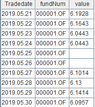
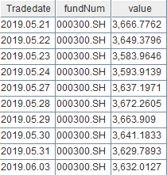
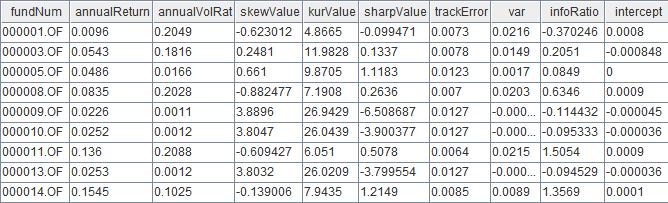

# 平均性能超 Python 10倍: 如何使用 DolphinDB 计算基金日频因子

根据某个基金每日的净值数据计算得到的因子称作“基金日频因子”。基金日频因子能反映出基金的近况，是衡量基金收益、波动、风险等的重要指标。随着数据规模与日俱增，对大规模数量级的数据进行处理的需求日益旺盛，在计算的速度、准确性上对计算工具提出了更高的要求。

本教程将为大家介绍如何基于 DolphinDB 计算多个基金的日频因子，并通过 Python 实现相同因子的计算，对比两者的计算性能。所用数据约220万条，均为与沪深300指数按日期对齐后的基金净值数据。结果表明在不同 CPU 核数下，DolphinDB 较 Python 均有明显的性能优势。

本教程包含如下内容：

- [平均性能超 Python 10倍: 如何使用 DolphinDB 计算基金日频因子](#平均性能超-python-10倍-如何使用-dolphindb-计算基金日频因子)
  - [1. 测试环境](#1-测试环境)
  - [2. 基金日频因子背景介绍及代码实现](#2-基金日频因子背景介绍及代码实现)
  - [3. DolphinDB 中因子计算实现及性能测试](#3-dolphindb-中因子计算实现及性能测试)
  - [4. Python 中因子计算实现及性能测试](#4-python-中因子计算实现及性能测试)
  - [5. 性能计算结果对比分析](#5-性能计算结果对比分析)
  - [6. 总结](#6-总结)

## 1. 测试环境

安装 DolphinDB server，配置为单节点模式，其默认端口号为`8848`。本次测试所涉及到的硬件环境和软件环境如下：

- **硬件环境**

  | 硬件名称 | 配置信息                                   |
  | :------- | :----------------------------------------- |
  | 操作系统 | 64位 CentOS Linux 7 (Core)                 |
  | 内存     | 256 GB                                     |
  | CPU 类型 | Intel(R) Xeon(R) Silver 4216 CPU @ 2.10GHz |

- **软件环境**

  | 软件名称                                                     | 版本信息   | 教程&下载链接                                                |
  | :----------------------------------------------------------- | :--------- | ------------------------------------------------------------ |
  | DolphinDB                                                    | V2.00.7    | [DolphinDB单节点部署教程](https://gitee.com/dolphindb/Tutorials_CN/blob/master/standalone_server.md)；[DolphinDB下载链接](https://dolphindb.cn/alone/alone.php?id=10) |
  | DolphinDB GUI                                                | V1.30.19.2 | [DolphinDB GUI下载链接](https://dolphindb.cn/alone/alone.php?id=10) |
  | Python（包含numpy、pandas、scipy等库以及 DolphinDB 的 Python API，需要预先安装） | 3.7.9      | [Python官网](https://www.python.org/)                        |

## 2. 基金日频因子背景介绍及代码实现

本教程选取了10个基金日频因子，涵盖基金评价体系的各个方面，作为性能测试的指标。其相关的背景含义、计算公式及在 DolphinDB 脚本和 Python 中的定义如下所示：

> 注：下文提到的 `DailyValue` 指日净值，`DailyReturn` 指日收益率，`BeginningValue` 指基金日净值序列中的第一个净值数据，`EndingValue` 指基金日净值序列中的最后一个净值数据。

- **年化收益率**

  - 因子含义：将当前收益率转换为一年内（按252个交易日计算）的收益率；

  - 公式：

    
    
  - 代码实现：

    - DolphinDB：

      ```
      defg getAnnualReturn(value){
            return pow(1 + ((last(value) - first(value))\first(value)), 252\730) - 1
      }
      ```

    - Python：

      ```python
      def getAnnualReturn(value):
          return pow(1 + ((value[-1] - value[0])/value[0]), 252/730)-1
      ```

- **年化波动率**
  
  - 因子含义：衡量基金的波动风险
  
  - 公式：
  
    
    
  - 代码实现：
  
    - DolphinDB：
  
      ```
      defg getAnnualVolatility(value){
      	return std(deltas(value)\prev(value)) * sqrt(252)
      }
      ```
  
    - Python：
  
      ```python
      def getAnnualVolatility(value):
          diff_value = np.diff(value)
          rolling_value = np.roll(value, 1)
          rolling_value = np.delete(rolling_value, [0])
          return np.std(np.true_divide(diff_value, rolling_value), ddof=1) * np.sqrt(252)
      ```
  
- **收益率偏度**

  - 因子含义：衡量收益偏斜程度

  - 公式：

    
    
  - 代码实现：

    - DolphinDB：

      ```
      defg getAnnualSkew(value){
      	return skew(deltas(value)\prev(value))
      }
      ```

    - Python：

      ```python
      def getAnnualSkew(value):
          diff_value = np.diff(value)
          rolling_value = np.roll(value, 1)
          rolling_value = np.delete(rolling_value, [0])
          return st.skew(np.true_divide(diff_value, rolling_value))
      ```

- **收益率峰度**
  
  - 因子含义：基金日收益率的分布相对于正态分布的峰值程度和尾部厚度
  
  - 公式：
  
    
    
  - 代码实现:
  
    - DolphinDB：
  
      ```
      defg getAnnualKur(value){
      	return kurtosis(deltas(value)\prev(value)) 
      }
      ```
  
    - Python：
  
      ```python
      def getAnnualKur(value):
          diff_value = np.diff(value)
          rolling_value = np.roll(value, 1)
          rolling_value = np.delete(rolling_value, [0])
          return st.kurtosis(np.true_divide(diff_value, rolling_value), fisher=False)
      ```
  
- **夏普比率**
  
  - 因子含义：反映单位风险基金净值增长率超过无风险收益率的程度
  
  - 公式：
  
    
    
  - 代码实现：
  
    - DolphinDB：
  
      ```
      defg getSharp(value){
      	return (getAnnualReturn(value) - 0.03)\getAnnualVolatility(value) as sharpeRat
      }
      ```
  
    - Python：
  
      ```python
      def getSharp(value):
          return (getAnnualReturn(value) - 0.03)/getAnnualVolatility(value) if getAnnualVolatility(value) != 0 else 0
      ```
  
- **最大回撤率**
  
  - 因子含义：指在选定周期内任一历史时点往后推，产品净值走到最低点时的收益率回撤幅度的最大值
  
  - 公式：
  
    在某个时间周期的净值序列中，记 `i` 为某一天，`DailyValuei` 为第 `i` 天的净值，`j` 为 `i` 之前的某一天，`DailyValuej` 为第 `j` 天的净值，找到一组 `i`,  `j` 使得其收益率回撤幅度最大记为最大回撤率 `MaxDrawdown`，
    
    
    
  - 代码实现：
  
    - DolphinDB：
  
      ```
      def getMaxDrawdown(value){
      	i = imax((cummax(value) - value) \ cummax(value))
      	if (i==0){
      		return 0
      	}
      	j = imax(value[:i])
      	return (value[j] - value[i]) \ (value[j])
      }
      ```
    
    - Python：
    
      ```python
      def getMaxDrawdown(value):
          i = np.argmax((np.maximum.accumulate(value) - value) / np.maximum.accumulate(value))
          if i == 0:
              return 0
          j = np.argmax(value[:i])
          return (value[j] - value[i]) / value[j]
      ```
  
- **收益回撤比**
  
  - 因子含义：是收益和风险的比值，可以用来衡量一只基金产品投资策略的好坏。
  
  - 公式：
  
    
    
  - 代码实现：
  
    - DolphinDB：
  
      ```
      def getDrawdownRatio(value){
      	return getAnnualReturn(value) \ getMaxDrawdown(value)
      }
      ```
      
    - Python：
    
      ```python
      def getDrawdownRatio(value):
          return getAnnualReturn(value) / getMaxDrawdown(value) if getMaxDrawdown(value) != 0 else 0
      ```
  
- **β系数**
  
  - 因子含义：一种风险指数，可以衡量股票基金相对于整个股市的波动情况
  
  - 公式：

    

    其中分子为日净值收益率和日基准收益率的协方差，分母为日基准收益率的方差
    
  - 代码实现：
  
    - DolphinDB：
  
      ```
      def getBeta(value, price){
      	return covar(deltas(value)\prev(value), deltas(price)\prev(price)) \ std(deltas(price)\prev(price))
      }
      ```
  
    - Python：
  
      ```python
      def getBeta(value, price):
          diff_price = np.diff(price)
          rolling_price = np.roll(price, 1)
          rolling_price = np.delete(rolling_price, [0])
          diff_value = np.diff(value)
          rolling_value = np.roll(value, 1)
          rolling_value = np.delete(rolling_value, [0])
          return np.cov(np.true_divide(diff_value, rolling_value), np.true_divide(diff_price, rolling_price))[0][1] / np.std(np.true_divide(diff_price, rolling_price), ddof=1)
      ```
  
- **α系数**
  
  - 因子含义：一种风险指数，用于衡量与市场波动无关的超额收益
  
  - 公式：
  
    
  
  - 代码实现：
  
    - DolphinDB：
  
      ```
      def getAlpha(value, price){
      	return getAnnualReturn(value) - 0.03 - getBeta(value, price) * (getAnnualReturn(price) - 0.03)
      }
      ```
  
    - Python：
  
      ```python
      def getAlpha(value, price):
          return getAnnualReturn(value) - 0.03 - getBeta(value, price) * (getAnnualReturn(price) - 0.03)
      ```
  
- **赫斯特指数**
  
  - 因子含义：体现时间序列的自相关性，尤其是序列中隐藏的长期趋势的指标。此处用来揭示某只基金序列中的隐藏长期趋势。
  
  - 计算方法：
  
    a. 将收益率序列按照不同的粒度（记为 k）切分成不同的片段，此处从粒度2到粒度365开始切分序列；
  
    b. 计算每个片段的均值，此处要计算2+3+4+...+365种；
  
    ​    公式：
  
    
  
    c. 计算每个片段的离差序列，即用每个片段的均值分别减该片段内的每个元素；
  
    ​    公式：
  
    

    d. 计算每个片段离差序列中的最大值减去最小值，记为 R；
  
    ​    公式：
  
    
  
    e. 计算每个片段的标准差，记为 S；
  
    ​    公式：
  
    
  
    f. 计算每个片段的 R/S 值，并计算按照不同粒度划分的所有片段中各片段元素的均值；
  
    ​    公式：
  
    
  
    g. 以划分的标准粒度为自变量，以对应的各片段元素的均值为因变量，计算回归方程，截距即为赫斯特指数；
  
    ​    公式：AVS=a*k+b，经过计算后系数 a 为赫斯特指数
    
  - 代码实现：
  
    - DolphinDB：
  
      ```
      def calAllRs2(mret, symList, k){
              rowCount = mret.rows()/k * k
              demeanCum = rolling(cumsum, mret[0:rowCount,] - each(stretch{, rowCount}, rolling(avg, mret, k, k)), k, k)
              a = rolling(max, demeanCum, k, k) - rolling(min, demeanCum, k, k)
              RS = nullFill!(a/rolling(stdp, mret, k, k), 1.0).mean().log()
              return table(symList as fundNum, take(log(k), symList.size()) as knum, RS as factor1)
      }
      ```
  
    - Python：
  
      ```python
      def calHurst(value_list, min_k):
          n = len(value_list)
          max_k = int(np.floor(n / 2))
          r_s_dict = []
          for k in range(min_k, max_k +1):
              subset_list = [value_list[i: i+k] for i in range(0, n, k)]
              if np.mod(n, k) > 0:
                  subset_list.pop()
              df_subset = np.array(subset_list)
              df_mean = df_subset.mean(axis=1).reshape(-1,1)
              df_cusum = (df_subset - df_mean).cumsum(axis=1)
              r = df_cusum.max(axis=1) - df_cusum.min(axis=1) + np.spacing(1)
              s = df_subset.std(axis=1, ddof=0) + np.spacing(1)
              r_s_dict.append({'R_S': (r / s).mean(), 'N': k})
          log_r_s=[]
          log_n=[]
          for i in range(len(r_s_dict)):
              log_r_s.append(np.log(r_s_dict[i]['R_S']))
              log_n.append(np.log(r_s_dict[i]['N']))
          try:
              res = np.polyfit(log_n, log_r_s, 1)[0]
          except:
              res = None
          return res
      ```

## 3. DolphinDB 中因子计算实现及性能测试

### 3.1 数据导入及概览

- **数据结构：**

  本教程选取了2018.05.24 - 2021.05.27期间3000多支基金的日净值数据，总数据量为330多万条。以下是净值表在 DolphinDB 中的数据结构：

  | 字段名      | 字段含义     | 数据类型（DolphinDB） |
  | ----------- | ------------ | --------------------- |
  | tradingDate | 交易日期     | DATE                  |
  | fundNum     | 基金交易代码 | SYMBOL                |
  | value       | 基金日净值   | DOUBLE                |

  同时，本教程选取了2018.05.24 - 2021.05.27期间沪深300指数的数据，共734条，用于和基金日净值数据作对齐操作。以下是指数表在 DolphinDB 中的数据结构：

  | 字段名      | 字段含义                    | 数据类型（DolphinDB） |
  | ----------- | --------------------------- | --------------------- |
  | tradingDate | 交易日期                    | DATE                  |
  | fundNum     | 指数名称（此处均为沪深300） | SYMBOL                |
  | value       | 沪深300收盘价格             | DOUBLE                |

- **数据导入：**

  本教程所使用的数据分别存储在两个 CSV 为格式的文件中，使用前需要先导入到 DolphinDB 的 `fund_OLAP` 和 `fund_hs_OLAP` 维度表中。

  首先，通过 DolphinDB GUI 连接 DolphinDB 后，定义函数分别读取 CSV 文件：

  ```
  //获取 CSV 数据列名
  def readColumnsFromWideCSV(absoluteFilename){
          schema1 = extractTextSchema(absoluteFilename)
          update schema1 set type = `STRING 
          allSymbol = loadText(absoluteFilename,,schema1)[0, 1:]
          titleSchema = extractTextSchema(absoluteFilename, skipRows = 0);
          for(x in allSymbol){
                  testValue = exec x[name] from titleSchema
                  testValue = testValue[1:]
          }
          return testValue
  }
  //获取 CSV 文件数据内容
  def readIndexedMatrixFromWideCSV(absoluteFilename){
          contracts = readColumnsFromWideCSV(absoluteFilename)
          dataZoneSchema = extractTextSchema(absoluteFilename, skipRows = 1)
          update dataZoneSchema set type = "DOUBLE" where name != "col0"//所有行除第一行外全部改成double
          update dataZoneSchema set type = "DATE" where name = "col0"//所有行除第一行外全部改成DATE
          dataZoneWithIndexColumn = loadText(absoluteFilename, skipRows = 1, schema = dataZoneSchema)
          indexVector = exec col0 from dataZoneWithIndexColumn
          dataZoneWithoutIndex = dataZoneWithIndexColumn[:, 1:]
          dataMatrix = matrix(dataZoneWithoutIndex)
          dataMatrix.rename!(indexVector, contracts)
          return dataMatrix
  }
  ```
  
  其次，调用该函数获取文件中的数据，将之转换分别赋予新的列名，存入 DolphinDB 的内存表：
  
  ```
  //基金日净值数据
  allSymbols = readColumnsFromWideCSV(csvPath)$STRING
  dataMatrix = readIndexedMatrixFromWideCSV(csvPath)
  fundTable = table(dataMatrix.rowNames() as tradingdate, dataMatrix)
  result = fundTable.unpivot(`tradingDate, allSymbols).rename!(`tradingdate`fundNum`value)
    
  //沪深300指数
  allSymbols1 = readColumnsFromWideCSV(csvPath1)$STRING
  dataMatrix1 = readIndexedMatrixFromWideCSV(csvPath1)
  fundTable1 = table(dataMatrix1.rowNames() as tradingDate, dataMatrix1)
  result1 = fundTable1.unpivot(`tradingDate, allSymbols1).rename!(`tradingdate`fundNum`value)
  ```
  
  最后，建立分布式数据库 `dfs://fund_OLAP` 和维度表 `fund_OLAP`, `fund_hs_OLAP`，并导入数据：
  
  ```
  //创建数据库
  dbName = "dfs://fund_OLAP"
  dataDate = database(, VALUE, 2021.01.01..2021.12.31)
  symbol = database(, HASH, [SYMBOL, 20])
  if(existsDatabase(dbName)){
  	dropDatabase(dbName)
  }
  db = database(dbName, COMPO, [dataDate, symbol])
  //定义表结构
  name = `tradingdate`fundNum`value
  type = `DATE`SYMBOL`DOUBLE
  tbTemp = table(1:0, name, type)
  //创建维度表 fund_OLAP
  tbName1 = "fund_OLAP"
  db.createTable(tbTemp, tbName1)
  loadTable(dbName, tbName1).append!(result)
  //创建维度表 fund_hs_OLAP
  tbName2 = "fund_hs_OLAP"
  db.createTable(tbTemp, tbName2)
  loadTable(dbName, tbName2).append!(result1)
  ```
  
- **数据概览：**

  数据导入成功后，执行如下代码查看前十条 fund_OLAP 数据：

  ```
  select top 10 * from loadTable("dfs://fund_OLAP", "fund_OLAP")
  ```

  

  同样，执行如下代码查看前十条 fund_hs_OLAP 数据：

  ```
  select top 10 * from loadTable("dfs://fund_OLAP", "fund_hs_OLAP")
  ```

  

### 3.2 数据处理

分别从两张表中取出数据，同沪深300指数按日期对齐（[aj](https://dolphindb.cn/cn/help/SQLStatements/TableJoiners/asofjoin.html)），填充空缺值，仅保留两表中日期相同的数据：

```
fund_OLAP=select * from loadTable("dfs://fund_OLAP", "fund_OLAP")
fund_hs_OLAP=select * from loadTable("dfs://fund_OLAP", "fund_hs_OLAP")
ajResult=select tradingDate, fundNum, value, fund_hs_OLAP.tradingDate as hstradingDate, fund_hs_OLAP.value as price from aj(fund_OLAP, fund_hs_OLAP, `tradingDate)
result2=select tradingDate, fundNum, iif(isNull(value), ffill!(value), value) as value, price from ajResult where tradingDate == hstradingDate
```

同时，计算多个基金的日收益率，进行赫斯特指数的计算：

```
symList = exec distinct(fundNum) as fundNum from result2 order by fundNum
portfolio = select fundNum as fundNum, (deltas(value)\prev(value)) as log, tradingDate as tradingDate from result2 where tradingDate in 2018.05.24..2021.05.27 and fundNum in symList
m_log = exec log from portfolio pivot by tradingDate, fundNum
mlog =  m_log[1:,]
```

处理后的数据共220万条，结构如下：

| 字段名      | 字段含义        | 数据类型（DolphinDB） |
| ----------- | --------------- | --------------------- |
| tradingDate | 交易日期        | DATE                  |
| fundNum     | 基金交易代码    | SYMBOL                |
| value       | 基金日净值      | DOUBLE                |
| price       | 沪深300收盘价格 | DOUBLE                |
| log         | 基金日收益率    | DOUBLE                |

### 3.3 性能测试

本节测试了DolphinDB的性能与任务量以及cpu核数的关系。

- 任务量：修改提交作业的数量。
- CPU 核数：修改 `dolphindb.cfg` 文件中的 [*workerNum* ](https://dolphindb.cn/cn/help/DatabaseandDistributedComputing/Configuration/Thread.html)参数，其配置值表示计算时所用到的CPU 核数。注意：每次参数修改后，需要重启 DolphinDB Server 才能生效。

本教程以提交后台作业的计算时间来反映 DolphinDB 性能。完整脚本可参考附录：[基于 DolphinDB 的基金日频因子实现与性能测试](https://dolphindb1.atlassian.net/wiki/spaces/document/pages/523042851/draft+Python10+DolphinDB#)。

- 在性能测试前，首先定义计算9个因子（不包含赫斯特指数）的函数：

  ```
  def getmetric(result2, symList){
  	Return = select fundNum, 
  	            getAnnualReturn(value) as annualReturn,
  	            getAnnualVolatility(value) as annualVolRat,
  	            getAnnualSkew(value) as skewValue,
  	            getAnnualKur(value) as kurValue,
  	            getSharp(value) as sharpValue,
  	            getMaxDrawdown(value) as MaxDrawdown,
  	            getDrawdownRatio(value) as DrawdownRatio,
  	            getBeta(value, price) as Beta,
  	            getAlpha(value, price) as Alpha	
               from result2
               where TradeDate in 2018.05.24..2021.05.27 and fundNum in symList group by fundNum
   }
  ```
  
  其中，部分运算结果如下图所示:

  

  > 注：该计算流程执行前需要预先运行之前预定义过的 DolphinDB 实现的因子函数。
  
- 计算10个因子的响应时间:

  定义获取10个因子计算和数据操作的时间的函数，并提交 job：

  ```
  def parJob(){
    	timer{fund_OLAP=select * from loadTable("dfs://fund_OLAP", "fund_OLAP")
    		  fund_hs_OLAP=select * from loadTable("dfs://fund_OLAP", "fund_hs_OLAP")
    		  ajResult = select tradingdate, fundNum, value, fund_hs_OLAP.tradingDate as hstradingDate, fund_hs_OLAP.value as price from aj(fund_OLAP, fund_hs_OLAP, `tradingDate)
    		  result2 = select tradingdate, fundNum, iif(isNull(value), ffill!(value), value) as value,price from ajResult where tradingDate == hstradingDate
    		  symList = exec distinct(fundNum) as fundNum from result2 order by fundNum
            symList2 = symList.cut(250)
    		  portfolio = select fundNum as fundNum, (deltas(value)\prev(value)) as log, tradingDate as tradingDate from result2 where tradingDate in 2018.05.24..2021.05.27 and fundNum in symList
            m_log = exec log from portfolio pivot by tradingDate, fundNum
            mlog =  m_log[1:,]
            knum = 2..365
              }//此处，将任务切分，按每次250个不同基金数据进行计算.
      timer{ploop(getFactor{result2}, symList2)
            a = ploop(calAllRs2{mlog,symList}, knum).unionAll(false)
            res2 = select fundNum, ols(factor1, kNum)[0] as hist, ols(factor1, kNum)[1] as hist2, ols(factor1, kNum)[2] as hist3 from a group by fundNum}
    }//定义获取10个因子计算和数据操作的时间的函数
    /**
     * 提交1个 job（单用户）
     */
    submitJob("parallJob1", "parallJob_single_ten", parJob)
    
    /**
     * 提交5个 job（多用户）
     */
    for(i in 0..4){
    	submitJob("parallJob5", "parallJob_multi_ten", parJob)
    }
  ```
  
  分别计算两种情形下的响应时间：
  
  ```
    //获取单个用户的运行时间
    select max(endTime) - min(startTime) from getRecentJobs() where jobDesc = "parallJob_single_ten"
    //获取多个用户的运行时间
    select max(endTime) - min(startTime) from getRecentJobs() where jobDesc = "parallJob_multi_ten"
  ```

### 3.4 结果展示

- 单任务（单位：秒）

  | CPU数 | 10个因子 |
  | ----- | ------------------------ |
  | 1    | 26.03             |
  | 6     | 7.23                                   |
  | 12    | 4.23                                   |
  
- 多任务（此处为5用户，单位：秒）

  | CPU数 | 10个因子 |
  | ----- | ------------------------ |
  | 1     | 140.50      |
  | 6     | 27.53                                 |
  | 12    | 15.66                                 |


> 注：由于赫斯特指数需要按照2+3+4+...+365种不同的粒度方式切分成不同种类的序列划分，同时分别对不同粒度的每一段序列分别计算均值、离差和标准差等，并最终求平均的 R/S 值，计算的子指标过大，时间复杂度较高，因此耗时相较于其它因子更长。

## 4. Python 中因子计算实现及性能测试

本章节中，我们基于 Python 实现了相同的因子计算并统计计算时间。

通过引入了 `joblib` 库中的 `Parallel` 方法，通过设置其 `n_jobs` 参数模拟不同 CPU 核数的运行环境。

在性能测试中，使用 Python 定义测算基金日收益率的 `getLog()` 函数和执行因子计算任务的 `main()` 函数 (因子计算通过 `numpy`, `pandas`, `scipy` 等库实现)：

```python
def getLog(value):
    diff_value = np.diff(value)
    rolling_value = np.roll(value, 1)
    rolling_value = np.delete(rolling_value, [0])
    return np.insert(np.true_divide(diff_value, rolling_value), 0, np.nan)

def main(li):
    value = np.array(li["value"])
    price = np.array(li["price"])
    log = np.array(li["log"])
    getAnnualReturn(value)
    getAnnualVolatility(value)
    getAnnualSkew(value)
    getAnnualKur(value)
    getSharp(value)
    getMaxDrawdown(value)
    getDrawdownRatio(value)
    getBeta(value, price)
    getAlpha(value, price)
    calHurst(log, 2)
```

使用 Python API 进行取数等数据处理操作，使用Python对其进行数据对齐和计算基金日收益率的操作。统计整个计算流程的时间：

```python
s = ddb.session()
s.connect("127.0.0.1", 8848, "admin", "123456")
start = time.time()
fund_OLAP = s.loadTable(dbPath="dfs://fund_OLAP", tableName="fund_OLAP").select("*").toDF().sort_values(['tradingDate'])
fund_hs_OLAP = s.loadTable(dbPath="dfs://fund_OLAP", tableName="fund_hs_OLAP").select("*").toDF()
fund_hs_OLAP.rename(columns={'tradingDate': 'hstradingDate'}, inplace=True)
fund_hs_OLAP = fund_hs_OLAP.sort_values(['hstradingDate'])
fund_dui_OLAP = pd.merge_asof(fund_OLAP, fund_hs_OLAP, left_on="tradingDate", right_on="hstradingDate").sort_values(['fundNum_x', 'tradingDate'])
fund_dui_OLAP = fund_dui_OLAP[fund_dui_OLAP['tradingDate'] == fund_dui_OLAP['hstradingDate']]
fund_dui_OLAP.reset_index(drop=True, inplace=True)
fund_dui_OLAP.drop(columns=['fundNum_y', 'hstradingDate'], inplace=True)
fund_dui_OLAP.columns = ['tradingDate', 'fundNum', 'value', 'price']
fund_dui_OLAP["log"] = pd.Series(getLog(fund_dui_OLAP["value"]))
list = fund_dui_OLAP[(fund_dui_OLAP['tradingDate'] >= datetime(2018, 5, 24)) & (fund_dui_OLAP['tradingDate'] <= datetime(2021, 5, 27))].groupby('fundNum')
Parallel(n_jobs=1)(delayed(main)(i) for _,i in list)
end = time.time()
print(end-start)
```

## 5. 性能计算结果对比分析

- 单任务（单位：秒）

  | CPU数 | DolphinDB 响应时间 | Python 响应时间 | Python/DolphinDB |
  | ----- | --------------------- | ------------------ | --------------------------- |
  | 1    | 26.03                          | 112.34        | 4.32 |
  | 6     | 7.23                           | 55.35         | 7.66                   |
  | 12    | 4.23              | 36.19       | 8.56                    |
  
- 多任务（此处为5用户，单位：秒）

  | CPU数 | DolphinDB 响应时间 | Python 响应时间 | Python/DolphinDB |
  | ----- | --------------------- | ------------------ | --------------------------- |
  | 1   | 140.49        | 511.89                      | 3.64 |
  | 6     | 27.52         | 226.45       | 8.22                   |
  | 12    | 15.66                          | 224.80       | 14.35                      |

> 注：教程中我们只选取了部分测试结果进行展示。

在控制其它变量一致的前提下，无论是单任务还是多任务，在不同 CPU 核数环境下 DolphinDB 均表现出了比 Python 更优越的性能。其中性能差异最高可接近 Python 的14倍，平均性能超10倍。究其原因，主要有以下几点：

- DolphinDB 强大的向量化计算能力：DolphinDB 最大程度上兼顾了向量化计算的性能，即其计算引擎的设计针对涉及到向量的计算进行了性能上的优化，而 Python 作为解释型脚本语句，每运行一句都要进行相应的解释，且对向量化计算能力的优化较 DolphinDB 有一定的欠缺，这使得针对数组的向量化计算显示出了比 Python 更优越的性能；
- DolphinDB 丰富的内置函数：DolphinDB 预定义了1000多个可以直接调用的函数。相较于 Python 减少了因子定义的代码量和封装次数，在计算过程中性能损耗更少；
- DolphinDB 自带的持久化数据存储：DolphinDB 内置数据存储引擎，可以将数据按照不同分区方式存入分布式数据库表，因子计算时的数据读取更高效；Python 在因子计算的过程中需要引入外部数据源，数据读取效率相对较低。

## 6. 总结

本教程基于3000多只基金的日净值数据，对比测试了不同 CPU 核数环境下以及任务提交数下，Python 和 DolphinDB 计算相同因子的性能差异。

可以看到，由于DolphinDB具有强大的向量化计算的能力，包含丰富的内置函数功能，以及具备自带的持久化数据存储，因而无论在多线程还是多任务情况下，DolphinDB 在计算因子时都有相较于 Python 更为优异的表现。因此相较之下，DolphinDB 表现出更为显著的优势。

### 附件

[测试数据](https://www.dolphindb.cn/downloads/docs/fund_factor_contrasted_by_py.zip)

[数据导入到 DolphinDB 的脚本](script/fund_factor_contrasted_by_py/fund_data_load.txt)

[基于 DolphinDB 的基金日频因子实现与性能测试](script/fund_factor_contrasted_by_py/fund_factor_ddb.txt)

[基于 Python 的十个基金日频因子实现与性能测试](script/fund_factor_contrasted_by_py/fund_factor.py)