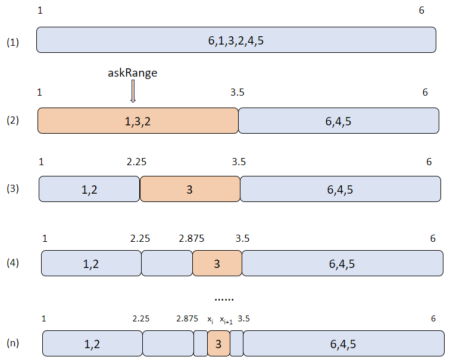

# 使用 summary 函数生成大规模数据统计信息

- [业务场景](#业务场景)
- [函数简介](#函数简介)
	- [语法](#语法)
	- [参数介绍](#参数介绍)
- [使用示例](#使用示例)
	- [生成内存表统计信息](#生成内存表统计信息)
	- [生成 DFS 表统计信息](#生成-dfs-表统计信息)
	- [使用 SQL 语句作为输入数据源](#使用-sql-语句作为输入数据源)
	- [大规模数据计算](#大规模数据计算)
- [与 Python 性能对比](#与-python-性能对比)
	- [对比结果](#对比结果)
- [实现原理](#实现原理)
	- [min、max、count、avg、std 计算](#minmaxcountavgstd-计算)
	- [百分位计算](#百分位计算)
- [小结](#小结)
- [附件](#附件)

## 业务场景

对数据集深入分析前，可以通过 `summary` 函数快速了解数值型列的概括信息，例如，平均值、标准差、最小值、最大值和百分位数，这有助于初步了解数据的分布情况和特征。在探索性数据分析（EDA）过程中，`summary` 函数有助于识别异常值、离群值和数据分析的偏态。通过观察统计信息，可以进一步决定数据清洗和数据转换的策略。例如，如果某个数值型列的最大值或最小值远离其平均值，则可能存在异常值或离群值；如果某个数值型列的标准差较大，则表示可能存在数据分布的偏态。

## 函数简介

### 语法

```
summary(X,[interpolation='linear'],[characteristic=`avg`std],[percentile=[25,50,75]],[precision=0.01],[partitionSampling=1.0])
```

### 参数介绍

- **X**：内存表、DFS 表或由 `sqlDS` 函数生成的数据源。
- **interpolation**：计算百分位采用的插值方法，可选：linear、nearest、lower、higher、midpoint。
- **characteristic**：需要输出的统计特征，可选：avg 和 std。
- **percentile**：需要输出的百分位数。
- **precision**：百分位计算精度。
- **partitionSampling**：针对分区表设计的参数，表示参与进行数据统计的分区数量。

有关 `summary` 函数的用法、示例及注意事项，参考 DolphinDB 用户手册中该函数的详细介绍。

## 使用示例

### 生成内存表统计信息

```
n=2022
data=1..2022
value=take(1..3,n)
name=take(`APPLE`IBM`INTEL,n)
t=table(data,value,name);
res = summary(t, precision=0.001);
```

### 生成 DFS 表统计信息

```
db = database(dbName,VALUE,`A`B`C`D)
...
pt = loadTable(dbName, tableName)
// 生成 DFS 表统计信息，同时指定分区采样率为 0.5
re = summary(pt,`linear,`avg`std, [25,50], 0.001, 0.5)
```

示例中的 DFS 表采用值分区方式，拥有 A、B、C和 D 共 4 个分区。分区采样率为 0.5，结果将随机输出 2 个分区的数据统计信息。

### 使用 SQL 语句作为输入数据源

```
ds = sqlDS(<select * from table>)
re = summary(ds, type)
```

### 大规模数据计算

pandas 的 `describe` 函数要求所有的计算过程都在内存中完成，因此其无法处理数据规模超出内存限制的情况。为解决大规模数据的计算问题，`summary` 对数据分批计算，即每次只读取部分数据到内存。对于百分位的计算，`summary` 每次只计算一个数值列而非全量数据。同时，`summary` 还提供了分区采样的功能，即不统计全量数据，而是通过统计部分分区数据来反映总体数据的特征。

以下是用 `summary` 函数计算大规模数据统计信息的示例：

**基本信息**

- 数据集：[hits.csv.gz](https://datasets.clickhouse.com/hits_compatible/hits.csv.gz) （约 76G）
- 内存：32G
- DolphinDB 版本：2.00.10
- 分区采样数： 总分区数的一半
- 耗时：43s
- 脚本：见附件

## 与 Python 性能对比

使用 DolphinDB 的 `summary` 与 pandas 中的 `describe` 函数在 4G 数据集下进行性能对比。

**基本信息**

- 数据集： TradesData.csv（见附件）
- DolphinDB 版本：2.00.10 社区版
- pandas 版本：v1.5.3

DolphinDB 脚本：

```
login('admin','123456')
dataDir = "/path/to/TradesData.csv"
dbName = "dfs://summary"
schematable = table(`symbol`date`second`price`size`g127`corr`cone`ex as name, `SYMBOL`DATE`SECOND`DOUBLE`INT`INT`INT`STRING`CHAR as type)
if(existsDatabase(dbName)){
		dropDatabase(dbName)
	}
db = database(directory=dbName, partitionType=HASH, partitionScheme=[STRING, 10], engine="TSDB", chunkGranularity="DATABASE")
loadTextEx(db, "pt", "symbol", dataDir, sortColumns = `symbol`size, schema=schematable)
pt = loadTable(dbName, "pt")
timer{
	summary(pt)
}
```

`summary` 统计结果：

| **name** | **min** | **max**     | **nonNullCount** | **count**  | **avg**  | **std**   | **percentile**              |
| :------- | :------ | :---------- | :--------------- | :--------- | :------- | :-------- | :-------------------------- |
| price    | 0.0001  | 19999.990   | 99,999,999       | 99,999,999 | 43.9381  | 255.7168  | [20.430, 34.979, 53.310]    |
| size     | 1.0000  | 9000000.000 | 99,999,999       | 99,999,999 | 285.8452 | 4622.1386 | [100.000, 100.000, 200.000] |
| g127     | 0.0     | 0.0         | 99,999,999       | 99,999,999 | 0.0      | 0.0       | [0.000, 0.000, 0.000]       |
| corr     | 0.0     | 12.000      | 99,999,999       | 99,999,999 | 0.001    | 0.097     | [0.000, 0.000, 0.000]       |
| ex       | 65.000  | 88.000      | 99,999,999       | 99,999,999 | 78.799   | 4.792     | [78.000, 79.999, 81.000]    |

Python 代码：

```
import pandas as pd
import numpy as np
import time

def to_int(s):
    return int(s[0])

data = np.loadtxt('/path/to/TradesData.csv', delimiter=',', skiprows=1, usecols=(3, 4, 5, 6, 8), converters={8: to_int})
df = pd.DataFrame(data, columns=['price', 'size', 'g127', 'corr', 'ex'])
startTime = time.time()
df.describe()
endTime = time.time()
print("duration", endTime - startTime)
```

### 对比结果

| **summary** | **describe** |
| :---------- | :----------- |
| 8.053s      | 13.409s      |

在示例中，`summary` 函数相比于 `describe` 函数性能提升了 40%。对于分区表，`summary` 函数采用 MapReduce 框架以分区为粒度分批并行地进行计算，对比 pandas 中 `describe` 函数的串行计算，在保障计算结果精确的同时，`summary` 函数具有更快的计算速度。

## 实现原理

### min、max、count、avg、std 计算

对于数据量相对较小的内存表，直接计算 min、max、count、avg、std 值。

对于分区表，以分区为单位使用 MapReduce 架构进行计算：

- 对于 min、max 和 count 的计算，先用 Map 计算每个分区的值，然后根据 Map 的计算结果在 Reduce 时计算 min，max 和 count；
- 对于 avg 的计算，需要在 MapReduce 中计算数据的和 sum，然后根据 sum 和 count 值计算 avg；
- 对于 std 的计算，还需要在 MapReduce 中计算数据的和 sum 以及平方和 sum²，然后根据 sum、sum² 和 count 计算 std。

### 百分位计算

百分位数表述数据从小到大时，某个值在数据中的相对位置。第 K 个百分位表示位于第 K% 的值。百分位数以输入分数相同的度量单位表示：例如，如果分数指的是物品的价格，相应的百分位数将以相应的货币单位表示。

`summary` 的百分位计算取值方式包括：linear、lower、higher、nearest、midpoint。

`summary` 以数据的最小值和最大值作为初始范围，并将该范围划分为数个大小相等的区间，统计数据落在各个区间的数量，再根据修改结果调整区间范围，迭代直至精度满足要求。

`summary` 采用 Iterate-MapReduce 框架实现对百分位的计算，计算过程如下：

1. Map：根据数据范围均等划分区间，统计各个区间内元素的个数。
2. Reduce：将 Map 过程的结果相加。
3. MapFinal：确定每个查询点所在的区间。其中每个查询点赋一个 askRange，初始为全局最大最小值。对于 askRange 和当前 range 相同的查询点更新其 askRange。迭代计算直至 askRange 上界与下界之差达到精度要求。



上图为算法示例，数据总共有 6 个元素，初始范围为 [1, 6]，要求以 linear 的方式计算第 50 百分位数。第 50 百分位的分位点刚好为数据正序排序后的第 3 个元素，因此，数据正序排序后的第 3 个元素即为 linear 的结果。图中每次迭代将会把 askRange 均等划分为 2 个区间，并统计区间中元素的数量，取第 3 个元素所在区间为新的 askRange，如果此时 askRange 还没达到精度要求则会继续进行划分。当精度达到要求时退出迭代，取所求结果为 askRange 的上界 Xi 和下界 Xi+1 的平均值（图中示例为 3）。

## 小结

`summary` 函数可用于：

- 生成内存表、内存分区表以及 DFS 表的描述性统计数据，统计数据集的集中趋势、分散和行列的分布情况。
- 快速提供有关数据中数值列的汇总统计信息，包括：最小值 min、最大值 max、数值列非空值总数 nonNullCount、数值列总数 count、平均值 avg、标准差 std、百分位数 percentile 。
- 计算超出内存限制的数据的统计信息，并在同等数据规模下，表现出比 pandas 的 `describe` 函数更高的性能。

## 附件

[hits_summary.dos](./script/hits_summary.dos) 