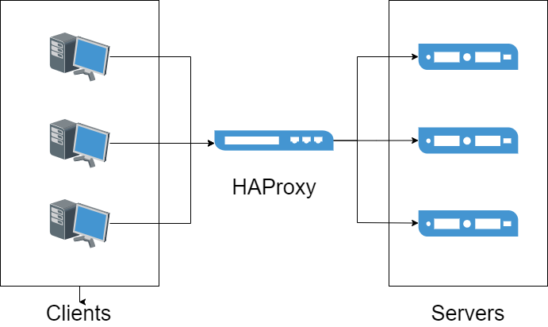
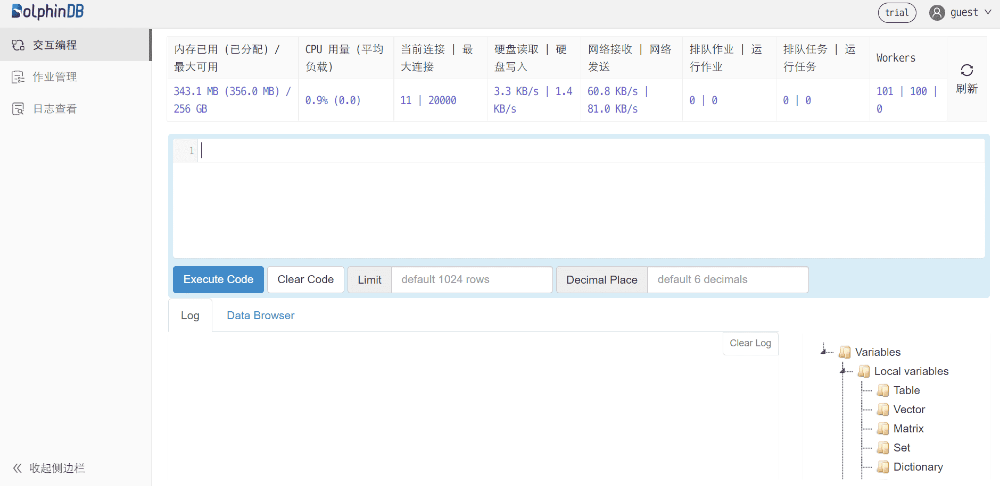
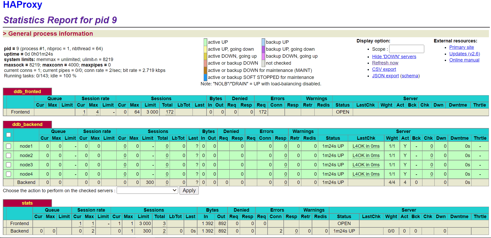

# HAProxy 在 DolphinDB 中的最佳实践

HAProxy 是一款基于 C 语言开发的开源软件，用于提供高可用性、负载均衡和基于 TCP（第四层）和 HTTP（第七层）应用的代理服务，是一种免费、快速、可靠的解决方案，因其优异的性能在如今各大主流网页上得到了广泛的应用。

DolphinDB 作为一款可用于搭建高可用数据集群的时序数据引擎，其在实际生产环境的应用中对高并发、大流量的处理对实际应用性能具有更高的要求。本次教程为此类生产环境中的实践需求提供了一个解决方案，将 HAProxy 引入到 DolphinDB 的高可用集群中，通过使用 HAProxy 所提供的特定功能来实现 DolphinDB 数据节点的负载均衡。

本教程所包含的内容如下：

- [HAProxy 在 DolphinDB 中的最佳实践](#haproxy-在-dolphindb-中的最佳实践)
  - [1. HAProxy 概述](#1-haproxy-概述)
  - [2. 环境部署](#2-环境部署)
  - [3. HAProxy 安装、部署、应用流程](#3-haproxy-安装部署应用流程)
    - [3.1 HAProxy 安装](#31-haproxy-安装)
    - [3.2 HAProxy 配置 DolphinDB 集群端口监控](#32-haproxy-配置-dolphindb-集群端口监控)
    - [3.3 HAProxy 服务启动](#33-haproxy-服务启动)
    - [3.4 HAProxy 运维](#34-haproxy-运维)
  - [4. 总结](#4-总结)


## 1. HAProxy 概述

- **软件简介**

HAProxy 是一款由 Linux 内核贡献者在2000年基于 C 语言开发的一款开源软件，用于为基于 TCP （第四层）和 HTTP（第七层）协议的应用程序提供高可用性、负载均衡和代理服务等。它具有高可用性、负载均衡、健康检查、会话保持、SSL、监控统计等多种核心功能。其良好的可扩展性、对高并发大流量的支持以及对 CPU、内存资源等的高效利用，使得其在当今诸如 GitHub, Bitbucket, Stack Overflow, Reddit 等主流网站上得到了广泛应用。

HAProxy 作为一款类似于软件应用中间件的工具，其主要包含两个部分：前端，定义用于接收从客户端发来的请求的端口；后端，用于将从前端接收过来的请求交付于后端的应用服务处理，一般来说一个前端的代理服务端口可以对应多个后端应用服务。HAProxy 主要起到了代理服务以及负载均衡的中间件作用，实现将高并发、大流量的请求平均分配到后端多个服务上。



- **官方教程、下载、安装**

HAProxy 由 Linux 内核的核心贡献者 Willy Tarreau 于 2000 年编写，他现在仍然负责该项目的维护，并在开源社区免费提供版本迭代。本文示例使用 HAProxy [2.6](https://www.haproxy.com/blog/announcing-haproxy-2-6/)。推荐使用最新稳定版的 HAProxy，详情见[已发布的 HAProxy 版本](http://www.haproxy.org/)。

- **HAProxy 部分核心功能介绍**
  - [高可用性](http://cbonte.github.io/haproxy-dconv/2.6/intro.html#3.3.4)：HAProxy 提供优雅关闭服务和无缝切换的高可用功能；
  - [负载均衡](http://cbonte.github.io/haproxy-dconv/2.6/configuration.html#4.2-balance)：L4 (TCP) 和 L7 (HTTP) 两种负载均衡模式，至少 9 类均衡算法，比如 roundrobin, leastconn, random 等；
  - [健康检查](http://cbonte.github.io/haproxy-dconv/2.6/configuration.html#5.2-check)：对 HAProxy 配置的 HTTP 或者 TCP 模式状态进行检查；
  - [会话保持](http://cbonte.github.io/haproxy-dconv/2.6/intro.html#3.3.6)：在应用程序没有提供会话保持功能的情况下，HAProxy 可以提供该项功能；
  - [SSL](http://cbonte.github.io/haproxy-dconv/2.6/intro.html#3.3.2)：支持 HTTPS 通信和解析；
  - [监控与统计](http://cbonte.github.io/haproxy-dconv/2.6/intro.html#3.3.3)：通过 web 页面可以实时监控服务状态以及具体的流量信息。

利用这些核心功能，可以实现为 DolphinDB 实现负载均衡、健康检查等功能，下文将以四个数据节点的集群为例，为大家逐步介绍安装部署、启动服务的过程。

## 2. 环境部署

- **硬件环境：**

| 硬件名称 | 配置信息                  |
| :------- | :------------------------ |
| 主机名   | HostName                  |
| 外网 IP  | xxx.xxx.xxx.122           |
| 操作系统 | Linux（内核版本3.10以上） |
| 内存     | 64 GB                     |
| CPU      | x86_64（12核心）          |

- **软件环境：**

| 软件名称  | 版本信息  |
| :-------- | :-------- |
| DolphinDB | V2.00.8   |
| HAProxy   | 2.6.2     |
| Docker    | 3.0及以上 |

> 注：本教程包含了如何在 docker 环境下安装、部署 HAProxy 的内容，需要提前安装 docker。具体安装方法可以参考 [docker 官方教程](https://docs.docker.com/get-docker/)。

## 3. HAProxy 安装、部署、应用流程

> 注：在流程开始前建议预先构建具有多数据节点 DolphinDB 高可用集群。具体安装方法可以参考 [DolphinDB 高可用集群部署教程](https://gitee.com/dolphindb/Tutorials_CN/blob/master/ha_cluster_deployment.md)。也可以参考 [基于 Docker-Compose 的 DolphinDB 多容器集群部署](https://gitee.com/dolphindb/dolphindb-k8s/blob/master/docker-compose_high_cluster.md)。

### 3.1 HAProxy 安装

- **主机环境**

首先，在安装 HAProxy 之前要确保主机上安装了 `epel-release` 、`gcc` 、`systemd-devel` 三个依赖包。执行如下命令安装：

```
$ yum -y install epel-release gcc systemd-devel
```

下载 HAProxy 2.6.2 的源码包并解压：

```
$ wget https://www.haproxy.org/download/2.6/src/haproxy-2.6.2.tar.gz && tar zxf haproxy-2.6.2.tar.gz
```

执行如下命令编译源码：

```
$ cd haproxy-2.6.2
$ make clean
$ make -j 8 TARGET=linux-glibc USE_THREAD=1
$ make PREFIX=${/haproxy} SBINDIR=${/haproxy/bin} install  # 根据实际情况将 `${/haproxy}` 和 `${/haproxy/bin}` 替换为实际路径
```

重新配置 *profile* 文件：

```
$ echo 'export PATH=/app/haproxy/bin:$PATH' >> /etc/profile
$ . /etc/profile
```

执行如下命令查看是否安装成功：

```
$ which haproxy
```

- **docker 环境**

执行如下命令拉取 HAProxy 的 docker 镜像，这里我们选择 *haproxytech/haproxy-alpine:2.6.2*.

```
$ docker pull haproxy:2.6.2-alpine
```

### 3.2 HAProxy 配置 DolphinDB 集群端口监控

在主机上创建 *haproxy.cfg* 文件，并配置如下配置项：

```
global                           #定义全局配置
    log         127.0.0.1 local2 #定义全局的 syslog 服务器，最多可以定义两个。
    maxconn     4000
    user haproxy
    group haproxy

defaults
    mode                    tcp               #工作模式为 http
    log                     global             #日志继承全局配置的设置
    option                  tcplog            #日志类别,采用 httplog
    option                  dontlognull        #空连接不记录在日志中
    option http-server-close
    option forwardfor       except 127.0.0.0/8 #
    option                  redispatch         #服务不可用后重定向到其他健康服务器。
    retries                 3                  #上游服务器尝试连接的最大次数，此处为3
    timeout http-request    10s
    timeout queue           1m                 #在请求队列中排队的最大时长
    timeout connect         10s                #haproxy和服务端建立连接的最大时长
    timeout client          1m                 #和客户端保持空闲连接的最大时长
    timeout server          1m                 #和服务端保持空闲连接的最大时长
    timeout http-keep-alive 10s                #开启与客户端的会话保持时间，为10s
    timeout check           10s
    maxconn                 3000               #定义客户端与服务器端的最大连接数为3000

frontend    ddb_fronted
    bind        *:8080 #前端用于接收请求的端口
    mode        tcp
    log         global
    default_backend ddb_backend

backend ddb_backend
    balance roundrobin #这里使用了动态加权轮询算法，支持权重的运行时调整及慢启动机制，是一种最公平、最平衡的算法
    # 检测服务器端口端口，频率为每 5 秒一次。如果 2 次检测成功，则认为服务器可用；如果 3 次检测失败，则认为服务器不可用。
    server node1 xxx.xxx.xxx.1:9302 check inter 5s rise 2 fall 3
    server node2 xxx.xxx.xxx.2:9302 check inter 5s rise 2 fall 3
    server node3 xxx.xxx.xxx.3:9302 check inter 5s rise 2 fall 3
    server node4 xxx.xxx.xxx.4:9302 check inter 5s rise 2 fall 3

listen stats
    mode    http
    bind    0.0.0.0:1080    #监控页面的访问端口
    stats   enable
    stats   hide-version
    stats uri /haproxyamdin #监控页面的 uri
    stats realm Haproxy     #监控页面的提示信息
    stats auth admin:admin  #监控页面的访问用户名加密码，此处均为 admin
    stats admin if TRUE
```

> 💡**注意**：后端服务器四个 ip 和端口要根据实际情况进行修改。

### 3.3 HAProxy 服务启动

在主机环境下，执行如下命令启动 HAProxy，其中 -f 后接配置文件所在地址，默认为 */etc/haproxy/haproxy.cfg*，此处为 */haproxy/haproxy.cfg* 。

```
$ haproxy -f /haproxy/haproxy.cfg
```

在 docker 环境下，执行如下命令创建容器，注意要将监控端口和前端端口映射到主机上，同时将在主机上配置好的 *haproxy.cfg* 文件映射到容器内：

```
$ docker run -itd --name ddb_haproxy -p 8080:8080 -p 1080:1080 -v /haproxy/haproxy.cfg:/usr/local/etc/haproxy/haproxy.cfg --privileged=true haproxy:2.6.2-alpine
```

启动成功后，用户就可以使用 DolphinDB 的 VScode 插件和 DolphinDB GUI 连接 HAProxy 用于接收请求的前端端口8080来访问 DolphinDB 的集群服务。假如访问8080端口，出现如下为访问 DolphinDB 数据节点端口的浏览器页面时，证明 HAProxy 部署成功。



> 💡**注意**：使用 DolphinDB 客户端工具连接监听的代理端口时，HAProxy 的负载均衡功能会根据相应的算法规则等自动分配连接到后端部署的其中之一节点。

 

### 3.4 HAProxy 运维

- **监控页面查看**

在可以访问到 HAProxy 部署主机的任一机器上的浏览器中输入部署主机 ip: 监听端口以及配置的 URI，此处为 `xxx.xxx.xxx.122:1080/haproxyamdin`，访问监控页面。



- **HAProxy服务重启、终止**

在 HAProxy 服务的实际使用过程中，需要通过终止或重启服务来实现配置文件修改生效等操作。

在主机环境下，首先执行如下命令找到正在运行的 HAProxy 进程 PID：

```
$ ps -ef | grep haproxy
```

其次，使用 `kill` 命令终止正在运行的 HAProxy 进程：

```
$ kill -9 ${haproxy_pid} #${haproxy_pid}为实际进程数
```

如需要重启则再次执行 `haproxy -f` 命令。

而在 docker 环境下，可以通过如下命令重启服务

```
$ docker restart ddb_haproxy
```

如需终止且彻底删除容器，则可以执行如下命令：

```
$ docker stop ddb_haproxy && docker rm ddb_haproxy
```

## 4. 总结

本教程聚焦了如何使用 HAProxy 实现 DolphinDB 集群的负载均衡，以一个具有四个数据节点的 DolphinDB 高可用集群为例，介绍了如何安装、部署、配置 HAProxy，为 DolphinDB 实际生产环境的 HAProxy 实践提供了一个样例。由于篇幅有限，本教程所介绍的内容相对有限，在实际使用过程中可能还需要用户根据实际要求进行调整。也欢迎用户对本教程批评指正。
