# 高可用集群部署

DolphinDB 集群包括四种类型节点：控制节点（controller）、代理节点（agent）、数据节点（data node）和计算节点（compute node）。

- **控制节点**：控制节点是 DolphinDB 集群的核心部分，负责收集代理节点和数据节点的心跳，监控每个节点的工作状态，管理分布式文件系统的元数据和事务日志。高可用集群中会有多个控制节点并组成一个 Raft 组，通过 Raft 协议保证多个控制节点上元数据的强一致性。
- **代理节点**：代理节点负责执行控制节点发出的启动和关闭数据节点或计算节点的命令。在一个集群中，每台物理服务器有且仅有一个代理节点。
- **数据节点**：数据节点既可以存储数据，也可以用于数据的查询和计算。每台物理服务器可以配置多个数据节点。
- **计算节点**：计算节点主要用于数据的查询和计算，包括历史数据查询、分布式表关联查询、批计算、流计算和机器学习模型训练等。计算节点不存储数据，但可以通过 [loadTable](https://docs.dolphindb.cn/zh/funcs/l/loadTable.html) 函数加载数据进行计算。在计算节点上，可以执行创建数据库和分区表的语句，也可以调用数据写入接口往分区表写入数据，但是相比在数据节点执行写入任务，会增加一定的网络传输的开销，因为计算节点不存储数据，会把涉及存储的数据均匀地发送并存储到集群中的数据节点上。每台物理服务器可以配置多个计算节点。

本教程用于在 Linux 操作系统上进行高可用集群的部署、升级、过期 License 升级，并对常见问题做出解答，便于用户快速上手 DolphinDB。包含以下主题：

- [1. 部署 DolphinDB 高可用集群](#1-部署-dolphindb-高可用集群)
  - [第一步：下载](#第一步下载)
  - [第二步：更新软件授权许可](#第二步更新软件授权许可)
  - [第三步：集群配置](#第三步集群配置)
  - [第四步：启动集群](#第四步启动集群)
  - [第五步：连接数据节点创建数据库和分区表](#第五步连接数据节点创建数据库和分区表)
  - [第六步：连接计算节点查询和计算](#第六步连接计算节点查询和计算)
- [2. 基于 Web 的集群管理](#2-基于-web-的集群管理)
  - [2.1 控制节点参数配置](#21-控制节点参数配置)
  - [2.2 数据节点和计算节点参数配置](#22-数据节点和计算节点参数配置)
- [3. 集群升级](#3-集群升级)
- [4. 授权许可文件过期更新](#4-授权许可文件过期更新)
- [5. 高可用集群的高可用功能](#5-高可用集群的高可用功能)
  - [5.1 元数据高可用](#51-元数据高可用)
  - [5.2 数据高可用](#52-数据高可用)
  - [5.3 客户端高可用](#53-客户端高可用)
- [6. 常见问题解答（FAQ）](#6-常见问题解答faq)
  - [6.1 节点启动失败的可能原因](#61-节点启动失败的可能原因)
  - [6.2 如何通过 systemd 命令启动 DolphinDB 集群？](#62-如何通过-systemd-命令启动-dolphindb-集群)
  - [6.3 Web 管理界面无法访问怎么办？](#63-web-管理界面无法访问怎么办)
  - [6.4 Linux 升级失败如何版本回退？](#64-linux-升级失败如何版本回退)
  - [6.5 为什么在线更新授权许可文件失败？](#65-为什么在线更新授权许可文件失败)
  - [6.6 为什么云部署节点无法启动？](#66-为什么云部署节点无法启动)
  - [6.7 如何进行配置参数调优？](#67-如何进行配置参数调优)
  - [6.8 如何设置数据卷？](#68-如何设置数据卷)
- [7. 参考](#7-参考)
- [附录](#附录)


## 1. 部署 DolphinDB 高可用集群

本教程示例集群的部署架构图如下：

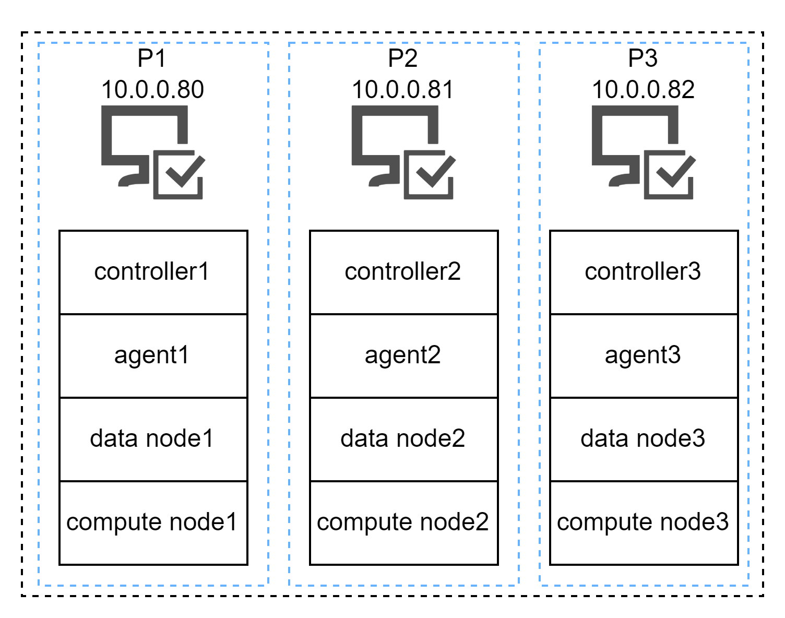

三台部署服务器（P1, P2, P3）对应的内网 IP 地址为：

```
P1：10.0.0.80
P2：10.0.0.81
P3：10.0.0.82
```

部署本教程示例高可用集群前的要求和准备：

- 本教程示例集群超过了社区版试用授权许可节点数的限制，所以必须[申请企业版 License ](https://dolphindb.cn/product#downloads)并按第一章第二步的方法进行更新。
- 建议节点的 IP 地址使用内网 IP，网络使用万兆以太网。如果使用外网地址，则不能保证节点间网络传输性能。
- 部署数据节点或者计算节点的服务器必须部署一个代理节点，用于启动和关闭该服务器上的数据节点或计算节点。

### 第一步：下载

在每台服务器上下载 DolphinDB 安装包并解压。

- 官方下载地址：<https://dolphindb.cn/product#downloads>
- 也可以通过 Shell 指令下载。下载方式如下：

  ```sh
  wget https://www.dolphindb.cn/downloads/DolphinDB_Linux64_V${release}.zip -O dolphindb.zip
  ```

  其中，`${release}` 代表版本。例如：下载 2.00.11.3 版本的 Linux64 server，使用以下指令：

  ```sh
  wget https://www.dolphindb.cn/downloads/DolphinDB_Linux64_V2.00.11.3.zip -O dolphindb.zip
  ```

  如需下载 ABI 或 JIT 版本 server，则需要在版本号后以下划线连接 ABI 或 JIT。例如：下载 2.00.11.3 版本的 Linux64 ABI server, 使用以下指令：

  ```sh
  wget https://www.dolphindb.cn/downloads/DolphinDB_Linux64_V2.00.11.3_ABI.zip -O dolphindb.zip
  ```

  下载 2.00.11.3 版本的 Linux64 JIT 版本 server，使用以下指令：

  ```sh
  wget https://www.dolphindb.cn/downloads/DolphinDB_Linux64_V2.00.11.3_JIT.zip -O dolphindb.zip
  ```

  以此类推。

- 执行以下 Shell 指令解压安装包至指定路径 (`/path/to/directory`)：

  ```sh
  unzip dolphindb.zip -d </path/to/directory>
  ```

  > 注意：安装路径的目录名中不能含有空格字符或中文字符，否则启动数据节点时会失败。

### 第二步：更新软件授权许可

与社区版试用授权许可相比，企业版试用授权许可支持更多的节点、CPU 核数和内存。用户拿到企业版试用授权许可，只需用其替换如下文件即可。请注意：每台服务器上的授权许可文件都需要替换。

```
/DolphinDB/server/dolphindb.lic
```

本教程示例集群超过了社区版 License 节点数的限制，可以点击此处申请企业版试用授权许：[申请企业版 License](https://dolphindb.cn/product#downloads)。

### 第三步：集群配置

#### （1）P1 需要配置的文件

登录 **P1** 服务器，进入 */DolphinDB/server/clusterDemo/config* 目录

- **配置控制节点参数文件**

执行以下 Shell 指令修改 *controller.cfg* 配置文件：

```
vim ./controller.cfg
```

```
mode=controller
localSite=10.0.0.80:8800:controller1
dfsReplicationFactor=2
dfsReplicaReliabilityLevel=1
dataSync=1
workerNum=4
maxConnections=512
maxMemSize=8
dfsHAMode=Raft
lanCluster=0
```

在这里必须修改的是 *localSite*，用户需要根据实际环境指定控制节点的 IP 地址、端口号和别名。*dfsHAMode=Raft* 表示配置高可用集群，集群中所有的控制节点组成一个 Raft 组。*dfsReplicationFactor* 必须大于 1。其余参数用户应结合自身服务器硬件配置进行合理参数调优。

如果需要配置集群 Web 管理界面外网访问，必须配置 *publicName* 参数，例如配置 **P1** 外网访问地址为 19.56.128.21，则需要添加配置参数：

```
 publicName=19.56.128.21
```

- **配置集群成员参数文件**

*cluster.nodes* 用于存放高可用集群控制节点、代理节点、数据节点和计算节点的信息。本教程配置 3 个控制节点、3 个代理节点、3 个数据节点和 3 个计算节点，用户可以根据实际要求配置节点个数。该配置文件分为两列，第一例存放节点 IP 地址、端口号和节点别名。这三个信息由冒号分隔；第二列是说明节点类型，比如控制节点类型为 `controller`，代理节点类型为 `agent`，数据节点类型为 `datanode`，计算节点为 `computenode`。

> 注意：节点别名是大小写敏感的，而且在集群内必须是唯一的。

本例中集群的节点配置信息需要包含位于 **P1, P2, P3** 的控制节点、代理节点、数据节点和计算节点信息。执行以下 Shell 指令修改 *cluster.nodes* 配置文件：

```
vim ./cluster.nodes
```

```
localSite,mode
10.0.0.80:8800:controller1,controller
10.0.0.81:8800:controller2,controller
10.0.0.82:8800:controller3,controller
10.0.0.80:8801:agent1,agent
10.0.0.80:8802:datanode1,datanode
10.0.0.80:8803:computenode1,computenode
10.0.0.81:8801:agent2,agent
10.0.0.81:8802:datanode2,datanode
10.0.0.81:8803:computenode2,computenode
10.0.0.82:8801:agent3,agent
10.0.0.82:8802:datanode3,datanode
10.0.0.82:8803:computenode3,computenode
```

> 注意：服务器 P1, P2 和 P3 的 *cluster.nodes* 配置必须完全相同。

- **配置数据节点和计算节点参数文件**

执行以下 Shell 指令修改 *cluster.cfg* 配置文件：

```
vim ./cluster.cfg
```

```
maxMemSize=32
maxConnections=512
workerNum=4
maxBatchJobWorker=4
OLAPCacheEngineSize=2
TSDBCacheEngineSize=2
newValuePartitionPolicy=add
maxPubConnections=64
subExecutors=4
lanCluster=0
enableChunkGranularityConfig=true
```

*cluster.cfg* 的配置适用于集群中所有数据节点和计算节点，用户应结合自身服务器硬件配置进行合理参数调优：`maxMemSize`推荐设置为 min(服务器可用内存/节点数，license 限制最大内存)*0.85，`workerNum`推荐设置为 min(服务器逻辑核心数，license 限制逻辑核心数)，`volumes`推荐设置为 ssd，且设置多块盘

如果需要配置数据节点和计算节点的 Web 交互编程界面外网访问，必须配置 *publicName* 参数，例如配置 **P1** 外网访问地址为 19.56.128.21，**P2** 外网访问地址为 19.56.128.22，**P3** 外网访问地址为 19.56.128.23，则需要添加配置参数：

```
datanode1.publicName=19.56.128.21
computenode1.publicName=19.56.128.21
datanode2.publicName=19.56.128.22
computenode2.publicName=19.56.128.22
datanode3.publicName=19.56.128.23
computenode3.publicName=19.56.128.23
```

> 注意：服务器 P1, P2 和 P3 的 *cluster.cfg* 配置必须完全相同

- **配置代理节点参数文件**

执行以下 Shell 指令修改 *agent.cfg* 配置文件：

```
vim ./agent.cfg
```

```
mode=agent
localSite=10.0.0.80:8801:agent1
controllerSite=10.0.0.80:8800:controller1
sites=10.0.0.80:8801:agent1:agent,10.0.0.80:8800:controller1:controller,10.0.0.81:8800:controller2:controller,10.0.0.82:8800:controller3:controller
workerNum=4
maxMemSize=4
lanCluster=0
```

在这里必须修改的是 *localSite, controllerSite* 和 *sites*。 *localSite* 配置代理节点信息，用户需要根据实际环境指定代理节点的 IP 地址、端口号和别名。*controllerSite* 配置代理节点第一次与集群中通信的控制节点的信息，与 P1 的 *controller.cfg* 中的 *localSite* 保持一致。*sites* 配置当前代理节点和集群中所有控制节点的信息，需要依次填写该代理节点和所有控制节点的 IP 地址、端口号和别名。若控制节点 *controller.cfg* 中的参数 *localSite* 有变化，即使只是节点别名有改变，所有代理节点的配置文件 *agent.cfg* 中的参数 *controllerSite* 和 *sites* 都应当做相应的改变。其余参数用户可根据实际情况进行调整。

#### （2）P2 需要配置的文件

登录 **P2** 服务器，进入 */DolphinDB/server/clusterDemo/config* 目录

- **配置控制节点参数文件**

执行以下 Shell 指令修改 *controller.cfg* 配置文件：

```
vim ./controller.cfg
```

```
mode=controller
localSite=10.0.0.81:8800:controller2
dfsReplicationFactor=2
dfsReplicaReliabilityLevel=1
dataSync=1
workerNum=4
maxConnections=512
maxMemSize=8
dfsHAMode=Raft
lanCluster=0
```

在这里必须修改的是 *localSite*，用户需要根据实际环境指定控制节点的 IP 地址、端口号和别名。 *dfsHAMode=Raft* 表示配置高可用集群，集群中所有的控制节点组成一个 Raft 组。*dfsReplicationFactor* 必须大于 1。其余参数用户应结合自身服务器硬件配置进行合理参数调优。

如果需要配置集群 Web 管理界面外网访问，必须配置 *publicName* 参数，例如配置 **P2** 外网访问地址为 19.56.128.22，则需要添加配置参数：

```
 publicName=19.56.128.22
```

- **配置集群成员参数文件**

*cluster.nodes* 用于存放高可用集群控制节点、代理节点、数据节点和计算节点的信息。本教程配置 3 个控制节点、3 个代理节点、3 个数据节点和 3 个计算节点，用户可以根据实际要求配置节点个数。该配置文件分为两列，第一例存放节点 IP 地址、端口号和节点别名。这三个信息由冒号分隔；第二列是说明节点类型，比如控制节点类型为 `controller`，代理节点类型为 `agent`，数据节点类型为 `datanode`，计算节点为 `computenode`。

> 注意：节点别名是大小写敏感的，而且在集群内必须是唯一的。

本例中集群的节点配置信息需要包含位于 **P1, P2, P3** 的控制节点、代理节点、数据节点和计算节点信息。执行以下 Shell 指令修改 *cluster.nodes* 配置文件：

```
vim ./cluster.nodes
```

```
localSite,mode
10.0.0.80:8800:controller1,controller
10.0.0.81:8800:controller2,controller
10.0.0.82:8800:controller3,controller
10.0.0.80:8801:agent1,agent
10.0.0.80:8802:datanode1,datanode
10.0.0.80:8803:computenode1,computenode
10.0.0.81:8801:agent2,agent
10.0.0.81:8802:datanode2,datanode
10.0.0.81:8803:computenode2,computenode
10.0.0.82:8801:agent3,agent
10.0.0.82:8802:datanode3,datanode
10.0.0.82:8803:computenode3,computenode
```

> 注意：服务器 P1, P2 和 P3 的 *cluster.nodes* 配置必须完全相同。

- **配置数据节点和计算节点参数文件**

执行以下 Shell 指令修改 *cluster.cfg* 配置文件：

```
vim ./cluster.cfg
```

```
maxMemSize=32
maxConnections=512
workerNum=4
maxBatchJobWorker=4
OLAPCacheEngineSize=2
TSDBCacheEngineSize=2
newValuePartitionPolicy=add
maxPubConnections=64
subExecutors=4
lanCluster=0
enableChunkGranularityConfig=true
```

*cluster.cfg* 的配置适用于集群中所有数据节点和计算节点，用户应结合自身服务器硬件配置进行合理参数调优。

如果需要配置数据节点和计算节点的 Web 交互编程界面外网访问，必须配置 *publicName* 参数，例如配置 **P1** 外网访问地址为 19.56.128.21，**P2** 外网访问地址为 19.56.128.22，**P3** 外网访问地址为 19.56.128.23，则需要添加配置参数：

```
datanode1.publicName=19.56.128.21
computenode1.publicName=19.56.128.21
datanode2.publicName=19.56.128.22
computenode2.publicName=19.56.128.22
datanode3.publicName=19.56.128.23
computenode3.publicName=19.56.128.23
```

> 注意：服务器 P1, P2 和 P3 的 *cluster.cfg* 配置必须完全相同

- **配置代理节点参数文件**

执行以下 Shell 指令修改 *agent.cfg* 配置文件：

```
vim ./agent.cfg
```

```
mode=agent
localSite=10.0.0.81:8801:agent2
controllerSite=10.0.0.80:8800:controller1
sites=10.0.0.81:8801:agent2:agent,10.0.0.80:8800:controller1:controller,10.0.0.81:8800:controller2:controller,10.0.0.82:8800:controller3:controller
workerNum=4
maxMemSize=4
lanCluster=0
```

在这里必须修改的是 *localSite, controllerSite* 和 *sites*。 *localSite* 配置代理节点信息，用户需要根据实际环境指定代理节点的 IP 地址、端口号和别名。*controllerSite* 配置代理节点第一次与集群中通信的控制节点的信息，与 P1 的 *controller.cfg* 中的 *localSite* 保持一致。*sites* 配置当前代理节点和集群中所有控制节点的信息，需要依次填写该代理节点和所有控制节点的 IP 地址、端口号和别名。若控制节点 *controller.cfg* 中的参数 *localSite* 有变化，即使只是节点别名有改变，所有代理节点的配置文件 *agent.cfg* 中的参数 *controllerSite* 和 *sites* 都应当做相应的改变。其余参数用户可根据实际情况进行调整。

#### （3）P3 需要配置的文件

登录 **P3** 服务器，进入 */DolphinDB/server/clusterDemo/config* 目录

- **配置控制节点参数文件**

执行以下 Shell 指令修改 *controller.cfg* 配置文件：

```
vim ./controller.cfg
```

```
mode=controller
localSite=10.0.0.82:8800:controller3
dfsReplicationFactor=2
dfsReplicaReliabilityLevel=1
dataSync=1
workerNum=4
maxConnections=512
maxMemSize=8
dfsHAMode=Raft
lanCluster=0
```

在这里必须修改的是 *localSite*，用户需要根据实际环境指定控制节点的 IP 地址、端口号和别名。 *dfsHAMode=Raft* 表示配置高可用集群，集群中所有的控制节点组成一个 Raft 组。*dfsReplicationFactor* 必须大于 1。其余参数用户应结合自身服务器硬件配置进行合理参数调优。

如果需要配置集群 Web 管理界面外网访问，必须配置 *publicName* 参数，例如配置 **P3** 外网访问地址为 19.56.128.23，则需要添加配置参数：

```
 publicName=19.56.128.23
```

- **配置集群成员参数文件**

*cluster.nodes* 用于存放高可用集群控制节点、代理节点、数据节点和计算节点的信息。本教程配置 3 个控制节点、3 个代理节点、3 个数据节点和 3 个计算节点，用户可以根据实际要求配置节点个数。该配置文件分为两列，第一例存放节点 IP 地址、端口号和节点别名。这三个信息由冒号分隔；第二列是说明节点类型，比如控制节点类型为 `controller`，代理节点类型为 `agent`，数据节点类型为 `datanode`，计算节点为 `computenode`。

> 注意：节点别名是大小写敏感的，而且在集群内必须是唯一的。

本例中集群的节点配置信息需要包含位于 **P1, P2,** **P3** 的控制节点、代理节点、数据节点和计算节点信息。执行以下 Shell 指令修改 *cluster.nodes* 配置文件：

```
vim ./cluster.nodes
```

```
localSite,mode
10.0.0.80:8800:controller1,controller
10.0.0.81:8800:controller2,controller
10.0.0.82:8800:controller3,controller
10.0.0.80:8801:agent1,agent
10.0.0.80:8802:datanode1,datanode
10.0.0.80:8803:computenode1,computenode
10.0.0.81:8801:agent2,agent
10.0.0.81:8802:datanode2,datanode
10.0.0.81:8803:computenode2,computenode
10.0.0.82:8801:agent3,agent
10.0.0.82:8802:datanode3,datanode
10.0.0.82:8803:computenode3,computenode
```

> 注意：服务器 P1, P2 和 P3 的 *cluster.nodes* 配置必须完全相同。

- **配置数据节点和计算节点参数文件**

执行以下 Shell 指令修改 *cluster.cfg* 配置文件：

```
vim ./cluster.cfg
```

```
maxMemSize=32
maxConnections=512
workerNum=4
maxBatchJobWorker=4
OLAPCacheEngineSize=2
TSDBCacheEngineSize=2
newValuePartitionPolicy=add
maxPubConnections=64
subExecutors=4
lanCluster=0
enableChunkGranularityConfig=true
```

*cluster.cfg* 的配置适用于集群中所有数据节点和计算节点，用户应结合自身服务器硬件配置进行合理参数调优。

如果需要配置数据节点和计算节点的 Web 交互编程界面外网访问，必须配置 *publicName* 参数，例如配置 **P1** 外网访问地址为 19.56.128.21，**P2** 外网访问地址为 19.56.128.22，**P3** 外网访问地址为 19.56.128.23，则需要添加配置参数：

```
datanode1.publicName=19.56.128.21
computenode1.publicName=19.56.128.21
datanode2.publicName=19.56.128.22
computenode2.publicName=19.56.128.22
datanode3.publicName=19.56.128.23
computenode3.publicName=19.56.128.23
```

> 注意：服务器 P1, P2 和 P3 的 *cluster.cfg* 配置必须完全相同

- **配置代理节点参数文件**

执行以下 Shell 指令修改 *agent.cfg* 配置文件：

```
vim ./agent.cfg
```

```
mode=agent
localSite=10.0.0.82:8801:agent3
controllerSite=10.0.0.80:8800:controller1
sites=10.0.0.82:8801:agent3:agent,10.0.0.80:8800:controller1:controller,10.0.0.81:8800:controller2:controller,10.0.0.82:8800:controller3:controller
workerNum=4
maxMemSize=4
lanCluster=0
```

在这里必须修改的是 *localSite, controllerSite* 和 *sites*。 *localSite* 配置代理节点信息，用户需要根据实际环境指定代理节点的 IP 地址、端口号和别名。*controllerSite* 配置代理节点第一次与集群中通信的控制节点的信息，必须与 P1 的 *controller.cfg* 中的 *localSite* 保持一致。*sites* 配置当前代理节点和集群中所有控制节点的信息，需要依次填写该代理节点和所有控制节点的 IP 地址、端口号和别名。若控制节点 *controller.cfg* 中的参数 *localSite* 有变化，即使只是节点别名有改变，所有代理节点的配置文件 *agent.cfg* 中的参数 *controllerSite* 和 *sites* 都应当做相应的改变。其余参数用户可根据实际情况进行调整。

### 第四步：启动集群

登录服务器 **P1, P2 和 P3**，进入 */DolphinDB/server* 目录，第一次启动时需要修改文件权限，执行以下 Shell 指令：

```
chmod +x dolphindb
```

- **启动控制节点**

在服务器 **P1, P2 和 P3** 的 */DolphinDB/server/clusterDemo* 目录执行以下 Shell 指令启动控制节点：

```
sh startController.sh
```

> 注意：本教程示例集群在每台服务器部署了控制节点，所以需要在三台服务器上分别启动控制节点。

可以执行以下 Shell 指令，查看节点是否成功启动：

```
ps aux|grep dolphindb
```

返回如下信息说明控制节点启动成功：

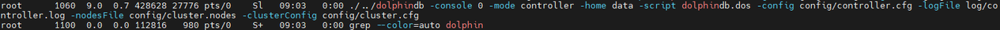

- **启动代理节点**

在服务器 **P1, P2 和 P3** 的 */DolphinDB/server/clusterDemo* 目录执行以下 Shell 指令启动代理节点：

```
sh startagent.sh
```

> 注意：本教程示例集群在每台服务器部署了代理节点，所以需要在三台服务器上分别启动代理节点。

可以执行以下 Shell 指令，查看节点是否成功启动：

```
ps aux|grep dolphindb
```

返回如下信息说明代理节点启动成功：


- 启动数据节点和计算节点

可以在 Web 管理界面启动或关闭数据节点和计算节点，以及修改集群的配置。在浏览器中输入任一控制节点的 IP 地址和端口号即可进入 Web 管理界面，例如，**P2** 上控制节点的 IP 为 10.0.0.81，端口号为 8800，所以访问地址为 10.0.0.81:8800，访问后可能出现如下提示，表明当前控制节点不是 leader 节点，点击确定即可自动跳转到 leader 节点：

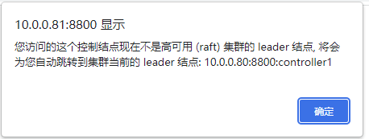

打开后的 Web 管理界面如下。以管理员身份（默认账号：admin，默认密码：123456）登录 Web 管理界面后，用户可以通过勾选想要启动的数据节点和计算节点，再点击启动（关闭）按键即可启动（关闭）相应的数据节点和计算节点：

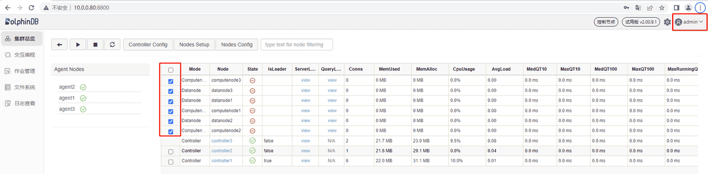

刷新页面后可看到对应的数据节点和计算节点已启动，如下图所示：

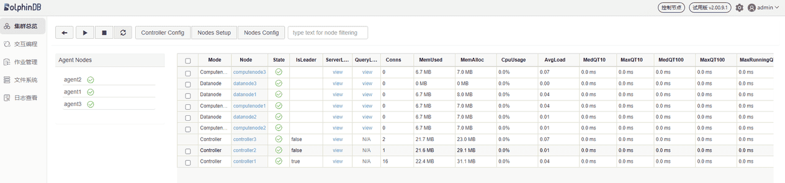

### 第五步：连接数据节点创建数据库和分区表

数据节点既可以存储数据，也可以用于数据的查询和计算。接下来通过一个例子介绍如何在 DolphinDB 集群数据节点创建数据库并写入数据。首先，打开控制节点的 Web 管理界面，点击对应的数据节点打开其 Web 交互编程界面，如下图所示（以 datanode1 为例）：

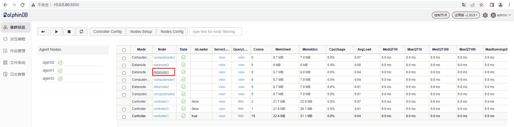

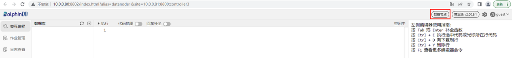

也可以在浏览器直接输入数据节点的 IP 地址和端口号进入数据节点的 Web 交互编程界面。

在数据节点的 Web 交互编程界面执行以下语句创建数据库和分区表：

```
// 创建存储的数据库和分区表
login("admin", "123456")
dbName = "dfs://testDB"
tbName = "testTB"
if(existsDatabase(dbName)){
        dropDatabase(dbName)
}
db = database(dbName, VALUE, 2021.01.01..2021.12.31)
colNames = `SecurityID`DateTime`PreClosePx`OpenPx`HighPx`LowPx`LastPx`Volume`Amount
colTypes = [SYMBOL, DATETIME, DOUBLE, DOUBLE, DOUBLE, DOUBLE, DOUBLE, INT, DOUBLE]
schemaTable = table(1:0, colNames, colTypes)
db.createPartitionedTable(table=schemaTable, tableName=tbName, partitionColumns=`DateTime)
```

然后，执行以下语句模拟生成 5000 个股票 1 天的 1 分钟 K 线数据并写入上面创建的分区表：

```
// 模拟数据并写入分区表
n = 1210000
randPrice = round(10+rand(1.0, 100), 2)
randVolume = 100+rand(100, 100)
SecurityID = lpad(string(take(0..4999, 5000)), 6, `0)
DateTime = (2023.01.08T09:30:00 + take(0..120, 121)*60).join(2023.01.08T13:00:00 + take(0..120, 121)*60)
PreClosePx = rand(randPrice, n)
OpenPx = rand(randPrice, n)
HighPx = rand(randPrice, n)
LowPx = rand(randPrice, n)
LastPx = rand(randPrice, n)
Volume = int(rand(randVolume, n))
Amount = round(LastPx*Volume, 2)
tmp = cj(table(SecurityID), table(DateTime))
t = tmp.join!(table(PreClosePx, OpenPx, HighPx, LowPx, LastPx, Volume, Amount))
dbName = "dfs://testDB"
tbName = "testTB"
loadTable(dbName, tbName).append!(t)
```

以上函数语句的用法说明请参考[用户手册](https://docs.dolphindb.cn/zh/funcs/funcs_intro.html)，也可以在交互编程界面选中函数语句跳转至弹出的网页查看函数说明。

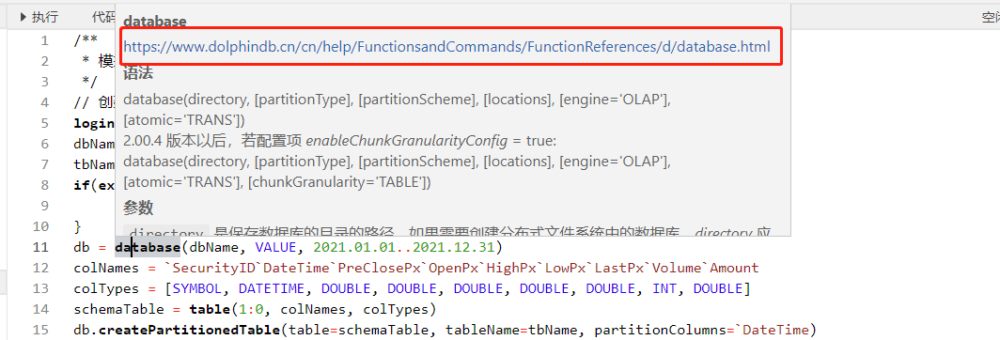

语句执行成功后可在**交互编程**界面的左边，**数据库**一栏查看已创建的库表及字段信息。


 也可在**本地变量**一栏查看已创建的变量和表，展示了变量名、变量类型、变量维度大小、占用内存大小等信息，并且可以直接点击变量名进行变量预览。


上述语句执行成功后，可回到控制节点的**文件系统**查看已创建的库表。

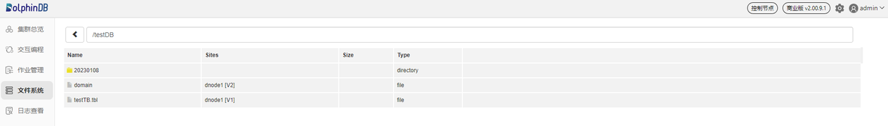

### 第六步：连接计算节点查询和计算

计算节点主要用于数据的查询和计算。接下来通过一个例子介绍如何在计算节点对数据库内的分区表执行查询和计算。首先，打开控制节点的 Web 管理界面，点击对应的计算节点打开其 Web 交互编程界面，如下图所示（以 computenode1 为例）：

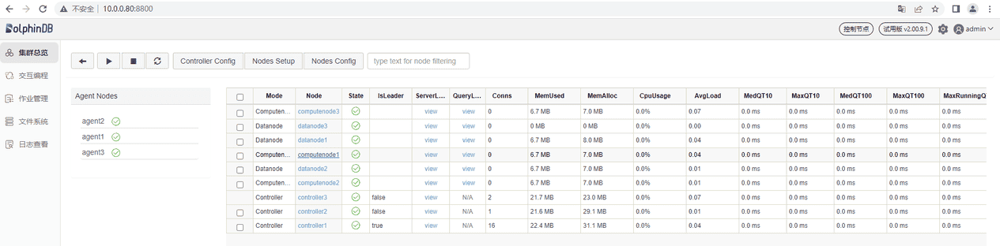

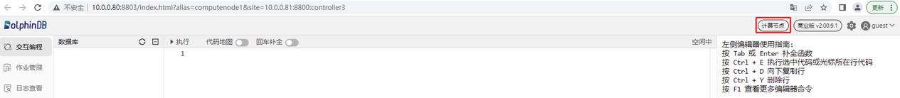

也可以在浏览器直接输入计算节点的 IP 地址和端口号进入计算节点的 Web 交互编程界面。

在计算节点的 Web 交互编程界面执行以下语句加载分区表对象，此时只加载了分区表的元数据，并未加载分区表全量数据，所以响应速度非常快：

```
// 加载分区表对象
pt = loadTable("dfs://testDB", "testTB")
```

然后，执行以下语句查询股票表中每天包含的数据条数：

```
// SQL 返回数据量少的时候，可以直接取回客户端展示
select count(*) from pt group by date(DateTime) as Date
```

语句执行成功后，查询结果会在 Web 界面下方展示：

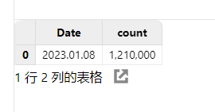

执行以下语句计算每支股票每天的 OHLC 值：

```
// SQL 返回数据量较大时，可以赋值给变量，占用 server 端内存，客户端分页取回展示
result = select first(LastPx) as Open, max(LastPx) as High, min(LastPx) as Low, last(LastPx) as Close from pt group by date(DateTime) as Date, SecurityID
```

在这里，将计算结果赋值给了 `result` 变量，这样就不会直接在客户端界面直接展示，减少客户端内存占用，用户可以通过点击**本地变量**栏目下的 `result` 变量进行分页展示查看：


## 2. 基于 Web 的集群管理

完成部署后，我们可以通过控制节点的 Web 管理界面更改集群配置。

> 注意：由于高可用集群的所有配置信息由 Raft 组统一管理，高可用集群修改集群配置时，必须通过 Web 界面修改配置参数，重启后生效。Web 端会自动同步到集群中的所有配置文件。

### 2.1 控制节点参数配置

点击 **Controller Config** 按钮，可进行所在控制节点的参数配置。以下参数是在第一章中 *controller.cfg* 里配置的，用户可以根据实际应用在这里添加、删除、修改配置参数。这些配置信息都可以在这个界面上进行更改，修改的配置会在重启控制节点之后生效。

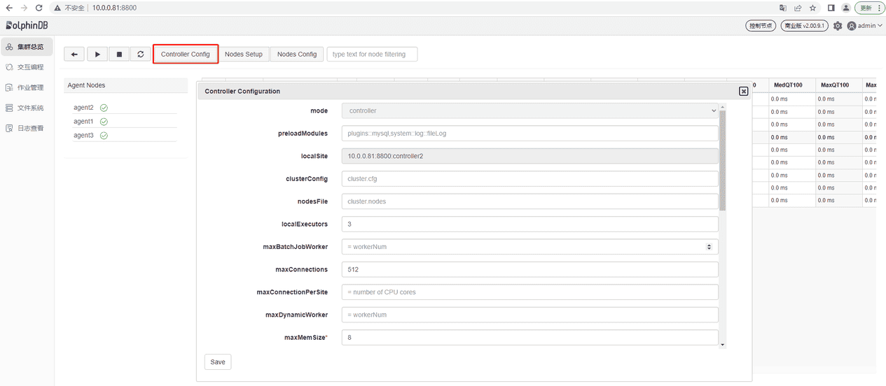

### 2.2 数据节点和计算节点参数配置

点击 **Nodes Config** 按钮，可进行数据节点和计算节点的参数配置。以下参数是在第一章中 *cluster.cfg* 里配置的，用户可以根据实际应用在这里添加、删除、修改配置参数。修改的配置会在重启数据节点和计算节点之后生效。

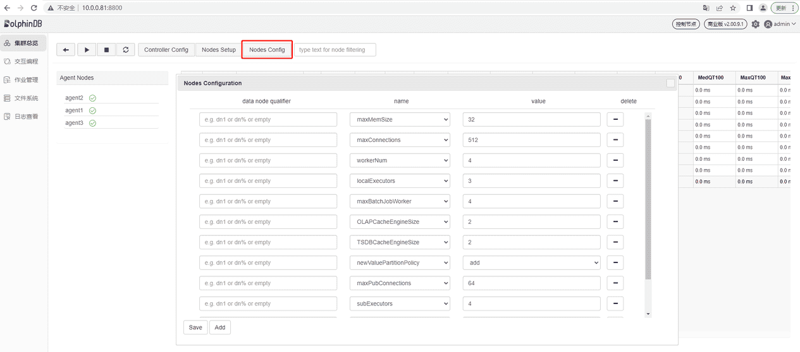

## 3. 集群升级

**第一步：正常关闭集群所有节点**

登录服务器 **P1, P2 和 P3**，进入 */DolphinDB/server/clusterDemo* 目录执行以下 Shell 指令：

```
sh stopAllNode.sh
```

**第二步：备份旧版本的元数据文件**

- 备份控制节点元数据

高可用集群控制节点 Raft 组元数据默认存储在每个控制节点服务器的 */DolphinDB/server/clusterDemo/data/<控制节点别名>/raft* 目录下。以 **P1** 为例，控制节点 Raft 组元数据的默认存储目录：

```
/DolphinDB/server/clusterDemo/data/controller1/raft
```

登录服务器 **P1, P2 和 P3**，可进入 */DolphinDB/server/clusterDemo/data/<控制节点别名>* 目录执行以下 Shell 指令进行备份：

```
mkdir controllerBackup
cp -r raft controllerBackup
```

如果写入数据量超过一定的大小则还会在 */DolphinDB/server/clusterDemo/dfsMeta* 目录下生成 *DFSMasterMetaCheckpoint.0* 文件。可进入
*/DolphinDB/server/clusterDemo/dfsMeta* 目录执行以下 Shell 指令备份到 *controllerBackup* 文件夹：

```
cp -r dfsMeta controllerBackup
```

- 备份数据节点元数据

数据节点的元数据默认存储在控制节点服务器的 */DolphinDB/server/clusterDemo/data/<控制节点别名>/stroage/CHUNK_METADATA* 目录下，以 **P1** 为例，数据节点元数据的默认存储目录：

```
/DolphinDB/server/clusterDemo/data/datanode1/stroage/CHUNK_METADATA
```

登录服务器 **P1, P2 和 P3**，可进入 */DolphinDB/server/clusterDemo/data/<控制节点别名>/storage* 目录执行以下 Shell 指令进行备份：

```
mkdir dataBackup
cp -r CHUNK_METADATA dataBackup
```

> 注意：元数据文件可能通过配置文件指定存储在其它目录，如果在默认路径没有找到上述文件，可以通过查询配置文件中的 *dfsMetaDir* 参数和 *chunkMetaDir* 参数确认元数据文件的存储目录。若配置中未指定 *dfsMetaDir* 参数和 *chunkMetaDir* 参数，但是配置了 *volumes* 参数，*CHUNK_METADATA* 目录在相应的 *volumes* 参数指定的目录下。

**第三步：升级**  
> 注意：
>
> 当 server 升级到某个版本后，使用的插件也应升级到与此对应的版本。

登录服务器 **P1, P2 和 P3**，进入 */DolphinDB/server/clusterDemo* 目录执行以下 Shell 指令：

```
sh upgrade.sh
```

运行后将会出现如下提示：


输入 y 并点击回车后会出现如下提示：


输入 1 选择在线更新，并点击回车后会出现如下提示：


输入所需更新的版本号再点击回车即可，以更新至 2.00.9.1 版本为例，输入 2.00.9.1 后点击回车，出现如下界面则表示升级成功：

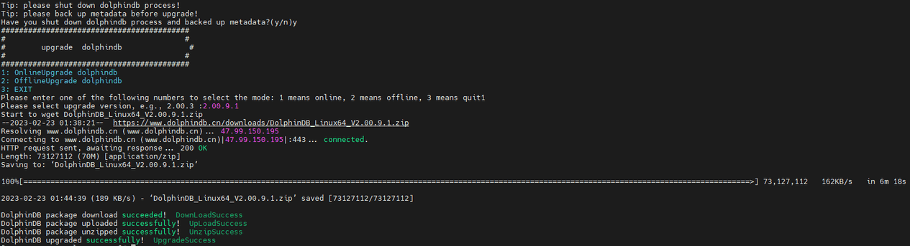

- 离线升级

下载升级所需版本的安装包，官方下载地址：[http://www.dolphindb.cn/downloads.html](https://dolphindb.cn/product#downloads)

将下载好的安装包上传至 **P1,** **P2** 和 **P3** 的 */DolphinDB/server/clusterDemo* 目录下，以更新至 2.00.9.1 版本为例：


登录 **P1,** **P2** 和 **P3**，进入 */DolphinDB/server/clusterDemo* 目录执行以下 Shell 指令：

```
sh upgrade.sh
```

运行后将会出现如下提示：


输入 y 并点击回车后会出现如下提示：


输入 2 选择离线更新，并点击回车后会出现如下提示：


输入所需更新的版本号再点击回车即可，以更新至 2.00.9.1 版本为例，输入 2.00.9.1 后点击回车，出现如下界面则表示升级成功：


**第四步：重新启动集群**

- 启动控制节点

在服务器 **P1, P2 和 P3** 的 */DolphinDB/server/clusterDemo* 目录执行以下 Shell 指令启动控制节点：

```
sh startController.sh
```

- 启动代理节点

在服务器 **P1, P2 和 P3** 的 */DolphinDB/server/clusterDemo* 目录执行以下 Shell 指令启动代理节点：

```
sh startagent.sh
```

- 启动数据节点和计算节点

可以在 Web 管理界面启动或关闭数据节点和计算节点，以及修改集群的配置。在浏览器中输入任一控制节点的 IP 地址和端口号即可进入 Web 管理界面，例如， **P2** 上控制节点的 IP 为 10.0.0.81，端口号为 8800，所以访问地址为 10.0.0.81:8800，访问后可能出现如下提示，表明当前控制节点不是 leader 节点（详细说明见 5.1），点击确定即可自动跳转到 leader 节点：


打开后的 Web 管理界面如下。以管理员身份（默认账号：admin，默认密码：123456）登录 Web 管理界面后，用户可以通过勾选想要启动的数据节点和计算节点，再点击启动（关闭）按键即可启动（关闭）相应的数据节点和计算节点：

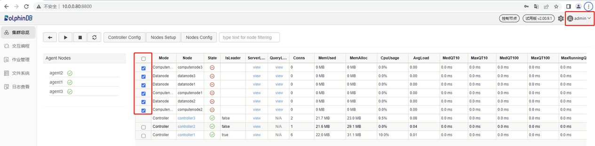

刷新页面后可看到对应的数据节点和计算节点已启动，如下图所示：

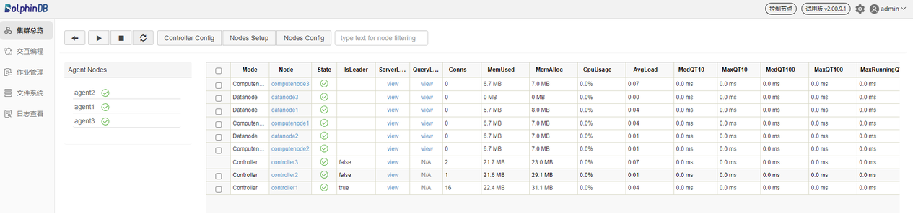

成功启动后，打开 Web 管理界面，在交互编程界面执行以下代码，查看 DolphinDB 当前版本：

```
version()
```

## 4. 授权许可文件过期更新

在更新授权许可文件前，可以打开 Web 管理界面，在任一节点交互编程界面执行以下代码查看当前授权许可文件的到期时间：

```
use ops
getAllLicenses()
```

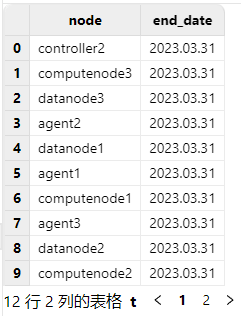

在更新授权许可文件后，可通过对比更新前后授权许可文件的到期时间确认是否更新成功

**第一步：替换授权许可文件**

登录服务器 **P1, P2 和 P3** ，用新的授权许可文件 *dolphindb.lic* 替换老的授权许可文件。

Linux 环境授权许可文件位置：

```
/DolphinDB/server/dolphindb.lic
```

**第二步：更新授权许可文件**

- 在线更新

打开 Web 管理界面，在任一节点交互编程界面执行以下代码完成更新，代码成功运行会返回新授权许可证的到期时间：

```
use ops
updateAllLicenses()
```

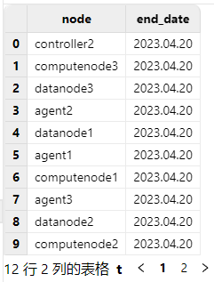

> 注意，在线更新有如下要求：
>
> （1）License 授权的客户名称必须与原来的 License 相同。
>
> （2）授权的节点个数，内存大小，CPU 核个数不能比原来的小。
>
> （3）该函数只在执行该函数的节点生效。因此在集群环境下，需要在所有控制节点，代理节点、计算节点和数据节点上运行该函数。
>
> （4）License 的类型必须是 commercial（付费）类型和 free 类型，如果是 trial（试用）类型不支持在线更新。

- 离线更新

关闭每台服务器上的 DolphinDB 节点，然后重新启动，即可完成更新。

## 5. 高可用集群的高可用功能

DolphinDB 高可用集群提供元数据高可用、数据高可用和客户端高可用的功能，可以容忍单机故障，在任一节点发生故障时，数据库依然可以正常运作，保证业务不会中断。

元数据存储在控制节点（conroller）上。为了保证元数据的高可用，DolphinDB 采用 Raft 协议，通过部署多个控制节点来组成一个 Raft 组，只要宕机的控制节点少于半数，集群仍然可提供服务。

DolphinDB 采用多副本机制，相同数据块的多个副本存储在不同的数据节点（datanode）上。即使集群中某个或多个数据节点宕机，只要集群中还有至少 1 个副本可用，那么数据库就可以提供服务。多副本的数据一致性通过二阶段提交协议来实现。

DolphinDB API 提供了自动重连和切换机制，如果当前连接的数据节点宕机，API 会尝试重连，若重连失败就会自动切换连接到其他数据节点或计算节点执行任务。节点切换对用户是透明的，用户不会感知到当前连接的节点已经切换。

DolphinDB 的高可用架构图如下：

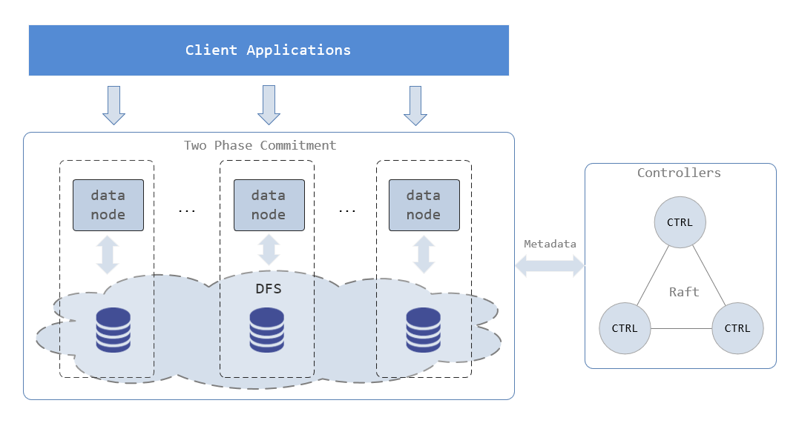

### 5.1 元数据高可用

数据存储时会产生元数据，例如每个数据块存储在哪些数据节点上的哪个位置等信息。如果元数据不能使用，即使数据块完整，系统也无法正常访问数据。元数据存放在控制节点。高可用集群中会部署多个控制节点，通过元数据冗余来保证元数据服务不中断。高可用集群中的所有控制节点组成一个 Raft 组，Raft 组中只有一个 Leader，其他都是 Follower，Leader 和 Follower 上的元数据保持强一致性。数据节点和计算节点只能和 Leader 进行交互。如果当前 Leader 不可用，系统会立即选举出新的 Leader 来提供元数据服务。Raft 组能够容忍小于半数的控制节点宕机，例如包含三个控制节点的集群，可以容忍一个控制节点出现故障；包含五个控制节点的集群，可以容忍两个控制节点出现故障。要设置元数据高可用，控制节点的数量至少为 3 个，同时需要设置数据高可用，即副本数必须大于 1。对应配置文件为 *controller.cfg*，对应配置参数如下：

```
dfsHAMode=Raft
dfsReplicationFactor=2
dfsReplicaReliabilityLevel=1
```

### 5.2 数据高可用

为了保证数据的安全和高可用，DolphinDB 支持在不同的服务器上存储多个数据副本，并且采用二阶段提交协议实现数据副本之间以及数据和元数据之间的强一致性。即使一台机器上的数据损坏，也可以通过访问其他机器上的副本数据来保证数据服务不中断。DolphinDB 之所以采用二阶段提交协议实现副本之间的一致性，主要基于三个因素的考量：（1）DolphinDB 集群是为海量数据设计的，单个集群可以支持千万级以上分区数，使用 Raft 和 Paxos 等算法创建千万级的协议组，成本太高；（2）使用 Raft 和 Paxos 等算法，查询数据时只有一个副本可用，对于 OLAP 应用场景来说过于浪费资源；（3）写入的数据如果跨分区，即使采用了 Raft 和 Paxos 等算法，仍然需要二阶段提交协议保证事务的 ACID。

副本的个数可以在配置文件 *controller.cfg* 中的 *dfsReplicationFactor* 参数来设定。高可用集群建议设置副本数为 2：

```
dfsReplicationFactor=2
```

默认情况下，DolphinDB 允许相同数据块的副本分布在同一台机器上。为了保证数据高可用，需要把相同数据块的副本分布在不同的机器上。建议在配置文件 *controller.cfg* 添加以下配置项：

```
dfsReplicaReliabilityLevel=1
```

下面通过一个例子直观地解释 DolphinDB 的数据高可用。本教程搭建的集群已经配置了上述两个参数，登录控制节点的 Web 界面的**文件系统**一栏查看已经第一章创建的 **testDB** 库：

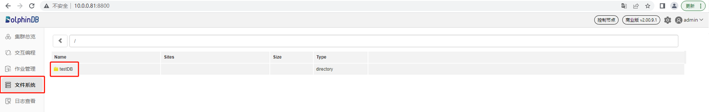

再点击 **20230108** 分区文件：

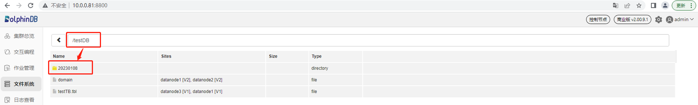

进入分区文件后可以看到数据存储在 `datanode1` 和 `datanode3` 上。即使 `datanode1` 宕机，只要 `datanode3` 正常，用户仍然可对该分区的数据进行读写操作。


### 5.3 客户端高可用

使用 API 与 DolphinDB server 的数据节点和计算节点进行交互时，如果连接的节点宕机，API 会尝试重连，若重连失败会自动切换到其他可用的数据节点或计算节点。这个过程对用户是透明的。目前 Java, C#, C++ 和 Python API 支持高可用。

API 的 connect 方法如下：

```
connect(host,port,username,password,startup,highAvailability)
```

使用 connect 方法连接数据节点时，只需要指定 *highAvailability* 参数为 *true*。

以下例子设置 Java API 高可用：

```
import com.xxdb;
DBConnection conn = new DBConnection();
String[] sites = {"10.0.0.80:8902","10.0.0.81:8902","10.0.0.82:8902"};
boolean success = conn.connect("10.0.0.80", 8902,"admin","123456","",true, sites);
```

如果数据节点 10.0.0.80:8902 发生故障后不可用，API 会自动连接到 *sites* 中配置的其他可用的数据节点或计算节点。详细说明及其他 API 用法请参考[用户手册](https://docs.dolphindb.cn/zh/api/connapi_intro.html)。

## 6. 常见问题解答（FAQ）

### 6.1 节点启动失败的可能原因

- **端口号被占用**

如果遇到无法启动 DolphinDB 节点的情况，建议打开 */DolphinDB/server/clusterDemo/log* 目录下相应节点的日志文件，若出现如下错误：

```
<ERROR> :Failed to bind the socket on port 8800 with error code 98
```

说明该节点选用的端口被其他程序占用，导致 DolphinDB 无法正常启动，修改配置文件中对应节点的端口为其它空闲端口后即可正常启动。

- **集群成员配置文件** ***cluster.nodes*** **第一行为空行**

如果遇到无法启动 DolphinDB 节点的情况，建议打开 */DolphinDB/server/clusterDemo/log* 目录下相应节点的日志文件，若出现如下错误：

```
<ERROR> :Failed to load the nodes file [/home/DolphinDB/server/clusterDemo/config/cluster.nodes] with error: The input file is empty.
```

说明服务器 **P1,** **P2** 和 **P3** 的配置文件 *cluster.nodes* 的第一行为空行，这种情况下只需将文件中的空行删除，再重新启动节点即可。

### 6.2 如何通过 systemd 命令启动 DolphinDB 集群？

首先在每台服务器的 *DolphinDB/server/clusterDemo* 目录中创建脚本文件 *controller.sh* 以及 *agent.sh*，其 Shell 创建命令及写入内容如下：

```
vim ./controller.sh
```

```
#!/bin/bash
#controller.sh
workDir=$PWD

start(){
    cd ${workDir} && export LD_LIBRARY_PATH=$(dirname "$workDir"):$LD_LIBRARY_PATH
    nohup ./../dolphindb -console 0 -mode controller -home data -script dolphindb.dos -config config/controller.cfg -logFile log/controller.log -nodesFile config/cluster.nodes -clusterConfig config/cluster.cfg > controller.nohup 2>&1 &
}

stop(){
    ps -o ruser=userForLongName -e -o pid,ppid,c,time,cmd |grep dolphindb|grep -v grep|grep $USER|grep controller| awk '{print $2}'| xargs kill -TERM
}

case $1 in
    start)
        start
        ;;
    stop)
        stop
        ;;
    restart)
        stop
        start
        ;;
esac
```

```
vim ./agent.sh
```

```
#!/bin/bash
#agent.sh


workDir=$PWD

start(){
    cd ${workDir} && export LD_LIBRARY_PATH=$(dirname "$workDir"):$LD_LIBRARY_PATH
    nohup ./../dolphindb -console 0 -mode agent -home data -script dolphindb.dos -config config/agent.cfg -logFile log/agent.log  > agent.nohup 2>&1 &
}

stop(){
    ps -o ruser=userForLongName -e -o pid,ppid,c,time,cmd |grep dolphindb|grep -v grep|grep $USER|grep agent| awk '{print $2}'| xargs kill -TERM
}

case $1 in
    start)
        start
        ;;
    stop)
        stop
        ;;
    restart)
        stop
        start
        ;;
esac
```

然后，执行以下 Shell 命令配置 controller 的守护进程：

```
vim /usr/lib/systemd/system/ddbcontroller.service
```

配置如下内容：

```
[Unit]
Description=ddbcontroller
Documentation=https://www.dolphindb.com/

[Service]
Type=forking
WorkingDirectory=/home/DolphinDB/server/clusterDemo
ExecStart=/bin/sh controller.sh start
ExecStop=/bin/sh controller.sh stop
ExecReload=/bin/sh controller.sh restart
Restart=always
RestartSec=10s
LimitNOFILE=infinity
LimitNPROC=infinity
LimitCORE=infinity

[Install]
WantedBy=multi-user.target
```

> 注意：
>
> 配置中 *WorkingDirectory* 需要修改为 */DolphinDB/server/clusterDemo*

执行以下 Shell 命令配置 agent 的守护进程：

```
vim /usr/lib/systemd/system/ddbagent.service
```

配置如下内容：

```
[Unit]
Description=ddbagent
Documentation=https://www.dolphindb.com/

[Service]
Type=forking
WorkingDirectory=/home/DolphinDB/server/clusterDemo
ExecStart=/bin/sh agent.sh start
ExecStop=/bin/sh agent.sh stop
ExecReload=/bin/sh agent.sh restart
Restart=always
RestartSec=10s
LimitNOFILE=infinity
LimitNPROC=infinity
LimitCORE=infinity

[Install]
WantedBy=multi-user.target
```

> 注意：
>
> 配置中 *WorkingDirectory* 需要修改为 */DolphinDB/server/clusterDemo*

最后，执行以下 Shell 命令启动 controller：

```
systemctl enable ddbcontroller.service   #配置自启
systemctl start ddbcontroller.service  #启动
systemctl stop  ddbcontroller.service   #停止服务
systemctl status  ddbcontroller.service  #检测状态
```

执行以下 Shell 命令启动 agent：

```
systemctl enable ddbagent.service   #配置自启
systemctl start ddbagent.service  #启动
systemctl stop  ddbagent.service   #停止服务
systemctl status  ddbagent.service  #检测状态
```

### 6.3 Web 管理界面无法访问怎么办？

DolphinDB 正常启动后，在浏览器输入控制节点正确的访问地址，但 Web 管理界面无法正常打开，如下图所示：


出现上述问题的原因通常是由于浏览器与 DolphinDB 不是部署在同一台服务器，且部署 DolphinDB 的服务器开启了防火墙。可以通过关闭部署了 DolphinDB 的服务器的防火墙或者打开对应的部署端口，解决这个问题。

### 6.4 Linux 升级失败如何版本回退？

如果升级以后，不能正常开启 DolphinDB 集群，可按以下方式回退到旧版本。

> 注意：版本回退必须满足升级以后未写入过新的数据。

**第一步：恢复旧版本元数据文件**

- 恢复控制节点元数据

登录控制节点的服务器（以 **P1** 为例），在 */DolphinDB/server/clusterDemo/data/controller1* 目录执行以下 Shell 指令恢复已备份的控制节点元数据：

```
cp -r backup/raft ./
```
并在 */DolphinDB/server/clusterDemo/dfsMeta* 目录执行以下 Shell 指令恢复已备份的控制节点元数据：
```
cp -r backup/dfsMeta ./
```

- 恢复数据节点元数据

登录数据节点的服务器（以 **P1** 为例），在 */DolphinDB/server/clusterDemo/data/datanode1/storage* 目录执行以下 Shell 指令恢复已备份的数据节点元数据：

```
cp -r dataBackup/CHUNK_METADATA ./
```

**第二步：恢复旧版本程序文件**

在官方下载旧版本程序包，把重新下载的旧版本 *server* 目录下除 *dolphindb.cfg*,  *clusterDemo* 以及 *dolphindb.lic* 外的所有文件覆盖替换升级失败的文件。

### 6.5 为什么在线更新授权许可文件失败？

在线更新授权文件需要满足[更新授权许可文件](#4-授权许可文件过期更新)中在线更新的要求。如果不满足其中的要求，可以通过离线方式进行更新，或[申请企业版 License](https://dolphindb.cn/product#downloads)。

### 6.6 为什么云部署节点无法启动？

DolphinDB 集群既可以部署在局域网内，也可以部署在私有云或公有云上。DolphinDB 默认集群的所有节点在一个局域网内（*lanCluster*=1）并通过 UDP 广播来监测节点心跳。但是在云平台上，所有节点不一定位于一个局域网，也有可能不支持 UDP。所以，在云平台上，需要在 *controller.cfg* 和 *agent.cfg* 填入 lanCluster=0 来实现非 UDP 模式的节点之间的通讯。否则，由于可能无法正常检测到节点的心跳，集群可能无法正常工作。

### 6.7 如何进行配置参数调优？

可以参考 DolphinDB 官方参数配置说明进行配置参数调优：[参数配置](https://docs.dolphindb.cn/zh/db_distr_comp/cfg/para_cfg.html)

如果遇到性能问题，请添加微信号 13306510479（仅用于添加微信）或扫描下面二维码，客服会邀您进群，由 DolphinDB 的技术支持工程师会解答您的问题。


### 6.8 如何设置数据卷？

数据卷是位于数据节点上的文件夹，用来保存分布式文件系统的数据。一个数据节点可以有多个数据卷。要确保最优性能，每个数据卷应当对应不同的物理设备。如果多个数据卷对应同一个物理设备，会影响性能。

可在 *cluster.cfg* 中设置数据卷的路径。如果用户不设置数据卷的路径，系统会默认按数据节点别名来设置数据卷的路径。若节点别名为 P1-datanode，系统会自动在该节点的 */DophinDB/server/clusterDemo/data* 目录下创建一个名为 *P1-datanode* 的子目录来存储数据。注意：数据卷只支持绝对路径，不支持相对路径。

> 注意：在 linux 环境部署时， *volumes* 配置目录建议不要指定用 NAS 挂载服务器路径的远程磁盘，如果这样配置，数据库性能会因为磁盘 IO 瓶颈变差。如果非要这样配置，如果您的分区挂载用的是 NFS 协议，则该 datanode（数据节点）进程必须以 root 身份启动。因为普通用户启动的数据库进程无权限在 NAS 读写磁盘，如果用 sudo 用户启动，会造成文件夹权限混乱。

三种设置数据卷路径的方法：

- **对每个数据节点分别指定数据卷路径**

```
P1-datanode.volumes=/DFS/P1-datanode
P2-datanode.volumes=/DFS/P2-datanode
```

- **通过 % 和 ? 通配符**

`?`代表单个字符；`%`表示 0，1 或多个字符。

将所有以 "-datanode" 为结尾的节点的数据存放到 */VOL1*：

```
%-datanode.volumes=/VOL1
```

等同于：

```
P1-datanode.volumes=/VOL1
P2-datanode.volumes=/VOL1 
```

- **通过 ALIAS 通配符**

若所有数据节点的数据卷路径都含有节点别名，可使用 来配置数据卷路径。可用以下代码为每台服务器配置两个物理卷 */VOL1* 和 */VOL2*：

```
volumes=/VOL1/<ALIAS>,/VOL2/<ALIAS>
```

等同于：

```
P1-datanode.volumes=/VOL1/P1-datanode,/VOL2/P1-datanode
P2-datanode.volumes=/VOL1/P2-datanode,/VOL2/P2-datanode
```

## 7. 参考

更多详细信息，请参阅 DolphinDB 用户手册：

更多详细信息，请参阅 DolphinDB 用户手册：

- [中文版 DolphinDB 用户手册](https://docs.dolphindb.cn/zh/index.html)
- [英文版 DolphinDB 用户手册](https://docs.dolphindb.com/en/index.html)

## 附录

- **示例集群的配置文件**: [ha_cluster_deployment](script/ha_cluster_deployment)
