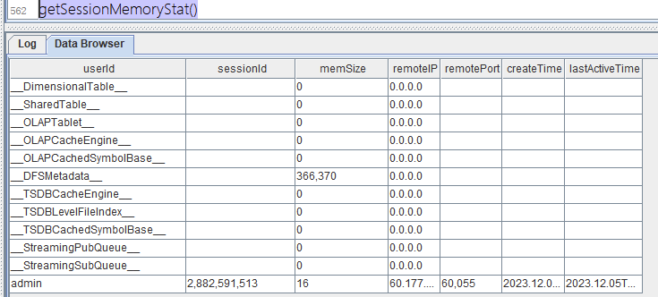
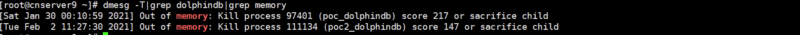
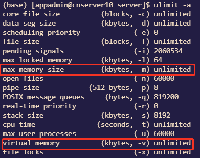
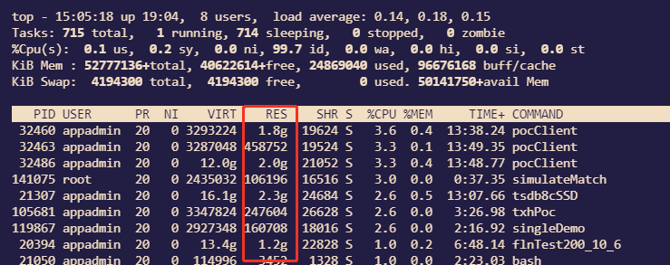

# OOM 应对指南
Out of Memory，简称 OOM，代表内存耗尽的一种异常状态。OOM 的表现形式千差万别，可能是服务异常终止，亦或是系统性能急剧下降。这一现象背后的根本问题在于内存的不足。造成 OOM 的原因有很多，其中包括数据量庞大、频繁的数据写入和查询操作，以及可能存在的内存泄漏问题。了解这些原因，能够帮助我们更好地规划、优化和维护系统，从而提高其稳定性和性能。

本文将针对在使用 DolphinDB 时遇到 OOM 这一问题，对造成 OOM 的原因进行定位分析和归纳总结，并给出相应解决方案以及规避建议。

- [1. 常见 DolphinDB OOM 报错](#1-常见-dolphindb-oom-报错)
- [2. 常见 DolphinDB OOM 原因](#2-常见-dolphindb-oom-原因)
- [3. 故障常规排查方法](#3-故障常规排查方法)
  - [3.1 内部组件排查方案](#31-内部组件排查方案)
  - [3.2 外部组件排查方案](#32-外部组件排查方案)
  - [3.3 外部配置排查方案](#33-外部配置排查方案)
- [4. 规避建议](#4-规避建议)
  - [4.1 优化服务器以及数据库配置](#41-优化服务器以及数据库配置)
  - [4.2 合理分区和正确使用 SQL](#42-合理分区和正确使用-sql)
  - [4.3 合理配置流数据缓存区](#43-合理配置流数据缓存区)
  - [4.4 及时管理 session 的变量](#44-及时管理-session-的变量)
  - [4.5 分批次写入数据](#45-分批次写入数据)
- [5. 总结](#5-总结)

## 1. 常见 DolphinDB OOM 报错

DolphinDB 的内存分配机制基于 TCMalloc 实现，TCMalloc 是一个由 Google 开发的用户空间内存分配器，用于替代标准的 C 库中的 malloc 和 free 函数。TCMalloc 的设计目标是提高多线程环境下的内存分配性能，并降低内存碎片。

TCMalloc 在 DolphinDB 中主要负责管理动态内存，而静态内存的释放则由用户手动管理。这种方式可能导致多样化的内存需求，从而增加了内存消耗和内存压力。在某些情况下，这可能最终导致内存不足（OOM）的问题。

DolphinDB 内存不足的常见错误，错误示例包括：

- Java heap space
- OOM Killer
- ChunkCacheEngine is out of memory, possibly due to a transaction that tries to write data larger than the available memory
- C++:std::bad_alloc
- Failed to merge results of partitioned calls: Failed to append data to column 'ETFSellNumber' with error: Out of memory' script: 'select * from pt where date(DateTime) = 2021.12.29;
- Out of memory, BlockFileOutputStream failed to alloc memory and will retry.
- \[xx plugin],Out of memory
- ……

## 2. 常见 DolphinDB OOM 原因

导致 DolphinDB OOM 的主要原因可分为以下三类：

- DolphinDB 内部组件：数据量、查询复杂度、并发用户数等因素影响着 DolphinDB 的工作负荷。因此，当用户使用 DolphinDB 处理大规模数据或者执行复杂查询时，内存需求会相应增加，当超出可分配内存后会造成 OOM。
- 外部组件：外部组件如应用程序 (插件) 内存管理策略以及 GUI、vscode 和 API 使用不当也会导致 DolphinDB OOM 的发生。具体来说，内存未及时释放、内存泄漏、内存分配不合理等问题都可能导致内存资源的浪费和不足，进而造成后续执行时发生 OOM
- 外部限制：操作系统的配置以及物理内存的可用性是影响 OOM 的关键因素之一。如果操作系统未正确配置，或者物理内存不足，DolphinDB 在执行大规模任务时可能面临内存不足的问题。

## 3. 故障常规排查方法

如果内存不足错误只是偶尔出现，或者在短时间内出现，这代表着系统正常运行中的短时异常，无需特别处理这种短暂的内存问题。然而，如果错误在多个连接上多次发生，并且持续数秒或更长时间，就需要采取一些诊断和解决方案来解决内存问题。

**诊断内存使用模式：**

使用监控工具来诊断 DolphinDB 内存使用模式。查看内存使用的波动情况，分析内存占用的高峰时刻。这有助于确定是什么导致了内存不足的问题。

**检查 DolphinDB 中组件运行任务：**

来自 DolphinDB 内部组件的内存压力也可能导致内存不足错误。比如数据查询计算功能、流计算引擎、写入任务、后台计算任务组件消耗内存，需要通过内存管理函数跟踪，了解这些组件在 DolphinDB 中如何分配内存。想要解决内存不足问题，必须确定哪些组件消耗的内存最大。例如，如果发现某个 session 的内存管理显示较大的内存分配，则需要了解当前 session 消耗这么多内存的原因。用户可能会发现某些查询没有走分区扫描，可以通过优化 SQL 语句来优化查询或者建立合适的 sortKey，减少内存的消耗。所以需要检查 DolphinDB 中正在执行的查询和任务，以确定是否有复杂或者资源密集型的操作。

**检查通过外部加载到 DolphinDB 中的插件内存使用情况**：

内存压力可能由于 DolphinDB 内部引擎导致，也可能由于 DolphinDB 进程中运行的某些插件导致，如 kafka、mysql、odbc 以及 hdfs 插件或者自定义插件等等。插件若设计不佳，容易消耗大量内存。例如，假设任意插件将来自外部源的 20 亿行数据缓存到 DolphinDB 内存中，DolphinDB 进程中消耗的内存会很高，从而导致内存不足错误。

插件的内存使用目前仅仅记录在日志中，你可以分析 DolphinDB 的日志，来查看是否有异常情况或者报错信息。

**更新或优化配置：**

有三大类外部限制导致 DolphinDB 内存不足：

- DolphinDB 许可证限制
- DolphinDB 配置文件限制
- OS 内存压力

OS 内存压力是指在同一操作系统中，一个或多个应用程序共同耗尽了可用的物理内存。为了响应新的应用程序对资源的请求，OS 会尝试释放一些内存。然而，当其他应用程序消耗完 OS 的内存，DolphinDB 可用内存将不足，由此产生 OOM 的报错。

针对此种情况，你可以考虑更新 DolphinDB 的版本，或者调整配置参数以优化系统性能。

### 3.1 内部组件排查方案

若要诊断来自 DolphinDB 引擎内部组件的内存压力，请使用以下方法：

- 使用函数查看内存使用情况：`getSessionMemoryStat()`，获取当前节点所有连接会话的内存占用状态，返回一张表包含以下字段：
  - userId：用户 ID 或缓存类型的标识符（形如：__xxx__）。
  - sessionId：会话 ID。
  - memSize：会话所占用的内存，单位为字节。
  - remoteIP：发起会话的客户端的 IP。
  - remotePort：发起会话的客户端的端口号。
  - createTime：会话创建的时间，为 TIMESTAMP 类型。
  - lastActiveTime：会话最近一次执行脚本的时间戳。
  
  
    
    
    缓存类型对应解释见下表：
    
    **注意**：2.00.11 和 1.30.23 版本启用了维度表自动回收机制。
    
    通过参数 warningMemSize 设置的定期内存检测机制，当内存使用超过该阈值时，会尝试释放部分维度表内存。
    
    | 缓存类型                 | 含义                                                | 影响大小因素                                                 | 释放函数                     |
    | ------------------------ | --------------------------------------------------- | ------------------------------------------------------------ | ---------------------------- |
    | __DimensionalTable__     | 维度表缓存，单位为 Bytes。                          | 维度表大小以及数据量                                         | clearCachedDatabase          |
    | __SharedTable__          | 共享表缓存，单位为 Bytes。                          | 共享表大小以及数据量                                         | undef("sharedTable", SHARED) |
    | __OLAPTablet__           | OLAP 引擎数据库表的缓存，单位为 Bytes。             | OLAP 数据缓存大小，一般都是 MB 级别                            | clearAllCache()              |
    | __OLAPCacheEngine__      | OLAP 引擎 cache engine 的内存占用，单位为 Bytes。   | OLAP CacheEngine 参数有关                                    | flushOLAPCache()             |
    | __OLAPCachedSymbolBase__ | OLAP 引擎 SYMBOL 类型字典编码的缓存，单位为 Bytes。 | OLAP,Symbol 数据类型大小，一般为 MB 级别                     | 无需释放                     |
    | __DFSMetadata__          | 分布式存储的元数据缓存，单位为 Bytes。              | 分布式库数量以及大小，一般为 MB 级别                         | 无需释放                     |
    | __TSDBCacheEngine__      | TSDB 引擎 cache engine 的内存占用，单位为 Bytes。   | TSDB CacheEngine 参数有关                                    | flushTSDBCache()             |
    | __TSDBLevelFileIndex__   | TSDB 引擎 level file 索引的缓存，单位为 Bytes。     | TSDB 常驻索引大小 TSDBLevelFileIndexCacheSize 有关，默认为 5% * maxMemSize | invalidateLevelIndexCache()  |
    | __TSDBCachedSymbolBase__ | TSDB 引擎 SYMBOL 类型字典编码的缓存，单位为 Bytes。 | TSDB,Symbol 数据类型大小，一般为 MB 级别                       | 无需释放                     |
    | __StreamingPubQueue__    | 流数据发布队列里未处理的消息数。                    | maxPubQueueDepthPerSite 参数有关                             | 无需释放                     |
    | __StreamingSubQueue__    | 流数据订阅队列里未处理的消息数。                    | 流数据队列内存大小，和引擎数量以及订阅数据有关               | 管理订阅以及引擎             |
    
    定位数据内存占用过大的具体对象，然后使用上表对应函数第四列对应函数进行释放，另外假设为 session 内变量占用内存过高，可以联系团队 DBA 使用函数 [closeSessions](https://docs.dolphindb.cn/zh/funcs/c/closeSessions.html) 关闭相应 session, 操作步骤如下:
    
    ```
    closeSessions(getSessionMemoryStat().sessionId[11]);
    ```

- 通过过函数 getRecentJobs() 和 getConsoleJobs() 查看是否还有超过预期运行时长的后台或交互任务。

    通过 [cancelJob](https://docs.dolphindb.cn/zh/funcs/c/cancelJob.html) 以及 [cancelConsoleJob](https://docs.dolphindb.cn/zh/funcs/c/cancelConsoleJob.html) 关闭对应 job。

### 3.2 外部组件排查方案

若要诊断由 DolphinDB 插件引起的内存压力，请使用以下方法：

- 查看日志，\[xx plugin],Out of memory，如果有日志中内容，可以判断是 DolphinDB 插件引发的 OOM。如果为官方发布的插件，可以通过点击官网下载页面的社群入口，将问题反馈给工程师。如果是自定义开发插件，需要定位下哪个函数导致的内存使用过高，修改插件源代码，重新编译再加载到 DolphinDB 中。
- Java heap space 该异常通常出现在 DolphinDB GUI 客户端，通常情况下，直接原因为 GUI 客户端占用内存过高，而这是由于运行以下语句造成：

```
select * from xx 
```

需要修改 SQL 语句为

```
t = select * from xx
select top 1000 * from xx
```

这样可以降低 GUI 客户端内存占用，从而避免上述问题。

### 3.3 外部配置排查方案

面对 DolphinDB 进程之外的外部限制以及操作系统上的内存不足情况，请使用以下方法：

- Linux 内核有个机制叫 OOM killer(Out Of Memory killer)，该机制会监控那些占用内存过大，尤其是瞬间占用很大内存的进程，为防止内存耗尽而自动把该进程杀掉。查看操作系统日志排查是否触发了 OOM Killer，操作步骤如下：

    输入命令 
    
    ```
    dmesg -T|grep memory
    ```
    
    
    如上图，若出现了“Out of memory: Kill process”，说明 DolphinDB 使用的内存超过了操作系统所剩余的空闲内存，导致操作系统杀死了 DolphinDB 进程。解决这种问题的办法是：通过参数 maxMemSize（单节点模式修改 dolphindb.cfg，集群模式修改 cluster.cfg）设定节点的最大内存使用量。需要合理设置该参数，设置太小会严重限制集群的性能；设置太大可能触发操作系统杀掉进程。若机器内存为 16GB，并且只部署 1 个节点，建议将该参数设置为 12GB(服务器内存的 80%-90% 之间) 左右。

- 收集 DolphinDB 许可证 lic 内存限制信息，操作步骤如下

    ```
    license().maxMemoryPerNode
    //8
    ```
    
    如上所示，结果为 8，则当前 lic 限制最大使用内存为 8 GB (如果 lic 类型为社区版), DolphinDB 使用内存最大上限为 8GB，如果需要申请使用更多内存，请联系 DolphinDB 技术支持工程师。

- 收集 DolphinDB 配置文件内存限制信息，操作步骤如下：

    ```
    getConfig(`maxMemSize)
    //16
    ```
    
    如上所示为系统配置内存上限，结果为 16，则当前 配置文件限制最大使用内存为 16 GB, DolphinDB 使用内存最大上限为 16 GB，如果需要申请使用更多内存，通过参数 maxMemSize（单节点模式修改 dolphindb.cfg，集群模式修改 cluster.cfg）设定节点的最大内存使用量。
    
    **注意**：配置文件最大内存不可超过 DolphinDB 许可证限制的内存以及不能超过服务器内存的 90%
    
    ```
    getMemLimitOfQueryResult()
    //8
    ```
    
    如上所示为查询内存上限配置，结果为 8，则当前 配置文件限制最大单次查询结果占用的内存上限为 8 GB，如果需要增大单次查询的上限，通过函数 [setMemLimitOfQueryResult](https://docs.dolphindb.cn/zh/funcs/s/setMemLimitOfQueryResult.html) 进行修改。

- 收集 Linux 操作系统对 DolphinDB 限制内存信息，操作步骤如下：

    ```
    ulimit -a
    ```
    
    | **参数**        | **描述**                       |
    | --------------- | ------------------------------ |
    | max memory size | 一个任务的常驻物理内存的最大值 |
    | virtual memory  | 限制进程的最大地址空间         |
    
    
    
    如上图所示，操作系统会限制 DolphinDB 进程的资源上限，图上代表为不限制进程最大使用内存，如果需要修改，修改方式见 [ulimit 修改方式](https://blog.csdn.net/yjkhtddx/article/details/109166147)。

- 查看应用程序事件日志中与应用程序相关的内存问题。解决不太重要的应用程序或服务的任何代码或配置问题，以减少其内存使用量，操作步骤如下：

    ```
    top
    ```
    
    
    
    如上图所示，有其他进程占用 操作系统资源，需要将其关闭，以减少其内存使用量。

## 4. 规避建议

在企业生产环境下，DolphinDB 往往作为流数据中心以及历史数据仓库，为业务人员提供数据查询和计算。当用户较多时，不当的使用容易频繁造成 OOM 影响业务使用，甚至宕机。为尽量减少此类问题的发生，现给出以下 5 类规避 DolphinDB OOM 的建议。

### 4.1 优化服务器以及数据库配置

- **打开操作系统对进程的资源限制**：Linux 对于每个进程有限制最大内存机制。为提高性能，可以根据设备资源情况，对 DolphinDB 内存限制合理规划。
- **合理配置 maxMemSize** ：
  - 如果 DolphinDB 许可证限制内存大于等于服务器 80%-90% 的内存，则 maxMemSize 为服务器内存 80%-90% 之间
  - 如果 DolphinDB 许可证限制内存小于服务器 80%-90% 的内存，则 maxMemSize 为 DolphinDB 许可证限制内存大小
- **对自定义插件内存严格管理**
  - 自定义插件为 C++ 语言编写，需要插件开发者正确管理函数使用内存等方式确保防止内存泄漏问题。

### 4.2 合理分区和正确使用 SQL

- **合理均匀分区**：DolphinDB 以分区为单位加载数据，因此，分区大小对内存影响巨大。合理均匀的分区，不管对内存使用还是对性能而言，都有积极的作用。因此，在创建数据库的时候，根据数据规模，合理规划分区大小。每个分区压缩前的数据量在 100 MB 到 1 GB 之间为宜。具体分区设计，请参考：[分区注意事项](https://docs.dolphindb.cn/zh/tutorials/database.html#ariaid-title10)。
- **数据查询尽可能使用分区过滤条件**：DolphinDB 按照分区进行数据检索，如果不加分区过滤条件，则会扫描所有数据，数据量大时，内存很快被耗尽。若存在多个过滤条件，将包含分区列的过滤条件前置。
- **只查询需要的列**：谨慎使用 `select *`，`select *` 会把该分区所有列加载到内存，而实际查询往往只需要几列的数据。因此，为避免内存浪费，尽量明确写出所有查询的列。

### 4.3 合理配置流数据缓存区

- **合理配置流数据的缓存区**：一般情况下流数据的容量 (capacity) 会直接影响发布节点的内存占用。比如，在对流数据表进行持久化时，若 capacity 设置为 1000 万条，那么流数据表在超过 1000 万条时，会将约一半的数据进行存盘并回收，也就是内存中会保留 500 万条左右。因此，应根据发布节点的最大内存，合理设计流表的 capacity。尤其是在多张发布表的情况，更需要谨慎设计。

### 4.4 及时管理 session 的变量

- **及时释放数据量较大的变量**：若用户创建数据量较大的变量，例如 v = 1..10000000，或者将含有大量数据的查询结果赋值给一个变量 t = select * from t where date = 2010.01.01，v 和 t 将会在用户的 session 占用大量的内存。如果不及时释放，执行其他任务时，就有可能因为内存不足而抛出异常。用户的私有变量在其创建的 session 里面保存。session 关闭的时候，会回收这些内存。可通过 undef 函数将其赋值为 NULL，或者关闭 session 来及时释放变量的内存。

### 4.5 分批次写入数据

- **避免大事务写入**：数据写入时，当数据量较大时，批量数据如 10G 左右进行 [append！](https://docs.dolphindb.cn/zh/funcs/a/append!.html?hl=append)或者 [tableInsert](https://docs.dolphindb.cn/zh/funcs/t/tableInsert.html?hl=tableinsert) 会导致大事务的写入内存长时间占用内存，导致内存无法释放。
  - 可以使用 [loadTextEx](https://docs.dolphindb.cn/zh/funcs/l/loadTextEx.html?hl=loadtextex) 接口代替原先 [loadText ](https://docs.dolphindb.cn/zh/funcs/l/loadText.html?hl=loadtext)+ [append！](https://docs.dolphindb.cn/zh/funcs/a/append!.html?hl=append)的方式写入数据
  - API 端提供 tableAppender 接口自动切分大数据分批次写入

    **注意**：此类接口由于将大数据切分为多块小数据写入，没办法保证一批大数据的写入的原子性。

##  5. 总结

分布式数据库 DolphinDB 的设计十分复杂，发生 OOM 的情况各有不同。若发生节点 OOM，请按本文所述一步步排查：

- 首先，排查宕机原因，是否因为内存耗尽使得 DolphinDB 进程被操作系统杀掉。排查 OOM killer 可查看操作系统日志；
- 其次，检查 OOM 是否由于外部限制所导致。如果是因为操作系统限制，可以检查操作系统 ulimit 信息限制 DolphinDB 进程最大内存，如果是 DolphinDB 自身限制，可检查 DolphinDB 许可证文件以及 DolphinDB 配置文件对内存的限制；
- 再次，检查一下是否做到了合理分区、正确使用 SQL、合理配置流数据缓存区、及时管理 session 变量以及合理写入任务；
- 最后，若确定 DolphinDB 系统或者插件有问题，请保存节点日志、操作系统日志以及尽可能复现的脚本，并及时与 DolphinDB 工程师联系。