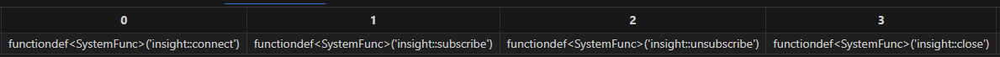
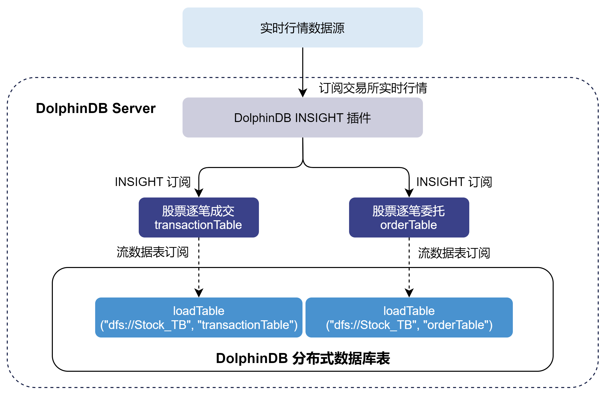
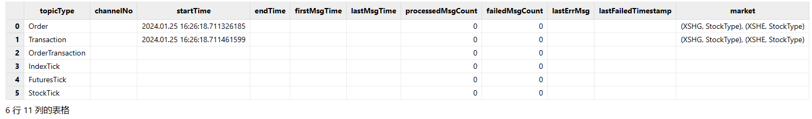
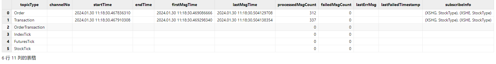
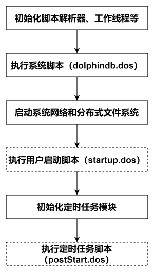

# DolphinDB INSIGHT 行情插件最佳实践指南

[INSIGHT](https://findata-insight.htsc.com:9151/help/) 是华泰证券依托大数据存储、实时分析等领域的技术积累，整合接入国内多家交易所高频行情数据，为投资者提供集行情接入、推送、回测、计算及分析等功能于一体的行情数据服务解决方案。基于 INSIGHT 官方提供的行情数据服务 C++ SDK（TCP 版本），DolphinDB 开发了能够获取市场行情数据的 INSIGHT 插件，帮助用户方便地通过 DolphinDB 脚本语言将实时行情数据接入 DolphinDB 进程中，以便进行后续的计算或存储。

本文主要介绍如何通过 INSIGHT 插件将实时行情数据写入分布式数据库，以及如何实现节点启动时自动订阅 INSIGHT 实时行情。本文全部代码需要运行在 2.00.11 或者更高版本的 DolphinDB server 以及插件上，目前仅支持 Linux 系统。

- [DolphinDB INSIGHT 行情插件最佳实践指南](#dolphindb-insight-行情插件最佳实践指南)
	- [1 DolphinDB INSIGHT 行情插件介绍](#1-dolphindb-insight-行情插件介绍)
	- [2 基本使用介绍](#2-基本使用介绍)
		- [2.1 安装插件](#21-安装插件)
		- [2.2 加载插件](#22-加载插件)
	- [3 通过 INSIGHT 行情插件将实时行情数据写入分布式数据库](#3-通过-insight-行情插件将实时行情数据写入分布式数据库)
		- [3.1 清理环境（可选）](#31-清理环境可选)
		- [3.2 创建库表](#32-创建库表)
		- [3.3 订阅流数据表把增量数据实时写入分布式数据库](#33-订阅流数据表把增量数据实时写入分布式数据库)
		- [3.4 订阅 INSIGHT 行情将增量数据实时写入流数据表](#34-订阅-insight-行情将增量数据实时写入流数据表)
		- [3.5 查询 INSIGHT 行情接收情况](#35-查询-insight-行情接收情况)
	- [4 节点启动时自动订阅 INSIGHT 实时行情数据入库](#4-节点启动时自动订阅-insight-实时行情数据入库)
	- [附录](#附录)


## 1 DolphinDB INSIGHT 行情插件介绍

INSIGHT 插件的接口介绍见 [DolphinDB INSIGHT Plugin 使用说明](https://gitee.com/dolphindb/DolphinDBPlugin/blob/release200.11/insight/README.md)，注意，INSIGHT 插件基于 INSIGHT 官方提供的行情数据服务 C++ SDK（即 TCP 版本 INSIGHT）实现。若您的 INSIGHT 订阅账号对应 C++ UDP SDK，本文提到的 2.00.11 版本插件将无法支持，可以联系 DolphinDB 技术支持以进一步了解。

INSIGHT 插件最核心的功能是实现了 INSIGHT C++ SDK 中的行情回调函数，每次接收到行情时会写入对应的 DolphinDB 内存表，DolphinDB INSIGHT 插件目前已经支持的数据源包括：

|      | **Level-2 快照** | **逐笔成交** | **逐笔委托** | **逐笔成交和委托** |
| :--- | :--------------- | :----------- | :----------- | :----------------- |
| 股票 | √                | √            | √            | √                  |
| 指数 | √                |              |              |                    |
| 期货 | √                |              |              |                    |
| 基金 | √                | √            | √            | √                  |

注：逐笔成交和委托类型是为了对接 DolphinDB orderbookengine 的特殊处理使用。（可联系 DolphinDB 技术支持以进一步了解）

## 2 基本使用介绍

### 2.1 安装插件

节点启动后，连接节点并在 GUI（或 VS Code、Web UI）等[DolphinDB 客户端](https://docs.dolphindb.cn/zh/db_distr_comp/clients.html)中执行 `installPlugin` 函数，则可以下载到与当前 server 版本适配的 INSIGHT 插件文件，插件文件包括插件描述文件及插件的二进制文件。

```
login("admin", "123456")
installPlugin("insight")
```

`installPlugin`  函数若正常返回，则代表下载成功，其返回值为插件描述文件（*PluginInsight.txt*）的安装路径，如：

```
/path_to_dolphindb_server/server/plugins/insight/PluginInsight.txt
```

`installPlugin` 函数实际上是完成从远程文件服务器拉取插件文件到 DolphinDB server 所在的服务器，因此需要一定的耗时，请耐心等待大约一分钟。

### 2.2 加载插件

在脚本中调用插件相关的接口前，需要先加载插件。在 GUI（或 VS Code、Web UI）等[客户端](https://docs.dolphindb.cn/zh/db_distr_comp/clients.html)中执行 `loadPlugin` 函数加载插件。以下示例中使用了相对路径，也可以试用 2.1 中返回的绝对路径 */path_to_dolphindb_server/server/plugins/insight/PluginInsight.txt*。

```
loadPlugin("./plugins/insight/PluginInsight.txt")
```

`loadPlugin` 函数正常返回则插件加载成功，以 VS Code 为例，首次加载成功后返回的部分信息如下，返回值是 INSIGHT 插件提供的所有函数，至此插件安装与加载已全部完成：



此外，需要注意，如果重复执行 `loadPlugin` 加载插件，会抛出模块已经被使用的错误提示，因为节点启动后，只允许加载一次 INSIGHT 插件，即可在任意会话中调用该插件提供的函数。错误提示如下：

```
The module [insight] is already in use.
```

可以通过 `try-cach` 语句捕获这个错误，避免因为插件已加载而中断后续脚本代码的执行：

```
try{ loadPlugin("./plugins/insight/PluginInsight.txt") }catch(ex){print ex}
```

此外，若节点重启则需要重新加载插件。

## 3 通过 INSIGHT 行情插件将实时行情数据写入分布式数据库

本章以订阅沪深两市的全市场股票的逐笔数据、实时写入 DolphinDB 分布式数据库为例，对 INSIGHT 插件的使用进行说明，大致的流程如下：



- 通过 INSIGHT 插件订阅逐笔数据写入 DolphinDB *transactionTable* 和 *orderTable* 两个持久化流数据表。持久化流数据表是具备发布订阅功能的内存表。
- 订阅持久化流数据表写入 DolphinDB 分布式数据库。分布式数据库是将数据存储到磁盘上。

**注意**：请勿使用 INSIGHT 插件将行情数据直接写入分布式数据库。因为分布式数据库并不适用于此类高频的流式写入。建议在使用时，借助流数据表及其发布订阅功能以实现微批处理。这样既可以提高写入的吞吐，也有助于降低时延。

下面分步骤介绍关键的 DolphinDB 代码实现，完整脚本见附录。

### 3.1 清理环境（可选）

为保证本文的示例脚本能够反复执行，特提供了以下流环境清理脚本。

由于相同的流数据表名和订阅无法进行重复定义，因此先取消相关订阅并清除需要用到的流数据表。

```
try {
	tcpClient  = insight::getHandle()
	insight::unsubscribe(tcpClient) 
	insight::close(tcpClient) 
} catch(ex) { print(ex) }
try { unsubscribeTable(tableName="transactionTable", actionName="transactionTableInsert") } catch(ex) { print(ex) }
try { unsubscribeTable(tableName="orderTable", actionName="orderTableInsert") } catch(ex) { print(ex) }
try { dropStreamTable(tableName="transactionTable") } catch(ex) { print(ex) }
try { dropStreamTable(tableName="orderTable") } catch(ex) { print(ex) }
undef all
```

### 3.2 创建库表

执行创建分布式库表的语句前，需要登陆有创建权限的账号。执行如下代码登录默认的管理员账号：

```
login("admin", "123456")
```

#### 获取表结构

调用 [insight::getSchema](https://gitee.com/dolphindb/DolphinDBPlugin/tree/release200.11/insight#getschema) 方法可以获取行情数据各个表的表结构。以下代码获取股票逐笔成交和逐笔委托两张表的表结构：

```
// 股票逐笔成交
transactionSchema = insight::getSchema(`StockTransaction); 
//股票逐笔委托
orderSchema = insight::getSchema(`StockOrder); 
```

#### 创建持久化流数据表

得到行情数据的表结构后，使用该表结构创建持久化流数据表。

```
// 建立用于 insight 行情接入的持久化流表
cacheSize = 1000000
transactionColName = transactionSchema[`name]
transactionColType = transactionSchema[`type]
orderColName = orderSchema[`name]
orderColType = orderSchema[`type]

enableTableShareAndPersistence(table=streamTable(cacheSize:0, transactionColName, transactionColType), tableName=`transactionTable, cacheSize=cacheSize)
enableTableShareAndPersistence(table=streamTable(cacheSize:0, orderColName, orderColType), tableName=`orderTable, cacheSize=cacheSize)
```

- 为保证 `enableTableShareAndPersistence` 函数能够正常执行，需要节点启动之前在配置文件中（单节点：*dolohindb.cfg*，集群：*cluster.cfg*）指定配置参数 *persistenceDir* ，配置参考[功能配置](https://docs.dolphindb.cn/zh/db_distr_comp/cfg/cfg_para_ref.html)。
- 代码第二行的 `cacheSize` 变量控制了在建表时预分配内存的大小、以及流数据表可占用的最大内存，其单位是行，设置较大的 `cacheSize` 可以降低出现峰值时延的频率。具体大小可以根据实际的可使用的内存大小决定。具体优化原理可参考 [DolphinDB 流计算时延统计与性能优化](https://docs.dolphindb.cn/zh/tutorials/streaming_timer.html#内置状态函数与增量计算)。

#### 创建分布式数据库

为将行情数据存入分布式数据库，需要根据之前得到的行情数据表结构来创建分布式库表，分区规则参考自[存储金融数据的分区方案最佳实践](https://docs.dolphindb.cn/zh/tutorials/best_practices_for_partitioned_storage.html)。

```
dbName = "dfs://Stock_TB"
transactionTbName = "transactionTable"
orderTbName = "orderTable"
dbDate = database(, partitionType=VALUE, partitionScheme=2023.01.01..2024.01.01)
dbID = database(, partitionType=HASH, partitionScheme=[SYMBOL, 25])
db = database(directory=dbName, partitionType=COMPO, partitionScheme=[dbDate, dbID],engine='TSDB',atomic='CHUNK')

tbSchema = table(1:0, transactionColName, transactionColType)
db.createPartitionedTable(table=tbSchema,tableName=transactionTbName,partitionColumns=`MDDate`HTSCSecurityID,sortColumns=`HTSCSecurityID`MDTime)	

tbSchema = table(1:0, orderColName, orderColType)
db.createPartitionedTable(table=tbSchema,tableName=orderTbName,partitionColumns=`MDDate`HTSCSecurityID,sortColumns=`HTSCSecurityID`MDTime)	
```

### 3.3 订阅流数据表把增量数据实时写入分布式数据库

订阅 3.2 节中的两个持久化流数据表，将增量数据实时写入分布式数据库。

```
Transaction = loadTable(database=dbName, tableName=transactionTbName)
Order = loadTable(database=dbName, tableName=orderTbName)

subscribeTable(tableName="transactionTable", actionName="transactionTableInsert", offset=-1, handler=tableInsert{Transaction}, msgAsTable=true, batchSize=20000, throttle=1, reconnect=true)
subscribeTable(tableName="orderTable", actionName="orderTableInsert", offset=-1, handler=tableInsert{Order}, msgAsTable=true, batchSize=20000, throttle=1, reconnect=true)
```

- 通过调整 [subscribeTable](https://docs.dolphindb.cn/zh/funcs/s/subscribeTable.html) 函数中的 *batchSize* 和 *throttle* 参数可以控制写入分布式数据库的频率。
  - *batchSize*=20000 表示当未处理消息的数量达到 20000 时，handler 才会处理消息。
  - *throttle*=1 表示继上次 handler 处理消息之后，若未处理消息的数量还没有达到 20000，但是时间间隔 1s 后也会处理消息。
  - 因此，达到 *batchSize* 设置的条件或者达到 *throttle* 设置的条件，才会向分布式数据库写入一次。

### 3.4 订阅 INSIGHT 行情将增量数据实时写入流数据表

#### 建立 INSIGHT 连接

用户配置 INSIGHT 账户信息，使用 [insight::connect](https://gitee.com/dolphindb/DolphinDBPlugin/tree/release200.11/insight#connect) 函数进行连接，*handles* 用于设置接收行情数据的流数据表，下例用流数据表 *transactionTable* 接收逐笔成交（字典的 key 为 `Transaction` 表示了逐笔成交）。

```
// 配置账户信息
HOST = "111.111.111.111";
PORT = 111;
USER = "111";
PASSWORD = "111";

handles = dict(['Transaction', 'Order'], [transactionTable, orderTable]);
tcpClient= insight::connect(handles,HOST, PORT, USER, PASSWORD,,,true);
```

#### 订阅行情数据

使用 [insight::subscribe](https://gitee.com/dolphindb/DolphinDBPlugin/tree/release200.11/insight#subscribe) 函数进行 INSIGHT 行情订阅，行情数据将进入流数据表。

```
// 深交所股票数据
insight::subscribe(tcpClient, `MD_TRANSACTION`MD_ORDER, `XSHE, `StockType)  
// 上交所股票数据
insight::subscribe(tcpClient, `MD_TRANSACTION`MD_ORDER, `XSHG, `StockType)  
```

### 3.5 查询 INSIGHT 行情接收情况

运行过程中，可以查看 INSIGHT 行情的接收情况。首先调用 [insight::getHandle](https://gitee.com/dolphindb/DolphinDBPlugin/tree/release200.11/insight#gethandle) 函数获取连接句柄，再使用 [insight::getStatus](https://gitee.com/dolphindb/DolphinDBPlugin/tree/release200.11/insight#getstatustcpclient) 查询 INSIGHT 行情的接收情况。

```
tcpClient = insight::getHandle()
insight::getStatus(tcpClient)
```

返回结果如下，本例在 16:26 (见 startTime 字段) 提交了 INSIGHT 订阅，订阅了逐笔成交和逐笔委托（见 startTime 不为空的 topicType 字段），订阅的是沪深两市的股票数据（见 market 字段）。但是由于已经是盘后了，所以实际上并没有逐笔数据发送过来，因此 firstMsgTime 为空，firstMsgTime 表示收到第一条数据的系统时刻。



当在盘中启动时，可以看到 firstMsgTime 与 lastMsgTime 均不为空，lastMsgTime 表示收到最后一条数据的系统时刻。



## 4 节点启动时自动订阅 INSIGHT 实时行情数据入库

DolphinDB 系统的启动流程如下图所示：



- 系统初始化脚本（*dolphindb.dos*）

  系统初始化脚本是必需的，默认加载版本发布目录中的 *dolphindb.dos*。不建议做修改，因为版本升级的时候需要用新版本发布包中的系统初始化脚本覆盖。

- 用户启动脚本（*startup.dos*）

  用户启动脚本是通过配置参数 *startup* 后才会执行，单节点模式在 *dolphindb.cfg* 中配置，集群模式在 *cluster.cfg* 中配置，可配置绝对路径或相对路径。若配置了相对路径或者没有指定目录，系统会依次搜索本地节点的 home 目录、工作目录和可执行文件所在目录。

  配置举例如下:
  
```
startup=/DolphinDB/server/startup.dos`
```

  将上述业务代码添加到 */DolphinDB/server* 目录的 *startup.dos* 文件中，并在对应的配置文件中配置参数 *startup*，即可完成节点启动时的自动订阅部署。

- 定时任务脚本（*postStart.dos*）

  DolphinDB 中通过 `scheduleJob` 函数定义的定时任务会进行持久化。所以在重新启动节点时，系统先执行用户启动脚本，然后在初始化定时任务模块时完成持久化定时任务的加载。在完成上述步骤后，系统会执行定时任务脚本，此时用户可以在定时任务脚本中调用 `scheduleJob` 函数定义新的定时任务。

  本教程中未使用该功能，所以不需要开启该配置项。1.30.15 和 2.00.3 版本开始支持配置 *postStart.dos* 实现节点启动自动执行定时任务脚本。

**注意**：

- INSIGHT 的账户信息需要根据实际环境进行修改。

## 附录

- 详细启动脚本配置可以参考官网文档教程：[启动脚本教程](https://docs.dolphindb.cn/zh/tutorials/Startup.html)。
- 关于节点启动时自动订阅处理业务的部署可以参考官网文档教程：[节点启动时的流计算自动订阅教程](https://docs.dolphindb.cn/zh/tutorials/streaming_auto_sub.html)。
- *startup.dos* 启动脚本（账户信息需要根据用户实际情况进行修改）。

```
// 加载插件
login("admin", "123456")
try{ loadPlugin("./plugins/insight/PluginInsight.txt") }catch(ex){print ex}

// 清理环境
def cleanEnvironment(){
	try {
		tcpClient  = insight::getHandle()
		insight::unsubscribe(tcpClient) 
		insight::close(tcpClient) 
	} catch(ex) { print(ex) }
	try { unsubscribeTable(tableName="transactionTable", actionName="transactionTableInsert") } catch(ex) { print(ex) }
	try { unsubscribeTable(tableName="orderTable", actionName="orderTableInsert") } catch(ex) { print(ex) }
	try { dropStreamTable(tableName="transactionTable") } catch(ex) { print(ex) }
	try { dropStreamTable(tableName="orderTable") } catch(ex) { print(ex) }
	undef all
}

// 创建用于 INSIGHT 行情接入的持久化流数据表
def createStreamTable() {
	cacheSize = 1000000
	transactionSchema = insight::getSchema(`StockTransaction);
	orderSchema = insight::getSchema(`StockOrder);
	transactionColName = transactionSchema[`name]
	transactionColType = transactionSchema[`type]
	orderColName = orderSchema[`name]
	orderColType = orderSchema[`type]
	enableTableShareAndPersistence(table=streamTable(cacheSize:0, transactionColName, transactionColType), tableName=`transactionTable, cacheSize=cacheSize)
	enableTableShareAndPersistence(table=streamTable(cacheSize:0, orderColName, orderColType), tableName=`orderTable, cacheSize=cacheSize)
}

// 创建存储行情数据的分布式数据库表
def createDFSTable(dbName, transactionTbName, orderTbName) {
	transactionSchema = insight::getSchema(`StockTransaction);
	orderSchema = insight::getSchema(`StockOrder);
	transactionColName = transactionSchema[`name]
	transactionColType = transactionSchema[`type]
	orderColName = orderSchema[`name]
	orderColType = orderSchema[`type]
	if(!existsDatabase(dbName)) {
		dbDate = database(, partitionType=VALUE, partitionScheme=2023.01.01..2024.01.01)
		dbID = database(, partitionType=HASH, partitionScheme=[SYMBOL, 25])
		db = database(directory=dbName, partitionType=COMPO, partitionScheme=[dbDate, dbID],engine='TSDB',atomic='CHUNK')
	}
	if(!existsTable(dbName, transactionTbName)) {
		db = database(dbName)
		tbSchema = table(1:0, transactionColName, transactionColType)
		db.createPartitionedTable(table=tbSchema,tableName=transactionTbName,partitionColumns=`MDDate`HTSCSecurityID,sortColumns=`HTSCSecurityID`MDTime)	
	}
	if(!existsTable(dbName, orderTbName)) {
		db = database(dbName)
		tbSchema = table(1:0, orderColName, orderColType)
		db.createPartitionedTable(table=tbSchema,tableName=orderTbName,partitionColumns=`MDDate`HTSCSecurityID,sortColumns=`HTSCSecurityID`MDTime)	
	}
}

// 订阅流数据表把增量数据实时写入分布式数据库
def saveToDFSTable(dbName, transactionTbName, orderTbName) {
	Transaction = loadTable(database=dbName, tableName=transactionTbName)
	Order = loadTable(database=dbName, tableName=orderTbName)
	subscribeTable(tableName="transactionTable", actionName="transactionTableInsert", offset=-1, handler=tableInsert{Transaction}, msgAsTable=true, batchSize=20000, throttle=1, reconnect=true)
	subscribeTable(tableName="orderTable", actionName="orderTableInsert", offset=-1, handler=tableInsert{Transaction}, msgAsTable=true, batchSize=20000, throttle=1, reconnect=true)
}

// 订阅 INSIGHT 行情将增量数据实时写入流数据表
def connectToInsight(ip, port, user, password){
	// 建立 INSIGHT 连接
	handles = dict(['Transaction', 'Order'], [objByName(`transactionTable), objByName(`orderTable)])
	tcpClient= insight::connect(handles, ip, port, user, password,,,true)
	// 订阅深交所股票逐笔成交、逐笔委托
	insight::subscribe(tcpClient, `MD_TRANSACTION`MD_ORDER, `XSHE, `StockType)  
	// 订阅上交所股票逐笔成交、逐笔委托
	insight::subscribe(tcpClient, `MD_TRANSACTION`MD_ORDER, `XSHG, `StockType)  
}

// 配置账户信息。注意！账户信息必须根据用户实际情况进行修改
host = "111.111.111.111"
port = 111
user = "111"
password = "111"

// 配置数据库表名
dbName = "dfs://Stock_TB"
transactionTbName = "transactionTable"
orderTbName = "orderTable"

cleanEnvironment()
createStreamTable()
createDFSTable(dbName, transactionTbName, orderTbName) 
saveToDFSTable(dbName, transactionTbName, orderTbName)
connectToInsight(ip, port, user, password)
writeLog("Subsribe to insight market data successfully!")

```

