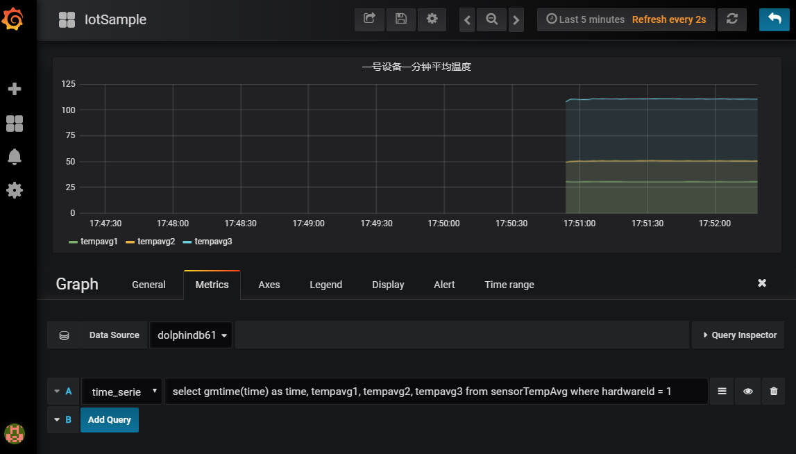

# DolphinDB 在工业物联网的应用

- [1. 工业物联网的数据特点和痛点](#1-工业物联网的数据特点和痛点)
- [2. DolphinDB 的工业物联网解决方案](#2-dolphindb-的工业物联网解决方案)
- [3. 案例综述](#3-案例综述)
- [4. 案例实施](#4-案例实施)
	- [4.1 系统的功能模块设计](#41-系统的功能模块设计)
	- [4.2 服务器部署](#42-服务器部署)
	- [4.3 实现步骤](#43-实现步骤)

## 1. 工业物联网的数据特点和痛点

工业物联网的数据采集有着频率高、设备多、维度高的特点，数据量非常大，对系统的吞吐量有很高的要求。同时工业物联网往往需要系统能够实时处理数据，对系统预警，监控，甚至反控。不少系统还需要提供图形化终端供操作工人实时监控设备的运行，这给整个系统带来了更大的压力。对于采集到的海量历史数据，通常还需要进行离线的建模和分析。因此，工业物联网的数据平台有着非常苛刻的要求，既要有非常高的吞吐量，又要有较低的延时；既要能够实时处理流数据，又要能够处理海量的历史数据；既要满足简单的点查询的要求，又要满足批量数据复杂分析的要求。

传统的事务型数据库，比如 SQL Server、Oracle 和 Mysql，无法满足高吞吐量的数据写入和海量数据的分析。即使数据量较小，能满足数据写入的要求，也不能同时响应实时计算的请求。

Hadoop 生态提供了消息引擎，实时数据写入，流数据计算，离线数据仓库，离线数据计算等多个部件。这些大数据系统组合起来，可以解决工业物联网的数据平台问题。但这样的方案过于庞大和臃肿，实施和运维的成本很高。

## 2. DolphinDB 的工业物联网解决方案

DolphinDB 作为一个高性能的分布式时序数据库，为工业物联网的数据存储和计算提供了一个强大的基础平台。
* DolphinDB 的分布式数据库可以方便的支持水平扩展和垂直扩展，系统的吞吐量和支持的数据量可以近乎无限的扩展。
* DolphinDB 的流计算引擎支持实时流计算处理。内置的聚合引擎可以按指定的时间窗口大小和频率来计算各种聚合指标。聚合既可以是时间轴上（从高频到低频）的纵向聚合，也可以是多个维度的横向聚合。
* DolphinDB 的内存数据库可以支持数据的快速写入，查询和计算。例如聚合引擎的结果可以输出到一个内存表，接受前端 BI（如 Grafana）的的秒级轮询指令。
* DolphinDB 集数据库、分布式计算和编程语言于一体，可以在库内快速的完成复杂的分布式计算，例如回归和分类。这大大加快了海量历史数据的离线分析和建模。
* DolphinDB 也实现了与部分开源或商业化的 BI 工具的接口，方便用户可视化或监控设备数据。


## 3. 案例综述

企业的生产车间内总共有 1000 个传感设备，每个设备每 10ms 采集一次数据，为简化 demo 脚本，假设采集的数据仅有三个维度，均为温度。需要完成的任务包括：
* 将采集到的原始数据存入数据库。离线的数据建模需要用到这些历史数据。
* 实时计算每个设备过去一分钟的平均温度指标，计算的频率为每两秒钟要进行一次。
* 因为设备的操作工需要在最快的时间内掌握温度变化，所以前端展示界面每秒查询一次实时运算的结果并刷新温度变化趋势图。


## 4. 案例实施

### 4.1 系统的功能模块设计
	
针对上述的案例，我们首先要启用 DolphinDB database 的分布式数据库，创建一个命名为 iotDemoDB 的分布式数据库用于保存采集的实时数据。数据库按日期和设备两个维度进行数据分区。日期采用值分区，设备采用范围分区。日后清理过期数据，只要简单的删除旧的日期分区就可完成。

启用流数据发布和订阅功能。订阅高频数据流做实时计算。createTimeSeriesAggregator 函数能创建一个指标聚合引擎，用于实时计算。我们在案例里指定计算窗口大小是 1 分钟，每 2 秒钟运算一次过往 1 分钟的温度均值，然后将运算结果保存到低频数据表中，供前端轮询。

部署前端 Grafana 平台展示运算结果的趋势图，设置每 1 秒钟轮询一次 DolphinDB Server，并刷新展示界面。

### 4.2 服务器部署

在本次 demo 里，为了使用分布式数据库，我们需要使用一个单机多节点集群，可以参考[单机多节点集群部署指南](./single_machine_cluster_deploy.md)。这里我们配置了 1 个 controller+1 个 agent+4 个 datanode 的集群，下面列出主要的配置文件内容供参考：

cluster.nodes
```
localSite,mode
localhost:8701:agent1,agent
localhost:8081:node1,datanode
localhost:8083:node2,datanode
localhost:8082:node3,datanode
localhost:8084:node4,datanode
```
由于 DolphinDB 系统默认是不启用 Streaming 模块功能的，所以我们需要通过在 cluster.cfg 里做显式配置来启用它，因为本次 demo 里使用的数据量不大，为了避免 demo 复杂化，所以这里只启用了 node1 来做数据订阅。写入分布式表的数据若再分区范围外，会写入失败。因此添加配置项 newValuePartitionPolicy=add，即如果新增的数据中包含分区方案外的数据，系统会根据分区列中新的值自动创建分区。

cluster.cfg
```
maxMemSize=2
workerNum=4
persistenceDir=dbcache
maxSubConnections=4
node1.subPort=8085
maxPubConnections=4
newValuePartitionPolicy=add
```
实际生产环境下，建议使用多物理机集群，可以参考 [多物理机集群部署指南](./multi_machine_cluster_deploy.md)

### 4.3 实现步骤

首先我们定义一个流数据表 st 用于接收实时采集的温度数据，使用[`enableTableShareAndPersistence`](https://www.dolphindb.cn/cn/help/FunctionsandCommands/CommandsReferences/e/enableTableShareAndPersistence.html)函数对 st 表做持久化并共享为 sensorTemp，内存中保留的最大数据量是 100 万行。
```
st=streamTable(1000000:0,`hardwareId`ts`temp1`temp2`temp3,[INT,TIMESTAMP,DOUBLE,DOUBLE,DOUBLE])
enableTableShareAndPersistence(table=st, tableName=`sensorTemp, asynWrite=true, compress=false, cacheSize=1000000)

```
通过订阅流数据表 sensorTmp，把采集的数据准实时的批量保存到分布式数据库中。分布式表使用日期和设备编号两个分区维度。在物联网大数据场景下，经常要清除过时的数据，这样分区的模式可以简单的通过删除指定日期分区就可以快速的清理过期数据。[`subscribeTable`](https://www.dolphindb.cn/cn/help/FunctionsandCommands/FunctionReferences/s/subscribeTable.html)函数最后两个参数控制数据保存的频率，只有订阅数据达到 100 万或时间间隔达到 10 秒才批量将数据写入分布式数据库。

```
db1 = database("",VALUE,today()..(today()+30))
db2 = database("",RANGE,0..10*100)
db = database("dfs://iotDemoDB",COMPO,[db1,db2])
tableSchema=table(1:0,`hardwareId`ts`temp1`temp2`temp3,[INT,TIMESTAMP,DOUBLE,DOUBLE,DOUBLE]) 
dfsTable=db.createPartitionedTable(tableSchema,"sensorTemp",`ts`hardwareId)
subscribeTable(tableName="sensorTemp", actionName="sensorTemp", offset=-1, handler=append!{dfsTable}, msgAsTable=true, batchSize=1000000, throttle=10)

```

在对流数据做分布式保存数据库的同时，系统使用[`createTimeSeriesEngine`](https://www.dolphindb.cn/cn/help/FunctionsandCommands/FunctionReferences/c/createTimeSeriesEngine.html)函数创建一个指标聚合引擎，用于实时计算。函数第一个参数表示时间序列聚合引擎的名称，是时间序列聚合引擎的唯一标识。第二个参数指定了窗口大小为 60 秒，第三个参数指定每 2 秒钟做一次求均值运算，第四个参数是运算的元代码，可以由用户自己指定计算函数，任何系统支持的或用户自定义的聚合函数这里都能支持，通过指定分组字段 hardwareId，函数会将流数据按设备分成 1000 个队列进行均值运算，每个设备都会按各自的窗口计算得到对应的平均温度。最后通过`subscribeTable`订阅流数据，在有新数据进来时触发实时计算，并将运算结果保存到一个新的数据流表 sensorTempAvg 中。

createTimeSeriesAggregator 参数说明：时间序列聚合引擎的名称，窗口时间，运算间隔时间，聚合运算元代码，原始数据输入表，运算结果输出表，时序字段，分组字段，触发 GC 记录数阈值。

```
share streamTable(1000000:0, `time`hardwareId`tempavg1`tempavg2`tempavg3, [TIMESTAMP,INT,DOUBLE,DOUBLE,DOUBLE]) as sensorTempAvg
demoAgg = createTimeSeriesAggregator(name="demoAgg", windowSize=60000, step=2000, metrics=<[avg(temp1),avg(temp2),avg(temp3)]>, dummyTable=sensorTemp, outputTable=sensorTempAvg, timeColumn=`ts,  keyColumn=`hardwareId, garbageSize=2000)
subscribeTable( tableName="sensorTemp", actionName="demoAgg", offset=-1, handler=append!{demoAgg}, msgAsTable=true)
```

在 DolphinDB Server 端在对高频数据流做保存、分析的时候，Grafana 前端程序每秒钟会轮询实时运算的结果，并刷新平均温度的趋势图。DolphinDB 提供了 Grafana_DolphinDB 的 datasource 插件，关于 Grafana 的安装以及 DolphinDB 的插件配置请参考[Grafana 配置教程](https://gitee.com/dolphindb/grafana-datasource/blob/master/README.zh.md)。

在完成 grafana 的基本配置之后，新增一个 Graph Panel, 在 Metrics tab 里输入

```
select gmtime(time) as time, tempavg1, tempavg2, tempavg3 from sensorTempAvg where hardwareId = 1
```
这段脚本是选出 1 号设备实时运算得到的平均温度表




最后，启动数据模拟生成程序，生成模拟温度数据并写入流数据表
 > *数据规模：1000 个设备，以每个点 3 个维度、10ms 的频率生成数据，以每个维度 8 个 Byte ( Double 类型 ) 计算，数据流速是 24Mbps，持续 100 秒。*
```
def writeData(){
	hardwareNumber = 1000
	for (i in 0:10000) {
		data = table(take(1..hardwareNumber,hardwareNumber) as hardwareId ,take(now(),hardwareNumber) as ts,rand(20..41,hardwareNumber) as temp1,rand(30..71,hardwareNumber) as temp2,rand(70..151,hardwareNumber) as temp3)
		sensorTemp.append!(data)
		sleep(10)
	}
}
submitJob("simulateData", "simulate sensor data", writeData)
```

任务提交之后，可以在 GUI 中通过如下脚本来观察运行状态
```
//查看已提交的写入任务
getRecentJobs()
//观察流数据的订阅消费情况
getStreamingStat().subWorkers
//观察时序聚合引擎的
getAggregatorStat().TimeSeriesAggregator
//观察已写入的数据
select count(*) from dfsTable
```

若需要重复运行模拟脚本，需要使用如下脚本先清理流数据环境。

```
unsubscribeTable(tableName="sensorTemp", actionName="demoAgg")
unsubscribeTable(tableName="sensorTemp", actionName="sensorTemp")
dropAggregator("demoAgg")
clearTablePersistence(sensorTemp)
dropStreamTable(`sensorTemp)
```
---
[demo 完整脚本](script/iot_demo_script.txt)