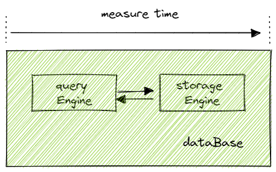

# 物联网时序数据查询案例

- [1 物联网简介](#1-物联网简介)
- [2 案例数据准备](#2-案例数据准备)
  - [2.1 数据集说明](#21-数据集说明)
  - [2.2 库表设计及数据模拟](#22-库表设计及数据模拟)
- [3 SQL 查询](#3-sql-查询)
- [4 对比测试](#4-对比测试)
  - [4.1 测试环境](#41-测试环境)
  - [4.2 测试结果](#42-测试结果)
- [5 总结](#5-总结)
- [6 附录](#6-附录)

## 1 物联网简介

物联网（Internet of Things，简称 IoT）是指通过各种信息传感、通信和 IT 技术来实时连接、采集、监管海量的传感设备，从而实现对现实世界的精确感知和快速响应，继而实现自动化、智能化管理。在查询 IoT 设备状态的场景下，吞吐量和时延是两个重要的性能指标。

在工业物联网中，常见有以下几种设备时序数据的查询需求：

- 案例 1：查询某个设备最近的记录
- 案例 2：查询某个租户所有设备的最近一条记录
- 案例 3：查询某个设备最近 5 分钟的统计信息
- 案例 4：查询某个设备最近一天的秒级数据

本教程通过一个工业物联网的案例，来演示 DolphinDB 的序列查询性能，并对比测试了 DolphinDB TSDB 引擎、OLAP 引擎，以及 ClickHouse MergeTree 引擎在上述查询案例上的时延指标。总体来说，DolphinDB TSDB 引擎的性能（时延）对比 DolphinDB OLAP 引擎和 ClickHouse MergeTree 引擎有显著优势。

## 2 案例数据准备

### 2.1 数据集说明

本教程参考了某工业物联网 SaaS 平台服务商的数据集，模拟并使用一份高度仿真的数据。该 SaaS 服务商的主要业务是监控各个地区的噪声情况。表结构如下：

| **序号** | **字段名称**           | **字段类型**  | **注释**  |
| ------ | ------------------ | --------- | ------- |
| 1      | tenantId           | INT       | 租户 ID    |
| 2      | deviceId           | INT       | 设备 ID    |
| 3      | soundPressureLevel | DOUBLE    | 声音分贝    |
| 4      | soundPowerLevel    | DOUBLE    | 声音功率值   |
| 5      | ts                 | TIMESTAMP | 数据采集时间戳 |
| 6      | date               | DATE      | 日期      |

一行数据包含租户 ID、设备 ID、声压、噪声功率、采集时间戳和日期共计 6 列数据。每行记录占用 36 字节。该案例数据包含 100 个租户，每个租户管理 100 个噪声监控设备，记录了从 2022-01-01 至 2022-01-12，12 亿的噪声数据，共计 40G。

### 2.2 库表设计及数据模拟

使用 DolphinDB TSDB 引擎，创建一个名为 NoiseDB 的数据库，存储噪声数据。TSDB 引擎是 DolphinDB 自 2.00 版本起，专门为物联网场景设计研发的数据存储引擎，具备优秀的写入和序列查询性能。

在噪声监控的 SaaS 服务中，较为频繁的查询场景是以租户为维度，查询某一天某个设备的状态信息。因此设计 noise 表按日期、租户 ID 进行分区，可以有效利用[分区剪枝](https://www.dolphindb.cn/cn/help/130/DatabaseandDistributedComputing/DatabaseOperations/Queries.html)。同时使用区分度较高的设备 ID 和数据采集时间戳作为排序键（查询索引），使查询时能够快速定位对应设备的数据，提升查询性能。具体实现脚本如下。
```python
db1 = database(,VALUE,1000..2000) 
db2  = database(, VALUE, 2022.01.01..2022.12.30) 

// TSDB for iot 
dbNoise = database("dfs://NoiseDB",COMPO,[db1,db2], engine="TSDB") 

create table "dfs://NoiseDB"."noise"(
    tenantId INT,
    deviceId INT,
    soundPressureLevel INT,
    soundPowerLevel DOUBLE,
    ts TIMESTAMP,
    date DATE
)
partitioned by tenantId, date
sortColumns=[`deviceId,`ts]
```

库表创建完成后，模拟 2022-01-01 至 2022-01-12 的数据，具体代码详见附录 [DolphinDB 脚本](script/iot_query_case/Noise_V3.dos)。

可以通过 SQL 查询验证下数据集大小：
```
select count(*) from  loadTable(database("dfs://NoiseDB"),"noise") where date between 2022.01.01:2022.01.102> 1260010000
```

导入完成后，每个分区下生成 3 个 level 0 file，未满足自动合并条件（大于等于 10 个 levelFile），需要进行手动合并。

```
chunkIds = exec chunkId from getChunksMeta() where type=1
for (x in chunkIds) {
  triggerTSDBCompaction(x)
}
```

完成后将案例数据导出数据至 csv 文件，以便后续导入 OLAP 引擎、ClickHouse。在 ClickHouse 中使用`OPTIMIZE TABLE noise` 合并下 mergeTree。具体过程参照附录 ClickHouse 脚本。

## 3 SQL 查询

在 DolphinDB 中，可以使用 SQL 快速实现 4 个设备状态查询需求，并且代码十分简洁。

- 案例 1：查询某个设备最近的 100 条记录：
```python
noise = loadTable(database("dfs://NoiseDB"),"noise")
select * from noise 
where date=2022.01.01 and tenantId=1055 and deviceId=10067
order by ts desc
limit 100

# timer(10) select ...
Time elapsed: 24.33 ms
```

脚本的 where 条件语句中指定了分区列 date 和 tenantId 进行过滤，便于 DolphinDB 系统通过分区剪枝快读定位到对应的分区。同时指定了数据库的 sort key (deviceId) 作为过滤字段，利用 TSDB 的索引机制，可以快速定位到数据块，并按时间顺序取回最新的 100 条记录。平均一次查询耗时 **2ms**，未命中缓存的首次查询耗时 **14ms**。

- 案例 2：查询某个租户所有设备最新状态

```python
noise = loadTable(database("dfs://NoiseDB"),"noise")
select * from noise 
where date=2022.01.01 and tenantId=1055
context by deviceId
csort ts desc
limit 1

# timer(10) select ...
Time elapsed: 246.619 ms
```

该脚本在 where 条件语句中同样指定了分区列以快速定位到对应的数据分区。通过 context by 子句来根据设备 ID 将数据进行分组，每组数据通过 csort 子句按时间倒序排列（考虑到物联网存在消息乱序的情况，必须使用 csort 将数据按采集时间排序）。使用 limit 1 获取每个窗口内的最新的一条记录，从而获取该租户当日所有设备的最新状态。平均一次查询耗时 **25ms**，首次查询耗时 **121ms**。

- 案例 3：查询某个设备 5 分钟内的噪声统计值

```python
noise = loadTable(database("dfs://NoiseDB"),"noise")
select
     min(ts) as startTs
    ,max(ts) as endTs
    ,max(soundPressureLevel)
    ,avg(soundPressureLevel)
    ,max(soundPowerLevel) 
    ,avg(soundPowerLevel) 
from noise
where date=2022.01.01 and tenantId=1055 and deviceId=10067 and ts between 2022.01.01T00:50:15.518:2022.01.01T00:55:15.518
group by tenantId, deviceId

# timer(10) select ...
Time elapsed: 22.168 ms
```

该脚本首先根据 where 指定的过滤条件定位并扫描数据块，取出对应时间段的数据，并按 tenantId, deviceId 进行聚合计算，以获取声音分贝、功率的统计值。平均一次查询耗时 **2ms**，首次查询耗时 **13ms**。

- 案例 4：查询某个设备最近一天的明细数据

```python
noise = loadTable(database("dfs://NoiseDB"),"noise")
select *
from noise
where date=2022.01.01 and tenantId=1055 and deviceId=10067
order by ts

# timer(10) select ...
Time elapsed: 23.261 ms
```

该脚本首先根据 where 指定的过滤条件定位并扫描数据块，取出对应时间段的明细数据，并按采集时间排序。平均一次查询耗时 **2ms**，首次查询耗时 **16ms**。

**注**：首次查询指未命中数据库缓存及操作系统缓存的查询。

## 4 对比测试

进一步测试 DolphinDB TSDB 引擎与 OLAP 引擎，以及 ClickHouse MergeTree 引擎在上述数据集的时序查询性能。测试过程中尽可能地保持环境变量相同，以保证科学有效。具体测试脚本详见附录。

### 4.1 测试环境

- 测试机器配置

操作系统：CentOS 7

CPU: 2 cores

内存：10 G

磁盘：SSD

- 核心测试参数

对测试中影响性能的关键参数，保持对等一致。

| 软件信息                  | 核心参数                                  | 库表设计                                     |
| --------------------- | ------------------------------------- | ---------------------------------------- |
| DolphinDB：2.00.6 单节点  | memSize=8G TSDB 引擎 / OLAP 引擎            | partitioned by tenantId, datesortColumns = [deviceId,ts] |
| ClickHouse：22.6.1 单节点 | max_server_memory_usage=8GMergeTree 引擎 | partition by tenantId, dateorder by deviceId, ts |

测试时，DolphinDB 和 ClickHouse 均采用单节点，并分配 8G 最大内存。在引擎方面，DolphinDB TSDB 引擎，ClickHouse MergeTree 引擎的内部实现都采用了 LSM-tree。并保持库表设计完全一致。

- 时间衡量标准

由于端到端的时间，容易受到网络抖动和客户端实现性能的影响，因此本次测试的测量时间设定为从查询引擎接收到请求至计算出结果为止。



### 4.2 测试结果

三者的具体测试结果为下表，表中数值为**平均**耗时/**首次**查询耗时（单位 ms），平均耗时的计算逻辑为：

平均耗时 = （首次耗时 + 9 次缓存命中耗时）/ 10

| 测试用例  | 场景                | DolphinDB TSDB | DolphinDB OLAP | ClickHouse |
| ----- | ----------------- | -------------- | -------------- | ---------- |
| case1 | 查询某个设备最新 100 条记录   | 2 / 14         | 34 / 51        | 14 / 150   |
| case2 | 查询某个租户所有设备的最新状态   | 25 /121        | 62 / 170       | 73 / 400   |
| case3 | 查询某个设备 5min 的噪声统计值 | 2 / 13         | 15 / 136       | 12 / 82    |
| case4 | 查询某个设备最近一天的明细数据   | 2 / 16         | 24 / 220       | 22 / 200   |

可以看出，OLAP 引擎和 ClickHouse 在不同的查询场景下性能各有其优势和劣势。

而 TSDB 引擎性能均优于 ClickHouse，在相对复杂的点查场景性能差距更大。在场景 4 下，DolphinDB TSDB 引擎比 ClickHouse 的性能高 12.5 倍，首次查询高 13 倍。在该场景中，TSDB 引擎需要读取对应设备的 10000 条记录，压缩后的存储大小约为 90K。存储在 6 个连续的 Block 中，读取效率非常高效。而 ClickHouse 则是 scan 了该分区下 1000000 条记录的数据块，因此两者的首次查询性能差距较大，而缓存后的性能差距主要取决于两者在计算性能上的差别。

## 5 总结

DolphinDB TSDB 引擎在物联网场景有着卓越的点查性能，可以以毫秒级延时迅速响应设备的状态信息，其性能更优于 ClickHouse 的 MergeTree 引擎。

## 6 附录

- [DolphinDB 脚本](script/iot_query_case/Noise_V3.dos)
- [ClickHouse 脚本](script/iot_query_case/ck.sql)