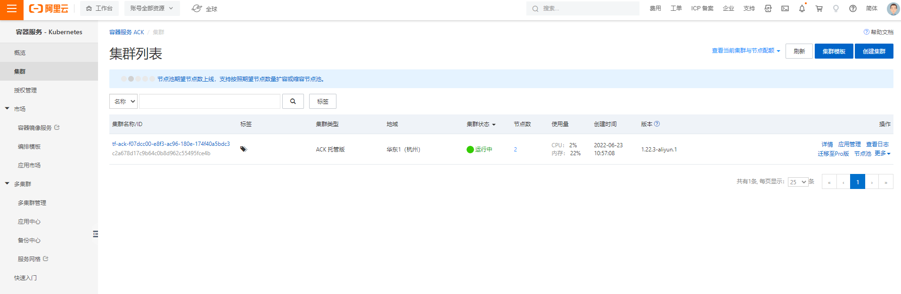
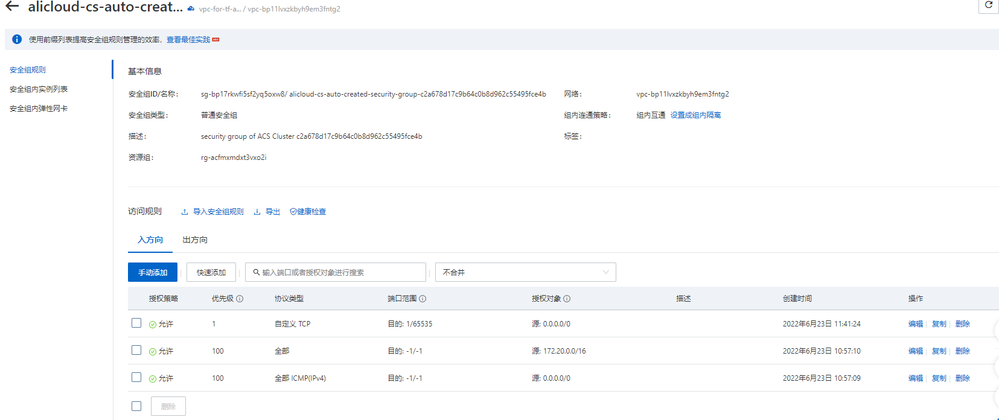

#  基于阿里云K8S的DolphinDB套件部署教程

<!-- TOC -->

- [1. 简介](#简介)
- [2. 在 ACK 上部署 DolphinDB 集群](#2-在-ack-上部署-dolphindb-集群)
  - [2.1 环境准备](#21-环境准备)
  - [2.2 资源以及权限](#22-资源以及权限)
  - [2.3 部署 ACK，DolphinDB Mgr 和 DolphinDB 集群](#23-部署-ackdolphindb-mgr-和-dolphindb-集群)
  - [2.4 常见问题](#24-常见问题)

<!-- /TOC -->

## 1. 简介

阿里云容器服务 Kubernetes 版（Alibaba Cloud Container Service for Kubernetes，简称 ACK）是全球首批通过 Kubernetes 一致性认证的服务平台，提供高性能的容器应用管理服务，支持企业级 Kubernetes 容器化应用的生命周期管理，让您轻松高效地在云端运行 Kubernetes 容器化应用。DolphinDB 推出 DolphinDB MGR 服务，以帮助用户轻松在 ACK 上部署 DolphinDB 集群。

## 2. 环境准备

部署前，先准备一台能够连接到阿里云控制台的主机，预置环境如下:

- 服务器可以连接 `http://www.google.com`

- 安装 Helm3 （3.7.0以上）：用于安装 DolphinDB MGR
- 安装版本号不小于v1.12的 Kubernetes 命令行工具 [kubectl](https://kubernetes.io/docs/tasks/tools/#install-kubectl)
- 版本号不小于v3.0.15的 [aliyun-cli](https://github.com/aliyun/aliyun-cli)，并且[配置 aliyun-cli](https://www.alibabacloud.com/help/doc-detail/90766.htm?spm=a2c63.l28256.a3.4.7b52a893EFVglq)
- [Terraform](https://learn.hashicorp.com/terraform/getting-started/install.html)，本文使用的版本号为v1.2.3。

因为阿里云的[云命令行](https://shell.aliyun.com/)中已经预装并配置好了所有工具，所以推荐使用云命令行服务。

要验证 [aliyun-cli的配置](https://www.alibabacloud.com/help/doc-detail/90766.htm?spm=a2c63.l28256.a3.4.7b52a893EFVglq)是否正确，输入如下命令进行验证：

```
aliyun configure list
```

期望输出：

```bash
Profile   | Credential         | Valid   | Region           | Language
--------- | ------------------ | ------- | ---------------- | --------
default * | AK:***fnY          | Valid   | cn-hangzhou      | zh
```

## 3. 资源以及权限

默认配置下，会创建以下资源：

- 一个新的 VPC
- 一个托管版的 ACK 集群和一系列 worker 节点：
  - 属于一个伸缩组的2台 ECS 实例（4核8GB）。托管版 Kubernetes 的默认伸缩组中必须至少包含两台实例，用于承载整个系统服务

需要具备以下权限，才能成功部署一个完整的集群：

- AliyunECSFullAccess
- AliyunESSFullAccess
- AliyunVPCFullAccess
- AliyunSLBFullAccess
- AliyunCSFullAccess
- AliyunEIPFullAccess
- AliyunECIFullAccess
- AliyunVPNGatewayFullAccess
- AliyunNATGatewayFullAccess

## 4. 部署 ACK, DolphinDB MGR 和 DolphinDB 集群

使用如下步骤部署 ACK, DolphinDB MGR 和 DolphinDB 集群。

### 4.1 设置目标 region 和阿里云密钥（也可以写入 main.tf 文件中）

```bash
export region=hangzhou && \
export ACCESS_KEY="LTAI*******" && \
export secret_key="y1xK*******"
```

### 4.2 使用 Terraform 安装 DolphinDB

部署的 `main.tf` 如下：

```
terraform {
  required_providers {
    alicloud={
      source="aliyun/alicloud"
      version="1.161.0"
    }
  }
}
provider "alicloud" {
  # 填入您的账号 Access Key
  access_key = "xxxxxxxxxxx"
  # 填入您的账号 Secret Key
  secret_key = "xxxxxxxxxxx"
  # 填入想创建的 Region
  region     = "cn-hangzhou"
}
variable "k8s_name_prefix" {
  description = "The name prefix used to create managed kubernetes cluster."
  default     = "tf-ack"
}
resource "random_uuid" "this" {}
# 默认资源名称
locals {
  k8s_name     = substr(join("-", [var.k8s_name_prefix, random_uuid.this.result]), 0, 63)
  new_vpc_name = "vpc-for-${local.k8s_name}"
  new_vsw_name = "vsw-for-${local.k8s_name}"
  log_project_name = "log-for-${local.k8s_name}"
}
# 节点 ECS 实例配置
data "alicloud_instance_types" "default" {
  cpu_core_count       = 4
  memory_size          = 8
  kubernetes_node_role = "Worker"
}
// 满足实例规格的 AZ
data "alicloud_zones" "default" {
  available_instance_type = data.alicloud_instance_types.default.instance_types[0].id
}
# 专有网络
resource "alicloud_vpc" "default" {
  vpc_name = local.new_vpc_name
  cidr_block = "10.1.0.0/21"
}
# 交换机
resource "alicloud_vswitch" "vswitches" {
  vswitch_name = local.new_vsw_name
  vpc_id = alicloud_vpc.default.id
  cidr_block = "10.1.1.0/24"
  zone_id = data.alicloud_zones.default.zones[0].id
}
# Kubernetes 托管版
resource "alicloud_cs_managed_kubernetes" "default" {
  # Kubernetes集群名称
  name                      = local.k8s_name
  # 新的 Kubernetes 集群将位于的 vswitch。指定一个或多个 vswitch 的 ID。它必须在 availability_zone 指定的区域中。
  worker_vswitch_ids        = split(",", join(",", alicloud_vswitch.vswitches.*.id))
  # 是否在创建 Kubernetes 集群时创建新的 NAT 网关。默认为 true。
  new_nat_gateway           = true
  # 节点的 ECS 实例类型。
  worker_instance_types     = [data.alicloud_instance_types.default.instance_types[0].id]
  # Kubernetes 群集的总工作节点数。默认值为 3。最大限制为 50。
  worker_number             = 2
  # ssh 登录群集节点的密码。
  password                  = "Yourpassword1234"
  # pod 网络的 CIDR 块。当cluster_network_type设置为 flannel，你必须设定该参数。它不能与 VPC CIDR 相同，并且不能与 VPC 中的 Kubernetes 群集使用的 CIDR 相同，也不能在创建后进行修改。群集中允许的最大主机数量：256。
  pod_cidr                  = "172.20.0.0/16"
  # 服务网络的 CIDR 块。它不能与 VPC CIDR 相同，不能与 VPC 中的 Kubernetes 群集使用的 CIDR 相同，也不能在创建后进行修改。
  service_cidr              = "172.21.0.0/20"
  # 是否为 Kubernetes 的节点安装云监控。
  install_cloud_monitor     = true
  # 是否为 API Server 创建 Internet 负载均衡。默认为 false。
  slb_internet_enabled      = true
  # 节点的系统磁盘类别。其有效值为 cloud_ssd 和 cloud_efficiency。默认为 cloud_efficiency。
  worker_disk_category      = "cloud_efficiency"
  # 节点的数据磁盘类别。其有效值为 cloud_ssd 和 cloud_efficiency，如果未设置，将不会创建数据磁盘。
  worker_data_disk_category = "cloud_ssd"
  # 节点的数据磁盘大小。有效值范围 [20, 32768]，以 GB 为单位。w当设置了 worker_data_disk_category 时，默认为 40。
  worker_data_disk_size     = 200
}
```

复制上述文件到服务器中，命名为 `main.tf`，并修改 `access_key` 以及 `secret_key` 为个人阿里云账号。

```
provider "alicloud" {
  # 填入您的账号 Access Key
  access_key = "xxxxxxxxxxx"
  # 填入您的账号 Secret Key
  secret_key = "xxxxxxxxxxx"
  # 填入想创建的 Region
  region     = "cn-hangzhou"
}
```

也可修改配置 `alicloud_instance_types` 的 `cpu_core_count` 和 `memory_size`（默认值分别是4和8）。

配置完成后，使用 `terraform` 命令初始化并部署集群：

```bash
terraform init
```

> 注意：初始化时需要连接外网下载 Terraform 的 aliyun-provider 组件

`apply` 过程中需要输入 `yes` 来确认执行：

```bash
terraform apply
```

假如在运行 `terraform apply` 时出现报错，可根据报错信息（例如缺少权限）进行修复，之后再次运行 `terraform apply`。

整个安装过程大约需要5至10分钟。安装完成后会输出集群的关键信息。若需要重新查看这些信息，可以运行 `terraform output`：

```bash
random_uuid.this: Creating...
random_uuid.this: Creation complete after 0s [id=f07dcc00-e8f3-ac96-180e-174f40a5bdc3]
alicloud_vpc.default: Creating...
alicloud_vpc.default: Still creating... [10s elapsed]
alicloud_vpc.default: Creation complete after 11s [id=vpc-bp11lvxzkbyh9em3fntg2]
alicloud_vswitch.vswitches: Creating...
alicloud_vswitch.vswitches: Creation complete after 6s [id=vsw-bp1g40bjmyfz6ck22sbo4]
alicloud_cs_managed_kubernetes.default: Creating...
alicloud_cs_managed_kubernetes.default: Still creating... [10s elapsed]
···
alicloud_cs_managed_kubernetes.default: Creation complete after 8m32s [id=c2a678d17c9b64c0b8d962c55495fce4b]
Apply complete! Resources: 4 added, 0 changed, 0 destroyed.
```

需要等待以下过程均完成（总耗时约5~20分钟），才会显示结果。

集群创建完成后，在阿里云中的容器服务中，查看创建的所有资源。



### 4.3 配置 StorageClass

本小节介绍如何为不同的存储类型配置 StorageClass，包括创建 ACK 集群后默认存在的 alicloud -disk-ssd/alicloud-disk-essd 存储类型。

- **alicloud -disk-ssd/alicloud-disk-essd**

  通过上述方法创建 ACK 集群后，会自带一个 alicloud -disk-ssd/alicloud-disk-essd 存储类型的 StorageClass。

- **本地存储**

  部署 local volume provisioner，详细请见参阅 [k8s_deployment](https://gitee.com/dolphindb/Tutorials_CN/blob/master/k8s_deployment.md#221-部署-local-path-provisioner)。

### 4.4 安装部署 DolphinDB MGR 和 DolphinDB 集群

首先介绍如何通过 kubectl 客户端或 CloudShell 快速连接到 ACK 集群，详细见[通过kubectl快速使用ACK (aliyun.com)](https://help.aliyun.com/document_detail/309552.html)中步骤三。

配置完成后，使用 DolphinDB MGR 部署 DolphinDB 集群的步骤参见 [k8s_deployment](https://gitee.com/dolphindb/Tutorials_CN/blob/master/k8s_deployment.md#23-部署并连接-dolphindb-集群)。

> 注意：需要部署公网 IP 以及阿里云安全组去访问 DolphinDB-mgr 组件，以此来部署 DolphinDB 集群。

### 4.5 配置公网以及阿里云安全组

打开专有网络 VPC 页面 -> 弹性公网，创建弹性公网 IP，并且绑到到对应的 ECS 服务器上。详细步骤见 [绑定ECS实例 (aliyun.com)](https://help.aliyun.com/document_detail/72125.html)。如图所示 ECS 服务器已经绑定到公网121.40.216.37上。


打开 ECS 管理控制台，配置安全组。详细见[创建安全组 (aliyun.com)](https://help.aliyun.com/document_detail/25468.html)。本节配置结果如下：



至此，完成了在阿里云 ACK 上部署 DolphinDB 部署的所有操作。

> 注意：
>
> 配置弹性公网后，外部访问 DolphinDB MGR 需要用公网 IP 以及 PORT 访问，本例即 121.40.216.37:$PORT

## 5. 销毁集群

销毁 Dolphindb 集群详见 [k8s_deployment](https://gitee.com/dolphindb/Tutorials_CN/blob/master/k8s_deployment.md#23-部署并连接-dolphindb-集群)。

通过如下命令销毁 ACK 集群：

```sh
terraform destroy
```

假如 Kubernetes 集群没有创建成功，那么在 destroy 时会出现报错，无法进行正常清理。此时需要手动将 Kubernetes 资源从本地状态中移除：

```sh
terraform state list
terraform state rm module.ack.alicloud_cs_managed_kubernetes.default
```

销毁集群操作需要执行较长时间。

> 注意：
>
> 组件挂载的云盘需要在阿里云管理控制台中手动删除。

## 6. 常见问题

### 6.1 pv 无法正常动态生成

具体错误信息如下:

```
0/2 nodes are available: 2 pod has unbound immediate PersistentVolumeClaims. 0/2 nodes are available: 2 pod has unbound immediate PersistentVolumeClaims. 0/2 nodes are available: 2 pod has unbound immediate PersistentVolumeClaims. 0/2 nodes are available: 2 pod has unbound immediate PersistentVolumeClaims. 0/2 nodes are available: 2 pod has unbound immediate PersistentVolumeClaims. 0/2 nodes are available: 2 pod has unbound immediate PersistentVolumeClaims. 0/2 nodes are available: 2 pod has unbound immediate PersistentVolumeClaims. 0/2 nodes are available: 2 pod has unbound immediate PersistentVolumeClaims.
```

**原因和解决方案**

* 阿里云盘有最小磁盘空间限制，最小为20GB。这种情况，设置 PV 的磁盘空间大于20GB，才能动态创建 PV。

### 6.2 配置任务时，系统提示资源不足

具体错误信息如下:

```
xxxx resource is insufficient
```

**原因和解决方案**

- 所在的区域确实无资源了。这种情况，请联系售后查看资源情况和备选方案。
- 新建阿里云服务器的任务跨国际站点，导致没有对应的资源。这种情况，请修改任务配置的站点，如修改为 cn-hangzhou。