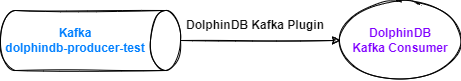
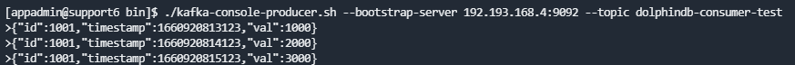
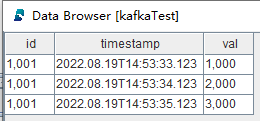
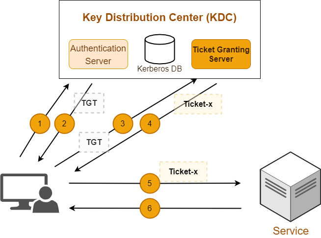

# DolphinDB Kafka 插件最佳实践指南

- [DolphinDB Kafka 插件最佳实践指南](#dolphindb-kafka-插件最佳实践指南)
  - [1. DolphinDB Kafka 插件介绍](#1-dolphindb-kafka-插件介绍)
  - [2. 基本使用介绍](#2-基本使用介绍)
    - [2.1 安装 DolphinDB Kafka 插件](#21-安装-dolphindb-kafka-插件)
    - [2.2 使用 DolphinDB Kafka Prodcuer](#22-使用-dolphindb-kafka-producer)
    - [2.3 使用 DolphinDB Kafka Consumer](#23-使用-dolphindb-kafka-consumer)
  - [3. 通过 Kafka 插件实时计算K线](#3-通过-kafka-插件实时计算k线)
  	- [3.1 环境准备](#31-环境准备)
  	- [3.2 生产数据](#32-生产数据)
  	- [3.3 消费数据](#33-消费数据)
  	- [3.4 流计算引擎实时计算 K 线](#34-流计算引擎实时计算-k-线)
  - [4. 性能测试](#4-性能测试)
    - [4.1 硬件环境](#41-硬件环境)
    - [4.2 软件环境](#42-软件环境)
    - [4.3 测试结果](#43-测试结果)
    - [4.4 测试流程](#44-测试流程)
  - [5. Kerberos 认证](#5-kerberos-认证)
    - [5.1 什么是 Kerberos ？](#51-什么是-kerberos-)
    - [5.2 前置条件](#52-前置条件)
    - [5.3 认证相关配置说明](#53-认证相关配置说明)
  - [6. 其他说明](#6-其他说明)
  - [7. 参考链接](#7-参考链接)
  - [附录](#附录)


## 1. DolphinDB Kafka 插件介绍

Kafka 是一个高吞吐量的分布式消息中间件，可用于海量消息的发布和订阅。

DolphinDB Kafka 插件支持把 DolphinDB 中生产的数据推送到 Kafka，也支持从 Kafka订阅数据，并在DolphinDB中消费。用户可以在 DolphinDB 中实例化 Producer 对象，把 DolphinDB 中的数据同步到 Kafka 中指定的 Topic。用户也可以在 DolphinDB 中实例化 Consumer 对象，将 Kafka 中指定 Topic 的数据同步到 DolphinDB。DolphinDB Kafka 插件目前支持以下数据类型的序列化和反序列化：

- DolphinDB 标量
- Kafka Java API 的内置类型：String(UTF-8) , Short , Integer , Long , Float , Double , Bytes , byte[] 以及 ByteBuffer
- 以上数据类型所组成的向量


Kafka 插件目前支持版本：[relsease200](https://gitee.com/dolphindb/DolphinDBPlugin/blob/release200/kafka/README_CN.md), [release130](https://gitee.com/dolphindb/DolphinDBPlugin/blob/release130/kafka/README_CN.md)。本教程基于 **Kafka Plugin release200** 开发，请使用 **DolphinDB 2.00.X 版本 server** 进行相关测试。若需要测试其它版本 server，请切换至相应插件分支下载插件包进行测试。

## 2. 基本使用介绍

### 2.1 安装 DolphinDB Kafka 插件

用户可根据 **DolphinDB server** 版本和**操作系统**下载对应的已经编译好的插件文件，[官方下载链接](https://gitee.com/dolphindb/DolphinDBPlugin/tree/release200/kafka/bin)。手动编译安装可以参考官网文档教程：[DolphinDB Kafka 插件官方教程](https://gitee.com/dolphindb/DolphinDBPlugin/blob/release200/kafka/README_CN.md)。

以 Linux 为例，下载好插件文件后需要添加动态库地址到环境变量中，注意插件安装的路径`<PluginDir>`，需要根据实际环境修改，本例中插件的安装路径为 `/DolphinDB/server/plugins/kafka`，执行命令如下：

```shell
export LD_LIBRARY_PATH="LD_LIBRARY_PATH:/DolphinDB/server/plugins/kafka"
```

### 2.2 使用 DolphinDB Kafka Producer

**语法**

```sql
kafka::producer(config)
```

- config：字典类型，表示DolphinDB Kafka Producer 的配置。字典的键是一个字符串，值是一个字符串或布尔值。有关 Kafka 配置的更多信息，请参阅 [ 配置参数列表](https://github.com/edenhill/librdkafka/blob/master/CONFIGURATION.md)。

该函数调用后，会根据指定配置创建一个 Kafka Producer 实例，并返回句柄。

```sql
kafka::produce(producer, topic, key, value, json, [partition])
```

- producer：Kafka 生产者的句柄
- topic：Kafka 的主题
- key：Kafka 生产者配置字典的键
- value：Kafka 生产者配置字典的值
- json：表示是否以 json 格式传递数据
- partition：可选参数，整数，表示 Kafka 的 broker 分区

该函数调用后会，可以把 DolphinDB 中的数据同步到 Kafka 中指定的 Topic。

下面通过例子，展示如何实时同步 DolphinDB 流数据表 `KafkaTest` 中的增量数据到 Kafka 的  `dolphindb-producer-test` Topic 中。


**DolphinDB 中创建 Producer 实例**

DolphinDB GUI 连接 DolphinDB 节点后执行以下脚本，加载 DolphinDB Kafka 插件：

```sql
try{loadPlugin("/DolphinDB/server/plugins/kafka/PluginKafka.txt")} catch(ex){print(ex)}
```

> 注意：
>
> * 本例中插件的安装路径为 `/DolphinDB/server/plugins/kafka`，用户需要根据自己实际环境进行修改。

每次启动 DolphinDB 服务后，只需手动加载一次即可。也可以设置为自动加载，参考教程：[自动加载插件教程](https://gitee.com/dolphindb/Tutorials_CN/blob/master/module_tutorial.md#322-通过配置参数preloadmodules加载)。

DolphinDB GUI 中执行以下脚本, 创建 Producer 实例，注意需要根据实际环境配置 metadata.broker.list 参数：

```sql
producerCfg = dict(STRING, ANY)
producerCfg["metadata.broker.list"] = "192.193.168.4:9092"
producer = kafka::producer(producerCfg)
```

**模拟测试数据生成**

DolphinDB GUI 中执行以下脚本，模拟测试数据生成：

```sql
share streamTable(take(1, 86400) as id, 2020.01.01T00:00:00 + 0..86399 as datetime, rand(1..100, 86400) as val) as `kafkaTest
```

测试数据共有 86400 行，包含三列：id （INT 类型）,  datetime（DATETIME 类型）和 val（INT 类型），如下表所示

| id   | datetime            | val  |
| ---- | ------------------- | ---- |
| 1    | 2020.01.01T00:00:00 | 76   |
| 1    | 2020.01.01T00:00:01 | 50   |
| 1    | 2020.01.01T00:00:02 | 68   |
| 1    | 2020.01.01T00:00:03 | 7    |
| 1    | 2020.01.01T00:00:04 | 76   |
| 1    | 2020.01.01T00:00:05 | 85   |
| 1    | 2020.01.01T00:00:06 | 35   |
| 1    | 2020.01.01T00:00:07 | 37   |
| 1    | 2020.01.01T00:00:08 | 60   |
| ……   | ……                  | ……   |

**Kafka 创建 Topic ： dolphindb-producer-test**

使用 Kafka 集群自带的 kafka-topics.sh 终端命令创建 Topic：

```shell
bin/kafka-topics.sh --create --topic dolphindb-producer-test --bootstrap-server 192.193.168.4:9092
```

控制台输出结果：

```shell
Created topic dolphindb-producer-test.
```

**DolphinDB 流数据表中的数据同步至 Kafka**

DolphinDB GUI 中执行以下脚本，声明自定义流数据表订阅的处理函数：

```sql
def sendMsgToKafkaFunc(producer, msg){
	try {
		kafka::produce(producer, "dolphindb-producer-test", 1, msg, true)
	}
	catch(ex) {
		writeLog("[Kafka Plugin] Failed to send msg to kafka with error:" +ex)
	}
}
```

DolphinDB GUI 中执行以下脚本，订阅 DolphinDB 的流数据表 `kafkaTest`，处理函数是 sendMsgToKafkaFunc，将流数据表内的增量数据实时推送到 Kafka 的 `dolphindb-producer-test` Topic 中：

```sql
subscribeTable(tableName="kafkaTest", actionName="sendMsgToKafka", offset=0, handler=sendMsgToKafkaFunc{producer}, msgAsTable=true, reconnect=true)
```

**验证数据**

使用 kafka-console-consumer 命令行工具消费 Topic 为 `dolphindb-producer-test` 中的数据。

执行下述语句，首先会输出流数据表中的历史数据，往流数据表中插入新的数据后，kafka-console-consumer 会立即输出新增的数据：

```shell
./bin/kafka-console-consumer.sh --bootstrap-server 192.193.168.4:9092 --from-beginning --topic dolphindb-producer-test
```

控制台会打印已消费的数据，输出结果如下：

```shell
...
{"id":[1,1,...],"datetime":["2020.01.01T10:55:12","2020.01.01T10:55:13",...],"val":[73,74,...]}
{"id":[1,1,...],"datetime":["2020.01.01T23:55:12","2020.01.01T23:55:13",...],"val":[88,1,...]}
...
```

接下来在 DolphinDB GUI 中执行以下脚本，往流数据表 `kafkaTest` 中新插入两条数据：

```dolphindb
insert into kafkaTest values(2,now(),rand(1..100))
insert into kafkaTest values(2,now(),rand(1..100))
```

控制台输出结果：

```shell
{"id":[2],"datetime":["2022.08.16T11:08:27"],"val":[23]}
{"id":[2],"datetime":["2022.08.16T11:10:42"],"val":[11]}
```

由此验证 DolphinDB Kafka Producer 生产数据的完整性和正确性。

### 2.3 使用 DolphinDB Kafka Consumer

**语法**

```sql
kafka::consumer(config)
```

- config：字典类型，表示 Kafka 消费者的配置。字典的键是一个字符串，值是一个元组。有关 Kafka 配置的更多信息， 请参考 [Kafka 使用手册](https://gitee.com/link?target=https%3A%2F%2Fgithub.com%2Fedenhill%2Flibrdkafka%2Fblob%2Fmaster%2FCONFIGURATION.md)。

该函数调用后，会根据指定配置创建一个 Kafka Consumer 实例，并返回句柄。

下面通过例子，展示如何在 DolphinDB 中订阅消费 kafka 中 Topic 为 `dolphindb-consumer-test` 的数据，将其实时同步到流数据表 `KafkaTest` 中。



**DolphinDB 中创建 Consumer 实例**

DolphinDB GUI 中执行以下脚本, 创建 Consumer 实例：

```sql
consumerCfg = dict(string, any)
consumerCfg["metadata.broker.list"] = "192.193.168.4:9092"
consumerCfg["group.id"] = "test"
consumer = kafka::consumer(consumerCfg)
```

**DolphinDB 中消费数据**

DolphinDB GUI 中执行以下脚本，创建一张共享内存表 `kafkaTest`：

```sql
share table(1:0,`id`timestamp`val,[INT,TIMESTAMP,INT]) as `kafkaTest
```

DolphinDB GUI 中执行以下脚本，订阅 Kafka 中的 `dolphindb-consumer-test` 主题的数据：

```sql
topics = ["dolphindb-consumer-test"]
kafka::subscribe(consumer, topics)
```

> 注意：订阅函数支持传入一个string类型的向量，实现同时订阅多个topic

DolphinDB GUI 中执行以下脚本，定义多线程轮询处理消费队列：

```sql
def parse(x) {
        dict = parseExpr(x).eval()
        return table(dict[`id] as `id, dict[`timestamp] as `datetime, dict[`val] as `val)
}

conn = kafka::createSubJob(consumer, kafkaTest, parse, "kafka consumer")
```

DolphinDB GUI 中执行以下脚本，查看订阅状态：

```sql
kafka::getJobStat()
```
返回：

| subscriptionId | user  | description    | createTimestamp         |
| -------------- | ----- | -------------- | ----------------------- |
| 80773376       | admin | kafka consumer | 2022.08.19T06:46:06.072 |

**验证数据**

使用 kafka-console-producer 终端工具，在控制台输入消息生产到 kafka：

```shell
./bin/kafka-console-producer.sh --bootstrap-server 192.193.168.4:9092 --topic dolphindb-consumer-test
```

控制台输入消息：

```shell
{"id":1001,"timestamp":1660920813123,"val":1000}
{"id":1001,"timestamp":1660920814123,"val":2000}
{"id":1001,"timestamp":1660920815123,"val":3000}
```



通过 DolphinDB GUI 查看流数据表中的结果，如下图所示：



由此验证 DolphinDB Kafka Consumer 消费数据的完整性和正确性，消费吞吐量相关的信息见第四章。

DolphinDB GUI 中执行以下脚本，取消订阅：

```sql
kafka::cancelSubJob(conn)
```

## 3. 通过 Kafka 插件实时计算K线

### 3.1 环境准备

* 部署 DolphinDB 集群，版本为`v2.00.7`。
  * 快速体验，参考 [单节点部署](https://gitee.com/dolphindb/Tutorials_CN/blob/master/standalone_server.md) 启动 DolphinDB 单节点。
  * 生产环境，参考 [高可用集群部署](https://gitee.com/dolphindb/Tutorials_CN/blob/master/ha_cluster_deployment.md) 完成 DolphinDB 高可用集群搭建。

* 部署 Kafka 集群，版本为 `2.13-3.1.0`。
  * 快速体验，参考 [Apache Kakfa Quickstart](https://kafka.apache.org/quickstart) 启动 Kafka 节点。
  * 生产环境，参考 [Running Kafka in Production](https://docs.confluent.io/platform/current/kafka/deployment.html) 完成 Kafka 集群搭建。

### 3.2 生产数据

本节通过 DolphinDB 的 [replay 历史数据回放工具](https://gitee.com/dolphindb/Tutorials_CN/blob/master/historical_data_replay.md)和 Kafka 插件，把逐笔成交数据实时发送到 Kafka 中。

**Kafka 创建 Topic ：topic-message**

使用 Kafka 集群自带的 kafka-topics.sh 终端命令创建 Topic：

```shell
./bin/kafka-topics.sh --create --topic topic-message --bootstrap-server 192.193.168.4:9092
```

控制台输出结果：

```shell
Created topic topic-message.
```

**加载 Kafka 插件并创建 Kafka Producer**

DolphinDB GUI 连接 DolphinDB 节点后执行以下脚本：

```
// 加载插件
path = "/DolphinDB/server/plugins/kafka"
loadPlugin(path + "/PluginKafka.txt")
loadPlugin("/DolphinDB/server/plugins/kafka/PluginEncoderDecoder.txt");

// 定义创建 Kafka Producer 的函数
def initKafkaProducerFunc(metadataBrokerList){
	producerCfg = dict(STRING, ANY)
	producerCfg["metadata.broker.list"] = metadataBrokerList
	return kafka::producer(producerCfg)
}

// 创建 Kafka Producer 并返回句柄
producer = initKafkaProducerFunc("192.193.168.5:8992")
```

> 注意：
>
> * 本例中插件的安装路径为 `/DolphinDB/server/plugins/kafka`，用户需要根据自己实际环境进行修改。
>
> * 推荐 Kafka server 和 DolphinDB Server 在同一网段中。

**推送数据到 Kafka Topic**

DolphinDB GUI 中执行以下脚本：

```
// 定义推送数据到 KafKa "topic-message" Topic 的函数
def sendMsgToKafkaFunc(dataType, producer, msg){
	startTime = now()
	try {
		for(i in msg){
			kafka::produce(producer, "topic-message", 1, i, true) 
		}		
		cost = now() - startTime
		writeLog("[Kafka Plugin] Successed to send " + dataType + " : " + msg.size() + " rows, " + cost + " ms.")
	} 
	catch(ex) {writeLog("[Kafka Plugin] Failed to send msg to kafka with error: " +ex)}
}

// 创建 DolphinDB 流数据表 tickStream
colName = `SecurityID`TradeTime`TradePrice`TradeQty`TradeAmount`BuyNum`SellNum`TradeIndex`ChannelNo`TradeBSFlag`BizIndex
colType = [SYMBOL, TIMESTAMP, DOUBLE, INT, DOUBLE, INT, INT, INT, INT, SYMBOL, INT]
share(streamTable(35000000:0, colName, colType), `tickStream)

// 订阅 tickStream，处理函数是 sendMsgToKafkaFunc
subscribeTable(tableName="tickStream", actionName="sendMsgToKafka", offset=-1, handler=sendMsgToKafkaFunc{`tick, producer}, msgAsTable=true, reconnect=true, batchSize=10000,throttle=1)
getHomeDir()
// 控速回放 DolphinDB 分布式中的历史数据至 tickStream
dbName = "dfs://SH_TSDB_tick"
tbName = "tick"
replayDay =  2021.12.08
testData = select * from loadTable(dbName, tbName) where date(TradeTime)=replayDay, time(TradeTime)>=09:30:00.000, time(TradeTime)<=10:00:00.000 order by TradeTime, SecurityID
submitJob("replay", "replay", replay, testData, objByName("tickStream"), `TradeTime, `TradeTime, 2000, true, 4)
```

kafka::produce 函数会将任意表结构的 msg 以 json 格式发送至指定的 Kafka topic。此处的 [writeLog](https://www.dolphindb.cn/cn/help/200/FunctionsandCommands/CommandsReferences/w/writeLog.html) 函数会在 DolphinDB 节点的运行日志中打印每批推送的情况，方便代码调试和运维观察。

可以使用 kafka-console-consumer 命令行工具消费 Topic 为 `topic-message` 中的数据，验证数据是否成功写入：

```shell
./bin/kafka-console-producer.sh --bootstrap-server 192.193.168.4:9092 --from-beginning --topic topic-message
```

### 3.3 消费数据

**创建消费者，主题并进行订阅**

DolphinDB GUI 中执行以下脚本：

```
// 创建 Kafka Consumer 并返回句柄
consumerCfg = dict(STRING, ANY)
consumerCfg["metadata.broker.list"] = "192.193.168.5:8992"
consumerCfg["group.id"] = "topic-message"
consumer = kafka::consumer(consumerCfg)

// 订阅 Kafka 中的 "topic-message" 主题的数据
topics = ["topic-message"]
kafka::subscribe(consumer, topics);
```

**DolphinDB 订阅 Kafka消息队列中数据**

DolphinDB GUI 中执行以下脚本：

```
// 订阅 Kafka 发布消息，写入流表 tickStream_kafka
colName = `SecurityID`TradeTime`TradePrice`TradeQty`TradeAmount`BuyNum`SellNum`TradeIndex`ChannelNo`TradeBSFlag`BizIndex
colType = [SYMBOL, TIMESTAMP, DOUBLE, INT, DOUBLE, INT, INT, INT, INT, SYMBOL, INT]
share(streamTable(35000000:0, colName, colType), `tickStreamkafka)
go

// Kafka 消息解析函数
def parse(mutable dictVar, mutable tickStreamkafka){
	try{
		t = dictVar
		t.replaceColumn!(`TradeTime, temporalParse(dictVar[`TradeTime],"yyyy.MM.ddTHH:mm:ss.SSS"))
		tickStreamkafka.append!(t);
	}catch(ex){
		print("kafka errors : " + ex)
	}
}

colType[1] = STRING;
decoder = EncoderDecoder::jsonDecoder(colName, colType, parse{, tickStreamkafka}, 15, 100000, 0.5)

// 创建 subjob 函数
conn =  kafka::createSubJob(consumer, , decoder, "topic-message")
```

### 3.4 流计算引擎实时计算 K 线

使用 DolphinDB 内置[流计算引擎](https://www.dolphindb.cn/cn/help/200/FunctionsandCommands/FunctionReferences/c/createTimeSeriesEngine.html)计算分钟 K 线，并将结果输出到名为 `OHLCVwap`的结果表中。

DolphinDB GUI 中执行以下脚本：

```
// 创建接收实时计算结果的流数据表
colName = `TradeTime`SecurityID`OpenPrice`HighPrice`LowPrice`ClosePrice`Vwap
colType = [TIMESTAMP, SYMBOL, DOUBLE, DOUBLE, DOUBLE, DOUBLE, DOUBLE]
share(streamTable(2000000:0, colName, colType), `OHLCStream)

// K 线指标计算元表达式
aggrMetrics = <[ first(TradePrice), max(TradePrice), min(TradePrice), last(TradePrice), wavg(TradePrice, TradeQty) ]>

// 创建引擎并将 kafka 中订阅的数据注入流计算引擎
createTimeSeriesEngine(name="OHLCVwap", windowSize=60000, step=60000, metrics=aggrMetrics, dummyTable=objByName("tickStreamkafka"), outputTable=objByName("OHLCStream"), useSystemTime=true, keyColumn=`SecurityID, useWindowStartTime=false)
subscribeTable(tableName="tickStreamkafka", actionName="OHLCVwap", offset=-1, handler=getStreamEngine("OHLCVwap"), msgAsTable=true, batchSize=1000, throttle=1, hash=0)
```

> 注意：
>
> * 设置参数 offset 为 - 1，订阅将会从提交订阅时流数据表的当前行开始。
>
> *  设置 useSystemTime=true，表示时间序列引擎会按照数据注入时间序列引擎的时刻（毫秒精度的本地系统时间，与数据中的时间列无关），每隔固定时间截取固定长度窗口的流数据进行计算。

## 4. 性能测试

### 4.1 硬件环境

| 类型| 配置 |
| -------- | -------------------------------------------------------- |
| CPU      | Intel(R) Xeon(R) Gold 5220R CPU @ 2.20GHz                |
| 内存     | 512 GB                                                   |
| 网络带宽 | 10 Gbps                                                  |
| 硬盘     | SSD （500 MB/s 读写）                                    |

### 4.2 软件环境

- DolphinDB：2.00.7
- 内核版本： Linux 3.10.0-1160.el7.x86_64
- 操作系统版本：CentOS Linux 7 (Core)
- Kafka版本：2.13-3.1.0
- JDK：1.8

### 4.3 测试结果

测试数据表结构如下：

| 列名           | DolphinDB 数据类型 |
| -------------- | ------------------ |
| deviceId       | SYMBOL             |
| timestamps     | TIMESTAMP          |
| deviceType     | SYMBOL             |
| value          | DOUBLE             |
| pluginSendTime | TIMESTAMP          |
| pluginReceived | TIMESTAMP          |

测试结果如下：

| 数据量 | 耗时(s) | RPS   | 吞吐(MB/s) |
| ------ | ------- | ----- | ---------- |
| 100W   | 8       | 12 万 | 38         |
| 500W   | 45.2    | 11 万 | 37         |
| 1000W  | 92.1    | 11 万 | 37         |

**测试结果说明**

- 测试环境为生产级别的常用配置，目的是降低用户选型评估成本
- 测试结果为执行10次取平均值
- 指标 RPS 是指每秒消费的记录数

### 4.4 测试流程

**相关说明**

- 启动测试前清空所有数据。

- 每次测试先把所有数据写入 Kafka，再加载 Kafka 插件同步数据到 DolphinDB中。目的是将同步数据的压力全部集中到 Kafka 插件。

- 以Kafka插件从收到第一批数据到收到最后一批数据的时间差作为同步数据的总耗时。

**测试流程**

- 加载 Kafka 插件并创建 Kafka Producer 发送数据到 Kafka 中（以发送100万条数据为例）

DolphinDB GUI 连接 DolphinDB 执行以下脚本，本例中插件的安装路径为 `/DolphinDB/server/plugins/kafka`，用户需要根据自己实际环境进行修改：

```
// 加载插件
try{
	loadPlugin("/DolphinDB/server/plugins/kafka/PluginKafka.txt")
	loadPlugin("/DolphinDB/server/plugins/kafka/PluginEncoderDecoder.txt")
} catch(ex){print(ex)}

// 创建 Producer
producerCfg = dict(STRING, ANY);
producerCfg["metadata.broker.list"] = "192.193.168.5:8992";
producer = kafka::producer(producerCfg);
kafka::producerFlush(producer);

//向kafka传100万数据
tbl = table("R5L1B3T1N03D01" as deviceId, "2022-02-22 13:55:47.377" as timestamps, "voltage" as deviceType , 1.5 as value )


// 创建 Consume
consumerCfg = dict(STRING, ANY)

consumerCfg["group.id"] = "test10"
consumerCfg["metadata.broker.list"] = "192.193.168.5:8992";

for(i in 1..1000000) {
	aclMsg = select *, string(now()) as pluginSendTime from tbl;
	for(i in aclMsg) {
		kafka::produce(producer, "test3", "1", i, true);
	}
}

consumer = kafka::consumer(consumerCfg)
topics=["test10"];
kafka::subscribe(consumer, topics);

for(i in 1..1000000) {
	aclMsg = select *, string(now()) as pluginSendTime from tbl;
	for(i in aclMsg) {
		kafka::produce(producer, "test10", "1", i, true);
	}
}

```

- 订阅 Kafka 中数据进行消费

```
// 创建存储解析完数据的表
colDefName = ["deviceId","timestamps","deviceType","value", "pluginSendTime", "pluginReceived"]

colDefType = [SYMBOL,TIMESTAMP,SYMBOL,DOUBLE,TIMESTAMP,TIMESTAMP]
dest = table(1:0, colDefName, colDefType);
share dest as `streamZd

// 解析函数
def temporalHandle(mutable dictVar, mutable dest){
	try{
		t = dictVar
		t.replaceColumn!(`timestamps, temporalParse(dictVar[`timestamps],"yyyy-MM-dd HH:mm:ss.SSS"))
		t.replaceColumn!(`pluginSendTime, timestamp(dictVar[`pluginSendTime]))
		t.update!(`received, now());
		dest.append!(t);
	}catch(ex){
		print("kafka errors : " + ex)
	}
}

// 创建 decoder
name = colDefName[0:5];
type = colDefType[0:5];
type[1] = STRING;
type[4] = STRING;
decoder = EncoderDecoder::jsonDecoder(name, type, temporalHandle{, dest}, 15, 100000, 0.5)

// 创建subjob函数
kafka::createSubJob(consumer, , decoder, `DecoderKafka)
```

此时我们观察共享流表的数据量，当达到 100 万条时说明消费完成，测试结束。

## 5. Kerberos 认证

### 5.1 什么是 Kerberos ？

Kerberos 是一种基于加密 Ticket 的**身份认证协议**，支持双向认证且性能较高。主要有三个组成部分：Kdc, Client 和 Service。

生产环境的 Kafka 一般需要开启 Kerberos 认证，为 Kafka 提供权限管理，提高安全性。



### 5.2 前置条件

- Java 8+
- kerberos：包括 Kdc 和 Client
- keytab 证书

### 5.3 认证相关配置说明

**环境相关配置说明**

以下是 Kerberos 认证涉及的关键配置信息，具体配置文件的路径根据实际情况调整

1. 安装 kdc

```shell
yum install -y krb5-server krb5-libs krb5-workstation krb5-devel krb5-auth-dialog
```

2. 配置 /etc/krb5.conf

```shell
[realms]
 HADOOP.COM = {
  kdc = cnserver9:88
  admin_server = cnserver9:749
  default_domain = HADOOP.COM
 }
```

3. 配置 /var/kerberos/krb5kdc/kadm5.acl

```shell
*/admin@HADOOP.COM	*
```

4. 创建生成 kdc 数据库文件

```shell
sudo kdb5_util create -r HADOOP.COM –s
```

5. 启动 kerberos 服务

```shell
sudo systemctl start krb5kdc
sudo systemctl status krb5kdc
```

6. 安装 kerberos 客户端

```shell
yum install -y krb5-devel krb5-workstation krb5-client
```

7. 启动 kerberos 客户端

```shell
sudo kadmin.local -q "addprinc hadoop/admin"
```

**DolphinDB Kafka Plugin 配置说明**

- 关键配置参数说明
    - security.protocol：指定通信协议
    - sasl.kerberos.service.name：指定 service 名称
    - sasl.mechanism：SASL机制，包括 GSSAPI, PLAIN, SCRAM-SHA-256, SCRAM-SHA-512, OAUTHBEARER
    - sasl.kerberos.keytab：keytab 文件的路径
    - sasl.kerberos.principal：指定 principal
- 具体代码实现

```
// 加载插件
try{loadPlugin("/path/to/DolphinDBPlugin/kafka/bin/linux/PluginKafka.txt")} catch(ex){print(ex)}

// 生产者配置
producerCfg = dict(STRING, ANY);
producerCfg["bootstrap.servers"] = "cnserver9:9992";
producerCfg["security.protocol"] = "SASL_PLAINTEXT";
producerCfg["sasl.kerberos.service.name"] = "kafka";
producerCfg["sasl.mechanism"] = "GSSAPI";
producerCfg["sasl.kerberos.keytab"] = "/home/test/hadoop.keytab";
producerCfg["sasl.kerberos.principal"] = "kafka/cnserver9@HADOOP.COM";
producer = kafka::producer(producerCfg);

// 消费者配置
consumerCfg = dict(STRING, ANY)
consumerCfg["group.id"] = "test"
consumerCfg["bootstrap.servers"] = "cnserver9:9992";
consumerCfg["security.protocol"] = "SASL_PLAINTEXT";
consumerCfg["sasl.kerberos.service.name"] = "kafka";
consumerCfg["sasl.mechanism"] = "GSSAPI";
consumerCfg["sasl.kerberos.keytab"] = "/home/test/hadoop.keytab";
consumerCfg["sasl.kerberos.principal"] = "kafka/cnserver9@HADOOP.COM";
consumer = kafka::consumer(consumerCfg)
```

> 注意：适配 Kerberos 认证只需修改 Kafka 插件有关生产者和消费者的配置即可，其余脚本无需改动。

## 6. 其他说明

本教程展示了 DolphinDB Kafka Plugin 中常用的接口函数，完整的函数支持请参考官网文档：[DolphinDB Kafka 插件官方教程](https://gitee.com/dolphindb/DolphinDBPlugin/blob/release200/kafka/README_CN.md)

使用过程中如果遇到任何问题，欢迎大家在项目仓库反馈

- Github 仓库：[DolphinDB Kafka Plugin](https://github.com/dolphindb/DolphinDBPlugin/blob/release200/kafka/README_CN.md)
- Gitee 仓库：[DolphinDB Kafka Plugin](https://gitee.com/dolphindb/DolphinDBPlugin/blob/release200/kafka/README_CN.md)

## 7. 参考链接

* https://github.com/edenhill/librdkafka/blob/master/CONFIGURATION.md

* https://github.com/edenhill/librdkafka/wiki/Using-SASL-with-librdkafka

* https://help.ubuntu.com/community/Kerberos
