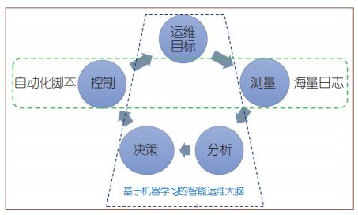
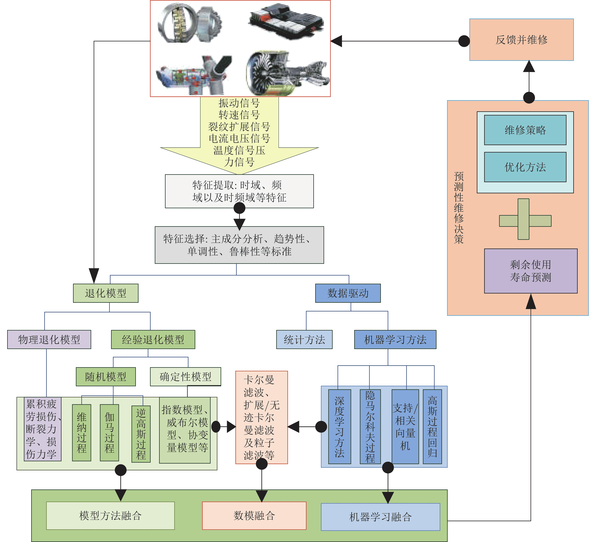
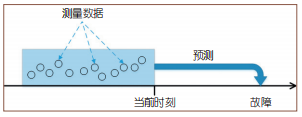
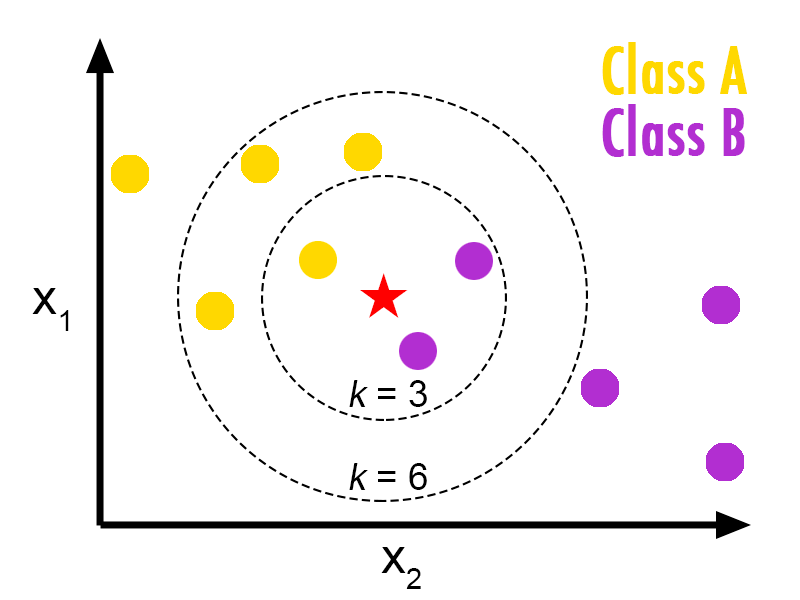
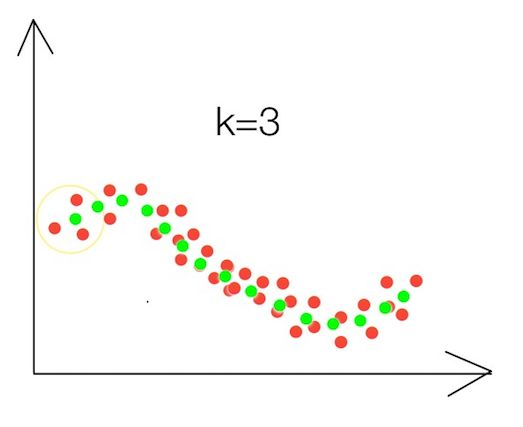
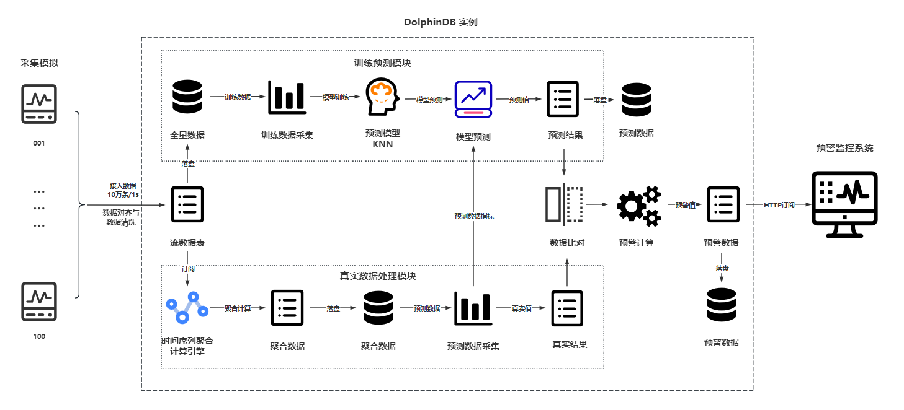
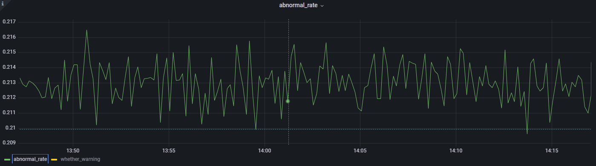

# DolphinDB 机器学习在物联网行业的应用：实时数据异常预警

数据异常预警在工业安全生产中是一项重要工作，对于监控生产过程的稳定性，保障生产数据的有效性，维护生产设备的可靠性具有重要意义。随着大数据技术在生产领域的深入应用，基于机器学习的智能预警已经成为各大生产企业进行生产数据异常预警的一种有效解决方案。=

- [1. 概要](#1-概要)
- [2. 机器学习在物联网中的应用场景](#2-机器学习在物联网中的应用场景)
  - [2.1 工业物联网智能运维](#21-工业物联网智能运维)
  - [2.2 工业设备使用寿命预测](#22-工业设备使用寿命预测)
  - [2.3 工业生产异常数据预警](#23-工业生产异常数据预警)
- [3.KNN](#3knn)
  - [3.1 KNN 介绍](#31-knn-介绍)
  - [3.2 KNN 优势](#32-knn-优势)
  - [3.3 K 值](#33-k-值)
- [4. 解决方案](#4-解决方案)
  - [4.1 场景描述](#41-场景描述)
  - [4.2 架构方案](#42-架构方案)
- [5.实时异常预警](#5实时异常预警)
  - [5.1 处理流程](#51-处理流程)
  - [5.2 实现细节](#52-实现细节)
  - [5.3 Grafana 实时预警监控](#53-grafana-实时预警监控)
- [6. 总结](#6-总结)
- [7. 附录](#7-附录)
  - [7.1 开发环境](#71-开发环境)
  - [7.2 开发脚本](#72-开发脚本)
  - [7.3 参考文献](#73-参考文献)


## 1. 概要

本教程基于一个典型的物联网企业生产场景，利用 DolphinDB 内置的机器学习框架中的 KNN（K-Nearest Neighbor，最经典和最简单的有监督学习方法之一）算法构建回归模型，对实时数据异常预警过程进行模拟。

## 2. 机器学习在物联网中的应用场景

### 2.1 工业物联网智能运维

随着整个物联网系统数据规模的急剧膨胀，以及服务类型的日趋多样化、复杂化，基于人为指定规则的手工运维和在此基础上加入自动化脚本实现的自动化运维已无法满足大规模的运维需求。

为解决人为指定规则带来的弊端，随着智能时代的到来，智能运维的概念逐渐浮出水面。与人为指定规则不同的是，智能运维强调利用机器学习的算法从海量运维数据中总结规则，打破了人为指定规则的局限性。

简而言之，智能运维在自动化运维的基础上加入了机器学习分析数据的环节，监测系统采集运维日志数据，机器学习根据日志数据做出分析并生成决策，最后指挥自动化脚本去执行决策，从而达到运维系统的整体目标。



### 2.2 工业设备使用寿命预测

工业设备的损耗和故障在长期运作过程中是难以避免的，如果不能有效监控设备损耗情况的数据变化和应对可能发生的故障，将造成生产中断、经济损失，甚至危害公众安全，造成人员伤亡。如果能对设备故障进行预警并提前制定应对方案，将保障设备可靠性和安全性，提高生产效率，实现利益最大化。

设备剩余使用寿命预测旨在根据设备的运行状态数据，结合设备的退化机理，利用人工智能技术对设备未来的故障发生时段进行预测。若能提前预测出设备的剩余使用寿命，在设备故障发生前进行预警，就能帮助维护人员及早制定出最优应对方案。




### 2.3 工业生产异常数据预警

异常数据预警在工业生产中是一个相当重要的环节，已有越来越多的企业将其纳入生产安全保障过程中的一个必要环节。其对于监控设备的生产环境，维护生产数据的价值性，提高生产效率具有重要意义。

异常数据预警具体实现：通过采集历史数据，利用自定算法或机器学习算法分析历史数据特征并预测未来数据，最后根据特定的预警规则对未来数据进行预警判断。



## 3.KNN

### 3.1 KNN 介绍

KNN ( K-NearestNeighbor ) 算法又叫 K 邻近算法，是一种比较简单的机器学习算法。该算法是一种监督学习算法，即可以用于分类任务，也可以用于回归任务。

- 监督学习算法：算法的输入数据带有标签。
- 分类任务：算法的结果为一个决策面，输出数据为离散数据。
- 回归任务：算法的结果为一条拟合线，输出数据为连续数据。

KNN 分类算法思路：设置近邻个数 K，如果一个样本在特征空间中的 K 个邻近样本中的大多数属于某一个类别，则该样本也属于这个类别。



KNN 回归算法思路：设置近邻个数 K，计算一个样本在特征空间中的 K 个近邻样本的平均值，作为该样本的预测值。




### 3.2 KNN 优势

- 模型简单，无需过多调参就可以得到一个不错的性能。
- 精度高。
- 对异常值不敏感。
- 无数据输入假定。

### 3.3 K 值

#### 3.3.1 评估指标

对于回归任务，这里选择一个常用的回归评估指标：根均方误差（Root Mean Square Error, RMSE）。

RMSE 指标可以评价数据的变化程度，RMSE 越小，说明模型的拟合实验数据能力越强。


#### 3.3.2 K 值的选择

K 值选择过小，容易造成模型过拟合；K 值选择过大，容易造成模型欠拟合。

RMSE 越小，模型的拟合效果越好。本场景经过多次实验，最终实验的 K 值选择为 200。

| **K 值** | **平均 RMSE** |
| -------- | ------------- |
| 1        | 1.34          |
| 5        | 1.16          |
| 10       | 1.12          |
| 50       | 1.18          |
| 100      | 1.07          |
| **200**  | **1.00**      |
| 300      | 1.32          |
| 500      | 1.56          |
| 1000     | 1.62          |

## 4. 解决方案

DolphinDB 是由浙江智臾科技有限公司研发的一款高性能分布式时序数据库，集成了功能强大的编程语言和高容量高速度的流数据分析系统。针对用户对工业生产中异常数据预警的需求，本文提供了一个完整的解决方案，帮助用户掌握如何使用 DolphinDB 预警异常数据，以便更好地保障工业生产安全。

### 4.1 场景描述

生产场景为一个大型风电厂的发电量监控场景，风机监控人员需要实时监控发电量的平稳性，当检测到风机发电量出现异常时，监控人员需要远程实时调整风机参数以维持发电量的平稳。

为提前感知发电异常及时调整风机参数，风机工厂现决定利用影响风机发电的主要因素的监测数据，对未来一段时间的风机发电量进行预测，并将未来发电量与当前发电量进行异常比对。当异常率超过一定阈值时向风机监控人员远程报警。为了便于理解 DolphinDB 如何实现机器学习，本章简化了复杂的真实场景，只使用 5 个指标：风速、湿度、气压、温度和设备使用寿命，来进行指代。同时，由于生产数据的敏感性，进行了 DolphinDB 数据仿真操作，使用模拟数据代替真实记录集。

- 设备数目：100 台
- 时间单位：毫秒级（1 ms = 0.001 s）
- 单台设备采集数据传输量：1 条/ms
- 总采集数据传输量：10 万条/s

数据形式：

| **列名**      | **列类型** | **实例**                | **说明**     |
| ------------- | ---------- | ----------------------- | ------------ |
| time          | TIMESTAMP  | 2023.01.08 21:21:56.744 | 时间         |
| deviceCode    | INT        | 5                       | 设备号       |
| wind          | DOUBLE     | 25.0                    | 风速         |
| humidity      | DOUBLE     | 55.0                    | 湿度         |
| air_pressure  | DOUBLE     | 1.01325                 | 气压         |
| temperature   | DOUBLE     | 75.0                    | 温度         |
| life          | INT        | 3                       | 设备使用寿命 |
| propertyValue | INT        | 65                      | 监测值       |

### 4.2 架构方案

由于真实生产场景的私密性和真实生产数据的敏感性，以及为了方便理解，除实验设置的数据生产场景有所简化外，其余场景都将与真实生产场景保持一致。

当生产任务开启后，模型预测任务与预警计算任务将同步开启。运维人员可登录 Grafana，实时监控异常情况，并根据预警结果实时调整风机设备参数。

#### 4.2.1 模型预测场景

模型预测场景流程设计如下：

1. 每 10 秒钟用前 10 秒采集到的 100 万条数据，训练出一个 KNN 回归模型。
2. 用前 10 秒的 100 万条数据，进行聚合计算，将 10 秒产生的 100 万条数据聚合成 1 秒产生的 10 万条数据。
3. 用 KNN 模型 对聚合数据（10 万条）进行预测，预测未来第 10s 的数据（10 万条）。
4. 将未来第 10s 的数据（10 万条）与 10s 聚合的数据（10 万条）输入预警模块进行预警计算。

#### 4.2.2 预警计算场景

预警计算场景流程设计如下：

1. 未来第 10s 的数据 (10 万条) 与 10s 聚合的数据 (10 万条）进行比对，值差异大于 20% （即 ABS(预测值 - 真实值)/真实值大于 0.2）列为异常数据。
2. 统计异常率（异常数据的比例）：异常数据数目/比对总数（10w） 。
3. 设定阈值 0.215，当异常率超过阈值 0.215 时，进行报警。

## 5.实时异常预警

### 5.1 处理流程



### 5.2 实现细节

#### 5.2.1 实时数据模拟

用户可以利用下方代码完成实时生产数据的模拟。可以通过调整变量 `hour` ,自定义生产多少小时数据。

由于数据为模拟数据，为了保证模型能够完成数据拟合，这里提前设定监测值与 5 个影响因素的关系为线性关系，以确保回归模型拟合的关系能够收敛。

另外，为了模拟模型生成的预测值与真实值存在一定差异，方便进行异常比对，因此在代码中，对线性参数进行了随机化，以降低模型的准确率。用户真实场景中可自行调整参数方差大小，以控制模型准确率。简言之，方差越小，模型拟合越高，模型精度越高。

```python
orgColNames= `time`deviceCode`wind`humidity`air_pressure`temperature`life`propertyValue
orgColTypes = [TIMESTAMP,INT,DOUBLE,DOUBLE,DOUBLE,DOUBLE,INT,INT]
enableTableShareAndPersistence(table = streamTable(10000:0, orgColNames,orgColTypes), tableName=`dataTable, cacheSize = 6000000) 

def send_data(begintime,endtime,hour,devices_number,rate,mutable dest)
{

    btime=timestamp(begintime)
	do{
        seconds  = int(60*60*hour)  //定义需要压入的批次，每秒钟1批

        n = devices_number * rate* 1 // 每秒钟生产10万条数据
        time =sort(take(btime+(0..(1000-1)),n)) //
        deviceCode = take(1..devices_number,n)
        x1 = randNormal(25,2,n)  
        x2 = randNormal(55,5,n)
        x3 = randNormal(1.01325,0.00001,n)
        x4 = randNormal(75,5,n)
        x5 = int(randNormal(10,3,n))
        b1 = randNormal(0.4,0.05,n) //方差0.05 降低模型准确率
        b2 = randNormal(0.3,0.05,n)
        b3 = randNormal(0.2,0.05,n)
        b4 = randNormal(0.09,0.05,n)
        b5 = randNormal(0.01,0.001,n)
        bias = randNormal(5,1,n)
        propertyValue = int(b1*x1*10 + b2*x2*2 + b3*x3*1000 + b4*x4 + b5*x5 +bias)

        table_ps = table(time,deviceCode,x1,x2,x3,x4,x5,propertyValue)
        dest.append!(table_ps)

        btime=btime+1000
        etime=timestamp(now())
        timediff=btime-etime
        if(timediff>0){sleep(timediff)}
    }while(btime<=endtime)
}
hour = 0.5 //用户自定义压入多少小时的数据,1 为 1个小时
devices_number = 100 //设备数目
rate = 1000 //每台设备 每秒钟1000条数据
begintime = datetime(now()) //开始时间
endtime = begintime + int(hour * 3600-1)  //结束时间
submitJob(`send_data_to_kafka,`send_data_to_kafka,send_data,begintime,endtime,hour,devices_number,rate,dataTable) 
```

#### 5.2.2 聚合计算

聚合计算通过 DolphinDB 内置的时间序列引擎 `createTimeSeriesEngine` 实现。订阅数据表 `dataTable` 中的数据，将数据内容输入聚合引擎 `tradesAggregator` 完成预警计算，最后将聚合计算结果存入聚合表 `aggrTable` 。

```python
enableTableShareAndPersistence(table = streamTable(100000:0,orgColNames,orgColTypes), tableName=`aggrTable, cacheSize = 5000000) 

tradesAggregator = createTimeSeriesEngine(name="streamAggr", windowSize=10, step=10, metrics=<[avg(wind),avg(humidity),avg(air_pressure),avg(temperature),avg(life),avg(propertyValue)]>, dummyTable=dataTable, outputTable=aggrTable, timeColumn=`time, useSystemTime=false, keyColumn=`deviceCode, garbageSize=1000000)

subscribeTable(tableName="dataTable", actionName="Aggregator", offset=0, handler=append!{tradesAggregator}, msgAsTable=true)
```

#### 5.2.3 数据持久化

订阅数据表 `dataTable` 中的内容，将流表数据存入分布式数据库 `dfs://Data` 中。

```python
/*
  * 将dataTable数据写入分布式表 

	数据建模：
	1）每小时记录数：360,000,000
	2）每条记录大小：46字节
	3）每小时空间占用（压缩前）：15.42G
	4）建议以“Id”值和“小时”进行组合分区，每分区≈157.93M
	5）分区索引为“时间戳”+“设备号”

  */
 def createConsumerDataBase(dbname,tbname,col_names,col_types){
    dbTime = database("",VALUE,datehour(2023.01.01T00:00:00)..datehour(2023.01.01T23:00:00))
    Ids = 1..100
    dbId = database("",VALUE,Ids)
    db = database(directory=dbname, partitionType=COMPO, partitionScheme=[dbTime,dbId],engine="TSDB")
    factor_partition = db.createPartitionedTable(table=table(1:0,col_names,col_types),tableName = tbname,partitionColumns = ["time","deviceCode"],sortColumns =["deviceCode","time"],compressMethods={time:"delta"},keepDuplicates=LAST)
}
dataTable_dbname,dataTable_tbname = "dfs://Data","data"
createConsumerDataBase(dataTable_dbname,dataTable_tbname,orgColNames,orgColTypes)
subscribeTable(tableName="dataTable", actionName="append_data_into_dfs", offset=0, handler=loadTable(dataTable_dbname,dataTable_tbname), msgAsTable=true,batchSize=100000, throttle=1, reconnect=true)
```

订阅聚合表 `aggrTable` 中的内容，将流表数据存入分布式数据库 `dfs://Aggregate` 中。

```python
/*
  * 将聚合计算结果写入分布式表
	数据建模：
		1）每小时记录数：36,000,000
		2）每条记录大小：46字节
		3）每小时空间占用（压缩前）：1.54G
		4）建议以“id”和“天”进行值分区，每分区≈ 379.03M
		5）分区索引为“时间戳”+“设备号”

  */
def createAggregateDataBase(dbname,tbname,col_names,col_types){
	if(existsDatabase(dbname)){dropDatabase(dbname)}
	Ids = 1..100
    dbId = database("",VALUE,Ids)
    dbTime = database("",VALUE,date(2023.01.01T00:00:00)..date(2023.12.31T20:00:00))
	db = database(directory=dbname, partitionType=COMPO, partitionScheme=[dbTime,dbId],engine="TSDB")
	factor_partition = db.createPartitionedTable(table=table(1:0,col_names,col_types),tableName = tbname,partitionColumns =["time","deviceCode"],sortColumns =["deviceCode","time"],compressMethods={time:"delta"},keepDuplicates=LAST)
}
aggr_dbname,aggr_tbname = "dfs://Aggregate","data"
createAggregateDataBase(aggr_dbname,aggr_tbname,orgColNames,orgColTypes)
subscribeTable(tableName="aggrTable", actionName="append_Aggregator_into_dfs", offset=0, handler=loadTable(aggr_dbname,aggr_tbname), msgAsTable=true,batchSize=100000, throttle=1, reconnect=true)
```

#### 5.2.4 模型预测与预警计算

用户可以利用下方代码完成模型预测与预警计算操作。

在进行模型预测与预警计算以前，需提前建立预测表 `predictTable` 与预警表 `warningTable` 以存储预测数据与预警数据。

由于模型训练需要用到 10s 数据，因此设定 10s 为一个周期，每 10s 进行一次模型训练、模型预测以及预警计算。

关于预警计算，设定预测值与聚合值的值差异大于 20% 时（即预测值大于真实值 20% 或预测值小于真实值 20%）判定为异常值，当异常率大于 0.215 时进行预警。用户可根据需求自行调整。

```python
//新建预测表
 preColNames = `time`deviceCode`wind`humidity`air_pressure`temperature`propertyValue_predicted
 preColTypes = orgColTypes
 enableTableShareAndPersistence(table = streamTable(100000:0,preColNames,preColTypes), tableName=`predictTable, cacheSize = 5000000)

 //新建预警表
 warnColNames = `time`abnormal_rate`whether_warning
 warnColTypes = [TIMESTAMP,DOUBLE,INT]
 enableTableShareAndPersistence(table = streamTable(100000:0,warnColNames,warnColTypes), tableName=`warningTable, cacheSize = 5000000)

/*
 * 根据 已有周期数据，对未来数据进行预测
 */
 def predictAndwarning(devices_number,rate,interval_past,interval_future,warning_threshold,mutable whether_start,DataTable_dfs,AggrTable_dfs,mutable predictTable,mutable warningTable){
    do{
      if(whether_start==false) {
        curtime = select top 1 time from DataTable_dfs  //第一次是从表中查询最开始的时间
        curtime = curtime[`time][0]
        curtime_aggr = select top 1 time from AggrTable_dfs //每次尽量去与训练数据的时间段同步
        curtime_aggr = curtime_aggr[`time][0]
        whether_start = true
      }
      curtime = curtime + interval_past*1000 //以后是直接往后推，最开始的时间往后推 10s中的间隔时间
      table_origin = select * from DataTable_dfs where time<=curtime and time>(curtime - interval_past*1000) //查询当前时间前 interval 秒的数据
      if(table_origin.size()<interval_past*devices_number*rate) //如果查询数据小于正常查询到的数据数目
      {
        
         curtime = select top 1 time from DataTable_dfs order by time desc //从表中查询最近的时间作为开始时间
         curtime = curtime[`time][0]
         table_origin = select * from DataTable_dfs where time<=curtime and time>(curtime - interval_past*1000) //查询当前时间的前 interval 秒的数据
      }


      //训练模型
      factors = sql(sqlCol([`wind,`humidity,`air_pressure,`temperature]), table_origin).eval()
      labels = table_origin[`propertyValue]
      model = knn(labels,factors,"regressor", 200);


      //模型预测
      curtime_aggr = curtime_aggr + interval_past*1000
      table_aggr = select * from AggrTable_dfs where time<=curtime_aggr and time>(curtime_aggr - interval_past*1000) order by deviceCode	 //查询当前时间前 interval 秒的数据
      if(table_aggr.size()<interval_past*devices_number*rate/10) //如果查询数据小于正常查询到的数据数目
      {
         curtime_aggr = select top 1 time from AggrTable_dfs order by time desc //从表中查询最近的时间作为开始时间
         curtime_aggr = curtime_aggr[`time][0]
         table_aggr = select * from AggrTable_dfs where time<=curtime_aggr and time>(curtime_aggr - interval_past*1000) //查询当前时间的前 interval 秒的数据
      }
      pre_labels = sql(sqlCol([`wind,`humidity,`air_pressure,`temperature]), table_aggr).eval()
      //pre_values = predict(model,pre_labels)
      //////////////////////////////暂时用随机值代替///////////////////////////////////////////
      table_number =  table_aggr.size()
      x1 = randNormal(25,2,table_number)  //训练数据
      x2 = randNormal(55,5,table_number)
      x3 = randNormal(1.01325,0.00001,table_number)
      x4 = randNormal(75,5,table_number)
      x5 = int(randNormal(10,3,table_number))
      b1 = randNormal(0.4,0.05,table_number) 
      b2 = randNormal(0.3,0.05,table_number)
      b3 = randNormal(0.2,0.05,table_number)
      b4 = randNormal(0.09,0.05,table_number)
      b5 = randNormal(0.01,0.001,table_number)
      bias = randNormal(5,1,table_number)
      propertyValue = int(b1*x1*10 + b2*x2*2 + b3*x3*1000 + b4*x4 + b5*x5 +bias)
      pre_values = propertyValue //暂时用随机值代替
      /////////////////////////////////////////////////////////////////////////////////////////////
    
      time =take(curtime_aggr + interval_future*1000+interval_future+(0..(1000-1)),table_number) //
      deviceCode = sort(take(1..devices_number,table_number))
      predicttempTable = table(time,deviceCode,pre_labels,pre_values as `propertyValue_predicted)
      predictTable.append!(predicttempTable) //预测结果导入流表

      //进行预警
      contrastTable = select propertyValue,propertyValue_predicted from lj(table_aggr,predicttempTable,`wind`humidity`air_pressure`temperature) //利用左连接
      abnormal_count = exec count(*) from contrastTable where propertyValue_predicted<0.8*propertyValue or propertyValue_predicted>1.2*propertyValue
      
      warning_time = curtime_aggr //进行预警的时间
      abnormal_rate = abnormal_count*1.0 / table_number
      whether_warning = 0 //默认不进行预警
      if(abnormal_rate>warning_threshold) whether_warning = 1 //当异常率超过阈值进行预警

      insert into warningTable values(warning_time,abnormal_rate, whether_warning);
      
      sleep(10000) //每10s进行一次预测
    }while(true)
}
devices_number = 100 //设备数目
rate = 1000 //每台设备 每秒钟1000条数据
interval_past = 10 ////查询过去10秒的数据
interval_future = 10 //预测未来第10秒的数据
warning_threshold = 0.215 //当异常值率大于0.215时进行预警
whether_start = false //标记
DataTable_dfs = loadTable(dataTable_dbname,dataTable_tbname)
AggrTable_dfs = loadTable(aggr_dbname,aggr_tbname)
submitJob(`predictAndwarning,`predictAndwarning,predictAndwarning,devices_number,rate,interval_past,interval_future,warning_threshold,whether_start,DataTable_dfs,AggrTable_dfs,predictTable,warningTable) //每10s 预测一次
```

### 5.3 Grafana 实时预警监控

Grafana 是由 Grafana Labs 公司开源的一个系统监测 ( System Monitoring ) 工具。

DolphinDB 开发了 Grafana 数据源插件，用户在 Grafana 面板上通过编写查询脚本、订阅流数据表的方式，与 DolphinDB 进行交互，实现 DolphinDB 时序数据的可视化。具体操作可参考：[DolphinDB Grafana DataSource Plugin](https://gitee.com/dolphindb/grafana-datasource/blob/master/README.zh.md) 。

Grafana 中的 Query 代码：

```
select * from warningTable
```

点击 **abnormal_rate**，查看各时间段的异常率。



点击 **whether_warning**，查看各时间段的预警情况。0 不进行预警，1 进行预警。


## 6. 总结

本教程以大型风电厂的发电量监控需求为例，利用 DolphinDB 内置机器学习框架中的 KNN 算法构建回归模型，实现了风机发电量的实时预警，从而帮助运维人员及时调整风机设备参数，更好地保障生产安全。此教程同样可为物联网行业中有数据模拟、机器学习模型训练、实时预测、预警计算等需求的用户提供一份参考。

## 7. 附录

### 7.1 开发环境

- 操作系统：Linux version 3.10.0-1160.el7.x86_64
- CPU: Intel(R) Xeon(R) Gold 5220R CPU @ 2.20GHz 64 核
- 内存：503G
- 磁盘：SSD 3.5T
- 服务器端：DolphinDB 2.00.7
- 客户端：VSCode 1.73（extension for DolphinDB v2.0.802）

### 7.2 开发脚本

**环境清理脚本**

用途：在每次执行项目前，先进行环境清理

```python
//登录
login(`admin,`123456)
version()

//取消后台任务
def cancelAllBatchJob(){
jobids=exec jobid from getRecentJobs() where endTime=NULL
cancelJob(jobids)
}
pnodeRun(cancelAllBatchJob)

t = getStreamingStat().pubTables
for(row in t){
	tableName = row.tableName
  if(row.actions[0]=='[') actions = split(substr(row.actions, 1, (strlen(row.actions)-2)), ",")
	else actions = split(substr(row.actions, 0, strlen(row.actions)), ",")
	for(action in actions){
		unsubscribeTable(tableName=tableName, actionName=action)
	}
}

//删除流表
try{dropStreamTable(`dataTable)}catch(ex){}
try{dropStreamTable(`aggrTable)}catch(ex){}
try{dropStreamTable(`predictTable)}catch(ex){}
try{dropStreamTable(`warningTable)}catch(ex){}

//删除计算引擎
try{dropStreamEngine("streamAggr")}catch(ex){}

//清理缓存
undef(all)
clearAllCache()

//清空数据库，环境初始化
if(existsDatabase("dfs://Data")){dropDatabase("dfs://Data")}
if(existsDatabase("dfs://Aggregate")){dropDatabase("dfs://Aggregate")}
if(existsDatabase("dfs://predict")){dropDatabase("dfs://predict")}
if(existsDatabase("dfs://warning")){dropDatabase("dfs://warning")}
```

**预测数据与预警数据持久化脚本**

用途：将流表中的预测数据和预警数据持久化到分布式表

```python
/*
  * 将预测结果写入分布式表
	数据建模：
		1）每小时记录数：36,000,000
		2）每条记录大小：46字节
		3）每小时空间占用（压缩前）：1.54G
		4）建议以“id”和“天”进行值分区，每分区≈ 379.03M
		5）分区索引为“时间戳”+“设备号”

*/
def createPredictDataBase(dbname,tbname,col_names,col_types){
	if(existsDatabase(dbname)){dropDatabase(dbname)}
	Ids = 1..100
  dbId = database("",VALUE,Ids)
  dbTime = database("",VALUE,date(2023.01.01T00:00:00)..date(2023.12.31T20:00:00))
	db = database(directory=dbname, partitionType=COMPO, partitionScheme=[dbTime,dbId],engine="TSDB")
	factor_partition = db.createPartitionedTable(table=table(1:0,col_names,col_types),tableName = tbname,partitionColumns =["time","deviceCode"],sortColumns =["deviceCode","time"],compressMethods={time:"delta"},keepDuplicates=LAST)
}
predict_dbname,predict_tbname = "dfs://predict","data"
createPredictDataBase(predict_dbname,predict_tbname,preColNames,preColTypes)
subscribeTable(tableName="predictTable", actionName="append_Predict_into_dfs", offset=0, handler=loadTable(predict_dbname,predict_tbname), msgAsTable=true,batchSize=100000, throttle=1, reconnect=true)

/*
  * 将预警结果写入分布式表
	数据建模：
		1）每小时记录数：360
		2）每条记录大小：20字节
		3）每小时空间占用（压缩前）：7200 字节
		4）建议以“年”进行值分区，每分区≈ 60.15M
		5）分区索引为“时间戳”
*/
def createWarningDataBase(dbname,tbname,col_names,col_types){
	if(existsDatabase(dbname)){dropDatabase(dbname)}
  db = database(dbname,RANGE,sort(distinct(yearBegin((2023.01.01T00:00:00..2024.12.31T20:00:00)))),engine='TSDB')
  factor_partition = db.createPartitionedTable(table=table(1:0,col_names,col_types),tableName = tbname,partitionColumns=`time,sortColumns=`time)
}
warning_dbname,warning_tbname = "dfs://warning","data"
createWarningDataBase(warning_dbname,warning_tbname,warnColNames,warnColTypes)
subscribeTable(tableName="warningTable", actionName="append_Warning_into_dfs", offset=0, handler=loadTable(warning_dbname,warning_tbname), msgAsTable=true,batchSize=100000, throttle=1, reconnect=true)
```

### 7.3 参考文献

- 孙海丽，龙翔，韩兰胜，黄炎，李清波。[《工业物联网异常检测技术综述》](http://www.infocomm-journal.com/txxb/CN/10.11959/j.issn.1000-436x.2022032). 通信学报，2022(003):043.
- 裴丹，张圣林，裴昶华。[《基于机器学习的智能运维》](https://www.ccf.org.cn/c/2017-12-13/620954.shtml). 中国计算机学会通讯，2017, 013(012):68-72.
- 王加昌，郑代威，唐雷，郑丹晨，刘梦娟。[《基于机器学习的剩余使用寿命预测实证研究》](https://www.jsjkx.com/CN/10.11896/jsjkx.211100285). 计算机科学，2022, 49(11A): 211100285-9. 