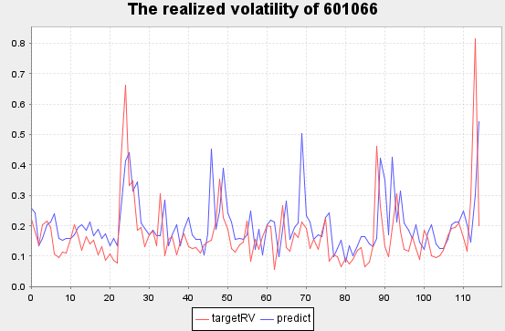
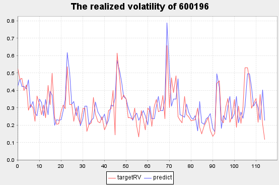
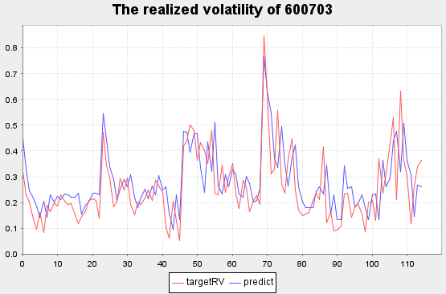
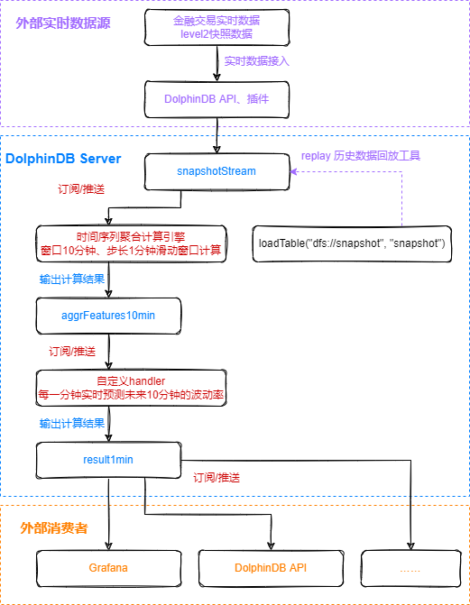
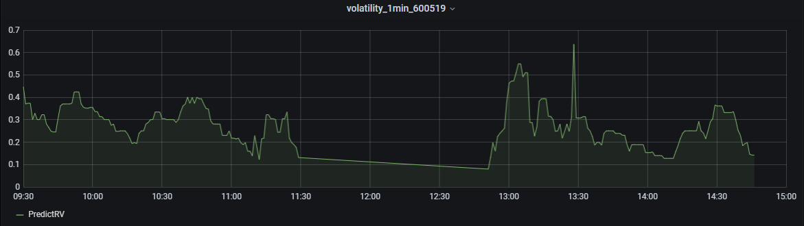

# DolphinDB 机器学习在金融行业的应用：实时实际波动率预测

波动率是衡量价格在给定时间内上下波动的程度。在股指期货实时交易的场景中，如果能够快速、准确地预测未来一段时间的波动率，对交易者及时采取有效的风险防范和监控手段具有重要意义。本教程受 [Kaggle](https://www.kaggle.com) 的[Optiver Realized Volatility Prediction 竞赛项目](https://www.kaggle.com/competitions/optiver-realized-volatility-prediction/overview/description)的启发，完全基于 DolphinDB 时序数据库，实现了中国股市全市场高频快照数据的存储、数据预处理、模型构建和实时波动率预测的应用场景开发。

本教程使用上证 50 成分股 2020 年的 level2 快照数据，构建频率为 10 分钟的高频交易特征（价差、深度不平衡指标、加权平均价格、买卖压力指标、实际波动率）作为模型输入，将未来 10 分钟的波动率作为模型输出，利用 DolphinDB 内置机器学习框架中支持分布式计算的 [adaBoostRegressor](./machine_learning.md#附录dolphindb机器学习函数) 算法构建回归模型，使用根均方百分比误差（Root Mean Square Percentage Error, RMSPE）作为评价指标，最终实现了测试集 RMSPE=1.701 的拟合效果，下图展示了波动率预测结果。本教程示例代码必须在 **1.30.18** 及以上版本和 **2.00.6** 及以上版本的 DolphinDB server 上运行。



将训练后的模型持久化在 DolphinDB 服务端，结合 DolphinDB 流数据处理框架，实时预测上证 50 成分股未来十分钟的实际波动率。

本教程包含内容：

- [DolphinDB 机器学习在金融行业的应用：实时实际波动率预测](#dolphindb-机器学习在金融行业的应用实时实际波动率预测)
  - [1. Snapshot 数据文件结构](#1-snapshot-数据文件结构)
  - [2. 数据预处理](#2-数据预处理)
    - [2.1 数据样本选择](#21-数据样本选择)
    - [2.2 特征工程](#22-特征工程)
    - [2.3 数据预处理效率](#23-数据预处理效率)
  - [3. 模型构建](#3-模型构建)
    - [3.1 建立训练集和测试集](#31-建立训练集和测试集)
    - [3.2 训练及评价](#32-训练及评价)
    - [3.3 结果数据可视化](#33-结果数据可视化)
  - [4. 实时波动率预测](#4-实时波动率预测)
    - [4.1 流处理流程](#41-流处理流程)
    - [4.2 快速复现流处理](#42-快速复现流处理)
    - [4.3 Grafana 实时监控](#43-grafana-实时监控)
    - [4.4 实时预测延时统计](#44-实时预测延时统计)
  - [5. 总结](#5-总结)
  - [附录](#附录)

## 1. Snapshot 数据文件结构

本教程应用的数据源为上交所 level2 快照数据（Snapshot），每幅快照间隔时间为 3 秒或 5 秒，数据文件结构如下：

| 字段         | 含义   | 字段               | 含义    | 字段                | 含义   |
| ---------- | ---- | ---------------- | ----- | ----------------- | ---- |
| SecurityID | 证券代码 | LowPx            | 最低价   | BidPrice[10]      | 申买十价 |
| DateTime   | 日期时间 | LastPx           | 最新价   | BidOrderQty[10]   | 申买十量 |
| PreClosePx | 昨收价  | TotalVolumeTrade | 成交总量  | OfferPrice[10]    | 申卖十价 |
| OpenPx     | 开始价  | TotalValueTrade  | 成交总金额 | OfferOrderQty[10] | 申卖十量 |
| HighPx     | 最高价  | InstrumentStatus | 交易状态  | ……                | ……   |

## 2. 数据预处理

2020 年上交所所有证券的 Snapshot 数据已经提前导入至 DolphinDB 数据库中，一共约 28.75 亿条快照数据，导入方法见 [股票行情数据导入实例](./stockdata_csv_import_demo.md)，一共 174 列。

### 2.1 数据样本选择

本教程用到的字段为 Snapshot 中的部分字段，包括: 股票代码、快照时间、申买十价、申买十量、申卖十价、申卖十量。

样本为 2020 年上证 50 指数的成分股：

* 股票代码

  ```tex
  601318,600519,600036,600276,601166,600030,600887,600016,601328,601288,
  600000,600585,601398,600031,601668,600048,601888,600837,601601,601012,
  603259,601688,600309,601988,601211,600009,600104,600690,601818,600703,
  600028,601088,600050,601628,601857,601186,600547,601989,601336,600196,
  603993,601138,601066,601236,601319,603160,600588,601816,601658,600745
  ```
<!--
* 股票名称

  ```tex
  中国平安、贵州茅台、招商银行、恒瑞医药、兴业银行、中信证券、伊利股份、民生银行、交通银行、农业银行、
  浦发银行、海螺水泥、工商银行、三一重工、中国建筑、保利地产、中国中免、海通证券、中国太保、隆基股份、
  药明康德、华泰证券、万华化学、中国银行、国泰君安、上海机场、上汽集团、海尔智家、光大银行、三安光电、
  中国石化、中国神华、中国联通、中国人寿、中国石油、中国铁建、山东黄金、中国重工、新华保险、复星医药、
  洛阳钼业、工业富联、中信建投、红塔证券、中国人保、汇顶科技、用友网络、京沪高铁、邮储银行、闻泰科技
  ```
-->
### 2.2 特征工程

* **Bid Ask Spread(BAS)**：用于衡量买单价和卖单价的价差


* **Weighted Averaged Price(WAP)**：加权平均价格


* **Depth Imbalance(DI)**：深度不平衡


* **Press**：买卖压力指标

}}{{\sum\limits_{j=0}^9WAP\div({Price_j}-WAP)}})


-\log(AskPress))

**特征数据重采样（10min 窗口，并聚合计算实际波动率）**

重采样利用 ```group by SecurityID, interval(TradeTime, 10m, "none")``` 方法

**Realized Volatility(RV)**：实际波动率定义为对数收益率的标准差


股票的价格始终是处于买单价和卖单价之间，因此本项目用加权平均价格来代替股价进行计算


^2}}{n-1}})

由于日常用法为年化的股票波动率，因此需要对其进行年化，得到年化实际波动率


使用的数据频率是 snapshot 级别，其年化方法需要将标准差乘以全年的 snapshot 数的平方根。

### 2.3 数据预处理效率

#### 2.3.1 OLAP 存储引擎

[数据预处理代码-OLAP](./script/machine_learning_volatility/01.dataProcess.txt)

数据预处理效率：

* 分布式表数据总量：2,874,861,174

* 上证 50 指数的成分股数据量：58,257,708
* 处理后的结果表数据量：267,490
* 逻辑 CPU 核数：8
* 耗时：450 秒

#### 2.3.2 TSDB 存储引擎

[数据预处理代码-TSDB](./script/machine_learning_volatility/02.dataProcessArrayVector.txt)

TSDB 存储引擎作为 DolphinDB2.00 新特性，其下创建的分布式表的数据类型支持了 Array Vector。与 OLAP 存储引擎相比，在 TSDB 分布式表中，申买十价、申买十量、申卖十价、申卖十量可以使用 [Array Vector](https://www.dolphindb.cn/cn/help/DataTypesandStructures/DataForms/Vector/arrayVector.html) 存储，原 40 列数据合并为 4 列存储，在数据压缩率、数据查询和计算性能上都会有大幅提升。

数据预处理效率：

* 分布式表数据总量：2,874,861,174
* 上证 50 指数的成分股数据量：58,257,708
* 处理后的结果表数据量：267,490
* 逻辑 CPU 核数：8
* 耗时：40 秒

由测试结果可以看出，采用 TSDB 存储引擎的 Array Vector 存储申买十价、申买十量、申卖十价、申卖十量，计算速度是 OLAP 存储引擎的 11 倍。

## 3. 模型构建

[模型构建和训练代码](./script/machine_learning_volatility/03.modelBuildingTraining.txt)

[机器学习模型](./machine_learning.md#%E9%99%84%E5%BD%95dolphindb%E6%9C%BA%E5%99%A8%E5%AD%A6%E4%B9%A0%E5%87%BD%E6%95%B0) 选择 [adaBoostRegressor](https://www.dolphindb.cn/cn/help/FunctionsandCommands/FunctionReferences/a/adaBoostRegressor.html)

评价指标：根均方百分比误差（Root Mean Square Percentage Error, RMSPE）

^2}{{{y_i}^2}}}})

**注意事项：**

- DolphinDB 机器学习函数中除了 ols, pca, multinomialNB, kmeans, knn 外，输入均为 [sqlDS 函数](https://www.dolphindb.cn/cn/help/FunctionsandCommands/FunctionReferences/s/sqlDS.html) 生成的数据源。sqlDS 指定的数据源对象可以是内存表，也可以是存储在磁盘上的分布式表。对于支持分布式计算的机器学习训练函数，sqlDS 指定分布式表为数据源时，系统会自动将计算任务拆解到数据所在服务器，调用集群资源完成分布式计算。
- `adaBoostRegressor` 训练返回结果为字典，包含以下 key：numClasses, minImpurityDecrease, maxDepth, numBins, numTrees, maxFeatures,  model, modelName, xColNames, learningRate 和 algorithm 。其中 model 是一个元组，保存了训练生成的树；modelName 为 "AdaBoost Classifier"。
- `adaBoostRegressor` 生成的模型可以作为 [predict 函数](https://www.dolphindb.cn/cn/help/FunctionsandCommands/FunctionReferences/p/predict.html) 的输入进行预测应用。


### 3.1 建立训练集和测试集

本项目中没有设置验证集，训练集测试集划分：train:test = 172029:73726
```
login("admin", "123456")
dbName = "dfs://sz50VolatilityDataSet"
tbName = "sz50VolatilityDataSet"
dataset = select * from loadTable(dbName, tbName) where date(TradeTime) between 2020.01.01 : 2020.12.31
def trainTestSplit(x, testRatio) {
	xSize = x.size()
	testSize =(xSize * (1-testRatio))$INT
	return x[0: testSize], x[testSize:xSize]
}
Train, Test = trainTestSplit(dataset, 0.3)
```
### 3.2 训练及评价
```
def RMSPE(a,b)
{
	return sqrt(sum(((a-b)\a)*((a-b)\a))\a.size())
}
model = adaBoostRegressor(sqlDS(<select * from Train>), yColName=`targetRV, xColNames=`BAS`DI0`DI1`DI2`DI3`DI4`Press`RV, numTrees=30, maxDepth=16, loss=`square)
predicted = model.predict(Test)
Test[`predict]=predicted
print("RMSPE="+RMSPE(Test.targetRV,predicted))
```
运行结果：

```
RMSPE=1.701
模型训练耗时：25s
```
**调参记录表**

| RMSPE     | trainTime(ms) | treeNum | maxDepth | features               |
| --------- | ------------- | ------- | -------- | ---------------------- |
| 4.915     | 73240.025     | 60      | 20       | BAS,DI0-4,Press        |
| 2.494     | 204696.819    | 60      | 32       | BAS,DI0-9,Press,RV     |
| 2.778     | 323223.908    | 100     | 32       | BAS,DI0-9,Press,RV     |
| 4.841     | 177327.831    | 60      | 32       | BAS,DI0-9,Press        |
| 2.636     | 158605.04     | 60      | 32       | BAS,DI0-4,Press,RV     |
| 1.974     | 51815.428     | 60      | 16       | BAS,DI0-4,Press,RV     |
| **1.701** | **24782.163** | **30**  | **16**   | **BAS,DI0-4,Press,RV** |
| 1.878     | 13719.563     | 16      | 16       | BAS,DI0-4,Press,RV     |
| 2.152     | 6854.556      | 8       | 16       | BAS,DI0-4,Press,RV     |

**回归模型预测性能**

| 数据量（条） | 模型预测时间（ms） |
| ------ | ---------- |
| 1      | 0.614      |
| 10     | 2.271      |
| 100    | 11.446     |
| 1000   | 96.713     |
| 10000  | 959.438    |

通过如上统计可以得出数据量越大，利用 DolphinDB 进行数据处理及模型预测的优势越明显，在实时流处理场景中，可以在短时间内得到计算结果。

### 3.3 结果数据可视化
将 Test 表随机选择一支股票，展示 2020.10.19~2020.10.23 期间波动率预测情况。
```
stock_id=(select distinct(SecurityID) from Test)[rand(50,1)[0]].distinct_SecurityID
plot((select  targetRV,predict from Test where SecurityID=stock_id, date(TradeTime) between 2020.10.19 : 2020.10.23), title="The realized volatility of"+stock_id,extras={multiYAxes: false})
```

<font color=#FF0000> 红色线条为真实值 </font>

<font color=#0000FF> 蓝色线条为预测值 </font>

复星医药 [600196] 部分实际波动率预测结果



三安光电 [600703] 部分实际波动率预测结果



## 4. 实时波动率预测
### 4.1 流处理流程



第一个订阅：实时获取 `snapshotStream` 表中的数据，利用 DolphinDB 内置时序聚合计算引擎，进行窗口为 10 分钟，步长为 1 分钟的滑动窗口计算，核心代码为：

* 注册时间序列聚合计算引擎

```
createTimeSeriesEngine(name="aggrFeatures10min", windowSize=600000, step=60000, metrics=metrics, dummyTable=snapshotStream, outputTable=aggrFeatures10min, timeColumn=`TradeTime, useWindowStartTime=true, keyColumn=`SecurityID)
```

* 订阅 snapshotStream 流数据表中的实时增量数据

```
subscribeTable(tableName="snapshotStream", actionName="aggrFeatures10min", offset=-1, handler=getStreamEngine("aggrFeatures10min"), msgAsTable=true, batchSize=2000, throttle=1, hash=0, reconnect=true)
```

第二个订阅：实时获取处理完的 `aggrFeatures10min` 表中的特征数据，利用已训练好的模型进行波动率预测，并将最终结果写入 `result1min` 表中，核心代码为：

```
def predictRV(mutable result1min, model, msg){
	startTime = now()
	predicted = model.predict(msg)
	temp = select TradeTime, SecurityID, predicted as PredictRV, (now()-startTime) as CostTime from msg
	result1min.append!(temp)
}
subscribeTable(tableName="aggrFeatures10min", actionName="predictRV", offset=-1, handler=predictRV{result1min, model}, msgAsTable=true, hash=1, reconnect=true)
```

第三个订阅：实时将计算结果表 `result1min` 中的数据推送给外部消费者消费。

[流计算代码 - OLAP-Matrix](./script/machine_learning_volatility/04.streamComputing.txt)

[流计算代码 - TSDB-ArrayVector](./script/machine_learning_volatility/05.streamComputingArrayVector.txt)

### 4.2 快速复现流处理

为了方便用户快速复现实时波动率预测的演示，本教程提供了模型、数据及快速复现流处理代码。下载[相关文件](https://www.dolphindb.cn/downloads/docs/machine_learning_volatility.zip)后解压缩，将模型和数据文件存储在 DolphinDB 服务端，然后修改代码中的相关路径参数，就可以快速复现上述流处理过程。

- 训练好的模型（请根据实际 server 版本进行选择）：
    - v1.30.18：*realizedVolatilityModel_1.30.18.bin*
    - v2.00.6：*realizedVolatilityModel_2.00.6.bin*
- snapshot 数据（*testSnapshot.csv*)：2020年10月19日 601319, 600519 两只股票共 9507 条数据

* [快速复现流处理代码](./script/machine_learning_volatility/06.streamComputingReproduction.txt)

快速复现流处理代码中需要修改模型文件和数据文件的路径

```
/**
modified location 1: modelSavePath, csvDataPath
*/
modelSavePath = "/hdd/hdd9/machineLearning/realizedVolatilityModel_1.30.18.bin"
//modelSavePath = "/hdd/hdd9/machineLearning/realizedVolatilityModel_2.00.6.bin"
csvDataPath = "/hdd/hdd9/machineLearning/testSnapshot.csv"
```

### 4.3 Grafana 实时监控

Grafana 中的 Query 代码：

```
select gmtime(TradeTime), PredictRV from result1min where SecurityID=`600519
```

>  因为 Grafana 和 DolphinDB server 的时间存在 8 个小时时区的差异，所以 Grafana 中的 Query 需要用到 `gmtime` 函数进行时区的转换。



### 4.4 实时预测延时统计

在上证 50 成分股实时预测波动率的实际应用场景中，快照数据的产生频率约为每分钟 1000 条记录，可以对结果表 `result1min` 执行下述语句进行延时统计：

```
select avg(CostTime) as avgCostTime, min(CostTime) as minCostTime, max(CostTime) as maxCostTime from result1min
```

查询结果：

| avgCostTime | minCostTime | maxCostTime |
| ----------- | ----------- | ----------- |
| 13ms        | 7ms         | 18ms        |

## 5. 总结

本教程通过使用 DolphinDB 强大的数据处理能力、易用的机器学习框架和流处理框架，实现了股票波动率的实时预测。与 Python 等传统数据处理、模型构建方法相比，DolphinDB 依靠数据存储引擎和计算引擎的高度融合，在数据预处理和模型训练阶段，方便地实现了分布式并行计算，不仅节约了内存资源，同时也提高了计算效率。

结合 DolphinDB 内置的流计算处理框架，为实际生产环境的类似需求（数据处理、模型训练、实时预测）提供了一套完整高效的解决方案。在本教程中，订阅了上证 50 成分股 level2 快照数据，随着真实数据的产生，可以在 13ms 内完成对每只股票未来 10min 的波动率的预测计算，从而对交易策略做出指导。

## 附录

> 注意事项
>
> * 本教程示例代码必须在 **1.30.18** 及以上版本和 **2.00.6** 及以上版本的 DolphinDB server 上运行。

**脚本**

[数据预处理代码 - OLAP](./script/machine_learning_volatility/01.dataProcess.txt)

[数据预处理代码 - TSDB](./script/machine_learning_volatility/02.dataProcessArrayVector.txt)

[模型构建和训练代码](./script/machine_learning_volatility/03.modelBuildingTraining.txt)

[流计算代码 - OLAP-Matrix](./script/machine_learning_volatility/04.streamComputing.txt)

[流计算代码 - TSDB-ArrayVector](./script/machine_learning_volatility/05.streamComputingArrayVector.txt)

[快速复现流处理代码](./script/machine_learning_volatility/06.streamComputingReproduction.txt)

**模型**

[快速复现流处理模型 V1.30.18](./data/machine_learning_volatility/realizedVolatilityModel_1.30.18.bin)

[快速复现流处理模型 V2.00.6](./data/machine_learning_volatility/realizedVolatilityModel_2.00.6.bin)

**数据**

[快速复现测试流处理 snapshot 数据](./data/machine_learning_volatility/testSnapshot.csv)

**开发环境**

* CPU 类型：Intel(R) Xeon(R) Silver 4216 CPU @ 2.10GHz
* 逻辑 CPU 总数：8
* 内存：64GB
* OS：64位 CentOS Linux 7 (Core)
* 磁盘：SSD 盘，最大读写速率为 520MB/s
* server 版本：1.30.18, 2.00.6
* server 部署模式：单节点
* 1.30 配置文件：[dolphindb.cfg](./script/machine_learning_volatility/130olap/dolphindb.cfg)（volumes, persistenceDir 需要根据实际环境磁盘路径修改）
* 2.00 配置文件：[dolphindb.cfg](./script/machine_learning_volatility/200tsdb/dolphindb.cfg)（volumes, persistenceDir, TSDBRedoLogDir 需要根据实际环境磁盘路径修改）
* 单节点部署教程：[单节点部署](https://gitee.com/dolphindb/Tutorials_CN/blob/master/standalone_server.md)

