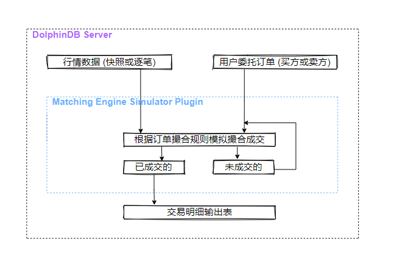
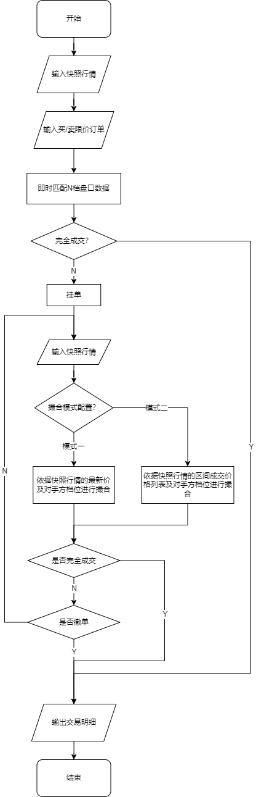
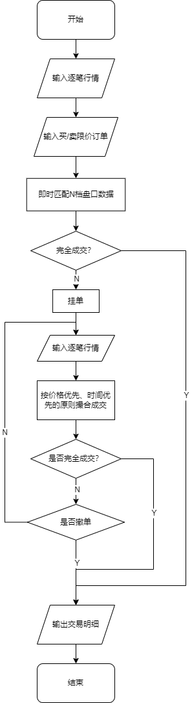
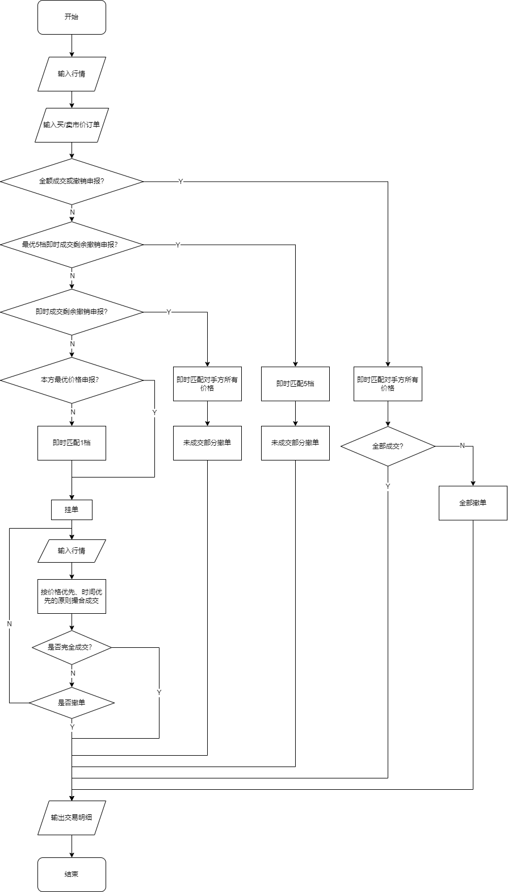
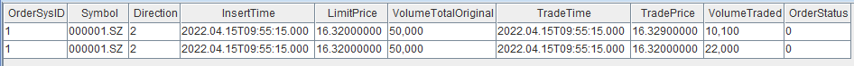
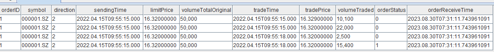
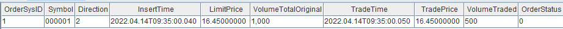
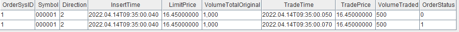
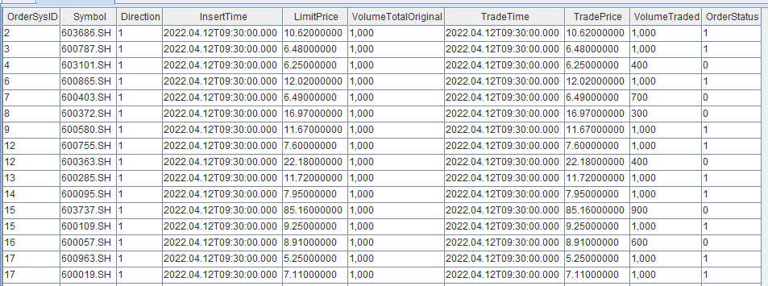

# 模拟撮合引擎使用教程
在中高频策略中，我们常常会遇到这样的情况：一些在回测中表现良好的策略，一旦应用于实际交易，效果就不如预期。其中一个非常重要的原因是低估了交易成本。为了更准确地模拟实际交易中的成本，我们可以在回测过程中引入模拟撮合系统。DolphinDB提供了模拟撮合引擎插件，使我们能够更合理地评估和预测策略在实际交易中的表现，并进行相应的优化。

### 介绍

模拟撮合引擎的主要功能是模拟用户在某个时间点发出订单或取消之前已发出订单的操作，并获取相应的交易结果。不同于DolphinDB Server内置的流数据引擎，模拟撮合引擎是以插件的形式提供服务，逻辑架构如下图所示。



模拟撮合引擎以行情（快照数据或逐笔数据）和用户委托订单（买方或卖方）作为输入，根据订单撮合规则模拟撮合，订单的成交结果（包含部分成交结果、拒绝订单和已撤订单）输出至交易明细输出表，未成交部分等待与后续行情撮合成交或者等待撤单。

- 支持订单成交比例和延时等设置
- 多笔同方向的用户委托订单同时撮合时，遵循按照价格优先、时间优先的原则进行撮合成交

- 行情数据为逐笔数据时，撮合引擎实时合成行情 orderbook，当用户委托订单到达时，与 orderbook 即时匹配并产生成交信息，未成交部分与后续行情委托订单以及成交订单一起，后续按照价格优先、时间优先的原则进行撮合成交。
- 行情数据为快照数据时，当用户委托订单到达时，与 orderbook 即时匹配并产生成交信息，未成交部分根据撮合引擎配置，可以选择与后续的行情快照数据进行撮合成交。
  - 撮合模式一、与最新成交价以及对手方盘口按配置的比例撮合
  - 撮合模式二、与区间的成交列表以及对手方盘口撮合成交

从用户委托订单角度来讲，包含了限价订单（Limit Order）、市价订单（Market Order）、撤单（Cancel Order）。委托订单类型与行情数据类型的不同组合对应着不同的撮合规则，详见后续章节。

### 表结构

创建模拟撮合引擎时，必须指定输入表（行情数据、用户委托订单）与输出表（成交明细）的表结构信息。

对于输入表，模拟撮合引擎要求必须包含指定的字段名称。如果自定义的行情数据表的字段名称与引擎要求不一致，可以通过quotationColMap字典进行映射；同样地，如果自定义的用户委托订单数据表的字段名称与引擎要求不一致，可以通过userOrderColMap字典进行映射。

对于输出表，模拟撮合引擎对于字段名称没有要求。

#### 行情快照数据

对于快照模式，行情表必须提供的列如下：

| **名称**        | **类型**  | **含义**                 |
| --------------- | --------- | ------------------------ |
| symbol          | SYMBOL    | 股票标的                 |
| symbolSource    | SYMBOL    | 证券市场：深交所、上交所 |
| time            | TIMESTAMP | 时间                     |
| lastPrice       | DOUBLE    | 最新价                   |
| upperLimitPrice | DOUBLE    | 涨停板价                 |
| lowerLimitPrice | DOUBLE    | 跌停板价                 |
| totalBidQty     | LONG      | 区间买单成交数量总和     |
| totalOfferQty   | LONG      | 区间卖单成交数量总和     |
| bidPrice        | DOUBLE[]  | 买单价格列表             |
| bidQty          | LONG[]    | 买单数量列表             |
| offerPrice      | DOUBLE[]  | 卖单价格列表             |
| offerQty        | LONG[]    | 卖单数量列表             |
| tradePrice      | DOUBLE[]  | 区间成交价格列表         |
| tradeQty        | LONG[]    | 区间成交数量列表         |

**注意**：

- 在模式二中，必须提供区间成交价格列表（tradePrice）和区间成交数量列表（tradeQty）字段；
- 在模式一中，区间成交价格列表（tradePrice）和区间成交数量列表（tradeQty）并非必须提供的字段。

#### 行情逐笔数据


其中，对于逐笔模式，行情表必须提供的列有

| **名称**     | **类型**  | **含义**                                                     |
| ------------ | --------- | ------------------------------------------------------------ |
| symbol       | SYMBOL    | 股票标的                                                     |
| symbolSource | SYMBOL    | 证券市场：深交所、上交所                                     |
| time         | TIMESTAMP | 时间                                                         |
| sourceType   | INT       | 0代表order；1代表transaction                                 |
| orderType    | INT       | order：<br>1：市价；<br>2：限价；<br>3：本方最优；<br>10：撤单，仅上交所，即上交所撤单记录在order中<br>transaction：<br>0：成交；<br>1：撤单，仅深交所，即深交所撤单记录在transaction中 |
| price        | DOUBLE    | 订单价格                                                     |
| qty          | LONG      | 订单数量                                                     |
| buyNo        | LONG      | transaction对应其原始数据；order填充buyNo                    |
| sellNo       | LONG      | transaction对应其原始数据；order填充sellNo                   |
| direction    | INT       | 1（买）或2（卖）                                             |
| seqNum       | LONG      | 逐笔数据序号                                                 |


用户订单表必须提供的列有

| **名称**  | **类型**  | **含义**                                                     |
| --------- | --------- | ------------------------------------------------------------ |
| symbol    | SYMBOL    | 股票标的                                                     |
| time      | TIMESTAMP | 时间                                                         |
| orderType | INT       | 上交所：<br>0：市价单中最优五档即时成交剩余撤销委托订单<br>1：市价单中最优五档即时成交剩余转限价委托订单<br>2：市价单中本方最优价格委托订单<br>3：市价单中对手方最优价格委托订单<br>5：限价单<br>6：撤单<br>深交所：<br>0：市价单中最优五档即时成交剩余撤销委托订单<br>1：市价单中即时成交剩余撤销委托订单<br>2：市价单中本方最优价格委托订单<br>3:   市价单中对手方最优价格委托订单<br>4：市价单中全额成交或撤销委托订单<br>5：限价单<br>6：撤单 |
| price     | DOUBLE    | 委托订单价格                                                 |
| qty       | LONG      | 委托订单数量                                                 |
| direction | INT       | 1（买） 或 2（卖）                                           |
| orderID   | LONG      | 用户订单ID，仅撤单时起作用                                   |

成交明细结果输出表tradeOutputTable，引擎把委托订单的成交结果插入到此表中。可按以下顺序定义成交明细表（名称可以修改，每个字段有其特定的含义，所以字段类型的顺序不能改变；注意，后3列只在配置项timeDetail为1时启用）：

| **名称**            | **类型**      | **含义**                                                     |
| ------------------- | ------------- | ------------------------------------------------------------ |
| orderID             | LONG          | 成交的用户订单ID                                             |
| symbol              | SYMBOL        | 股票标的                                                     |
| direction           | INT           | 1（买） 或 2（卖）                                           |
| sendingTime         | TIMESTAMP     | 订单发送时间                                                 |
| limitPrice          | DOUBLE        | 委托价格                                                     |
| volumeTotalOriginal | LONG          | 订单委托数量                                                 |
| tradeTime           | TIMESTAMP     | 成交时间                                                     |
| tradePrice          | DOUBLE        | 成交价格                                                     |
| volumeTraded        | LONG          | 成交量                                                       |
| orderStatus         | LONG          | 用户订单是否完全成交-1：表示订单被拒绝0：表示订单部分成交1：表示订单完全成交2：表示订单被撤单 |
| orderReceiveTime    | NANOTIMESTAMP | 订单收到时的时间（系统时间）                                 |
| insertTime          | TIMESTAMP     | 订单收到时的行情最新时间                                     |
| startMatchTime      | NANOTIMESTAMP | 匹配开始时间                                                 |
| endMatchTime        | NANOTIMESTAMP | 匹配完成时间                                                 |


具体其他接口字段说明见[模拟撮合引擎使用说明](https://gitee.com/dolphindb/DolphinDBPlugin/tree/release200.10/MatchingEngineSimulator)。

### 撮合规则

模拟撮合引擎的撮合规则遵循交易所的证券竞价交易规则（按价格优先、时间优先的原则撮合成交）。具体而言，价格优先原则表示较高价格的买入委托将优先于较低价格的买入委托进行撮合，同时较低价格的卖出委托将优先于较高价格的卖出委托进行撮合。而时间优先原则指的是在价格相同的情况下，先到达的委托将被优先撮合。

模拟撮合引擎根据用户配置的参数（价格匹配深度、延时等），对发送的模拟订单进行模拟撮合交易。

目前可以配置的参数（详细字段说明见插件接口）如下：

| **配置参数**           | **参数说明**                                           | **备注**                                                     |
| ---------------------- | ------------------------------------------------------ | ------------------------------------------------------------ |
| dataType               | 行情类别：0（股票的逐笔数据）或1（行情快照数据）       | 默认值1                                                      |
| orderBookMatchingRatio | 与行情 orderbook的成交百分比                               | 默认值1（0-1）                                               |
| depth                  | 限价单价格匹配的盘口深度                               | 默认值10；逐笔行情时最大可以设置50；                         |
| latency                | 订单延时（单位为毫秒）                                 | 默认值0；假如配置的订单延时为 T3，行情数据最新时间为 T1，发出的撮合订单时间为 T2T3 + T2 < T1，则按 T1 时刻的 orderbook 判断是否成交T3 + T2 >= T1，则不立刻成交，待行情数据的最新时间至大于 T3 + T2 时再判断是否成交 |
| outputOrderBook        | 逐笔行情时可以设置是否按指定的频率输出合成的 orderbook      | 默认值0；0（不输出）或者1（输出）；快照行情时无效；          |
| orderBookInterval      | 如果需要输出 orderbook ，输出 orderbook 的最小时间间隔，单位毫秒 | 默认值1000；快照行情时无效；                                 |
| matchingMode           | 快照模式下，匹配的两种模式，                           | 默认值1；1（按模式一撮合订单）或者2（模式二撮合订单）；逐笔行情时无效； |
| matchingRatio          | 快照模式下，快照的区间成交百分比，                     | 默认情况下和成交百分比orderBookMatchingRatio相等；逐笔行情时无效； |
| mergeOutputs           | 是否需要输出到复合输出表                               | 默认值0；为1时逐笔行情时可以输出合成的快照和成交明细表；快照时无效； |
| timeDetail             | 成交输出表中是否输出”匹配开始时间“”匹配完成时间“       | 默认值0；0（不输出）或者1（输出）；                          |
| cpuId                  | 绑定到的CPU核的ID，只在第一次appendMsg的时候绑定该线程 | 默认值-1                                                     |

下面分别介绍限价订单与市价订单的撮合规则。

#### 限价订单撮合规则

根据行情类别的不同，限价订单将采用相应的撮合规则。

- 快照行情

    行情为快照时，撮合步骤如下：
    
    
    
    
    1. 限价订单即时匹配N档盘口数据：
    
        - 买单：当委托价 \>= 卖一价时，按卖一盘口的顺序逐笔成交。成交价格为对应的盘口价格，成交数量取某一盘口数量乘以盘口成交比例和委托数量减去该委托已成交数量中的较小值。如果委托未完全成交，则进入挂单排队阶段。在该价位上排在第一位，即该委托前面的数量为0，随后进入挂单撮合阶段。
        - 卖单：当委托价 \<=买一价时，按买一盘口的顺序逐笔成交。成交价格为对应的盘口价格，成交数量取某一盘口数量乘以盘口成交比例和委托数量减去该委托已成交数量的较小值。如果委托仍未完全成交，则进入挂单排队阶段。在该价位上排在第一位，即该委托前面的数量为0，随后进入挂单撮合阶段。
    
    1. 挂单：
    
        - 当委托时委托价格落在本方盘口时，此时该委托进入挂单排队阶段，排在该委托前面的数量为与委托价相同价位的盘口数量，此后进入挂单撮合阶段。
    
    3. 挂单撮合阶段（不成交或未成交部分）：
    
        - 撮合模式一
          - 当区间成交百分比设置为0时，同步骤1。委托将与最新行情中的对手方盘口档位进行模拟撮合，成交价格为委托订单的价格。直到订单完全成交或者当天收盘为止，结束模拟撮合。对未成交或者未完全成交的订单可以根据撤单请求进行取消。
          - 当区间成交百分比设置大于0时，按一下模式撮合成交：
            - 依据快照行情的最新价及最新盘口进行撮合：
              - 当最新价等于委托价时，首先从排在该委托前面的数量中扣减（区间成交量减去排在前面的数量），这部分被标记为现量。当排在该委托前面的数量降至0时，用户的委托订单开始成交。成交价格为委托价，成交数量取用户订单委托量和现量乘以区间成交比例的较小值。
              - 当最新价高于委托价（对于买单，最新价\<委托价；对于卖单，最新价\>委托价）时，成交价为委托价，成交量取用户订单委托量和区间实际成交量乘以区间成交比例的较小值。
              - 剩余未成交的订单，与对手方盘口档位进行价格匹配以进行撮合成交，成交价格为订单委托价格。
              - 直到订单完全成交或者当天收盘为止，未成交或者未完全成交的订单可以根据撤单请求进行取消。
        - 撮合模式二
          - 依据快照行情中区间成交列表信息以及最新盘口进行撮合（与区间成交价格匹配时遵循价格优先时间优先的原则）：
            - 用户委托买单与成交列表信息进行撮合，对于成交列表中小于等于用户委托价格的可以撮合成交，首先将排在该用户委托前面的数量扣减掉（减去排在委托订单前面同价位的行情和用户委托订单之后剩余的量）标记为现量，当现量大于0时，用户委托订单可以成交，成交价格委托价格，成交数量=min（用户订单剩余委托量，现量）
            - 用户委托卖单与成交列表信息进行撮合，对于成交列表中大于等于用户委托价格的可以撮合成交，首先将排在该用户委托前面的数量扣减掉（减去排在委托订单前面同价位的行情和用户委托订单之后剩余的量）标记为现量，当现量大于0时，用户委托订单可以成交，成交价格委托价格，成交数量=min（用户订单剩余委托量，现量）
            - 以上未成交部分，再与对手方盘口档位价格进行撮合成交，成交价格为用户委托订单的价格，成交量为min（用户订单剩余委托量，匹配数量*成交比例）
            - 如果还未完全成交，更新与该用户订单价格相等，且排在该用户订单前面的委托数量：
            - 直到完全成交或者当天收盘为止，对未成交或者未完全成交的订单也可以根据撤单请求取消该订单

- 逐笔行情

    行情为逐笔时，撮合步骤如下：
    
    
    
    1. 首先限价订单即时匹配N档盘口数据（可以按配置的成交比例撮合）
    1. 不成交或未完全成交部分，交易按价格优先、时间优先的原则撮合成交。
    
        1. 对于后续行情数据，按价格优先，时间优先原则，将用户订单与行情订单进行撮合。
        1. 对未成交或者未完全成交的订单也可以根据撤单请求取消该订单。
        1. 直到完全成交或者当天收盘为止。

### 市价单撮合规则

市价订单分别根据相应上交所或深交所的交易规则即时匹配N档盘口数据。

#### 上交所

上交所的市价单交易规则如下：


- 最优5档即时成交剩余撤销，即按照对手方最新最优的5个价位逐次成交，成交价以对手方价格为准。如果成交后，委托订单中仍有未成交部分，未成交部分将自动撤销。
- 最优5档即时成交剩余转限价委托，即该委托在对手方最新的5个最优价位内以对手方价格逐次成交。剩余未成交部分按本方行情委托中最新成交价转为限价委托；如该委托无成交的，按行情中本方最优价格转为限价委托；如无本方委托的，该委托撤销。
- 本方最优价格委托，即该委托订单与当前 orderbook 中本方最优价格作为其委托价格。对手方无相应的订单时，该委托将自动撤销。
- 对手方最优价格委托，即该委托订单与当前 orderbook 中对手方最优价格作为其委托价格。对手方无相应的订单时，委托自动撤销。

#### 深交所

深交所市价单交易规则如下：



- 全额成交或撤销委托，以对手方价格为成交价，如果在用户订单委托时刻，最新行情 orderbook 中的对手方行情委托能够依次成交使订单完全成交，则按顺序成交；否则，订单将自动全部撤销。
- 最优五档即时成交剩余撤销委托，以对手方价格为成交价，根据用户订单委托时刻的最新行情 orderbook中的对手方最优五个价位的行情委托档位，依次成交。未成交部分自动撤销。
- 即时成交剩余撤销委托，以对手方价格为成交价，根据用户订单委托时的最新 orderbook中的对手方行情委托档位，依次成交。未成交部分自动撤销。
- 本方最优价格委托，以最新行情 orderbook中本方档位的最优价格为委托价格。
- 对手方最优价格委托，以最新行情 orderbook中对手方档位的最优价格为委托价格。

## 使用模拟撮合引擎

如需使用该功能，请联系DolphinDB技术支持申请模拟撮合引擎专用授权文件。

关于模拟撮合引擎的接口介绍和安装使用，参考DolphinDB官网中的*模拟撮合引擎使用说明*。

### 创建并使用模拟撮合引擎

模拟撮合引擎的使用的步骤，主要有配置文件修改、行情表和用户订单表结构定义及列名映射配置、成交明细输出表等表定义，创建引擎和数据输入五个步骤。下面以逐笔行情数据为例，展示模拟撮合引擎的使用。

- 进行模拟撮合引擎的配置

    ```
    config = dict(STRING, DOUBLE);
    config["latency"] = 0;                     //用户订单时延为0
    config["orderBookMatchingRatio"] = 1;      //与 orderbook匹配时的成交百分比
    config["dataType"] = 0;                    //行情类别：0表示逐笔，1表示快照
    ```

- 根据行情表和用户订单表的表结构来创建相应的列名映射字典：

    ```
    dummyQuotationTable = table(1:0, `symbol`symbolSource`time`sourceType`orderType`price`qty`buyNo`sellNo`BSFlag`seqNum, 
                                    [STRING, STRING, TIMESTAMP,INT, INT, DOUBLE, LONG, LONG, LONG, INT, LONG])
    quotationColMap = dict( `symbol`symbolSource`time`sourceType`orderType`price`qty`buyNo`sellNo`direction`seqNum, 
                            `symbol`symbolSource`time`sourceType`orderType`price`qty`buyNo`sellNo`BSFlag`seqNum)
    
    dummyUserOrderTable = table(1:0, `symbol`time`orderType`price`qty`BSFlag`orderID,  
                                      [STRING, TIMESTAMP, INT, DOUBLE, LONG, INT, LONG])
    userOrderColMap = dict( `symbol`time`orderType`price`qty`direction`orderID, 
                            `symbol`time`orderType`price`qty`BSFlag`orderID) 
    ```

- 定义成交输出表以及快照输出表

    ```
    tradeOutputTable  = table(1:0, `OrderSysID`Symbol`Direction`SendingTime`LimitPrice`VolumeTotalOriginal`TradeTime`TradePrice`VolumeTraded`OrderStatus`orderReceiveTime, 
                                   [LONG, STRING, INT, TIMESTAMP,DOUBLE,LONG, TIMESTAMP,DOUBLE,LONG, INT, NANOTIMESTAMP])
    snapshotOutputTable  = table(1:0, `symbol`time`avgBidPrice`avgOfferPrice`totalBidQty`totalOfferQty`bidPrice`bidQty`offerPrice`offerQty`lastPrice`highPrice`lowPrice, 
                                       [STRING, TIMESTAMP,DOUBLE,DOUBLE, LONG, LONG,DOUBLE[],LONG[], DOUBLE[], LONG[], DOUBLE, DOUBLE, DOUBLE])
    ```

- 创建引擎

    ```
    engine = MatchingEngineSimulator::createMatchEngine(name, exchange, config, dummyQuotationTable, quotationColMap, dummyUserOrderTable, userOrderColMap, tradeOutputTable, , snapshotOutputTable)
    ```

- 通过appendMsg接口向engine中插入行情或者插入用户订单，语法为：

    ```
    appendMsg(engine, msgBody, msgId)
    参数说明：
    engine：是由createMatchEngine返回的模拟撮合引擎
    msgBody：是行情数据或者用户订单，可以是tuple或者table,注意schema必须和dummyQuotationTable以及dummyUserOrderTable保持一致
    msgId: 消息标识符，1表示行情数据，2表示用户订单
    ```

    使用示例：
    
    ```
    symbol = "000001"
    //for hq order
    TYPE_ORDER = 0
    HQ_LIMIT_ORDER = 2
    
    //for user order
    LIMIT_ORDER = 5
    ORDER_SEL = 2
    ORDER_BUY = 1
    
    MatchingEngineSimulator::resetMatchEngine(engine)
    appendMsg(engine, (symbol, "XSHE", 2021.01.08 09:14:00.100, TYPE_ORDER,  HQ_LIMIT_ORDER, 7., 100, 1, 1, ORDER_BUY,1), 1)
    appendMsg(engine, (symbol, "XSHE", 2021.01.08 09:14:00.100, TYPE_ORDER,  HQ_LIMIT_ORDER, 6., 100, 2, 2, ORDER_BUY,1), 1)
    appendMsg(engine, (symbol, "XSHE", 2021.01.08 09:14:00.100, TYPE_ORDER,  HQ_LIMIT_ORDER, 5., 100, 3, 3, ORDER_BUY,1), 1)
    appendMsg(engine, (symbol, 2021.01.08 09:14:00.400, LIMIT_ORDER, 6., 100, ORDER_BUY, 1), 2)
    ```

- 查看未成交的用户订单以及重置模拟撮合引擎

    ```
    opentable = MatchingEngineSimulator::getOpenOrders(engine)
    MatchingEngineSimulator::resetMatchEngine(engine)
    ```

### 引擎运行机制的一些说明

- 一个引擎可以支持多只股票
- 目前引擎没有后台工作线程，所有接口都是同步的。当接口返回的时候，撮合过程也已经结束，可以立刻查看输出表来获取撮合结果
- 如果想并发撮合多只股票，可以创建多个模拟撮合引擎，在脚本中并发的向这些引擎中插入数据

## 基于 Level 2 快照数据进行用户订单的模拟撮合

根据快照数据包含的字段，模拟撮合引擎提供两种不同的撮合模式供用户选择。Level 2 中3s频率的行情快照数据有当前最新盘口数据和最新成交价格，可以选择撮合模式一，即委托订单与快照行情的最新价以及最新 orderbook进行撮合。当行情快照数据与区间里的逐笔成交明细连接在一起时，可以选择撮合模式二，即委托订单与快照行情的区间成交价格列表及最新 orderbook进行撮合。

### 示例

以某个时刻（2022.04.14T09:35:00.040）的快照行情 orderbook 为参考（表1），此刻的最新成交价为16.34。此时用户委托一笔价格为16.32，数量为50000的卖单。下面分别以撮合模式一和撮合模式二进行委托订单的撮合成交。

表1

| **bidQty** | **bidPrice** | **askPrice** | **askQty** |
| ---------- | ------------ | ------------ | ---------- |
| 10100      | 16.33        | 16.34        | 5400       |
| 22000      | 16.32        | 16.35        | 197300     |
| 18300      | 16.31        | 16.36        | 246400     |
| 113200     | 16.30        | 16.37        | 183400     |
| 3900       | 16.29        | 16.38        | 313800     |
| 12800      | 16.28        | 16.39        | 454600     |
| 16600      | 16.27        | 16.40        | 696100     |
| 17800      | 16.26        | 16.41        | 49000      |
| 39054      | 16.25        | 16.42        | 59400      |
| 4400       | 16.24        | 16.43        | 76300      |

- 以模式一撮合委托订单：

    以模式一进行委托订单撮合，即限价订单即时匹配N档盘口数据，未成交的部分的挂单，在后续的行情中，首先与区间的最新价进行价格匹配，然后再与最新时刻的 orderbook依次匹配成交。此时"matchingMode"设置为1，区间的成交比例（matchingRatio）为10%，其它具体配置如下：
    
    ```
    config = dict(STRING, DOUBLE);
    //行情类别：0表示逐笔，1表示快照
    config["dataType"] = 1;
    ///匹配的 orderbook 深度,5 - 50，
    config["depth"] = 10;
    ///模拟时延，单位毫秒，用来模拟用户订单从发出到被处理的时延
    config["latency"] = 0;
    ///行情为逐笔时，是否输出 orderbook ，0：不输出， 1：输出
    config["outputOrderBook"] = 0;
    ///如果需要输出 orderbook ，输出 orderbook 的最小时间间隔，单位毫秒
    config["orderBookInterval"] = 1;
    ////与 orderbook的成交百分比
    config["orderBookMatchingRatio"] = 1;
    ///快照模式下，匹配的两种模式，可设置为1或者2
    config["matchingMode"] = 1;
    ////快照模式下，快照的区间成交百分比，默认情况下和成交百分比orderBookMatchingRatio相等
    config["matchingRatio"]=0.1
    ```
    
    t 时刻的 orderbook为表格2所示，用户委托价格为16.32，数量为50000股的卖单，此时委托订单即刻成交对手方16.33和16.22价格档位的订单，成交量分别为10100和22000，剩余未成交数量为50000-10100-22000=17900，排在卖方的第一档位。
    
    ```
    appendMsg(engine, ("000001.SZ", 2022.04.15T09:55:15.000, 5, 16.32, 50000, 2, 1) ,2)
    select * from tradeOutputTable
    ```
    
    此时的成交结果明细如下：
    
    
    
    下一时刻行情快照 orderbook如下表3，最新的成交价格为16.34，行情的区间成交量为25500。
    
    表2
    
    | **bidQty** | **bidPrice** | **askPrice** | **askQty** |
    | ---------- | ------------ | ------------ | ---------- |
    | 28900      | 16.33        | 16.34        | 1700       |
    | 22000      | 16.32        | 16.35        | 224800     |
    | 18300      | 16.31        | 16.36        | 241100     |
    | 113200     | 16.30        | 16.37        | 183500     |
    | 3900       | 16.29        | 16.38        | 313800     |
    | 12800      | 16.28        | 16.39        | 454600     |
    | 16600      | 16.27        | 16.40        | 696000     |
    | 17800      | 16.26        | 16.41        | 49000      |
    | 39054      | 16.25        | 16.42        | 59400      |
    | 4400       | 16.24        | 16.43        | 76300      |
    
    此时用户剩余委托订单与区间最新成交价格进行撮合成交，成交数量为2500。剩余的17900-2500=15400，将与买方第一档位进行撮合成交，此时用户委托订单成交完成，成交结果明细如下：
    
    
    
    以上脚本见附件。

- 以模式二撮合委托订单：

    以模式二进行委托订单撮合，即限价订单即时匹配N档盘口数据。未成交的订单将进入挂单流程，使用区间的成交价进行价格匹配，然后再与最新时刻的 orderbook依次匹配成交。此时"matchingMode"设置为2，其它具体配置如下：
    
    ```
    config = dict(STRING, DOUBLE);
    //行情类别：0表示逐笔，1表示快照
    config["dataType"] = 1;
    ///匹配的 orderbook 深度,5 - 50，
    config["depth"] = 10;
    ///模拟时延，单位毫秒，用来模拟用户订单从发出到被处理的时延
    config["latency"] = 0;
    ///行情为逐笔时，是否输出 orderbook ，0：不输出， 1：输出
    config["outputOrderBook"] = 0;
    ///如果需要输出 orderbook ，输出 orderbook 的最小时间间隔，单位毫秒
    config["orderBookInterval"] = 1;
    ////与 orderbook的成交百分比
    config["orderBookMatchingRatio"] = 1;
    ///快照模式下，匹配的两种模式，可设置为1或者2
    config["matchingMode"] = 2;
    ////快照模式下，快照的区间成交百分比，默认情况下和成交百分比orderBookMatchingRatio相等
    config["matchingRatio"]=0.1
    ////是否需要输出到复合输出表
    ```
    
    t 时刻的 orderbook以上图表格1所示，用户委托价格16.32，数量为50000股的卖单,此时委托订单即刻成交对手方16.33和16.22价格档位的订单，成交量分别为10100和22000，剩余未成交数量为50000-10100-22000=17900，排在卖方的第一档位。
    
    ```
    appendMsg(engine, ("000001.SZ", 2022.04.15T09:55:15.000, 5, 16.32, 50000, 2, 1), 2)
    select * from tradeOutputTable
    ```
    
    成交结果明细如下，和模式一的结果一样：
    
    
    
    此时用户订单排在本方最优位置。下一时刻行情快照 orderbook还是如上表2，最新的区间成交价格列表为[16.34,16.33,16.34]，成交量为[300,1000,24200]。委托订单与区间的成交列表价格进行撮合成交。此时用户委托订单成交完成，成交结果明细如下：
    
    
    
    以上脚本见附件。

### 性能测试

#### 系统配置

| **名称**         | **配置详情**                                |
| ---------------- | ------------------------------------------- |
| 操作系统         | CentOS 7 64位                               |
| CPU              | Intel(R) Xeon(R) Silver 4210R CPU @ 2.40GHz |
| 内存             | 512GB                                       |
| DolphinDB        | 2.00.9.7                                    |
| 模拟撮合引擎插件 | release200.9.3                              |

#### 测试方法

以 Level-2 3s行情快照数据为模拟撮合的行情输入，成交比例设置为0.5，区间成交比例设置0.1，每3s每只股票下单1000股，测试统计股票数量分别为100只，500只，2000只时耗时（耗时包括从原始分布式表查询数据和计算的耗时）。完整的测试脚本将在附件中提供。

```
def strategy(mutable engine,msg,mutable contextdict,mutable logTB){ 
	/*
	 * 每只股票每3秒下单1000股
	 */
	try{
		temp=select last(DateTime) as time ,last(lastPx) as price from msg group by SecurityID
		codes=distinct(msg.SecurityID)
		prices=dict(temp.SecurityID,temp.price)
		for (icode in codes){
			appendMsg(engine,(icode,contextdict["now"],5,prices[icode],1000,1,1),2)
			}
		//log
		text="open_signal: "+string(contextdict["now"])+"  code : "+ 
		concat(temp.SecurityID,",")+" price:  "+string(concat(string(temp.price),","))
		logTB.append!(table(text as info))		
		}
	catch(ex){
		logTB.append!(table("error:"+string(contextdict["now"])+ex[1] as info))
	}
}


timer{
	for (idate in 2022.04.15..2022.04.15){
		contextdict["now"]=idate
		tb = select "XSHE" as symbolSource,SecurityID,DateTime,lastPrice,highestPrice,lowestPrice,deltas(TotalVolumeTrade)  as newTradeQty ,BidPrice,
		BidOrderQty,OfferPrice,OfferOrderQty from loadTable("dfs://level2_tickTrade",`tickTradeTable) where  SecurityID in universe and 
		date(DateTime)=idate and  DateTime.second() between 09:30:00:15:00:00
		context by SecurityID csort DateTime order by DateTime map  
		times=tb.DateTime
		nTimes=cumsum(groupby(count,times,times).values()[1])
		i=1
		for (i in 0..(size(nTimes)-1)){
			if(i==0){
				contextdict["now"]=times[nTimes[0]-1]
				msg=tb[0:nTimes[0]]
			}
			else{
				contextdict["now"]=times[nTimes[i]-1]
				msg=tb[nTimes[i-1]:nTimes[i]]
				}		
			if(size(msg)>0){
				savehqdataToMatchEngine(engine, msg,logTB)	
				strategy(engine,msg, contextdict, logTB)
				}
			}

		MatchingEngineSimulator::resetMatchEngine(engine)
	}
}
```


#### 测试结果

| **股票数** | **数据条数** | **线程数** | **耗时** |
| ---------- | ------------ | ---------- | -------- |
| 100        | 409084       | 1          | 6.5s     |
| 500        | 1970583      | 1          | 38.4s    |
| 2000       | 8033198      | 4          | 40s      |

成交明细结果表如下：



## 基于 Level 2 逐笔数据模拟撮合


模拟撮合引擎以委托单和行情数据为输入，行情为 Level 2 逐笔数据时，模拟撮合引擎按照证券交易所的成交规则按价格优先、时间优先的原则对用户订单进行撮合。

以某个时刻（2022.04.14T09:35:00.040）的行情 orderbook 为参考，分情况描述用户订单按照价格优先、时间优先规则的撮合过程。

表3

| **bidQty** | **bidPrice** | **askPrice** | **askQty** |
| ---------- | ------------ | ------------ | ---------- |
| 2000       | 15.81        | 16.45        | 2000       |
| 4000       | 15.80        | 16.65        | 4000       |
| 2000       | 15.56        | 16.67        | 8000       |
| 2000       | 15.50        | 16.80        | 2000       |
| 2000       | 15.25        | 16.85        | 2000       |
| 4000       | 15.00        | 16.90        | 2000       |
| 1000       | 14.80        | 17.10        | 4000       |
| 2000       | 14.75        | 17.15        | 4000       |
| 1281000    | 14.61        | 17.25        | 2000       |
| 2000       | 14.35        | 17.45        | 2000       |

- 限价16.45卖出1000股

    2022.04.14T09:35:00.040 时刻的最优买价为15.81，以限价16.45的价格卖出1000股委托单的价格高于买方最优价15.81，此时的委托单无法成交。再查看最优卖盘的价格为16.45，数量为2000股，因此16.45价格的用户委托单排在卖方第一档位的2000股完全成交之后再等待成交。
    
    ```
    appendMsg(engine, (`000001, `XSHE, 2022.04.14T09:35:00.050, 0, 2, 16.45, 2500, 901, 901, 1, 34) ,1) 
    select * from tradeOutputTable
    ```

    模拟撮合引擎 可以通过appendMsg (engine,msgBody,msgId)函数接口来接收行情数据和用户委托订单，msgId=1表示是行情数据，为2表示用户委托订单。
    
    2022.04.14T09:35:00.050有一笔价格为16.45数量2500的行情买单进入，此时查看 VolumeTraded，发现用户订单成交了500股，订单状态（OrderStatus）为0，表示未完全成交。
    
    如果2022.04.14T09:35:00.070时来一笔数量为500的行情市价买单，可以发现用户委托订单中的剩余订单在此刻成交。
    
    以上脚本参见附件。

## 基于 Level 2 逐笔数据进行用户订单的模拟撮合的性能测试

在使用模拟撮合引擎时，用户需要以循环的方式向引擎发送行情数据。逐笔数据的数据量非常大，为了追求更高的性能，用户可以编写 C++ 代码来使用模拟撮合引擎。

### 在 C++ 环境中使用模拟撮合引擎

本节介绍如何通过 C++ 编写 DolphinDB 插件，并在插件中调用模拟撮合引擎接口。本节使用的示例插件是 TWAP 算法交易插件，完整的插件代码将在附件中提供。

在编写插件前，用户需要先学习 [DolphinDB 插件开发教程](../plugin/plugin_development_tutorial.md)，以了解插件开发的基本概念和流程。例如在 TWAP 算法交易插件中，通过 getFunctionDef 方法可以获取模拟撮合引擎的函数接口，该方法返回一个函数指针，然后通过 createEngineFunc->call(heap_, args)来调用该函数。以下是代码示例：

```
FunctionDefSP createEngineFunc = heap_->currentSession()->getFunctionDef("MatchingEngineSimulator::createMatchEngine");
vector<ConstantSP> args = {...}
auto engine = createEngineFunc->call(heap_, args);
```

### TWAP 算法交易插件

我们编写了一个 TWAP (Time Weighted Average Price) 算法交易的示例插件，该插件完整实现了以下流程：

1. 按行遍历输入的数据表，该数据表是由逐笔委托和逐笔成交两个行情数据回放后的结果，数据格式为 BLOB。
2. 将解析后的行情数据发送到模拟撮合引擎中。
3. 当行情数据中的时间到达策略的触发时间时，执行算法交易策略。

- TWAP 算法交易策略

    时间区间为10:00到11:30，13:00到14:30，每分钟触发一次交易策略，执行以下两个步骤：
    
    1. 对上一分钟订单中未成交的订单进行撤单。
    2. 每只股票下买单一次，一次2000股。

#### 插件的使用方式

- 加载插件

    ```
    loadPlugin("<path>/MatchEngineTest.txt")
    ```
    
    本算法交易插件命名为MatchEngineTest，txt文件在该插件源码的bin目录下。

- 插件接口

    ```
    MatchEngineTest::runTestTickData(messageTable, stockList, engineConfig)
    ```
    
    messageTable 读入的是通过 replay 回放行情数据（逐笔委托和逐笔成交）后的数据。
    
    stockList 是用户下单的股票列表。
    
    engineConfig 是一个字典，包含三个配置参数：
    
    - engineConfig\[“engineName“] 为本次测试的名称，它同时也是创建模拟撮合引擎时的名称。在创建多个模拟撮合引擎时，引擎名称不能重复。
    - engineConfig\[“market“] 为使用的交易所，”XSHG”（上交所）或者”XSHE”。
    - engineConfig\[“hasSnapshotOutput“]和模拟撮合引擎中的“outputOrderBook”参数配置相同，表示是否输出 orderbook 。

- 输入输出说明

    输入数据表 messageTable 的列名和对应的类型如下：
    
    ```
    colName = `msgTime`msgType`msgBody`sourceType`seqNum
    colType =  [TIMESTAMP, SYMBOL, BLOB, INT, INT]
    ```
    
    msgType 的值有 entrust, trade 和 snapshot，分别表示逐笔委托、逐笔成交和快照数据。插件内部会将 messageTable 表中的 BLOB 格式数据进行解析。该插件中算法交易的数据源只使用了逐笔数据，逐笔委托和逐笔成交数据的结构为 tickSchema，tickSchema 在 C++ 代码中的表结构定义如下：
    
    ```
    TableSP tickSchema = Util::createTable({"symbol", "symbolSource", "TradeTime", "sourceType", "orderType", "price", "qty", "buyNo", "sellNo", "BSFlag", "seqNum"}, \
                {DT_SYMBOL, DT_SYMBOL, DT_TIMESTAMP, DT_INT, DT_INT, DT_DOUBLE, DT_INT, DT_INT, DT_INT, DT_INT, DT_INT}, 0, 0);
    ```
    
    如果算法交易需要利用到快照数据，那么数据源的输入需要包含快照数据，快照数据的表结构在 C++ 代码中的定义如下：
    
    ```
    TableSP snapshotSchema = Util::createTable({"SecurityID", "TradeTime", "LastPrice", "BidPrice", "OfferPrice", "BidOrderQty", "OfferOrderQty", "TotalValueTrade", "TotalVolumeTrade", "seqNum"}, \
                {DT_SYMBOL, DT_TIMESTAMP, DT_DOUBLE, DATA_TYPE(ARRAY_TYPE_BASE + DT_DOUBLE), DATA_TYPE(ARRAY_TYPE_BASE + DT_DOUBLE), DATA_TYPE(ARRAY_TYPE_BASE + DT_INT), \
                DATA_TYPE(ARRAY_TYPE_BASE + DT_INT), DT_DOUBLE, DT_INT, DT_INT}, 0, 0);
    ```
    
    在插件代码中，将模拟撮合引擎输出的 tradeOutputTable 和 snapshotOutputTable 的两个结果表保存为了共享表，用户可以查找这两个表来查看模拟撮合的结果。
    
    ```
    // 输出结果
    vector<string> arg0 = {"tmp_tradeOutputTable"};
    vector<ConstantSP> arg1 = {tradeOutputTable};
    heap_->currentSession()->run(arg0, arg1);
    runScript("share tmp_tradeOutputTable as "+ testName_ + "_tradeOutputTable");
    
    arg0 = {"tmp_snapshotOutputTable"};
    arg1 = {snapshotOutputTable};
    heap_->currentSession()->run(arg0, arg1);
    runScript("share tmp_snapshotOutputTable as "+ testName_ + "_snapshotOutputTable");
    ```
    
    在分股票多线程执行算法交易时，每个线程有单独的 tradeOutputTable 和 snapshotOutputTable，用户查看股票成交情况时，需要将各个线程的结果表进行汇总后输出。
    
    ```
    tradeResult = table(100:0, MatchEngineTest1_tradeOutputTable.schema().colDefs.name, MatchEngineTest1_tradeOutputTable.schema().colDefs.typeString)
    for (i in 1..thread_num) {
        tradeResult.append!(objByName("MatchEngineTest"+i+"_tradeOutputTable"))
    }
    // 查看发送的用户订单的总成交量
    select Symbol, sum(VolumeTraded) from tradeResult where OrderStatus != 3 and OrderStatus != 2 group by Symbol order by Symbol
    ```

#### 代码执行整体流程

本节将从插件入口开始讲述代码执行的整体流程，完整的 C++ 代码将在附件中提供。

- 插件接口函数

    每次调用 runTestTickData 时会创建一个 TickDataMatchEngineTest 类，并调用该类的 runTestTickData 方法。
    
    ```
    ConstantSP runTestTickData(Heap *heap, std::vector<ConstantSP> &arguments) {
        TableSP messageStream = arguments[0];
        ConstantSP stockList = arguments[1];
        DictionarySP engineConfig = arguments[2];
    
        TickDataMatchEngineTest test(heap, engineConfig);
        test.testTickData(messageStream, stockList);
    
        return new String("done");
    }
    ```
    
    TickDataMatchEngineTest 类的构造函数定义如下：
    
    ```
    TickDataMatchEngineTest::TickDataMatchEngineTest(Heap * heap, ConstantSP engineConfig)
        : heap_(heap) {
        string name = engine_config->get(new String("engineName"))->getString();
        market_ = engine_config->get(new String("market"))->getString();
        if (market_ == "XSHE") {
            marketOrderType_ = static_cast<int>(UserOrderType::XSHEOppositeBestPrice);
        }
        else {
            marketOrderType_ = static_cast<int>(UserOrderType::XSHGBestFivePricesWithLimit);
        }
        bool hasSnapshotOutput = engine_config->get(new String("hasSnapshotOutput"))->getBool();
        test_name_ = name;
        // 创建模拟撮合引擎
        engine_ = createMatchEngine(name, market_, hasSnapshotOutput);
        ...
    }
    ```
    
    testTickData 函数的定义如下：
    
    ```
    bool TickDataMatchEngineTest::testTickData(TableSP messageStream, ConstantSP stockList) {
        ...
        // MsgDeserializer是对BLOB格式数据的一个解析类，tickDeserializer用于解析逐笔数据
        MsgDeserializer tickDeserializer(tickSchema);
        ...
        ConstantSP nowTimestamp = messageCols[0]->get(0);
        ConstantSP lastTimestamp = nowTimestamp;
        for (int i = 0; i < messageStream->size(); ++i) {
            nowTimestamp = messageCols[0]->get(i);
            string data = messageCols[2]->getString(i);
            DataInputStream stream(data.c_str(), data.size());
            if (nowTimestamp->getLong() != lastTimestamp->getLong()) {
                context.timestamp = lastTimestamp;
                TableSP msgTable = tickDeserializer.getTable(); // 同一时间戳为一批行情数据
                saveQuatationToEngine(msgTable); // 发送行情数据到引擎
                handleStrategy(context, msgTable); // 执行算法策略生成用户订单并发送用户订单到引擎
                tickDeserializer.clear();
                lastTimestamp = nowTimestamp;
            }
            tickDeserializer.deserialize(&stream); // 解析该行数据并存储到该解析类内部的表中
        }
        ...
    }
    ```

- 为引擎插入行情数据和用户订单

    保存行情数据和发送用户订单的方式都和 DolphinDB 脚本中的方式相同。调用 appendMsg 方法向模拟撮合引擎传入数据。
    
    ```
    appendMsgFunc = heap_->currentSession()->getFunctionDef("appendMsg");
    ...
    void TickDataMatchEngineTest::saveQuatationToEngine(ConstantSP data) {
        vector<ConstantSP> args = {engine_, data, new Int(1)};
        appendMsgFunc->call(heap_, args);
    }
    
    void TickDataMatchEngineTest::saveOrdersToEngine(ConstantSP data) {
        vector<ConstantSP> args = {engine_, data, new Int(2)};
        appendMsgFunc->call(heap_, args);
    }
    ```

- 策略执行

    下单时，需要构建一个用户订单表，内存表的存储方式也是列存，因此需要先构建 VectorSP 类型的列，再通过数据列来创建表。对于深交所数据，下单时的市价单设置为0，对于上交所数据，下单时的市价单设置为1，对于市价单类型的定义可以参考插件接口手册。表的构建完成后，调用 saveOrdersToEngine 函数将用户订单发送到引擎。
    
    ```
    void TickDataMatchEngineTest::handleStrategy(ContextDict& context, ConstantSP msgTable) {
        // 判断策略触发时间
        ConstantSP timestampToTrigger = new Timestamp(tradeDate_->getInt() * (long long)86400000 + timeToTrigger_->getInt());
        if (!strategyFlag_ || timestampToTrigger->getLong() > context.timestamp->getLong()) {
            return;
        }
        // 获取未完成订单
        vector<ConstantSP> args = {engine_};
        TableSP openOrders = getOpenOrdersFunc->call(heap_, args);
        int openOrderSize = openOrders->size();
        
        if (openOrderSize > 0) {
            // 撤单
            ConstantSP symbols = openOrders->getColumn(2);
            ConstantSP times = createVectorByValue(context.timestamp, openOrderSize);
            ConstantSP ordertypes = createVectorByValue(new Int(static_cast<int>(UserOrderType::CancelOrder)), openOrderSize);
            ConstantSP prices = createVectorByValue(new Double(0.0), openOrderSize);
            ConstantSP qtys = openOrders->getColumn(5);
            ConstantSP directions = createVectorByValue(new Int(1), openOrderSize);
            ConstantSP orderIDs = openOrders->getColumn(0);
            vector<ConstantSP> openOrderList = {symbols, times, ordertypes, prices, qtys, directions, orderIDs};
            TableSP ordertable = Util::createTable({"SecurityID", "time", "orderType", "price", "qty", "direction", "orderID"}, openOrderList);
            saveOrdersToEngine(ordertable);
        }
        // 每只股票下市价单（卖一价）
        int stockSize = context.stockList->size();
        ConstantSP symbols = Util::createVector(DT_SYMBOL, stockSize);
        ConstantSP times = createVectorByValue(context.timestamp, stockSize);
        ConstantSP ordertypes = createVectorByValue(new Int(marketOrderType_), stockSize);
        ConstantSP prices = createVectorByValue(new Double(100.0), stockSize);
        ConstantSP qtys = createVectorByValue(new Int(2000), stockSize);
        ConstantSP directions = createVectorByValue(new Int(1), stockSize);
        ConstantSP orderIDs = createVectorByValue(new Int(1), stockSize);
        for (int i = 0; i < stockSize; ++i) {
            symbols->set(i, context.stockList->get(i));
        }
        vector<ConstantSP> limitOrderList = {symbols, times, ordertypes, prices, qtys, directions, orderIDs};
        TableSP ordertable = Util::createTable({"SecurityID", "time", "orderType", "price", "qty", "direction", "orderID"}, limitOrderList);
        saveOrdersToEngine(ordertable);
    
        // 更新策略触发时间
        timeToTrigger_ = new Time(timeToTrigger_->getInt() + 60 * 1000);
        if (timeToTrigger_->getInt() > timeToEnd_->getInt()) {
            if (intervalIdx_ + 1 < int(timeIntervals_.size())) {
                ++intervalIdx_;
                timeToTrigger_ = timeIntervals_[intervalIdx_][0];
                timeToEnd_ = timeIntervals_[intervalIdx_][1];
            }
            else {
                // 策略结束
                strategyFlag_ = false;
            }
        }
    }
    ```

### 性能测试

#### 系统配置

| **名称**         | **配置详情**                                |
| ---------------- | ------------------------------------------- |
| 操作系统         | CentOS 7 64位                               |
| CPU              | Intel(R) Xeon(R) Silver 4210R CPU @ 2.40GHz |
| 内存             | 512GB                                       |
| DolphinDB        | 2.00.100                                    |
| 模拟撮合引擎插件 | release200.10                               |

#### 测试方法

本次测试使用多线程的方式，将行情数据按照对股票代码取模划分给不同线程。整个测试过程分为行情数据回放和模拟撮合两个部分。我们先使用 replayDS 和 replay 方法从分布式表中读取和回放行情数据，再将回放后的数据传入算法交易插件。

1. **行情数据回放**

    - 首先需要设置交易所并获取需要下单的股票代码。当market设置为sz时，symbols存储了深交所成交表中的所有股票的代码。当market设置为sh时，symbols存储了上交所成交表中的所有股票的代码。
    
        ```
        trade_dfs = loadTable("dfs://TSDB_tradeAndentrust", "trade")
        market = "sz"  // market = "sz" or "sh"
        if (market == "sz") {
            market_name = "XSHE"
            symbols = exec SecurityID from trade_dfs where SecurityID like "0%" or SecurityID like "3%" group by SecurityID
        }
        else {
            market_name = "XSHG"
            symbols = exec SecurityID from trade_dfs where SecurityID like "6%" group by SecurityID
        }
        ```

    - 对股票代码进行取模，将数据划分给不同的线程。
    
        ```
        def genSymbolListWithHash(symbolTotal, thread_num) {
            symbol_list = []
            for (i in 0:thread_num) {
                symbol_list.append!([]$STRING)
            }
            for (symb in symbolTotal) {
                idx = int(symb) % thread_num
                tmp_list = symbol_list[idx]
                tmp_list.append!(symb)
                symbol_list[idx] = tmp_list
            }
            return symbol_list
        }
        
        thread_num = 20 // 线程数
        symbol_list = genSymbolListWithHash(symbols, thread_num)
        ```

    - entrust和trade表分别代表逐笔委托和逐笔成交数据，通过replay回放的方式将这两张表回放到同一张表内，回放后的数据是按照时间列排序的。此外，当同一时间有多条记录时，可以按照指定的字段排序。由于这两张表是分布式表，我们需要将replayDS方法和replay方法一起搭配使用。
    
        ```
        entrust_dfs = loadTable("dfs://TSDB_tradeAndentrust", "entrust")
        trade_dfs = loadTable("dfs://TSDB_tradeAndentrust", "trade")
        
        def replayBySymbol(market, marketName, symbolList, entrust, trade, i) {
            if (market == "sz") {
                ds1 = replayDS(sqlObj=<select SecurityID as symbol, marketName as symbolSource, TradeTime, 0 as sourceType, 
                    iif(OrderType in ["50"], 2, iif(OrderType in ["49"], 1, 3)) as orderType, Price as price, OrderQty as qty, int(ApplSeqNum) as buyNo, int(ApplSeqNum) as sellNo,
                    int(string(char(string(side)))) as BSFlag, int(SeqNo) as seqNum from entrust
                    where Market = market and date(TradeTime)==2022.04.14 and SecurityID in symbolList>, dateColumn = "TradeTime", timeColumn = "TradeTime")
                ds2 = replayDS(sqlObj=<select SecurityID as symbol, marketName as symbolSource, TradeTime, 1 as sourceType, 
                    iif(BidApplSeqNum==0|| OfferApplSeqNum==0,1,0) as orderType, TradePrice as price, int(tradeQty as qty), int(BidApplSeqNum) as buyNo, int(OfferApplSeqNum) as sellNo,
                    0 as BSFlag, int(ApplSeqNum) as seqNum from trade
                    where Market = market and date(TradeTime)==2022.04.14 and SecurityID in symbolList>, dateColumn = "TradeTime", timeColumn = "TradeTime")
            }
            else {
                ds1 = replayDS(sqlObj=<select SecurityID as symbol, marketName as symbolSource, TradeTime, 0 as sourceType, 
                    iif(OrderType == "A", 2, 10) as orderType, Price as price, OrderQty as qty, int(ApplSeqNum) as buyNo, int(ApplSeqNum) as sellNo,
                    iif(Side == "B", 1, 2) as BSFlag, int(SeqNo) as seqNum from entrust
                    where Market = market and date(TradeTime)==2022.04.14 and SecurityID in symbolList>, dateColumn = "TradeTime", timeColumn = "TradeTime")
                ds2 = replayDS(sqlObj=<select SecurityID as symbol, marketName as symbolSource, TradeTime, 1 as sourceType, 
                    0 as orderType, TradePrice as price, int(tradeQty as qty), int(BidApplSeqNum) as buyNo, int(OfferApplSeqNum) as sellNo,
                    0 as BSFlag, int(TradeIndex) as seqNum from trade
                    where Market = market and date(TradeTime)==2022.04.14 and SecurityID in symbolList>, dateColumn = "TradeTime", timeColumn = "TradeTime")
            }
        
            inputDict  = dict(["entrust", "trade"], [ds1, ds2])
        
            colName = `msgTime`msgType`msgBody`sourceType`seqNum
            colType =  [TIMESTAMP, SYMBOL, BLOB, INT, INT]
        
            messageTemp = table(100:0, colName, colType)
            share(messageTemp, "MatchEngineTest" + i)
            
            // 当市场为深交所时，相同时间的数据需要按照先逐笔委托再逐笔成交的顺序排序
            // 逐笔委托单的sourceType为0，逐笔成交单的sourceType为1，因此可以按照sourceType字段排序
            if (market == "sz") {
                replay(inputDict, "MatchEngineTest" + i,`TradeTime,`TradeTime,,,1,`sourceType`seqNum)
            }
            // 上交所需要按照先逐笔成交再逐笔委托的顺序排序
            // 这里上交所的数据中seqNum是严格排序的，因此可以直接按照seqNum排序
            else {
                replay(inputDict, "MatchEngineTest" + i,`TradeTime,`TradeTime,,,1,`seqNum)
            }
        }
        
        // 计算行情回放的总耗时
        timer {
            job_list = [] // job_list存储了提交的所有作业id列表
            for (i in 1..thread_num) {
                job_list.append!(submitJob("TestJob" + i, "", replayBySymbol, market, market_name, symbol_list[i-1], entrust_dfs, trade_dfs, i))
            }
            // getJobReturn的参数true表示阻塞当前线程直到作业完成后返回
            for (i in 0 : thread_num) {
                getJobReturn(job_list[i], true)
            }
        }
        
        // 回放结果可以以磁盘表的形式存储，方便后续测试
        db = database("<path>/" + market + "_messages_" + thread_num + "_part")
        for (i in 1..thread_num) {
             saveTable(db, objByName("MatchEngineTest" + i), "MatchEngineTest" + i)
        }
        ```

    - 行情数据根据股票代码进行回放后，我们得到了thread_num个共享内存表，MatchEngineTest+数字是表的名称。为了方便后续测试，用户可以选择保存回放结果。由于csv文件不支持BLOB格式数据，用户可以以磁盘表的形式存储这些数据表。

1. **模拟撮合**

    - 首先用户需要加载模拟撮合引擎插件和算法交易插件。
    
        ```
        loadPlugin("<path>/PluginMatchingEngineSimulator.txt")
        loadPlugin("<path>/MatchEngineTest.txt")
        ```

    - 数据准备和参数设置，这里的线程数量需要和行情回放时的相同。注意该算法测试插件接收的行情数据字段为`msgTime`msgType`msgBody`sourceType`seqNum，这是逐笔委托和逐笔成交两张行情表经过replay回放到一张表后的结果。
    
        ```
        thread_num = 20
        market = "sz"
        market_name = "XSHE"
        
        messagesList = [] // 存储每个线程的行情数据表
        symbolList = []  // 存储每个线程的股票代码
        message_num = 0
        for (i in 1..thread_num) {
            // 从磁盘表中读取回放后的行情数据表，并获取表中的股票代码
            messages = select * from loadTable("<path>/" + market + "_messages_" + thread_num + "_part", "MatchEngineTest"+i)
            symbols = exec distinct left(msgBody, 6) from messages
            message_num += messages.size()
            messagesList.append!(messages)
            symbolList.append!(symbols)
        }
        ```

    - doMatchEngineTest表示单个线程需要执行的任务，任务主要包含设置需要传入的engine_config参数和调用算法测试插件接口，算法测试插件内部具体的执行过程在上一小节中已经介绍。注意这里的engine_config字典需要在函数内部创建，这是因为engine_config被传入插件接口的方式是一个引用，而非engine_config的一个拷贝副本。如果engine_config在函数外创建，多线程执行时一个线程对engine_config的修改会影响另一个线程。
    
        ```
        def doMatchEngineTest(messageData, symbolList, engineName, marketName, hasSnapshotOutput) {
            engine_config = dict(string, any)
            engine_config["engineName"] = engineName
            engine_config["market"] = marketName
            engine_config["hasSnapshotOutput"] = hasSnapshotOutput
            MatchEngineTest::runTestTickData(messageData, symbolList, engine_config)
        }
        
        ClearAllMatchEngine()
        
        // 计算模拟撮合的总耗时
        timer {
            test_job_list = [] // 存储了所有测试作业的id
            hasSnapshotOutput = false
        
            for (i in 1..thread_num) {
                messages = objByName("MatchEngineTest" + i)
                test_job_list.append!(submitJob("EngineTestJob" + i, "", doMatchEngineTest, 
                                    messages, symbol_list[i-1], "MatchEngineTest" + i, 
                                    market_name, hasSnapshotOutput))
            }
            // 等待所有作业结束后返回
            for (i in 0 : thread_num) {
                getJobReturn(test_job_list[i], true)
            }
        }
        ```

    - 当所有多线程任务结束后，需要将每个线程的算法交易结果（tradeOutputTable表和snapshotOutputTable表）进行合并，合并结果分别存储在tradeResult表和snapshotResult表。
    
        ```
        tradeResult = table(100:0, MatchEngineTest1_tradeOutputTable.schema().colDefs.name, MatchEngineTest1_tradeOutputTable.schema().colDefs.typeString)
        snapshotResult = table(100:0, MatchEngineTest1_snapshotOutputTable.schema().colDefs.name, MatchEngineTest1_snapshotOutputTable.schema().colDefs.typeString)
        for (i in 1..thread_num) {
            tradeResult.append!(objByName("MatchEngineTest"+i+"_tradeOutputTable"))
            snapshotResult.append!(objByName("MatchEngineTest"+i+"_snapshotOutputTable"))
        }
        
        // 结果合并到tradeResult表后，删除每个线程的tradeOutputTable表和snapshotOutputTable表
        for (i in 1..thread_num) {
            try {
                undef("MatchEngineTest" + i + "_tradeOutputTable", SHARED)
                undef("MatchEngineTest" + i + "_snapshotOutputTable", SHARED)
            } catch(ex) {print(ex)}
        }
        ```

    - 查询tradeResult表查看每只股票的总成交数量。
    
        ```
        select Symbol, sum(VolumeTraded) from tradeResult where OrderStatus !=2 and OrderStatus != 3 group by Symbol order by Symbol
        ```

#### 测试结果

行情回放耗时包含了行情数据读入和回放的时间，模拟撮合耗时包含了解析 BLOB 数据的时间和模拟撮合引擎的计算时间，这两个耗时都由timer计算得到。

以下分别显示了深交所逐笔数据和上交所逐笔数据在不同测试配置下的撮合结果。测试脚本在划分股票代码时采用了哈希方式，将股票代码取模并分配给不同线程。由于每只股票对应的行情数据量不同，可能导致不同线程执行时间的差异，尽量保证所有线程的行情数据量相近，以减少测试的总体耗时。

<table border="1">
  <tr>
    <th>数据</th>
    <th>股票数量（股）</th>
    <th>行情数据大小（条）</th>
    <th>线程数（个）</th>
    <th>行情回放耗时（秒）</th>
    <th>模拟撮合耗时（秒）</th>
  </tr>
  <tr>
    <td rowspan="4">深交所逐笔数据</td>
    <td rowspan="3">2611</td>
    <td rowspan="3">130,291,485</td>
    <td>2</td>
    <td>1min30s</td>
    <td>2min5s</td>
  </tr>
  <tr>
    <td>5</td>
    <td>47s</td>
    <td>1min3s</td>
  </tr>
  <tr>
    <td>10</td>
    <td>30s</td>
    <td>43s</td>
  </tr>
    <td>500</td>
    <td>37,218,476</td>
    <td>1</td>
    <td>45s</td>
    <td>1min2s</td>
  <tr>
    <td rowspan="4">上交所逐笔数据</td>
    <td rowspan="3">2069</td>
    <td rowspan="3">84,095,369</td>
    <td>2</td>
    <td>1min10s</td>
    <td>1min24s</td>
  </tr>
  <tr>
    <td>5</td>
    <td>32s</td>
    <td>45s</td>
  </tr>
  <tr>
    <td>10</td>
    <td>22s</td>
    <td>33s</td>
  </tr>
  <tr>
    <td>500</td>
    <td>30,531,252</td>
    <td>1</td>
    <td>34s</td>
    <td>55s</td>
  </tr>
</table>

从测试结果可以看出，模拟撮合的耗时和线程数并非是成比例的。这是因为模拟撮合是计算密集型的任务，当线程数过多时，增加线程数会引入更多的资源竞争和调度开销，这些额外的开销影响了总体运行的耗时。

## 小结

DolphinDB 提供了模拟撮合引擎插件，可以基于快照和逐笔行情数据，模拟委托订单的撮合。支持支持订单成交比例和延时等设置，多笔同方向的用户委托订单同时撮合时，遵循按照价格优先、时间优先的原则进行撮合成交。方便用户在高频策略回测中模拟实际交易，对于高频交易策略有重要的参考价值。模拟撮合引擎插件使用 C++ 开发，再结合 DolphinDB 分布式数据查询功能，能极大地减少高频策略回测的整体耗时。

## 常见问题

1. **addTrade Fail / cancelTrade Fail**

    ```
    <ERROR> :addTrade Fail symbol = 002871 seq 6517875 buyOrderNo = 6484446 sellOrderNo = 6517874 qty = 100 Can't find order.
    <ERROR> :cancelTrade Fail symbol 000776 seq 204618 orderNo 127188 qty = 300 Can't find order.
    ```
    
    **说明**：在合成行情快照时，逐笔成交单数据无法找到相应的逐笔委托单数据，这说明输入的行情数据有误。以下是可能的原因： 
    
    - **行情数据未按照正确的顺序排序**：对于深交所来说，行情数据在时间相同时，逐笔委托单输入引擎的顺序需要在逐笔成交单之前，对于上交所来说逐笔委托单需要在逐笔成交单之后。用户需要根据报错信息来检查输入的行情数据，查看买单（buyOrderNo）、卖单（sellOrderNo）和成交单三者是否处于一个正确的输入顺序。注意，sourceType为0时是一个买单或卖单，sourceType为1时是一个成交单。
    - **行情数据有遗漏**：用户可能只输入了当天某一时间段内的行情数据，比如用户筛选了10:00之后的行情数据。而在实际的行情中，存在10:00之前的委托单在10:00之后成交，那么10:00之后的成交单数据无法找到10:00之前的那一笔委托单，此时会出现此ERROR。用户可以检查输入的行情数据，查看买单、卖单和成交单三者是否齐全。
    - **创建引擎时选择的交易所有误**：在使用MatchingEngineSimulator::createMatchEngine接口创建引擎时，输入参数exchange表示选择的交易所，”XSHE”代表深交所，”XSHG”代表上交所。不同交易所的委托单和成交单顺序不同，因此出现此ERROR信息可能是选择了错误的交易所。

1. **Hq Order Time Can not reduce**

    ```
    <ERROR> :...appendMsg(..) => Hq Order Time Can not reduce!
    ```
    
    **说明**：引擎内部最新行情时间大于输入的行情。以下是可能的原因：
    
    - **行情数据未按照时间排序**：行情数据必须按照时间顺序排序。
    - **引擎中的数据未清空**：引擎还保留着一部分数据，该数据的最新行情时间大于输入的行情。
    - **输入了大于最新行情时间的用户订单**：输入用户订单时，如果用户订单时间大于最新行情时间，目前版本的引擎会将最新行情时间更新为该用户订单时间，如果后续的行情数据时间小于这个用户订单时间，会导致后续的行情数据输入时报此ERROR信息。

1. **the time of this userOrder is Less than LastOrderTime**
    
    ```
    <WARNING>:the time of this userOrder is Less than LastOrderTime, it will be set to LastOrderTime
    ```
    
    **说明：该日志是WARNING信息而非ERROR信息，** 输入的用户订单时间小于最新行情时间。以下是可能的原因：
    
    - **用户订单的时间列设置有误/忘记设置**
    - **行情数据输入和用户订单生成异步进行**，可能存在算法策略生成用户订单较慢的情况，这属于正常现象。

## 附录

- [完整脚本文件](data/MatchEngineSimulator/mesuc.rar)
- [ C++ 代码文件](script/MatchingEngineSimulator/MatchEngineTest.zip) 