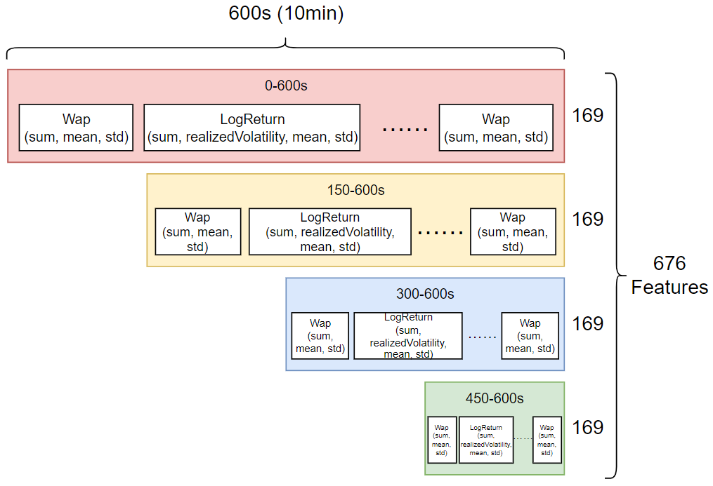
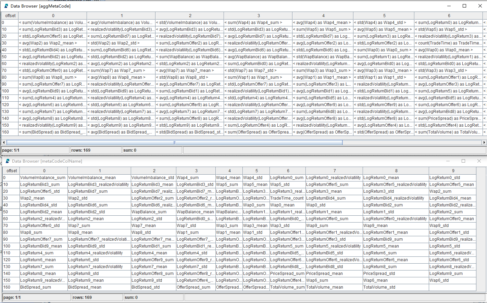
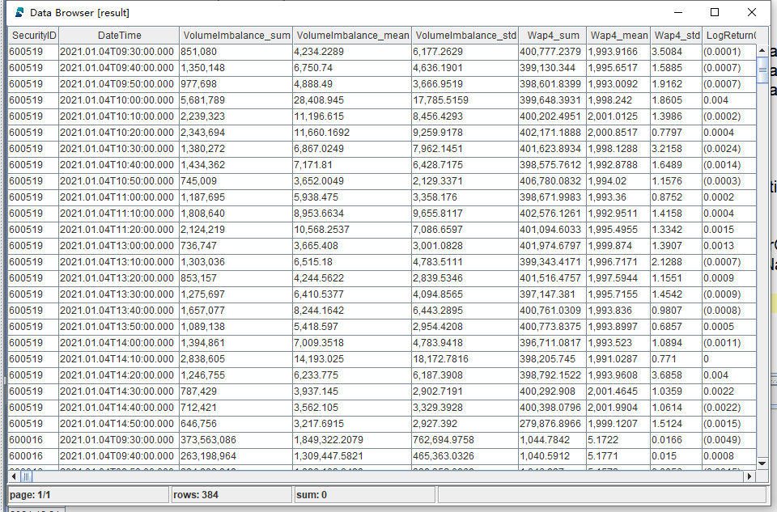
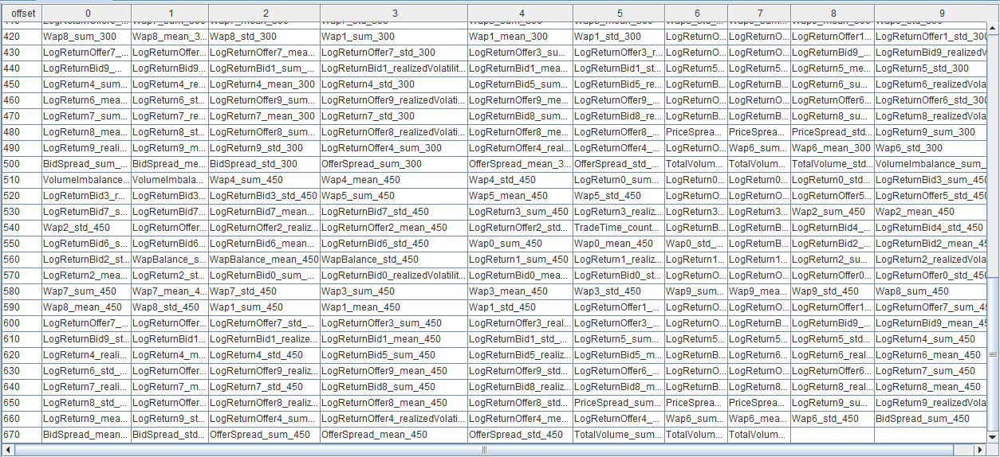
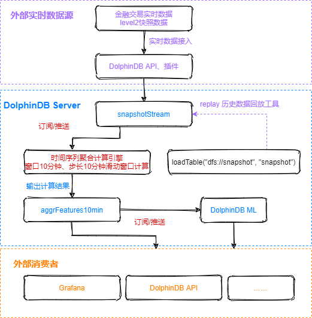
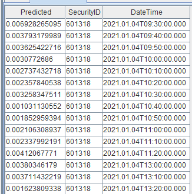

# DolphinDB 元编程：开发股票波动率预测模型的 676 个输入特征

随着算力的提升和机器学习与深度学习的普及，在进行数据建模时往往会采用批量生成衍生特征的方法来丰富数据集的特征，如：对原有的10维特征都采用 max, min, avg, std, sum 这五种方式进行分段时间窗口的聚合，数据的特征将变为5 维，有可能显著提升模型的准确性。

本教程受 [Kaggle](https://www.kaggle.com) 的 [Optiver Realized Volatility Prediction](https://www.kaggle.com/competitions/optiver-realized-volatility-prediction/overview/description) 竞赛项目启发，该项目排名第一的代码中使用了两档的买卖量价数据及 pandas 的元编程实现了批量衍生特征的计算，本教程在此基础上，使用2021年16支股票的 Level 2 快照数据，在 DolphinDB 中构建频率为10分钟的特征，**低代码量**实现了676列衍生特征的计算。与多个 Python Pandas 进程并行计算相比，DolphinDB 能带来**约 30 倍的性能提升**。教程还展示了如何在生产环境中用流式计算进行特征的实时计算。

> 本教程示例代码必须在 **2.00.6** 及以上版本的 DolphinDB server 上运行。

本教程包含内容：

- [DolphinDB 元编程：开发股票波动率预测模型的 676 个输入特征](#dolphindb-元编程开发股票波动率预测模型的-676-个输入特征)
	- [1. Snapshot 数据文件结构](#1-snapshot-数据文件结构)
	- [2. 特征工程](#2-特征工程)
		- [2.1 一级指标](#21-一级指标)
		- [2.2 二级指标](#22-二级指标)
		- [2.3 衍生特征](#23-衍生特征)
	- [3. DolphinDB 元编程代码](#3-dolphindb-元编程代码)
		- [3.1 一二级指标计算](#31-一二级指标计算)
		- [3.2 衍生特征计算](#32-衍生特征计算)
	- [4. DolphinDB vs Python](#4-dolphindb-vs-python)
	- [5. 模型构建](#5-模型构建)
		- [5.1 数据处理](#51-数据处理)
		- [5.2 划分训练集和测试集](#52-划分训练集和测试集)
		- [5.3 训练及评价](#53-训练及评价)
	- [6. 流计算实现](#6-流计算实现)
		- [6.1 流计算实现架构](#61-流计算实现架构)
		- [6.2 流计算延时统计](#62-流计算延时统计)
	- [7. 总结](#7-总结)
	- [附录](#附录)

## 1. Snapshot 数据文件结构

本教程应用的数据源为股票的 level 2 快照数据（Snapshot），每幅快照间隔时间为3秒，数据文件结构如下：

| 字段       | 含义     | 字段             | 含义       | 字段              | 含义     |
| ---------- | -------- | ---------------- | ---------- | ----------------- | -------- |
| SecurityID | 证券代码 | LowPx            | 最低价     | BidPrice[10]      | 申买十价 |
| DateTime   | 日期时间 | LastPx           | 最新价     | BidOrderQty[10]   | 申买十量 |
| PreClosePx | 昨收价   | TotalVolumeTrade | 成交总量   | OfferPrice[10]    | 申卖十价 |
| OpenPx     | 开始价   | TotalValueTrade  | 成交总金额 | OfferOrderQty[10] | 申卖十量 |
| HighPx     | 最高价   | InstrumentStatus | 交易状态   | ……                | ……       |

2021年某市所有股票快照测试数据已经提前导入至 DolphinDB 数据库中，一共约17亿条数据，导入方法见 [国内股票行情数据导入实例](https://gitee.com/dolphindb/Tutorials_CN/blob/master/stockdata_csv_import_demo.md)。

## 2. 特征工程

### 2.1 一级指标

一级指标由快照数据中的10档买卖单量价数据计算而来:

* **Weighted Averaged Price(wap)**：加权平均价格


* **Price Spread(priceSpread)**：卖1价与买1价之差与均价之比

*2}}{{OfferPrice_0+BidPrice_0}})

* **Bid Price Spread(bidSpread)**：买1价和买2价之差


* **Offer Price Spread(offerSpread)**：卖1价和卖2价之差


* **Total Volume(totalVolume)**：10档买卖单的总量

})

* **Volume Imbalance(volumeImbalance)**：买卖单总量之差的绝对值


* **Log Return of Offer Price(logReturnOffer)**：卖单价的对数收益


* **Log Return of Bid Price(logReturnBid)**：买单价的对数收益


### 2.2 二级指标

二级指标由一级指标计算生成

* **WAP Balance(wapBalance)**：加权平均价格之差的绝对值


* **Log Return of WAP(logReturnWap)**：加权平均价格对数收益


### 2.3 衍生特征

衍生特征是对一级指标和二级指标进行10分钟级别聚合计算的结果，所用到的聚合函数如下：

| 指标名称           | 衍生方法                           |
| ------------------ | ---------------------------------- |
| DateTime           | count                              |
| Wap[10]            | sum, mean, std                     |
| LogReturn[10]      | sum, realizedVolatility, mean, std |
| LogReturnOffer[10] | sum, realizedVolatility, mean, std |
| LogReturnBid[10]   | sum, realizedVolatility, mean, std |
| WapBalance         | sum, mean, std                     |
| PriceSpread        | sum, mean, std                     |
| BidSpread          | sum, mean, std                     |
| OfferSpread        | sum, mean, std                     |
| TotalVolume        | sum, mean, std                     |
| VolumeImbalance    | sum, mean, std                     |

最终预测的计算指标为实际波动率：

* **Realized Volatility(realizedVolatility)**：实际波动率


同时考虑到特征具有时效性，所以本教程对10分钟的特征切分成了 0-600s（全部），150-600s，300-600s，450-600s 四段，分别进行上述衍生指标的计算。

**10分钟的快照数据最终形成676维的聚合特征，如下图所示：**



## 3. DolphinDB 元编程代码

本教程中的重点和难点是批量生成大量特征列计算表达式，使用元编程的方式可以显著减少所需的代码量。关于元编程的详情请参考[元编程](https://www.dolphindb.cn/cn/help/Objects/Metaprogramming.html)。本教程通过元编程函数 [sql](https://www.dolphindb.cn/cn/help/FunctionsandCommands/FunctionReferences/s/sql.html) 生成元代码。在计算特征的自定义聚合函数中，首先进行一二级指标计算，再进行衍生特征计算。通过 DolphinDB 元编程对 level 2 快照数据完成676列衍生特征的完整计算代码如下：

* [DolphinDB 批计算代码](script/metacode_derived_features/metacode_derived_features.txt)：十档量价数据用多列存储。

* [DolphinDB 批计算代码（数组向量版）](script/metacode_derived_features/metacode_derived_features_arrayVector.txt)：十档量价数据用数组向量存储。

### 3.1 一二级指标计算

自定义聚合函数的入参是某支股票的 BidPrice, BidOrderQty, OfferPrice, OfferOrderQty 这四个十档量价数据的矩阵。在 DolphinDB 中对一二级指标的计算代码如下：

```c++
wap = (BidPrice * OfferOrderQty + BidOrderQty * OfferPrice) \ (BidOrderQty + OfferOrderQty)
wapBalance = abs(wap[0] - wap[1])
priceSpread = (OfferPrice[0] - BidPrice[0]) \ ((OfferPrice[0] + BidPrice[0]) \ 2)
BidSpread = BidPrice[0] - BidPrice[1]
OfferSpread = OfferPrice[0] - OfferPrice[1]
totalVolume = OfferOrderQty.rowSum() + BidOrderQty.rowSum()
volumeImbalance = abs(OfferOrderQty.rowSum() - BidOrderQty.rowSum())
LogReturnWap = logReturn(wap)
LogReturnOffer = logReturn(OfferPrice)
LogReturnBid = logReturn(BidPrice)
```

### 3.2 衍生特征计算

利用 Python 的 pandas 库，通过向 groupby.agg 传入一个字典（字典的 key 为列名，value 为聚合函数列表），即可实现对指定的列进行批量的聚合指标计算。

在 DolphinDB 中，亦可通过自定义函数实现类似的需求，即把字典转换成元编程代码，具体代码如下：

```c++
def createAggMetaCode(aggDict){
	metaCode = []
	metaCodeColName = []
	for(colName in aggDict.keys()){
		for(funcName in aggDict[colName])
		{
			metaCode.append!(sqlCol(colName, funcByName(funcName), colName + `_ + funcName$STRING))
			metaCodeColName.append!(colName + `_ + funcName$STRING)
		}
	}
	return metaCode, metaCodeColName$STRING
}

features = {
	"DateTime":[`count]
}
for(i in 0..9)
{
	features["Wap"+i] = [`sum, `mean, `std]
	features["LogReturn"+i] = [`sum, `realizedVolatility, `mean, `std]
	features["LogReturnOffer"+i] = [`sum, `realizedVolatility, `mean, `std]
	features["LogReturnBid"+i] = [`sum, `realizedVolatility, `mean, `std]
}
features["WapBalance"] = [`sum, `mean, `std]
features["PriceSpread"] = [`sum, `mean, `std]
features["BidSpread"] = [`sum, `mean, `std]
features["OfferSpread"] = [`sum, `mean, `std]
features["TotalVolume"] = [`sum, `mean, `std]
features["VolumeImbalance"] = [`sum, `mean, `std]
aggMetaCode, metaCodeColName = createAggMetaCode(features)
```

返回结果为元代码向量和对应的元代码列名，如下图所示：



在计算特征的自定义聚合函数中，为了方便后续使用元编程进行衍生特征计算，需要将一二级指标拼接成一个 table，同时修改列名，具体代码如下：

```
subTable = table(DateTime as `DateTime, BidPrice, BidOrderQty, OfferPrice, OfferOrderQty, wap, wapBalance, priceSpread, BidSpread, OfferSpread, totalVolume, volumeImbalance, LogReturnWap, LogReturnOffer, LogReturnBid)
colNum = 0..9$STRING
colName = `DateTime <- (`BidPrice + colNum) <- (`BidOrderQty + colNum) <- (`OfferPrice + colNum) <- (`OfferOrderQty + colNum) <- (`Wap + colNum) <- `WapBalance`PriceSpread`BidSpread`OfferSpread`TotalVolume`VolumeImbalance <- (`LogReturn + colNum) <- (`LogReturnOffer + colNum) <- (`LogReturnBid + colNum)
subTable.rename!(colName)
```
>其中 “<-” 是 DolphinDB 函数 [join](https://www.dolphindb.cn/cn/help/FunctionsandCommands/FunctionReferences/j/join.html) 的简写符号，此处用于将各字段拼接成列向量。

最后将元代码作为参数传入计算特征的自定义聚合函数，配合一二级指标拼接而成的 table 进行676列衍生指标的计算，并以676列的形式作为聚合结果返回，具体代码如下：

```c++
subTable['BarDateTime'] = bar(subTable['DateTime'], 10m)
result = sql(select = aggMetaCode, from = subTable).eval().matrix()
result150 = sql(select = aggMetaCode, from = subTable, where = <time(DateTime) >= (time(BarDateTime) + 150*1000) >).eval().matrix()
result300 = sql(select = aggMetaCode, from = subTable, where = <time(DateTime) >= (time(BarDateTime) + 300*1000) >).eval().matrix()
result450 = sql(select = aggMetaCode, from = subTable, where = <time(DateTime) >= (time(BarDateTime) + 450*1000) >).eval().matrix()
return concatMatrix([result, result150, result300, result450])
```

**部分计算结果展示**



**衍生特征列名展示**



## 4. DolphinDB vs Python

* 测试数据为2021年16支股票的 level 2 快照数据，总记录数为19,220,237。
* 计算逻辑为按股票代码分组，计算676个10分钟聚合指标。
* DolphinDB 和 Python 的 CPU 计算调用资源都是 8 核。
* [DolphinDB 批计算代码](script/metacode_derived_features/metacode_derived_features.txt)：十档量价数据用多列存储。

* [DolphinDB 批计算代码（数组向量版）](script/metacode_derived_features/metacode_derived_features_arrayVector.txt)：十档量价数据用数组向量存储。
* [Python 批计算代码](script/metacode_derived_features/metacode_derived_features_python_script.py)

由于 DolphinDB 的计算是分布式并行计算，本教程中配置的并行度为8，因此在使用 Python 实现衍生特征计算时，也采用了8的并行度进行并行计算，即同时调用8个 Python 进程进行计算。

**计算性能对比结果**

| 股票数量 | 交易天数 |   数据量   | Python(s) | DolphinDB(s) |
| :------: | :------: | :--------: | :-------: | :----------: |
|    16    |   243    | 19,220,237 |   3,039   |     100      |


## 5. 模型构建

DolphinDB 支持一系列常用的机器学习算法，例如 [最小二乘回归、随机森林、K - 平均等，使用户能够方便地完成回归、分类、聚类等任务](https://www.dolphindb.cn/cn/help/200/FunctionsandCommands/FunctionStatistics/index.html)。除了内置的经典的机器学习函数，DolphinDB 还支持许多第三方库，因此我们也可以调用 DolphinDB 提供的第三方库插件来进行模型训练。

XGBOOST（Extreme Gradient Boosting）是一种 Tree Boosting 的可扩展机器学习系统，它在 Gradient Boosting 框架下实现机器学习算法，提供了并行树提升（也称为 GBDT，GBM），可以快速准确地解决许多数据科学的问题。

本教程参考 [机器学习教程-5.使用 DolphinDB 插件进行机器学习](https://gitee.com/dolphindb/Tutorials_CN/blob/master/machine_learning.md#5-%E4%BD%BF%E7%94%A8dolphindb%E6%8F%92%E4%BB%B6%E8%BF%9B%E8%A1%8C%E6%9C%BA%E5%99%A8%E5%AD%A6%E4%B9%A0)，选取 XGBOOST 进行训练。

> 安装 XGBOOST 参考：[XGBOOST 插件安装教程](https://gitee.com/dolphindb/DolphinDBPlugin/tree/release200/xgboost)

模型评价指标：根均方百分比误差（Root Mean Square Percentage Error, RMSPE）

%5E2%7D%7B%7B%7By_i%7D%5E2%7D%7D%7D%7D)

> 对应脚本：[模型构建和训练代码](script/metacode_derived_features/metacode_derived_features_buildmodel.txt)

### 5.1 数据处理

删除掉含 NULL 的记录，标注 label 并将构造出来的676维特征适当调整为 XGBOOST 输入的数据格式，具体代码如下：

```c++
// 将计算出来的特征中包含 NULL 的记录删除
result = result[each(isValid, result.values()).rowAnd()]

result_input = copy(result)

// 选取 LogReturn0_realizedVolatility 作为 label
label = result[`LogReturn0_realizedVolatility]

// 将 SYMBOL 型的 SecurityID 列转换为 XGBOOST 模型支持输入的 INT 型
result_input.update!(`SecurityID_int, int(result[`SecurityID]))

// 调整输入的字段，去除不需要的列
result_input.dropColumns!(`SecurityID`DateTime`LogReturn0_realizedVolatility)
```

>  注意：本次预测值为未来10分钟的波动率，WAP_0 最接近股价，所以选取 `LogReturn0_realizedVolatility` 作为 `label`。

### 5.2 划分训练集和测试集

本项目中没有设置验证集，训练集和测试集按 7:3 比例划分，具体代码如下：

```c++
def trainTestSplit(x, testRatio) {
    xSize = x.size()
    testSize =(xSize * (1-testRatio))$INT
    return x[0: testSize], x[testSize:xSize]
}

Train_x, Test_x = trainTestSplit(result_input, 0.3)
Train_y, Test_y = trainTestSplit(label, 0.3)
```

### 5.3 训练及评价

DolphinDB 的 XGBOOST 插件中包含 4 个用户接口：

* 用于训练模型的 `xgboost::train()`；
* 用于预测的 `xgboost::predict`；
* 用于保存模型到磁盘的 `xgboost::saveModel`；
* 用于从磁盘上加载模型的 `xgboost::loadModel` 。

> 具体使用方法的说明参见 [DolphinDB XGBoost 插件用户接口教程](https://gitee.com/dolphindb/DolphinDBPlugin/tree/release200/xgboost)。

具体代码如下：

```c++
// 定义评估指标 RMSPE（Root Mean Square Percentage Error）
def RMSPE(a,b)
{
	return sqrt(sum( ((a-b)\a)*((a-b)\a) ) \a.size()  )
}

// 定义模型训练的参数
params = {
	objective: 'reg:squarederror',
	colsample_bytree: 0.8,
	subsample: 0.8,
	min_child_weight: 1,
	max_leaves:128,
	eta: 0.1,
	max_depth:10,
	eval_metric : 'rmse'
	}

//XGBOOST 模型训练
model_1 = xgboost::train(Train_y ,Train_x, params, 500)

// 用测试集预测波动率，并计算 RMPSE
y_pred = xgboost::predict(model_1, Test_x)
print('RMSPE='+RMSPE(Test_y, y_pred))
```

**运行结果**

```
RMSPE：0.559
模型训练时间：1m 3s 327ms
```

>  本次预测采取手动粗调。

**模型保存及加载**

```
// 保存模型，modelSavePath 为保存模型的路径，需要根据实际环境配置
xgboost::saveModel(model_1, modelSavePath)

// 模型加载，modelSavePath 为模型的路径，需要根据实际环境配置
model = xgboost::loadModel(modelSavePath)
```

**回归模型预测性能**

| 数据量（条） | 模型预测时间（ms） |
| ------------ | ------------------ |
| 1            | 0.936              |
| 10           | 1.832              |
| 100          | 9.314              |
| 1000         | 49.274             |
| 10000        | 317.656            |


## 6. 流计算实现

以上部分的计算都是基于批量历史数据的计算。在实际生产环境中，数据的来源往往是以“流”的方式。如何套用上述复杂的衍生特征计算逻辑实现流式计算是业务层面面临的重大难题。

对于这类问题，DolphinDB 内置了多种类型的流计算引擎，以提供简易快捷的低延时解决方案。

### 6.1 流计算实现架构

**流计算处理流程**



实时的流数据通过 DolphinDBAPI 注入至 `snapshotStream` 表中，然后通过订阅/推送，将快照数据注入至时间序列聚合引擎，进行窗口为10分钟，步长为10分钟的滑动窗口计算。核心代码如下：

* 定义存储 snapshot 的流数据表 `snapshotStream`，特征工程结果表 `aggrFeatures10min`，以及后续模型预测的结果表 `result10min`。

```
name = `SecurityID`DateTime`PreClosePx`OpenPx`HighPx`LowPx`LastPx`TotalVolumeTrade`TotalValueTrade`BidPrice0`BidPrice1`BidPrice2`BidPrice3`BidPrice4`BidPrice5`BidPrice6`BidPrice7`BidPrice8`BidPrice9`BidOrderQty0`BidOrderQty1`BidOrderQty2`BidOrderQty3`BidOrderQty4`BidOrderQty5`BidOrderQty6`BidOrderQty7`BidOrderQty8`BidOrderQty9`OfferPrice0`OfferPrice1`OfferPrice2`OfferPrice3`OfferPrice4`OfferPrice5`OfferPrice6`OfferPrice7`OfferPrice8`OfferPrice9`OfferOrderQty0`OfferOrderQty1`OfferOrderQty2`OfferOrderQty3`OfferOrderQty4`OfferOrderQty5`OfferOrderQty6`OfferOrderQty7`OfferOrderQty8`OfferOrderQty9

type =`SYMBOL`TIMESTAMP`DOUBLE`DOUBLE`DOUBLE`DOUBLE`DOUBLE`INT`DOUBLE`DOUBLE`DOUBLE`DOUBLE`DOUBLE`DOUBLE`DOUBLE`DOUBLE`DOUBLE`DOUBLE`DOUBLE`INT`INT`INT`INT`INT`INT`INT`INT`INT`INT`DOUBLE`DOUBLE`DOUBLE`DOUBLE`DOUBLE`DOUBLE`DOUBLE`DOUBLE`DOUBLE`DOUBLE`INT`INT`INT`INT`INT`INT`INT`INT`INT`INT

share streamTable(100000:0, name, type) as snapshotStream
share streamTable(100000:0 , `DateTime`SecurityID <- metaCodeColName <- (metaCodeColName+"_150") <- (metaCodeColName+"_300") <- (metaCodeColName+"_450"),`TIMESTAMP`SYMBOL <- take(`DOUBLE, 676)) as aggrFeatures10min
share streamTable(100000:0 , `Predicted`SecurityID`DateTime, `FLOAT`SYMBOL`TIMESTAMP) as result10min

```

* 注册时间序列聚合计算引擎

```
metrics=sqlColAlias(<featureEngineering(DateTime,
		matrix(BidPrice0,BidPrice1,BidPrice2,BidPrice3,BidPrice4,BidPrice5,BidPrice6,BidPrice7,BidPrice8,BidPrice9),
		matrix(BidOrderQty0,BidOrderQty1,BidOrderQty2,BidOrderQty3,BidOrderQty4,BidOrderQty5,BidOrderQty6,BidOrderQty7,BidOrderQty8,BidOrderQty9),
		matrix(OfferPrice0,OfferPrice1,OfferPrice2,OfferPrice3,OfferPrice4,OfferPrice5,OfferPrice6,OfferPrice7,OfferPrice8,OfferPrice9),
		matrix(OfferOrderQty0,OfferOrderQty1,OfferOrderQty2,OfferOrderQty3,OfferOrderQty4,OfferOrderQty5,OfferOrderQty6,OfferOrderQty7,OfferOrderQty8,OfferOrderQty9), aggMetaCode)>, metaCodeColName <- (metaCodeColName+"_150") <- (metaCodeColName+"_300") <- (metaCodeColName+"_450"))

createTimeSeriesEngine(name="aggrFeatures10min", windowSize=600000, step=600000, metrics=metrics, dummyTable=snapshotStream, outputTable=aggrFeatures10min, timeColumn=`DateTime, useWindowStartTime=true, keyColumn=`SecurityID)
```

* 订阅 `snapshotStream` 流数据表中的实时增量数据

```
subscribeTable(tableName="snapshotStream", actionName="aggrFeatures10min", offset=-1, handler=getStreamEngine("aggrFeatures10min"), msgAsTable=true, batchSize=2000, throttle=1, hash=0, reconnect=true)
```

* 第二个订阅：实时获取 `aggrFeatures10min` 表中的特征数据，使用已训练好的模型来进行波动率预测，并将最终结果导入到 `result10min` 表中。

```
def predictRV(mutable result10min, model, mutable msg){
	startTime = now()
	temp_table = select SecurityID, DateTime from msg
	msg.update!(`SecurityID_int, int(msg[`SecurityID])).dropColumns!(`SecurityID`DateTime`LogReturn0_realizedVolatility)
	Predicted = xgboost::predict(model , msg)
	temp_table_2 = table(Predicted, temp_table)
	result10min.append!(temp_table_2)
}
subscribeTable(tableName="aggrFeatures10min", actionName="predictRV", offset=-1, handler=predictRV{result10min, model}, msgAsTable=true, hash=1, reconnect=true)
```

上述脚本定义的 metrics 中的 featureEngineering 函数与批计算的代码脚本中的自定义聚合函数完全相同，体现了 DolphinDB **流批一体** 的优势特点。

构建好流计算框架后，我们通过历史数据回放的方式，将附录中的测试数据输入到上游的共享流表中。下游结果表中实盘波动率预测的结果展示：



### 6.2 流计算延时统计

本章节统计了股票在时序聚合引擎中的计算延时情况，流计算延时主要由两部分构成：`计算聚合特征的耗时` 和 `模型预测实时波动率的耗时`。

* 计算聚合特征耗时：

```
timer getStreamEngine('aggrFeatures10min').append!(data)
```

* 模型预测实时波动率的耗时

```
test_x  = select * from aggrFeatures10min
timer{
temp_table = select SecurityID, DateTime from test_x
test_x.update!(`SecurityID_int, int(test_x[`SecurityID])).dropColumns!(`SecurityID`DateTime`LogReturn0_realizedVolatility)
Predicted = xgboost::predict(model , test_x)
}
```

* 统计结果：


| 股票数量 | 10 分钟数据量 | 计算聚合特征耗时 | 模型预测实时波动率的耗时 | 总耗时 |
| -------- | ------------ | ---------------- | ------------------------ | ------ |
| 1        | 201          | 22ms             | 3ms                      | 25ms   |
| 10       | 2011         | 92ms             | 3ms                      | 95ms   |
| 20       | 4020         | 162ms            | 4ms                      | 168ms  |
| 30       | 6030         | 257ms            | 5ms                      | 262ms  |
| 40       | 8040         | 321ms            | 6ms                      | 327ms  |
| 50       | 10054        | 386ms            | 7ms                      | 393ms  |


[DolphinDB 流计算代码](script/metacode_derived_features/metacode_derived_features_streaming.txt)

[level 2 快照测试数据](data/metacode_derived_features/testSnapshot.csv)

## 7. 总结

本教程介绍了 DolphinDB 中应用于机器学习场景的流批一体解决方案。我们可以将一个函数应用于历史数据或实时流数据处理，高效便捷地生成衍生特征。性能比较结果表明 DolphinDB 的解决方案比 Python 快30倍。

## 附录

[DolphinDB 批计算代码](script/metacode_derived_features/metacode_derived_features.txt)

[DolphinDB 批计算代码（数组向量版）](script/metacode_derived_features/metacode_derived_features_arrayVector.txt)

[模型构建和训练代码](script/metacode_derived_features/metacode_derived_features_buildmodel.txt)

[Python 批计算代码](script/metacode_derived_features/metacode_derived_features_python_script.py)

[DolphinDB 流计算代码](script/metacode_derived_features/metacode_derived_features_streaming.txt)

[level 2 快照测试数据](data/metacode_derived_features/testSnapshot.csv)

**开发环境**

* CPU 类型：Intel(R) Xeon(R) Silver 4216 CPU @ 2.10GHz
* 逻辑 CPU 总数：8
* 内存：64GB
* OS：64位 CentOS Linux 7 (Core)
* 磁盘：SSD 盘，最大读写速率为 520MB/s
* server 版本：2.00.6（企业版）
* server 部署模式：[单节点](https://gitee.com/dolphindb/Tutorials_CN/blob/master/standalone_server.md)
* 配置文件：[dolphindb.cfg](script/machine_learning_volatility/200tsdb/dolphindb.cfg) (volumes, persistenceDir, TSDBRedoLogDir 需要根据实际环境磁盘路径修改)