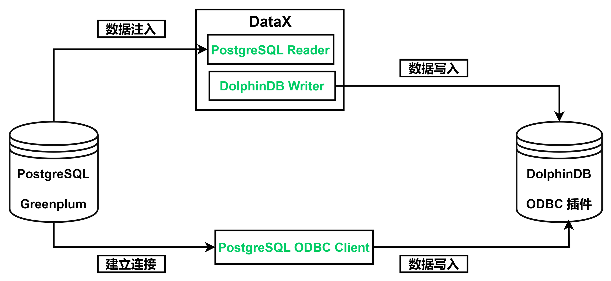
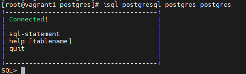
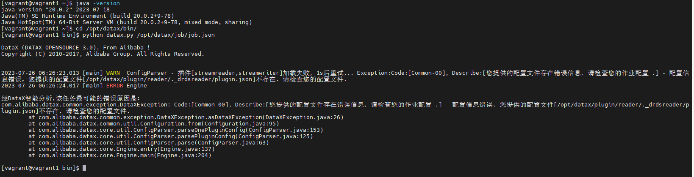

# 2023.09.30《从 Postgre/Greenplum 迁移到 DolphinDB》

PostgreSQL 是一种开源的关系型数据库管理系统（DBMS），是最广泛使用的开源数据库之一。它允许用户通过添加自定义函数、数据类型和索引等方式扩展其功能，支持 ACID 事务，并使用多版本并发控制（MVCC）来管理并发访问，具有优良的安全性和可扩展性。但是，由于存在并发问题和扩容问题等，PostgreSQL 的发展仍面临着许多瓶颈。

DolphinDB 是一种高效、分布式的数据管理和分析平台，集成了功能强大的编程语言如 SQL、Python、Java 等和高容量高速度的流数据分析系统，为海量数据（特别是时间序列数据）的快速存储、检索、分析及计算提供一站式解决方案。其操作简单，可扩展性强，具有良好的容错能力及优异的多用户并发访问能力，适合于各种大规模数据处理场景。

本文旨在为有从 PostgreSQL 数据库迁移到 DolphinDB 需求的用户提供一份简明的教程参考。本教程也适用于在 PostgreSQL 基础上研发的其他类型数据库，比如 Greenplum ，具体实施可能有所区别，以实际数据库官方说明为准。

PostgreSQL 迁移数据到 DolphinDB 的整体框架如下：




- [1. 实现方法](#1-实现方法)
  - [1.1 ODBC 插件](#11-odbc-插件)
  - [1.2 DataX 驱动](#12-datax-驱动)
- [2. 应用需求](#2-应用需求)
- [3. 迁移案例与操作步骤](#3-迁移案例与操作步骤)
  - [3.1 环境配置](#31-环境配置)
  - [3.2 建库建表](#32-建库建表)
  - [3.3 通过 ODBC 迁移](#33-通过-odbc-迁移)
  - [3.4 通过 DataX 迁移](#34-通过-datax-迁移)
- [4. 基准性能](#4-基准性能)

## 1. 实现方法

从 PostgreSQL 迁移数据到 DolphinDB 的方法有以下二种：

### 1.1 ODBC 插件

ODBC（Open Database Connectivity）插件是 DolphinDB 提供的通过 ODBC 接口访问 PostgreSQL 的开源产品。使用插件配合 DolphinDB 脚本使用，与服务器在同一个进程空间内运行，能高效地完成 Oracle 数据到 DolphinDB 的数据写入。

ODBC 提供如下函数，函数的具体使用请参考 [odbc/README_CN.md · 浙江智臾科技有限公司/DolphinDBPlugin - Gitee](https://gitee.com/dolphindb/DolphinDBPlugin/blob/release200/odbc/README_CN.md) 

- `odbc::connect(connStr, [dataBaseType])`
- `odbc::close(conn)`
- `odbc::query(connHandle or connStr, querySql, [t], [batchSize], [tranform])`
- `odbc::execute(connHandle or connStr, SQLstatements)`
- `odbc::append(connHandle, tableData, tablename, [createTableIfNotExist], [insertIgnore])`

### 1.2 DataX 驱动

DataX 是可扩展的数据同步框架，将不同数据源的同步抽象为从源头数据源读取数据的 Reader 插件，以及向目标端写入数据的 Writer 插件，理论上 DataX 框架可以支持任意数据源类型的数据同步工作。

DolphinDB 提供基于 DataXReader 和 DataXWriter 的开源驱动。DolphinDBWriter 插件实现了向 DolphinDB 写入数据，使用 DataX 的现有 reader 插件结合 DolphinDBWriter 插件，即可实现从不同数据源向 DolphinDB 同步数据。用户可以在 Java 项目中包含 DataX 的驱动包，开发从 Oracle 数据源到 DolphinDB 的数据迁移软件。

## 2. 应用需求

很多存储在 PostgreSQL 中的数据，可以通过上述的两种方式将数据同步到 DolphinDB 中。本文的实践案例基于 2021.01.04 一天的逐笔成交数据，数据量约 2721 万。其部分数据示例如下：

| SecurityID | TradeTime               | TradePrice | TradeQty | TradeAmount | BuyNo  | SellNo | TradeIndex | ChannelNo | TradeBSFlag | BizIndex |
| :--------- | :---------------------- | :--------- | :------- | :---------- | :----- | :----- | :--------- | :-------- | :---------- | :------- |
| 600020     | 2021.01.04T09:25:00.630 | 3.39       | 2100     | 7,119.      | 85961  | 78316  | 19719      | 1         | N           | 123713   |
| 600020     | 2021.01.04T09:25:00.630 | 3.39       | 1000     | 3,390.      | 129945 | 78316  | 19720      | 1         | N           | 123714   |
| 600020     | 2021.01.04T09:25:00.630 | 3.39       | 900      | 3,051.      | 158039 | 78316  | 19721      | 1         | N           | 123715   |
| 600020     | 2021.01.04T09:25:00.630 | 3.39       | 5000     | 16,950.     | 158039 | 158092 | 19722      | 1         | N           | 123716   |
| 600020     | 2021.01.04T09:25:00.630 | 3.39       | 6600     | 22,374.     | 158039 | 118594 | 19723      | 1         | N           | 123717   |
| 600020     | 2021.01.04T09:25:00.630 | 3.39       | 2500     | 8,475.      | 158039 | 138050 | 19724      | 1         | N           | 123718   |
| 600020     | 2021.01.04T09:25:00.630 | 3.39       | 400      | 1,356.      | 42283  | 138050 | 19725      | 1         | N           | 123719   |
| 600020     | 2021.01.04T09:25:00.630 | 3.39       | 100      | 339.        | 42283  | 38902  | 19726      | 1         | N           | 123720   |
| 600020     | 2021.01.04T09:25:00.630 | 3.39       | 3883     | 13,163.37   | 42283  | 45597  | 19727      | 1         | N           | 123721   |
| 600020     | 2021.01.04T09:25:00.630 | 3.39       | 12000    | 40,680.     | 42283  | 168862 | 19728      | 1         | N           | 123722   |

## 3. 迁移案例与操作步骤

### 3.1 环境配置

本次案例中使用了以下数据库及插件，各版本型号如下：

- [Postgre](http://www.postgresql.org/ftp/source/) 版本：`PostgreSQL 13.1 on x86_64-pc-linux-gnu, compiled by gcc (GCC) 4.8.5 20150623 (Red Hat 4.8.5-44), 64-bit`
- [unixODBC](https://gitee.com/link?target=http%3A%2F%2Fwww.unixodbc.org%2F) 版本：`2.3.7`
- [DolphinDB Server](https://gitee.com/link?target=https%3A%2F%2Fwww.dolphindb.cn%2Falone%2Falone.php%3Fid%3D10) 版本：`2.00.10 2023.07.18`
- [DolphinDB GUI](https://gitee.com/link?target=https%3A%2F%2Fwww.dolphindb.cn%2Falone%2Falone.php%3Fid%3D10) 版本：`1.30.22.1`

`2.00.10` 版本 Server 自带 ODBC 插件，位于 Server 的 `<HomeDir>/plugins` 目录，可直接加载使用。如果 `<HomeDir>/plugins` 目录下不存在 ODBC 文件夹，则通过如下链接下载：

[浙江智臾科技有限公司/DolphinDBPlugin](https://gitee.com/dolphindb/DolphinDBPlugin/tree/release200.10/odbc/bin) 【分支：release200.10】

请注意，DolphinDB ODBC 插件版本号必须与 Server 版本号一致，否则可能出现报错。例如，DolphinDB Server 版本号为 2.00.10.X，则必须使用 release200.10 分支的 ODBC 插件。

**注意**：如果想自行编译，请参考：[odbc/README_CN.md · 浙江智臾科技有限公司/DolphinDBPlugin - Gitee](https://gitee.com/dolphindb/DolphinDBPlugin/blob/release200/odbc/README_CN.md) 文章中的第2章。

### 3.2 建库建表

PostgreSQL 建表语句如下：

```
create table ticksh(
  SecurityID         varchar(20),
  TradeTime       	 TIMESTAMP,
  TradePrice         NUMERIC(38,4),
  TradeQty 	         NUMERIC(38),
  TradeAmount        NUMERIC(38,4),
  BuyNo              NUMERIC(38),
  SellNo             NUMERIC(38),
  TradeIndex         NUMERIC(38),
  ChannelNo          NUMERIC(38),
  TradeBSFlag        varchar(10),
  BizIndex           integer
);
```

设计建库建表方案时，需要综合考虑实际数据的字段、类型、数据量以及在 DolphinDB 中是否需要分区、分区方案以及使用 OLAP 还是 TSDB 引擎等因素。一些数据存储库表设计实践，可以参考 [DolphinDB 数据库分区教程](https://gitee.com/dolphindb/Tutorials_CN/blob/master/database.md)。

本例 DolphinDB 建库建表文件 *createTable.dos* 内容如下:

```
def createTick(dbName, tbName){
	if(existsDatabase(dbName)){
		dropDatabase(dbName)
	}
	db1 = database(, VALUE, 2020.01.01..2021.01.01)
	db2 = database(, HASH, [SYMBOL, 10])
	db = database(dbName, COMPO, [db1, db2], , "TSDB")
	db = database(dbName)
	name = `SecurityID`TradeTime`TradePrice`TradeQty`TradeAmount`BuyNo`SellNo`ChannelNo`TradeIndex`TradeBSFlag`BizIndex
	type = `SYMBOL`TIMESTAMP`DOUBLE`INT`DOUBLE`INT`INT`INT`INT`SYMBOL`INT
	schemaTable = table(1:0, name, type)
	db.createPartitionedTable(table=schemaTable, tableName=tbName, partitionColumns=`TradeTime`SecurityID, compressMethods={TradeTime:"delta"}, sortColumns=`SecurityID`TradeTime, keepDuplicates=ALL)
}

dbName="dfs://TSDB_tick"
tbName="tick"
createTick(dbName, tbName)
```

从 PostgreSQL 迁移到 DolphinDB 的数据字段映射关系如下表：

| **PostgreSQL 字段含义** | **PostgreSQL 字段** | **PostgreSQL 数据类型** | **DolphinDB 字段含义** | **DolphinDB 字段** | **DolphinDB 数据类型** |
| :---------------------- | :------------------ | :---------------------- | :--------------------- | :----------------- | :--------------------- |
| 证券代码                | SecurityID          | VARCHAR(20)             | 证券代码               | SecurityID         | SYMBOL                 |
| 交易时间                | TradeTime           | TIMESTAMP               | 交易时间               | TradeTime          | TIMESTAMP              |
| 交易价格                | TradePrice          | NUMERIC(38,4)           | 交易价格               | TradePrice         | DOUBLE                 |
| 交易数量                | TradeQty            | NUMERIC(38)             | 交易数量               | TradeQty           | INT                    |
| 交易金额                | TradeAmount         | NUMERIC(38,4)           | 交易金额               | TradeAmount        | DOUBLE                 |
| 买方委托索引            | BuyNo               | NUMERIC(38)             | 买方委托索引           | BuyNo              | INT                    |
| 卖方委托索引            | SellNo              | NUMERIC(38)             | 卖方委托索引           | SellNo             | INT                    |
| 成交编号                | TradeIndex          | NUMERIC(38)             | 成交编号               | TradeIndex         | INT                    |
| 频道代码                | ChannelNo           | NUMERIC(38)             | 频道代码               | ChannelNo          | INT                    |
| 成交方向                | TradeBSFlag         | VARCHAR(10)             | 成交方向               | TradeBSFlag        | SYMBOL                 |
| 业务序列号              | BizIndex            | INTEGER                 | 业务序列号             | BizIndex           | INT                    |

### 3.3 通过 ODBC 迁移

#### **3.3.1 安装 ODBC 驱动**

本例中部署 DolphinDB 的服务器操作系统为 Centos。

**step1：在安装 PostgreSQL 的 ODBC 驱动前，需先安装 unixODBC 库，使用以下命令安装**

Centos 系统：

```
# 安装 unixODBC 库
yum install unixODBC unixODBC-devel
```

如果是 Ubuntu 系统，使用以下命令安装

```
# 安装 unixODBC 库
apt-get install unixodbc unixodbc-dev
```

**注意**：安装完成后可用`odbcinst -j`命令查看安装配置文件所在的位置，有两个比较常用的配置，一个是 ODBC 驱动配置，默认在`/etc/odbcinst.ini`，另一个是系统数据源配置，默认在`/etc/odbc.ini`。

**step2：下载 PostgreSQL 的 ODBC 驱动并安装**

以 Centos 系统为例，可以通过以下方式直接在 Linux 系统中直接安装 Postgresql-ODBC

```
yum install -y postgresql-odbc.x86_64
```

**step3：配置 ODBC 配置文件**

1）*odbcinst.ini* 文件用于设置 ODBC 的某个 Driver 要用到的 ODBC 驱动库的文件路径。 配置 *odbcinst.ini* 文件的内容（如果配置文件不存在，需手工创建） :

```
[PostgreSQL]
Description     = ODBC for PostgreSQL
Driver          = /usr/lib/psqlodbcw.so
Setup           = /usr/lib/libodbcpsqlS.so
Driver64        = /usr/lib64/psqlodbcw.so
Setup64         = /usr/lib64/libodbcpsqlS.so
FileUsage       = 1
```

2）*/etc/odbc.ini* 文件用于设置 ODBC 中所用到的 Driver 、所要使用的数据库等配置，更多配置项可参考 [ODBC 连接字符串配置](https://gitee.com/link?target=https%3A%2F%2Fwww.connectionstrings.com%2F)。其中的 Driver 为 */etc/odbcinst.ini* 文件中配置的第一行方括号中的内容。添加内容如下（如果配置文件不存在，需手工创建）：

```
[postgresql] 					//ODBC 数据源名称
Description = PostgresSQLODBC	//ODBC 的描述
Driver = PostgreSQL				//驱动名称
Database = postgres				//数据库名称
Servername = 127.0.0.1			//布置了 Postgresql 数据库的服务器 IP 地址
UserName = postgres				//数据库相关的用户名
Password = postgres				//数据库密码
Port = 5432					    //布置了 Postgresql 数据库的服务器的端口号
ReadOnly = 0					//关闭只读特性
ConnSettings = set client_encoding to UTF8	//客户端编码
```

**step4：测试 ODBC 连接**

使用 ODBC 登录 Postgresql 数据库，测试连接及预期结果如下：

```
isql postgresql postgres postgres  //后两位分别是用户名和密码

/**********output********/
+---------------------------------------+
| Connected!                            |
|                                       |
| sql-statement                         |
| help [tablename]                      |
| quit                                  |
|                                       |
+---------------------------------------+
```

 登录成功如下所示，可输入 SQL 操作数据库

```
SQL>
```



**注意**：如有其他常见问题，可参考 [ODBC_plugin_user_guide.md · 浙江智臾科技有限公司/Tutorials_CN - Gitee](https://gitee.com/dolphindb/Tutorials_CN/blob/master/ODBC_plugin_user_guide.md#5-odbc-%E6%8F%92%E4%BB%B6%E4%BD%BF%E7%94%A8%E6%B3%A8%E6%84%8F%E4%BA%8B%E9%A1%B9%E5%92%8C%E5%B8%B8%E8%A7%81%E9%97%AE%E9%A2%98) 文章中的第5章注意事项和常见问题。

#### **3.3.2 同步数据**

**step1：运行以下命令加载 ODBC 插件（** `ServerPath` **请自行修改）**

```
loadPlugin("ServerPath/plugins/odbc/PluginODBC.txt")
```

**step2：运行以下命令建立与 Oracle 的连接 （第一个参数为 ODBC 连接字符串 connStr）**

connstr 请参阅[连接字符串参考](https://www.connectionstrings.com/)自行修改。

```
conn = odbc::connect("Driver={PostgreSQL};Server=*;Port=5432;Database=postgres;Uid=postgres;Pwd=postgres;", `PostgreSQL)
```

**step3：运行以下命令开始同步数据**

```
def transForm(mutable msg){
	msg.replaceColumn!(`TradeQty, int(msg[`TradeQty]))
	msg.replaceColumn!(`BuyNo, int(msg[`BuyNo]))
	msg.replaceColumn!(`SellNo, int(msg[`SellNo]))
	msg.replaceColumn!(`ChannelNo, int(msg[`ChannelNo]))
	msg.replaceColumn!(`TradeIndex, int(msg[`TradeIndex]))
	msg.replaceColumn!(`BizIndex, int(msg[`BizIndex]))
	return msg
}

def syncData(conn, dbName, tbName, dt){
	sql = "select SecurityID, TradeTime, TradePrice, TradeQty, TradeAmount, BuyNo, SellNo, ChannelNo, TradeIndex, TradeBSFlag, BizIndex from ticksh"
	if(!isNull(dt)) {
		sql = sql + " where to_date(TradeTime,'yyyy-MM-dd hh24:mi:ss') = dt"
	}
    odbc::query(conn,sql, loadTable(dbName,tbName), 100000, transForm)
}

dbName="dfs://TSDB_tick"
tbName="tick"
syncData(conn, dbName, tbName, NULL)
```

数据共 27211975 条，同步数据耗时约 597 秒。

**step4：后台多任务同步数据**

本教程中 DolphinDB 的数据库按天分区，如果需要同步多天的数据，可以提交多个任务到后台：

```
for(dt in 2021.01.04..2021.01.05){
	submitJob(`syncPostgreTick, `syncPostgreTick, syncData, conn, dbName, tbName, dt)
}
// 查看后台任务
select * from getRecentJobs() where jobDesc = `syncPostgreTick
```

### 3.4 通过 DataX 迁移

#### **3.4.1 部署 DataX**

从 [DataX 下载地址](https://datax-opensource.oss-cn-hangzhou.aliyuncs.com/202303/datax.tar.gz) 下载 DataX 压缩包后，解压至自定义目录。执行 *datax* 自检如下：

```
cd datax/bin
python datax.py /opt/datax/job/job.json
```

可能出现报错，报错为[您提供的配置文件存在错误信息... plugin.json ]不存在：



该问题是因为在 `reader` 和 `writer` 目录下存在临时文件，影响了 datax 的运行，解决方法如下：

```
# 这里的/datax/plugin/writer/应修改为实际目录
find /datax/plugin/reader/ -type f -name "._*er" | xargs rm -rf
find /datax/plugin/writer/ -type f -name "._*er" | xargs rm -rf
```

自检成功后，将 [DataX-DolphinDBWriter ](https://gitee.com/link?target=https%3A%2F%2Fgithub.com%2Fdolphindb%2Fdatax-writer)中源码的 `./dist/dolphindbwriter` 目录下所有内容拷贝到 `DataX/plugin/writer` 目录下，即可使用。

#### **3.4.2 执行 DataX 任务**

**step1：配置 json 文件**

配置文件 *pgddb.json* 的具体内容如下，并将 json 文件置于自定义目录下，本教程中放置于 `datax/job` 目录下。

```
{
    "job": {
            "content": [{
                    "writer": {
                            "name": "dolphindbwriter",
                            "parameter": {
                                    "userId": "admin",
                                    "pwd": "123456",
                                    "host": "10.0.0.80",
                                    "port": 8848,
                                    "dbPath": "dfs://TSDB_tick",
                                    "tableName": "Tick",
                                    "table": [
                                        {
                                             "type": "DT_SYMBOL",
                                             "name": "SecurityID"
                                        },
                                        {
                                            "type": "DT_TIMESTAMP",
                                            "name": "TradeTime"
                                        },
                                        {
                                            "type": "DT_DOUBLE",
                                            "name": "TradePrice"
                                        },
                                        {
                                            "type": "DT_INT",
                                            "name": "TradeQty"
                                        },
                                        {
                                            "type": "DT_DOUBLE",
                                            "name": "TradeAmount"
                                        },
                                        {
                                            "type": "DT_INT",
                                            "name": "BuyNo"
                                        },
                                        {
                                            "type": "DT_INT",
                                            "name": "SellNo"
                                        },
                                        {
                                            "type": "DT_INT",
                                            "name": "TradeIndex"
                                        },
                                        {
                                            "type": "DT_INT",
                                            "name": "ChannelNo"
                                        },
                                        {
                                            "type": "DT_SYMBOL",
                                            "name": "TradeBSFlag"
                                        },
                                        {
                                            "type": "DT_INT",
                                            "name": "BizIndex"
                                        }
                                    ]                            
                            }
                    },
                    "reader": {
                            "name": "postgresqlreader",
                            "parameter": {
                                    "username": "postgres",
                                    "column": ["SecurityID", "TradeTime", "TradePrice", "TradeQty", "TradeAmount", "BuyNo", "SellNo", "ChannelNo", "TradeIndex", "TradeBSFlag", "BizIndex"],
                                    "connection": [{
                                            "table": ["ticksh"],
                                            "jdbcUrl": ["jdbc:postgresql:postgres"]
                                    }],
                                    "password": "postgres",
                                    "where": ""
                            }                            
                    }
            }],
            "setting": {
                    "speed": {
                            "channel": 1
                    }
            }
    }
}
```

**step2：Linux 终端中执行以下命令以执行 DataX 任务**

```
cd ./datax
python bin/datax.py --jvm=-Xmx8g job/ddbtopg.json
```

**step3：查看 DataX 同步结果**

```
任务启动时刻                    : 2023-08-29 14:19:53
任务结束时刻                    : 2023-08-29 14:26:33
任务总计耗时                    :                400s
任务平均流量                    :            4.08MB/s
记录写入速度                    :          68029rec/s
读出记录总数                    :            27211975
读写失败总数                    :                   0
```

## 4. 基准性能

分别使用 ODBC 插件和 DataX 驱动进行数据迁移， 数据量 2721 万条，迁移耗时对比如下表所示：

| **ODBC 插件** | **DataX** |
| :------------ | :-------- |
| 597.54s       | 400s      |

综上，ODBC 插件与 DataX 均能实现将 PostgreSql 中数据迁移到 DolphinDB 中，但是各有优缺点：

- ODBC 使用简单，适合定制数据的导入，但是运维管理不便。
- DataX 导入数据需要编写复杂的导入配置，但是其扩展灵活，适合批量导入，方便监控，社区支持丰富。

用户可以根据自己数据量的大小以及工程化的便捷性选择合适的导入方式。