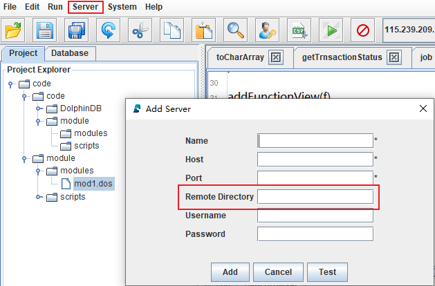

# DolphinDB 教程：模块

在使用 DolphinDB 的脚本进行开发时，可以创建可复用模块，以封装自定义函数。模块可以将大量函数按目录树结构组织在不同模块中。既可以在系统初始化时预加载模块，也可以在需要使用的时候引入模块。

## 1. Module（模块）介绍

在 DolphinDB 中，模块是只包含函数定义的脚本文件。它具有以下特点：

* 模块文件默认保存在 [home]/modules 目录下。
* 模块文件名的后缀为 .dos（"dolphindb script"的缩写）或 .dom（"dolphindb module"的缩写）。
* 模块文件第一行只能使用 module 后接模块名以声明模块，即 module module_name。 
* 模块文件除第一行外，仅可包含模块导入语句与函数定义。

## 2. 定义模块

### 2.1 创建模块目录

所有的模块定义默认存放在 [home]/modules 目录下：

* [home] 目录由系统配置参数 [home](https://www.dolphindb.cn/cn/help/DatabaseandDistributedComputing/Configuration/Initialization.html?highlight=home) 决定，可以通过 [getHomeDir](https://www.dolphindb.cn/cn/help/FunctionsandCommands/FunctionReferences/g/getHomeDir.html) 函数查看。
* 节点的模块目录由配置参数 [moduleDir](https://www.dolphindb.cn/cn/help/DatabaseandDistributedComputing/Configuration/Initialization.html?highlight=moduledir) 来指定，其默认值是相对路径 modules。系统会首先到节点的 home 目录寻找该目录，如果没有找到，会依次在节点的工作目录与可执行文件所在目录寻找。请注意，单节点模式下，这三个目录默认相同。

### 2.2 创建模块文件

在 modules 目录下创建以 .dos 为后缀的模块文件，例如 fileLog.dos。模块文件的第一行必须是模块声明语句。例如在 fileLog.dos 中声明模块：
```
module fileLog
```
其中 fileLog 是模块名，必须与模块文件（fileLog.dos）的名称一致。

模块文件除第一行外的内容仅可包含函数定义或模块导入语句（如需引用其它模块）。例如，fileLog 模块仅包括向指定日志文件写入日志的函数 `appendLog`：
```
module fileLog

def appendLog(filePath, logText){
	f = file(filePath,"a+")
	f.writeLine(string(now()) + " : " + logText)
	f.close()
}
```

在模块文件中，**除函数定义、模块声明语句和模块导入语句外，其它代码将被忽略**。

### 2.3 序列化模块文件

使用 [saveModule](https://www.dolphindb.cn/cn/help/FunctionsandCommands/CommandsReferences/s/saveModule.html) 函数可以将模块序列化成扩展名为 dom 的二进制文件。将模块序列化为 dom 文件能够增强代码的保密性和安全性。例如，序列化2.2中的 module fileLog：

```
saveModule("fileLog")
```

dom 文件会保存至 dos 文件所在的目录。

注意：
* 如果 dos 文件的内容发生改变，需要重新执行 [saveModule](https://www.dolphindb.cn/cn/help/FunctionsandCommands/CommandsReferences/s/saveModule.html) 函数来生成新的 dom 文件。可将 [saveModule](https://www.dolphindb.cn/cn/help/FunctionsandCommands/CommandsReferences/s/saveModule.html) 函数的 overwrite 参数设置为 true 来覆盖已有的 dom 文件。例如：

	```
	saveModule("fileLog" , , true)
	```
* 如果当前模块引用了另一个模块的函数，则在序列化该模块中只会对其依赖模块的名称进行序列化，不会序列化依赖函数的定义。因此，在加载或移动 .dom 文件时，需同时加载或移动其依赖的模块文件。

## 3. 导入模块

### 3.1 使用use关键字

使用 `use` 关键字来导入一个模块。如果导入的模块依赖了其他模块，系统会自动加载其他模块。

注意:
* `use` 关键字导入的模块是会话隔离的，仅对当前会话有效。
* `use` 关键字仅可导入后缀为 .dos 的模块文件，不可导入 .dom 二进制文件。

导入模块后，可以通过以下两种方式来使用模块内的自定义函数：

(1) 直接使用模块中的函数：
```
use fileLog
appendLog("mylog.txt", "test my log")
```

(2) 指定模块中的函数的命名空间（即在 modules 目录下的完整路径）：
```
use fileLog
fileLog::appendLog("mylog.txt", "test my log")
```
若导入的不同模块中含有相同名称的函数，则必须通过此种方式调用此类函数。

### 3.2 将模块内函数加载为系统内置函数

>该功能在1.20.1及以上版本支持。

3.1节提到，`use` 关键字导入的模块是会话隔离的，这在实际使用中会带来一些不便。为了解决这一问题，DolphinDB 支持通过 [loadModule](https://www.dolphindb.cn/cn/help/FunctionsandCommands/CommandsReferences/l/loadModule.html) 函数或者配置参数 [preloadModules](https://www.dolphindb.cn/cn/help/DatabaseandDistributedComputing/Configuration/StandaloneMode.html?highlight=preloadmodules) 将模块定义的函数加载为系统的内置函数，这样模块对所有会话都是可见的。

模块定义的函数成为内置函数之后，具有以下特点：

- 用户无法覆盖函数的定义。
- 如果在 [remoteRun](https://www.dolphindb.cn/cn/help/FunctionsandCommands/FunctionReferences/r/remoteRun.html) 或 [rpc](https://www.dolphindb.cn/cn/help/FunctionsandCommands/FunctionReferences/r/rpc.html) 中使用了该函数，系统不会序列化该函数的定义到远程节点。因此远程节点也必须加载该模块，否则系统会抛出无法找到函数的异常。
- 该函数在系统内存中只有一份，且对所有会话可见。不仅节约了内存，还减少了每个会话加载模块的时间。另外，无需使用 `use` 关键字导入模块，使得调用模块的代码更加简洁，API 调用模块函数更加方便。

可以通过 .dos 文件或 .dom 文件加载模块。系统会自动到 modules 目录寻找模块文件。如果目录中包含同名的 .dos 文件和 .dom 文件，系统只加载 .dom 文件。如果加载的是 .dom 文件，则用户无法查看模块内函数的定义。

如果加载的模块中引用了其他模块：
* 如果加载的是 .dos 文件，则系统在加载时会自动加载其依赖的模块。
* 如果加载的是 .dom 文件，则必须先加载该模块中所依赖的模块文件。

#### 3.2.1 通过 loadModule 函数加载

该函数只能在系统的初始化脚本（默认是dolphindb.dos）中使用，不能在命令行或者 GUI 中执行。例如，加载2.2中的模块 fileLog，在 dolphindb.dos 文件末尾加上：

```
loadModule("fileLog")
```
通过此方法加载模块后，在调用模块函数时必须指定函数的命名空间（即在 modules 目录下的完整路径）：

```
fileLog::appendLog("mylog.txt", "test my log")
```

#### 3.2.2 通过配置参数 preloadModules 加载

对单机版，该参数在 dolphindb.cfg 中配置。对集群版，需要为 controller 和 datanode 加载相同的模块。最简单的方法在 controller.cfg 和 cluster.cfg 中配置 [preloadModules](https://www.dolphindb.cn/cn/help/DatabaseandDistributedComputing/Configuration/StandaloneMode.html?highlight=preloadmodules) 参数。

例如：

```
preloadModules=fileLog
```
如果需要加载多个模块，使用逗号分隔。模块函数加载方法同 [loadModule](https://www.dolphindb.cn/cn/help/FunctionsandCommands/CommandsReferences/l/loadModule.html)

#### 3.2.3 与函数视图（function view）的区别

通过 [loadModule](https://www.dolphindb.cn/cn/help/FunctionsandCommands/CommandsReferences/l/loadModule.html) 或 [preloadModules](https://www.dolphindb.cn/cn/help/DatabaseandDistributedComputing/Configuration/StandaloneMode.html?highlight=preloadmodules) 生成的内置函数与 function view 对比，有以下区别：

- dom 模块的函数对所有人均不可见，包括系统管理员和 owner，保密性更高。function view 的定义对 admin 和 owner 以及授权用户可见。
- 所有模块都会有模块名称。function view 目前不支持域名限定。
- 序列化一个模块时，不会序列化依赖的函数，只会序列化依赖的模块名称。而 function view 序列化时，会序列化所有的依赖，以及依赖的依赖，实现 self-contained。

function view 和模块的应用场景有所不同。function view 一般用于跟数据库相关的数据访问。模块中的函数一般是通用的处理逻辑或算法。function view 可能会调用模块中的函数，但是模块中的函数一般不调用 function view。

## 4. 模块分类

### 4.1 声明模块类别命名空间

如果需要对模块进行分类，可在 modules 目录下设置多个子目录，以作为不同模块类别的命名空间。例如，现有两个模块 fileLog 和 dateUtil，它们分别存放于 modules/system/log/fileLog.dos 与 modules/system/temperal/dateUtil.dos。这两个模块相应的声明语句分别为 ```module system::log::fileLog``` 与 ```module system::temperal::dateUtil```。

### 4.2 调用命名空间模块

在对模块进行序列化（saveModule）、通过 `use` 语句导入、以及通过 [loadModule](https://www.dolphindb.cn/cn/help/FunctionsandCommands/CommandsReferences/l/loadModule.html) 函数或 [preloadModules](https://www.dolphindb.cn/cn/help/DatabaseandDistributedComputing/Configuration/StandaloneMode.html?highlight=preloadmodules) 配置参数加载时，均需指定完整路径。例如，导入上一节中的 fileLog 模块：
```
use system::log::fileLog
```
可以通过以下两种方法调用模块函数：

* 直接调用其中函数：
```
appendLog("mylog.txt", "test my log")
```
* 使用全路径调用其中函数：
```
system::log::fileLog::appendLog("mylog.txt", "test my log")
```

## 5. GUI中远程调试模块

当 GUI 所在机器与 DolphinDB 服务器不是同一台机器时，在 GUI 中编辑的模块代码，需要先上传到远程服务器的 [home]/modules 目录，才能通过 `use` 语句调用模块。其中[home]表示DolphinDB 的主目录，通过配置项 home 指定。

DolphinDB GUI 从0.99.2版本开始提供了远程同步模块的功能，具体用法如下：

1. 指定远程服务器路径：
   * 添加远程服务器（Server->Add Server）时，指定 `Remote Directory` 目录:   
   

   * 若上步中未指定 `Remote Directory`，可通过 Server->Edit Server 进行添加：   
   

2. 点击下图 `Synchronize to server` 将 modules 目录下的所有文件和子目录同步到步骤1设置的 `Remote Directory` 下。


假设 `Remote Directory` 设置为'[home]/modules'，本地需要同步的文件名是 "C:/users/usr1/Project/scripts/test.dos"。同步的时候，系统会在远端自动创建目录和相应文件 '[home]/modules/Project/scripts/test.dos'。

同步完成后，就可以在远程服务器上执行 `use` 语句导入模块。需要注意的是，在使用模块前，需要参考[2.1 节](#21-创建模块目录)设置模块路径。

## 6. 注意事项

### 6.1 同名函数定义规则

不同模块中可以定义相同名字的函数。如果使用全路径调用函数，可以通过模块命名空间来区分函数。

如果直接调用函数：

* 若只有一个已导入模块包含该函数，DolphinDB 会调用该模块的函数。
* 若多个已导入模块包含该函数，会抛出异常：
	```
	Modules [Module1] and [Module2] contain function [functionName]. Please use module name to qualify the function.
	```
* 若所有已导入的模块中均不包含该函数，DolphinDB 会在系统内置函数中搜索该函数。如果内置函数中也没有该函数，将抛出函数未定义的异常。
* 若已导入模块中某函数与某自定义函数重名，调用时需要通过命名空间来区分函数。自定义函数和内置函数的默认命名空间为根目录，用两个冒号表示。

下例中，首先创建自定义函数`myfunc`：
```
login("admin","123456")
def myfunc(){
 return 1
}
addFunctionView(myfunc)
```
然后定义模块sys，其中含有函数`myfunc`。
```
module sys
def myfunc(){
 return 3
}
```
若要调用模块sys中的函数`myfunc`，可在使用
```
use sys
```
之后，使用：
```
sys::myfunc()
```
或：
```
myfunc()
```
若要使用模块外的自定义函数，可使用：
```
::myfunc()
```

### 6.2 刷新模块定义

通过 `use` 导入模块时，模块函数被加载到缓存中，后续调用函数时，都将从缓存中进行调用。若需要在测试过程中快速反复修改模块代码并刷新定义，可采用以下方法：

* 在模块文件修改后执行全部的模块代码。这种方法仅对当前会话有效。
* 调用命令 clearCachedModules，强制清除缓存的模块。当缓存清除后，执行 use 语句时，会重新从文件加载模块，无需重启节点。只有 admin 才有权限执行这个命令。

### 6.3 模块间互相调用

* 模块之间可以单向引用，例如允许模块a引用b，b引用c。
* 模块之间不支持交叉引用，例如不允许模块a引用b，模块b又引用a。
