# 使用 Node-RED 构建 DolphinDB 低代码平台

DolphinDB 是由浙江智臾科技有限公司研发的一款高性能分布式时序数据库，集成了功能强大的编程语言和高容量高速度的流数据分析系统，为海量结构化数据的快速存储、检索、分析及计算提供一站式解决方案。DolphinDB 数据库支持每秒百万级数据写入，万亿级别数据毫秒级查询响应，以及高压缩比的数据存储，适用于工业物联网及量化金融等领域。

为了进一步简化 DolphinDB 的使用方式，我们在 Node-RED 上构建了一个 DolphinDB 低代码平台。通过可视化编程工具，我们将 DolphinDB 的功能抽象成易于理解的节点，使操作流程更加清晰明了。这种可视化方式不仅提高了用户使用平台的便捷性，还大大降低了用户的学习门槛。即使用户不了解 DolphinDB 的编程语言，也能轻松完成各种操作。

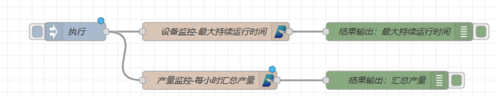

在我们的低代码平台上，用户只需使用简单的拖拉拽操作，便能实现无模式写入、数据清洗、降采样、设备监控、异常监测等功能，从而让数据处理变得更加便捷高效。

以下内容将详细介绍 Node-RED 平台的特点、DolphinDB 低代码平台的情况，以及开发 DolphinDB 节点的方法。

- [1. 关于 Node-RED](#1-关于-node-red)
- [2. DolphinDB 低代码平台](#2-dolphindb-低代码平台)
  - [2.1. 平台介绍](#21-平台介绍)
  - [2.2. 使用说明](#22-使用说明)
- [3. DolphinDB 低代码平台](#3-dolphindb-低代码平台)
  - [3.1. 案例介绍](#31-案例介绍)
- [4. DolphinDB 节点开发方法](#4-dolphindb-节点开发方法)
  - [4.1. 在 JavaScript 中连接 DolphinDB](#41-在-javascript-中连接-dolphindb)
  - [4.2. 案例](#42-案例)
- [5. 总结](#5-总结)
- [6. 附件](#6-附件)

## 1. 关于 Node-RED 

Node-RED 是一个开源的可视化编程工具，它让连接、编排和自动化物联网设备、API 和在线服务变得非常简单。它使用户能够通过简单地拖拽和连接节点来创建应用程序，其中每个节点代表一个特定的功能或服务。你可以把它想象成一个拼图游戏，通过拖拽和连接不同的拼图，就可以创建出各种应用程序。

举个例子，人们会希望在回家的路上就能开启空调，到家即享清凉。借助 Node-RED 可以轻松实现这个需求。通过简单地拖拽微信节点、消息处理节点和空调控制节点，然后连接设置它们，就能实现这个流程。这样，只需在微信上发送一条消息，就能控制家中空调的开关。

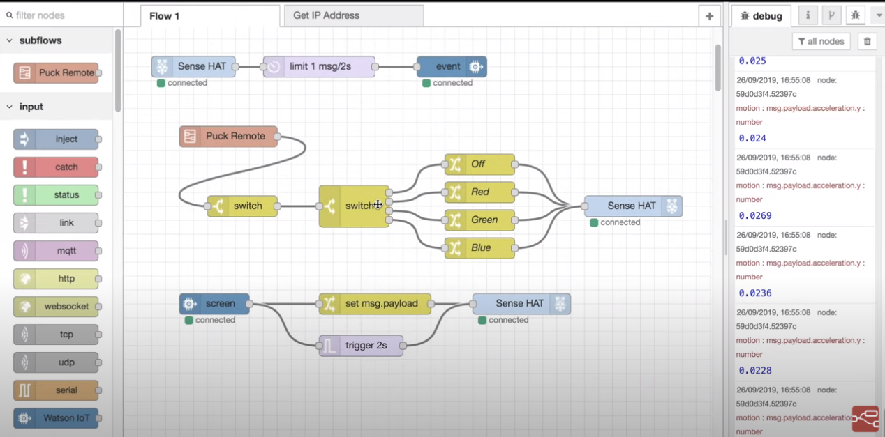

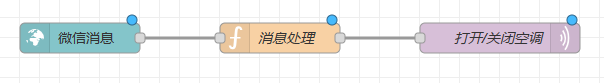

Node-RED 是基于 Node.js 构建的，因此具有轻量化和高效的特点。它充分利用了 Node.js 的事件驱动和非阻塞模型，在网络边缘的低成本硬件（如 Raspberry Pi）和云中表现出色。这使得 Node-RED 成为一个非常适用于各种场景的工具。

Node-RED 的节点扩展库中包含了许多内置节点和功能，例如数据库访问、Web 服务和电子邮件通知，这些功能大大简化了开发过程。它提供了强大的功能组件，让用户能够快速搭建复杂的物联网设备、API 和在线服务，无需编写繁琐的代码。

此外，Node-RED 使用 JSON 格式来存储流程，这使得共享和导入导出变得非常方便。用户可以轻松地与其他人分享自己的流程，并从社区中获取更多的解决方案和灵感。这种开放性和合作性为用户提供了更多的可能性和灵活性。

总的来说，Node-RED 是一个强大且易于使用的工具，提供了一个可视化编程环境，使用户能够轻松地连接、编排和自动化物联网设备、API 和在线服务。无论在物联网、自动化还是数据流处理领域，Node-RED 都是一个非常实用和受欢迎的工具，为用户带来了极大的便利和效率。

## 2. DolphinDB 低代码平台

### 2.1. 平台介绍

DolphinDB 低代码平台是一个基于 Node-RED 的 DolphinDB 功能可视化平台。具有强大的可扩展性，为用户提供了开发自定义功能节点的可能性。用户可以根据自身需求开发适合自己业务场景的功能节点，从而进一步增强平台的功能和适应性。


在案例介绍章节中，我们将介绍 DolphinDB 节点的开发方法，帮助用户更好地利用该低代码平台，实现更多个性化需求。

本文所提供的 DolphinDB 低代码平台案例提供了十余个节点，划分为文件操作、数据清洗和 DolphinDB 功能节点三个类别。文件操作类别提供了数据加载节点，方便用户将本地文件加载到 DolphinDB 的内存表中。数据清洗类别则提供了格式转换、NULL 填充、数据去重和数据归一化等功能节点，帮助用户实现各种数据清洗操作。而在 DolphinDB 功能节点类别中，提供了数据入库、降采样、无模式写入、流表创建和流数据引擎等功能节点，使用户能够轻松使用 DolphinDB 的功能，而无需掌握其编程语言。

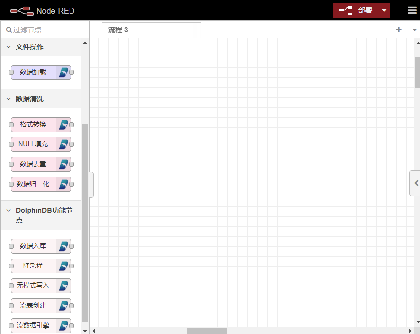

### 2.2. 使用说明

DolphinDB 低代码平台是基于 Node-RED 构建的，所以需先安装 Node-RED，Node-RED 的官方安装教程可参考：[Getting Started : Node-RED](https://nodered.org/docs/getting-started) 。在完成 Node-RED 的安装之后，可按以下步骤安装 DolphinDB 节点。

1. 下载 DolphinDB 节点。下载附件中的 DolphinDB 节点 `node-red-contrib-dolphindb-main` 安装包。例如在下例中，下载并解压至 *D:\Node_Red_Project* 文件夹下，文件里的内容如下：
    
    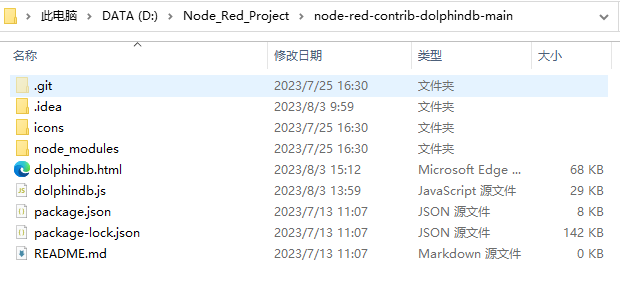
    
1. 将 DolphinDB 节点安装到 Node-RED 中。进入到 *.node-red* 目录（此目录应该在 *C:\Users\<用户名>* 目录下面），然后用 npm 安装 `node-red-contrib-dolphindb-main`。具体指令如下，  
    
    其中 *D:\Node_Red_Project\node-red-contrib-dolphindb-main* 是 DolphinDB 节点安装包的下载路径。

    ```bash
    cd C:\Users\<用户名>\.node-red
    npm install D:\Node_Red_Project\node-red-contrib-dolphindb-main
    ```
    安装成功后会出现以下内容。
    
    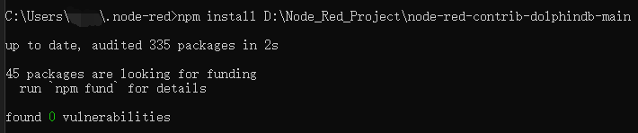

1. 使用 DolphinDB 节点。在 cmd 中输入指令 `node-red` 以开启 Node-RED 服务。出现以下内容表示 Node-RED 服务启动成功。

    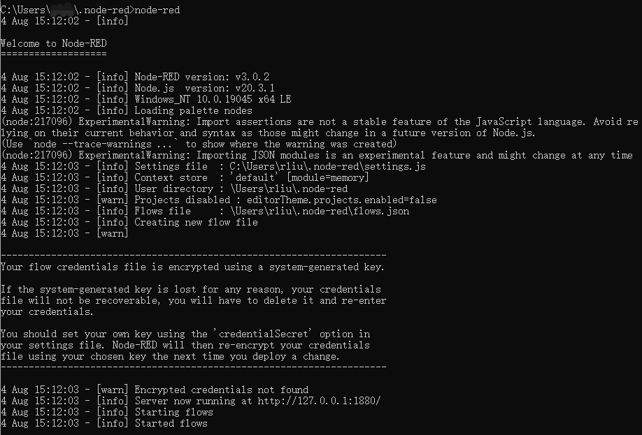
    
1. 打开网页 [http://localhost:1880](http://localhost:1880) 在左侧选项板中会出现 DolphinDB 节点，拖出来使用即可。

    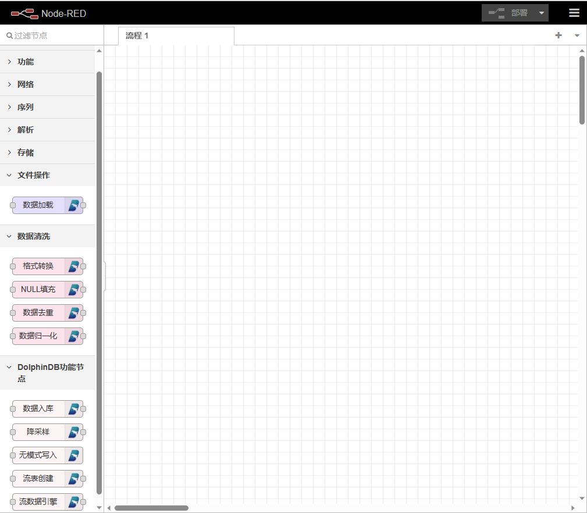
    
## 3. DolphinDB 低代码平台

### 3.1. 案例介绍
#### 3.1.1. 数据处理流程

在本文的 DolphinDB 低代码平台案例中，用户可以轻松地以拖拽的方式实现数据清洗流程。下文将介绍如何加载 CSV 文件中的数据，对其进行数据清洗，最后将清洗后的数据存入 DolphinDB 数据库。

首先，我们有以下 CSV 文件中的数据：

| id | date | price | qty | tmp |
|---|---|---|---|---|
| 1 | 2018.01.02 | 70.832104 | 1719 | 1.2 |
| 1 | 2018.01.03 | 12.22557 |   | 3.2 |
| 3 | 2018.01.04 | 8.695886 | 1656 | 0.4 |
| 4 | 2018.01.05 | 24.324535 | 2860 | 2 |
| 5 | 2018.01.06 | 0.443173 | 6874 | 3.8 |
| 6 | 2018.01.07 | 90.302176 | 3277 | -1.8 |
| 7 | 2018.01.08 | 78.556843 | 3424 | -0.6 |
| 8 | 2018.01.09 | 45.836447 | 8636 | 0.4 |
| 9 | 2018.01.10 | 57.416425 | 707 | 1.6 |
| 10 | 2018.01.11 | 98.879764 | 2267 | 4.2 |

数据清洗的具体操作过程如下：

1. 将 CSV 文件中的数据加载到 DolphinDB 内存表中。
1. 去除 id 列的重复值，确保每个 id 的数据是唯一的。
1. 对 price 列进行格式转换，将数据统一为两位小数。
1. 对 qty 列的 NULL 值，使用平均值进行填充，确保数据完整性。
1. 对 tmp 列进行 Max-Min 归一化，将数据缩放到 0 到 1 的范围。
1. 将清洗之后的数据存入 DolphinDB 数据库，以便后续的数据分析和应用。

以下为在 DolphinDB 低代码平台上实现上诉数据处理操作的过程。

1. 将 inject，加载文件，格式转换，null 填充，去重，数据归一化和数据入库节点拖拽到工作区中
1. 按照数据清洗的逻辑顺序将节点连接起来。

    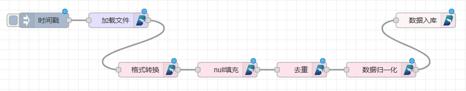

1. 点击节点，对节点进行相应的参数配置。

    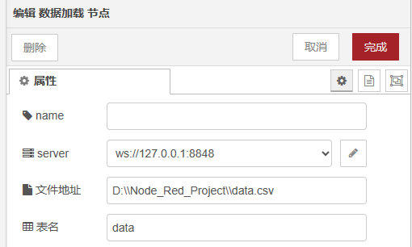

    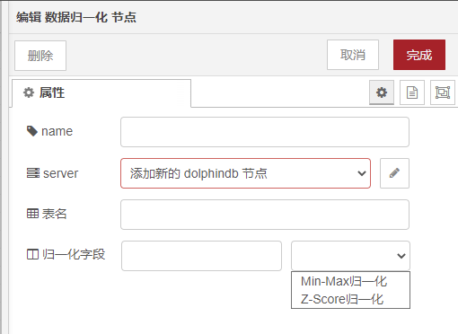

1. 点击工作区右上角的 **部署** 按钮。
1. 点击时间戳节点，触发流程启动。随后可在 DolphinDB 数据库中查看经过清洗之后的数据。

    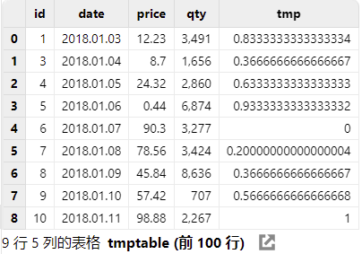

#### 3.1.2. 无模式写入

无模式写入是一种数据库写入方式，特别适用于物联网场景的设备采集数据。在传统的关系型数据库中，数据写入需要事先定义好数据表的结构，包括字段名称、数据类型和约束等信息。然而，在现实世界中，很多数据并不适合严格的表结构，例如采集频率不同的各类传感器数据等。

无模式写入解决了这个问题，它允许将数据直接写入数据库中，无需提前定义表结构。数据可以按照其原始格式灵活存储，无需额外的数据转换和处理，从而大大简化了数据写入的过程。

在 DolphinDB 低代码平台上，实现无模式写入的流程可以通过两个节点轻松完成。以下为实现无模式写入的具体过程：

1. 将 Mqtt In 节点和 无模式写入 节点拖拽到工作区
1. 将两个节点连接起来
1. 点击节点，进行参数设置。在 Mqtt In 节点中设置服务端和消息主题，在无模式写入节点中设置数据库名称。

    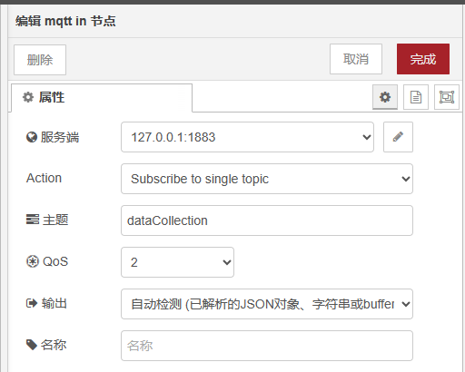
    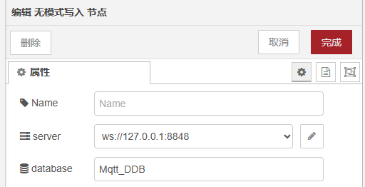

1. 点击部署按钮。

    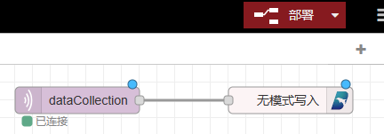
    
之后就可以向 mqtt 发消息，实现无模式写入。无模式写入中，在向 mqtt 发消息时，需要按照一定的格式要求，发送消息。这里发送多条类似以下内容的消息给 mqtt。

```
{
  "tags":{
      "deviceCode": "361RP01",
      "logicalPositionId": "1",
      "physicalPositionId": "AI361RP01T"
  },
  "fields":{
      "propertyValue":1505
  },
  "time": "2023-07-22 15:53:08"
}
```
如果运行成功，DolphinDB 中将出现名为 "Mqtt_DDB" 的数据库，并且数据库会不断接收来自 "Mqtt" 的消息。

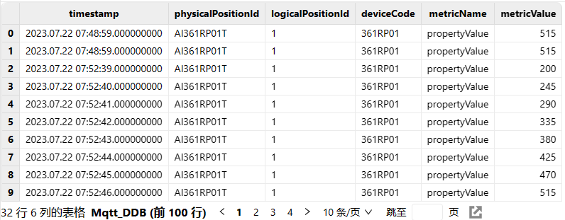

## 4. DolphinDB 节点开发方法

DolphinDB 节点是基于 Node-RED 的，因此开发 DolphinDB 节点需要先掌握 Node-RED 节点开发的基础知识。可参照：[Node-RED 节点开发教程](https://nodered.org/docs/creating-nodes/first-node)。

DolphinDB 的安装包中包含核心文件 *dolphindb.html* 和 *dolphindb.js*。其中，*dolphindb.html* 主要用于定义 DolphinDB 节点的属性、编辑对话框和帮助文本，而 dolphindb.js 则主要用于定义 DolphinDB 节点的功能。

在 DolphinDB 节点的 html 文件部分与普通 Node-RED 节点开发流程相似，因此这里不再赘述。我们重点介绍 *dolphindb.js* 中的节点功能实现方法，可参照：[JavaScript API](https://gitee.com/dolphindb/api-javascript/blob/master/README.zh.md) 进行开发。

### 4.1. 在 JavaScript 中连接 DolphinDB

1. 在 JavaScript 中导入 DolphinDB，并设置连接配置，建立与 DolphinDB 的连接。

    ```python
    import { DDB } from 'dolphindb'
    
    // 使用 WebSocket URL 初始化连接到 DolphinDB 的实例（不建立实际的网络连接）
    let ddb = new DDB('ws://127.0.0.1:8848', {
        // 是否在建立连接后自动登录，默认 `true`
        autologin: true,
        
        // DolphinDB 登录用户名，默认 `'admin'`
        username: 'admin',
        
        // DolphinDB 登录密码，默认 `'123456'`
        password: '123456',
        
        // 设置 python session flag，默认 `false`
        python: false,
        
        // 设置该选项后，该数据库连接只用于流数据
        streaming: undefined
    })
    
    // 建立到 DolphinDB 的连接
    await ddb.connect()
    ```

1. 建立配置节点，连接到 DolphinDB

    ```python
    function DolphinConfigNode(n) {
            RED.nodes.createNode(this, n);
            this.url = n.url
            this.name = n.name
            this.client = new DDB(this.url, {
                autologin: true,
                username: this.credentials.username,
                password: this.credentials.password,
                python: false,
                streaming: undefined
            })
        }
        RED.nodes.registerType("dolphindb", DolphinConfigNode, {
            credentials: {
                username: { type: "text" },
                password: { type: "password" }
            }
        });
    ```
1. DolphinDB 节点构造：
    
    a. 节点构造函数。节点由构造函数定义，该函数可用于创建节点的新实例。该函数传递一个包含流编辑器中设置的属性的对象。它必须做的第一件事是调用该 `RED.nodes.createNode` 函数来初始化所有节点共享的特征，然后就可以执行特定于节点的代码。
        
      ```python
        //构造函数
        function DolphinDBNode(config) {
            RED.nodes.createNode(this,config);
            // 获取 DolphinDB 配置结点
            this.dolphindb = n.dolphindb;
            this.dolphindbConfig = RED.nodes.getNode(this.dolphindb);
            var client = this.dolphindbConfig.client;
            
            //功能语句
        }
        //注册节点
        RED.nodes.registerType("DolphinDB",DolphinDBNode);
      ```
      b. 接收消息。节点注册该事件的侦听器 input，以接收来自流中上游节点的消息。一旦收到消息，就执行相应的功能。

    ```python
    this.on('input', function(msg, send, done) {
        //执行功能
    });
    ```
    
1. 函数语句。在 JavaScript 中，我们使用 `eval()` 函数来执行 DolphinDB 脚本。一般来说，我们将 DolphinDB 脚本分为函数 `func` 和函数调用 `funcall` 两个部分，然后将它们拼接在一起，并调用 `eval()` 函数来执行 DolphinDB 脚本。

    ```python
    var func=`def foo(a,b){
                   return a+b;
              }`
    var funcall=`foo(11,11)`
    var secipt=func+funcall
    const result = await ddb.eval(script)
    ```
    
### 4.2. 案例

最后，我们以数据归一化节点为例，来介绍 DolphinDB 节点的功能实现代码。

```python
//构造函数
function DolphinDataNormalizationNode(n) {
        RED.nodes.createNode(this, n);

        // 获取 DolphinDB 配置结点
        this.dolphindb = n.dolphindb;
        this.dolphindbConfig = RED.nodes.getNode(this.dolphindb);
        if (!this.dolphindbConfig) { //检查是否成功获取了 DolphinDB 配置节点
            this.error(RED._("dolphindb.errors.missingconfig"));
            return;
        }
        var client = this.dolphindbConfig.client;
        
        //将当前节点的上下文保存在变量 node 中
        this.name=n.name;
        this.tableName=n.tableName;
        this.colName=n.colName;
        this.normalizeType=n.normalizeType;

        var node = this;
        
        //DolphinDB 脚本
        var func=`def minMaxNormalization(tableName,colName){
                      pt=objByName(tableName);
                      minNum=min(pt[colName]);
                      maxNum=max(pt[colName]);
                      pt[colName]=(pt[colName]-minNum)/(maxNum-minNum);
                  }
                  def ZSoreNormalization(tableName,colName){
                      pt=objByName(tableName);
                      meanNum=mean(pt[colName]);
                      stdNum=std(pt[colName]);
                      pt[colName]=(pt[colName]-meanNum)/stdNum;
                  }
                  def dataNormalization(tableName,colName,type){
                      if(type==1){
                          minMaxNormalization(tableName,colName);
                      }else if(type==2){
                          ZSoreNormalization(tableName,colName);
                      }
                  }`;
        var funcall =`dataNormalization("${this.tableName}",\`${this.colName},${this.normalizeType})`;
        var script =func+funcall;
        
        console.log(script) //打印生成的 DolphinDB 脚本，用于调试和查看。
        
        //注册监听器 input，一旦收到消息，则执行 DolphinDB 脚本
        node.on('input', async function (msg, send, done) {
            client.eval(script).then(res => {
                send(msg)
                done()
            }).catch(err => {
                console.log(err)
                done(err)
            })
        });
    }
    
//注册节点
RED.nodes.registerType("数据归一化", DolphinDataNormalizationNode);
```

## 5. 总结

本文介绍了 Node-RED 平台，Node-RED 以其简单的拖拽和连接节点的方式，让用户能够轻松创建各种应用程序，无需编写繁琐的代码。

DolphinDB 低代码平台的构建基于 Node-RED。通过可视化编程方式将 DolphinDB 功能可视化为节点，使操作流程清晰明了。其中，数据清洗和无模式写入案例，展示了 DolphinDB 低代码平台的简便性和高效性。

更重要的是，DolphinDB 低代码平台具有很强的可扩展性。用户可以根据自身需求开发自定义功能节点，进一步增强平台的功能和适应性。这种开放性为用户提供了更多可能性和灵活性，使他们能够在平台上实现更多个性化需求。

通过 Node-RED 平台和 DolphinDB 低代码平台，用户能够轻松构建复杂的物联网设备、API 和在线服务，实现数据处理和存储，加速创新和数字化转型的进程。

## 6. 附件

- [DolphinDB 节点安装包](https://cdn.dolphindb.cn/downloads/docs/node-red-contrib-data-dolphindb.zip)
