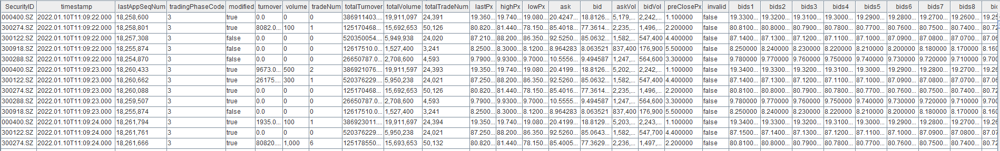
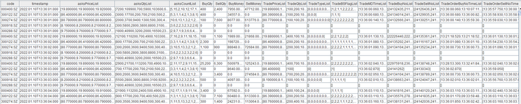
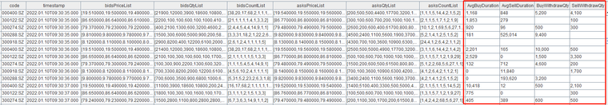
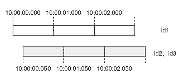
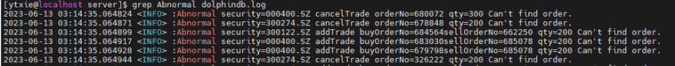

# 基于逐笔数据合成高频订单簿：DolphinDB 订单簿引擎


>**教程难度**
> - 中级
> 
>**面向读者**
>- 已经掌握 DolphinDB 基础编程语法的用户：[编程语言](https://docs.dolphindb.cn/zh/progr/progr_intro.html)
>- 学习了 [createOrderbookSnapshotEngine](../funcs/c/createOrderbookSnapshotEngine.dita) 和 [genOutputColumnsForOBSnapshotEngine](../funcs/c/genOutputColumnsForOBSnapshotEngine.dita)
>- 本教程提供了完整的测试数据和测试代码，初学者也可以跟随教程内容复现业务场景

----

订单簿是交易市场上买卖双方正在报价的不同价格的列表。订单簿快照反应了特定时刻市场上的交易意图，比如交易活跃的证券标的往往有着密集的订单簿。订单簿快照对量化金融的交易策略、风险管理和市场分析等方面都具有重要意义。

通常交易所可以提供实时和历史的行情快照数据，快照中除订单簿以外还包括最新成交价等成交信息。以沪深两市的股票为例，交易所提供了 3 秒频率的 10 档订单簿，也称为 Level-2 快照。随着高频量化交易的发展和实时处理系统能力的提升，3 秒频率的订单簿已经无法满足 T0 等高频策略的需求。量化团队迫切需要更高频和更丰富的行情快照信息，使其在实盘中能够更快的掌握最新的市场变化。

为了满足上述需求，一些量化团队会尝试通过逐笔数据合成订单簿，但是投入后便会发现困难重重，在解决合成结果的正确性、实时合成的低延时等关键问题上都需要投入巨大的研发资源。为了满足业界对高频订单簿的个性化需求，同时降低用户的开发成本，DolphinDB 基于其在高性能流计算上的技术储备，以及和金融客户的紧密业务合作，推出了经过正确性校验的高性能订单簿引擎。用户只需要通过 `createOrderbookSnapshotEngine` 函数即可定义订单簿引擎，再通过向引擎输入符合约定的逐笔成交和逐笔委托数据来合成订单簿。

在业务上，订单簿引擎支持以下功能：

- 支持多个交易所的多种证券类型，比如深交所股票
- 支持任意档位和任意频率的订单簿
- 支持成交明细、委托明细、撤单明细等丰富的衍生指标
- 支持用户自定义指标

在实时技术上，订单簿引擎支持以下功能：

- 支持流批一体
- 支持多种时间概念，比如事件时间、机器时间
- 支持灵活的触发机制，比如不同股票之间相互触发

订单簿引擎需要在商业版 license 的基础上额外开通订单簿引擎功能，欢迎联系小助手或销售申请试用。此外，本文全部代码需要运行在 2.00.12 及以上版本的 DolphinDB server 上。

- [基于逐笔数据合成高频订单簿：DolphinDB 订单簿引擎](#基于逐笔数据合成高频订单簿dolphindb-订单簿引擎)
  - [1. 订单簿引擎（Orderbook Snapshot Engine）工作原理](#1-订单簿引擎orderbook-snapshot-engine工作原理)
    - [1.1 订单簿的合成逻辑](#11-订单簿的合成逻辑)
    - [1.2 对时间窗口的处理](#12-对时间窗口的处理)
    - [1.3 对乱序数据的处理](#13-对乱序数据的处理)
    - [1.4 证券类型和规则的支持性](#14-证券类型和规则的支持性)
  - [2. 输入数据准备](#2-输入数据准备)
    - [2.1 数据处理注意事项](#21-数据处理注意事项)
    - [2.2 历史批计算的输入数据处理方案](#22-历史批计算的输入数据处理方案)
    - [2.3 实时流计算的输入数据处理方案](#23-实时流计算的输入数据处理方案)
  - [3. 订单簿合成](#3-订单簿合成)
    - [3.1 合成 1 秒频率订单簿](#31-合成-1-秒频率订单簿)
    - [3.2 合成包含衍生指标（如逐笔成交明细）的订单簿](#32-合成包含衍生指标如逐笔成交明细的订单簿)
    - [3.3 合成包含用户自定义指标的订单簿](#33-合成包含用户自定义指标的订单簿)
  - [4. 性能测试](#4-性能测试)
    - [4.1 历史批计算性能](#41-历史批计算性能)
    - [4.2 实时流计算性能](#42-实时流计算性能)
  - [5. 订单簿正确性校验](#5-订单簿正确性校验)
    - [5.1 校验输入数据无异常](#51-校验输入数据无异常)
    - [5.2 校验输出结果中的各个指标字段符合交易所规则](#52-校验输出结果中的各个指标字段符合交易所规则)
  - [6. 其他辅助功能](#6-其他辅助功能)
    - [6.1 按时间偏移后分批输出](#61-按时间偏移后分批输出)
  - [7. 常见问题解答（FAQ）](#7-常见问题解答faq)
    - [7.1 输入表的表结构一定要和示例一致吗](#71-输入表的表结构一定要和示例一致吗)
    - [7.2 输出表的表结构一定要和示例一致吗](#72-输出表的表结构一定要和示例一致吗)
    - [7.3 输出结果中的 abnormal 字段为 true 是什么原因呢](#73-输出结果中的-abnormal-字段为-true-是什么原因呢)
    - [7.4 输入数据是不是必须包含 BSFlag 字段？如果 BSFlag 为 N（未知），应该怎么处理](#74-输入数据是不是必须包含-bsflag-字段如果-bsflag-为-n未知应该怎么处理)
    - [7.5 输入数据后，引擎一直没有输出或者输出的结果很少，是什么原因造成的](#75-输入数据后引擎一直没有输出或者输出的结果很少是什么原因造成的)

## 1. 订单簿引擎（Orderbook Snapshot Engine）工作原理

订单簿引擎是一个内置的计算组件，通过 `createOrderbookSnapshotEngine` 函数可以创建引擎，再通过向引擎输入符合约定的逐笔成交和逐笔委托数据来触发计算。引擎的计算结果包括多档量价、逐笔明细、用户自定义指标等丰富的行情信息，计算结果会被输出到目标表。

本章介绍订单簿引擎在合成逻辑、时间窗口、乱序数据处理等方面的内部实现原理，以及订单簿引擎目前对不同交易规则的支持性。若对原理没有兴趣，可以直接跳至第二章开始具体的订单簿合成代码实现。

### 1.1 订单簿的合成逻辑

订单簿引擎采用基于消减的合成逻辑，仅需输入逐笔委托与逐笔成交数据即可：

- 在一个通道内，按 ApplSeqNum 有序逐条处理逐笔数据。ApplSeqNum 为交易所原始消息记录号，也称为 BizIndex，同频道内自 1 开始计数；
- 当收到委托时缓存委托单的价格和量，当收到成交和撤单时，从缓存中减去对应委托单的价格和量；
- 通过引擎内部缓存的委托单信息可以计算出每个报价的委托量、委托笔数等信息。

整体的合成逻辑如上，在此基础上也会遵循交易规则修正后再输出订单簿，以保证输出结果的准确性。比如对于深交所股票，引擎支持创业板价格笼子判断，部分报价会因为触发价格笼子规则而不体现在订单簿中，用户可以通过参数控制是否启动该规则。

通过将引擎计算结果与交易所发布的 3 秒快照进行比较，可以验证引擎内部合成逻辑的正确性。具体的校验方案与实现脚本见本文第 5 章。

### 1.2 对时间窗口的处理

订单簿快照表示了某个时刻的订单簿截面，截面表示的窗口范围以及何时进行截面都由引擎自动控制。接下来我们介绍引擎在窗口时间、触发窗口的时机等方面的工作原理。

当订单簿引擎设置的输出频率为 1 秒时，若输出一条时间戳字段为 10:00:00 的计算结果，该计算结果表示的是时间戳小于等于 10:00:00 的全部逐笔形成的最新订单簿。一些窗口指标如当前周期内成交量，则对应的是在 (09:59:59, 10:00:00] 这个左开右闭区间内的逐笔数据的总成交量。仅有时间戳为 14:57:00 的结果的含义稍有不同，引擎的输出到 14:57:00 就会停止，即引擎的处理与输出不包含收盘集合竞价阶段，所以 14:57:00 的计算结果对应 (14:56:59, 14:57:00) 这个左开右开区间内的逐笔数据。

在实时合成时，逐笔数据逐条进入引擎，引擎需要一个规则来判断何时窗口内的逐笔数据全部到齐了。以输出 10:00:00 的订单簿为例，判断规则是一旦收到一条时间戳大于 10:00:00 的逐笔数据（包含委托和成交），则认为应该输出 10:00:00 的计算结果了。计算结果中不包含触发输出的这条逐笔数据。此判断规则可以基于单支标的或全部标的。当指定单支标的时，每支标的收到一条时间戳大于 10:00:00 的逐笔数据时，仅触发计算并输出该标的的订单簿。当指定全部标的时，收到任意标的的时间戳大于 10:00:00 的逐笔数据时，触发计算并输出全部标的的订单簿。

此外，若某一段时间的逐笔数据空缺，则输出也会空缺，以午盘休市为例，引擎不会输出11:30:01-12:59:59 时间戳的订单簿，因为没有这段时间的逐笔数据。

严格地按照逐笔数据里的时间戳截取订单簿快照，将能够保证实盘和历史计算总能得到一致的结果，实现“流批一体”。根据已有的落地实践经验，在实盘中，我们推荐将一个通道中全部的标的视为一个整体，用全部标的的事件时间（即数据中的交易时间字段）来判断何时截取快照，这种方式能够保证尽快且准确地推出订单簿快照。此外，为了满足不同的场景需求，后续版本中也将推出基于机器时间的订单簿处理，即机器时间每经过一个时间间隔输出一次最新的订单簿。

### 1.3 对乱序数据的处理

在实盘环境中，接入到系统中的逐笔数据可能发生乱序，如不能正确处理乱序会影响订单簿合成的正确性。在交易所内部系统中，每个交易通道中的标的发生的委托和成交事件都会被赋予一个顺序号，即 ApplSeqNum。这个顺序号反映了事件在交易所内部实际发生的顺序。数据乱序，是指可能是由于网络延迟或其他技术问题导致的事件没有严格按照 ApplSeqNum 到达数据处理系统。因此，数据处理系统收到的逐笔数据可能需要重新排序，以确保它们反映了在交易所内部实际发生的顺序。

例如，如果标的A的逐笔成交比对应的逐笔委托先到达，引擎按到达顺序处理，先处理成交再处理委托则会得到错误的订单簿结果。为此，订单簿引擎支持指定输入数据中的 ApplSeqNum 字段，引擎会检测并缓存 ApplSeqNum 发跳变的数据，在接收到正确 ApplSeqNum 的数据后再计算输出，可以保证订单簿合成的正确性。用户可以根据业务需求和接收到的数据质量，选择是否开启处理乱序数据的功能。

下图展示了收到不同的 ApplSeqNum 时的处理方式，从左至右表示了时间先后顺序，即最先收到ApplSeqNum=1的输入数据。

| 收到的 ApplSeqNum   | 1    | 2    | 5        | 6          | 9            | 3    | 4              |
| ---------------- | ---- | ---- | -------- | ---------- | ------------ | ---- | -------------- |
| 此次处理的 ApplSeqNum | 处理1  | 处理2  | 无处理（缓存5） | 无处理（缓存5、6） | 无处理（缓存5、6、9） | 处理3  | 遍历处理4、5、6（缓存9） |

### 1.4 证券类型和规则的支持性

2.00.12及以上版本，支持沪深两市的股票、基金以及可转债等证券类型的订单簿合成。更具体的规则支持性如下：

- 通过参数控制是否包含创业板价格笼子规则。深交所股票默认按全面注册制启动以前的规则处理的，其中包含创业板价格笼子规则；
- 包含对市价单、本方最优单等委托单的处理逻辑，能够以正确的价格输出到订单簿上；
- 沪深可转债按2022年08月启动的新规进行处理；
- 不包含上市前5日创业板的特殊规则，即不保证创业板标的上市前5日的订单簿正确性；
- 不包含上市首日主板的特殊规则，即不保证主板标的上市首日的订单簿正确性。

## 2. 输入数据准备

订单簿引擎的计算正确性依赖于输入数据的正确性，因此对于输入数据有着较为严格的要求。本节讲解对输入数据的要求和具体示例。

### 2.1 数据处理注意事项

- **成交和委托的合并表**

订单簿引擎的输入为一张表，该表需要同时包含逐笔成交数据和逐笔委托数据。将逐笔成交、逐笔委托处理成相同的表结构可以存储到同一张输入表中。

- **完整的必选输入字段**

输入数据至少包含以下 10 个字段，引擎计算依赖这 10 种数据内容。引擎创建时必须指定参数 *inputColMap*，该参数为字典，其指定了引擎计算需要的各种数据内容对应的输入数据中的字段名称。此外，输入表中可以冗余其他字段。

| **inputColMap 的 key 值** | **inputColMap 的 value 对应的字段的数据类型** | **字段说明**                                 |
| ----------------------- | ---------------------------------- | ---------------------------------------- |
| “codeColumn”            | SYMBOL                             | 证券代码（如 300010.SZ 或者 300010 ，注意必须以数字开头，而不能是 SZ.300010 等形式） |
| “timeColumn”            | TIME                               | 交易时间                                     |
| “msgTypeColumn”         | INT                                | 0 逐笔委托；1 逐笔成交                            |
| “typeColumn”            | INT                                | 逐笔委托：1市价；2限价；3本方最优；10撤单（仅上交所，即上交所撤单记录在逐笔委托中）；逐笔成交：0成交；1撤单（仅深交所，即深交所撤单记录在逐笔成交中） |
| “priceColumn”           | LONG                               | 真实价格*10000（引擎输出结果时价格字段会自动除以 10000）       |
| “qtyColumn”             | LONG                               | 数量                                       |
| “sideColumn”            | INT                                | 1买；2卖委托单的 BSFlag；撤单的 BSFlag，由原始委托单决定买卖方向；成交单的 BSFlag，由主动方决定买卖方向； |
| “buyOrderColumn”        | LONG                               | 逐笔成交：对应其原始成交中的买方委托序号；逐笔委托：若为上交所，填充原始委托中的原始订单号（上交所在新增、删除订单时用以标识订单的唯一编号，OrderNo 字段）；若为深交所，约定填充0，此为深交所数据为了补全上交所数据格式增加的冗余列 |
| “sellOrderColumn”       | LONG                               | 逐笔成交：对应其原始成交中的卖方委托序号；逐笔委托：若为上交所，填充原始委托中的原始订单号（上交所在新增、删除订单时用以标识订单的唯一编号，OrderNo 字段）；若为深交所，约定填充0，此为深交所数据为了补全上交所数据格式增加的冗余列 |
| “seqColumn”             | LONG                               | 一个通道内从 1 开始递增的逐笔数据序号（深交所为 appseqlnum 字段，若您的数据里深交所中包含 index 字段，也可以使用index ，index 和 appseqlnum 完全一致）（上交所为 bizIndex 字段） |

- **规范的枚举值**

  订单簿引擎约定了以上字段中的枚举类型列中的枚举值。输入表中的枚举值必须符合约定才能得到正确结果。如 BSFlag 字段，约定1代表买方向， 2代表卖方向。

- **seqColumn 列的注意事项**

  - 深交所的委托单中的 seqColumn 列表示了委托单号，之后撤单和成交时都需要找到这个对应的委托单号，因此 seqColumn 代表的值必须正确。
  - 除上述含义以外，seqColumn 列还可以用于判断逐笔数据的处理顺序。订单簿引擎创建时指定参数 *orderBySeq*=false，则引擎依赖输入数据进入引擎的先后顺序逐条处理。创建时若指定参数 *orderBySeq*=true，则引擎依赖 依赖 seqColumn 列中值的大小顺序逐条处理数据，工作原理见 [1.3 对输入数据乱序的处理小节](#13-对乱序数据的处理)。
  - 深交所股票、深交所可转债、深交所基金、上交所可转债分别在各自的通道中。上交所的基金和股票会在同一通道内。一个通道内的 ApplSeqNum 从1开始连续编号。

- **对于同一个订单簿引擎，至多只能输入一天一个通道的全部标的**

引擎内部为每支标的维护一个累积的订单簿，并且不会在新的交易日清除前一天的状态，因此引擎不允许跨越多个交易日计算订单簿。此外，若引擎的触发机制是任意到来一支标的的最新数据就触发全部标的输出（参数 *triggerType*=”mutual”），那么用同一个引擎处理多个通道（原始逐笔数据中的 ChannelNo ）也是不建议的，因为多个通道按 ApplSeqNum 递增排序后，逐笔时间字段可能不再递增，则将导致提前触发输出。

### 2.2 历史批计算的输入数据处理方案

通常逐笔成交数据和逐笔委托数据以不同的表结构存储在不同的文件或者数据库表中，本例提供批量合并成交和委托至同一张表中的示例。由于深交所数据和上交所数据的差异，本章分为两个小节逐一介绍。

#### 2.2.1 深交所股票

**输入数据**

逐笔成交数据文件：[trans.csv](./script/orderBookSnapshotEngine/trans.zip)

逐笔委托数据文件：[orders.csv](./script/orderBookSnapshotEngine/orders.zip)

数据共包含2022.06.01当天5支深交所股票的完整逐笔数据。

**示例脚本**

```
/*
 *  功能：将深交所逐笔成交和委托写入同一张表 OrderTrans
 */
// 登录
login("admin", "123456")
// 创建合并表 OrderTrans
name = `SecurityID`Date`Time`SourceType`Type`Price`Qty`BSFlag`BuyNo`SellNo`ApplSeqNum`ChannelNo
type = `SYMBOL`DATE`TIME`INT`INT`LONG`LONG`INT`LONG`LONG`LONG`INT
OrderTrans = table(1:0, name, type)
// 指定待加载的文件路径
orderPath = "./orders.csv"
transPath = "./trans.csv"
// 指定枚举值的映射关系
tradeTypeMap = dict([0, 1], [0, 1])
orderTypeMap = dict([1, 2, 3], [1, 2, 3])
BSFlagMap = dict([1, 2], [1, 2])

// 加载csv文件并处理order为特定的表结构	
orderTemp = select 
		SecurityID, MDDate, temporalParse(lpad(string(MDTime), 9, `0), "HHmmssSSS") as Time, 0 as SourceType, orderTypeMap[OrderType] as Type, OrderPrice*10000 as Price, OrderQty as Qty, BSFlagMap[OrderBSFlag] as BSFlag, 0 as BuyNo, 0 as SellNo, ApplSeqNum, ChannelNo
		from loadText(orderPath)
OrderTrans.append!(orderTemp)
// 加载csv文件并处理transaction为特定的表结构
tradeTemp = select 
		SecurityID, MDDate, temporalParse(lpad(string(MDTime), 9, `0), "HHmmssSSS") as Time, 1 as SourceType, tradeTypeMap[TradeType] as Type, TradePrice*10000 as Price, TradeQty as Qty, BSFlagMap[TradeBSFlag] as BSFlag, TradeBuyNo as BuyNo, TradeSellNo as SellNo, ApplSeqNum, ChannelNo
		from loadText(transPath)
OrderTrans.append!(tradeTemp)
// 保存合并结果
saveText(OrderTrans, "./orderTrans.csv")
```

- 处理深交所委托时，BuyNo 和 SellNo 均置为 0，即无实际意义。深交所的逐笔委托数据中，ApplSeqNum 字段用于标识委托单的唯一编号。当一个成交发生时，成交单中的 TradeBuyNo 和TradeSellNo 字段分别对应买方和卖方委托单的 ApplSeqNum 。
- 注意，这里用 3 个字典来处理了枚举值的映射关系，字典的 key 是原始文件中的值，字典的 value 是订单簿引擎规定的枚举值。

```
tradeTypeMap = dict([0, 1], [0, 1])
orderTypeMap = dict([1, 2, 3], [1, 2, 3])
BSFlagMap = dict([1, 2], [1, 2])
```

本例比较特殊，原始文件与订单簿引擎枚举值一致。如果原始文件使用其他数据源，需要修改字典的 key 值为原始文件中的枚举值。以通联的深交所数据为例，则映射关系应该指定如下：

```
tradeTypeMap = dict([70, 52] , [0 ,1])
orderTypeMap = dict([49, 50, 85], [1, 2, 3])
BSFlagMap = dict([49, 50] , [1, 2])
```

#### 2.2.2 上交所股票

**输入数据**

逐笔成交数据文件：[SHtrans.csv](./script/orderBookSnapshotEngine/SHtrans.zip)

逐笔委托数据文件：[SHorders.csv](./script/orderBookSnapshotEngine/SHorders.zip)

数据共包含2023.07.11当天5支上交所股票的完整逐笔数据。

**示例脚本**

```
/*
 *  功能：将上交所逐笔成交和委托写入同一张表 OrderTrans
 */
// 登录
login("admin", "123456")
// 创建合并表 OrderTrans
name = `SecurityID`Date`Time`SourceType`Type`Price`Qty`BSFlag`BuyNo`SellNo`ApplSeqNum`ChannelNo
type = `SYMBOL`DATE`TIME`INT`INT`LONG`LONG`INT`LONG`LONG`LONG`INT
OrderTrans = table(1:0, name, type)
// 指定待加载的文件路径
orderPath = "./SHorders.csv"
transPath = "./SHtrans.csv"
// 指定枚举值的映射关系
tradeTypeMap = dict([0], [0])
orderTypeMap = dict([2, 10], [2, 10])
BSFlagMap = dict([1, 2], [1, 2])

// 加载csv文件并处理order为特定的表结构	
orderTemp = select 
		SecurityID, MDDate, MDTime, 0 as SourceType, OrderType as Type, OrderPrice*10000 as Price, OrderQty as Qty, OrderBSFlag as BSFlag, OrderNo as BuyNo, OrderNo as SellNo, ApplSeqNum, ChannelNo
		from loadText(orderPath)
OrderTrans.append!(orderTemp)
// 加载csv文件并处理transaction为特定的表结构
tradeTemp = select 
		SecurityID, MDDate, MDTime as Time, 1 as SourceType, TradeType as Type, TradePrice*10000 as Price, TradeQty as Qty, TradeBSFlag as BSFlag, TradeBuyNo as BuyNo, TradeSellNo as SellNo, ApplSeqNum, ChannelNo
		from loadText(transPath)
OrderTrans.append!(tradeTemp)
// 保存合并结果
saveText(OrderTrans, "./SHorderTrans.csv")
```

- 处理上交所委托时，BuyNo 和 SellNo 均置为 OrderNo。上交所的逐笔委托数据中，OrderNo 字段用于标识委托单的唯一编号。当一个成交发生时，成交单中的 TradeBuyNo 和TradeSellNo 字段分别对应买方和卖方委托单的 OrderNo 。
- 若您使用的上交所逐笔中包含 bizIndex 字段，bizIndex 字段和 ApplSeqNum 字段的等价的，即上交所逐笔中会包含其中的某一个，表示一个通道内全部逐笔从 1 开始的编号。
- 注意，这里用 3 个字典来处理了枚举值的映射关系，字典的 key 是原始文件中的值，字典的 value 是订单簿引擎规定的枚举值。本例比较特殊，原始文件与订单簿引擎枚举值一致。如果原始文件使用其他数据源，需要修改字典的 key 值为原始文件中的枚举值。
  - 若您使用的上交所逐笔成交数据中不包含成交类型字段，可以将 TradeType 全部以 0 填充。
  - 指定 orderTypeMap 时，上交所不包含市价单，因此只需要区分下单 2 和撤单 10 。

### 2.3 实时流计算的输入数据处理方案

在实时数据接入订单簿引擎时，建议保证逐笔成交和逐笔委托以交易所发送的真实顺序有序写入 DolphinDB 流数据表中。如果逐笔数据在抵达 DolphinDB 服务器时 ApplSeqnum 出现乱序，可以在创建引擎时指定 *orderBySeq*=true，由引擎保证按 seqColumn 的顺序处理数据。实时数据接入的大致流程如下:

- 首先在 DolphinDB 中创建流数据表，可以是共享流数据表，也可以是持久化流数据表。
- 其次，通过行情 sdk 同时订阅逐笔成交和逐笔委托数据。在行情 sdk 的回调函数中解析收到的逐笔成交和逐笔委托数据、转换枚举值。
- 最后，将同一个通道的逐笔成交和逐笔委托数据写入同一张流数据表 。

一般有两种方式将实时数据源接入 DolphinDB server 中：

- 方案一：使用行情数据源插件。目前，amdQuote、INSIGHT 插件已经支持将委托和成交接收到同一张表中，并且内置实现了枚举值转换。通过 amd 插件/insight 插件可以直接接收到订单簿引擎期望的输入数据。
  - amd 插件： [amdQuote（LINUX）](https://docs.dolphindb.cn/zh/plugins/amdquote/amdquote.html)
  - insight 插件：[INSIGHT](https://docs.dolphindb.cn/zh/plugins/insight/insight.html)
  - 其余行情插件也将陆续支持此功能，最新进展见官网文档。如有需求也可以联系 DolphinDB 小助手进一步咨询。
- 方案二：使用 DolphinDB API 编写外部程序，推荐使用 `MultithreadedTableWriter` 接口往 DolphinDB 实时写入数据，具体开发可以参考上述流程和插件源码。

## 3. 订单簿合成

订单簿引擎内置了合成逻辑，同时提供了丰富的可选参数。用户通过参数可以自定义输出结果中的频率、订单簿深度、指标字段等。本章循序渐进介绍如何使用 `createOrderbookSnapshotEngine` 函数创建订单簿引擎，并输入数据得到自定义的订单簿。

首先，第一小节介绍合成 1 秒频率的订单簿，输出引擎默认的订单簿内容，包括基础的订单簿信息和成交信息，帮助用户掌握订单簿引擎最基础的使用方法。

其次，第二小节介绍合成包含逐笔成交明细的订单簿。用户将通过 *outputColMap* 参数自定义所需的订单簿字段，以获得比普通行情快照更丰富的衍生指标。

最后，第三小节介绍合成包含用户自定义指标的订单簿，用户将基于引擎提供的全部指标和 *userDefinedMetrics* 参数实现自定义指标，自定义指标将和订单簿一起计算输出。

### 3.1 合成 1 秒频率订单簿

#### 3.1.1 创建订单簿引擎

首先创建订单簿引擎，以下脚本中名为“demo”的订单簿引擎的功能是每1秒计算输出深交所股票10档订单簿。

```
// 定义引擎参数outputTable，即指定输出表
suffix = string(1..10)
colNames = `SecurityID`timestamp`lastAppSeqNum`tradingPhaseCode`modified`turnover`volume`tradeNum`totalTurnover`totalVolume`totalTradeNum`lastPx`highPx`lowPx`ask`bid`askVol`bidVol`preClosePx`abnormal  join ("bids" + suffix) join ("bidVolumes" + suffix) join ("bidOrderNums" + suffix) join ("asks" + suffix)  join ("askVolumes" + suffix) join ("askOrderNums" + suffix) 
colTypes = [SYMBOL,TIMESTAMP,LONG,INT,BOOL,DOUBLE,LONG,INT,DOUBLE,LONG,INT,DOUBLE,DOUBLE,DOUBLE,DOUBLE,DOUBLE,LONG,LONG,DOUBLE,BOOL] join take(DOUBLE, 10) join take(LONG, 10) join take(INT, 10) join take(DOUBLE, 10) join take(LONG, 10) join take(INT, 10) 
outTable = table(1:0, colNames, colTypes)
// 定义引擎参数dummyTable，即指定输入表的表结构
colNames = `SecurityID`Date`Time`SourceType`Type`Price`Qty`BSFlag`BuyNo`SellNo`ApplSeqNum`ChannelNo
colTypes = [SYMBOL, DATE, TIME, INT, INT, LONG, LONG, INT, LONG, LONG, LONG, INT]
dummyOrderTrans = table(1:0, colNames, colTypes)
// 定义引擎参数inputColMap，即指定输入表各字段的含义
inputColMap = dict(`codeColumn`timeColumn`typeColumn`priceColumn`qtyColumn`buyOrderColumn`sellOrderColumn`sideColumn`msgTypeColumn`seqColumn, `SecurityID`Time`Type`Price`Qty`BuyNo`SellNo`BSFlag`SourceType`ApplSeqNum)
// 定义引擎参数prevClose，即昨日收盘价，prevClose不影响最终的输出结果中除昨日收盘价以外的其他字段
prevClose = dict(`000400.SZ`300274.SZ`300288.SZ`300122.SZ`300918.SZ, [1.1, 2.2, 3.3, 4.4, 5.5])
// 创建引擎，每1s计算输出深交所股票10档订单簿
engine = createOrderBookSnapshotEngine(name="demo", exchange="XSHE", orderbookDepth=10, intervalInMilli=1000, date=2022.01.10, startTime=09:30:00.000, prevClose=prevClose, dummyTable=dummyOrderTrans, inputColMap=inputColMap, outputTable=outTable, orderBySeq=false)
```

- *exchange* 指定证券类型，决定了引擎使用的交易规则。“XSHE”表示深交所股票。
- *orderbookDepth* 指定订单簿深度。
- *intervalInMilli* 为输出的时间间隔，单位为毫秒，决定了输出的快照频率。
- *date* 日期，输出结果中的 timestamp 时间列的日期由本参数决定。
- *startTime* 开始输出的时间戳。
- *prevClose* 昨收价，通过当日逐笔并不能计算出昨收价，所以需要以静态数据的形式传入。本例传入了模拟的昨收价，实际使用中可以从数据库表中获得。
- *dummyTable* 为输入表表结构。
- *inputColMap* 指定指定映射关系来识别计算所需的字段。只有 *inputColMap *指定的字段才是引擎必须的。本例的 *dummyTable* 中的 Date、ChannelNo 都是冗余的，并不会被引擎使用。
- *outTable* 输出表，引擎的计算结果会写到该表中。输出表的字段名可自行指定，但字段类型和顺序必须保持与示例相同。这是因为引擎输出时并不感知字段名，而是按一个固定的表结构组织计算结果后写入输出表。在实时场景中，如果输出表还需要被订阅，必须将 outTable 表定义为一个共享流数据表，示例如下：

```
share(table(1:0, colNames, colTypes), "outTable")
```

- *orderBySeq* 表示是否根据逐笔数据中的 seqColumn 列判断处理顺序，工作原理请参考 [1.3 小节](#13-对乱序数据的处理)。后文中我们输入的数据仅包含几支股票，所以它们的 seqColumn 列的值一定不连续，此处设置 *orderBySeq*=false，要求引擎按数据输入的先后顺序直接处理，而由用户保证数据输入的顺序符合实际的业务含义。

通过以下脚本可以释放掉引擎：

```
dropStreamEngine("demo")
```

#### 3.1.2 历史批计算调用

DolphinDB 流计算引擎均实现了数据表（table）的接口，可以通过 `tableInsert` 或者 `append!` 函数，向订单簿引擎批量注入处理好的输入数据实现批计算。

**（1）深交所股票**

**输入数据**

2.2.1 小节处理后的深交所逐笔数据文件：[orderTrans.csv](./script/orderBookSnapshotEngine/orderTrans.zip)

```
t = select * from loadText("./orderTrans.csv") order by ApplSeqNum
getStreamEngine("demo").append!(t)
```

- 数据注入引擎之前，一定要按 ApplSeqNum 字段进行排序操作，否则会影响输出结果。
- 对于同一个引擎，建议最多只输入当天同一个通道的全部逐笔数据。以上两点的具体解释见 2.1 输入数据处理注意事项。
- 此处的表 t 必须和在 [3.1 小节](#31-合成-1-秒频率订单簿)中 dummyOrderTrans 表结构一致。
- 在客户端中执行 `getStreamEngine("demo").append!(t)` ，意味着在当前会话中单线程进行计算。当前会话会被阻塞，直到引擎完成对表 t 中全部逐笔数据的处理。可以通过 `submitjob` 提交后台作业来同时对多个不同的引擎的进行写入操作，以实现并行计算。例如，可以根据通道号和日期分组进行并行计算。

输出结果表 outTable 如下：



**（2）上交所股票**

创建订单簿引擎时，指定 *exchange*="XSHG" 即可计算上交所股票的订单簿。将 [3.1.1 创建订单簿引擎小节](#311-创建订单簿引擎)中的代码做如下修改：

```
engine = createOrderBookSnapshotEngine(name="demo", exchange="XSHG", orderbookDepth=10, intervalInMilli=1000, date=2022.01.10, startTime=09:30:00.000, prevClose=prevClose, dummyTable=dummyOrderTrans, inputColMap=inputColMap, outputTable=outTable, orderBySeq=false)
```

**输入数据**

[2.2.2 小节](#22-历史批计算的输入数据处理方案)处理后的上交所逐笔数据文件：[SHorderTrans.csv](./script/orderBookSnapshotEngine/SHorderTrans.zip)

```
t = select * from loadText("./SHorderTrans.csv") order by ApplSeqNum
getStreamEngine("demo").append!(t)
```

- 注意事项同深交所

#### 3.1.3 实时流计算调用

通过 `subscribeTable` 函数订阅共享流数据表 orderTrans，handler 可以直接指定为订单簿引擎。

```
subscribeTable(tableName="orderTrans", actionName="orderbookDemo", handler=getStreamEngine("demo"), msgAsTable=True)
```

- 需要保证表 orderTrans 中最多仅包含一个通道的逐笔数据；
- 若需要合成沪深股票两种订单簿，则需要创建不同的订单簿引擎；
- 可以由 [2.3 小节](#23-实时流计算的输入数据处理方案)提到的插件或者 API 方案将实时数据写入流数据表 orderTrans 。

### 3.2 合成包含衍生指标（如逐笔成交明细）的订单簿

首先创建订单簿引擎，以下脚本中名为“demo”的订单簿引擎的功能是每1秒计算输出深交所股票10档订单簿，并且扩展了逐笔成交明细字段。

```
// 获取订单簿引擎的输出表结构
depth = 10
orderBookAsArray =true
outputColMap, outputTableSch = genOutputColumnsForOBSnapshotEngine(basic=true, time=true, depth=(depth, orderBookAsArray), tradeDetail=true, orderDetail=false, withdrawDetail=false, orderBookDetailDepth=0, prevDetail=false)
// 定义引擎参数outputTable，即指定输出表
outTable = table(1:0, outputTableSch.schema().colDefs.name, outputTableSch.schema().colDefs.typeString)
// 定义引擎参数dummyTable，即指定输入表的表结构
colNames = `SecurityID`Date`Time`SourceType`Type`Price`Qty`BSFlag`BuyNo`SellNo`ApplSeqNum`ChannelNo`ReceiveTime
colTypes = [SYMBOL, DATE, TIME, INT, INT, LONG, LONG, INT, LONG, LONG, LONG, INT, NANOTIMESTAMP]
dummyOrderTrans = table(1:0, colNames, colTypes)
// 定义引擎参数inputColMap，即指定输入表各字段的含义
inputColMap = dict(`codeColumn`timeColumn`typeColumn`priceColumn`qtyColumn`buyOrderColumn`sellOrderColumn`sideColumn`msgTypeColumn`seqColumn`receiveTime, `SecurityID`Time`Type`Price`Qty`BuyNo`SellNo`BSFlag`SourceType`ApplSeqNum`ReceiveTime)
// 定义引擎参数prevClose，即昨日收盘价，prevClose不影响最终的输出结果中除昨日收盘价以外的其他字段
prevClose = dict(`000400.SZ`300274.SZ`300288.SZ`300122.SZ`300918.SZ, [1.1, 2.2, 3.3, 4.4, 5.5])
// 创建引擎，每1s计算输出深交所股票10档订单簿
engine = createOrderBookSnapshotEngine(name="demo", exchange="XSHE", orderbookDepth=depth, intervalInMilli=1000, date=2022.01.10, startTime=09:30:00.000,  prevClose=prevClose, dummyTable=dummyOrderTrans, inputColMap=inputColMap, outputTable=outTable, orderBySeq=false, outputColMap=outputColMap, orderBookAsArray=orderBookAsArray)
```

- 与上一小节不同，在调用 `createOrderBookSnapshotEngine` 函数创建引擎时，本节指定了 *outputColMap* 参数，用于选择需要输出的字段。而上一小节没有指定 *outputColMap* ，则输出了默认的字段。*outputColMap* 的具体使用方式和引擎的默认输出请参考 `createOrderBookSnapshotEngine`  函数的用户手册。
- 为了方便用户使用 *outputColMap* 参数选择需要输出的字段，DophinDB server 提供了`genOutputColumnsForOBSnapshotEngine` 函数，该函数返回要求引擎输出包含的字段以及对应的输出表结构。`genOutputColumnsForOBSnapshotEngine` 函数的参数是用于指定输出字段，本节设置 *basic*、*time*、*depth* 和 *tradeDetail* 为 true ，其余都设置为 false，表示只需要基础成交信息、时间、订单簿以及成交明细字段。
- `genOutputColumnsForOBSnapshotEngine` 函数的参数 *time*=true 时会返回多个时间字段，它们同样是引擎可以输出指标。这些时间字段是可选的，主要功能是方便统计计算性能，其包含每条计算结果输出时的系统时间，以及触发计算结果输出的原始逐笔的接收时间。为此，在指定 *inputColMap* 参数时需要包含 ReceiveTime 这个key，使引擎能获取输入的每条逐笔数据的接收时间。
- 此外，本节还指定了 *orderBookAsArray*=true，表示以 array vector 的形式输出多档量价，即 10 档买方价格存储在同一个字段中。反之，10 档买方价格分别存储在 10 个字段中。

接着，将历史数据注入订单簿引擎。与上一小节不同，本节的输入数据多了一列 `ReceiveTime`，表示每条逐笔数据的接收时间。

```
t = select * from loadText("./orderTrans.csv") order by ApplSeqNum
update t set ReceiveTime = now(true) // 构造接收时间列
getStreamEngine("demo").append!(t)
```

输出结果表 outTable 如下：

 

### 3.3 合成包含用户自定义指标的订单簿

首先创建订单簿引擎，以下脚本中名为“demo”的订单簿引擎的功能是每 1 秒计算输出深交所股票 10 档订单簿，并且扩展了 4 个用户自定义指标，指标定义如下：

| **指标名称**        | **含义**               |
| --------------- | -------------------- |
| AvgBuyDuration  | 过去 1 秒内，成交中买方的平均挂单时长 |
| AvgSellDuration | 过去 1 秒内，成交中卖方的平均挂单时长 |
| BuyWithdrawQty  | 过去 1 秒内，买方撤单的总量      |
| SellWithdrawQty | 过去 1 秒内，卖方撤单的总量      |

```
// 定义订单簿深度等
depth = 10
orderBookAsArray =true
outputColMap = genOutputColumnsForOBSnapshotEngine(basic=true, time=false, depth=(depth, orderBookAsArray), tradeDetail=true, orderDetail=false, withdrawDetail=true, orderBookDetailDepth=0, prevDetail=false)[0]
// 定义引擎参数 dummyTable，即指定输入表的表结构
colNames = `SecurityID`Date`Time`SourceType`Type`Price`Qty`BSFlag`BuyNo`SellNo`ApplSeqNum`ChannelNo
colTypes = [SYMBOL, DATE, TIME, INT, INT, LONG, LONG, INT, LONG, LONG, LONG, INT]
dummyOrderTrans = table(1:0, colNames, colTypes)
// 定义引擎参数 inputColMap，即指定输入表各字段的含义
inputColMap = dict(`codeColumn`timeColumn`typeColumn`priceColumn`qtyColumn`buyOrderColumn`sellOrderColumn`sideColumn`msgTypeColumn`seqColumn, `SecurityID`Time`Type`Price`Qty`BuyNo`SellNo`BSFlag`SourceType`ApplSeqNum)
// 定义引擎参数 prevClose，即昨日收盘价，prevClose不影响最终的输出结果中除昨日收盘价以外的其他字段
prevClose = dict(STRING, DOUBLE)
//// 定义用户自定义因子
def userDefinedFunc(t){
        AvgBuyDuration = rowAvg(t.TradeMDTimeList-t.TradeOrderBuyNoTimeList).int()
        AvgSellDuration = rowAvg(t.TradeMDTimeList-t.TradeOrderSellNoTimeList).int()        
        BuyWithdrawQty = rowSum(t.WithdrawBuyQtyList)
        SellWithdrawQty = rowSum(t.WithdrawSellQtyList)
        return (AvgBuyDuration, AvgSellDuration, BuyWithdrawQty, SellWithdrawQty)
}
// 定义订单簿引擎的输出表
outputTableSch = genOutputColumnsForOBSnapshotEngine(basic=true, time=false, depth=(depth, orderBookAsArray), tradeDetail=false, orderDetail=false, withdrawDetail=false, orderBookDetailDepth=0, prevDetail=false)[1]
colNames = outputTableSch.schema().colDefs.name join (`AvgBuyDuration`AvgSellDuration`BuyWithdrawQty`SellWithdrawQty)
colTypes = outputTableSch.schema().colDefs.typeString join (`INT`INT`INT`INT) 
outTable = table(1:0, colNames, colTypes)
// 创建引擎，每1s计算输出深交所股票10档订单簿
try{dropStreamEngine(`demo)} catch(ex){}
engine = createOrderBookSnapshotEngine(name="demo", exchange="XSHE", orderbookDepth=depth, intervalInMilli=1000, date=2022.01.10, startTime=09:30:00.000,  prevClose=prevClose, dummyTable=dummyOrderTrans, inputColMap=inputColMap, outputTable=outTable, outputColMap=outputColMap, orderBookAsArray=orderBookAsArray, userDefinedMetrics=userDefinedFunc)
```

- 创建引擎时指定了 *userDefinedMetrics* 参数，它是一个一元函数，函数的入参是 *outputColMap* 参数指定的引擎内置指标组成的表，用户可以操作该表实现自定义指标。本节中我们用引擎提供的两笔订单簿快照之间的逐笔成交明细和撤单明细，计算了这个窗口内的挂单时长和撤单量等指标。
- 注意，当指定 *userDefinedMetrics*  参数后，引擎的输出表结构不再和 *outputColMap*  参数的内容一一对应，而是仅包含两部分内容：一部分是 `genOutputColumnsForOBSnapshotEngine` 函数对应的 *basic* 和 *depth* 指标；另一部分是用户自定义指标。

接着，用历史数据注入订单簿引擎。

```
t = select * from loadText("./orderTrans.csv") order by ApplSeqNum
getStreamEngine("demo").append!(t)
```

输出结果表 outTable 如下，红框部分为用户自定义指标：



## 4. 性能测试

基于 [3.2 小节](#32-合成包含衍生指标如逐笔成交明细的订单簿)创建的包含衍生指标（如逐笔成交明细）的订单簿，我们分别测试了引擎在历史批计算和实时流计算中的计算性能。

### 4.1 历史批计算性能

我们对订单簿引擎直接注入了一天一整个通道的六百多支深交所股票，使用 timer 语句测试计算耗时。测试显示 1 秒频率的订单簿仅需 1 分 57 秒。由于 10 毫秒频率的订单簿的数据量大约是 1 秒频率的 3 倍多，输出耗时的增加导致了 10 毫秒频率的订单簿的总耗时会更高。

**测试结果**：

| **证券类型** | **标的数量**    | **订单簿频率** | **订单簿深度** | **并行度** | **订单簿结果表总行数** | **完成输出一天订单簿的总耗时** |
| -------- | ----------- | --------- | --------- | ------- | ------------- | ----------------- |
| 深交所股票    | 659 支（一个通道） | 1 秒       | 10        | 1       | 5,044,166     | 1 分 57 秒          |
| 深交所股票    | 659 支（一个通道） | 10 毫秒     | 10        | 1       | 17,363,953    | 5 分 5 秒           |

**测试环境**：

DolphinDB：2.00.12 

物理服务器：

* 内核： Linux 3.10.0-1160.el7.x86_64 x86_64 
* CPU：Intel(R) Xeon(R) Silver 4216 CPU @ 2.10GHz
* Mem：503 GB         

### 4.2 实时流计算性能

我们测试了在实盘中，通过 INSIGHT 行情数据源插件实时接收深交所全市场股票的逐步数据，通过发布订阅实时写入订单簿引擎的计算耗时。由于深交所股票分布在 4 个通道中，因此我们创建了4个不同的订单簿引擎分别在4个消费线程上运行。测试显示，1 秒频率订单簿快照的单条响应耗时约 0.67 毫秒，即收到触发输出的逐笔数据后仅 0.67 毫秒即可推出最新的快照。

**测试结果**：

| **证券类型** | **标的数量** | **订单簿频率** | **订单簿深度** | **并行度** | **单条订单簿快照响应耗时** |
| -------- | -------- | --------- | --------- | ------- | --------------- |
| 深交所股票    | 2755 支   | 1 秒       | 10        | 4       | 0.67 毫秒         |
| 深交所股票    | 2755 支   | 10 毫秒     | 10        | 4       | 0.84 毫秒         |

**测试环境**：

DolphinDB：2.00.12

物理服务器：

* 系统：CentOS Linux release 7.9.2009 (Core)
* 内核： Linux 3.10.0-1160.el7.x86_64 x86_64
* CPU：Intel(R) Xeon(R) Silver 4216 CPU @ 2.10GHz
* Mem：503 GB

## 5. 订单簿正确性校验

校验可以分为以下两步，一是校验输入数据无异常，二是校验合成结果中各个指标计算正确。本章仅提供基础成交信息和订单簿信息的校验，不包含衍生指标的校验。

### 5.1 校验输入数据无异常

检查输出结果表中的 abnormal 字段全为 false，表示快照合成过程中没有出现接收到成交或者撤单时找不到逐笔委托的情况，即表示输入数据没有缺失或者乱序。测试代码如下，outTable 表为订单簿引擎的输出结果表。

```
outTable = loadText("./engineOutput.csv")
@testing: case = "abnormal"
assert (exec count(*) from outTable where bool(abnormal)=true)==0
```

以上代码执行后，若无任何返回则代表测试通过，若返回 abnormal 则表示测试失败。

### 5.2 校验输出结果中的各个指标字段符合交易所规则

在通过 [5.1 小节](#51-校验输入数据无异常)的校验后，可以以交易所原始的 3s 快照作为基准，对合成结果的各个指标字段进行正确性校验。

注意，不能按时间戳直接关联来比较两者，因为交易所的快照和逐笔数据是两个系统产生并发出的，这导致交易所快照的时间戳与逐笔数据的时间戳并不一致。订单簿快照其实是某一个时刻的订单簿的截面，假设我们能得到足够密集的截面，那么交易所原始 3s 快照将是其子集。因此，推荐以合成出的高频快照是否包含全部的交易所快照来判断合成结果是否正确。

以深交所股票为例，通过订单簿引擎生成 10ms 频率的快照，以交易所 3 秒快照被 10ms 合成快照覆盖的多少来评价订单簿引擎的正确性。一条 3s 快照能够在 10 ms 快照结果中找到一条相同买卖十档盘口的记录且所有被找出的 10 ms 快照数据的时间戳有序递增，则认为该条 3s 快照被覆盖。

**输入数据**

此处仅以深交所数据为示例，引擎合成结果文件：[engineOutput10s.csv](./script/orderBookSnapshotEngine/engineOutput10s.zip)

交易所 3s 快照文件：[tick.csv](./script/orderBookSnapshotEngine/tick.zip)

**比对脚本**

以下两段脚本共同完成对一支股票一天的合成结果进行校验。首先关联两份不同的订单簿数据：

```
// 登录
login("admin", "123456")
// 指定比对股票和日期
id ="300274.SZ"
compareDate=2022.06.01
// 获取原始的快照数据
orgTickPath = "./tick.csv"
originTick = select * from loadText(orgTickPath) where SecurityID=id and MDDate=compareDate and ((MDTime between 09:30:00.000:11:30:00.000) or (MDTime between 13:00:00.000:14:56:59.000)) order by MDTime
// 获取生成的快照数据
genTickPath = "./engineOutput10s.csv"
generateTick = select * from loadText(genTickPath)  where SecurityID=id and date(timestamp)=compareDate order by timestamp
// 设置真实快照数据比对字段
orgColNames = `SecurityID`MDTime`LastPx`HighPx`LowPx`TotalBidQty`TotalOfferQty join ("BuyPrice" + string(1..10))  join ("BuyOrderQty" + string(1..10)) join ("BuyNumOrders" + string(1..10)) join ("SellPrice" + string(1..10)) join ("SellOrderQty" + string(1..10)) join ("SellNumOrders" + string(1..10)) 
// 设置生成快照数据比对字段
genColNames = `SecurityID`timestamp`lastPx`highPx`lowPx`bidVol`askVol join ("bids" + string(1..10))  join ("bidVolumes" + string(1..10)) join ("bidOrderNums" + string(1..10)) join ("asks" + string(1..10)) join ("askVolumes" + string(1..10)) join ("askOrderNums" + string(1..10)) 
// 计算快照表的content 形式数据展示表
def calContent(contentColNames, tickTable, format="0.00"){
	contentStr=concat("format(" +contentColNames[2:] +", \""+format+"\")", "+\",\"+")
	contentSql=parseExpr(contentStr)
           	return sql(select=(sqlCol(contentColNames[0]),sqlCol(contentColNames[1]),sqlColAlias(contentSql, "Content")), from=tickTable).eval()
}
// 生成原始快照表比对content表
originContent=calContent(orgColNames, originTick, "0.00")
// 生成合成快照表比对content表
generateContent=calContent(genColNames, generateTick, "0.00")
// 两个快照表进行Content 比对，以原始快照表为左表
jointable =  select * from lsj(originContent as a ,generateContent as b, `Content, `Content)
```

- originTick 表为交易所 3s 快照，generateTick 为订单簿引擎输出的 10ms 快照。
- orgColNames 和 genColNames 为向量，前两个元素为股票 id 和日期列名，其余为需要进行数值比对的指标列名。注意：不要指定和当前周期有关的指标，比如当前周期内成交量，因为两个快照的频率不同，所以这类指标是一定无法重合的。
- calContent 函数的功能是将快照中的多个指标字段按字符串拼接为一个字符串类型的字段 content 。format 参数指定了数据的精度，股票需要设置为”0.00”，表示两位小数精度，可转债需要设置为“0.000”，表示三位小数精度。
- 最后通过 lsj 将两个快照表的 content 进行左半连接，3s 快照表为左表，关联的结果表 jointable 行数和 3s 快照表一致。

以下脚本对关联结果表 jointable 进行统计和校验：

- 第一个测试 case，测试 3 秒快照被 10ms 合成快照覆盖率大于等于 99，若不通过则返回 Not Covered
- 第二个测试 case，测试 3 秒快照对应的全部 10 ms 合成快照按时间戳有序，若不通过则返回 Not In Order。

```
// 3 秒快照被 10ms 合成快照覆盖率大于等于100 ，断言为测试通过
@testing: case = "Not Covered"
assert (exec count(b_SecurityID)\count(*)*100 as coverage from jointable ) >= 99
// 3 秒快照的全部 10 ms 合成快照按时间戳有序，断言为测试通过
flag = true 
if(at(deltas(jointable.timestamp)[1:]<=0).size()==0) {
	break
}else { 
	leftTime = 09:15:00.000
	for (row in originContent){
		genCon = exec Content from generateContent where time(timestamp)>= leftTime 
		genTime = exec time(timestamp) from generateContent where time(timestamp)>= leftTime 
		findGenTime = genTime[genCon.find(row.Content)]
		if (findGenTime==NULL){
			flag=false
			break
		} else { 
			leftTime=findGenTime
		}
	}
}
@testing: case = "Not In Order"
assert flag
```

如果上述校验不通过，可以减少比对的字段数量来定位具体有问题字段。校验不通过的原因主要有：

- 输入数据的预处理不正确。正确处理方式请参考第 2 章检查。
- 引擎输出结果与交易所 3s 快照的精度差异，比如引擎输出的总成交金额为小数，有一些数据源的总成交金额为整数。
- 空值和0的差异，上述样例脚本如果遇到空值和0比较时，则认为校验不通过。可以通过以下脚本，将快照数据中的空值全部置0，再进行校验：

```
originTick = nullFill(originTick, 0)
generateTick = nullFill(generateTick, 0)
```

## 6. 其他辅助功能

### 6.1 按时间偏移后分批输出

引擎的可选参数 *outputIntervalOffsetMap* 为字典，用于指定输出表中股票被触发计算的时间偏移量。字典的 key 为字符串类型，表示标的 id，字典的 value 为整型，表示偏移量（单位：毫秒）。依然以合成 1s 频率订单簿为例，假设有三支标的 id1、id2、id3，通过 *outputIntervalOffsetMap* 参数（dict(["id1","id2","id3"], [0, 50, 50])）可以实现下图的效果。



上图中两组标的在不同时间点产生快照，id1 这支标的的输出数据时间戳为 hh:MM:00.000，id2、id3 这两支标的的输出时间戳为 hh:MM:ss.050 ，即整秒过50ms。

合理使用本参数能够带来如下优化：一方面减少输出的数据量可以减少每批快照输出的耗时，更重要的是减少同一个时间点输出的标的数量，可以减少下游消费的压力，保证下游能更充费利用计算资源。否则总是在同一个时刻发送大量数据，对于下游消费来说可能会导致一段时间特别忙碌，一段时间特别空闲，不能合理利用资源。

示例代码，[3.1 小节](#31-合成-1-秒频率订单簿)的代码做以下补充修改：

```
outputIntervalOffsetMap =dict(`300288.SZ`300122.SZ`300918.SZ, [50, 50, 50])
engine = createOrderBookSnapshotEngine(name="demo", exchange="XSHE", orderbookDepth=10, intervalInMilli=1000, date=2022.06.01, startTime=09:15:00.000, prevClose=prevClose, dummyTable=dummyOrderTrans, inputColMap=inputColMap, outputTable=outTable, outputIntervalOffsetMap=outputIntervalOffsetMap)
```

300288.SZ、300122.SZ、300918.SZ 三支股票将在整秒过 50ms 输出，其余股票因为未指定偏移量则仍然在整秒输出。

## 7. 常见问题解答（FAQ）

### 7.1 输入表的表结构一定要和示例一致吗

不是，通过参数 *inputColMap* 指定映射关系来识别计算所需的字段即可。

### 7.2 输出表的表结构一定要和示例一致吗

不是，通过参数 *outputColMap* 指定指定需要输出的字段。注意 outputTable 的表结构需要与之对齐。

### 7.3 输出结果中的 abnormal 字段为 true 是什么原因呢

引擎收到成交数据、撤单数据时会在其内部维护的订单簿中找对应的委托，如果找不到，则认为发生异常。异常时会同时有两种提示，一是会在日志中报错，二是会将之后的输出结果中该股票的 abnormal 字段全部设置为 true。日志报错如下：



如果 abnormal 为 true ，建议排查是否发生了以下任意一种情况：

- 排查是否发生了逐笔数据乱序或者丢失。这可能造成成交或撤单数据到达引擎之前，对应的委托数据并没有到达；
- 排查 *inputColMap* 对应的列是否有异常，比如买卖单号为空等异常情况，这可能造成成交数据中的委托单号和原始委托号并不能对应上。

### 7.4 输入数据是不是必须包含 BSFlag 字段？如果 BSFlag 为 N（未知），应该怎么处理

委托、撤单的 BSFlag 是必须的，订单簿结果的正确性依赖委托和撤单的 BSFlag 字段。成交的 BSFlag 不是必须的，但是也建议包含成交的 BSFlag。

若您的原始逐笔数据里撤单和成交都没有 BSFlag 字段，可以通过以下逻辑补充出引擎所需的 BSFlag：

- 撤单：卖单撤单则 BSFlag 为2，买单撤单则 BSFlag 为1；
- 成交：卖方主动成交则 BSFlag 为2，买方主动成交则 BSFlag 为1。

以深交所为例，假设您的撤单记录中有 BuyNo 和 SellNo，其中一方为委托单号，另一方为 0，则在 [2.2 小节](#22-历史批计算的输入数据处理方案)预处理输入数据方法的基础上，可以增加如下对 BSFlag 的判断。对成交记录同样适用，对于 BSFlag 为 N （未知）也适用。

```
iif(SellNo>BuyNo, 2, 1) as BSFlag
```

### 7.5 输入数据后，引擎一直没有输出或者输出的结果很少，是什么原因造成的

有两种情况可能造成上述现象：

- 情况1：若设置了 *orderBySeq*=true（注意，对于上交所股票该参数默认为 true，其余默认为 false），可能因为输入数据的 seqColumn 不连续造成以上现象。此时，日志里有异常提示。日志示例如下，省略号（...）为具体异常内容，timestamp 指的是合成出的那一条快照的时间戳。

```
orderBook engine abnormal snapshot.symbol: ... ,ask price ... ,bids price: ... ,timestamp:...);
```

- 情况2：若设置了 *skipCrossedMarket*=true（注意，2.00.11.2及以上版本该参数默认为 true）， 当买一卖一价倒挂时（bidPrice1 >= askPrice1），该条订单簿将不会输出。为了方便排查这种情况，在 2.00.12 及以上版本，日志里增加了对应的异常提示。日志示例如下，省略号（...）为具体异常内容：

```
expected seq num: ...,  unordered buffer size: ..., the last seq num get: ...
```

本文首先介绍了 DolphinDB 订单簿引擎的工作原理，包括其支持的各类证券和交易规则。接着，文章深入解释了引擎的核心功能，并通过历史与实时数据的应用实例，突显其在不同情境下的适用性。文末提供了订单簿数据正确性的验证方法和针对常见问题的分析，助用户快速理解订单簿引擎的运作机制，轻松掌握订单簿引擎的使用方法。
