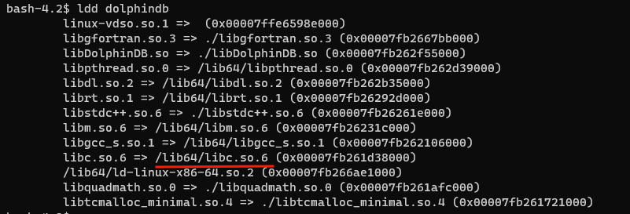
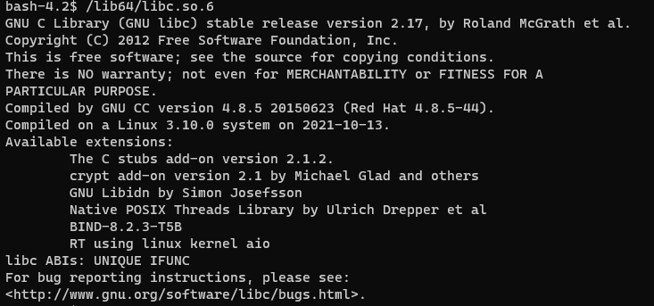
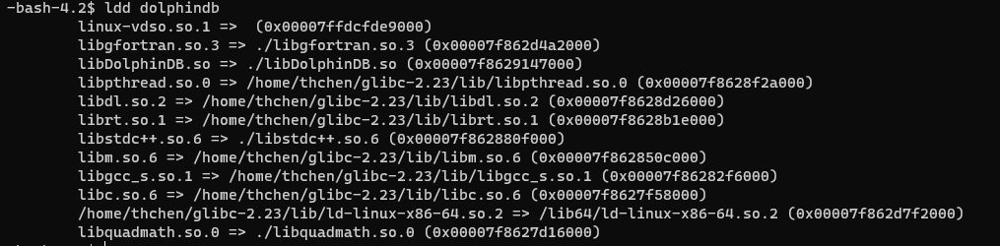

# DolphinDB 基于 Glibc 升级的性能优化实战案例

在高并发查询、查询需要涉及很多个分区的情况下，低版本的 glibc（低于 2.23）会严重影响查询性能。需要升级 glibc 解决该问题优化性能。我们撰写了本文，通过 patchelf 工具修改可执行文件和动态库的 rpath，达到无需升级系统便可以使用高版本 glibc 的目的。

- [1 概述](#1-概述)
- [2 环境配置与数据模拟](#2-环境配置与数据模拟)
  - [2.1 硬件配置](#21-硬件配置)
  - [2.2 集群配置](#22-集群配置)
  - [2.3 模拟数据](#23-模拟数据)
- [3 升级 glibc](#3-升级-glibc)
  - [3.1 查看本机 DolphinDB 使用的 glibc 版本](#31-查看本机-dolphindb-使用的-glibc-版本)
  - [3.2 下载或者编译高版本 glibc](#32-下载或者编译高版本-glibc)
  - [3.3 解压高版本 glibc 到自定义位置](#33-解压高版本-glibc-到自定义位置)
  - [3.4 下载 patchelf](#34-下载-patchelf)
  - [3.5 文件备份](#35-文件备份)
  - [3.6 修改文件的 rpath 和 interpreter](#36-修改文件的-rpath-和-interpreter)
  - [3.7 验证 glibc 库路径](#37-验证-glibc-库路径)
- [4 性能测试与对比](#4-性能测试与对比)
- [5 小结](#5-小结)
- [附件](#附件)

## 1 概述

在高并发查询、查询需要涉及很多个分区的情况下，需要频繁读取磁盘文件，而旧版 glibc（低于 2.23）的`fseek`函数性能低下，导致查询任务堆积，CPU 利用率却不高。需要升级 glibc 解决该问题。由于系统 glibc 通常和系统版本绑定，所以升级系统 glibc 需要升级系统。但是升级系统步骤繁琐，故我们撰写了本文通过 patchelf 工具修改可执行文件和动态库的 rpath，在动态链接时优先链接的高版本 glibc。从而无需升级系统便可以使用高版本 glibc。

## 2 环境配置与数据模拟

### 2.1 硬件配置

测试总共使用四台配置相同的服务器，分别命名为 P1、P2、P3、P4，具体硬件配置如表所示。

| 处理器                                   | 核数 | 内存   | 操作系统                 | 硬盘 | 网络       |
| :--------------------------------------- | :--- | :----- | :----------------------- | :--- | :--------- |
| Intel(R) Xeon(R) Gold 5320 CPU @ 2.20GHz | 128  | 754 GB | CentOS Linux release 7.9 | SSD  | 万兆局域网 |

### 2.2 集群配置

以下测试中使用的 DolphinDB Server 版本为 2.00.9.3。

基于四台服务器搭建双副本高可用集群，假设四台服务器名称分别为 P1、P2、P3、P4，P1 、P2、P3各部署一个控制节点、一个代理节点、一个数据节点，P4 部署一个代理节点、一个数据节点。

主要配置如下表：

| **配置项**          | **值** |
| :------------------ | :----- |
| maxMemSize          | 480GB  |
| workerNum           | 128个  |
| TSDBCacheEngineSize | 100GB  |

### 2.3 模拟数据

#### 2.3.1 生成模拟数据

模拟数据为物联网测点数据，有 4 个字段，分别是 id、time、v、q，一天 28.8 亿条数据。数据库按照日期（按天）、id（HASH 128）分区。每个分区约 2250 万条记录。具体脚本见附件。

#### 2.3.2 模拟数据查询

我们模拟单个、20、40、60、100 个并发查询，查询内容为 4 天 1000 个随机id的点查询，理论上将包含 128x4 个分区。具体脚本见附件。

## 3 升级 glibc

### 3.1 查看本机 DolphinDB 使用的 glibc 版本

执行以下命令

```
ldd dolphindb
```



找到 libc.so.6 的位置，在终端执行

```
/lib64/libc.so.6
```

得到版本为如图（2.17，低于 2.23）



### 3.2 下载或者编译高版本 glibc

#### 3.2.1 下载

- 可自行下载对应系统高版本的 glibc 库和 libgcc 库后手工提取。
- 或下载 DolphinDB 提供的压缩包（glibc 版本 2.23，Centos 7）。
- 注意：可能存在兼容性问题。

[glibc-2.23.tar.gz](script/performance_optimization_based_on_glibc/glibc-2.23.tar.gz)

#### 3.2.2 编译

可以通过自行编译的方式解决高版本 glibc 的兼容性问题。

```
#下载 glibc 源代码
git clone https://sourceware.org/git/glibc.git
cd glibc
git checkout glibc-2.23
mkdir build
cd build
#具体路径需要自己选择，不要不添加路径或者选择系统库的路径，避免系统 glibc 被覆盖
../configure --prefix=/home/thchen/glibc-2.23
# -j 后面的数字要低于或者等于自己 cpu 的核数
make -j12
make install
#编译运行需要把系统的 /lib64/libgcc_s.so.1 复制到 /home/thchen/glibc-2.23/lib 里
cp /lib64/libgcc_s.so.1 /home/thchen/glibc-2.23/lib
```

### 3.3 解压高版本 glibc 到自定义位置

<font color=#B22222>**注意事项**：</font>

1）不要解压到系统 lib64、根目录等路径覆盖系统 glibc。

2）不要添加自定义 glibc 文件夹到`LD_LIBRARY_PATH`环境变量。

```
#当前位置为 /home/thchen
tar -zxvf glibc-2.23.tar.gz
```

### 3.4 下载 patchelf

```
sudo yum install patchelf
```

### 3.5 文件备份

备份相关文件（`dolphindb `，`libDolphinDB.so`，`libgfortran.so.3`，`libopenblas.so.0`，`libquadmath.so.0`，`libstdc++.so.6`，`libtcmalloc_minimal.so.4`）

```
#备份文件，需要到 dolphindb 可执行文件下的目录
cp dolphindb dolphindb.bak
cp libDolphinDB.so libDolphinDB.so.bak
cp libgfortran.so.3 libgfortran.so.3.bak
cp libopenblas.so.0 libopenblas.so.0.bak
cp libquadmath.so.0 libquadmath.so.0.bak
cp libstdc++.so.6 libstdc++.so.6.bak
cp libtcmalloc_minimal.so.4 libtcmalloc_minimal.so.4.bak
```

### 3.6 修改文件的 rpath 和 interpreter

<font color=#B22222>**1）关闭 DolphinDB**</font>

2）根据高版本 glibc 的路径，修改以下文件的 rpath：`dolphindb `，`libDolphinDB.so`，`libgfortran.so.3`，`libopenblas.so.0`，`libquadmath.so.0`，`libstdc++.so.6`，`libtcmalloc_minimal.so.4`

```
#修改 rpath，具体路径要看高版本 glibc 的路径
patchelf --set-interpreter /home/thchen/glibc-2.23/lib/ld-linux-x86-64.so.2 \
--set-rpath ./:/home/thchen/glibc-2.23/lib64 dolphindb
patchelf  --set-rpath ./:/home/thchen/glibc-2.23/lib libDolphinDB.so 
patchelf  --set-rpath ./:/home/thchen/glibc-2.23/lib libgfortran.so.3
patchelf  --set-rpath ./:/home/thchen/glibc-2.23/lib libopenblas.so.0
patchelf  --set-rpath ./:/home/thchen/glibc-2.23/lib libquadmath.so.0
patchelf  --set-rpath ./:/home/thchen/glibc-2.23/lib libstdc++.so.6
patchelf  --set-rpath ./:/home/thchen/glibc-2.23/lib libtcmalloc_minimal.so.4
```

### 3.7 验证 glibc 库路径

使用 ldd dolphindb 命令验证当前 glibc 库的路径。当运行结果显示其路径为高版本 glibc 路径时，说明前述修改成功。



## 4 性能测试与对比

通过在升级前和升级后运行 2.3.2 节的模拟查询，我们得到了以下数据：

| **查询方法** | **查询用时(glibc 2.17)** | **查询用时(glibc 2.34)** | **加速比** |
| :----------- | :----------------------- | :----------------------- | :--------- |
| 单查询       | 3,241 ms                 | 2,007 ms                 | 1.61       |
| 20并发查询   | 33,346 ms                | 15,313 ms                | 2.18       |
| 40并发查询   | 85,144 ms                | 24,672 ms                | 3.45       |
| 60并发查询   | 134,065 ms               | 28,793 ms                | 4.66       |
| 100并发查询  | 224,902ms                | 46,938 ms                | 4.79       |

通过升级 glibc，DolphinDB 前后查询加速比为 1.61-4.79 倍。在并发情况下性能提升更加明显。

## 5 小结

针对高并发查询，当查询需要涉及多个分区时，如果查询任务积压但CPU利用率不高，可以先确定 glibc 的版本。如果 glibc 版本低于 2.23，则可以按照本方案进行升级，这可能会带来明显的性能提升。

## 附件

[testScript.zip](script/performance_optimization_based_on_glibc/testScript.zip)
[config.tar.gz](script/performance_optimization_based_on_glibc/config.tar.gz)
[glibc-2.23.tar.gz](script/performance_optimization_based_on_glibc/glibc-2.23.tar.gz)
