# 公募基金历史数据基础分析教程

近年来，国内的公募基金处于高速发展阶段，对于基金数据的分析需求也越来越多。本教程以公募基金公开市场数据和历史净值数据的基础分析作为案例，介绍一些关于基金数据的基础概念和 DolphinDB 时序数据库在时间序列数据分析上的一些基础范式和方法。

> 本教程中将会学习到：
>
> **如何在 DolphinDB GUI 中绘图**
>
> **如何把 long-form 数据表转变为 wide-form 数据表**
>
> **如何计算基金的日收益率、季度平均收益率、年度收益率、累计收益率等**
>
> **如何计算基金的夏普比率**
>
> **如何计算基金之间的相关系数**

本教程示例代码基于 **DolphinDB V2.00.8 服务端**开发，如果需要测试教程中的代码，请先安装 **DolphinDB V2.00.8 及以上服务端**：

* [单节点部署教程](https://gitee.com/dolphindb/Tutorials_CN/blob/master/standalone_server.md)
* [下载连接](https://www.dolphindb.cn/alone/alone.php?id=10)

本教程示例代码使用 **DolphinDB GUI 客户端**开发，如果需要测试教程中的代码，请先安装 **DolphinDB GUI 客户端**：

* [GUI 安装和使用教程](https://www.dolphindb.cn/cn/gui/index.html)
* [下载连接](https://www.dolphindb.cn/alone/alone.php?id=10)

本教程包含的内容：

[公募基金历史数据基础分析教程](#公募基金历史数据基础分析教程)

- [1. 公募基金公开市场数据基础分析](#1-公募基金公开市场数据基础分析)
- [2. 公募基金历史净值数据基础分析](#2-公募基金历史净值数据基础分析)
- [3. 性能对比](#3-性能对比)
- [4. 总结](#4-总结)
- [5. 附件](#5-附件)

## 1. 公募基金公开市场数据基础分析

[公募基金公开市场数据基础分析示例代码](./script/public_fund_basic_analysis/basic_analysis_of_public_fund_open_market_data.txt)

### 1.1 公开市场数据表结构

| 字段       | 字段类型 | 含义         |
| ---------- | -------- | ------------ |
| SecurityID | SYMBOL   | 基金代码     |
| FullName   | STRING   | 基金全称     |
| Name       | STRING   | 基金简称     |
| Management | SYMBOL   | 基金公司     |
| Type       | SYMBOL   | 基金类型     |
| Custodian  | SYMBOL   | 托管人       |
| IssueShare | DOUBLE   | 成立规模     |
| InceptDate | DATE     | 成立日期     |
| MFee       | DOUBLE   | 管理费率     |
| CFee       | DOUBLE   | 托管费率     |
| SFee       | DOUBLE   | 销售服务费率 |
| Closed     | DOUBLE   | 封闭期       |
| Status     | INT      | 状态         |

> 字符串字段使用 SYMBOL 类型和 STRING 类型存储的差异，参考：[数据类型 — DolphinDB 2.0 文档](https://www.dolphindb.cn/cn/help/200/DataTypesandStructures/DataTypes/index.html)的字符串部分内容。

### 1.2 公开市场数据导入

截止 2022 年 7 月，已经面市的公募基金总数约 1 万多只，公开市场数据表的行数与面市公募基金总数相等，所以这个表的数据量相对比较小，建议使用 DolphinDB 的[维度表](https://www.dolphindb.cn/cn/help/200/FunctionsandCommands/FunctionReferences/c/createTable.html)进行存储。以 csv 数据文件导入 DolphinDB 维度表为例，具体代码如下：

> 10 万行以下的单表数据建议用 DolphinDB 的维度表存储。

```
csvDataPath = "/ssd/ssd2/data/fundData/publicFundData.csv"
dbName = "dfs://publicFundDB"
tbName = "publicFundData"
// create database and one-partition table
if(existsDatabase(dbName)){
	dropDatabase(dbName)
}
timeRange = 1990.01.01 join sort(distinct(yearBegin(2016.01.01..2050.01.01)))
db = database(dbName, RANGE, timeRange, engine = 'TSDB')
names = `SecurityID`FullName`Name`Management`Type`Custodian`IssueShare`InceptDate`MFee`CFee`SFee`Closed`Status
types = `SYMBOL`STRING`STRING`SYMBOL`SYMBOL`SYMBOL`DOUBLE`DATE`DOUBLE`DOUBLE`DOUBLE`DOUBLE`INT
schemaTB = table(1:0, names, types)
db.createTable(table=schemaTB, tableName=tbName, sortColumns=`InceptDate)
// load CSV data
tmp = ploadText(filename=csvDataPath, schema=table(names, types))
loadTable(dbName, tbName).append!(tmp)
```

### 1.3 公开市场数据基础分析

#### 1.3.1 数据概览

数据导入后，可以执行相关 SQL 语句对维度表数据进行预览，执行下述代码加载包含元数据的表对象，此步骤并未加载维度表数据到内存，所以执行耗时非常短，变量 fundData 几乎不占用内存资源：

```
fundData = loadTable("dfs://publicFundDB", "publicFundData")
```

查询维度表中的前 10 条记录，并将查询数据一次性从服务端取到客户端后在 Data Browser 显示：

> 如果单次 SQL 查询返回的结果较大，必须将查询的结果返回给一个变量，然后双击 GUI 的 Variables 进行分页查看，因为分页查看的话数据是分段传输的，而不是一次性从服务端传输回客户端，避免 GUI 客户端被阻塞的情况。 

```
select top 10 * from fundData
```

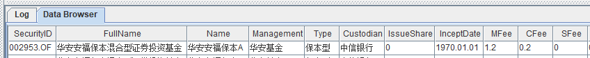

因为公开市场数据表中的总数据量比较小，所以可以对其进行全表查询，并将返回的查询结果赋值给一个内存表变量 publicFundData，然后双击 GUI 的 Variables 处的 publicFundData 进行数据分页浏览：

```
publicFundData = select * from fundData
```

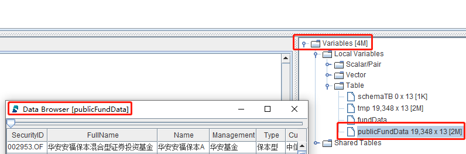

#### 1.3.2 查询综合费率最低的基金

在选购基金的时候，综合费率也会是投资者考量的因素之一。针对上述公开市场数据，综合费率为管理费率、托管费率和销售服务费率的总和：


查询公开数据表的数据，并计算综合费率 Fee，最终将查询结果赋值给内存表变量 fundFee ， 具体代码如下：

```
fundFee = select *, (MFee + CFee + SFee) as Fee from fundData
```

查询综合费率最低的 50 只债券型公募基金， 具体代码如下：

```
select top 50 * from fundFee where Type == "债券型" order by Fee
```

查询综合费率最低的 50 只债券型且不是指数型的公募基金， 具体代码如下：

```
select top 50 * from  fundFee where Type == "债券型", not(FullName like "%指数%") order by Fee
```

#### 1.3.3 按基金类型分组后的信息摘要

DolphinDB 的 [stat 函数](https://www.dolphindb.cn/cn/help/200/FunctionsandCommands/FunctionReferences/s/stat.html)可以快速生成数据的统计信息，包括平均值、最大值、最小值、计数、中位数和标准差等，[quantile 函数](https://www.dolphindb.cn/cn/help/200/FunctionsandCommands/FunctionReferences/q/quantile.html)可以快速计算分位数，可以通过 [def](https://www.dolphindb.cn/cn/help/200/Objects/FunctionCall.html) 自定义一个信息摘要统计函数，然后对 Type 列进行分组计算，具体代码如下：

```
// user defined summary statistics function
def describe(x){
	y = stat(x)
	q_25 = quantile(x, 0.25)
	q_50 = quantile(x, 0.50)
	q_75 = quantile(x, 0.75)
	return y.Count join y.Avg join y.Stdev join y.Min join q_25 join q_50 join q_75 join y.Max join y.Median
	
}

// query the summary of public fund fees
select describe(Fee) as `count`mean`std`min`q_25`q_50`q_75`max`median from fundFee group by Type
```

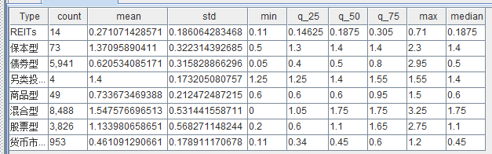

#### 1.3.4 按基金类型分组后的分布直方图

```
/**plot fees histogram*/
// Type="REITs"
(exec Fee from fundFee where Type="REITs").plotHist(binNum=100)
// Type="保本型"
(exec Fee from fundFee where Type="保本型").plotHist(binNum=100)
// Type="债券型"
(exec Fee from fundFee where Type="债券型").plotHist(binNum=100)
// Type="另类投资型"
(exec Fee from fundFee where Type="另类投资型").plotHist(binNum=100)
// Type="商品型"
(exec Fee from fundFee where Type="商品型").plotHist(binNum=100)
// Type="混合型"
(exec Fee from fundFee where Type="混合型").plotHist(binNum=100)
// Type="股票型"
(exec Fee from fundFee where Type="股票型").plotHist(binNum=100)
// Type="货币市场型"
(exec Fee from fundFee where Type="货币市场型").plotHist(binNum=100)
```

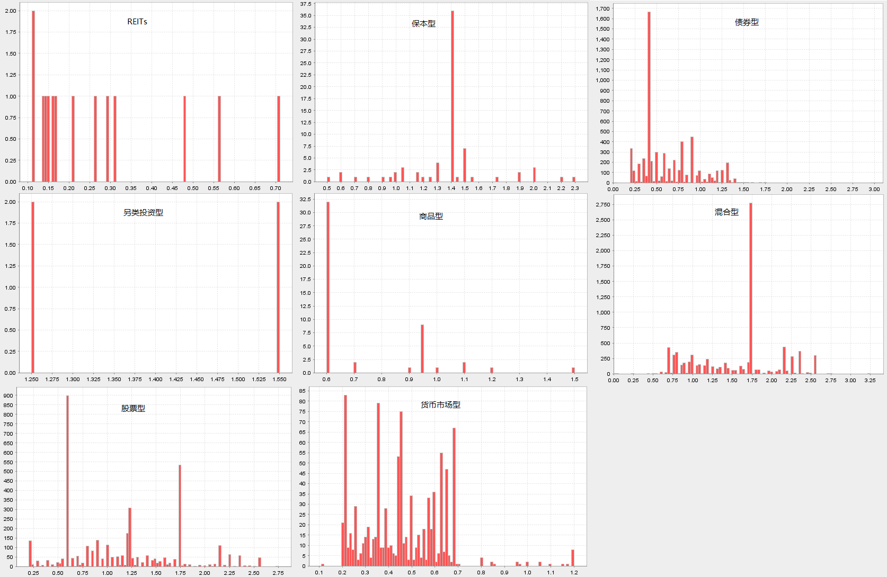

## 2. 公募基金历史净值数据基础分析

[公募基金历史净值数据基础分析示例代码](./script/public_fund_basic_analysis/basic_analysis_of_public_fund_net_value.txt)

### 2.1 工作日数据表结构

| 字段   | 字段类型 | 含义   |
| ------ | -------- | ------ |
| Day    | DATE     | 工作日 |
| Market | SYMBOL   | 交易所 |

### 2.2 工作日数据导入

工作日数据表的数据量相对比较小，建议使用 DolphinDB 的[维度表](https://www.dolphindb.cn/cn/help/200/FunctionsandCommands/FunctionReferences/c/createTable.html)进行存储。以 csv 数据文件导入 DolphinDB 维度表为例，具体代码如下：

```
csvDataPath = "/ssd/ssd2/data/fundData/workday.csv"
dbName = "dfs://publicFundDB"
tbName = "workday"
// create one-partition table in datase("dfs://publicFundDB")
if(existsTable(dbName, tbName)){
	dropTable(database(dbName), tbName)
}
names = `Day`Market
types = `DATE`SYMBOL
schemaTB = table(1:0, names, types)
db = database(dbName)
db.createTable(table=schemaTB, tableName=tbName, sortColumns=`Day)
// load CSV data
tmp = ploadText(filename=csvDataPath, schema=table(names, types))
loadTable(dbName, tbName).append!(tmp)
```

### 2.3 历史净值数据表结构

| 字段        | 字段类型 | 含义           |
| ----------- | -------- | -------------- |
| SecurityID  | SYMBOL   | 基金代码       |
| TradeDate   | DATE     | 日期           |
| NetValue    | DOUBLE   | 基金的单位净值 |
| AccNetValue | DOUBLE   | 基金的累计净值 |
| AdjNetValue | DOUBLE   | 基金的复权净值 |

**净值数据介绍：**

在选购基金的时候，基金的净值数据也会是投资者考量的因素之一，最常用的净值数据包括单位净值、累计净值和复权净值。

- **单位净值**：是指基金每个份额的实际价值，主要是作为申赎的成交价格。计算公式：基金净资产/基金总份额。
- **累计净值**：考虑现金分红后，基金每个份额的实际价值。计算公式：基金单位净值+历史单位分红金额。
- **复权净值**：考虑分红再投资后，调整计算的基金每个份额实际价值。

相比而言，基金复权净值更能够真实地反映基金的业绩表现，因为单位净值没有考虑分红的情况，低估了基金的业绩；累计净值，假设分红全部保留在账户中不产生收益，当分红金额较大或者基金涨幅较大时，也会低估基金的复利收益能力。所以，本教程中使用**复权净值**进行与基金回报率相关的数据分析。

### 2.4 历史净值数据导入

截止 2022 年 7 月，历史净值数据表的数据量大约是 1 千多万条，建议使用 DolphinDB 的[分区表](https://www.dolphindb.cn/cn/help/200/FunctionsandCommands/FunctionReferences/c/createPartitionedTable.html)进行存储，分区方法是在时间维度按照年为最小单位进行分区。以 csv 数据文件导入 DolphinDB 分区表为例，具体代码如下：

```
csvDataPath = "/ssd/ssd2/data/fundData/publicFundNetValue.csv"
dbName = "dfs://publicFundDB"
tbName = "publicFundNetValue"
// create distributed table in datase("dfs://publicFundDB")
if(existsTable(dbName, tbName)){
	dropTable(database(dbName), tbName)
}
names = `SecurityID`TradeDate`NetValue`AccNetValue`AdjNetValue
types = `SYMBOL`DATE`DOUBLE`DOUBLE`DOUBLE
schemaTB = table(1:0, names, types)
db = database(dbName)
db.createPartitionedTable(table=schemaTB, tableName=tbName, partitionColumns=`TradeDate, sortColumns=`SecurityID`TradeDate)
// load CSV data
tmp = ploadText(filename=csvDataPath, schema=table(names, types))
loadTable(dbName, tbName).append!(tmp)
```

**此处需要注意的几个点：**

* DolphinDB 的分区方法是作用在 database 层面，而不是 table 层面，上述代码中名为 "dfs://publicFundDB" 的 database 在教程第一章公开市场数据导入部分已经创建，分区方法是在时间维度按照年为最小单位进行分区，所以此处不需要再重新创建一个新的 database。
* 维度表和分区表的区别
  * 一般单表数据总量小于 10 万行才会考虑选择用维度表存储，所以公开市场数据表和工作日数据表选择用维度表存储。
  * 维度表可以存储在以任意方法分区的 database 下，但是 database 的分区方法对维度表不生效，无论以何种方法进行分区的 database 下的维度表在存储时都只有 1 个 chunk，数据读取的时候，即使 SQL 语句中有 where 过滤条件，也需要把整个 chunk 的数据从磁盘上读入内存进行过滤。
  * 因为 DolphinDB 的分区方法是作用在 database 层面，分区方法主要是根据分区表的数据总量制定的，一般建议每个最小分区内存储的数据加载到内存大约在 100MB~500MB，所以数据总量在一个量级的不同分区表，才会考虑存储在同一个 database 中。
  * 以历史净值数据为例，它的分区字段是 TradeDate，即在时间维度按年分区，所以不同年份的数据会存储在不同的 chunk 中，SQL 语句的 where 条件中，只要指定分区字段 TradeDate 过滤范围，就会起到分区剪枝的作用，只读取磁盘上对应年份的 chunk 到内存进行过滤。
* 用户可以选择将相同业务属性的 table 存入同一个 database 中，数据总量小于 10 万行的可以使用维度表进行存储，没有限制；同一个 database 下可以存储多张不同的分区表，但是这些分区表采用相同的分区方法和分区维度，所以分区表的数据总量必须是同一个量级的，且可以采用相同的分区维度进行数据分区。

### 2.5 历史净值数据基础分析

在历史净值数据基础分析中，会涉及 DolphinDB 中的两种表格数据组织方式，分别是 **wide-form** 和 **long-form**，在此做一些相关介绍：

* **long-form 表格**：每一列都对应着样本的某个**类别变量**，且描述同一个体的样本在表中可能存在多个，即同一个体可能会占用多行。

以基金历史净值数据为例：

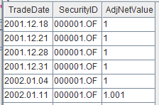


- **wide-form 表格**：数据在列上为一个观测对象在时间序列上的一个观测指标的所有数据，在行上为一个时间点所有观测对象的一个观察指标的数据。


以基金历史净值数据为例：

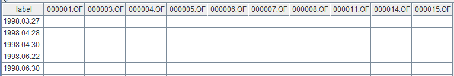

在进行数据时间序列分析时，一般的范式是使用 **wide-form** 表格数据。但原始数据常常为 **long-form** 表格数据，DolphinDB 提供了 [pivot 函数](https://www.dolphindb.cn/cn/help/200/Functionalprogramming/TemplateFunctions/pivot.html) 和 [panel 函数](https://www.dolphindb.cn/cn/help/200/FunctionsandCommands/FunctionReferences/p/panel.html)，把数据从 **long-form** 转变为 **wide-form**。

#### 2.5.1 计算复权净值日收益率

数据导入后，执行下述代码加载包含元数据的表对象，此步骤并未加载分区表数据到内存，所以执行耗时非常短，变量 fundNetValue 几乎不占用内存资源：

```
fundNetValue = loadTable("dfs://publicFundDB", "publicFundNetValue")
```

进行工作日的过滤，具体代码如下：

```
dateRange = exec distinct(TradeDate) from fundNetValue
firstDate = min(dateRange) 
lastDate =  max(dateRange)
workdays = exec day from loadTable("dfs://publicFundDB", "workday") where market="SSE", day between firstDate : lastDate, day in dateRange
```

查询基金的复权净值并通过 panel 函数生成面板数据，具体代码如下：

```
oriData = select TradeDate, SecurityID, AdjNetValue from fundNetValue
panelData = panel(row=oriData.TradeDate, col=oriData.SecurityID, metrics=oriData.AdjNetValue, rowLabel=workdays, parallel=true)
```

使用 DolphinDB 的 [percentChange 函数](https://www.dolphindb.cn/cn/help/200/FunctionsandCommands/FunctionReferences/p/percentChange.html)计算复权净值日收益率，NULL 值的填充最大窗口是 10，具体代码如下：

```
returnsMatrix = panelData.ffill(10).percentChange()
```

returnsMatrix 是一个 1 万多列的矩阵变量，可以执行下述代码快速查看部分计算结果：

```
returnsMatrix[0:3]
```

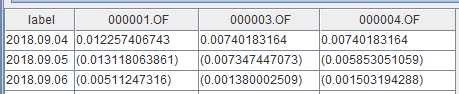

#### 2.5.2 计算基金数量变化

计算公募基金在历史上的数量，并绘图：

```
fundNum = matrix(rowCount(returnsMatrix)).rename!(returnsMatrix.rowNames(), ["count"])
plot(fundNum.loc( ,`count), fundNum.rowNames(), '公募基金在历史上的数量变化', LINE)
```

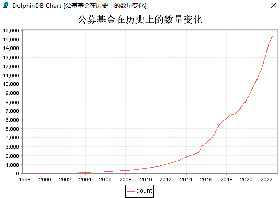

#### 2.5.3 计算复权净值季度平均收益率

执行下述代码，计算公募基金的**季度平均收益率**：

```
qavgReturns = returnsMatrix.setIndexedMatrix!().resample("Q", mean)	
```

执行下述代码，绘制某只基金的**季度平均收益率曲线**：

```
plot(qavgReturns["160211.SZ"], chartType=LINE)
```

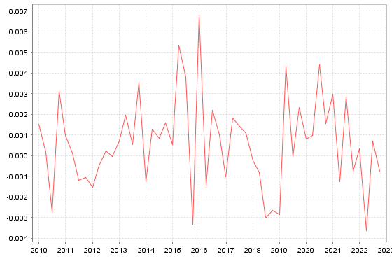

#### 2.5.4 计算各个类型基金的年度平均收益率

执行下述代码，构建基金名称和基金类型一一对应的字典：

```
fundData = loadTable("dfs://publicFundDB", "publicFundData")
fundType = select SecurityID, Type from fundData where SecurityID in returnsMatrix.colNames() order by Type
fundTypeMap = dict(fundType["SecurityID"], fundType["Type"])
```

为了更好地展示数据，改变日收益率矩阵列的排序和列的名称，具体代码如下：

```
tReturnsMatrix = returnsMatrix[fundType["SecurityID"]]
newNames = fundType["Type"] + "_" + fundType["SecurityID"].strReplace(".", "_").strReplace("!", "1")
tReturnsMatrix.rename!(newNames)
tReturnsMatrix[0:3]
```

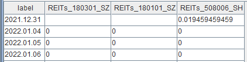

执行下述代码，计算各个类型基金的**年度平均收益率**：

```
yearReturnsMatrix = ((returnsMatrix+1).resample("A", prod)-1).nullFill(0).regroup(fundTypeMap[returnsMatrix.colNames()], mean, byRow=false)
```

执行下述代码，绘制部分类型基金的**年度平均收益柱状图**：

```
yearReturnsMatrix = yearReturnsMatrix.loc( , ["债券型", "股票型", "混合型"])
yearReturnsMatrix.loc(year(yearReturnsMatrix.rowNames())>=2014, ).plot(chartType=BAR)
```

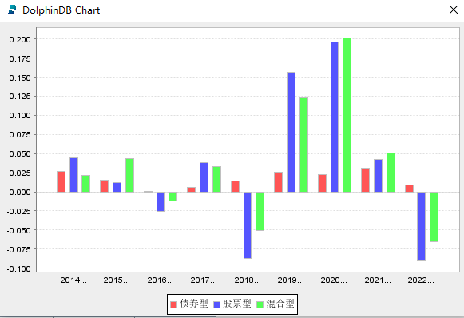

#### 2.5.5 计算夏普比率

**夏普比率**用于衡量风险调整后的基金收益率，是一个同时考虑风险和收益的指标。其核心思想是理性的投资者将选择并持有有效的投资组合：在给定风险下期望回报最大的投资组合或者在给定期望回报下风险最小的投资组合。夏普比率衡量的就是单位风险下基金收益率超过无风险收益率的程度。当投资组合内的资产皆为风险性资产时，适用夏普比率。

**夏普比率计算公式**：

夏普比率 = （投资组合的年化收益率 - 年化无风险资产的收益率）/ 投资组合收益年化波动率

-R_f}{\sigma_p})

**筛选分析空间**

设置筛选条件，选择某个范围内的基金复权净值日收益率数据，本教程中的筛选条件：

* 选择发布历史净值数据超过 1000 个交易日的基金
* 选择最近 30 个交易日存在净值数据的基金

* 去除“货币市场型“和”REITS“类型的基金

```
uReturnsMatrix = returnsMatrix.loc(,(each(count, returnsMatrix) > 1000 && returnsMatrix.ilastNot() >=  returnsMatrix.rows() - 30)&&!(fundTypeMap[returnsMatrix.colNames()] in ["货币市场型", "REITs"]))
```

**指标年化方法**

基金年交易日一般为 242 天，则指标年化的公式为：

- 年化收益率 = 平均日收益率 × 242

- 年化波动率 = 收益率标准差 × 242^0.5

```
exp = mean(uReturnsMatrix)*242
vol = std(uReturnsMatrix)*sqrt(242)
```

**计算夏普比率**

年化无风险资产的收益率一般可以选择用长期国债到期收率来估计，本教程使用的年化无风险资产的收益率为 0.28，计算夏普比率的代码如下所示：

```
sharpe = (exp - 0.028)/vol
```

**结果可视化**

执行下述代码，生成年化收益率、年化波动率和夏普比率数据表：

```
perf = table(uReturnsMatrix.colNames() as SecurityID, fundTypeMap[uReturnsMatrix.colNames()] as Type, exp*100 as exp, vol*100 as vol, sharpe)
```

基于 perf 数据表进行数据可视化：

- 年化收益率直方图

  ```
  (exec exp from perf where exp > -10, exp < 40).plotHist(400)
  ```
  

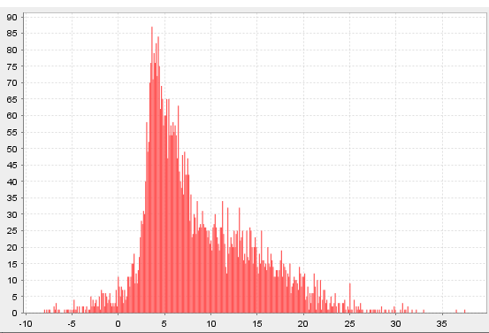

- 年化波动率直方图

  ```
  (exec vol from perf where vol < 40).plotHist(400)
  ```
  

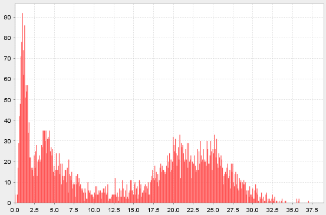

- 夏普比率直方图

  ```
  (exec sharpe from perf where sharpe > 0).plotHist(200)
  ```
  

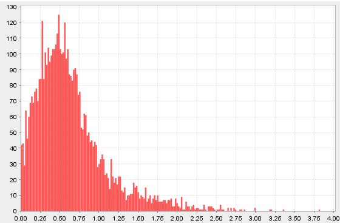

- 风险收益散点图

  ```
  mask = select * from perf where sharpe>0, vol<40, exp<40 
  plot(mask["exp"], mask["vol"], ,SCATTER)
  ```
  

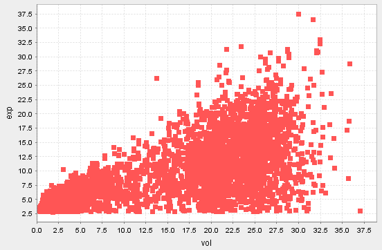

#### 2.5.6 计算年度收益率

**年化收益率**：是把当前收益率换算成一年能够获得的收益率，属于理论收益率，不等同于实际收益率。

**年度收益率**：是指一年期限内，投资收益占投资本金的比率，年度收益率通常等同于实际收益率。

**筛选分析空间**

本教程设置的筛选条件：

* 年化收益率小于 0.4、年化波动率小于 0.4、夏普比率大于 0 的基金
* 各个类型基金中夏普比率最大的 50 只基金
* 选取 2015 年 1 月 1 日以后的基金数据

```
filterTB = select * from perf where exp<40, vol<40, sharpe>0 context by Type csort sharpe desc limit 50
returnsMatrix50 = returnsMatrix.loc(2015.01.01:, returnsMatrix.colNames() in filterTB["SecurityID"])
```

**计算年度收益率**

```
yearReturnsMatrix50 = transpose((returnsMatrix50 .setIndexedMatrix!()+1).resample("A", prod)-1).nullFill(0)
```

**查看指定类型基金的年度收益率**

```
yearReturnsMatrix50.loc(fundTypeMap[yearReturnsMatrix50.rowNames()] == "股票型", )
```

####  2.5.7 计算相关系数

---

基金之间的相关系数，刻画的是基金之间的联动性。一般来说，相关系数越大，基金间的联动性越高，说明很有可能会产生重复性投资。所以投资者在选择基金时，可以关注那些相关系数较小的基金组合，特别是在熊市中，这样有利于分散投资，抵御市场行情差带来的风险。

**筛选分析空间**

选择与 2.5.6 中同样的分析空间，即使用 2.5.6 例子中构造的 returnsMatrix50 进行计算分析。

**计算相关系数**

```
corrMatrix = pcross(corr, returnsMatrix50)
```

**查看指定类型之间的相关系数**

```
corrMatrix.loc(fundTypeMap[corrMatrix.rowNames()]=="股票型", fundTypeMap[corrMatrix.rowNames()]=="股票型")
```

#### 2.5.8 计算持有区间的累计收益率

**持有区间的累计收益率** = (区间末净值 - 区间初净值) / 区间初净值

本教程中将计算基金从 2010 年初到 2020 年末任意工作日买入基金并持有一年后的累计收益率。

执行下述代码，获取 2010 年 1 月 1 日到 2020 年 12 月 31 日买入时的复权净值数据：

```
filterPanelData = panelData.loc(2010.01.01..2020.12.31, view=true)
```

执行下述代码，获取 2020 年 12 月 31 日前买入并持有一年后的复权净值数据：

```
// 获取持有一年后的复权净值数据
dayIndex = panelData.rowNames().temporalAdd(-1,'y')
workdays = select * from loadTable("dfs://publicFundDB", "workday")
workeDayIndex = each(def(dayIndex){return exec last(Day) from workdays where Day <= dayIndex}, dayIndex)
filterPanelDataTmp = panelData.loc(workeDayIndex>=panelData.rowNames()[0]&&workeDayIndex<=2020.12.31, ).rename!(workeDayIndex[workeDayIndex>=panelData.rowNames()[0]&&workeDayIndex<=2020.12.31], panelData.colNames())
```

执行下述代码，计算持有区间的累计收益率：

```
filterPanelDataTmp, filterPanelData = align(filterPanelDataTmp, filterPanelData)
cumulativeReturn = (filterPanelDataTmp - filterPanelData) / filterPanelData
```

执行下述代码，计算收益率有超过 1000 个数据的基金持有一年的平均收益率：

```
filterCumulativeReturn = cumulativeReturn[x->count(x) > 1000]
select SecurityID, mean from table(filterCumulativeReturn.colNames() as SecurityID, mean(filterCumulativeReturn) as mean) order by mean desc
```

执行下述代码，计算每只基金买入持有一年后的累计收益率大于 0.2 的可能性：

```
result = each(count, cumulativeReturn[cumulativeReturn>0.2]) \ cumulativeReturn.rows()
(select SecurityID, prop from table(cumulativeReturn.colNames() as SecurityID, result as prop) order by prop desc).head(30)
```

## 3. 性能对比

本节主要展示部分 DolphinDB 与 Python Pandas 的性能对比测试结果。

**性能测试条件说明**

* 测试数据集：公募基金公开市场数据和公募基金历史净值数据。
* 为了测试相关函数的计算性能，DolphinDB 和 Python 测试代码都是单线程运行。
* 为了测试的公平性，DolphinDB 和 Python 都预先把相关数据加载到各自的内存中。

测试结果如下表所示：

| 操作 | 具体说明                       | Python（ms） | DolphinDB （ms） | 耗时比（py/ddb） |
| ---- | ------------------------------ | ------------ | ---------------- | ---------------- |
| 查询 | 找出综合费用最低的债券基金     | 11.8         | 1.6              | 7.3              |
| 计算 | 计算日收益率                   | 2,289.5      | 635.5            | 3.6              |
| 计算 | 计算季度平均收益率             | 1,268.5      | 264.2            | 4.8              |
| 计算 | 计算年度平均收益率             | 1,816.7      | 547.6            | 3.3              |
| 计算 | 计算基金持有一年后的累计收益率 | 2,170.2      | 614.1            | 3.5              |

从测试结果分析可知，DolphinDB 中的函数计算性能普遍优于 Python Pandas 中的函数，并且 DolphinDB 依靠数据存储引擎和计算引擎的高度融合，方便地实现了分布式并行计算，可以有效提高计算效率和节省内存资源。

**Python Pandas 部分测试核心代码**

计算季度平均收益率：

```python
returnsMatrix.resample('Q').mean()
```

**DolphinDB 部分测试核心代码**

计算季度平均收益率：

```
returnsMatrix.setIndexedMatrix!().resample("Q", mean)
```

为了方便大家快速将 Python 的代码转写为 DolphinDB 的代码，小编为大家准备了 DolphinDB 函数到 Python 函数的映射表：

* [DolphinDB 函数到 Python 函数的映射](https://gitee.com/dolphindb/Tutorials_CN/blob/master/function_mapping_py.md)

## 4. 总结

本教程主要通过公募基金的公开市场数据和历史净值数据在 DolphinDB 中的基础分析案例，介绍了 DolphinDB 时序数据库在时间序列数据分析上的一些基础范式和方法，旨在降低 DolphinDB 初学者们的学习成本，让 DolphinDB 使用者能够快速上手对基金数据进行基础分析。

## 5. 附件

[公募基金公开市场数据基础分析示例代码](./script/public_fund_basic_analysis/basic_analysis_of_public_fund_open_market_data.txt)

[公募基金历史净值数据基础分析示例代码](./script/public_fund_basic_analysis/basic_analysis_of_public_fund_net_value.txt)