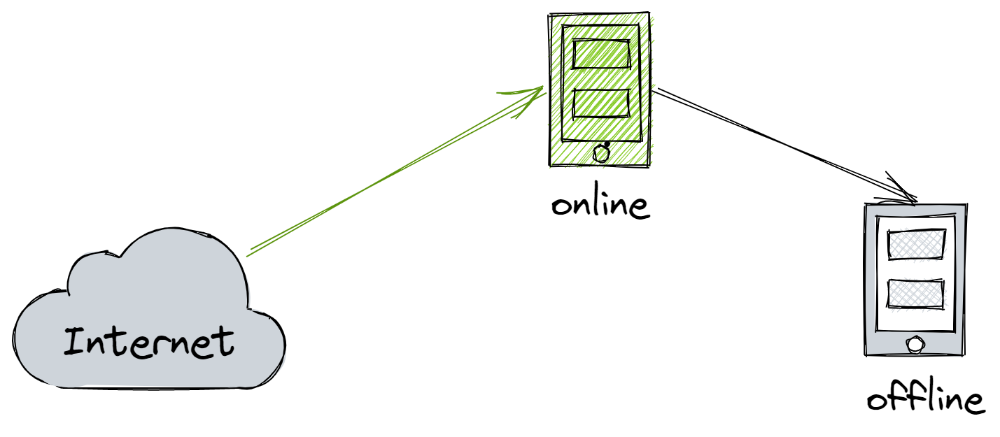
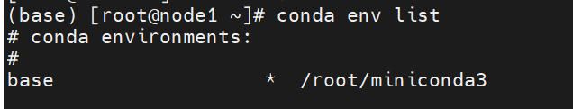
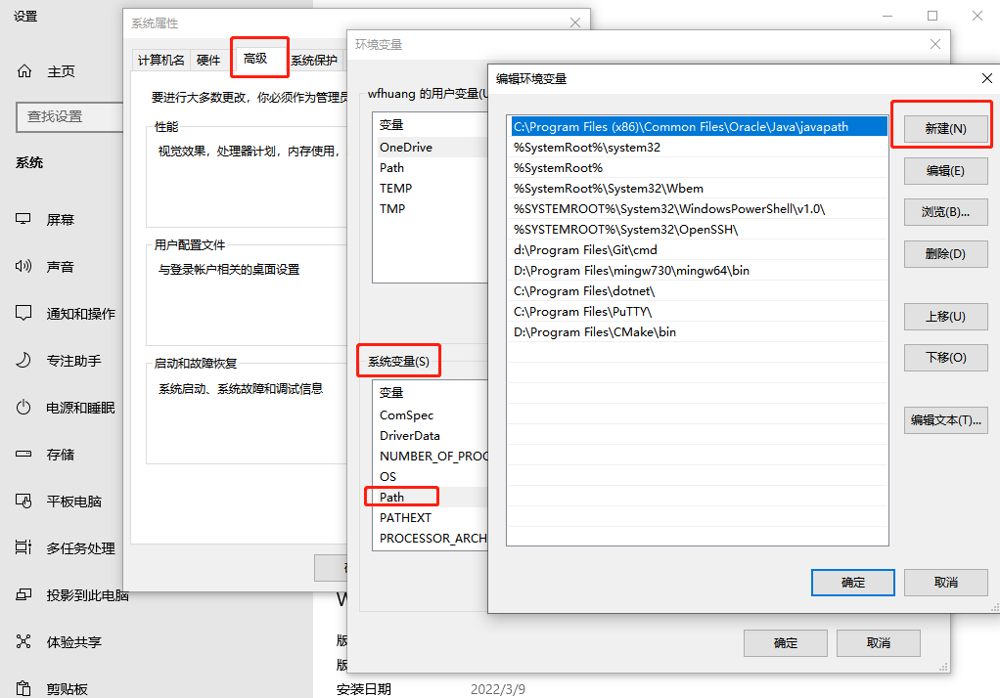
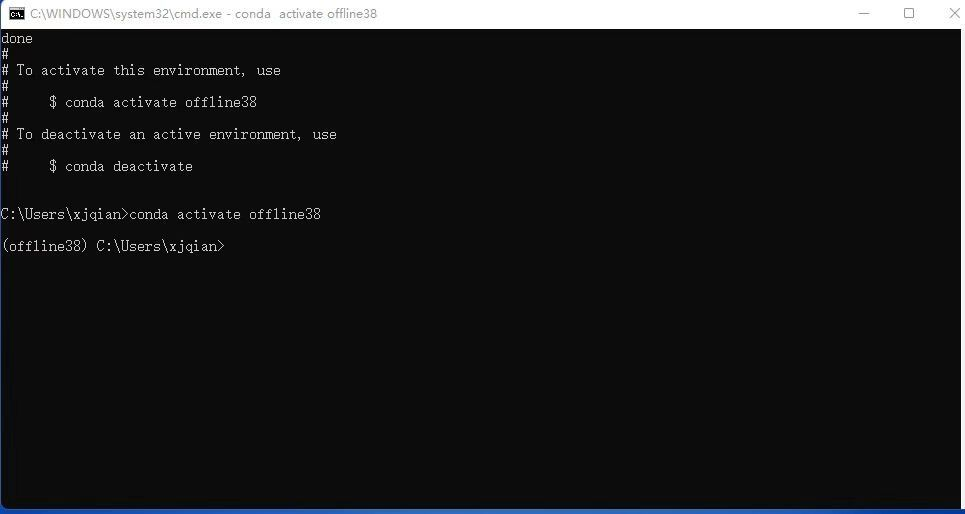
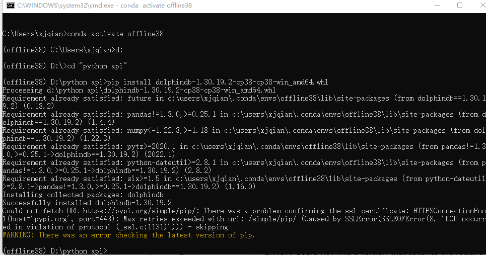
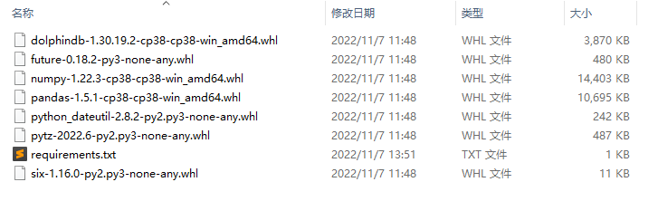

# DolphinDB Python API 离线安装

出于安全考虑，通常生产环境与互联网隔离，因此无法使用 `pip install `在线安装 DolphinDB Python API（以下简称 Python API）。本文介绍如何离线安装 Python API 环境，包括 conda 环境和 wheel 安装两种方式。用户可根据生产环境的使用需求、应用场景自行选择。

- [DolphinDB Python API 离线安装](#dolphindb-python-api-离线安装)
  - [1 环境准备](#1-环境准备)
    - [1.1 Linux 环境准备](#11-linux-环境准备)
    - [1.2 Windows 环境准备](#12-windows-环境准备)
  - [2 Linux conda 安装](#2-linux-conda-安装)
    - [2.1 安装 miniconda](#21-安装-miniconda)
    - [2.2 配置 miniconda](#22-配置-miniconda)
    - [2.3 在线环境下载包](#23-在线环境下载包)
    - [2.4 离线安装 conda 环境](#24-离线安装-conda-环境)
    - [2.5 安装 DolphinDB Python API](#25-安装-dolphindb-python-api)
  - [3 Linux wheel 安装](#3-linux-wheel-安装)
    - [3.1 在线环境收集 wheel 包](#31-在线环境收集-wheel-包)
    - [3.2 离线环境安装 wheel 包](#32-离线环境安装-wheel-包)
    - [3.3 安装后验证](#33-安装后验证)
  - [4 Windows conda 安装](#4-windows-conda-安装)
    - [4.1 安装 miniconda](#41-安装-miniconda)
    - [4.2 配置 miniconda](#42-配置-miniconda)
    - [4.3 在线环境下载包](#43-在线环境下载包)
    - [4.4 离线安装 conda 环境](#44-离线安装-conda-环境)
    - [4.5 安装 Python API](#45-安装-python-api)
  - [5 Windows wheel 安装](#5-windows-wheel-安装)
    - [5.1 在线环境收集 wheel 包](#51-在线环境收集-wheel-包)
    - [5.2 离线环境安装 wheel 包](#52-离线环境安装-wheel-包)
    - [5.3 安装后验证](#53-安装后验证)
  - [6 总结](#6-总结)
  - [7 附录](#7-附录)
    - [7.1 pip 常用命令](#71-pip-常用命令)
    - [7.2 conda 常用命令](#72-conda-常用命令)
    - [7.3 常见问题处理](#73-常见问题处理)

## 1 环境准备

首先准备构建环境，包括在线环境与离线环境，其中在线环境用于在线收集和构建资源，离线环境用于离线安装与验证。

构建环境需要与目标环境尽可能的一致，包括操作系统版本、CPU 架构、Python 版本等。其中在线环境用于下载并构建各种资源，离线环境用于构建与测试 Python API 的安装包。



### 1.1 Linux 环境准备

推荐使用类似 virtual box 的虚拟化工具来制作环境。假设我们需要在 KyLin v10，x86-64, Python 3.8 的目标环境中安装 Python API，那么需要准备以下环境：

* **在线环境**

操作系统：KyLin v10

CPU：Intel(R) Core(TM) i7-10700 CPU @ 2.90GHz

主机平台：VirtualBox 6.1

网络：NetWork Bridge

* **离线环境**

操作系统：KyLin v10

CPU：Intel(R) Core(TM) i7-10700 CPU @ 2.90GHz

主机平台：VirtualBox 6.1

网络：HostOnly

其中 **HostOnly**（仅主机模式）的网络模式可以保证该机器与互联网无法连接。

### 1.2 Windows 环境准备

Windows 环境可以准备两台机器（可以是 PC），一台用于在线获取资源，并禁用另一台机器的网络进行离线安装测试。有关 Windows 下安装和配置 Conda 环境，详见[ Windows 安装](#4-windows-conda-安装)。

## 2 Linux conda 安装

### 2.1 安装 miniconda

推荐使用 miniconda，通常生产环境比较复杂，需要虚拟环境以保证隔离性。

[Miniconda — conda documentation](https://docs.conda.io/en/latest/miniconda.html)

```
wget https://repo.anaconda.com/miniconda/Miniconda3-latest-Linux-x86_64.sh
sh Miniconda3-latest-Linux-x86_64.sh
```

安装并激活 base 虚拟环境。

```
source ~/.bashrc
```

使用 `conda env list` 验证安装已完成：



### 2.2 配置 miniconda

分别配置在线、离线环境的 conda：

1. conda 环境配置

```conda config    // 在 ~/目录下会出现文件 .condarc
conda config    // 在 ~/目录下会出现文件 .condarc
```

2. 编辑 `~/.condarc` 文件

```
show_channel_urls: true
envs_dirs:
  - ~/envs
pkgs_dirs:
  - ~/pkgs
```

### 2.3 在线环境下载包

1. 运行以下命令下载 package

```
conda create -n test38 numpy=1.22.3 pandas python=3.8.13 --download-only
```

要求 numpy 为1.18到1.22.3之间的版本, 推荐使用1.22.3版本。

2. 压缩并上传 package

压缩 `.condarc pkgs_dirs` 路径下的依赖包，并上传至离线环境的 pkgs 目录。

```
tar -zcvf pkgs.tar.gz pkgs/
 md5sum pkgs.tar.gz > pkgs.tar.gz.md5
```

### 2.4 离线安装 conda 环境

1. 上传至离线环境后，需检查下完整性：

```
(base) root@peter-VirtualBox:~# md5sum -c pkgs.tar.gz.md5
pkgs.tar.gz: 成功
```

2. 校验完整性通过后，再解压：

```
tar -zxvf pkgs.tar.gz
```

3. 创建虚拟环境：

```
conda create -n offline38 numpy pandas python=3.8.13 --offline
conda activate offline38
```

### 2.5 安装 DolphinDB Python API

1. 下载 whl 包

根据 CPU 架构、操作系统，从官方网站 [pypi.org](https://pypi.org/project/dolphindb/##files) 下载对应的 Python API 安装包。

对应 x86_64, Python3.8 的包：

<https://files.pythonhosted.org/packages/2b/9d/d26f21b5ef2589dfe788ff2d65c0b4f368cd66f22c01271cedefc5a047a1/dolphindb-1.30.19.2-cp38-cp38-manylinux2010_x86_64.whl>

2. pip 离线安装

```
pip install dolphindb-1.30.19.2-cp38-cp38-manylinux2010_x86_64.whl
```

3. 验证安装是否成功

```
(offline38) root@peter-VirtualBox:~# python
Python 3.8.13 (default, Mar 28 2022, 11:38:47)
[GCC 7.5.0] :: Anaconda, Inc. on linux
Type "help", "copyright", "credits" or "license" for more information.
>>> import dolphindb as ddb
>>> s = ddb.session()
>>> s
<dolphindb.session.session object at 0x7fa5d6534280>
```

能正常生成 session 就说明已安装成功安装 Python API。

## 3 Linux wheel 安装

### 3.1 在线环境收集 wheel 包

使用 pip wheel 命令收集相关 whl 包：

```
pip install wheel && pip wheel dolphindb
```

执行完成后，默认会在当前目录保存相关 whl 包。

```
(py38) [root@node1 ~]# ls *.whl|sort
dolphindb-1.30.19.2-cp38-cp38-manylinux2010_x86_64.whl
future-0.18.2-py3-none-any.whl
numpy-1.22.3-cp38-cp38-manylinux_2_17_x86_64.manylinux2014_x86_64.whl
pandas-1.5.0-cp38-cp38-manylinux_2_17_x86_64.manylinux2014_x86_64.whl
python_dateutil-2.8.2-py2.py3-none-any.whl
pytz-2022.2.1-py2.py3-none-any.whl
six-1.16.0-py2.py3-none-any.whl
```

### 3.2 离线环境安装 wheel 包
```
pip install *.whl
```

```
(py38) root@peter-VirtualBox:~/wpkgs# pip install *.whl
Processing ./dolphindb-1.30.19.2-cp38-cp38-manylinux2010_x86_64.whl
Processing ./future-0.18.2-py3-none-any.whl
Processing ./numpy-1.22.3-cp38-cp38-manylinux_2_17_x86_64.manylinux2014_x86_64.whl
Processing ./pandas-1.5.0-cp38-cp38-manylinux_2_17_x86_64.manylinux2014_x86_64.whl
Processing ./python_dateutil-2.8.2-py2.py3-none-any.whl
Processing ./pytz-2022.2.1-py2.py3-none-any.whl
Processing ./six-1.16.0-py2.py3-none-any.whl
Installing collected packages: pytz, six, numpy, future, python-dateutil, pandas, dolphindb
Successfully installed dolphindb-1.30.19.2 future-0.18.2 numpy-1.22.3 pandas-1.5.0 python-dateutil-2.8.2 pytz-2022.2.1 six-1.16.0
```
### 3.3 安装后验证

分别验证一下 whl 包和 Python API。

- pip list

```
(py38) root@peter-VirtualBox:~/wpkgs# pip list
Package         Version
--------------- ---------
certifi         2022.9.14
dolphindb       1.30.19.2
future          0.18.2
numpy           1.22.3
pandas          1.5.0
pip             22.1.2
python-dateutil 2.8.2
pytz            2022.2.1
setuptools      63.4.1
six             1.16.0
wheel           0.37.1
```

- Python API

```
(offline38) root@peter-VirtualBox:~# python
Python 3.8.13 (default, Mar 28 2022, 11:38:47)
[GCC 7.5.0] :: Anaconda, Inc. on linux
Type "help", "copyright", "credits" or "license" for more information.
>>> import dolphindb as ddb
>>> s = ddb.session()
>>> s
<dolphindb.session.session object at 0x7fa5d6534280>
```

能正常生成 session 就说明安装成功。

## 4 Windows conda 安装 

分别在离线环境、在线环境安装并配置好 miniconda 环境。并通过在线环境构建

- dolphindb 依赖包
- dolphindb wheel 包

并上传至离线环境，来完成安装。

*注：miniconda 的安装和配置分别在在线环境和离线环境完成，且目录名称须一致。*

### 4.1 安装 miniconda

选择对应 Python 版本的 minicoda，下载 [Miniconda3 Windows 64-bit](https://repo.anaconda.com/miniconda/Miniconda3-latest-Windows-x86_64.exe) 并安装。安装完成后，将 conda 加入 Windows 命令搜索路径：

​                 *此电脑 → 属性 → 查找设置 → **输入：** 编辑系统环境变量  → 环境变量 → 系统环境变量*



在**新建**中输入 condabin 目录的完整路径，如：

```
D:\ProgramData\Miniconda3\condabin
```

点击**确定**，新开 cmd 窗口验证

```
C:\Users\wfhuang>conda -V
conda 4.12.0
```

### 4.2 配置 miniconda

设置包路径，如 `D：\pkgs`

```
D:\pythonApi>conda config --add pkgs_dirs D:\pkgs
```

### 4.3 在线环境下载包 

参考4.2，在在线环境中配置好包路径，并下载 DolphinDB 相关依赖包

```
conda create -n test38 numpy=1.22.3 future pandas python=3.8.13 --download-only
```

在设置的 pkgs_dirs 中，会有存放相关依赖包。压缩后，包大小约为450MB

### 4.4 离线安装 conda 环境

1. 将pkgs压缩包上传至离线环境，比较包的所占字节数，验证包是否完整。
2. 校验完整性通过后，再解压至 pkgs 目录、创建虚拟环境：

```
conda create -n offline38 numpy pandas future python=3.8.13 --offline
conda activate offline38
```



### 4.5 安装 Python API

- 下载 whl 包

根据 CPU 架构、操作系统，从官方网站 [DolphinDB](https://pypi.org/project/dolphindb/##files) 下载对应的 Python API 安装包。

对应 Windows, x86_64, Python3.8 的包：

<https://files.pythonhosted.org/packages/62/ff/382aff0a2add9ce5c779c14d0d7fbfcec62ab0748b5778731a7fe524c2af/dolphindb-1.30.19.2-cp38-cp38-win_amd64.whl>

- pip 离线安装

```
pip install dolphindb-1.30.19.2-cp38-cp38-win_amd64.whl
```



- 验证安装是否成功

```
import dolphindb as ddb
s = ddb.session()
s.connect("192.168.1.157", 8848, "admin", "123456")
s.run("print(\"Welcome to DolphinDB!\")")
s.close()
```
```
D:\pythonApi>python hello_ddb.py
Welcome to DolphinDB!
```

输出欢迎信息说明安装已经成功。

## 5 Windows wheel 安装

配置一个与目标环境相同的构建环境。例如目标环境是 x86-64, Windows server 2016, Python 3.8.10，那么可以准备一个 x86-64, Windows 10, Python 3.8.10 的 PC 环境。

### 5.1 在线环境收集 wheel 包

收集 Python API 的 wheel 包，并生成清单文件 requirements.txt。

1. pip wheel

使用 wheel 在当前环境构建相关 whl 包，并解决相关依赖。

```
pip wheel dolphindb -i https://pypi.tuna.tsinghua.edu.cn/simple
```

使用 -i 可以指定镜像源加速构建，例如中国地区可以选择清华源。执行完成后，默认会在当前目录保存相关 whl 包。

2. pip install

安装 Python API，用于生成依赖清单文件 requirements.txt。

```
pip install dolphindb -i https://pypi.tuna.tsinghua.edu.cn/simple
```

3. pip freeze

使用 freeze 解析 Python API 的依赖，并输出至文件 requirements.txt。

```
pip freeze dolphindb > requirements.txt
```

上述步骤完成后，目录类似如下（不同版本会有差异）。



### 5.2 离线环境安装 wheel 包

将相关 whl 包、requirements.txt 上传至 Python 离线环境，并通过 pip install 安装，

使用 `-r` 选项从指定的清单文件 `requirements.txt` 中批量安装 wheel 包。

```
pip install -r requirements.txt
```
```
D:\pythonApi>pip install -r requirements.txt
Processing d:\pythonapi\dolphindb-1.30.19.2-cp38-cp38-win_amd64.whl
Processing d:\pythonapi\numpy-1.22.3-cp38-cp38-win_amd64.whl
Processing d:\pythonapi\pandas-1.5.1-cp38-cp38-win_amd64.whl
Processing d:\pythonapi\python_dateutil-2.8.2-py2.py3-none-any.whl
Processing d:\pythonapi\pytz-2022.6-py2.py3-none-any.whl
Processing d:\pythonapi\six-1.16.0-py2.py3-none-any.whl
Collecting future==0.18.2
  Using cached future-0.18.2-py3-none-any.whl
Installing collected packages: six, pytz, python-dateutil, numpy, pandas, future, dolphindb
Successfully installed dolphindb-1.30.19.2 future-0.18.2 numpy-1.22.3 pandas-1.5.1 python-dateutil-2.8.2 pytz-2022.6 six-1.16.0
```

### 5.3 安装后验证

分别验证下 whl 包和 Python API 。

- pip list

```
C:\pythonApi>pip list
Package         Version
--------------- ---------
dolphindb       1.30.19.2
future          0.18.2
numpy           1.22.3
pandas          1.5.1
pip             21.1.1
python-dateutil 2.8.2
pytz            2022.6
setuptools      56.0.0
six             1.16.0
```

- 验证安装是否成功

```
import dolphindb as ddb
s = ddb.session()
s.connect("192.168.1.157", 8848, "admin", "123456")
s.run("print(\"Welcome to DolphinDB!\")")
s.close()
```
```
D:\pythonApi>python hello_ddb.py
Welcome to DolphinDB!
```

输出欢迎信息说明安装已经成功。

## 6 总结

总体而言，wheel 包安装比较简单快捷，而 conda 安装相对复杂，但是可以构建一个隔离环境。

| **安装方式** | **优点**    | **不足**                              |
| -------- | --------- | ----------------------------------- |
| conda    | 提供虚拟环境    | 整个安装包大概在500M左右，上传至生产环境比较耗时，且需要校验完整性 |
| wheel    | 简单快捷，安装包小 | 无法提供虚拟环境，可能与现有的 Python 环境相冲突         |

## 7 附录

### 7.1 pip 常用命令

```
pip list // 列出当前安装的包
pip freeze packageA // 列出 packageA 的依赖信息
pip wheel packageA  // 构建 packageA 的依赖 wheel 包
pip search packageA // 在官方仓库 PyPI 搜索 packageA
```

### 7.2 conda 常用命令

- 离线创建虚拟环境

```
conda create -n py38 python=3.8.13 --offline
```

- 激活/关闭虚拟环境

```
conda env list //查看所有虚拟环境
conda activate py38 //激活 py38
conda deactivate //退出当前虚拟环境
```

- 清理并删除 conda 环境：

```
conda deactivate
conda remove -n offline38 --all
```

### 7.3 常见问题处理

**Q:** conda 离线安装缺失包

```
PackagesNotFoundError: The following packages are not available from current channels:
  - pandas
  - python=3.8.13
  - numpy
```

**A:** 检查下 `pkgs_dirs ` 是否设置正确，以及在该目录下是否有提示信息中的包。不能有任何中间目录，例如设置 conda 的包目录为 pkgs，那么 pkgs/pkgs/numpy 是无法被 conda 找到的。

**Q:** wheel 包未安装

```
error: invalid command 'bdist_wheel'
```

**A:** 使用 pip 安装 wheel

```
pip install wheel
``` 

**Q:** future 包缺失

```
ERROR: Could not find a version that satisfies the requirement future (from dolphindb) (from versions: none)
ERROR: No matching distribution found for future
```

**A:** 可以手动收集下 future 包，并上传至离线环境。

```
pip wheel future
```

**Q:** 构建 future whl 包失败

```
Failed to build future
ERROR: Failed to build one or more wheels
WARNING: Ignoring invalid distribution -ip (d:\program files\python3.7\lib\site-packages)
```

**A:** 因 pip 下载、安装未成功而导致的环境异常，进入 `pip --version` 输出信息中的 site-packages/pip 目录，删除~开头的一些临时文件。

```
(base) [root@node1 ~]# pip --version
pip 21.2.4 from /root/miniconda3/lib/python3.9/site-packages/pip (python 3.9)
```

**Q:** Python API 安装失败

```
ERROR: Could not find a version that satisfies the requirement dolphindb (from versions: none)
```

**A:** 安装环境与 whl 包不匹配导致。可以按如下步骤处理：

1. 通过 [PyPI](https://pypi.org/) 确认是否存在支持当前操作系统（例如 Linux ARM 架构、Mac M1等）的 DolphinDB API 安装包。若存在，则将该 whl 包下载至本地。

2. 通过如下命令查看适合当前系统环境支持的 whl 包后缀。

```
pip debug --verbose
```

1. 根据 Compatible tags 的显示信息，将 DolphinDB 的 whl 包名修改为适合系统架构的名称。以 Mac(x86_64) 系统为例：安装包名为“dolphindb-1.30.19.2-cp37-cp37m-macosx_10_16_x86_64.whl”。但查询到 pip 支持的当前系统版本为10.13，则使用“10_13”替换 whl 包名中的“10_16”。

2. 尝试安装更名后的 whl 包。

若执行完上述操作后，仍无法安装或导入，可在 [DolphinDB 社区](https://ask.dolphindb.net/) 中进行反馈。 