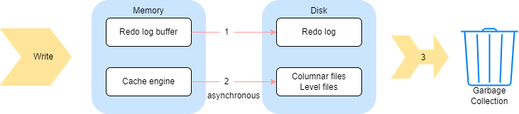

# redo log 和 cache engine：相关概念和配置说明

- [1. redo log/cache engine相关概念](#1-redo-logcache-engine相关概念)
  - [1.1 什么是 redo log](#11-什么是-redo-log)
  - [1.2 什么是 cache engine](#12-什么是-cache-engine)
  - [1.3 redo log 和 cache engine 的写入和回收](#13-redo-log-和-cache-engine-的写入和回收)
  - [1.4 为什么需要redo log/cache engine](#14-为什么需要redo-logcache-engine)
- [2. 配置说明](#2-配置说明)
  - [2.1 redo log 相关配置和函数](#21-redo-log-相关配置和函数)
  - [2.2 cache engine 相关配置和函数](#22-cache-engine-相关配置和函数)
- [3. 性能的影响与优化建议](#3-性能的影响与优化建议)
  - [3.1 磁盘负载和内存使用](#31-磁盘负载和内存使用)
  - [3.2 对节点启动的影响](#32-对节点启动的影响)
  - [3.3 相关性能优化的建议](#33-相关性能优化的建议)

这篇教程重点介绍了 DolphinDB 中的 redo log 和 cache engine 机制以及其配置对整体性能的影响。

:bulb: **注意**：

- 它们只对 DFS 数据库起作用，对流表不起作用
- TSDB 存储引擎必须开启 cache engine 和 redo log
- OLAP 存储引擎可以不开启 redo log，但启用了 redo log 之后必须启用 cache engine

## 1. redo log/cache engine相关概念

### 1.1 什么是 redo log

在关系型数据库系统中，预写式日志 (write-ahead logging, WAL) 是用于提供原子性和持久性的一系列技术。DolphinDB 中的 redo log 与 WAL 的概念类似。简而言之，redo log 的核心思想是：只有在描述事务更改的日志记录刷新到持久化存储介质以后，才对数据库的数据文件进行修改。如果遵循这个过程，就不需要在每次提交事务时都将数据页刷新到磁盘上，因为在数据库发生宕机时，可以使用日志来恢复数据库，尚未应用的所有更改可以通过日志记录回放并重做。

### 1.2 什么是 cache engine

cache engine 是 DolphinDB 中的一种数据写入缓存机制，它是为了解决数据表列数过多的情况下写入性能急剧下降的问题而引入的。

对一个文件进行写入时，写入 1 行数据和写入 1000 行数据的时间基本相等，大部分时间都花在打开和关闭文件上。因此，引入 cache engine 以后，写入操作时首先写入缓存中，到达一定阈值以后，异步将缓存中的数据写入磁盘中。

### 1.3 redo log 和 cache engine 的写入和回收

<figure align="left">
    
    <figcaption>数据写入与回收过程</figcaption>
</figure>

由上图可知，数据整体的写入流程可以分成三个部分：

（1）数据写入 redo log，一个事务的数据存成一个文件。

（2）数据写入 cache engine， 并由 cache engine 异步写入数据到列文件（OLAP）或者 level file（TSDB）。

（3）事务完成后回收 cache engine 和 redo log。

在系统内部，为了保证极端情况下还能够从 redo log 中恢复数据，redo log 在对某个事务的日志进行回收之前，首先要向 cache engine 确认该事务已经不在缓存当中，即已经被 cache engine 回收。因此，对于步骤 （3），系统实质上是先完成 cache engine 的回收，才会进一步回收 redo log。

cache engine 的回收，在写入磁盘后完成。

- 定期回收
  - OLAP引擎：每30秒
  - TSDB引擎：每60秒
- cache engine 的内存占用大小达到一定阈值时回收
  - OLAP 引擎：当缓存中的数据量达到 OLAPCacheEngineSize 的 30% 时，cache engine 会将内容写到**列文件**，完成回收。
  - TSDB 引擎：将当数据量达到 TSDBCacheEngineSize 大小后，cache engine 将内容写入 **level file** （类似于 leveldb 的 flush memtable 的过程），完成回收。
- 通过 `flushOLAPCache`，`flushTSDBCache` 手动清理缓存

系统定期回收已完成且 cache engine 完成落盘的事务的 redo log。DolphinDB 提供了两种回收机制：

- 定期回收（`redoLogPurgeInterval`）
- 文件大小达到一定阈值时回收（`redoLogPurgeLimit`）

因此，需要注意不可以将 cahce engine 的大小设置过大，否则事务长期滞留在缓存当中，无法被 redo log 回收，将导致 redo log 占用的空间持续增长。

### 1.4 为什么需要redo log/cache engine

除了解决断电、数据库系统宕机等极端情况下的数据一致性问题，redo log同时优化了写入性能。

以 OLAP 引擎的写入场景为例，如果一次写入 100 个分区，每个分区有 200 个列文件，那么一次就需要写入 20000 个列文件。如果这些列文件都在 1 块 HDD 上，数据直接同步落盘，那么寻址的开销将非常大。而引入  redo log 机制后，落盘时数据无需按分区和列文件进行写入，大幅减小了寻址的开销，优化写入性能。

使用 redo log 的主要优势为：

- 顺序写入性能更好，在事务提交时只需要将日志文件刷新到磁盘，而不是将事务涉及到的所有文件刷新。这点对于 OLAP 引擎来说优化更加明显。

cache engine 大大减少了磁盘的写入次数，能够提升写入性能，尤其是在数据表列数过多的情况下。

DolphinDB 采用列式存储，一个分区内的每一列数据单独存放在一个文件中。如果表的列数过多（比如物联网场景下同时记录几千个指标），每进行一次数据写入，就要对几千个物理文件进行操作（打开，写入，关闭等）。如果把多次少量的写入缓存起来，一次批量写入，就可以节省许多对文件进行打开和关闭带来的时间开销，从而在整体上提升系统的写入性能。

## 2. 配置说明

### 2.1 redo log 相关配置和函数

配置参数：

- [dataSync](https://www.dolphindb.cn/cn/help/DatabaseandDistributedComputing/Configuration/StandaloneMode.html?highlight=dataSync): 是否使用 redo log 功能。取值为 1 代表开启 redo log；默认值为 0，表示不启用该功能。
- [redoLogDir](https://www.dolphindb.cn/cn/help/DatabaseandDistributedComputing/Configuration/StandaloneMode.html?highlight=redoLogDir): redo log 文件的存放位置。一般建议将该位置设置到 SSD 硬盘上以获取最佳的性能。默认在 homeDir（由 home 参数决定）下的 log/redoLog 目录下。如果是集群模式，注意要分别设置不同数据节点的目录，避免使用相同目录，造成写入错误。
- [redoLogPurgeLimit](https://www.dolphindb.cn/cn/help/DatabaseandDistributedComputing/Configuration/StandaloneMode.html?highlight=redoLogPurgeLimit): redo log 文件占用的最大空间，单位为 GB，默认值为 4。当 redo log 文件大小超过该值时会自动开始回收。
- [redoLogPurgeInterval](https://www.dolphindb.cn/cn/help/DatabaseandDistributedComputing/Configuration/StandaloneMode.html?highlight=redoLogPurgeInterval): redo log 自动回收的周期，单位为秒，默认值为 30，表示每 30 秒自动回收一次。
- [TSDBRedoLogDir](https://www.dolphindb.cn/cn/help/DatabaseandDistributedComputing/Configuration/StandaloneMode.html?highlight=TSDBRedoLogDir): TSDB 存储引擎重做日志的目录。

> 需要注意有些参数需要配置在控制节点配置文件，有些参数则需要配置在数据节点的配置文件里，上面链接会有具体说明。

运维函数：

- [getRedoLogGCStat](https://www.dolphindb.cn/cn/help/200/FunctionsandCommands/FunctionReferences/g/getRedoLogGCStat.html): 获取 redo log 垃圾回收的状态。
- [imtForceGCRedolog](https://www.dolphindb.cn/cn/help/200/FunctionsandCommands/imt/imtForceGCRedolog.html): 跳过长时间未回收的事务继续回收后续事务。

### 2.2 cache engine 相关配置和函数

**OLAP 引擎 cache engine 相关参数和函数**

配置参数：

- [OLAPCacheEngineSize](https://www.dolphindb.cn/cn/help/DatabaseandDistributedComputing/Configuration/StandaloneMode.html?highlight=olapcacheenginesize): cache engine 中数据量上限，单位为 GB。默认值为 0，表示不使用 cache engine。若该值大于 0，那么当 cache engine 占用内存大于该值的 30% 时，会主动开始异步回收。

函数/命令：

- [flushOLAPCache](https://www.dolphindb.cn/cn/help/FunctionsandCommands/CommandsReferences/f/flushOLAPCache.html): 手动清空缓存。只有已经完成的事务才会被清空，正在进行但是还没有提交的事务不会被清空。
- [getOLAPCacheEngineSize](https://www.dolphindb.cn/cn/help/FunctionsandCommands/FunctionReferences/g/getOLAPCacheEngineSize.html): 返回 cache engine 占用的内存量。
- [setOLAPCacheEngineSize](https://www.dolphindb.cn/cn/help/FunctionsandCommands/CommandsReferences/s/setOLAPCacheEngineSize.html): 在线修改 OLAP 引擎 cache engine 的容量。
- [getOLAPCacheEngineStat](https://www.dolphindb.cn/cn/help/FunctionsandCommands/FunctionReferences/g/getOLAPCacheEngineStat.html): 返回 cache engine 的状态。

**TSDB 引擎 cache engine 相关参数和函数**

配置参数：

- [TSDBCacheEngineSize](https://www.dolphindb.cn/cn/help/DatabaseandDistributedComputing/Configuration/StandaloneMode.html?highlight=TSDBCacheEngineSize): 默认为 1G， 用于配置 TSDB cache engine 的大小，注意如果写入压力太大，系统的 cache engine 内存占用会达到两倍的 TSDBCacheEngineSize 大小。 这是因为写入数据量达到 TSDBCacheEngineSize 时 ，系统会开始将这部分数据刷盘。若刷盘时有新数据的继续写入，系统会重新申请一个新的内存空间。老的内存空间在后台继续做刷盘操作，如果刷盘不够快，有可能因为写入导致新的内存也达到 TSDB CacheEngineSize 大小，所以内存峰值可能会达到 2 倍的 TSDBCacheEngineSize。

函数/命令:

- [flushTSDBCache](https://www.dolphindb.cn/cn/help/FunctionsandCommands/CommandsReferences/f/flushTSDBCache.html?highlight=flushtsdbcache): 将 TSDB 引擎缓冲区里已经完成的事务强制写入数据库。
- [getTSDBCacheEngineSize](https://www.dolphindb.cn/cn/help/FunctionsandCommands/FunctionReferences/g/getTSDBCacheEngineSize.html?highlight=gettsdbcacheenginesize): 查看 TSDB 引擎 CacheEngine 许使用的内存上限。
- [setTSDBCacheEngineSize](https://www.dolphindb.cn/cn/help/FunctionsandCommands/CommandsReferences/s/setTSDBCacheEngineSize.html?highlight=settsdb): 用于在线修改 TSDB 引擎的 CacheEngine 容量。

## 3. 性能的影响与优化建议

### 3.1 磁盘负载和内存使用

- redo log 会增加磁盘占用，在数据文件以外额外写 redo log 文件增加了数据的写入量。
- cache engine 可以减少磁盘负载，因为写入的次数减少了，少量多次的写入变成了批次写入。
- cache engine也会增加内存占用，因为系统对还未写入磁盘的数据进行了缓存。

### 3.2 对节点启动的影响

redo log 过大可能导致节点启动时间过长，可能有以下原因：

1. redo log 配置的磁盘空间太大，导致 redo log 文件一直没有回收。
2. redo log 配置的回收周期太长，导致一直没有触发回收。
3. cache engine 配置的内存太大，导致 cache engine 一直没有回收，从而阻塞了 redo log 的回收。
4. redo log 文件存储在机械硬盘（HDD）上，致使集群启动的时候读取这些文件耗费的时间较多。

启动时 redo log 可能需要回放很长时间，用户可以通过在日志里搜索 "transactions to be replayed have been completed" 字符串来查看回放的进度。

### 3.3 相关性能优化的建议

根据以上叙述，为了提升数据库的整体写入性能，有以下几点建议：

1. 将所有元数据的存放目录以及 redo log 存放目录配置到 SSD 磁盘，有条件的情况下使用工业级 SSD 磁盘。具体建议的配置如下：

> dfsMetaDir: 控制节点元数据存储目录，设置到 SSD 磁盘，在 *controller.cfg* 中设置。
>
> chunkMetaDir: 数据节点元数据存储目录，设置到 SSD 磁盘，在 *cluster.cfg* 中设置。
>
> redoLogDir: 设置到 SSD 磁盘，在 *cluster.cfg* 中设置。 
>
> persistenceDir: 流数据的存储路径，建议设置到 SSD 磁盘。在 *cluter.cfg* 中设置。在集群模式中，需要保证同一机器上的数据节点配置了不同的 persistenceDir
>
>  logFile: 各个节点的运行日志，记录节点的运行状态、错误信息等，可以写到 HDD 磁盘。在 *controller.cfg*, *agent.cfg*, *cluster.cfg* 中设置。
>
> batchJobDir: 批处理任务的日志目录，例如 submiJob 提交的任务日志，可以写到 HDD 磁盘。在 *cluster.cfg* 中设置。
>
>  jobLogFile: 各个节点的 query 日志，记录各个 query 的执行情况，可以写到 HDD 磁盘。在 *cluster.cfg* 中设置。

2. 合理配置 redo log 的磁盘空间上限和垃圾回收周期，一般建议配置磁盘空间不超过 4GB，不低于 1GB，回收周期配置为 60 秒。
3. 合理配置 cache engine 的内存大小，不宜过大或过小，最大不超过数据节点内存配置的 1/4，设置为 1~4GB 适合大部分情况。具体结合机器硬件与写入数据的速率来决定。
