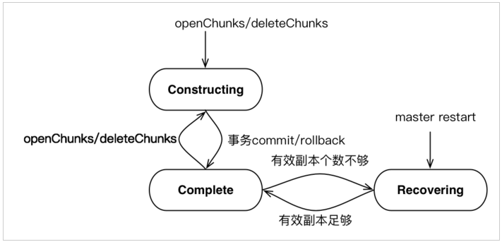
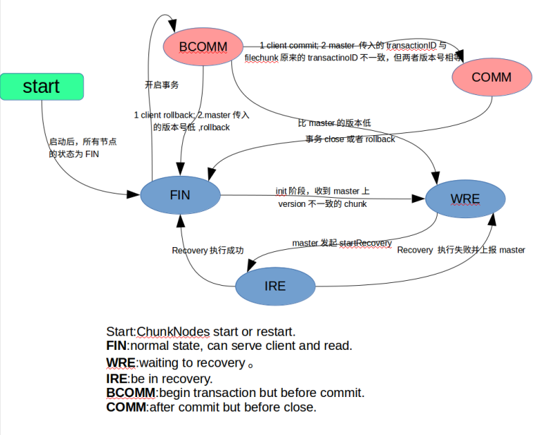
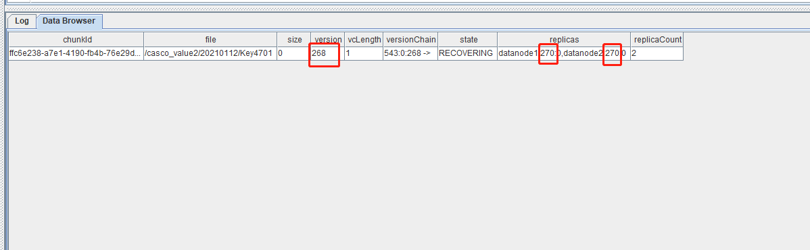
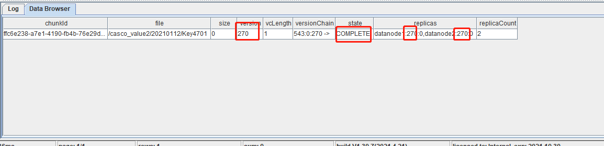
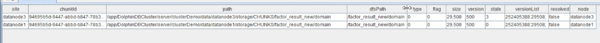
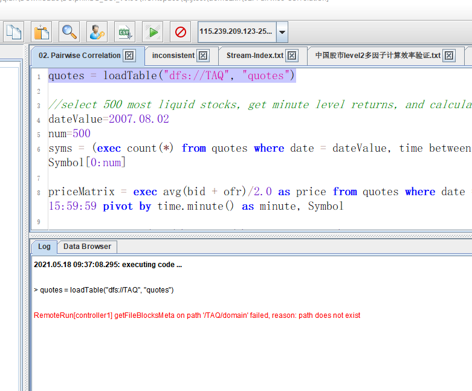
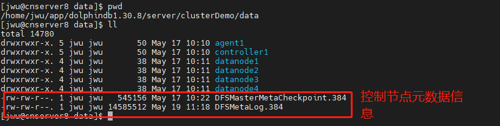

# DolphinDB 分区状态不一致如何解决

- [1. 概述](#1-概述)
- [2. 基本知识](#2-基本知识)
  - [2.1 Controller 和 Datanode 上版本状态说明](#21-controller-和-datanode-上版本状态说明)
  - [2.2 Controller 和 Datanode 版本一致性校验](#22-controller-和-datanode-版本一致性校验)
- [3.分区状态不一致场景](#3分区状态不一致场景)
- [4. 分区状态不一致修复方法与案例](#4-分区状态不一致修复方法与案例)
  - [4.1 利用函数 `forceCorrectVersionByReplica` 修复版本错乱问题](#41-利用函数-forcecorrectversionbyreplica-修复版本错乱问题)
  - [4.2 利用函数 `imtUpdateChunkVersionOnDataNode` 和 `updateChunkVersionOnMaster` 直接编辑 chunk 的元数据版本信息](#42-利用函数-imtupdatechunkversionondatanode-和-updatechunkversiononmaster-直接编辑-chunk-的元数据版本信息)
  - [4.3 利用函数 `restoreControllerMetaFromChunkNode` 恢复 Controller 上的元数据](#43-利用函数-restorecontrollermetafromchunknode-恢复-controller-上的元数据)
  - [4.4 利用函数 `dropPartition` 强制删除元数据](#44-利用函数-droppartition-强制删除元数据)
- [5. 总结](#5-总结)


## 1. 概述

在 DolphinDB 日常运维时，可能由于误操作或意外情况，造成控制节点与数据节点的分区状态不一致，最终导致数据无法加载和写入。针对这种异常，本教程讲述如何解决 DolphinDB 分区状态不一致的问题，以恢复数据库正常加载数据功能。

## 2. 基本知识

DolphinDB 利用分布式文件系统实现数据库的存储和基本事务机制。数据库以分区为单位进行管理。分区的元数据存储在控制节点 (Controller)，副本数据存储在各数据节点 (Datanode，又称 ChunkNode)，统一由分布式文件系统 (Distributed File System，简称 DFS) 进行管理。DolphinDB 采用多副本机制，相同数据块的副本存储在不同的数据节点上。数据库中的数据包括两个部分：元数据和分区数据。元数据指的是数据库的分区信息，每个分区的版本链，大小，存储位置等。分区数据指的是具体要存储的实际数据，包含多个副本。每一个数据块简称为 chunk。下面分别介绍 Controller 以及 Datanode 中 chunk 保存内容：

**Controller**

- 1.文件命名空间：例如/ff_custom15/YANGXS_YINZI8/202104M_202105M

  每一级目录都有属性:{'Normal', 'Partiton', 'Seq'}.

     Normal:类似于普通的文件系统目录.
     Partition:数据库的分区目录，Range，List，Value.
     Seq: 将一张表按照 Tablet chunk 为单位进行顺序分割的目录。

     File Chunk: 普通文件的 chunk.例如/ff_custom3/table_data_3.tbl 是一个 FileChunk

     Tablet Chunk:一种特殊的 chunk，可以想象为结构化数据表的一小片，是一个目录，也就是 Sequential 分区下的 Part 概念，该目录下存放实际的数据，这种类型的目录必须作为最后一级分区，该目录同样受 chunk 大小限制。例如/ff_custom15/YANGXS_YINZI8/202104M_202105M 是一个 Tablet Chunk.

- 2.File Chunk 和文件名的映射关系，一个大文件 chunk 对应多个小 chunk 存储.

- 3.chunk 的位置信息，一般是由 DataNode 汇报到 Controller 合成，包括该 chunk 位于的位置信息，管理的分区、tablet Chunk 信息，各分区、tablet Chunk 的版本号，负载等信息。

**datanode**

- 1.主要处理 File Chunk 和 Tablet Chunk 两种类型。
  File Chunk 可以是按照 chunk id 命名的一个 binary 文件.
  Tablet Chunk 可以是按照 chunk id 命名的一个目录，里面存放 Tablet 数据。
  ChunkNode 定时向 Controller 汇报本地存放的 File Chunk 和 Tablet Chunk 信息，负载信息。

一个数据库可以包含上百万个分区，分区的多副本之间使用二阶段提交协议实现分区副本的强一致性。下面简要介绍 TID、CID 以及二阶段提交协议流程：

- 事务编号（TID, unsigned long long, 递增）
  事务提交编号（CID，unsigned long long, 递增）
  版本号（unsigned int，可以循环利用）
- 1、协调人（提交任务的节点）首先向 Controller 取得一个事务编号（TID），并在 Controller 的内存中做元数据修改，然后把任务发给每一个 Chunk Node。每一个 Chunk Node 去完成具体任务，如果有错抛出异常给协调人。
- 2、a) 协调人收到异常或者请求超时，认为任务没有完成，决定回滚事务。向各个 Chunk Node 和 Controller 发出回滚请求。b) 协调人如果没有收到异常，也没有任何超时，协调人决定准备提交事务（提交的第一阶段）。协调人向 Controller 获取一个（Commit Identifier，CID）协调人带着 TID 和 CID，向相关的 Chunk Node 和 Controller 发送提交请求。
- 3、a) 协调人收到异常或者请求超时，决定回滚事务。向各个 Chunk Node 和 Controller 发出回滚请求。b) 协调人如果没有收到异常，也没有任何超时，协调人决定准备提交事务（提交的第二阶段）。协调人向 Controller 和 chunk node 发出 complete 事务请求。
- 4、在第二阶段（回滚或确认），不管 chunk node 和 Controller 发生什么，协调人不作任何处理，都交由集群的版本恢复机制来处理。

### 2.1 Controller 和 Datanode 上版本状态说明

DolphinDB 上版本状态说明分布在 Controller 和 Datanode 上，正常情况都处于完成状态。所有 chunk 的 version 以 Controller 的 version 为标准，如果一个 chunk node 保存的某个 chunk 的 version 不等于 Controller 上保存的该 chunk 的 version，那么认为不一致，需要通过 Recovery 机制恢复到最新的 version。事务版本状态说明如下：

- 查看 Controller 上所有 chunk 的版本：

  ```
  select * from getClusterChunksStatus()
  ```

- 返回表中重要的列说明

  - `chunkId`：chunk 的唯一标识

  - `file`：分区路径。

  - `size`：file chunk 占用磁盘空间，单位为 byte。对于 tablet chunk, 返回 0，需要使用 getTabletsMeta 来查看它们实际占用的磁盘空间。

  - `version`：版本号

  - `VCLength`: 版本链长度

  - `VersionChain`: 版本链。例如 1028:0:1 -> 1028:0:0 -> 标识该 CHUNK 经历了两个版本，1028:0:1 分别表示 CHUNK 的 Cid、size 以及 version

  - `state`：chunk 状态。COMPLETE 表示数据已导入；CONSTRUCTING 表示正在导入数据；RECOVERING 表示正在恢复数据。

  - `replicas`：副本的分布信息。

  - `replicaCount`：副本数

Controller 上版本有 3 个状态：CONSTRUCTING,  RECOVERING,  COMPLETE（对应字段 state）

- `CONSTRUCTING` ：chunk 正在构建中，比如 openchunk 后正在写入，正在删除等，一般是事务中的状态。
- `RECOVERING` ：chunk 处于恢复中，当 Controller 刚启动，chunk 都处在这个状态，然后等待 Datanode 汇报版本，如果版本和 Controller 上的版本一致，则状态由 RECOVERING 变为 COMPLETE 状态。其次如果 Datanode 汇报上来的版本不一致，那么 Controller 上的 chunk 会一直处在这种状态，直到 recovery 过程完成，然后版本变为一致，状态变为 COMPLETE。除了 Controller 刚启动，在正常运行中，也可能出现这种状态，比如在读数据的时候，检查到数据校验错误，Datanode 会向 Controller 发起 recovery 请求，Controller 开始执行这个 recovery 的过程中，chunk 的状态也是 RECOVERING。
- `COMPLETE` : chunk 处于完成状态，事务正常完成，重启后版本一致，都将处在这个状态，这个状态是最终正确的状态。

当 Controller 重启后，所有文件的最后一个 chunk 被置为 Recovering 状态，随着 chunk 信息汇报上来后，如果副本 chunk version 和 master chunk version 一致且有效副本个数到达阈值，那么 Recovering=> Complete，否则 Controller 将不一致的 chunk 加入待恢复 chunk 队列。对于等待恢复的 chunk，选择一个一致的 chunk 副本作为 primary chunk，执行这个副本过程，如果一个 chunk 的所有副本都和 Controller chunk version 不一致，无法进行恢复。对于正在进行恢复的 chunk 来说，限制该 chunk 无法进行写。对于每个 chunk 的 recovery 过程都分配一个唯一的 recovery id，由 master 生成，用于去重复。所以本篇文章第四节针对无法重启自动恢复 chunk 的问题提出解决方案。如下图附 Controller 的 chunk 状态图：



查询 Controller 上版本可能有问题的 chunk：

```
select * from getClusterChunksStatus()  where  state != 'COMPLETE'
select * from rpc(getControllerAlias(), getClusterChunksStatus) where  state != 'COMPLETE'
```

- 查看 Datanode 上所有 chunk 的版本

  ```
  select * from pnodeRun(getAllChunks)
  ```

- 返回表中重要的列说明

  - `site` : chunk 所属 datanode
  - `chunkId`：chunk 的唯一标识。
  - `path`：chunk 物理路径。
  - `dfsPath`：分区路径。
  - `type`：分区类型。0 表示 file chunk；1 表示 tablet chunk。
  - `flag`：删除标志。若 flag=1，此 chunk 数据不能被查询到，但尚未从磁盘删除。
  - `size`：file chunk 占用磁盘空间。
  - `version`：版本号
  - `state`：chunk 状态
  - `versionList`：版本列表，cid : 6,pt=>6:500338; # 表示该分区 chunk 的 cid 为 6，所属为 pt 表，其总行数为 500338

Datanode 上的状态有 5 个状态：FIN, BCOMM, COMM, WRE, IRE 分别对应 state 字段 0，1，2，3，4：

- `FIN` ：chunk 处于终态，包括事务最终正确完成，或者 rollback。
- `BCOMM` : before commit, 往一个 chunk 上正在执行事务，在 commit 之前的阶段。比如正在写数据或者删除数据。
- `COMM` ：after commit，事务已经 commit 的状态。
- `WRE `：waiting for recovering，等待恢复的状态，比如版本不一致或者数据损坏，向 Controller 发起 recovery 请求后，等待 Controller 发起 recovery 之前，则会处于这种状态。
- `IRE `：in recovering 状态，在 recovering 状态中，接受到 Controller 的 recovering 请求，开始启动 recovery，则处于这个状态，recovering 完成后变为 FIN 状态。

chunk 的最终状态为 FIN，其他状态都是临时状态，Datanode 启动后，一般处于 FIN 状态，如果有异常需要恢复，则可能处于 WRE 状态。

如下图附上 ChunkNode 状态图：



查看 Datanode 上所有非正常的 chunk 的状态：

```
select * from getAllChunks() where state != 0 
```

### 2.2 Controller 和 Datanode 版本一致性校验

Controller 和 Datanode 启动后，正常情况下，所有 chunk 都处于终态，Controller 上状态为 COMPLETE，Datanode 上状态为 FIN。并且每个 chunk 上所有副本版本一致，并且和 Controller 要完全一致。下面有以下 3 个场景将触发 chunk 的恢复机制。
（1）Controller 或 Datanode 重启，
（2）Controller 或 Datanode 的事务处于 committed 的状态，但已经 timeout
（3）在客户端读写的过程中发现 Controller 和 Datanode 的版本不一致。

正常触发恢复机制后，在半个小时左右都将使得 Controller 或 Datanode 的 Chunk 状态分别变成 COMPLETE 以及 FIN。如果 Chunk 一直处于 Recovering 状态，下面第三节介绍常见场景以及解决方案。

## 3.分区状态不一致场景

典型的版本不一致的场景如下：

- (a) Datanode 两个副本一致，但是和 Controller 不一致；
- (b) Datanode 两个副本不一致，其中一个和 Controller 一致；
- (c) Datanode 两个副本不一致，并且都和 Controller 不一致；
- (d) Datanode 两个副本一致，但是 Controller 的 chunk 丢失；

造成这些版本不一致的原因可能是多方面，一是程序的 bug，二是人为删除数据文件，三是配置不当，（比如不同数据节点的 meta 配置到一个目录下），四是当不正常的关机、重启时，集群没准备好写入等原因。

## 4. 分区状态不一致修复方法与案例

由于版本不一致的现象多种多样，按照目前数据库 recovery 的设计，如果有版本不一致的情况，datanode 上报后，Controller 会启动 recovery 来修复。自动 recovery 只能修复上面的 (b) 场景，也就是两个 datanode 的 replica 中有一个和 Controller 的版本相同，这种场景下，recovery 会修复不一致的版本，并且最终，Controller 和 datanode 的版本会达到一致。针对其他的场景，还是修复不了，要利用一些特殊的手段来修复。下面的方法包括修改元数据，发起 recovering，指定修复到某个版本，删除/复制 replica，从 datanode 恢复出 Controller 等。

注意：在确认数据本身正确，只是版本或者元数据不正确的话，利用下列函数来强制修改 datanode 元数据。

### 4.1 利用函数 `forceCorrectVersionByReplica` 修复版本错乱问题

如下场景：

查询 Controller 上版本可能有问题的 chunk：

```
select * from rpc(getControllerAlias(), getClusterChunksStatus) where  state != 'COMPLETE'
```



如图所示其中 version 字段对应 Controller 上的 Chunk 版本信息为 270，而 replicas 对应 DataNode 上的 Chunk 版本信息，可以发现符合（a）场景，Controller 上版本信息明显低于 DataNode 上信息。可以使用下面函数修复

`forceCorrectVersionByReplica`函数定义如下

forceCorrectVersionByReplica(chunkID,nodealias)

- `chunkID`: chunk 的唯一标识。
- `nodealias`: 节点别名。

该函数功能是，强制该 chunk 以 nodealias 上的版本和数据为准，Controller 和其他的 datanode 必须无条件与其同步。该函数背后的实现原理是，找到 nodealias 上 chunk，Controller 先向 datanode 获取到 chunk 的版本信息，并且将 nodealias 上该版本的状态转为 FIN。然后 Controller 自己的版本号按照 datanode 反馈的更新，然后发起 recovery，强制其他的 replica 同步 nodealias 行该 chunk 的数据和版本信息。

该函数可以解决版本不一致的绝大多数问题，但可能会导致数据部分丢失，所以在选择 nodealias 的时候，尽量选择版本高的 nodealias。示例脚本如下：

```python
for(chunk in chunkIDs){          
    nodes = exec  top 1 node from pnodeRun(getAllChunks) where chunkId=chunk order by version desc
    rpc(getControllerAlias(), forceCorrectVersionByReplica{chunk, nodes[0]})
}
```

查看该 Chunk 的状态，如图所示，版本一致，状态变成 COMPLETE。



在控制节点的状态变成 COMPLETE 之后，也需要检查下数据节点元数据的状态。如果数据节点的 state 为 3，则需要通过函数`triggerNodeReport`去触发下数据节点重新去汇报下状态（这个函数在 2.00.8 开始才有，如果是之前的版本，则需要通过重启数据节点触发分区信息的汇报）。


比如，下面通过`select * from pnodeRun(getAllChunks) where chunkId=xxxx` 查询数据节点元数据的结果如下：


其中的 datanode3 的 state 为 3，则需要在控制节点，通过执行

```python
triggerNodeReport("datanode3")
```
去触发下 datanode3 汇报信息，之后 state 会被重置为 0，这时候控制节点元数据和数据节点元数据信息都恢复正常了。

### 4.2 利用函数 `imtUpdateChunkVersionOnDataNode` 和 `updateChunkVersionOnMaster` 直接编辑 chunk 的元数据版本信息

`imtUpdateChunkVersionOnDataNode`函数定义如下

imtUpdateChunkVersionOnDataNode(chunkID,version)

- `chunkID`: chunk 的唯一标识。
- `version`: 版本号

可以在数据节点上使用 `getClusterMeta` 查看当前数据节点上 chunk 对应的版本号。

假设 530076e2-c6e9-cf97-8d49-9e5faac17325 为 chunkID, 1 为 version，该函数用法如下：

```
imtUpdateChunkVersionOnDataNode("530076e2-c6e9-cf97-8d49-9e5faac17325", 1)
```

该函数的功能不提供分布式功能，只针对某个 chunkNode 上某个 Chunk，直接修改并持久化改 Chunk 的元数据，使得版本恢复一致。注意：该函数只能在数据节点上使用。

`updateChunkVersionOnMaster`函数定义如下

updateChunkVersionOnMaster(chunkId, version)

- `chunkID`: chunk 的唯一标识。
- `version`: 版本号

使用前，可以在控制节点使用函数 `getClusterChunksStatus` 查询所有节点上 chunk 对应的版本号。

该函数的功能，直接修改并持久化改 chunk 的元数据，使得版本恢复一致。

注意：只能在控制节点上使用。1.30.16/2.00.4 及之前的版本在使用之前请咨询技术支持，可能会导致 createCids 列表为空。

如图所示


Controller 上版本低于 ChunkNode 上版本，使用下列语句修复

```
updateChunkVersionOnMaster("deb91fa2-f05a-3096-5941-b80feda42562",270)
```

注意；这两个函数并不修改除版本号外的其他信息。与 forceCorrectVersionByReplica 函数区别是，forceCorrectVersionByReplica 是强制 Controller 版本和 datanode 版本一致，适合于 Datanode 上 chunk 版本高于 master 版本。如果 Datanode 上 chunk 版本低于 master 版本，尽量选择高版本信息，可以使用本小节两个函数，将 chunk 信息修改为指定版本。

### 4.3 利用函数 `restoreControllerMetaFromChunkNode` 恢复 Controller 上的元数据

如下场景：

```
select * from rpc(getControllerAlias(), getClusterChunksStatus)
```

执行上述语句时查询到控制节点的元数据为 0.且加载 dfs 分布式表报如图错误，可以使用 `restoreControllerMetaFromChunkNode` 函数



`restoreControllerMetaFromChunkNode`函数主要功能是恢复元数据，必须控制节点（controller）上执行；该函数于 1.20.9 开始支持，该函数执行时，元数据存储目录下必须为空，所以需要在 controller.cfg 中配置元数据存储位置，参数“dfsMetaDir=元数据存储路径”，元数据存储路径必须为空。控制节点的元数据文件如下：



元数据恢复过程如下：

1.关闭 DolphinDB 集群；

2.备份 data 目录下的 DFSM*元数据文件（为了元数据安全，必须备份）；

3.删除 data 目录下的 DFSM*元数据文件；

4.在 controller.cfg 中配置元数据存储位置，参数“dfsMetaDir=元数据存储路径”，

该存储路径下必须只有元数据文件，不能同时存储其它文件；

5.重启集群，启动 controller、agent、datanode；

6.连接控制节点，需要等 1 分钟左右（数据节点加载 chunk 信息）再执行

restoreControllerMetaFromDatanode() 函数，chunk 信息未加载完毕前执行上述

函数，会报错：Invalid UUID string;

7.如果反复执行 restoreControllerMetaFromChunkNode() 函数，会报错：File 

[DFSMasterMetaCheckpoint.23553] is not zero-length, please check.

此时说明，元数据文件已经恢复成功；

8.执行完函数后，重启整个集群，就可以正常查询原有数据了。

### 4.4 利用函数 `dropPartition` 强制删除元数据

如果确实要删除某个 chunk，但如果 chunk 的版本不一致，或者处在 recovering 状态，那么正常的删除会删除失败。这个函数第四个参数，可以指定是否强制删除，不考虑版本一致性的问题。这种情况下，可以使用该函数，并且将第四个参数设置为 true。

示例脚本如下：

```
dbName="/stocks_orderbook"
fileCond=dbName + "%"
t=exec substr(file,strlen(dbName)) from rpc(getControllerAlias(),getClusterChunksStatus) where file like fileCond, state != "COMPLETE"
dropPartition(database("dfs:/"+dbName),t,,true)
```

注意：假设执行查询 能正常返回数据，然后 dropPartition 语句，报错：Failed to find physical table from Table_Name when delete tablet chunk。

可以使用 chunkCheckPoint() 函数，再重启所有数据节点即可。

## 5. 总结

分布式数据库如何保持多副本数据一致性十分复杂，发生元数据异常的情况各有不同，下面有几个场景可能会导致上述情况：

- 网络异常：当协调者向参与者发送 commit 请求之后，发生了网络异常，这将导致只有部分参与者收到了 commit 请求。这部分参与者接到 commit 请求之后就会执行 commit 操作，但是其他未接到 commit 请求的参与者则无法执行事务提交，于是整个分布式系统便出现了数据不一致的问题。
- 服务器宕机：协调者在发出 commit 消息之后宕机，而唯一接收到这条消息的参与者同时也宕机了。那么即使协调者通过选举协议产生了新的协调者，这条事务的状态也是不确定的，没人知道事务是否被已经提交。

建议使用过程中避免 server 在写入数据时，重启机器等操作。
