# DolphinDB 高可用服务部署与迁移

- [概述](#概述)
  - [DolphinDB 高可用概述](#dolphindb-高可用概述)
  - [不同部署模式特点](#不同部署模式特点)
- [单服务器部署伪高可用集群](#单服务器部署伪高可用集群)
  - [部署架构图](#部署架构图)
  - [部署步骤](#部署步骤)
  - [启动步骤](#启动步骤)
- [双服务器部署伪高可用集群](#双服务器部署伪高可用集群)
  - [部署架构图](#部署架构图-1)
  - [部署步骤](#部署步骤-1)
  - [启动步骤](#启动步骤-1)
- [单服务器伪高可用集群升级为三服务器高可用集群](#单服务器伪高可用集群升级为三服务器高可用集群)
  - [迁移架构图](#迁移架构图)
  - [迁移流程](#迁移流程)
- [双服务器伪高可用集群升级为三服务器高可用集群](#双服务器伪高可用集群升级为三服务器高可用集群)
  - [迁移架构图](#迁移架构图-1)
  - [迁移流程](#迁移流程-1)
- [三服务器高可用集群升级为五服务器及以上高可用集群](#三服务器高可用集群升级为五服务器及以上高可用集群)
  - [迁移架构图](#迁移架构图-2)
  - [迁移流程](#迁移流程-2)
- [常见问题解答（FAQ）](#常见问题解答faq)
  - [什么情况下需要迁移 controller 的元数据？](#什么情况下需要迁移-controller-的元数据)
  - [低于三台服务器如何搭建高可用集群？](#低于三台服务器如何搭建高可用集群)
  - [网页无法访问集群？](#网页无法访问集群)
  - [controller 和 agent 服务运行后，data node 无法启动，报出 agent 不存在的错误信息？](#controller-和-agent-服务运行后data-node-无法启动报出-agent-不存在的错误信息)
  - [迁移数据时应该注意什么？](#迁移数据时应该注意什么)
  - [如何部署 DolphinDB，避免频繁迁移？](#如何部署-dolphindb避免频繁迁移)
- [附件](#附件)

在业务发展初期，资源有限的情况下，为了提高系统的可用性，我们会搭建一个伪高可用环境。伪高可用集群的特点在于其控制节点的元数据文件虽然有多副本，但存在多副本在同一台服务器的情况。与伪高可用集群不同，高可用集群控制节点的元数据文件副本均分布在不同的服务器上，确保在服务器故障或其他问题发生时系统能够保持稳定运行。这种架构设计提供了更强大的容错能力和可靠性，是业务规模扩大后的理想选择。因此，在业务可行并确保资源充足的情况下，我们推荐将伪高可用集群迁移升级为高可用集群，以提升系统的稳定性和可靠性。

接下来，我们将详细介绍如何搭建伪高可用集群，以及如何从伪高可用集群迁移到真正的高可用集群。

## 概述

### DolphinDB 高可用概述

DolphinDB 集群的高可用主要体现在**数据高可用（多副本机制）**、**元数据高可用（controller 高可用）**、**客户端高可用（API 指定多个 data node site，支持断连切换）**。

- 数据高可用：DolphinDB 支持在不同的服务器上存储多个数据副本，并且采用二阶段提交协议实现数据副本之间以及数据和元数据之间的强一致性。即使一台机器上的数据损坏，也可以通过访问其他机器上的副本数据来保证数据服务不中断。
- 元数据高可用：controller 存储了集群访问所需的元数据信息。普通集群只包含一个 controller ，若 controller 发生宕机，将造成集群瘫痪。为了避免这种情况，DolphinDB 允许多个 controller 组成 Raft 组，来实现 controller 的高可用。
- 客户端高可用：在读取和写入流表时，能够自动感知流表的 leader，通过连接参数配置 Raft 组，即使流表的 leader 发生变化，客户端也能够自动感知到，然后切换连接进行消费。

### 不同部署模式特点

#### 单节点特点

controller、agent、data node、compute node 部署在同一个物理机器上。对于 data node 和 compute node 只有一个。无法保证高可用，该服务器宕机会导致整体服务不可用。单节点模式拥有与集群模式相同的功能，区别在于单节点模式不支持扩展节点和高可用，而集群模式可以方便地扩展到多个服务器节点以及支持高可用。无法保证高可用，该服务器宕机会导致整体服务不可用。

#### 伪分布式集群特点

controller、agent、data node、compute node 部署在同一个物理机器上。在该服务器上面只有一个 controller，无法满足高可用的特性。但是可以部署多个 data node 和 compute node 来充分利用机器的资源。

**注意**：如果部署节点数超过 3 个，则需要申请申请企业版试用授权许可，因为社区版限制集群最大可部署节点总数为3。

#### 伪高可用集群特点

伪高可用集群是满足了 controller 有奇数台的需求，但是会有多个 controller 运行在同一台服务器上面。如果拥有单个节点的服务器出现问题，只要满足活跃的 controller 大于半数，那么就仍可以提供服务。如果拥有多个 controller 的服务器出现宕机，那么整体服务将不可用。

#### 高可用集群特点

高可用集群实现了数据高可用，元数据高可用和客户端高可用。每个 controller 运行在不同的服务器上面，这样的话即使 controller 集群宕机了一半，也还可以继续对外提供服务。

## 单服务器部署伪高可用集群

**注意**：单服务器下的高可用为 controller 高可用，需要对不同的 controller 的存储目录写到不同的目录下面来构建单机伪高可用。

### 部署架构图

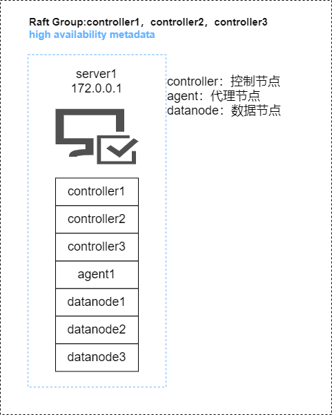

### 部署步骤

**第一步**：下载 DolphinDB 安装包（本次安装以 2.00.10.5 为例）

- 官方下载地址：http://www.dolphindb.cn/downloads.html

**第二步**：在服务器一（172.0.0.1）上执行如下命令解压到指定目录

```
unzip DolphinDB_Linux64_V2.00.10.5.zip -d /home/dolphindb_1;
```

**第三步**：更新软件授权许可

社区版的 License 对内存，CPU 核数和集群最大可部署节点总数有限制，所以需要申请企业版试用授权许可，替换掉 `/home/dolphindb_1/server/dolphindb.lic`。[产品 - DolphinDB](https://www.dolphindb.cn/product#downloads)

**第四步**：在服务器一（172.0.0.1）执行如下命令复制多个安装包来搭建单机伪高可用集群环境

```
cp -r /home/dolphindb_1 /home/dolphindb_2;
cp -r /home/dolphindb_1 /home/dolphindb_3;
```

**第五步**：修改服务器一（172.0.0.1）下的三个 dolphindb 安装包下面的配置文件

**注意**：每个安装包下面都有这四个配置文件，具体内容需要根据实际环境以及配置进行修改。

- *agent.cfg*

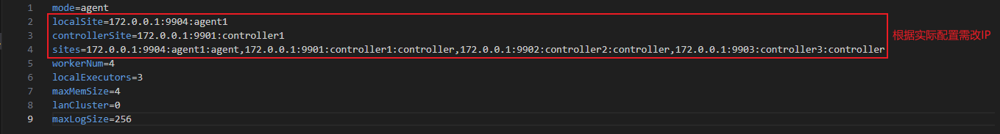

- *cluster.cfg*

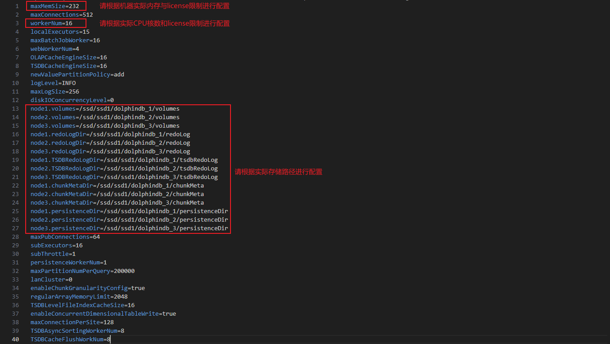
- *cluster.nodes*

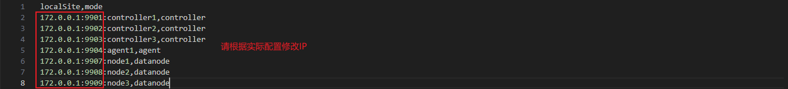

- *controller.cfg*

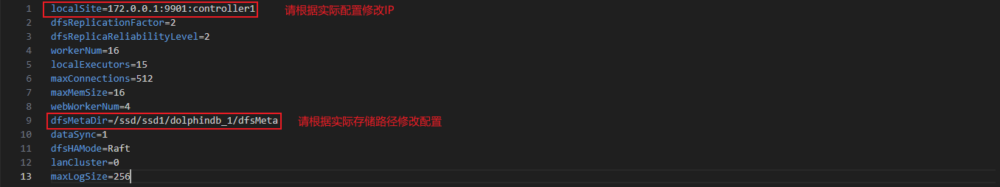

详细配置文件见附件（单服务器部署伪高可用集群）。

### 启动步骤

**第一步**：在每个 dolphindb 安装包下面执行如下命令，启动 controller 和 agent 进程

```
cd dolphindb_1/server/clusterdemo;
sh startController.sh
sh startAgent.sh

cd dolphindb_2/server/clusterdemo;
sh startController.sh

cd dolphindb_3/server/clusterdemo;
sh startController.sh
```

**第二步**：在浏览器输入 172.0.0.1:9901 进入 Web 集群管理界面，启动该机的 data node

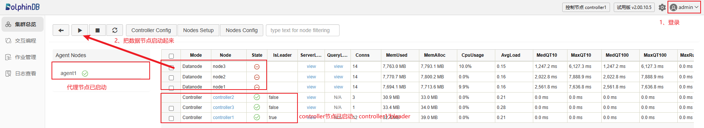
**注意**：172.0.0.1:9901 不一定是 controller 的 leader 连接信息，登录该节点会显示 leader 节点是哪一个，点击跳转即可。

**第三步**：执行建库建表语句

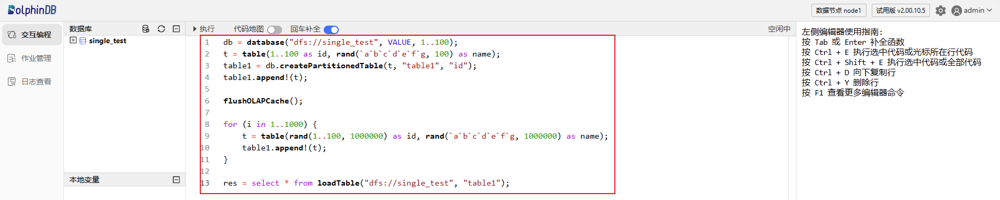

## 双服务器部署伪高可用集群

**注意**：双服务器下的高可用为 controller 高可用，在一台机器上需要部署两个 controller 进程来模拟高可用。

### 部署架构图

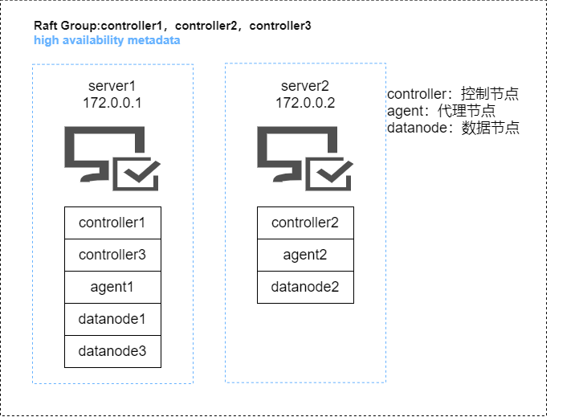

### 部署步骤

**第一步**：下载 DolphinDB 安装包（本次安装以 2.00.10.5 为例）

- 官方下载地址：http://www.dolphindb.cn/downloads.html

**第二步**：在服务器一（172.0.0.1）和服务器二（172.0.0.2）上执行如下命令解压到指定目录

```
# 服务器一上执行
unzip DolphinDB_Linux64_V2.00.10.5.zip -d /home/dolphindb_1;

# 服务器二上执行
unzip DolphinDB_Linux64_V2.00.10.5.zip -d /home/dolphindb_2;
```

**第三步**：更新软件授权许可

社区版的 License 对内存，CPU 核数和集群最大可部署节点总数有限制，所以需要申请企业版试用授权许可，替换掉服务器一（172.0.0.1）上面的`/home/dolphindb_1/server/dolphindb.lic`和服务器二（172.0.0.2）上面的`/home/dolphindb_2/server/dolphindb.lic`。[申请企业版 License](https://www.dolphindb.cn/product#downloads)。

**第四步**：在服务器一（172.0.0.1）执行如下命令复制多个安装包来搭建伪高可用集群环境

```
cp /home/dolphindb_1 /home/dolphindb_3;
```

**第五步**：修改服务器一（172.0.0.1）下的 dolphindb_1、dolphindb_3 和服务器二（172.0.0.2）下的dolphindb_2 的配置文件

**注意**：每个安装包下面都有这四个配置文件，具体内容需要根据实际环境以及配置进行修改。

- *agent.cfg*

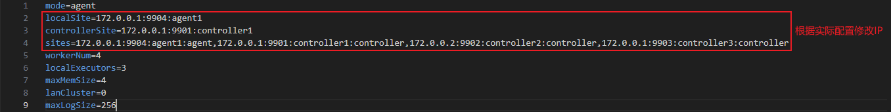

- *cluster.cfg*


- *cluster.nodes*

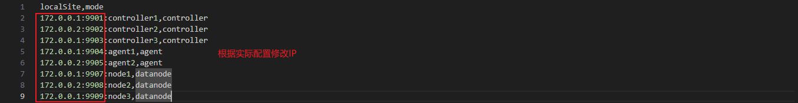

- *controller.cfg*

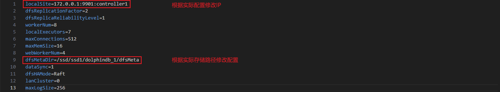

详细配置文件见附件（双服务器部署伪高可用集群）。

### 启动步骤

**第一步**：在服务器一（172.0.0.1）下的 dolphindb_1 和 dolphindb_3 安装包下面以及服务器二（172.0.0.2）下的 dolphindb_2 安装包下面执行如下命令，启动 controller 和 agent 进程

```
# 在服务器一（172.0.0.1）下面执行如下命令
cd dolphindb_1/server/clusterdemo;
sh startController.sh
sh startAgent.sh

cd dolphindb_3/server/clusterdemo;
sh startController.sh

# 在服务器二（172.0.0.2）下面执行如下命令
cd dolphindb_2/server/clusterdemo;
sh startController.sh
sh startAgent.sh
```

**第二步**：在浏览器输入 172.0.0.1:9901 进入 web 管理界面，把所有的 data node 启动起来


**注意**：172.0.0.1:9901 不一定是 controller 的 leader 连接信息，登录该节点会显示 leader 节点是哪一个，点击跳转即可。

**第三步**：登录任一 data node 创建库表信息，验证是否可以正常操作

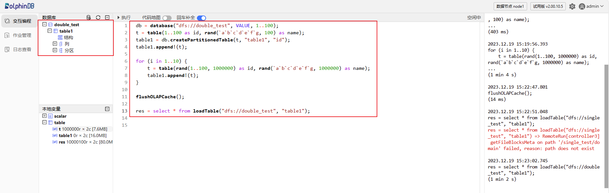

## 单服务器伪高可用集群升级为三服务器高可用集群

### 迁移架构图

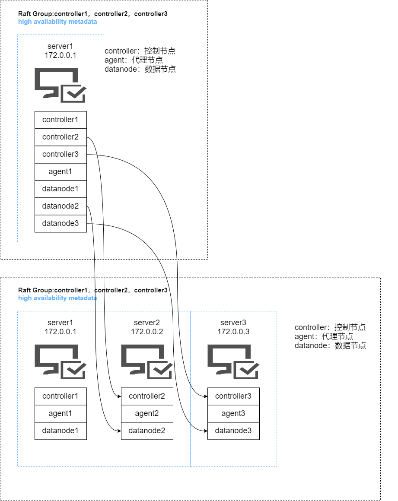

### 迁移流程

#### 配置迁移

**注意**：配置迁移主要是将服务器一（172.0.0.1）下面的 dolphindb_2 和 dolphindb_3 安装包下面的配置迁移到服务器二（172.0.0.2）和服务器三（172.0.0.3）上面。

**第一步**：在服务器一（172.0.0.1）上面执行如下命令关闭所有服务，然后备份现有配置文件

```
# 在服务器一上面执行如下命令
cd /home/dolphindb_1/server/clusterDemo;
sh stopAllNode.sh;
cp -r ./config ./config.bak

cd /home/dolphindb_2/server/clusterDemo;
sh stopAllNode.sh;
cp -r ./config ./config.bak

cd /home/dolphindb_3/server/clusterDemo;
sh stopAllNode.sh;
cp -r ./config ./config.bak
```

**第二步**：执行如下命令将服务器一（172.0.0.1）上面的 dolphindb_2 和 dolphindb_3 安装包分别传输到服务器二（172.0.0.2）和服务器三（172.0.0.3）上面

```
scp /home/dolphindb_2 root@172.0.0.2:/home/dolphindb_2;

scp /home/dolphindb_3 root@172.0.0.3:/home/dolphindb_3;
```

**第三步**：在服务器一（172.0.0.1）上面的 dolphindb_1 下面的 server/clusterDemo/config 下执行如下命令来修改所有涉及 controller 集群信息的配置文件以及在 *cluster.nodes* 添加新增的两个 controller

```
// 修改 controller 集群信息
sed -i.bak -E -e 's/([0-9]+\.[0-9]+\.[0-9]+\.[0-9]+):([0-9]+):controller1/172.0.0.1:\2:controller1/' -e 's/([0-9]+\.[0-9]+\.[0-9]+\.[0-9]+):([0-9]+):controller2/172.0.0.2:\2:controller2/' -e 's/([0-9]+\.[0-9]+\.[0-9]+\.[0-9]+):([0-9]+):controller3/172.0.0.3:\2:controller3/' -e 's/([0-9]+\.[0-9]+\.[0-9]+\.[0-9]+):([0-9]+):agent1/172.0.0.1:\2:agent1/' -e 's/([0-9]+\.[0-9]+\.[0-9]+\.[0-9]+):([0-9]+):agent2/172.0.0.2:\2:agent2/' -e 's/([0-9]+\.[0-9]+\.[0-9]+\.[0-9]+):([0-9]+):agent3/172.0.0.3:\2:agent3/' -e 's/([0-9]+\.[0-9]+\.[0-9]+\.[0-9]+):([0-9]+):node1/172.0.0.1:\2:\node1/' -e 's/([0-9]+\.[0-9]+\.[0-9]+\.[0-9]+):([0-9]+):node2/172.0.0.2:\2:node2/' -e 's/([0-9]+\.[0-9]+\.[0-9]+\.[0-9]+):([0-9]+):node3/172.0.0.3:\2:node3/'  ./*

// 添加服务器二和服务器三的 agent
echo '172.0.0.2:9905:agent2,agent' >> cluster.nodes
echo '172.0.0.3:9906:agent3,agent' >> cluster.nodes
```

**第四步**：在服务器二（172.0.0.2）上面的 dolphindb_2 下面的 server/clusterDemo/config 下执行如下命令来修改所有涉及 controller 集群信息的配置文件和修改服务器二的 agent 信息以及在 *cluster.nodes* 添加新增的两个 controller

```
// 修改 controller 集群信息和 agent 信息
sed -i.bak -E -e 's/([0-9]+\.[0-9]+\.[0-9]+\.[0-9]+):([0-9]+):controller1/172.0.0.1:\2:controller1/' -e 's/([0-9]+\.[0-9]+\.[0-9]+\.[0-9]+):([0-9]+):controller2/172.0.0.2:\2:controller2/' -e 's/([0-9]+\.[0-9]+\.[0-9]+\.[0-9]+):([0-9]+):controller3/172.0.0.3:\2:controller3/' -e 's/([0-9]+\.[0-9]+\.[0-9]+\.[0-9]+):([0-9]+):agent1/172.0.0.1:\2:agent1/' -e 's/([0-9]+\.[0-9]+\.[0-9]+\.[0-9]+):([0-9]+):agent2/172.0.0.2:\2:agent2/' -e 's/([0-9]+\.[0-9]+\.[0-9]+\.[0-9]+):([0-9]+):agent3/172.0.0.3:\2:agent3/' -e 's/([0-9]+\.[0-9]+\.[0-9]+\.[0-9]+):([0-9]+):node1/172.0.0.1:\2:\node1/' -e 's/([0-9]+\.[0-9]+\.[0-9]+\.[0-9]+):([0-9]+):node2/172.0.0.2:\2:node2/' -e 's/([0-9]+\.[0-9]+\.[0-9]+\.[0-9]+):([0-9]+):node3/172.0.0.3:\2:node3/'  ./*

// 添加服务器二和服务器三的 agent
echo '172.0.0.2:9905:agent2,agent' >> cluster.nodes
echo '172.0.0.3:9906:agent3,agent' >> cluster.nodes
```

**第五步**：在服务器三（172.0.0.3）上面的 dolphindb_3 下面的 server/clusterDemo/config 下执行如下命令来修改所有涉及 controller 集群信息的配置文件和修改服务器三的 agent 信息以及在 *cluster.nodes* 添加新增的两个 controller

```
// 修改 controller 集群信息和 agent 信息
sed -i.bak -E -e 's/([0-9]+\.[0-9]+\.[0-9]+\.[0-9]+):([0-9]+):controller1/172.0.0.1:\2:controller1/' -e 's/([0-9]+\.[0-9]+\.[0-9]+\.[0-9]+):([0-9]+):controller2/172.0.0.2:\2:controller2/' -e 's/([0-9]+\.[0-9]+\.[0-9]+\.[0-9]+):([0-9]+):controller3/172.0.0.3:\2:controller3/' -e 's/([0-9]+\.[0-9]+\.[0-9]+\.[0-9]+):([0-9]+):agent1/172.0.0.1:\2:agent1/' -e 's/([0-9]+\.[0-9]+\.[0-9]+\.[0-9]+):([0-9]+):agent2/172.0.0.2:\2:agent2/' -e 's/([0-9]+\.[0-9]+\.[0-9]+\.[0-9]+):([0-9]+):agent3/172.0.0.3:\2:agent3/' -e 's/([0-9]+\.[0-9]+\.[0-9]+\.[0-9]+):([0-9]+):node1/172.0.0.1:\2:\node1/' -e 's/([0-9]+\.[0-9]+\.[0-9]+\.[0-9]+):([0-9]+):node2/172.0.0.2:\2:node2/' -e 's/([0-9]+\.[0-9]+\.[0-9]+\.[0-9]+):([0-9]+):node3/172.0.0.3:\2:node3/'  ./*

// 添加服务器二和服务器三的 agent
echo '172.0.0.2:9905:agent2,agent' >> cluster.nodes
echo '172.0.0.3:9906:agent3,agent' >> cluster.nodes
```

#### 数据迁移

**注意**：数据迁移主要是将服务器一（172.0.0.1）下面的 dolphindb_2 和 dolphindb_3 安装包下面的 *controller.cfg* 配置和 *cluster.cfg* 配置下面的数据路径迁移到服务器二（172.0.0.2）和服务器三（172.0.0.3）。

执行如下命令，将 dolphindb_2 相关的磁盘数据从服务器一（172.0.0.1）迁移到服务器二（172.0.0.2），将 dolphindb_3 相关的磁盘数据从服务器一（172.0.0.1）迁移到服务器三（172.0.0.3）

```
scp -r /ssd/ssd1/dolphindb_2 root@172.0.0.2:/ssd/ssd1/;

scp -r /ssd/ssd1/dolphindb_3 root@172.0.0.3:/ssd/ssd1/;
```

#### 启动集群

**第一步**：在每台服务器的 server/clusterDemo 下面执行如下命令启动 controller 和 agent

```
sh startController.sh
sh startAgent.sh
```

**第二步**：在浏览器输入 https://172.0.0.1:9901 进入 controller 的 web 页面，然后启动所有的 data node 即可

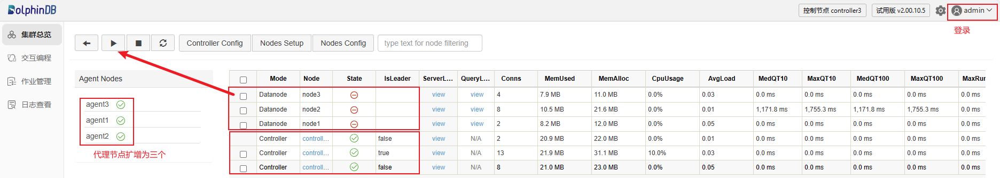

**注意**：172.0.0.1:9901 不一定是 controller 的 leader 连接信息，登录该节点会显示 leader 节点是哪一个，点击跳转即可。

**第三步**：登录任意一个 data node 查询之前的库表信息并且新建立库表，查看操作是否正常

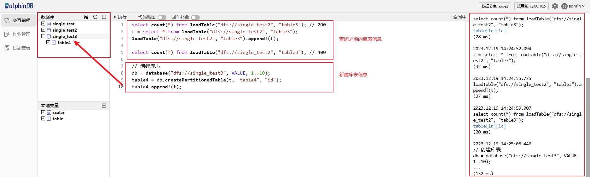

## 双服务器伪高可用集群升级为三服务器高可用集群

### 迁移架构图

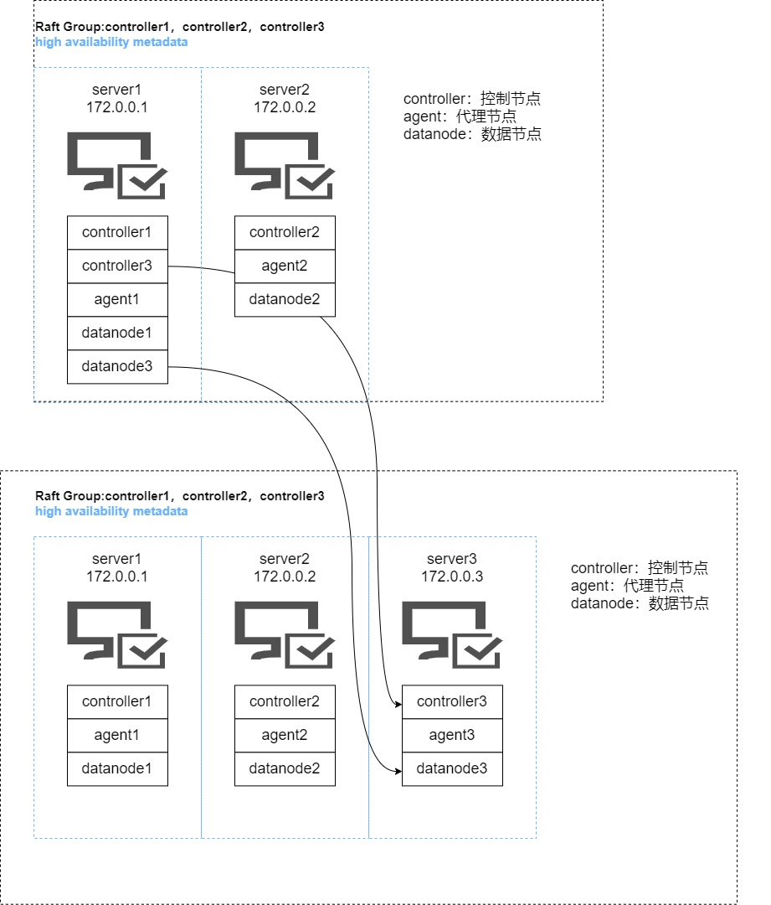

### 迁移流程

#### 配置迁移

**注意**：配置迁移主要是将服务器一（172.0.0.1）下面的 dolphindb_3 安装包下面的配置迁移到服务器三（172.0.0.3）上面。

**第一步**：在服务器一（172.0.0.1）和服务器二（172.0.0.2）上面执行如下命令关闭所有服务，然后备份现有配置文件

```
# 在服务器一上面执行如下命令
cd /home/dolphindb_1/server/clusterDemo;
sh stopAllNode.sh;
cp -r ./config ./config.bak

cd /home/dolphindb_3/server/clusterDemo;
sh stopAllNode.sh;
cp -r ./config ./config.bak

# 在服务器二上面执行如下命令
cd /home/dolphindb_2/server/clusterDemo;
sh stopAllNode.sh;
cp -r ./config ./config.bak
```

**第二步**：执行如下命令将服务器一（172.0.0.1）上面的 dolphindb_3 安装包传输到服务器三（172.0.0.3）

```
scp /home/dolphindb_3 root@172.0.0.3:/home/dolphindb_3;
```

**第三步**：在服务器一（172.0.0.1）上面的 dolphindb_1 下面的 server/clusterDemo/config 下执行如下命令来修改所有涉及 controller 集群信息的配置文件以及在 *cluster.nodes* 添加新增的一个 agent

```
// 修改 controller 集群信息
sed -i.bak -E -e 's/([0-9]+\.[0-9]+\.[0-9]+\.[0-9]+):([0-9]+):controller1/172.0.0.1:\2:controller1/' -e 's/([0-9]+\.[0-9]+\.[0-9]+\.[0-9]+):([0-9]+):controller2/172.0.0.2:\2:controller2/' -e 's/([0-9]+\.[0-9]+\.[0-9]+\.[0-9]+):([0-9]+):controller3/172.0.0.3:\2:controller3/' -e 's/([0-9]+\.[0-9]+\.[0-9]+\.[0-9]+):([0-9]+):agent1/172.0.0.1:\2:agent1/' -e 's/([0-9]+\.[0-9]+\.[0-9]+\.[0-9]+):([0-9]+):agent2/172.0.0.2:\2:agent2/' -e 's/([0-9]+\.[0-9]+\.[0-9]+\.[0-9]+):([0-9]+):agent3/172.0.0.3:\2:agent3/' -e 's/([0-9]+\.[0-9]+\.[0-9]+\.[0-9]+):([0-9]+):node1/172.0.0.1:\2:\node1/' -e 's/([0-9]+\.[0-9]+\.[0-9]+\.[0-9]+):([0-9]+):node2/172.0.0.2:\2:node2/' -e 's/([0-9]+\.[0-9]+\.[0-9]+\.[0-9]+):([0-9]+):node3/172.0.0.3:\2:node3/'  ./*

// 添加服务器三的 agent
echo '172.0.0.3:9906:agent3,agent' >> cluster.nodes
```

**第四步**：在服务器二（172.0.0.2）上面的 dolphindb_2 下面的 server/clusterDemo/config 下执行如下命令来修改所有涉及 controller 集群信息的配置文件以及在 *cluster.nodes* 添加新增的一个 agent

```
// 修改 controller 集群信息和 agent 信息
sed -i.bak -E -e 's/([0-9]+\.[0-9]+\.[0-9]+\.[0-9]+):([0-9]+):controller1/172.0.0.1:\2:controller1/' -e 's/([0-9]+\.[0-9]+\.[0-9]+\.[0-9]+):([0-9]+):controller2/172.0.0.2:\2:controller2/' -e 's/([0-9]+\.[0-9]+\.[0-9]+\.[0-9]+):([0-9]+):controller3/172.0.0.3:\2:controller3/' -e 's/([0-9]+\.[0-9]+\.[0-9]+\.[0-9]+):([0-9]+):agent1/172.0.0.1:\2:agent1/' -e 's/([0-9]+\.[0-9]+\.[0-9]+\.[0-9]+):([0-9]+):agent2/172.0.0.2:\2:agent2/' -e 's/([0-9]+\.[0-9]+\.[0-9]+\.[0-9]+):([0-9]+):agent3/172.0.0.3:\2:agent3/' -e 's/([0-9]+\.[0-9]+\.[0-9]+\.[0-9]+):([0-9]+):node1/172.0.0.1:\2:\node1/' -e 's/([0-9]+\.[0-9]+\.[0-9]+\.[0-9]+):([0-9]+):node2/172.0.0.2:\2:node2/' -e 's/([0-9]+\.[0-9]+\.[0-9]+\.[0-9]+):([0-9]+):node3/172.0.0.3:\2:node3/'  ./*

// 添加服务器三的 agent
echo '172.0.0.3:9906:agent3,agent' > cluster.nodes
```

**第五步**：在服务器三（172.0.0.3）上面的 dolphindb_3 下面的 server/clusterDemo/config 下执行如下命令来修改所有涉及 controller 集群信息的配置文件和修改服务器三的 agent 信息以及在 *cluster.nodes* 添加新增的一个 agent

```
// 修改 controller 集群信息和 agent 信息
sed -i.bak -E -e 's/([0-9]+\.[0-9]+\.[0-9]+\.[0-9]+):([0-9]+):controller1/172.0.0.1:\2:controller1/' -e 's/([0-9]+\.[0-9]+\.[0-9]+\.[0-9]+):([0-9]+):controller2/172.0.0.2:\2:controller2/' -e 's/([0-9]+\.[0-9]+\.[0-9]+\.[0-9]+):([0-9]+):controller3/172.0.0.3:\2:controller3/' -e 's/([0-9]+\.[0-9]+\.[0-9]+\.[0-9]+):([0-9]+):agent1/172.0.0.1:\2:agent1/' -e 's/([0-9]+\.[0-9]+\.[0-9]+\.[0-9]+):([0-9]+):agent2/172.0.0.2:\2:agent2/' -e 's/([0-9]+\.[0-9]+\.[0-9]+\.[0-9]+):([0-9]+):agent3/172.0.0.3:\2:agent3/' -e 's/([0-9]+\.[0-9]+\.[0-9]+\.[0-9]+):([0-9]+):node1/172.0.0.1:\2:\node1/' -e 's/([0-9]+\.[0-9]+\.[0-9]+\.[0-9]+):([0-9]+):node2/172.0.0.2:\2:node2/' -e 's/([0-9]+\.[0-9]+\.[0-9]+\.[0-9]+):([0-9]+):node3/172.0.0.3:\2:node3/'  ./*

// 添加服务器三的 agent
echo '172.0.0.3:9906:agent3,agent' > cluster.nodes
```

#### 数据迁移

**注意**：数据迁移主要是将服务器一（172.0.0.1）下面的 dolphindb_3 安装包下面的 *controller.cfg* 配置和 *cluster.cfg* 配置下面的数据路径迁移到服务器三（172.0.0.3）。

执行如下命令，将 dolphindb_3 相关的磁盘数据从服务器一（172.0.0.1）迁移到服务器三（172.0.0.3）

```
scp /ssd/ssd1/dolphindb3 root@172.0.0.3:/ssd/ssd1/dolphindb3
```

#### 启动集群

**第一步**：在每台服务器的 server/clusterDemo 下面执行如下命令启动 controller 和 agent

```
sh startController.sh
sh startAgent.sh
```

**第二步**：在浏览器输入 https://172.0.0.1:9901 进入 controller 的 web 页面，然后启动所有的 data node 即可

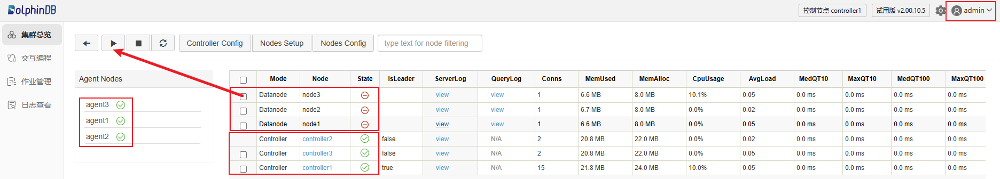

**注意**：172.0.0.1:9901 不一定是 controller 的 leader 连接信息，登录该节点会显示 leader 节点是哪一个，点击跳转即可。

**第三步**：登录任意一个 data node 查询之前的库表信息并且新建立库表，查看操作是否正常

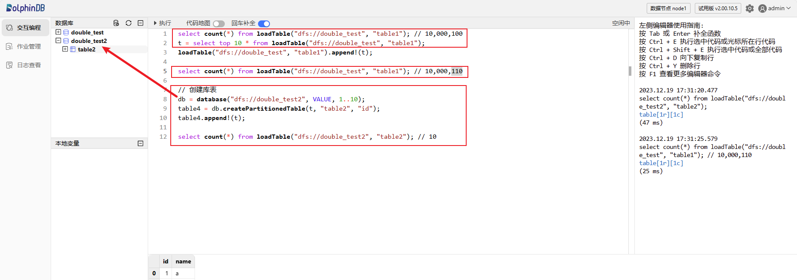

## 三服务器高可用集群升级为五服务器及以上高可用集群

### 迁移架构图


**注意**：本次升级只涉及到 controller 的升级，如果涉及 data node 和 compute node 的添加，可以参考[集群扩容](https://docs.dolphindb.cn/zh/tutorials/scale_out_cluster.html)和[数据再平衡](https://docs.dolphindb.cn/zh/tutorials/Data_Move_Rebalance.html)这两篇文章。

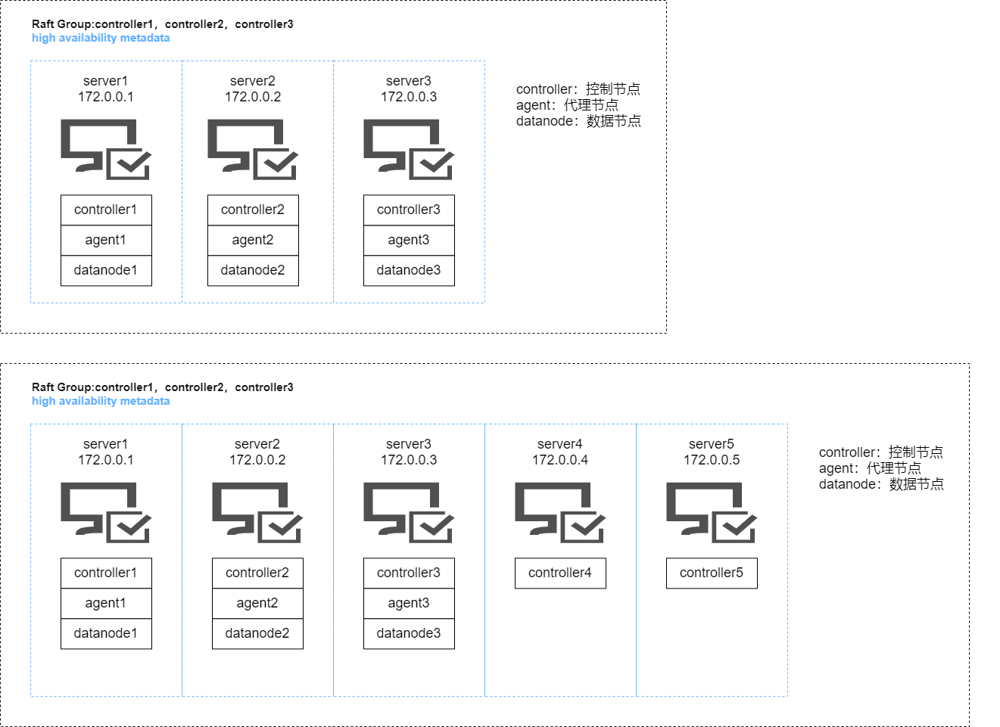

### 迁移流程

**注意**：对于本身就是高可用的集群，如要提高 controller 的宕机容忍度，就需要增加 controller 的节点。因为 dolphindb 的分布式协议采用 Raft。所以对于 controller 要求是奇数台。

**第一步**：在服务器一（172.0.0.1）、服务器二（172.0.0.2）和服务器三（172.0.0.3）上面执行如下命令关闭所有服务，然后备份现有配置文件

```
# 在服务器一上面执行如下命令
cd /home/dolphindb_1/server/clusterDemo;
sh stopAllNode.sh;
cp -r ./config ./config.bak

# 在服务器二上面执行如下命令
cd /home/dolphindb_2/server/clusterDemo;
sh stopAllNode.sh;
cp -r ./config ./config.bak

# 在服务器三上面执行如下命令
cd /home/dolphindb_3/server/clusterDemo;
sh stopAllNode.sh;
cp -r ./config ./config.bak
```

**第二步**：执行如下命令将服务器一（172.0.0.1）上面的 dolphindb_1 安装包传输到服务器四（172.0.0.4）和服务器五（172.0.0.5）上面

```
# 在服务器一上面执行如下命令
scp -r /home/dolphindb_1 root@172.0.0.4:/home/dolphindb_4
scp -r /home/dolphindb_1 root@172.0.0.5:/home/dolphindb_5
```

**第三步**：在服务器一（172.0.0.1）、服务器二（172.0.0.2）和服务器三（172.0.0.3）上面的 server/clusterDemo/config 下面执行如下命令来修改所有涉及 controller 集群信息的配置文件以及在 *cluster.nodes* 添加新增的两个 controller

```
sed -i '/^sites/s/$/,172.0.0.4:9912:controller4:controller,172.0.0.5:9913:controller5:controller/' agent.cfg

echo 172.0.0.4:9912:controller4,controller >> cluster.nodes
echo 172.0.0.5:9913:controller5,controller >> cluster.nodes
```

**注意**：主要修改 *agent.cfg* 里面 controller 集群的信息，*cluster.nodes* 里面添加 controller4 和 controller5 的节点信息。

**第四步**：在服务器四（172.0.0.4）上面的 dolphindb_4 的 server/clusterDemo/config 下面执行如下命令来修改所有涉及 controller 集群信息的配置文件以及在 *cluster.nodes* 添加新增的两个 controller

```
sed -i.bak -E -e 's/([0-9]+\.[0-9]+\.[0-9]+\.[0-9]+):([0-9]+):controller1/172.0.0.4:9912:controller4/' controller.cfg
sed -i.bak -E -e 's/([0-9]+\.[0-9]+\.[0-9]+\.[0-9]+):([0-9]+):agent1/172.0.0.4:9910:agent4/' agent.cfg
sed -i '/^sites/s/$/,172.0.0.4:9912:controller4:controller,172.0.0.5:9913:controller5:controller/' agent.cfg

echo 172.0.0.4:9912:controller4,controller >> cluster.nodes
echo 172.0.0.4:9913:controller5,controller >> cluster.nodes
```

**注意**：主要修改 *cluster.nodes* 里面添加 controller4 和 controller5 的节点信息，*controller.cfg* 里面当前节点的信息。服务器四和服务器五主要是用来扩展 controller，所以服务器四和服务器五上面的 *agent.cfg* 可以不修改。

**第五步**：在服务器五（172.0.0.5）上面的 dolphindb_5 的 server/clusterDemo/config 下面执行如下命令来修改所有涉及 controller 集群信息的配置文件以及在 *cluster.nodes* 添加新增的两个 controller

```
sed -i.bak -E -e 's/([0-9]+\.[0-9]+\.[0-9]+\.[0-9]+):([0-9]+):controller1/172.0.0.5:9913:controller5/' controller.cfg
sed -i.bak -E -e 's/([0-9]+\.[0-9]+\.[0-9]+\.[0-9]+):([0-9]+):agent1/172.0.0.5:9911:agent5/' agent.cfg
sed -i '/^sites/s/$/,172.0.0.4:9912:controller4:controller,172.0.0.5:9913:controller5:controller/' agent.cfg

echo 172.0.0.4:9912:controller4,controller >> cluster.nodes
echo 172.0.0.5:9913:controller5,controller >> cluster.nodes
```

**第六步**：在集群的每台机器的 dolphindb 安装包下面的 server/clusterDemo 下面执行如下命令启动 controller

```
sh startController.sh
```

**第七步**：在服务器一（172.0.0.1）、服务器二（172.0.0.2）和服务器三（172.0.0.3）的 dolphindb 安装包下面的 server/clusterDemo 下面执行如下命令启动 agent

```
sh startAgent.sh
```

**第八步**：在浏览器输入 https://172.0.0.1:9901 进入 controller 的 web 页面，然后启动所有的 data node 即可

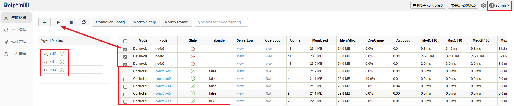

**注意**：172.0.0.1:9901 不一定是 controller 的 leader 连接信息，登录该节点会显示 leader 节点是哪一个，点击跳转即可。

**第九步**：登录 data node 查询之前建立的库表信息

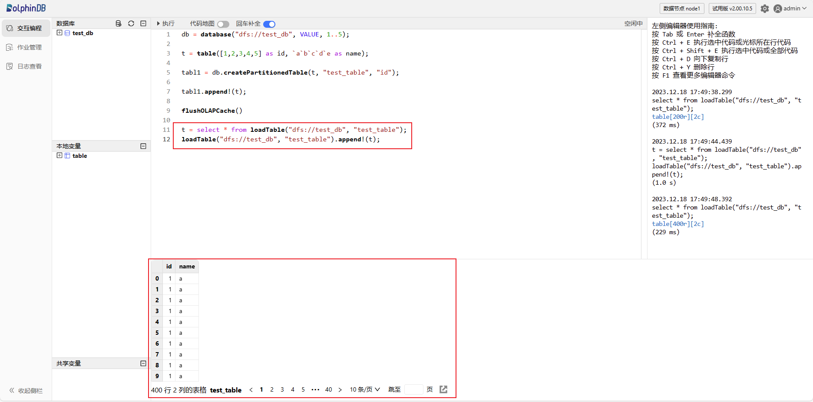

集群能够正常对外提供服务。

## 常见问题解答（FAQ）

### 什么情况下需要迁移 controller 的元数据？

升级之前的集群是 controller 伪高可用，即有两个或两个以上的 controller 运行在同一台服务器，在这种情况下升级需要迁移相关元数据信息。

### 低于三台服务器如何搭建高可用集群？

高可用集群要求 controller 是奇数，如果服务器数量低于 3 台，那么建议在单台机器运行多个 controller，使 controller 的服务数为奇数。

### 网页无法访问集群？

首先检查集群是否正常启动，在集群内部能否正常访问服务。其次检查防火墙，因为 web 客户端很可能与集群不在同一网络，检查相关端口是否开放。

### controller 和 agent 服务运行后，data node 无法启动，报出 agent 不存在的错误信息？

首先检查 *agent.cfg* 的配置文件，确保 agent 的配置没有问题。如果仍然启动不了，接下来排查 *cluster.nodes* 里面各个节点的 IP 配置是否正确。

### 迁移数据时应该注意什么？

迁移前后的路径应该保持一致，即从根路径到文件的绝对路径保持一致。

### 如何部署 DolphinDB，避免频繁迁移？

- **详细的规划和设计**： 在部署 DolphinDB 之前，确保对系统的需求和使用场景进行详细规划和设计。理解数据量、并发访问、性能需求等方面的特点，以便选择合适的部署和配置选项。
- **监控和警报系统**： 部署监控和警报系统，对关键指标进行实时监控，以及时发现并解决潜在的问题。监控系统可以帮助你在问题发生之前采取预防措施。
- **合理的容量规划**： 根据数据增长和用户需求进行合理的容量规划。确保系统在未来有足够的扩展能力，避免因为容量不足而导致的迁移。

## 附件

[DolphinDB如何将高可用服务切换到高可用服务相关配置文件.zip](./script/service_deployment_and_migration.zip)