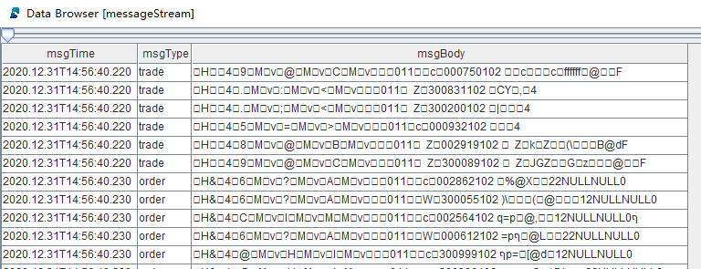
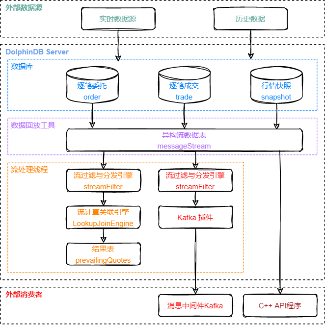
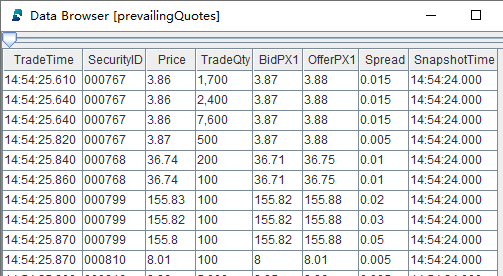
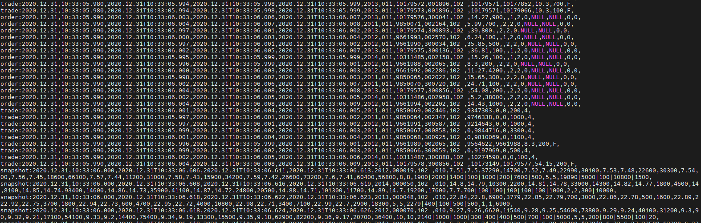

# DolphinDB 历史数据回放功能应用：股票行情回放

一个量化策略在生产（交易）环境中运行时，实时数据的处理通常是由事件驱动的。为确保研发和生产使用同一套代码，通常在研发阶段需将历史数据，严格按照事件发生的时间顺序进行回放，以此模拟交易环境。一个交易所的行情数据通常包括逐笔委托、逐笔成交、快照等多种类型的数据。DolphinDB 提供了严格按照时间顺序将多个不同数据源同时进行回放的功能。

本教程以股票行情回放为例提供一种多表回放方案。首先在第 1、2 章简要介绍 DolphinDB 数据回放功能和原理，之后在第 3 章给出完整的股票行情回放应用方案和代码实现。

- [1. 单表回放](#1-单表回放)
- [2. 多表回放](#2-多表回放)
- [3. 多表回放应用：股票行情回放](#3-多表回放应用股票行情回放)
- [4. 性能测试](#4-性能测试)
- [5. 开发环境配置](#5-开发环境配置)
- [6. 总结](#6-总结)

## 1. 单表回放

DolphinDB 历史数据回放功能通过 replay 函数实现。replay 函数的作用是将内存表或数据库表中的记录以一定的速率写入到目标表中，以模拟实时注入的数据流。根据输入表的数量，回放分为单表回放和多表回放，其中单表回放是最基础的回放模式，即将一个输入表回放至一个相同表结构的目标表中，以下是不包括建表语句的单表回放示例：

```python
tradeDS = replayDS(sqlObj=<select * from loadTable("dfs://trade", "trade") where Date = 2020.12.31>, dateColumn=`Date, timeColumn=`Time)
replay(inputTables=tradeDS, outputTables=tradeStream, dateColumn=`Date, timeColumn=`Time, replayRate=10000, absoluteRate=true)
```

以上脚本将数据库 "dfs://trade" 中的 "trade" 表中 2020 年 12 月 31 日的数据以每秒 1 万条的速度注入目标表 tradeStream 中。更多关于 replay、replayDS 函数的介绍可以参考 [DolphinDB 历史数据回放教程](https://gitee.com/dolphindb/Tutorials_CN/blob/master/historical_data_replay.md)、[replay用户手册](https://www.dolphindb.cn/cn/help/200/FunctionsandCommands/FunctionReferences/r/replay.html?highlight=replay)、[replayDS用户手册](https://www.dolphindb.cn/cn/help/200/FunctionsandCommands/FunctionReferences/r/replayDS.html?highlight=replayds)。

但是，单表回放并不能满足所有的回放要求。因为在实践中，一个领域问题往往需要多个不同类型的消息协作，例如金融领域的行情数据包括逐笔委托、逐笔成交、快照等，为了更好地模拟实际交易中的实时数据流，通常需要将以上三类数据同时进行回放，这时便提出了多表回放的需求。

## 2. 多表回放

DolphinDB不断优化拓展多表回放的功能，既支持N个输入表一对一回放至N个输出表的N对N回放，又在1.30.17/2.00.5及之后的版本中支持了N个不同结构的输入表同时回放至同一个输出表的N对一异构回放，异构回放能够保证多个数据源的严格时序回放和消费。本小节将对多表回放面临的难点、相应的 DolphinDB 技术解决方案和原理展开介绍。

### 2.1 N 对 N回放

类似单表回放的原理，replay 函数提供了N 对 N模式的多表回放，即将多个输入表回放至多个目标表，输入表与目标表一一对应。以下是N 对 N模式的多表回放的示例：

```python
orderDS = replayDS(sqlObj=<select * from loadTable("dfs://order", "order") where Date = 2020.12.31>, dateColumn=`Date, timeColumn=`Time)
tradeDS = replayDS(sqlObj=<select * from loadTable("dfs://trade", "trade") where Date = 2020.12.31>, dateColumn=`Date, timeColumn=`Time)
snapshotDS = replayDS(sqlObj=<select * from loadTable("dfs://snapshot", "snapshot") where Date =2020.12.31>, dateColumn=`Date, timeColumn=`Time)
replay(inputTables=[orderDS, tradeDS, snapshotDS], outputTables=[orderStream, tradeStream, snapshotStream], dateColumn=`Date, timeColumn=`Time, replayRate=10000, absoluteRate=true)
```

以上脚本将三个数据库表中的历史数据分别注入三个目标表中。在N 对 N的模式中，不同表的在同一秒内的两条数据写入目标表的顺序可能和数据中的时间字段的先后关系不一致。此外，下游如果由三个处理线程分别对三个目标表进行订阅与消费，也很难保证表与表之间的数据被处理的顺序关系。因此，N 对 N回放不能保证整体上最严格的时序。

在实践中，一个领域中不同类型的消息是有先后顺序的，比如股票的逐笔成交和逐笔委托，所以在对多个数据源回放时要求每条数据都严格按照时间顺序注入目标表，为此我们需要解决以下问题：

- 不同结构的数据如何统一进行排序和注入以保证整体的顺序？
- 如何保证对多表回放结果的实时消费也是严格按照时序进行的？

### 2.2 N 对一异构回放

面对上述多表回放的难点，DolphinDB 进一步增加了异构模式的多表回放，支持将多个不同表结构的数据表写入到同一张异构流数据表中，从而实现了严格按时间顺序的多表回放。以下是异构模式的多表回放示例：

```python
orderDS = replayDS(sqlObj=<select * from loadTable("dfs://order", "order") where Date = 2020.12.31>, dateColumn=`Date, timeColumn=`Time)
tradeDS = replayDS(sqlObj=<select * from loadTable("dfs://trade", "trade") where Date = 2020.12.31>, dateColumn=`Date, timeColumn=`Time)
snapshotDS = replayDS(sqlObj=<select * from loadTable("dfs://snapshot", "snapshot") where Date =2020.12.31>, dateColumn=`Date, timeColumn=`Time)
inputDict = dict(["order", "trade", "snapshot"], [orderDS, tradeDS, snapshotDS])
replay(inputTables=inputDict, outputTables=messageStream, dateColumn=`Date, timeColumn=`Time, replayRate=10000, absoluteRate=true)
```

异构回放时将 replay 函数的 inputTables 参数指定为字典，outputTables 参数指定为异构流数据表。inputTables 参数指定多个结构不同的数据源，字典的 key 是用户自定义的字符串，是数据源的唯一标识，将会对应 outputTables 参数指定的表的第二列，字典的 value 是通过 replayDS 定义的数据源或者表。

以上脚本中的输出表 messageStream 为异构流数据表，其表结构如下：

| name    | typeString | comment                                  |
| ------- | ---------- | ---------------------------------------- |
| msgTime | TIMESTAMP  | 消息时间                                 |
| msgType | SYMBOL     | 数据源标识："order"、"trade"、"snapshot" |
| msgBody | BLOB       | 消息内容，以二进制格式存储               |

异构回放时 outputTables 参数指定的表至少需要包含以上三列，此外，还可以指定各输入表的公共列（列名和类型一致的列）。回放完成后，表 messageStream 的数据预览如下：



表中每行记录对应输入表中的一行记录，msgTime 字段是输入表中的时间列，msgType 字段用来区分来自哪张输入表，msgBody 字段以二进制格式存储了输入表中的记录内容。在回放的过程中，通过异构流数据表这样的数据结构可以对多个数据源进行全局排序，因而保证了多个数据源之间的严格时间顺序。同时，异构流数据表和普通流数据表一样可以被订阅，即多种类型的数据存储在同一张表中被发布并被同一个线程实时处理，因而也保证了消费的严格时序性。

若要对异构流数据表进行数据处理操作，如指标计算等，则需要将二进制格式的消息内容反序列化为原始结构的一行记录。DolphinDB 在脚本语言以及在 API 中均支持了对异构流数据表的解析功能。脚本支持流数据分发引擎 streamFilter 对异构流数据表进行反序列化以及反序列后结果的数据处理；同时，各类 API 在支持流数据订阅功能的基础上，扩展支持了在订阅时对异构流数据表进行反序列化。

## 3. 多表回放应用：股票行情回放

基于上文提到的异构回放、异构流数据表解析以及 DolphinDB 流处理框架中的其他特性等，本章将结合股票行情回放展示 DolphinDB 异构模式的多表回放功能在实际场景中的应用，包括数据回放以及三种具体的回放结果消费方案：使用内置流计算引擎实时处理数据、实时推送外部消息中间件、外部程序订阅与实时消费。

### 3.1 行情回放与消费方案

行情多表回放方案的数据处理流程图如下：



处理流程图说明：

回放与消费流程围绕异构流数据表 messageStream 展开。

图中异构流数据表模块以上，为异构模式的多表回放的示意图，由数据回放工具即 replay 和 replayDS 函数，将存储在多个数据库中的原始数据回放至异构流数据表中。

图中异构流数据表模块以下，分为三条支路，分别对应对回放结果的三种不同的处理方式，从左至右依次是：

- 在 DolphinDB 的订阅中，通过内置的流计算引擎实时计算指标，本文将使用 asof join 引擎实时关联逐笔成交与快照数据，计算个股交易成本并写入结果流数据表；
- 在 DolphinDB 的订阅中，通过 Kafka 插件将回放结果实时写入外部的消息中间件 Kafka；
- 在外部程序中，通过 DolphinDB 的流数据 API 来实时订阅和消费回放结果，本文将使用 C++API。

### 3.2 测试数据集

本教程基于上交所某日的股票行情数据进行回放，包括逐笔委托、逐笔成交、Level2 快照三种行情数据，分别存放在分布式数据库 "dfs://order"、"dfs://trade"、"dfs://snapshot" 中，均使用 TSDB 存储引擎，数据概览如下：

| 数据集         | 字段数 | 总行数   | 数据大小 | 简称     | 分区机制                         | 排序列         |
| -------------- | ------ | -------- | -------- | -------- | -------------------------------- | -------------- |
| 逐笔委托       | 20     | 49018552 | 6.8G     | order    | VALUE: 交易日, HASH: [SYMBOL, 20] | 股票, 交易时间 |
| 逐笔成交       | 15     | 43652718 | 3.3G     | trade    | VALUE: 交易日, HASH: [SYMBOL, 20] | 股票, 交易时间 |
| Level2 行情快照 | 55     | 8410359  | 4.1G     | snapshot | VALUE: 交易日, HASH: [SYMBOL, 20] | 股票, 交易时间 |

后文也将提供部分原始数据的 csv 文件以及对应的数据导入脚本，以便快速体验回放功能。

### 3.3 代码实现

本教程脚本开发工具采用 DolphinDB GUI，相关环境配置见后文[5. 开发环境配置](#5-开发环境配置)。

#### 3.3.1 股票行情回放

本小节脚本将三个数据库中的不同结构的数据回放至同一个异构流数据表中。完整脚本见附录 [01. 股票行情回放. txt](script/stock_market_replay/01.stockMarketReplay.txt)。

- 创建异构流数据表 messageStream

```python
colName = `msgTime`msgType`msgBody
colType = [TIMESTAMP,SYMBOL, BLOB]
messageTemp = streamTable(1000000:0, colName, colType)
enableTableShareAndPersistence(table=messageTemp, tableName="messageStream", asynWrite=true, compress=true, cacheSize=1000000, retentionMinutes=1440, flushMode=0, preCache=10000)
messageTemp = NULL
```

messageStream 是共享的异步持久化异构流数据表。为了之后能够对该表进行订阅，必须将其定义为共享的流数据表，共享意味着在当前节点的所有会话中可见。同时此处对流数据表进行持久化，其主要目的是控制该表的最大内存占用，enableTableShareAndPersistence 函数中的 cacheSize 参数规定了该表在内存中最多保留 100 万行。流数据持久化也保障了流数据的备份和恢复，当节点异常关闭后，持久化的数据会在重启时自动载入流数据表以继续流数据消费。

- 三个数据源异构回放至流数据表 messageStream

```python
timeRS = cutPoints(09:15:00.000..15:00:00.000, 100)
orderDS = replayDS(sqlObj=<select * from loadTable("dfs://order", "order") where Date = 2020.12.31>, dateColumn=`Date, timeColumn=`Time, timeRepartitionSchema=timeRS)
tradeDS = replayDS(sqlObj=<select * from loadTable("dfs://trade", "trade") where Date = 2020.12.31>, dateColumn=`Date, timeColumn=`Time, timeRepartitionSchema=timeRS)
snapshotDS = replayDS(sqlObj=<select * from loadTable("dfs://snapshot", "snapshot") where Date =2020.12.31>, dateColumn=`Date, timeColumn=`Time, timeRepartitionSchema=timeRS)
inputDict = dict(["order", "trade", "snapshot"], [orderDS, tradeDS, snapshotDS])

submitJob("replay", "replay stock market", replay, inputDict, messageStream, `Date, `Time, , , 3)
```

上述脚本读取三个数据库中的结构不同的数据表进行全速的异构回放，回放通过 submitJob 函数提交后台作业来执行。下面讲解对于回放进行调优的相关参数和原理：

replayDS 函数中的 timeRepartitionSchema 参数：replayDS 函数将输入的 SQL 查询转化为数据源，其会根据输入表的分区以及 timeRepartitionSchema 参数，将原始的 SQL 查询按照时间顺序拆分成若干小的 SQL 查询。

replay 函数中的 parallelLevel 参数：parallelLevel 表示从数据库加载数据到内存的工作线程数量，即同时查询经过划分之后的小数据源的并行度，默认为 1，上述脚本中通过 submitjob 的参数设置为 3。

对数据库表的回放过程分为两步，其一是通过 SQL 查询历史数据至内存，查询包括对数据的排序，其二是将内存中的数据写入输出表，两步以流水线的方式执行。若将某日数据全部导入内存并排序，会占用大量内存甚至导致内存不足，同时由于全部数据的查询耗时比较长，会导致第二步写入输出表的时刻也相应推迟。以 orderDS 为例，若不设置 timeRepartitionSchema 参数，则相应的 SQL 查询为：

```python
select * from loadTable("dfs://order", "order") where Date = 2020.12.31 order by Time
```

因此针对大数据量的场景，本教程先对 replayDS 函数指定 timeRepartitionSchema 参数，将数据按照时间戳分为 100 个小数据源，则每次查询的最小单位为其中一个小数据源，同时提高 parallelLevel 参数来帮助提升查询速度。以 orderDS 为例，若设置上述 timeRepartitionSchema 参数，则相应的其中一个 SQL 查询为：

```python
select * from loadTable("dfs://order", "order") where Date = 2020.12.31, 09:15:00.000 <= Time < 09:18:27.001 order by Time
```

后文的 [4. 性能测试](#4-性能测试) 章节利用本节的脚本进行了性能测试，最终总耗时 4m18s，内存占用峰值 4.7GB。内存主要由回放过程中的 SQL 查询和输出表等占用，通过对数据源进行切割以及对输出表进行持久化能有效控制内存使用。

作业运维：在 submitJob 函数提交后，通过 getRecentJobs 函数可以查看后台作业的状态，如果 endTime 和 errorMsg 为空，说明任务正在正常运行中。也可以用 cancelJob 函数取消回放，其输入参数 jobId 通过 getRecentJobs 获取。

若没有可作为数据源的数据库，也可以通过加载 csv 文件至内存中进行回放来快速体验本教程，附录中的数据文件提供了 100 支股票的某日完整行情数据，全部数据在内存中约占 700M。以下脚本需要修改 loadText 的路径为实际的 csv 文本数据存储路径。

```python
orderDS = select * from loadText("/yourDataPath/replayData/order.csv") order by Time
tradeDS = select * from loadText("/yourDataPath/replayData/trade.csv") order by Time
snapshotDS = select * from loadText("/yourDataPath/replayData/snapshot.csv") order by Time
inputDict = dict(["order", "trade", "snapshot"], [orderDS, tradeDS, snapshotDS])

submitJob("replay", "replay text", replay, inputDict, messageStream, `Date, `Time, , , 1)
```

#### 3.3.2 消费场景 1：在 DolphinDB 订阅中实时计算个股交易成本

本小节脚本将实时消费 3.3.1 小节创建的流数据表 messageStream，使用 asof join 引擎实时关联逐笔成交与快照数据，并计算个股交易成本，完整脚本见附录 [02. 消费场景 1: 计算个股交易成本_asofJoin 实现. txt](script/stock_market_replay/02.calTradeCost_asofJoin.txt)。

- 创建计算结果输出表 prevailingQuotes

```python
colName = `TradeTime`SecurityID`Price`TradeQty`BidPX1`OfferPX1`Spread`SnapshotTime
colType = [TIME, SYMBOL, DOUBLE, INT, DOUBLE, DOUBLE, DOUBLE, TIME]
prevailingQuotesTemp = streamTable(1000000:0, colName, colType)
enableTableShareAndPersistence(table=prevailingQuotesTemp, tableName="prevailingQuotes", asynWrite=true, compress=true, cacheSize=1000000, retentionMinutes=1440, flushMode=0, preCache=10000)
prevailingQuotesTemp = NULL
```

prevailingQuotes 被定义为共享流数据表，之后可以对其进行订阅和进一步的处理。

- 创建流计算 asof join 引擎

```python
def createSchemaTable(dbName, tableName){
	schema = loadTable(dbName, tableName).schema().colDefs
	return table(1:0, schema.name, schema.typeString)
}
tradeSchema = createSchemaTable("dfs://trade", "trade")
snapshotSchema = createSchemaTable("dfs://snapshot", "snapshot")

joinEngine=createAsofJoinEngine(name="tradeJoinSnapshot", leftTable=tradeSchema, rightTable=snapshotSchema, outputTable=prevailingQuotes, metrics=<[Price, TradeQty, BidPX1, OfferPX1, abs(Price-(BidPX1+OfferPX1)/2), snapshotSchema.Time]>, matchingColumn=`SecurityID, timeColumn=`Time, useSystemTime=false, delayedTime=1)
```

使用 asof join 引擎实现在对股票分组的基础上，对于每条输入的 trade 记录，实时关联与之在时间列上最接近的一条 snapshot 记录，并使用 trade 中的价格字段和 snapshot 中的报价字段进行指标计算。最终，以上配置的 asof join 引擎会输出和左表行数相同的结果。asof join 引擎更多介绍请参考 [createAsofJoinEngine 用户手册](https://www.dolphindb.cn/cn/help/200/FunctionsandCommands/FunctionReferences/c/createAsofJoinEngine.html?highlight=asofjoin)。

考虑到实际的业务含义，此例中 asof join 引擎在用于两个数据流的实时关联时，配置参数 useSystemTime=false 以按照数据中的时间列进行关联计算。使用数据中的时间列，相较于使用数据注入引擎时的系统时间作为时间列，可以避免在实时场景中两个数据流到达引擎的时刻乱序而带来的问题。但是，在此处，因为异构回放能够严格保证两个数据流的处理顺序，因此也可以使用数据注入引擎的系统时间进行关联计算。除了在使用 asof join 引擎时配置参数 useSystemTime=true 外，使用 look up join 引擎也能够实现按系统时间进行实时关联，即当每一条 trade 表中的记录注入引擎时，总是立刻去关联已经注入引擎的最新的一条相应股票的 snapshot 记录，得到的计算结果会同上文中的 asof join 引擎实现完全一致，而由于 look up join 引擎在内部实现上更简单，所以在计算性能上会有稍好的表现，完成脚本见附录 [03. 消费场景 1: 计算个股交易成本_lookUpJoin 实现. txt](script/stock_market_replay/03.calTradeCost_lookUpJoin.txt)。look up join 引擎更多介绍请参考 [createLookUpJoinEngine 用户手册](https://www.dolphindb.cn/cn/help/200/FunctionsandCommands/FunctionReferences/c/createLookupJoinEngine.html)。

自定义函数 createSchemaTable，用于获取数据库表的表结构，以做为创建引擎时的参数传入。

- 创建流计算过滤与分发引擎

```python
def appendLeftStream(msg){
	tempMsg = select * from msg where Price > 0 and Time>=09:30:00.000
	getLeftStream(getStreamEngine(`tradeJoinSnapshot)).tableInsert(tempMsg)
}
filter1 = dict(STRING,ANY)
filter1["condition"] = "trade"
filter1["handler"] = appendLeftStream
filter2 = dict(STRING,ANY)
filter2["condition"] = "snapshot"
filter2["handler"] = getRightStream(getStreamEngine(`tradeJoinSnapshot))
schema = dict(["trade", "snapshot"], [tradeSchema, snapshotSchema])
engine = streamFilter(name="streamFilter", dummyTable=messageStream, filter=[filter1, filter2], msgSchema=schema)
```

streamFilter 函数通过设置 msgSchema 参数，会对异构流数据表进行反序列，并根据 filter 参数中设置的 handler 来处理订阅的数据。当订阅数据到来时，handler 之间是串行执行的，这样就保证了对数据的处理严格按照时序进行。

handler 参数是一元函数或数据表，用于处理订阅的数据。当它是函数时，其唯一的参数是经过解析和过滤后的数据表。这里对于 trade 数据其 handler 设置为函数 appendLeftStream，该函数对订阅到的数据首先做过滤，再将符合条件的数据作为左表写入到 asof join 引擎。对于 snapshot 数据其 handler 设置为 asof join 引擎的右表，表示对于订阅到的 snapshot 数据直接作为右表写入 asof join 引擎。

- 订阅异构流数据表

```python
subscribeTable(tableName="messageStream", actionName="tradeJoinSnapshot", offset=-1, handler=engine, msgAsTable=true, reconnect=true)
```

设置参数 offset 为 -1，订阅将会从提交订阅时流数据表的当前行开始。为了消费到完整的数据，建议先执行此处脚本以提交订阅，再提交后台回放作业，参考 3.3.1 小节。

- 查看计算结果



asof join 引擎在 matchingColumn 的分组内输出表数据与输入时的顺序一致。

#### 3.3.3 消费场景 2：在 DolphinDB 订阅中将回放结果实时推送 Kafka

本小节脚本将 3.3.1 小节创建的流数据表 messageStream 实时发送至消息中间件 Kafka。执行以下脚本，需要有可以写入的 Kafka server，并且安装 DolphinDB Kafka 插件，插件配置见后文[5. 开发环境配置](#5-开发环境配置)。完整脚本见附录 [04. 消费场景 2: 实时推送 Kafka.txt](script/stock_market_replay/04.publishToKafka.txt)。

- 加载 Kafka 插件并创建 Kafka producer

```python
loadPlugin("/DolphinDB/server/plugins/kafka/PluginKafka.txt")
go
producerCfg = dict(STRING, ANY)
producerCfg["metadata.broker.list"] = "localhost"
producer = kafka::producer(producerCfg)
```

loadPlugin 的路径和 producer 配置请按需修改。本教程涉及的 Kafka server 和 DolphinDB server 在同一台服务器上，故 metadata.broker.list 参数为 localhost。

- 定义推送数据至 Kafka topic 的函数

```python
def sendMsgToKafkaFunc(dataType, producer, msg){
	startTime = now()
	try {
		kafka::produce(producer, "topic-message", 1, msg, true)
		cost = now() - startTime
		writeLog("[Kafka Plugin] Successed to send" + dataType + ":" + msg.size() + "rows," + cost + "ms.")
	}
	catch(ex) {writeLog("[Kafka Plugin] Failed to send msg to kafka with error:" +ex)}
}
```

kafka::produce 函数会将任意表结构的 msg 以 json 格式发送至指定的 Kafka topic。此处的 writeLog 函数在日志中打印每批推送的情况来方便运维观察。

- 注册流数据过滤与分发引擎

```python
filter1 = dict(STRING,ANY)
filter1["condition"] =  "order"
filter1["handler"] = sendMsgToKafkaFunc{"order", producer}
filter2 = dict(STRING,ANY)
filter2["condition"] = "trade"
filter2["handler"] = sendMsgToKafkaFunc{"trade", producer}
filter3 = dict(STRING,ANY)
filter3["condition"] = "snapshot"
filter3["handler"] = sendMsgToKafkaFunc{"snapshot", producer}

schema = dict(["order","trade", "snapshot"], [loadTable("dfs://order", "order"), loadTable("dfs://trade", "trade"), loadTable("dfs://snapshot", "snapshot")])

engine = streamFilter(name="streamFilter", dummyTable=messageStream, filter=[filter1, filter2, filter3], msgSchema=schema)
```

streamFilter 函数通过设置 msgSchema 参数，会对异构流数据表进行反序列，并根据 filter 参数中设置的 handler 来处理订阅的数据。当订阅数据到来时，handler 之间是串行执行的，这样就保证了对数据的处理严格按照时序进行。

handler 参数是一元函数或数据表，用于处理订阅的数据。当它是函数时，其唯一的参数是经过解析和过滤后的数据表。sendMsgToKafka{"order", producer} 的写法是函数化编程中的部分应用，即指定函数 sendMsgToKafka 的部分参数，产生一个参数较少的新函数。

- 订阅异构流数据表

```python
subscribeTable(tableName="messageStream", actionName="sendMsgToKafka", offset=-1, handler=engine, msgAsTable=true, reconnect=true)
```

设置参数 offset 为 -1，订阅将会从提交订阅时流数据表的当前行开始。为了消费到完整的数据，建议先执行此处脚本以提交订阅，再提交后台回放作业，参考 3.3.1 小节。

- 在终端查看发送结果

在命令行开启消费者进程，从第一条开始消费名为 topic-message 的 topic


```
./bin/kafka-console-consumer.sh --bootstrap-server localhost:9092 --from-beginning --topic topic-message
```

返回：


#### 3.3.4 消费场景 3：在外部程序中通过 C++API 实时订阅与处理

本小节代码为 C++ 程序，程序会订阅 3.3.1 小节创建的异构流数据表 messageStream，并实时打印每条数据。以下代码依赖DolphinDB C++ API，API安装见后文[5. 开发环境配置](#5-开发环境配置)。完整代码见附录 [05. 消费场景 3:C++API 实时订阅. cpp](script/stock_market_replay/05.subscribe.cpp)。

```c++
int main(int argc, char *argv[]){
    DBConnection conn;
    string hostName = "127.0.0.1";
    int port = 8848;
    bool ret = conn.connect(hostName, port);

    conn.run("login(\"admin\", \"123456\")");
    DictionarySP t1schema = conn.run("loadTable(\"dfs://snapshotL2\", \"snapshotL2\").schema()");
    DictionarySP t2schema = conn.run("loadTable(\"dfs://trade\", \"trade\").schema()");
    DictionarySP t3schema = conn.run("loadTable(\"dfs://order\", \"order\").schema()");

    unordered_map<string, DictionarySP> sym2schema;
    sym2schema["snapshot"] = t1schema;
    sym2schema["trade"] = t2schema;
    sym2schema["order"] = t3schema;
    StreamDeserializerSP sdsp = new StreamDeserializer(sym2schema);
    auto myHandler = [&](Message msg) {
            const string &symbol = msg.getSymbol();
            cout << symbol << ":";
            size_t len = msg->size();
            for (int i = 0; i < len; i++) {
                    cout <<msg->get(i)->getString() << ",";
            }
            cout << endl;
    };

    int listenport = 10260;
    ThreadedClient threadedClient(listenport);
    auto thread = threadedClient.subscribe(hostName, port, myHandler, "messageStream", "printMessageStream", -1, true, nullptr, false, false, sdsp);
    cout<<"Successed to subscribe messageStream"<<endl;
    thread->join();

    return 0;
}
```

调用订阅函数 ThreadedClient::subscribe 订阅异构流数据表时，在最后一个参数指定相应的流数据反序列化实例 StreamDeserializerSP，则在订阅时会对收到的数据进行反序列化再传递给用户自定义的回调函数 myHandler。

listenport 参数为单线程客户端的订阅端口号，设置 C++ 程序所在服务器的任意空闲端口即可。

- 在终端查看程序实时打印的内容：



#### 3.3.4 清理环境

如果反复执行上述脚本，可能需要清理流数据表、取消订阅、注销流计算引擎等操作，建议在运行回放与消费脚本前先清理环境。本教程的清理环境脚本见附录 [06. 清理环境. txt](script/stock_market_replay/06.cleanEnvironment.txt)。

## 4. 性能测试

本教程对异构模式下的多表回放功能进行了性能测试。以 3.2 小节的测试数据集作为回放的输入，以 3.3.1 小节的回放脚本作为测试脚本，该脚本不设定回放速率（即以最快的速率回放），并且输出表没有任何订阅，最终回放了 101,081,629 条数据至输出表中，总耗时 4m18s，每秒回放约 39 万条数据，内存占用峰值 4.7GB。测试使用的服务器的 CPU 为 Intel(R) Xeon(R) Silver 4216 CPU @ 2.10GHz，更详细的服务器及DolphinDB server配置信息见后文[5. 开发环境配置](#5-开发环境配置)。

## 5. 开发环境配置

**服务器环境**

- CPU 类型：Intel(R) Xeon(R) Silver 4216 CPU @ 2.10GHz
- 逻辑 CPU 总数：8
- 内存：64GB
- OS：64 位 CentOS Linux 7 (Core)

**DolphinDB server 部署**

- server 版本：2.00.6
- server 部署模式：单节点
- 配置文件：dolphindb.cfg

```
localSite=localhost:8848:local8848
mode=single
maxMemSize=32
maxConnections=512
workerNum=8
maxConnectionPerSite=15
newValuePartitionPolicy=add
webWorkerNum=2
dataSync=1
persistenceDir=/DolphinDB/server/persistenceDir
maxPubConnections=64
subExecutors=16
subPort=8849
subThrottle=1
persistenceWorkerNum=1
lanCluster=0
```

> 配置参数 persistenceDir 需要开发人员根据实际环境配置。

单节点部署教程：[单节点部署](https://gitee.com/dolphindb/Tutorials_CN/blob/master/standalone_server.md)

**DolphinDB client 开发环境**

- CPU 类型：Intel(R) Core(TM) i7-7700 CPU @ 3.60GHz   3.60 GHz
- 逻辑 CPU 总数：8
- 内存：32GB
- OS：Windows 10 专业版
- DolphinDB GUI 版本：1.30.15

DolphinDB GUI 安装教程：[GUI 教程](https://www.dolphindb.cn/cn/gui/index.html)

**DolphinDB Kafka 插件安装**

- Kafka 插件版本：release200

> Kafka 插件版本建议按 DolphinDB server 版本选择，如 2.00.6 版本的 server 安装 release200 分支的插件

Kafka 插件教程：[Kafka 插件教程](https://gitee.com/dolphindb/DolphinDBPlugin/blob/release200/kafka/README_CN.md)

**Kafka server 部署**

- zookeeper 版本：3.4.6
- Kafka 版本：2.12-2.6.2
- Kafka 部署模式：单节点
- 创建 Kafka topic

```
./bin/kafka-topics.sh --create --zookeeper localhost:2181 --replication-factor 1 --partitions 4 --topic topic-message
```

**DolphinDB C++ API 安装**

- C++ API 版本：release200

> C++API 版本建议按 DolphinDB server 版本选择，如 2.00.6 版本的 server 安装 release200 分支的 API

C++ API 教程：[C++ API 教程](https://gitee.com/dolphindb/api-cplusplus)

## 6. 总结

本教程基于数据回放工具、流数据处理、异构流数据表等 DolphinDB 特性，提供了多表股票行情数据回放以及回放结果落地方案，意在使开发人员可以在此基础上快速搭建自己的行情回放系统。

## 附录

- [股票行情回放.txt](script/stock_market_replay/01.stockMarketReplay.txt)
- [消费场景1：计算个股交易成本 _asofJoin 实现.txt](script/stock_market_replay/02.calTradeCost_asofJoin.txt)
- [消费场景1：计算个股交易成本 _lookUpJoin 实现.txt](script/stock_market_replay/03.calTradeCost_lookUpJoin.txt)
- [消费场景2：实时推送 Kafka.txt](script/stock_market_replay/04.publishToKafka.txt)
- [消费场景3：C++API 实时订阅.cpp](script/stock_market_replay/05.subscribe.cpp)
- [清理环境.txt](script/stock_market_replay/06.cleanEnvironment.txt)
- [样例数据：order.csv, trade.csv与snapshot.csv](https://www.dolphindb.cn/downloads/docs/stock_market_replay.zip)
