# DolphinDB 流数据连接引擎应用：多数据源流式实时关联处理

在进行数据分析时经常需要对多个不同的数据源进行关联操作，因此在各类数据库的 SQL 语言中均包含了丰富的 join 语句，以支持批计算中的多种关联操作。 DolphinDB 不仅通过 join 语法支持了对于全量历史数据的关联处理，而且在要求低延时的实时计算场景中，也提供了多种流数据连接引擎来支持对不断增长的数据流进行实时的关联处理。流数据连接引擎在内部实现上以增量计算为原则，在大数据流量下依然能够保持毫秒级的时延性能。

本教程将系统地介绍 DolphinDB 中的 5 种不同的流数据连接引擎，从实时数据流关联、DolphinDB 连接引擎分类、用连接引擎实现金融应用场景等方面层层递进，帮助用户深入理解 DolphinDB 的流计算连接引擎和快速上手多数据源实时关联处理。

DolphinDB 2.00.8 及以上版本支持本篇所有代码。此外，1.30.20 及以上版本支持除 3.2 小节外的所有代码，细节会在该小节内详细说明。

- [DolphinDB 流数据连接引擎应用：多数据源流式实时关联处理](#dolphindb-流数据连接引擎应用多数据源流式实时关联处理)
- [1. 流数据实时关联](#1-流数据实时关联)
  - [1.1 DolphinDB 批计算表关联](#11-dolphindb-批计算表关联)
  - [1.2 实时数据流关联面临的挑战](#12-实时数据流关联面临的挑战)
- [2. 流数据连接引擎](#2-流数据连接引擎)
  - [2.1 Asof Join 引擎（createAsofJoinEngine）](#21-asof-join-引擎createasofjoinengine)
  - [2.2 Window Join 引擎（createWindowJoinEngine）](#22-window-join-引擎createwindowjoinengine)
  - [2.3 Equi Join 引擎（createEquiJoinEngine）](#23-equi-join-引擎createequijoinengine)
  - [2.4 Lookup Join 引擎（createLookupJoinEngine）](#24-lookup-join-引擎createlookupjoinengine)
  - [2.5 Left Semi Join 引擎（createLeftSemiJoinEngine）](#25-left-semi-join-引擎createleftsemijoinengine)
- [3. 实时关联应用案例](#3-实时关联应用案例)
  - [3.1 用 Asof Join 引擎计算个股交易成本](#31-用-asof-join-引擎计算个股交易成本)
  - [3.2 用 Window Join 引擎将行情快照与逐笔成交数据融合](#32-用-window-join-引擎将行情快照与逐笔成交数据融合)
  - [3.3 用 Equi Join 引擎拼接不同数据源的实时分钟指标](#33-用-equi-join-引擎拼接不同数据源的实时分钟指标)
  - [3.4 用 Lookup Join 引擎将实时行情与历史日频指标关联](#34-用-lookup-join-引擎将实时行情与历史日频指标关联)
  - [3.5 用 Left Semi Join 引擎对逐笔成交数据补充原始委托信息](#35-用-left-semi-join-引擎对逐笔成交数据补充原始委托信息)
  - [3.6 用 Left Semi Join 引擎关联股票与指数行情并计算相关性](#36-用-left-semi-join-引擎关联股票与指数行情并计算相关性)
- [4. 流数据连接引擎的比较](#4-流数据连接引擎的比较)
- [5. 总结](#5-总结)
- [附录](#附录)


# 1. 流数据实时关联

本章从 DolphinDB 中批计算的表关联语法 join 讲起，介绍实时数据流关联面临的挑战。

## 1.1 DolphinDB 批计算表关联

在批计算场景中， DolphinDB SQL 语句中不仅提供了与传统关系型数据库类似的 [equi join](https://www.dolphindb.cn/cn/help/SQLStatements/TableJoiners/equijoin.html), [full join](https://www.dolphindb.cn/cn/help/SQLStatements/TableJoiners/fulljoin.html), [left join](https://www.dolphindb.cn/cn/help/SQLStatements/TableJoiners/leftjoin.html), [prefix join](https://www.dolphindb.cn/cn/help/SQLStatements/TableJoiners/prefixjoin.html), [cross join](https://www.dolphindb.cn/cn/help/SQLStatements/TableJoiners/crossjoin.html) 等表连接方式，还提供了两种专门为时序数据设计的连接方式：[asof join](https://www.dolphindb.cn/cn/help/SQLStatements/TableJoiners/asofjoin.html) 和 [window join](https://www.dolphindb.cn/cn/help/SQLStatements/TableJoiners/windowjoin.html)。

以下是一个简单的 asof join 批计算的示例，更详细应用介绍请参考：[应用教程：使用 Asof Join, Window Join 快速估计个股交易成本](https://ask.dolphindb.net/article/9)。我们将通过它进一步分析实时连接中的挑战。

```
// data
t1 = table(take(`A, 4) as Sym, 10:10:03.000+(10 2100 2890 6030) as Time, 12.5 12.5 12.6 12.6 as Price)
t2 = table(take(`A, 4) as Sym, 10:10:00.000+(0 3000 6000 9000) as Time, 12.6 12.5 12.7 12.6 as BidPrice)

// asof join calculation
select *  from aj(t1, t2, `Time)
```

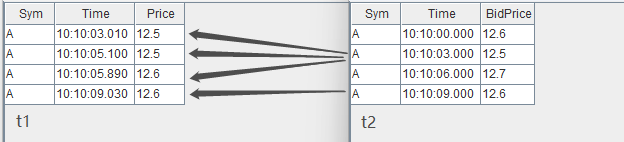

asof join 能够关联当前时刻或距离当前时刻最近时刻的数据。指定连接列为 Time 字段后，如上图所示，t1 表的每行记录总是关联 t2 表中 Time 值小于它的 Time 值的那一行 t2 记录。关联后的结果如下：

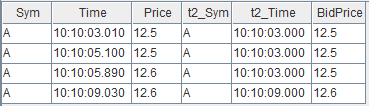

## 1.2 实时数据流关联面临的挑战

批计算的关联操作，作为计算输入的 t1 表和 t2 表的数据是有界的，关联操作作用在全量输入数据上，计算结果一次性全量输出。现在考虑一下实时关联的场景，首先在输入上，t1, t2 的记录数会不断增长，表现为数据无界且无法预知下一条记录何时到来，比如股票市场中的交易数据、行情快照数据，而对于关联结果，我们会希望在每一条输入到来后尽快且尽可能正确地输出结果记录，这时计算是不断增量进行的。

那么，对于流式的实时关联场景，我们需要解决以下两个问题：

- 何时触发计算并输出：以上面的 asof join 为例，数据流 t1 中第一条记录（Time 值为10:10:03:010）到达系统时，假设 t2 数据流中也有一条记录（Time 为10:10:00.000），此时实时计算模块是决定关联目前 t2 中最近的一条记录并输出，还是等待某个触发条件再关联输出，这是技术实现上要解决的问题。
- 如何管理内存：为了能够正确地关联到两个数据流，实时计算模块需要缓存历史的数据流，而输入是源源不断的，则需要历史数据的清理机制。

# 2. 流数据连接引擎

DolphinDB 提供了 [createAsofJoinEngine](https://www.dolphindb.cn/cn/help/FunctionsandCommands/FunctionReferences/c/createAsofJoinEngine.html), [createWindowJoinEngine](https://www.dolphindb.cn/cn/help/FunctionsandCommands/FunctionReferences/c/createWindowJoinEngine.html), [createEquiJoinEngine](https://www.dolphindb.cn/cn/help/FunctionsandCommands/FunctionReferences/c/createEquiJoinEngine.html), [createLeftSemiJoinEngine](https://www.dolphindb.cn/cn/help/FunctionsandCommands/FunctionReferences/c/createLeftSemiJoinEngine.html), [createLookupJoinEngine](https://www.dolphindb.cn/cn/help/FunctionsandCommands/FunctionReferences/c/createLookupJoinEngine.html) 等 5 种不同的流计算连接引擎函数，不同连接引擎的关联规则基本上与批计算中相应的 join 类似，差异将在后续小节中详细说明。本章首先概述 DolphinDB 流计算引擎，之后依次介绍各个引擎的原理和效果。

流计算连接引擎是 DolphinDB 中对数据流进行实时关联的计算模块，可以理解为一个设置了关联规则的计算黑盒，输入为2条数据流，输出为1条数据流，引擎内部会自动维护计算状态。

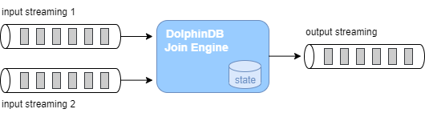

以下代码是 1.1 小节中的 asof join SQL 的流计算实现的脚本，首先创建 2 个流数据表作为输入、1 个流数据表作为输出，然后通过函数 createAsofJoinEngine 创建流计算引擎，之后通过函数 subscribeTable 分别订阅 2 个流数据表并将数据实时注入流计算引擎的左、右表。之后当数据不断写入两个流数据表时，输出结果表 output 中的记录数会相应地增加。流数据订阅功能更详细的介绍见 [流数据订阅](https://gitee.com/dolphindb/Tutorials_CN/blob/master/streaming_tutorial.md#22_流数据订阅) 。


```
// create table
share streamTable(1:0, `Sym`Time`Price, [SYMBOL, TIME, DOUBLE]) as trade
share streamTable(1:0, `Sym`Time`BidPrice, [SYMBOL, TIME, DOUBLE]) as snapshot
share table(1:0, `Time`Sym`Price`t2_Time`BidPrice, [TIME, SYMBOL, DOUBLE, TIME, DOUBLE]) as output

// create engine
ajEngine = createAsofJoinEngine(name="asofJoin", leftTable=trade, rightTable=snapshot, outputTable=output, metrics=<[Price, snapshot.Time, BidPrice]>, matchingColumn=`Sym, timeColumn=`Time, useSystemTime=false, delayedTime=1000)

// subscribe topic
subscribeTable(tableName="trade", actionName="joinLeft", offset=0, handler=getLeftStream(ajEngine), msgAsTable=true)
subscribeTable(tableName="snapshot", actionName="joinRight", offset=0, handler=getRightStream(ajEngine), msgAsTable=true)
```

以下代码构造输入数据并写入 2 个流数据表，查看结果表 output 将看到引擎计算的结果。 


```
// generate data
t1 = table(take(`A, 4) as Sym, 10:10:03.000+(10 2100 2890 6030) as Time, 12.5 12.5 12.6 12.6 as Price)
t2 = table(take(`A, 4) as Sym, 10:10:00.000+(0 3000 6000 9000) as Time, 12.6 12.5 12.7 12.6 as BidPrice)
// input data
snapshot.append!(t2)
trade.append!(t1)
```

流计算连接引擎通过内置实现和简单的参数接口来解决上一章提到的实时数据流关联的问题。对于内存管理，每个引擎都提供了 garbageSize 参数来清理不再需要的历史数据。对于触发计算的机制，不同的引擎会稍有不同，可以大致分为以下几类：

1. 若关联计算依赖数据的时间顺序，则处理的方式有：
   1. 以数据注入引擎时的系统时间为时序标准
   2. 以数据中的时间列为时序标准，这种情况下因为无法预知后续将到达的数据的时间戳，则时序判断以最新的时间戳为依据，认为时间戳早于它的全部数据都已经到齐，同时辅以超时强制触发的规则
2. 关联计算不依赖数据的时间顺序，则处理的方式有：
   1. 在数据注入引擎时立即计算输出
   2. 等待到匹配数据后才计算输出，同时辅以超时强制触发的规则

关联规则和触发规则决定了引擎的计算结果，下面我们详细介绍每一个连接引擎的原理和关联效果。

## 2.1 Asof Join 引擎（createAsofJoinEngine）

Asof Join 引擎的连接机制类似于 SQL 中的 asof join，按连接列分组，在每个分组内按时间邻近度关联左右表。引擎默认左右表是有序的，在连接列分组内，对于左表的每一条记录，当引擎判断邻近的时刻到来后，在右表缓存中选取在该条左表记录的时刻之前且最接近的一条记录，不论是否找到，引擎都将输出一条结果。

Asof join 引擎在创建时通过参数 useSystemTime 指定以下两种规则中的一种，用于判断临近时刻是否到来：

- 规则一：以数据注入引擎时的系统时间为时序标准，则每一条左表记录注入引擎时立刻关联并输出；
- 规则二：以数据中的时间列为时序标准，当右表数据的最新时刻大于左表数据的时刻时触发关联并输出。

在规则二的基础上，还可以通过参数 delayedTime 设置超时强制触发规则。

下图展示在一个分组中，以非系统时间触发输出的 Asof Join 引擎效果（未设置超时强制触发），触发输出的时刻由右表到来新数据决定。后文 3.1 小节将介绍一个 Asof Join 引擎的实际应用场景：[计算个股交易成本](#31-用-asof-join-引擎计算个股交易成本)。

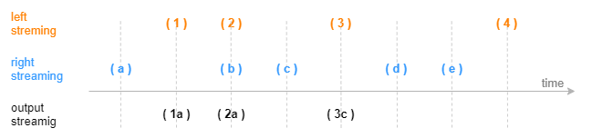

## 2.2 Window Join 引擎（createWindowJoinEngine）

Window Join 引擎的连接机制类似于 SQL 中的 window join，上一小节的 Asof Join 引擎可以看做是Window Join 引擎的一个特例。按连接列分组，在每个分组内按时间邻近关联右表一个时间窗口内的数据，这个窗口由左表的每一条记录的时刻和创建引擎时指定的窗口（参数 window）决定。引擎默认左右表是有序的，在连接列分组内，对于左表中的每一条记录，会在右表缓存中选取由左表的时刻确定的窗口范围内的记录，可能会找到 0 至多条记录，引擎将输出一条结果，这条结果由多条右表记录聚合为一条后与左表拼接而成。

Window Join 引擎在创建时通过参数 useSystemTime 指定以下两种规则中的一种，用于判断临近时刻是否到来：

- 规则一：以数据注入引擎时的系统时间为时序标准，则系统时间达到窗口下边界时立刻关联并输出；
- 规则二：以数据中的时间列为时序标准，当右表数据的最新时刻大于窗口下边界时触发关联并输出。

在规则二的基础上，还可以通过参数 maxDelayedTime 设置超时强制触发规则。

下图展示在一个分组中，以非系统时间触发输出的普通窗口（参数 window=-1:2 ）连接的效果，由每一条左表记录基于其时间戳往前 1 个时间刻度、往后2个时间刻度划定窗口的上下边界，输出由大于窗口下边界的第一条右表记录触发，窗口计算不包含这条触发记录。


下图展示在一个分组中，以非系统时间触发输出的特殊窗口（参数 window=0:0 ）连接的效果，窗口范围由相邻两条左表记录划定，输出由等于或大于左表时间戳的第一条右表记录触发，窗口计算不包含这条触发记录。后文 3.2 小节将介绍一个基于特殊窗口的窗口关联引擎的实际应用场景：[对行情快照融合逐笔成交数据](#32-用-window-join-引擎将行情快照与逐笔成交数据融合)。

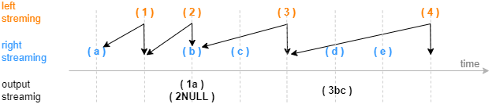

## 2.3 Equi Join 引擎（createEquiJoinEngine）

*注：自 1.30.21/2.00.9 版本起，`createEqualJoinEngine` 更名为 `createEquiJoinEngine`，原函数名可继续使用。*

Equi Join 引擎的连接机制类似于 SQL 中的 equi join，按连接列和时间列等值关联左右表，对于左表（或右表）中的每一条记录，当它成功匹配上右表（或左表）中连接列一致的一条记录时，引擎将输出一条结果。

与SQL 中的 equi join 不同的是，因为引擎内部并不缓存所有历史数据，所以可能出现左表（或右表）中的某条记录到来后无法关联到已经从引擎缓存中清除的历史右表（或左表）记录，进而不会输出结果。这是由Equi Join 引擎的设计初衷和内部实现决定的，该引擎是为以连接列和时间列为键值的输入数据设计的，比如每支股票在每分钟有一条记录。

下图展示字段结构为（连接列，时间列，指标）的输入数据注入等值关联引擎的效果。后文 3.3 小节将介绍一个等值关联引擎的实际应用场景：[拼接不同数据源的实时分钟指标](#33-用-equi-join-引擎拼接不同数据源的实时分钟指标)。

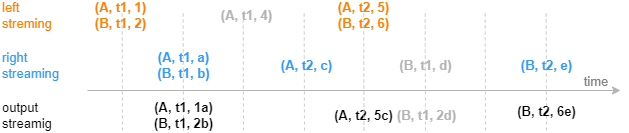

建议按推荐场景使用Equi Join 引擎，即对连接列和时间列唯一的数据使用本引擎。若非推荐场景，为了理解输出效果，可以参考如下设计原理：Equi Join 引擎内部分别为左右表数据维护两个以连接列和时间列作为键值的键值表作为缓存，并对每条记录标识是否关联过。下面以左表为例介绍，右表同理。当一条左表记录注入引擎，则查找右表缓存， 若能成功匹配则输出一条结果，并在右表缓存中标识对应记录为已关联，这时左表缓存中不会保存这条立刻关联输出的左表记录（此原理会导致上图中后续的灰色数据(A,t1,4)无法匹配而不输出），若未能匹配成功，则将该条左表记录加入左表缓存，并标识为未关联。

需要注意，对于缓存中的已关联、未关联的数据，Equi Join 引擎都会进行过期清理，清理原理可参考用户手册 [createEquiJoinEngine](https://www.dolphindb.cn/cn/help/FunctionsandCommands/FunctionReferences/c/createEquiJoinEngine.html)。若遵循推荐场景使用此引擎，但是引擎输出结果与 SQL equi join 结果仍不完全一致，则是设置的清理规则导致的差异。

## 2.4 Lookup Join 引擎（createLookupJoinEngine）

Lookup Join 引擎的连接机制类似于 SQL 中的 left join，按连接列等值关联左右表，左表中的每一条记录注入引擎时便立刻关联当前时刻的右表，不论是否在右表中匹配到连接列一致的记录，引擎都会立刻输出一条结果，若未能匹配上则结果中右表相关的字段为空。

与 SQL 中的 left join 不同的是，引擎在内部缓存右表的记录时，对于相同连接列的数据总是只保留最新一条，因此对于左表的每一条记录至多只会匹配一条右表记录并输出一次。引擎的右表可以是数据流或者数据集。对于数据流，引擎通过数据流不断地注入引擎来更新内部的右表缓存；对于数据集，引擎通过对数据集的定时查询来更新内部的右表缓存。

下图展示字段结构为（连接列，指标）的输入数据，注入右表保留最新一条记录的 Lookup Join 引擎的效果，左表数据总是在达到后立刻输出。后文 3.4 小节将介绍一个 Lookup Join 引擎的实际应用场景：[对实时行情关联历史日频指标](#34-用-lookup-join-引擎将实时行情与历史日频指标关联)。

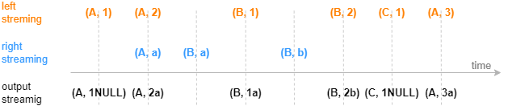

## 2.5 Left Semi Join 引擎（createLeftSemiJoinEngine）

Left Semi Join 引擎的连接机制类似于 SQL 中的 equi join ，按连接列等值关联左右表，对于左表中的每一条记录，当它成功匹配上右表中连接列一致的一条记录时，引擎将输出一条结果。未成功匹配的左表的记录将一直由引擎缓存，等待与右表中更新的记录匹配。

与SQL 中的 equi join 不同的是，引擎在内部缓存右表的记录时，对于相同连接列的数据总是只保留第一条或者最新一条，因此对于左表的每一条记录至多只会匹配一条右表记录并输出一次。

下图展示字段结构为（连接列，指标）的输入数据，注入右表保留最新一条记录的Left Semi Join 引擎的效果，左表数据总是等到匹配成功才输出。后文3.5、3.6小节将分别介绍两个Left Semi Join 引擎的实际应用场景：一是[对逐笔成交数据补充原始委托信息](#35-用-left-semi-join-引擎对逐笔成交数据补充原始委托信息)，二是[关联股票和指数行情并计算相关性](#36-用-left-semi-join-引擎关联股票与指数行情并计算相关性)。

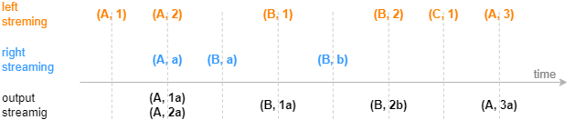

# 3. 实时关联应用案例

DolphinDB 中流计算连接引擎是结合各类实际业务场景而设计的，本章将从 6 个实际应用案例出发介绍各个连接引擎适用的具体场景。为了便于解释关联效果，下文案例中均以少量的模拟数据依次注入右表、左表来模拟数据流输入。

流计算脚本开发和调试过程中推荐使用 [getStreamingStat](https://www.dolphindb.cn/cn/help/FunctionsandCommands/FunctionReferences/g/getStreamingStat.html) 函数监控流订阅的状态，[getStreamEngineStat ](https://www.dolphindb.cn/cn/help/FunctionsandCommands/FunctionReferences/g/getStreamEngineStat.html)函数监控流数据引擎的状态。此外，文末[附录](#附录)中提供了清理流数据环境的通用脚本，用于一键清理所有的流数据表、取消所有的订阅、释放所有的流引擎。

## 3.1 用 Asof Join 引擎计算个股交易成本

因为逐笔成交数据和报价数据的发生时间不可能完全一致而不能使用常用的等值连接，往往需要以成交时间为基准找到交易发生前的最近一次报价数据，因此需要以邻近匹配的方式关联两个数据流。

这个场景的特征是，每条成交记录匹配一条时刻早于自己的报价记录，输出与原始的每一条成交记录一一对应。以下脚本用 Asof Join 引擎来实现此场景：

```
// create table
share streamTable(1:0, `Sym`TradeTime`TradePrice, [SYMBOL, TIME, DOUBLE]) as trades
share streamTable(1:0, `Sym`Time`Bid1Price`Ask1Price, [SYMBOL, TIME, DOUBLE, DOUBLE]) as snapshot
share streamTable(1:0, `TradeTime`Sym`TradePrice`TradeCost`SnapshotTime, [TIME, SYMBOL, DOUBLE, DOUBLE, TIME]) as output

// create engine
ajEngine = createAsofJoinEngine(name="asofJoin", leftTable=trades, rightTable=snapshot, outputTable=output, metrics=<[TradePrice, abs(TradePrice-(Bid1Price+Ask1Price)/2), snapshot.Time]>, matchingColumn=`Sym, timeColumn=`TradeTime`Time, useSystemTime=false, delayedTime=1000)

// subscribe topic
subscribeTable(tableName="trades", actionName="appendLeftStream", handler=getLeftStream(ajEngine), msgAsTable=true, offset=-1, hash=0)
subscribeTable(tableName="snapshot", actionName="appendRightStream", handler=getRightStream(ajEngine), msgAsTable=true, offset=-1, hash=1)
```

- 逐笔成交数据 trades 注入引擎的左表，报价数据 snapshot 注入引擎的右表。
- 引擎参数 useSystemTime=false 表示通过数据中的时间列（左表为 TradeTime 字段，右表为 Time 字段）来判断左右表中记录的时序关系。
- 引擎参数 delayedTime 是对默认触发机制的补充，以超时强制触发的方式保证左表及时匹配并输出。若未设置 delayedTime 是默认触发机制，对于任意一条左表记录，它必须等到右表出现一条时间戳大于它的记录才输出。但考虑到实际的应用场景中，某条右表记录可能迟迟未能到达或者始终不可能出现一条大于某些左表数据的右表记录，同时期望左表中每条记录都能匹配并输出，那么建议设置 dalayTime ，在这种情况下将以左表出现更新的数据或者系统时间超时来强制触发计算。
- 引擎参数 metrics 中 snapshot.Time 表示取右表 snapshot 中的 Time 字段，因为左表 trades 中也具有 Time 字段，若不加前缀、直接写 Time，则默认取左表的 Time 字段。
- 上例中创建引擎时未显式指定 garbageSize ，则使用默认值，garbageSize 不论大小均不改变计算结果，只影响引擎的内存占用。

构造数据写入作为原始输入的 2 个流数据表，先写入右表，再写入左表：


```
// generate data: trade
t1 = table(`A`A`B`A`B`B as Sym, 10:00:02.000+(1..6)*700 as TradeTime,  (3.4 3.5 7.7 3.5 7.5 7.6) as TradePrice)
// generate data: snapshot
t2 = table(`A`B`A`B as Sym, 10:00:00.000+(3 3 6 6)*1000 as Time, (3.5 7.6 3.5 7.6) as Bid1Price, (3.5 7.6 3.6 7.6) as Ask1Price)
// input data
snapshot.append!(t2)
trades.append!(t1)
```

输入数据与关联关系如下：

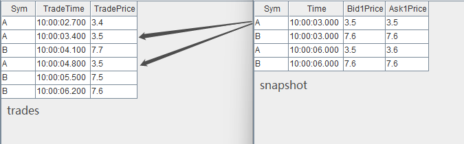

关联得到的结果表 output 如下，左表中全部 7 条数据都有对应的输出。本例中，在创建引擎时指定了 delayedTime 参数，因此对于分组 B ，即使右表 snapshot 中没有比 10:00:06.200 更大的时间戳， 左表 trades 中最后一条数据(B,10:00:06.200, 7.6) 仍然能够在注入引擎 2s 后强制输出。

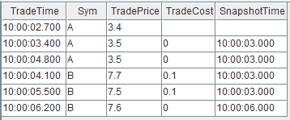

## 3.2 用 Window Join 引擎将行情快照与逐笔成交数据融合

行情快照和逐笔成交数据包含着不同的信息，很多高频因子的计算同时依赖行情快照和成交数据，本例在行情快照数据的基础上融合前后两个快照之间的逐笔成交数据，融合后的数据可以更方便地作为后续复杂因子的计算的输入。

这个场景的特征是，每条行情快照记录匹配一个时间窗口内的全部逐笔成交记录的聚合值，这个时间窗口的上下界由两条行情快照数据的时刻决定，输出与原始的每一条行情快照记录一一对应。对于一个窗口中的逐笔成交记录，既需要计算交易量总和这样的聚合值，也希望以一个字段保留窗口内的全部逐笔成交明细。以下脚本用 Window Join 引擎的特殊窗口来实现此场景。

注意，1.30 版本的 DolphinDB 不支持 array vector 数据形式，以下脚本包含 array vector 功能，因此仅支持 2.00 版本。


```
// create table
share streamTable(1:0, `Sym`TradeTime`Side`TradeQty, [SYMBOL, TIME, INT, LONG]) as trades
share streamTable(1:0, `Sym`Time`Open`High`Low`Close, [SYMBOL, TIME, DOUBLE, DOUBLE, DOUBLE, DOUBLE]) as snapshot
share streamTable(1:0, `Time`Sym`Open`High`Low`Close`BuyQty`SellQty`TradeQtyList`TradeTimeList, [TIME, SYMBOL, DOUBLE, DOUBLE, DOUBLE, DOUBLE, LONG, LONG, LONG[], TIME[]]) as output

// create engine
wjMetrics = <[Open, High, Low, Close, sum(iif(Side==1, TradeQty, 0)), sum(iif(Side==2, TradeQty, 0)), TradeQty, TradeTime]>
fillArray = [00:00:00.000, "", 0, 0, 0, 0, 0, 0, [], []]
wjEngine = createWindowJoinEngine(name="windowJoin", leftTable=snapshot, rightTable=trades, outputTable=output, window=0:0, metrics=wjMetrics, matchingColumn=`Sym, timeColumn=`Time`TradeTime, useSystemTime=false, nullFill=fillArray)

// subscribe topic
subscribeTable(tableName="snapshot", actionName="appendLeftStream", handler=getLeftStream(wjEngine), msgAsTable=true, offset=-1, hash=0)
subscribeTable(tableName="trades", actionName="appendRightStream", handler=getRightStream(wjEngine), msgAsTable=true, offset=-1, hash=1)
```

- 行情快照数据 snapshot 注入引擎的左表，逐笔成交数据 trades 注入引擎的右表。
- 引擎参数 useSystemTime=false 表示通过数据中的时间列（左表为 Time 字段，右表为 TradeTime 字段）来判断左右表中记录的时序关系。
- 引擎参数 window=0:0 表示右表 trades 的计算窗口将由左表 snapshot 当前和其上一条数据的时间戳划定。
- 引擎参数 metrics 表示计算指标，如 Open 表示取左表 snapshot 中 Open 字段，sum(iif(Side==1, TradeQty, 0)) 表示对右表 trades 在窗口内的数据做聚合计算。注意，TradeQty 是右表 trades 中的字段，且此处对 TradeQty 没有使用聚合函数，则表示对右表 trades 在窗口内的全部 TradeQty 值保留明细，对应的输出为一个数据类型为 array vector 的字段。
- 引擎参数 nullFill 为可选参数，表示如何填充输出表中的空值，本例中结合实际场景，对于表示价格的字段如 Open 等都指定将空值填充为0。注意，nullFill 为元组，必须和输出表列字段等长且类型一一对应。

构造数据写入作为原始输入的 2 个流数据表，先写入右表，再写入左表：


```
// generate data: snapshot
t1 = table(`A`B`A`B`A`B as Sym, 10:00:00.000+(3 3 6 6 9 9)*1000 as Time, (NULL NULL 3.5 7.6 3.5 7.6) as Open, (3.5 7.6 3.6 7.6 3.6 7.6) as High, (3.5 7.6 3.5 7.6 3.4 7.5) as Low, (3.5 7.6 3.5 7.6 3.6 7.5) as Close)
// generate data: trade
t2 = table(`A`A`B`A`B`B`A`B`A`A as Sym, 10:00:02.000+(1..10)*700 as TradeTime,  (1 2 1 1 1 1 2 1 2 2) as Side, (1..10) * 10 as TradeQty)
// input data
trades.append!(t2)
snapshot.append!(t1)
```

输入数据与关联关系如下：

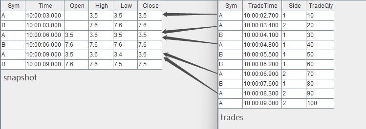

关联得到的结果表 output 如下，其中最后两列为 array vector 类型数据，记录了窗口中全部成交记录的 TradeQty 字段明细、TradeTime 字段明细。

注意，输出表比左表 snapshot 少一条数据，即左表 sanpshot 中分组 B 内时间戳为 10:00:09.000 的数据没有输出，这是因为右表 trades 中分组 B 内没有等于或大于 10:00:09.000 的数据来关闭窗口。在实际生产中，当接入实时数据时，若需要左表 snapshot 一旦达到引擎便立即输出，则建议选择 useSystemTime=true，即用系统时间作为时间戳，这时，对于任意一条左表记录，右表窗口是从前一条左表记录到达到本条记录到达之间进入引擎的全部右表数据。

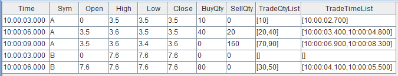

## 3.3 用 Equi Join 引擎拼接不同数据源的实时分钟指标

在量化金融的实盘中往往会对原始的行情快照、逐笔成交等进行降采样形成分钟指标，以作为输入提供给进一步的交易策略，这时则需要将多个不同数据源计算出的指标关联到同一张表中。本例将对快照和成交数据分别做实时的 1 分钟聚合，并将快照指标和成交指标关联后输出到同一张宽表中。

这个场景的特征是，每支股票的行情快照分钟指标在每一分钟只有一条记录，逐笔成交分钟指标同样有这样的唯一性，并且在某一分钟的输出上，期望总是在两类指标都计算完成后再将关联输出。以下脚本用 Equi Join 引擎来实现此场景。

*注意：如您使用的 DolphinDB 版本早于 1.30.21/2.00.9，请将脚本中的 `createEquiJoinEngine` 替换为 `createEqualJoinEngine`。自 1.30.21/2.00.9 版本起，`createEqualJoinEngine` 更名为 `createEquiJoinEngine`，原函数名可继续使用。*

```
// create table
share streamTable(1:0, `Sym`TradeTime`Side`TradeQty, [SYMBOL, TIME, INT, LONG]) as trades
share streamTable(1:0, `UpdateTime`Sym`BuyTradeQty`SellTradeQty, [TIME, SYMBOL, LONG, LONG]) as tradesMin
share streamTable(1:0, `Sym`Time`Bid1Price`Bid1Qty, [SYMBOL, TIME, DOUBLE, LONG]) as snapshot
share streamTable(1:0, `UpdateTime`Sym`AvgBid1Amt, [TIME, SYMBOL, DOUBLE]) as snapshotMin
share streamTable(1:0, `UpdateTime`Sym`AvgBid1Amt`BuyTradeQty`SellTradeQty, [TIME, SYMBOL, DOUBLE, LONG, LONG]) as output

// create engine: 
eqJoinEngine = createEquiJoinEngine(name="EquiJoin", leftTable=tradesMin, rightTable=snapshotMin, outputTable=output, metrics=<[AvgBid1Amt, BuyTradeQty, SellTradeQty]>, matchingColumn=`Sym, timeColumn=`UpdateTime)
// create engine: 
tsEngine1 = createTimeSeriesEngine(name="tradesAggr", windowSize=60000, step=60000, metrics=<[sum(iif(Side==1, 0, TradeQty)), sum(iif(Side==2, 0, TradeQty))]>, dummyTable=trades, outputTable=getLeftStream(eqJoinEngine), timeColumn=`TradeTime, keyColumn=`Sym, useSystemTime=false, fill=(0, 0))
// create engine: 
tsEngine2 = createTimeSeriesEngine(name="snapshotAggr", windowSize=60000, step=60000, metrics=<[avg(iif(Bid1Price!=NULL, Bid1Price*Bid1Qty, 0))]>, dummyTable=snapshot, outputTable=getRightStream(eqJoinEngine), timeColumn=`Time, keyColumn=`Sym, useSystemTime=false, fill=(0.0))

// subscribe topic
subscribeTable(tableName="trades", actionName="minAggr", handler=tsEngine1, msgAsTable=true, offset=-1, hash=1)
subscribeTable(tableName="snapshot", actionName="minAggr", handler=tsEngine2, msgAsTable=true, offset=-1, hash=2) 
```

- 首先用两个独立的时序聚合引擎（[createTimeSeriesEngine](https://www.dolphindb.cn/cn/help/FunctionsandCommands/FunctionReferences/c/createTimeSeriesEngine.html)）对原始的快照和成交数据流按数据中的时间戳做实时聚合、输出每一分钟的指标，之后通过引擎级联的方式，将两个时序聚合引擎的输出分别作为左右表注入连接引擎。引擎级联更详细的介绍见 [流数据教程：4.1 流水线处理](https://gitee.com/dolphindb/Tutorials_CN/blob/master/streaming_tutorial.md#41_流水线处理) 。
- Equi Join 引擎对左、右表的处理是完全相同的，即上例中在 createEquiJoinEngine 时交换左右表不会影响关联结果。

构造数据写入作为原始输入的 2 个流数据表：


```
// generate data: snapshot
t1 = table(`A`B`A`B`A`B as Sym, 10:00:52.000+(3 3 6 6 9 9)*1000 as Time, (3.5 7.6 3.6 7.6 3.6 7.6) as Bid1Price, (1000 2000 500 1500 400 1800) as Bid1Qty)
// generate data: trade
t2 = table(`A`A`B`A`B`B`A`B`B`A as Sym, 10:00:54.000+(1..10)*700 as TradeTime,  (1 2 1 1 1 1 2 1 2 2) as Side, (1..10) * 10 as TradeQty)
// input
trades.append!(t2)
snapshot.append!(t1)
```

关联得到的结果表 output 如下：

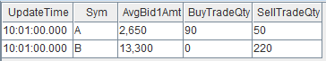

## 3.4 用 Lookup Join 引擎将实时行情与历史日频指标关联

在当日的实时计算中可能会需要依赖历史指标，本例在行情快照的基础上，通过股票代码关联该股票在昨日的日频指标。

这个场景的特征是，每条快照记录到达后要求立刻关联输出，如果日频数据里没有对应的股票，输出结果对应的字段为空，输出与原始输入中的每一条行情快照记录一一对应。同时，日频指标并非实时数据，而是一个以较低频率更新的有主键的离线数据集。以下脚本用 Lookup Join 引擎来实现此场景。


```
// create table
share streamTable(1:0, `Sym`Time`Open`High`Low`Close, [SYMBOL, TIME, DOUBLE, DOUBLE, DOUBLE, DOUBLE]) as snapshot
historicalData = table(`A`B as Sym, (0.8 0.2) as PreWeight, (3.1 7.6) as PreClose)
share table(1:0, `Sym`Time`Open`High`Low`Close`PreWeight`PreClose, [SYMBOL, TIME, DOUBLE, DOUBLE, DOUBLE, DOUBLE, DOUBLE, DOUBLE]) as output

// create engine
lookupJoinEngine = createLookupJoinEngine(name="lookupJoin", leftTable=snapshot, rightTable=historicalData, outputTable=output, metrics=<[Time, Open, High, Low, Close, PreWeight, PreClose]>, matchingColumn=`Sym, checkTimes=10s)

// subscribe topic
subscribeTable(tableName="snapshot", actionName="appendLeftStream", handler=getLeftStream(lookupJoinEngine), msgAsTable=true, offset=-1)
```

- 订阅流数据表 snapshot 注入引擎的左表。引擎右表为普通内存表 historicalData ，它不能且不需要进行订阅。
- 引擎会在内部维护一个最新的右表，在创建引擎时会查询右表 historicalData 并缓存在引擎内部。参数 checkTimes=10s 表示之后的每 10s 引擎会再次查询右表 historicalData 并更新一次内部的缓存。

构造数据写入作为引擎左表输入的流数据表 snapshot：


```
// generate data: snapshot
t1 = table(`A`B`A`B`A`B as Sym, 10:00:00.000+(3 3 6 6 9 9)*1000 as Time, (3.5 7.6 3.5 7.6 3.5 7.6) as Open, (3.5 7.6 3.6 7.6 3.6 7.6) as High, (3.5 7.6 3.5 7.6 3.4 7.5) as Low, (3.5 7.6 3.5 7.6 3.6 7.5) as Close)
snapshot.append!(t1)
```

输入数据与关联关系如下：

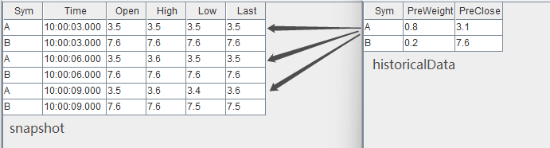

结果在左表数据到达引擎时立刻输出，关联得到的结果表 output 如下：

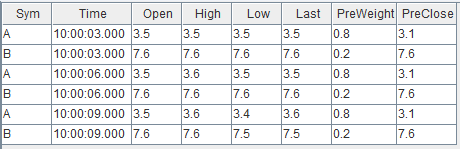

## 3.5 用 Left Semi Join 引擎对逐笔成交数据补充原始委托信息

逐笔成交数据中包含买卖双方的原始委托订单号，本例通过股票代码和订单号去关联逐笔委托数据，以达到在成交数据的基础上丰富其原始委托信息的目的。

这个场景的特征是，对于每条逐笔成交都应该找到对应的委托单，输出与原始输入中的逐笔成交记录一一对应。在找到对应的委托单前，该条逐笔成交记录暂时不输出。 

以下脚本用两个 Left Semi Join 引擎级联的方式，对成交表 trades 中的卖方委托单、买方委托单依次进行了关联。多个引擎之间采用了引擎级联的方式处理，引擎级联更详细的介绍见 [流数据教程：4.1 流水线处理](https://gitee.com/dolphindb/Tutorials_CN/blob/master/streaming_tutorial.md#41_流水线处理) 。


```
// create table
share streamTable(1:0, `Sym`BuyNo`SellNo`TradePrice`TradeQty`TradeTime, [SYMBOL, LONG, LONG, DOUBLE, LONG, TIME]) as trades
share streamTable(1:0, `Sym`OrderNo`Side`OrderQty`OrderPrice`OrderTime, [SYMBOL, LONG, INT, LONG, DOUBLE, TIME]) as orders
share streamTable(1:0, `Sym`SellNo`BuyNo`TradePrice`TradeQty`TradeTime`BuyOrderQty`BuyOrderPrice`BuyOrderTime, [SYMBOL, LONG, LONG, DOUBLE, LONG, TIME, LONG, DOUBLE, TIME]) as outputTemp
share streamTable(1:0, `Sym`BuyNo`SellNo`TradePrice`TradeQty`TradeTime`BuyOrderQty`BuyOrderPrice`BuyOrderTime`SellOrderQty`SellOrderPrice`SellOrderTime, [SYMBOL, LONG, LONG, DOUBLE, LONG, TIME, LONG, DOUBLE, TIME, LONG, DOUBLE, TIME]) as output

// create engine: left join buy order
ljEngineBuy=createLeftSemiJoinEngine(name="leftJoinBuy", leftTable=outputTemp, rightTable=orders, outputTable=output,  metrics=<[SellNo, TradePrice, TradeQty, TradeTime, BuyOrderQty, BuyOrderPrice, BuyOrderTime, OrderQty, OrderPrice, OrderTime]>, matchingColumn=[`Sym`BuyNo, `Sym`OrderNo])

//  create engine: left join sell order 
ljEngineSell=createLeftSemiJoinEngine(name="leftJoinSell", leftTable=trades, rightTable=orders, outputTable=getLeftStream(ljEngineBuy),  metrics=<[BuyNo, TradePrice, TradeQty, TradeTime, OrderQty, OrderPrice, OrderTime]>, matchingColumn=[`Sym`SellNo, `Sym`OrderNo])

// subscribe topic
subscribeTable(tableName="trades", actionName="appendLeftStream", handler=getLeftStream(ljEngineSell), msgAsTable=true, offset=-1)
subscribeTable(tableName="orders", actionName="appendRightStreamForSell", handler=getRightStream(ljEngineSell), msgAsTable=true, offset=-1)
subscribeTable(tableName="orders", actionName="appendRightStreamForBuy", handler=getRightStream(ljEngineBuy), msgAsTable=true, offset=-1) 
```

- 数据流向：首先，将 trades 和 orders 分为作为左、右表注入引擎 leftJoinSell，此次以 trades 数据中的卖单号关联 orders 中的对应订单。之后，将上述引擎的输出作为左表直接注入引擎 leftJoinBuy ，该引擎的右表仍然设置为 orders，此次以 trades 数据中的买单号关联 orders 中的对应订单。
- 内存管理：上例中创建引擎时未显式指定 garbageSize ，则使用默认值，garbageSize 不论大小均不改变计算结果。注意，和其他连接引擎不同，该函数的 garbageSize 参数只用于清理左表的历史数据，右表的历史数据不进行回收，因此上述案例中两个引擎至少分别占用一个 orders 表大小的内存。

构造数据写入作为原始输入的 2 个流数据表：


```
// generate data: trade
t1 = table(`A`B`B`A as Sym, [2, 5, 5, 6] as BuyNo, [4, 1, 3, 4] as SellNo, [7.6, 3.5, 3.5, 7.6]as TradePrice, [10, 100, 20, 50]as TradeQty, 10:00:00.000+(400 500 500 600) as TradeTime)
// generate data: order
t2 = table(`B`A`B`A`B`A as Sym, 1..6 as OrderNo, [2, 1, 2, 2, 1, 1] as Side, [100, 10, 20, 100, 350, 50] as OrderQty, [7.6, 3.5, 7.6, 3.5, 7.6, 3.5] as OrderPrice, 10:00:00.000+(1..6)*100 as OrderTime)
// input data
orders.append!(t2)
trades.append!(t1)
```

输入数据与关联关系如下：

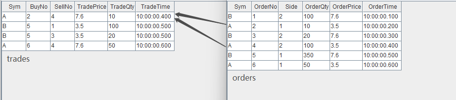

通过两个 Left Semi Join 引擎，上图中 trades 数据流中的每一条记录将分别和 orders 数据流中的两条记录关联，进而取得 orders 中的委托量、价、时间等字段，关联得到的结果表 output 如下：

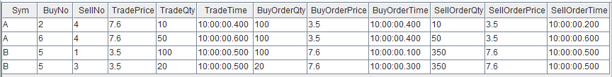

## 3.6 用 Left Semi Join 引擎关联股票与指数行情并计算相关性

本例中我们实时计算股票和某个指数在过去一段时间内分钟收益率的相关性。输入使用已经降为分钟频率的股票数据和指数数据。

这个场景的特征是，两个数据流的时间戳频率一致，全部股票都需要关联同一支指数，输出与原始输入中的股票数据一一对应。 以下脚本用 Left Semi Join 引擎来实现此关联场景。


```
// create table
share streamTable(1:0, `Sym`Time`Close, [SYMBOL, TIME, DOUBLE]) as stockKline
share streamTable(1:0, `Sym`Time`Close, [SYMBOL, TIME, DOUBLE]) as indexKline
share streamTable(1:0, `Time`Sym`Close`Index1Close, [TIME, SYMBOL, DOUBLE, DOUBLE]) as stockKlineAddIndex1
share streamTable(1:0, `Sym`Time`Close`Index1Close`Index1Corr, [SYMBOL, TIME, DOUBLE, DOUBLE, DOUBLE]) as output

//  create engine: calculate correlation
rsEngine = createReactiveStateEngine(name="calCorr", dummyTable=stockKlineAddIndex1, outputTable=output, metrics=[<Time>, <Close>, <Index1Close>, <mcorr(ratios(Close)-1, ratios(Index1Close)-1, 3)>], keyColumn="Sym")

//  create engine: left join Index1
ljEngine1 = createLeftSemiJoinEngine(name="leftJoinIndex1", leftTable=stockKline, rightTable=indexKline, outputTable=getStreamEngine("calCorr"), metrics=<[Sym, Close, indexKline.Close]>, matchingColumn=`Time)

// subscribe topic
def appendIndex(engineName, indexName, msg){
	tmp = select * from msg where Sym = indexName
	getRightStream(getStreamEngine(engineName)).append!(tmp)
}
subscribeTable(tableName="indexKline", actionName="appendIndex1", handler=appendIndex{"leftJoinIndex1", "idx1"}, msgAsTable=true, offset=-1, hash=1)
subscribeTable(tableName="stockKline", actionName="appendStock", handler=getLeftStream(ljEngine1), msgAsTable=true, offset=-1, hash=0)

```

- 数据流向：首先，股票数据 stockKline 注入连接引擎 leftJoinIndex1 的左表，指数数据经过滤后注入该引擎的右表，这一步将股票与指数的分钟指标关联。之后，将上述连接引擎的输出直接注入响应式状态引擎（[createReactiveStateEngine](https://www.dolphindb.cn/cn/help/FunctionsandCommands/FunctionReferences/c/createReactiveStateEngine.html)），利用响应式状态引擎内置的 mcorr 和 ratios 函数计算股票与指数的相关性指标。多个引擎之间采用了引擎级联的方式处理，引擎级联更详细的介绍见 [流数据教程：4.1 流水线处理](https://gitee.com/dolphindb/Tutorials_CN/blob/master/streaming_tutorial.md#41_流水线处理) 。响应式状态引擎教程见 [金融高频因子的流批统一计算：DolphinDB响应式状态引擎介绍](https://gitee.com/dolphindb/Tutorials_CN/blob/master/reactive_state_engine.md) 。
- 订阅指数数据 indexKline 时指定 handler 为自定义函数 appendIndex ，是指不断地收到 indexKline 数据后，首先过滤出指数数据中指数名为 idx1 的数据，然后再注入连接引擎的右表。

构造数据写入作为原始输入的 2 个流数据表：


```
// generate data: stock Kline
t1 = table(`A`B`A`B`A`B`A`B`A`B as Sym, 10:00:00.000+(0 0 1 1 2 2 3 3 4 4)*60000 as Time, (4.1 7.6 3.8 7.6 4.3 7.5 3.5 7.6 4.2 7.6) as Close)
// generate data: index Kline
t2 = table(`idx1`idx2`idx1`idx2`idx1`idx2`idx1`idx2`idx1`idx2 as Sym, 10:00:00.000+(0 0 1 1 2 2 3 3 4 4)*60000 as Time, (2.1 5 2.2 5 1.9 5 1.7 5 1.7 5) as Close)
// input data
indexKline.append!(t2)
stockKline.append!(t1)
```

输入数据与关联关系如下：

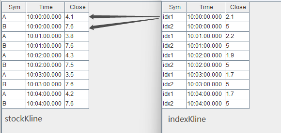

关联得到的结果表 output 如下，对于股票 A 、B 每分钟都会关联对应分钟的指数 idx1 。因为 mcorr 滑动窗口为3，所以前两分钟结算结果为空。

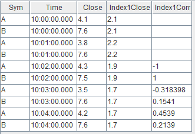

# 4. 流数据连接引擎的比较

| **连接引擎**       | **连接列**                | **关联机制**                                                 | **类似的 SQL join** | **结果表行数**                                               | **应用场景**                                                 |
| ------------------ | ------------------------- | ------------------------------------------------------------ | ------------------- | ------------------------------------------------------------ | ------------------------------------------------------------ |
| AsofJoinEngine     | matchingColumn            | 左表每到来一条记录，匹配右表连接列一致且时间戳最近的一条记录。 | asof join           | 小于或等于左表行数                                           | [计算个股交易成本](#31-用-asof-join-引擎计算个股交易成本) |
| WindowJoinEngine   | matchingColumn            | 左表每到来一条记录，匹配右表中连接列一致，且在由左表时间戳确定的窗口范围内的数据。 | window join         | 小于或等于左表行数                                           | [将行情快照和逐笔成交数据融合](#32-用-window-join-引擎将行情快照与逐笔成交数据融合) |
| EquiJoinEngine     | matchingColumn+timeColumn | 左（右）表每到来一条记录，匹配右（左）表连接列一致的最新的一条记录。 | equi join           | 等于左右表能完全等值匹配的行数（在左右表中的连接列均唯一的前提下） | [拼接不同数据源的实时分钟指标](#33-用-equi-join-引擎拼接不同数据源的实时分钟指标) |
| LookupJoinEngine   | matchingColumn            | 左表每到来一条记录，匹配右表连接列一致的最新的一条记录。     | left join           | 等于左表行数                                                 | [将实时行情与历史日频指标关联](#34-用-lookup-join-引擎将实时行情与历史日频指标关联) |
| LeftSemiJoinEngine | matchingColumn            | 对于左表的每一条记录，匹配右表连接列一致的第一条或最后一条记录。 | equi join           | 小于或等于左表行数                                           | [对逐笔成交数据补充原始委托信息](#35-用-left-semi-join-引擎对逐笔成交数据补充原始委托信息)、[关联股票和指数行情并计算相关性](#36-用-left-semi-join-引擎关联股票与指数行情并计算相关性)。 |

# 5. 总结

DolphinDB 提供了 5 个不同的流数据连接引擎，引擎均内置实现了高效的关联计算、实时触发规则和内存管理机制，开发人员通过简单的引擎参数配置便能够快速实现复杂的实时关联需求。本文重点介绍了各个连接引擎的原理、关联效果、实际应用案例，并在文末简要总结各个引擎的特点，旨在降低开发人员在实时数据流关联处理中的开发门槛。结合 DolphinDB 流数据框架中其他流计算引擎、流水线处理、并行计算等重要特性，开发人员可以将自己的业务场景实时化，通过提升速度掌握更及时的信息、挖掘更多的业务价值。

# 附录

- 流环境清理通用脚本：[clearStreamingEnv.dos](script/streaming-real-time-correlation-processing/clearStreamingEnv.dos)
