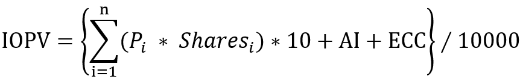
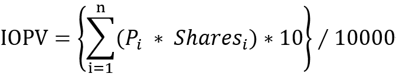
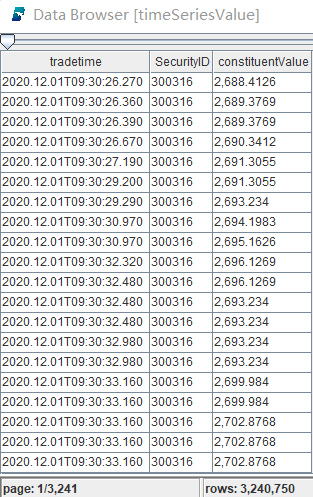
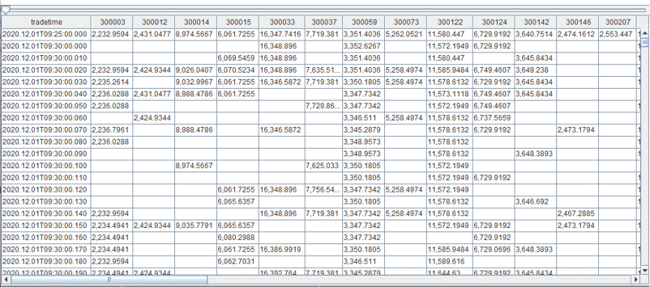
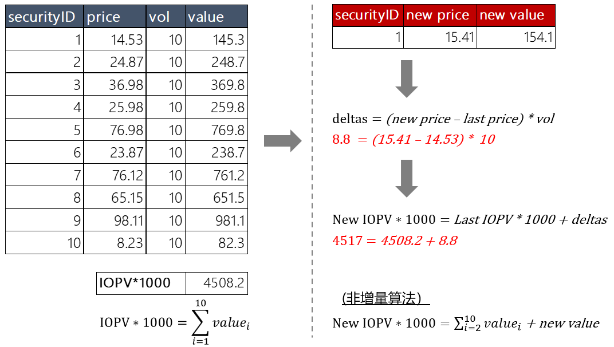

# DolphinDB 流计算应用：基金份额参考价值 IOPV 计算
Indicative Optimized Portfolio Value(IOPV) 全称为基金份额参考净值，是由交易所计算的 ETF 实时单位净值的近似值，便于投资者估计 ETF 交易价格是否偏离了其内在价值。ETF 最新价为场内价格，是该 ETF 在二级市场交易的买卖价格。而 IOPV 是这只 ETF 在一级市场的报价，即为 ETF 的净值。IOPV 是 ETF 基金特有，是场内 ETF 的参考值，方便投资者参与套利。

目前交易所每隔 15 秒公开发布 IOPV 行情。本教程介绍如何使用 DolphinDB 实时计算 ETF 的 IOPV，亦即任何成分股的交易价格发生变化时，重新计算 EFT 的最新 IOPV。这将给量化策略更多多操作空间。
生产环境中实时计算主要有3个要求：(1) 能够实现 IOPV 复杂计算；(2) 计算快、交易信号捕捉要灵敏；(3) 具备从行情输入、计算到结果输出完整的实时处理能力。

>  本教程中将会学习到: <p>
> **面板数据处理**pivot <p>
> **行情回放**replayDS <p>
> **增量计算**是什么？怎么做？<p>
> **流式计算**横截面引擎 CrossSectionalEngine，响应式状态引擎 ReactiveStateEngine <p>
> **函数**ffill, rowSum <p>
> **使用消息中间件**zmq <p>

本教程包含内容：
- [DolphinDB 流计算应用：基金份额参考价值 IOPV 计算](#dolphindb-流计算应用基金份额参考价值-iopv-计算)
  - [1. 计算公式](#1-计算公式)
    - [1.1 标准 IOPV 计算公式](#11-标准-iopv-计算公式)
    - [1.2 本教程 IOPV 计算公式](#12-本教程-iopv-计算公式)
  - [2. 指数构建](#2-指数构建)
    - [2.1  固定标的构建](#21--固定标的构建)
    - [2.2 随机标的构建](#22-随机标的构建)
    - [2.3 逐笔成交数据表结构](#23-逐笔成交数据表结构)
  - [3. 历史 IOPV 计算](#3-历史-iopv-计算)
    - [3.1 传统 IOPV 计算方法](#31-传统-iopv-计算方法)
    - [3.2 DolphinDB 数据面板计算方法](#32-dolphindb-数据面板计算方法)
  - [4. 单只 ETF 实时计算](#4-单只-etf-实时计算)
    - [4.1 [数据接入] replayDS：历史行情回放](#41-数据接入-replayds历史行情回放)
    - [4.2 [实时计算] IOPV 横截面计算](#42-实时计算-iopv-横截面计算)
    - [4.3 [下游系统消费]通过 ZMQ 消费计算结果](#43-下游系统消费通过-zmq-消费计算结果)
  - [5. 多只 ETF 实时增量计算](#5-多只-etf-实时增量计算)
    - [5.1 过滤价格不变数据](#51-过滤价格不变数据)
    - [5.2 增量算子计算](#52-增量算子计算)
    - [5.3 增量计算](#53-增量计算)
  - [6. 回顾](#6-回顾)
  - [7. 源代码](#7-源代码)

## 1. 计算公式
### 1.1 标准 IOPV 计算公式
计算公式如下：



* P_i：T 日申购赎回清单中第 i 只成分券的实时价格，取净价
* Shares_i：T 日申购赎回清单中第 i 只成分券的数量（单位：手）
* AI：T 日申购赎回清单中所有成分券在 T 日的应计利息总和
* ECC：T 日申购赎回清单中的预估现金部分（Estimated Cash Component）

### 1.2 本教程 IOPV 计算公式
在无法获得 ETF 基金参考数据源的情况下，我们采用数据模拟构建的方式，因此有以下调整。

**成分券构建**

假设每只基金都为 50 只成分券，采用固定和随机两种方式构建成分券。

**计算公式调整**



不将 AI 和 ECC 纳入 IOPV 计算公式中，对计算方法和计算性能影响较小。

## 2. 指数构建

固定标的构建用于单只指数的历史和实时 IOPV 计算，随机标的构建用于多只指数的实时 IOPV 计算。

### 2.1  固定标的构建

选取 50 只深市股票作为成分券，并为每只成分券设置一个随机仓位，然后构建一个 “字典” 类型的指数。

```python
symbols = `300073`300363`300373`300474`300682`300769`301029`300390`300957`300763`300979`300919`300037`300832`300866`300896`300751`300223`300676`300274`300413`300496`300661`300782`300142`300759`300595`300285`300146`300207`300316`300454`300529`300699`300628`300760`300601`300450`300433`300408`300347`300124`300122`300059`300033`300015`300014`300012`300003`300750
positions = rand(76339..145256, 50)
portfolio = dict(symbols, positions)
```

### 2.2 随机标的构建

`getBasketData()` 函数会构建100只指数，在深市股票逐笔成交中随机选取50只股票作为成分股，并设置随机仓位。

```python
def getBasketData(allSymbol, n){
        return loop(x->table(take(x, 50) as BasketID, rand(allSymbol, 50) as SecurityID, rand(76339..145256, 50) as Vol), 1..n).unionAll(false)
}

trade = loadTable("dfs://LEVEL2_SZ","Trade")
allSyms = select count(*) from trade where date(tradetime) = 2020.01.02 group by SecurityID
basket = getBasketData(allSyms.SecurityID, 100)
```

### 2.3 逐笔成交数据表结构

采用深交所 Level2 逐笔成交进行 IOPV 计算，表结构如下：

| name             | typeString | typeInt | comment |
| ---------------- | ---------- | ------- | ------- |
| tradedate        | DATE       | 6       |         |
| OrigTime         | TIMESTAMP  | 12      |         |
| SendTime         | TIMESTAMP  | 12      |         |
| recvtime         | TIMESTAMP  | 12      |         |
| dbtime           | TIMESTAMP  | 12      |         |
| ChannelNo        | INT        | 4       |         |
| MDStreamID       | SYMBOL     | 17      |         |
| ApplSeqNum       | LONG       | 5       |         |
| SecurityID       | SYMBOL     | 17      |         |
| SecurityIDSource | SYMBOL     | 17      |         |
| BidApplSeqNum    | INT        | 4       |         |
| OfferApplSeqNum  | INT        | 4       |         |
| Price            | DOUBLE     | 16      |         |
| TradeQty         | INT        | 4       |         |
| ExecType         | SYMBOL     | 17      |         |
| tradetime        | TIMESTAMP  | 12      |         |

## 3. 历史 IOPV 计算

### 3.1 传统 IOPV 计算方法

基于历史逐笔成交计算更细颗粒度的 IOPV，传统计算方法如下：

将50只成分券的所有逐笔数据合并，并按照时间戳排序。计算时按时间戳遍历股票数据，计算每个时间戳 50 只股票的总价值，作为当前时间戳的 IOPV。若某一时间戳下，存在股票数据缺失，则用前一时间戳下该股票的数据进行填充。在程序中需要分别记录50只股票最近一个时间戳的价格并随时更新。


传统计算方法有几点不足：
> 1. 传统方法采用循环的方式遍历计算，导致性能不高。<p>
> 2. 会存在不同股票相同时间戳的数据，需要代码判断读到最新时间戳才能触发汇总计算逻辑，导致代码复杂。<p>
> 3. 需要把前一股票价值手工存储在一个变量里，并随时更新这个变量，导致代码复杂。<p>

因此，基于逐笔成交的传统 IOPV 计算方法会有耗时长和代码复杂两个缺点。

### 3.2 DolphinDB 数据面板计算方法

在 DolphinDB 中利用 pivot by 生成一个数据面板（矩阵），再对矩阵进行向量化运算可以提高计算速度，同时代码更为简洁。

```python
timeSeriesValue = select tradetime, SecurityID, price * portfolio[SecurityID]/1000 as constituentValue from loadTable("dfs://LEVEL2_SZ","Trade") where SecurityID in portfolio.keys(), tradedate = 2020.12.01, price > 0
iopvHist = select rowSum(ffill(constituentValue)) as IOPV from timeSeriesValue pivot by tradetime, SecurityID
```

1. 计算股票价值

timeSeriesValue 得到每个时间戳下的所有成分券价值，本次代码示例计算深交所2021.12.01这一日的逐笔成交的历史 IOPV，其中 ```loadTable("dfs://LEVEL2_SZ","Trade")``` 使用的是逐笔成交表。



上图中 constituentValue 是每一时间戳时当前股票仓位的价值。

2. 面板数据计算 IOPV

利用 DolphinDB 中的 pivot by 数据透视功能生成一个面板数据，横轴是50只成分券，纵轴是时间戳，数据点代表每只成分券在一个时间戳上的价值。




对面板数据的纵轴（时间序列）的空置填充最近前一笔有效价值，再对横轴（成分券）汇总即可得到每个时间戳上的 IOPV 结果。

* [ffill](https://www.dolphindb.cn/cn/help/200/FunctionsandCommands/FunctionReferences/f/ffill.html) 会找到前一笔最近的非空值，相当于传统方法取前一股票价值。
* [rowSum](https://www.dolphindb.cn/cn/help/200/FunctionsandCommands/FunctionReferences/r/rowSum.html?highlight=rowsum) 对横向行数据汇总，即把所有成分券的价值汇总得出 IOPV。

在 DolphinDB 中使用一行代码就能完成传统 IOPV 计算步骤3中的复杂逻辑；同时，DolphinDB 是向量计算，能够充分利用多线程完成高效运算。

面板数据有以下优点，参考阅读 [Baltagi, Econometric Analysis of Panel Data](https://cn.bing.com/search?q=Baltagi%2C%20Econometric%20Analysis%20of%20Panel%20Data&qs=n&form=QBRE&=%25eManage%20Your%20Search%20History%25E&sp=-1&pq=baltagi%2C%20econometric%20analysis%20of%20panel%20data&sc=1-43&sk=&cvid=E6E66A3E75864576AAA92648BF01B5D6&ghsh=0&ghacc=0&ghpl=) Chapter 1 ```1.2 Why should we use Panel Data? The Benefits and Limitations```:

**Benefits**

> (1) Controlling for individual heterogeneity. <p>
> (2) Panel data give more informative data, more variablility, less collinearity among the variables, more degrees of freedom and more effciency.<p>
> (3) Panel data are better able to study the dymanics of adjustment. <p>
> (4) Panel data are better able to identify and measure effects that are simply not detectable in pure cross-section or pure time-series data.<p>
> (5) Panel data models allow us to construct and test more complicated behavioral models than purely cross-section or time-series data.<p>
> (6) Micro panel data gathered on individuals, firms and households may be more accurately measured than similar variables measured at the macro level.<p>
> (7) Macro panel data on the other hand have a longer time series and unlike the problem of nonstandard distributions typical of units roots tests in time-series analysis.

**Limitations**

> (1) Design and data collection problems.<p>
> (2) Distortions of measurement errors. <p>
> (3) Selectivity problems. <p>
> (4) Short time-series dimensions. <p>
> (5) Cross-section dependence. <p>


## 4. 单只 ETF 实时计算

案例代码展示从[数据接入]->[实时计算]->[下游系统消费]一个完整的流数据处理流程。

只要通过3段代码即可实现完整的业务逻辑：

### 4.1 [数据接入] replayDS：历史行情回放

通过历史行情回放的形式模拟实时行情。使用 DolphinDB 内置的 replayDS 函数能够轻松实现数据回放，实际投研和生产中还可以使用 replayDS 多表联合回放成交、订单和快照行情。

```python
t =  streamTable(100:0, `SecurityID`tradedate`tradetime`price,[SYMBOL, DATE,TIMESTAMP,DOUBLE])
enableTableShareAndPersistence(table=t, tableName=`TradeStreamData, cacheSize=1000000)
rds = replayDS(<select   SecurityID, tradedate, tradetime , price from loadTable("dfs://LEVEL2_SZ","Trade") where tradedate = 2020.12.01, price>0  >, `tradedate, `tradetime,  cutPoints(09:30:00.000..16:00:00.000, 60));
submitJob("replay_order", "replay_trades_stream",  replay,  rds,  `TradeStreamData, `tradedate, `tradetime, 1000000, true, 4)
```
上段代码回放了2020.12.01这一天的逐笔成交数据，并把回放数据写入到流表 ```TradeStreamData``` 中。

### 4.2 [实时计算] IOPV 横截面计算

使用横截面计算引擎 ```CrossSectionalEngine``` 计算 IOPV

```python
share streamTable(1000:0, `tradetime`tradedate`IOPV, [TIMESTAMP,DATE,DOUBLE]) as IOPVStreamResult
IOPV_engine = createCrossSectionalEngine(name="IOPV_calculator", metrics=[<last(tradedate)>, <sum(ffill(price) * portfolio[SecurityID]/1000)>],  dummyTable=TradeStreamData, outputTable=IOPVStreamResult, keyColumn=`SecurityID, triggeringPattern='perRow',  timeColumn=`tradetime, useSystemTime=false)
setStreamTableFilterColumn(TradeStreamData, `SecurityID)
subscribeTable(tableName="TradeStreamData", actionName="trade_subscribe", offset=0, handler=append!{IOPV_engine}, msgAsTable=true, batchSize=10000, throttle=1, hash=0, filter=portfolio.keys());
```

*  上段代码首先创建了流表 ```IOPVStreamResult```，将在这个流表中存储 IOPV 计算结果；
*  ```IOPV_engine``` 行实现了 IOPV 的业务逻辑，由于 IOPV 也是一个横截面计算，这里使用了横截面引擎；
*  最后 subscribeTable 的时候执行 ```IOPV_engine``` 计算引擎，只读取成分券 ```portfolio.key()``` 的行情数据，这种数据过滤处理可以提高执行速度。

**横截面计算逻辑**
> (1) [横截面计算 createCrossSectionalEngine](https://www.dolphindb.cn/cn/help/200/FunctionsandCommands/FunctionReferences/c/createCrossSectionalEngine.html)，顾名思义就是一个时间戳（时间截面）上的计算，也可以表述为多只股票的数据在同一时间截面 (同一时间戳）上的计算。在这个例子中，就是一个时间截面（时间戳）上需要汇总（sum）所有的股票价值得到净值。<p>
> (2) 在实时 IOPV 计算时，只要收到了一只成分券的最新价格，就计算一次 IOPV，所以设置了 ```triggeringPattern='perRow'```；代表只要收到一笔新的逐笔成交行情，就会触发一次 IOPV 计算。<p>
> (3) ```metrics=[<last(tradedate)>, <sum(ffill(price) * portfolio[SecurityID]/1000)>]``` 是 IOPV 计算的业务逻辑。<p>

### 4.3 [下游系统消费]通过 ZMQ 消费计算结果
```
try{
    formatter = zmq::createJSONFormatter()
    socket = zmq::socket("ZMQ_PUB", formatter)
    zmq::bind(socket, "tcp://*:20414")
}catch(ex){}

subscribeTable(tableName="IOPVStreamResult", actionName="IOPV_mq_read", offset=0, handler=zmq::send{socket}, msgAsTable=true)
```

* 在下游系统中订阅数据时通过 ZMQ handler 接收数据
* 下游系统根据实时 IOPV 创建交易策略（本教程未包含策略实现
* [参考 DolphinDB zmq Plugin](https://gitee.com/dolphindb/DolphinDBPlugin/blob/release200/zmq/README.md)

## 5. 多只 ETF 实时增量计算
计算全市场500多只 ETF IOPV 时，如果使用[第4章](#4-单只-etf-实时计算)的方法，由于每次收到新的逐笔成交就要做一次汇总，计算量会非常庞大，因此不是最优方案。通过 DolphinDB 响应式状态引擎增量计算，可以大幅降低算法计算步骤，计算更加高效。

核心代码如下：

### 5.1 过滤价格不变数据

基于逐笔数据，两个相邻行情中有大量最新价一致的数据，首先可以过滤这些数据，在增量计算中他们不对净值结果产生影响。

```python
metricsFuc = [
    <tradetime>,
    <Price>]
createReactiveStateEngine(name="tradeProcessPriceChange", metrics=metricsFuc, dummyTable=tradeOriginalStream, outputTable=tradeOriginalStream, keyColumn=`SecurityID, filter=<deltas(Price) != 0>, keepOrder=true)
```
上段代码只会把 ```deltas(Price) != 0```，即价格发生了变化的股票用于后续的估值计算。

### 5.2 增量算子计算

只计算变化量.
```python
metricsProcess = [
    <tradetime>,
    <deltas(Price*Vol/1000)>]
createReactiveStateEngine(name="tradeProcessIOPVChange", metrics=metricsProcess, dummyTable=tradeProcessDummy, outputTable=getStreamEngine(`IOPVResult), keyColumn=`BasketID`SecurityID, keepOrder=true)
```
上端代码中通过元代码 ```<deltas(Price*Vol/1000)>``` 计算 delta 变化量，即增量算子。

### 5.3 增量计算

DolphinDB 内置的累计聚合函数 ```cumsum``` 实现了增量计算。
```
metricsResult = [
    <tradetime>,
    <cumsum(deltaValue)>]
createReactiveStateEngine(name="IOPVResult", metrics=metricsResult, dummyTable=tradeResultDummy, outputTable=IOPVResult, keyColumn=`BasketID, keepOrder=true)
```

**[响应式状态引擎](https://www.dolphindb.cn/cn/help/200/FunctionsandCommands/FunctionReferences/c/createReactiveStateEngine.html) 增量计算逻辑（5.1~5.3 增量计算逻辑介绍）**
>  <p>
> (1) 我们先简单创建一张估值表，包含 ```"securityID","price","vol","value"``` 四个字段，其中 ```value=price*vol```。<p>
> (2) 计算 IOPV*1000，只需要把10只票的价值相加即可。<p>
> (3) ```securityID=1``` 这只票的价格发生了变化，变成了 ```15.41``` <p>
> (4) 只需要计算变化量 ```deltas= (new price – last price) * vol```<p>
> (5) 增量计算净值 ```New IOPV∗1000= Last IOPV * 1000 + deltas```，这种算法的时间复杂度最低，不再需要 ```rowSum``` 计算。非增量算法如图所示计算量较大。<p>
> (6) 在示例中有段 ```<filter=<deltas(Price) != 0>``` 过滤器代码，如果价格没有变化，则净值不会变化，不需要计算。相当于实现了 ```ffill```。 <p>
> notes：采用响应式式状态引擎 ReactiveStateEngine 的主要作用是需要记录计算过程中的状态。如图公式 deltas= (new price – last price) * vol, 该公式中的 price 和 vol 只能是 securitID=1 的价格和持仓量，也称为需要记录 “状态”。

## 6. 回顾

本教程展示了基于 DolphinDB 的多种 IOPV 计算方法。

*  历史 IOPV 计算: 学习了使用 piovt 进行面板数据处理，pivot by 是 DolphinDB 中极为常用的数据处理方式，与 python 中的 DataFrame 极为类似，使用 pivot by 可以数据处理简单和高效。
*  单只 ETF 实时计算: 学习了横截面计算引擎和实时数据[数据接入]->[实时计算]->[下游系统消费]完整的处理流程。
*  多只 ETF 实时计算: 学习了通过响应式状态引擎实现增量计算，相较于 “单只指数实时计算”，其计算效率更高。

## 7. 源代码
1.  [历史 IOPV 计算](script/streaming_IOPV/1.%20IOPV_hist.dos)
2.  [单只 ETF 实时计算 IOPV](script/streaming_IOPV/2.%20IOPV_realtime_single.dos)
3.  [多只 ETF 实时增量计算 IOPV](script/streaming_IOPV/3.%20IOPV_realtime_mult.dos)
