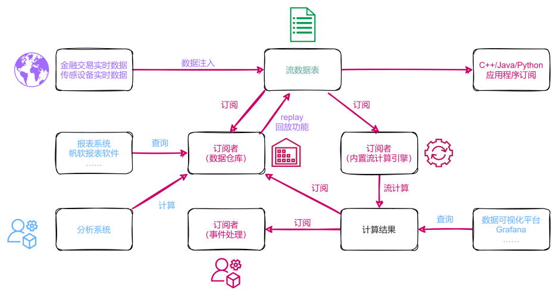
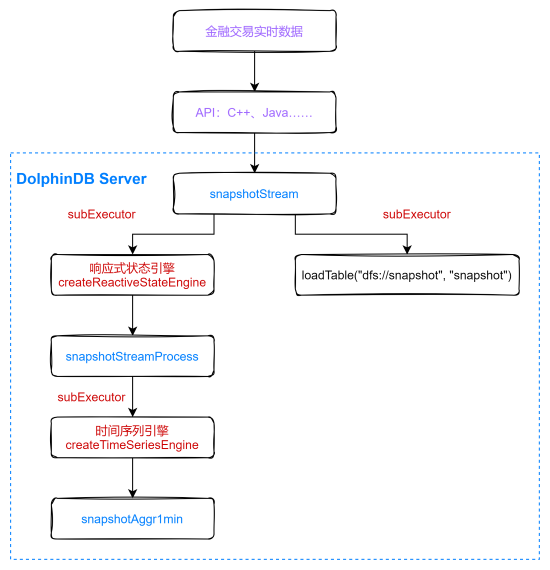
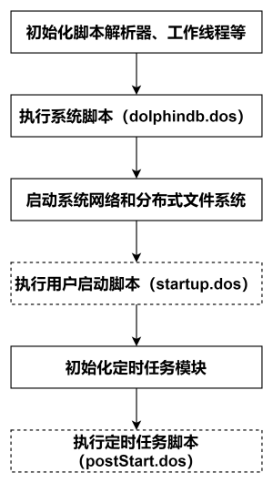
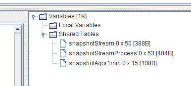
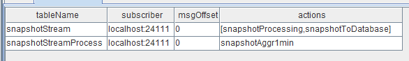
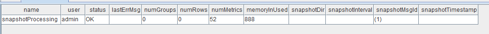
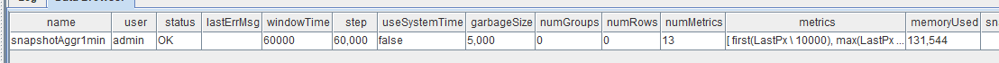
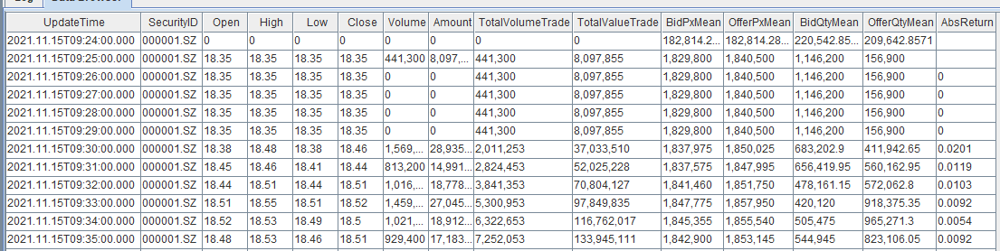
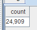
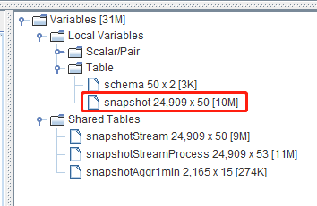

# 节点启动时的流计算自动订阅教程

DolphinDB 内置的流数据框架支持流数据的发布、订阅、预处理、实时内存计算、复杂指标的滚动窗口计算等，是一个运行高效、使用便捷的流数据处理框架。



本教程主要解决基于 DolphinDB 流数据处理框架完成业务代码开发后，如何部署节点启动时的流计算自动订阅问题。

## 1. 业务代码开发

**业务描述**

以金融交易实时 Level2 的股票快照数据为例，实现以下业务需求：

（1）Level2 的股票快照数据实时写入数据库持久化；

（2）根据原始数据的 LastPx、TotalVolumeTrade、TotalValueTrade 的值，处理出每一笔快照数据的一些中间值：如回报率（Return）、成交量（Volume）、成交金额（Amount）；

（3）根据原始数据和处理的中间值生成一些分钟指标。

上述业务在 DolphinDB 中的处理流程如下图所示：



处理流程图说明：

（1）snapshotStream、snapshotStreamProcess、snapshotAggr1min 都是共享的异步持久化流数据表。snapshotStream 用于存储 Level2 的股票快照原始数据，snapshotStreamProcess 用于存储响应式状态引擎处理后的包含中间值的结果数据，snapshotAggr1min 用于存储时间序列引擎处理后的分钟指标数据。将内存表共享的目的是让当前节点所有其它会话对该表可见，API 写入时与 DolphinDB Server 的会话相对于定义这些表的会话不是同一个，所以需要共享。对流数据表的持久化的主要目的有两个，一是控制该表的最大内存占用，通过设置 enableTableShareAndPersistence 函数中的 cacheSize 大小，控制该表在内存中保留的最大记录条数进而控制该表的最大内存占用；二是在节点异常关闭的情况下，从持久化目录恢复已经写入流数据表但是未消费的数据，保证流数据“至少消费一次”的需求。流数据表持久化采用异步的方式进行，可以有效提高流表写入的吞吐量。只有流数据表才可以被订阅消费，所以需要将这些表定义成流数据表。

（2）subExecutor 表示流数据处理线程，可以通过配置文件的 subExecutors 指定节点的最大可用流数据处理线程数。通过设置 subscribeTable 函数中的 hash 参数，指定消费 topic 的流数据处理线程。比如 subExecutor 设置为 n，则 hash 可以从 0 至 n-1 进行指定，对应流数据处理线程 1 至 n。

（3）响应式状态引擎和时间序列引擎是 DolphinDB 的内置的流计算引擎，都已实现增量计算。响应式状态引擎处理了上述业务需求中的中间值，时间序列引擎用于计算生成分钟指标。

（4）loadTable("dfs://snapshot", "snapshot") 用于存储原始数据，做数据的持久化。

**业务代码**

本教程业务代码基于 1.30.15 版本开发，1.30 所有版本都可以运行本教程的示例代码，详细代码内容见附件。

## 2. DolphinDB 系统启动流程

DolphinDB 系统的启动流程如下图所示：



* 系统初始化脚本（dolphindb.dos）

  系统初始化脚本是必需的，默认加载版本发布目录中的 dolphindb.dos，不建议做修改，因为版本升级的时候需要用新版本发布包中的系统初始化脚本覆盖。

* 用户启动脚本（startup.dos）

  用户启动脚本是通过配置参数 startup 后才会执行，单机 single 模式在 dolphindb.cfg 中配置，集群模式在 cluster.cfg 中配置，可配置绝对路径或相对路径。若配置了相对路径或者没有指定目录，系统会依次搜索本地节点的 home 目录、工作目录和可执行文件所在目录。

  配置举例如下:

  ```shell
  startup=/opt/DolphinDB/server/startup.dos
  ```

  将上述业务代码添加到 /opt/DolphinDB/server 目录的 startup.dos 文件中，并在对应的配置文件中配置参数 startup，即可完成节点启动时的流计算自动订阅部署。

* 定时任务脚本（postStart.dos）

  DolphinDB 中通过 scheduleJob 函数定义的定时任务是做持久化的，所以在节点重新启动时，系统会在执行完用户启动脚本后在初始化定时任务模块时完成持久化定时任务的加载。完成上述步骤后，系统会执行定时任务脚本，此时可以在定时任务脚本中调用 scheduleJob 函数定义新的定时任务。本教程中未使用该功能，所以不需要开启该配置项。1.30.15 和 2.00.3 版本开始支持配置 postStart.dos 实现节点启动自动执行定时任务脚本。

## 3 单节点 single 模式部署流计算自动订阅

配置文件 dolphindb.cfg

```shell
localSite=localhost:8848:local8848
mode=single
maxMemSize=128
maxConnections=512
workerNum=8
maxConnectionPerSite=15
newValuePartitionPolicy=add
webWorkerNum=8
dataSync=1
chunkCacheEngineMemSize=8
persistenceDir=/opt/DolphinDB/server/local8848/persistenceDir
startup=/opt/DolphinDB/server/startup.dos
maxPubConnections=64
subExecutors=7
subPort=8849
subThrottle=1
persistenceWorkerNum=1
lanCluster=0
```

启动 DolphinDB Server，执行下述语句观察运行日志 dolphindb.log 中近期的日志：

```shell
tail -1000f /opt/DolphinDB/server/dolphindb.log
```

观察到用户启动脚本中执行成功打印的日志信息：

```shell
2021-12-01 00:23:56.314159 <INFO> :---------------------------------------------------------------------
2021-12-01 00:23:56.314172 <INFO> :dfs://snapshot created successfully !
2021-12-01 00:23:56.314178 <INFO> :---------------------------------------------------------------------
2021-12-01 00:23:56.315084 <INFO> :Prepare to share a stream table: tableName=snapshotStream raftGroup=-1
2021-12-01 00:23:56.315132 <INFO> :enableTablePersistence tableName=snapshotStream hashValue=0 offset=0 cacheSize=5000000
2021-12-01 00:23:56.315163 <INFO> :---------------------------------------------------------------------
2021-12-01 00:23:56.315174 <INFO> :sharedTable1：snapshotStream created  successfully !
2021-12-01 00:23:56.315182 <INFO> :---------------------------------------------------------------------
2021-12-01 00:23:56.315512 <INFO> :Prepare to share a stream table: tableName=snapshotStreamProcess raftGroup=-1
2021-12-01 00:23:56.315534 <INFO> :enableTablePersistence tableName=snapshotStreamProcess hashValue=1 offset=0 cacheSize=5000000
2021-12-01 00:23:56.315549 <INFO> :---------------------------------------------------------------------
2021-12-01 00:23:56.315562 <INFO> :sharedTable2：snapshotStreamProcess created successfully !
2021-12-01 00:23:56.315569 <INFO> :---------------------------------------------------------------------
2021-12-01 00:23:56.315783 <INFO> :Prepare to share a stream table: tableName=snapshotAggr1min raftGroup=-1
2021-12-01 00:23:56.315806 <INFO> :enableTablePersistence tableName=snapshotAggr1min hashValue=2 offset=0 cacheSize=2000000
2021-12-01 00:23:56.315821 <INFO> :---------------------------------------------------------------------
2021-12-01 00:23:56.315833 <INFO> :sharedTable3：snapshotAggr1min created successfully !
2021-12-01 00:23:56.315840 <INFO> :---------------------------------------------------------------------
2021-12-01 00:23:56.316775 <INFO> :---------------------------------------------------------------------
2021-12-01 00:23:56.316793 <INFO> :ReactiveStateEngine：snapshotProcessing created successfully !
2021-12-01 00:23:56.316800 <INFO> :---------------------------------------------------------------------
2021-12-01 00:23:56.316852 <INFO> :Begin to subscription topic=localhost:24110:local24110/snapshotStream/snapshotProcessing
2021-12-01 00:23:56.316888 <INFO> :Enable reconnection for topic=localhost:24110:local24110/snapshotStream/snapshotProcessing site=local24110:1
2021-12-01 00:23:56.316915 <INFO> :[subscribeTable] #attempt=0 topic=localhost:24110:local24110/snapshotStream/snapshotProcessing conn=
2021-12-01 00:23:56.316940 <INFO> :Received a request to publish table [snapshotStream] to site localhost:24111.Offset=-1
2021-12-01 00:23:56.317229 <INFO> :Subscription topic=localhost:24110:local24110/snapshotStream/snapshotProcessing hashValue=0
2021-12-01 00:23:56.317252 <INFO> :---------------------------------------------------------------------
2021-12-01 00:23:56.317259 <INFO> :subscribe1：snapshotStream subscribed successfully !
2021-12-01 00:23:56.317264 <INFO> :---------------------------------------------------------------------
2021-12-01 00:23:56.318486 <INFO> :Begin to subscription topic=localhost:24110:local24110/snapshotStreamProcess/snapshotAggr1min
2021-12-01 00:23:56.318531 <INFO> :Enable reconnection for topic=localhost:24110:local24110/snapshotStreamProcess/snapshotAggr1min site=local24110:1
2021-12-01 00:23:56.318555 <INFO> :[subscribeTable] #attempt=0 topic=localhost:24110:local24110/snapshotStreamProcess/snapshotAggr1min conn=
2021-12-01 00:23:56.318574 <INFO> :Received a request to publish table [snapshotStreamProcess] to site localhost:24111.Offset=-1
2021-12-01 00:23:56.318844 <INFO> :Subscription topic=localhost:24110:local24110/snapshotStreamProcess/snapshotAggr1min hashValue=1
2021-12-01 00:23:56.318871 <INFO> :---------------------------------------------------------------------
2021-12-01 00:23:56.318883 <INFO> :subscribe2：snapshotStreamProcess subscribed successfully !
2021-12-01 00:23:56.318891 <INFO> :---------------------------------------------------------------------
2021-12-01 00:23:56.318942 <INFO> :Begin to subscription topic=localhost:24110:local24110/snapshotStream/snapshotToDatabase
2021-12-01 00:23:56.318968 <INFO> :Enable reconnection for topic=localhost:24110:local24110/snapshotStream/snapshotToDatabase site=local24110:1
2021-12-01 00:23:56.318996 <INFO> :[subscribeTable] #attempt=0 topic=localhost:24110:local24110/snapshotStream/snapshotToDatabase conn=
2021-12-01 00:23:56.319011 <INFO> :Received a request to publish table [snapshotStream] to site localhost:24111.Offset=-1
2021-12-01 00:23:56.319042 <INFO> :Subscription topic=localhost:24110:local24110/snapshotStream/snapshotToDatabase hashValue=2
2021-12-01 00:23:56.319058 <INFO> :---------------------------------------------------------------------
2021-12-01 00:23:56.319065 <INFO> :subscribe3：snapshotStream subscribed successfully !
2021-12-01 00:23:56.319071 <INFO> :---------------------------------------------------------------------
```

如果没有 error 信息提示，且看到用户启动脚本成功执行到了最后一行代码，打印了 `subscribe3：snapshotStream subscribed successfully !` 的信息，说明用户启动脚本成功执行，流计算自动订阅部署成功。

通过 GUI 连接相应的数据节点，执行登录代码：

```
login("admin", "123456")
```

可以在右下角的变量栏观察到持久化流表 snapshotStream、snapshotStreamProcess、snapshotAggr1min 已经成功定义加载：



执行流数据发布表订阅状信息询函数：

```
getStreamingStat().pubTables
```

返回所有订阅信息：



执行响应式状态引擎信息询函数：

```
getStreamEngineStat().ReactiveStreamEngine
```

返回信息：



执行时间序列引擎信息询函数：

```
getStreamEngineStat().TimeSeriesEngine
```

返回信息：



此时，只需要将实时 Level2 的股票快照数据通过 API 写入流数据表 snapshotStream，就会按照上述的业务处理逻辑对流数据进行实时处理。

## 4. DolphinDB 数据回放工具

DolphinDB 提供了便捷的历史数据回放工具，主要是通过 replay 函数实现历史数据的回放功能。

本教程回放的对象是一个内存表数据，包含了 5 只股票某天的历史 Level2 快照数据，csv 文本文件（见附件）的存储路径为：/data/snapshot/stockData.csv，回放的代码如下，在时间维度加速了 1000 倍进行回放：

```
//replay
filePath = "/data/snapshot/stockData.csv"
schema = table(loadTable("dfs://snapshot", "snapshot").schema().colDefs.name as name, loadTable("dfs://snapshot", "snapshot").schema().colDefs.typeString as type)
snapshot = loadText(filename=filePath, schema=schema)
replay(inputTables=snapshot, outputTables=snapshotStream, dateColumn=`Date, timeColumn=`Time, replayRate=1000, absoluteRate=true)
```

大约 26 s 以后，5 只股票某天的历史数据回放完毕，执行下述代码查看某只股票的分钟处理指标：

```
select * from snapshotAggr1min where SecurityID="000001.SZ"
```

查询结果返回至客户端：



同时可以执行下述代码，查询写入数据库的持久化数据的条数：

```
select count(*) from loadTable("dfs://snapshot", "snapshot")
```

查询结果返回至客户端：



观察下图后可知，本次回放的 snapshot 内存表的数据条数是 24909 条，说明写入 snapshotStream 流数据表的所有数据全部被写入数据库完成了数据持久化，未发生数据丢失。



## 5. 总结

本教程主要根据一个金融交易实时 Level2 的股票快照数据流计算案例，结合业务逻辑处理代码详细讲述了节点启动时的流计算自动订阅部署步骤，以及在开发部署过程中的常用调试手段，比如使用 writeLog 函数打印代码调试日志、合理使用 go 语句分段解析并执行代码块、观察节点运行日志判断用户启动脚本的执行情况、通过流数据状态信息查询函数确认订阅信息和流计算引擎的定义情况等。目的是为了提高开发人员在使用 DolphinDB 内置的流数据框架开发流计算业务场景时的开发效率、降低开发难度，同时降低开发完毕的流计算业务代码的自动化部署和运维难度，更好地挖掘 DolphinDB 在复杂实时流计算场景中的价值。

## 附件

[业务代码](script/streaming_auto_sub/startup.dos)

[csv 文本文件](data/streaming_auto_sub/stockData.csv)

