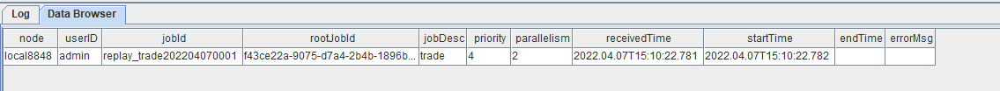
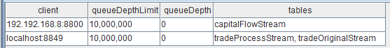
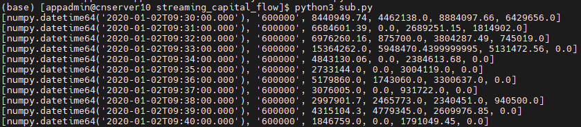
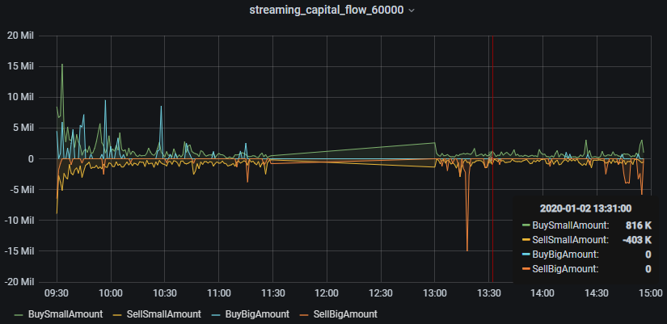

# DolphinDB流计算在金融行业的应用：实时计算分钟资金流

DolphinDB内置的流数据框架支持流数据的发布，订阅，预处理，实时内存计算，复杂指标的滚动窗口计算、滑动窗口计算、累计窗口计算等，是一个运行高效、使用便捷的流数据处理框架。


本教程主要提供一种基于DolphinDB流数据处理框架，实时计算分钟资金流的低延时解决方案。

本教程包含内容：

1. 应用场景描述
2. 开发环境配置
3. 代码开发
4. 结果展示
5. 总结

## 1. 应用场景描述

### 1.1 数据源

本教程基于上交所2020年某日的逐笔成交数据进行代码调试，在DolphinDB中存储的表结构为：

| name        | typeString | comment    |
| ----------- | ---------- | ---------- |
| SecurityID  | SYMBOL     | 股票代码   |
| Market      | SYMBOL     | 交易所     |
| TradeTime   | TIMESTAMP  | 交易时间   |
| TradePrice  | DOUBLE     | 交易价格   |
| TradeQty    | INT        | 成交量     |
| TradeAmount | DOUBLE     | 成交额     |
| BuyNum      | INT        | 买单订单号 |
| SellNum     | INT        | 卖单订单号 |

### 1.2 计算指标

本教程示例代码计算了1分钟滚动窗口的资金流指标：

| **指标名称**    | **含义**                                                 |
| --------------- | -------------------------------------------------------- |
| BuySmallAmount  | 过去1分钟内，买方向小单的成交额，成交股数小于等于50000股 |
| BuyBigAmount    | 过去1分钟内，买方向大单的成交额，成交股数大于50000股     |
| SellSmallAmount | 过去1分钟内，卖方向小单的成交额，成交股数小于等于50000股 |
| SellBigAmount   | 过去1分钟内，卖方向大单的成交额，成交股数大于50000股     |

关于资金流大小单的划分规则，不同的开发者会有不同的定义方法。以常用的股票行情软件为例：

（1）[东方财富](https://emcreative.eastmoney.com/app_fortune/article/extend.html?artcode=20220117100406743919710)

* 超级大单：>50万股或100万元
* 大单：10-50万股或20-100万元
* 中单：2-10万股或4-20万元
* 小单：<2万股或4万元

（2）[新浪财经](http://finance.sina.com.cn/temp/guest4377.shtml)

* 特大单：>100万元
* 大单：20-100万元
* 小单：5-20万元
* 散单：<5万元

包括大智慧、同花顺等，不同软件之间的大小单区分规则都会有差异。

但是判断条件都是基于成交股数或成交金额。

**注意**：本教程中，资金流大小单的判断条件基于成交股数，只划分了大单和小单两种，判断的边界值是随机定义的，开发者必须根据自己的实际场景进行调整。

### 1.3 实时计算方案

本教程通过自定义聚合函数的方法，实时计算资金流，在DolphinDB中的处理流程如下图所示：


处理流程图说明：

（1）tradeOriginalStream、tradeProcessStream、capitalFlowStream都是共享的异步持久化流数据表。

* tradeOriginalStream：用于接收和发布股票逐笔成交实时流数据。
* tradeProcessStream：用于接收和发布响应式状态引擎处理后的中间结果数据。
* capitalFlowStream：用于接收和发布时间序列引擎处理后的1分钟滚动窗口的资金流指标。
* 将内存表共享的目的是让当前节点所有其它会话对该表可见，实时流数据通过API写入DolphinDB流数据表时与DolphinDB Server的会话相对于定义这些表的会话可能不是同一个，所以需要共享。
* 对流数据表进行持久化的目的主要有两个：一是控制该表的最大内存占用，通过设置enableTableShareAndPersistence函数中的cacheSize大小，控制该表在内存中保留的最大记录条数，进而控制该表的最大内存占用；二是在节点异常关闭的极端情况下，从持久化数据文件中恢复已经写入流数据表但是未消费的数据，保证流数据“至少消费一次”的需求。
* 流数据表持久化采用异步的方式进行，可以有效提高流表写入的吞吐量。只有流数据表才可以被订阅消费，所以需要将以上的tradeOriginalStream、tradeProcessStream、capitalFlowStream表定义成流数据表。

（2）subExecutor表示流数据处理线程。

* 通过设置配置文件的subExecutors参数指定节点的最大可用流数据处理线程数。
* 通过设置subscribeTable函数中的hash参数，指定消费该topic的流数据处理线程。例如subExecutors设置为n，则hash可以从0至n-1进行指定，对应流数据处理线程1至n。

（3）响应式状态引擎和时间序列引擎是DolphinDB的内置的高性能流计算引擎。

* 针对常用的统计计算函数都已实现增量计算。
* 在上述场景中，响应式状态引擎对原始数据进行了加工处理，使其满足时间序列引擎处理的输入要求。
* 在上述场景中，时间序列引擎用于计算生成1分钟滚动窗口的资金流指标。

（4）loadTable("dfs://trade_stream", "trade") 用于存储原始数据，做数据的持久化。

（5）loadTable("dfs://trade_stream", "trade") 中存储的历史数据，可以通过DolphinDB内置的replay回放工具进行控速回放。

* 历史数据回放工具可以基于历史数据开发流计算代码的开发场景，验证流计算代码的计算正确性、计算效率等。
* 历史数据回放工具也可以用于将历史数据回放到流计算引擎，进行历史数据的批量计算。

## 2. 开发环境配置

### 2.1 DolphinDB server服务器环境

* CPU类型：Intel(R) Xeon(R) Silver 4216 CPU @ 2.10GHz
* 逻辑CPU总数：8
* 内存：64GB
* OS：64位 CentOS Linux 7 (Core)

### 2.2 DolphinDB server部署

* server版本：1.30.18 或 2.00.6
* server部署模式：单节点
* 配置文件：dolphindb.cfg

```shell
localSite=localhost:8848:local8848
mode=single
maxMemSize=64
maxConnections=512
workerNum=8
maxConnectionPerSite=15
newValuePartitionPolicy=add
webWorkerNum=2
dataSync=1
persistenceDir=/opt/DolphinDB/server/local8848/persistenceDir
maxPubConnections=64
subExecutors=16
subPort=8849
subThrottle=1
persistenceWorkerNum=1
lanCluster=0
```

> 配置参数persistenceDir需要开发人员根据实际环境配置。

单节点部署教程：[单节点部署](https://gitee.com/dolphindb/Tutorials_CN/blob/master/standalone_server.md)

### 2.3 DolphinDB client开发环境

* CPU类型：Intel(R) Core(TM) i7-7700 CPU @ 3.60GHz   3.60 GHz
* 逻辑CPU总数：8
* 内存：32GB
* OS：Windows 10 专业版

* DolphinDB GUI版本：1.30.15

DolphinDB GUI安装教程：[GUI教程](https://www.dolphindb.cn/cn/gui/index.html)

## 3. 代码开发

本教程代码开发工具采用DolphinDB GUI，所有代码均可在DolphinDB GUI客户端开发工具执行。

### 3.1 创建存储历史数据的库表

```
//login account
login("admin", "123456")
//create database and table
dbName = "dfs://trade"
tbName = "trade"
if(existsDatabase(dbName)){
	dropDatabase(dbName)
}
db1 = database(, VALUE, 2020.01.01..2022.01.01)
db2 = database(, HASH, [SYMBOL, 5])
db = database(dbName, COMPO, [db1, db2])
schemaTable = table(
	array(SYMBOL, 0) as SecurityID,
	array(SYMBOL, 0) as Market,
	array(TIMESTAMP, 0) as TradeTime,
	array(DOUBLE, 0) as TradePrice,
	array(INT, 0) as TradeQty,
	array(DOUBLE, 0) as TradeAmount,
	array(INT, 0) as BuyNum,
	array(INT, 0) as SellNum
)
db.createPartitionedTable(table=schemaTable, tableName=tbName, partitionColumns=`TradeTime`SecurityID, compressMethods={TradeTime:"delta"})
```

* 分区原则：建议落在1个最小分区的数据在内存的大小约150MB~500MB，上交所2020年1月2日的股票逐笔成交数据为16325584条，加载到内存的大小约750MB，所以采用组合分区的方法，第一层按天分区，第二层对股票代码按HASH分5个分区，每个分区的全部数据加载到内存后约占用250MB内存空间。
* 创建数据库时，选择DolphinDB的OLAP存储引擎进行数据的存储。
* 创建数据表时，按照分区方法，指定`TradeTime`和`SecurityID`为分区字段，在对大数据集查询时，必须指定`TradeTime`和`SecurityID`的过滤条件，起到分区剪枝的作用。
* DolphinDB默认数据存储的压缩算法为lz4，对于时间、日期类型的数据，建议指定采用delta压缩算法存储，提高存储的压缩比。

### 3.2 导入上交所2020年某日的逐笔成交历史数据

* 历史数据对象为csv文本数据，磁盘空间占用1.2GB。
* 本教程中csv文本数据存储路径：`/hdd/hdd9/data/streaming_capital_flow/20200102_SH_trade.csv`

```
//load data
csvDataPath = "/hdd/hdd9/data/streaming_capital_flow/20200102_SH_trade.csv"
dbName = "dfs://trade"
tbName = "trade"
trade = loadTable("dfs://trade", "trade")
schemaTable = table(trade.schema().colDefs.name as `name, trade.schema().colDefs.typeString as `type)
loadTextEx(dbHandle=database(dbName), tableName=tbName, partitionColumns=`TradeTime`SecurityID, filename=csvDataPath, schema=schemaTable)
```

数据导入完成后，可以执行以下查询语句确认数据是否导入成功：

```
select count(*) from loadTable("dfs://trade", "trade") group by date(TradeTime) as TradeDate
```

执行完后，返回如下信息，说明数据成功导入：

| TradeDate  | count    |
| ---------- | -------- |
| 2020.01.02 | 16051658 |

### 3.3 创建存储实时数据的库表

```
//login account
login("admin", "123456")
//create database and table
dbName = "dfs://trade_stream"
tbName = "trade"
if(existsDatabase(dbName)){
	dropDatabase(dbName)
}
db1 = database(, VALUE, 2020.01.01..2022.01.01)
db2 = database(, HASH, [SYMBOL, 5])
db = database(dbName, COMPO, [db1, db2])
schemaTable = table(
	array(SYMBOL, 0) as SecurityID,
	array(SYMBOL, 0) as Market,
	array(TIMESTAMP, 0) as TradeTime,
	array(DOUBLE, 0) as TradePrice,
	array(INT, 0) as TradeQty,
	array(DOUBLE, 0) as TradeAmount,
	array(INT, 0) as BuyNum,
	array(INT, 0) as SellNum
)
db.createPartitionedTable(table=schemaTable, tableName=tbName, partitionColumns=`TradeTime`SecurityID, compressMethods={TradeTime:"delta"})
```

### 3.4 清理环境并创建相关流数据表

```
// clean up environment
def cleanEnvironment(parallel){
	for(i in 1..parallel){
		try{ unsubscribeTable(tableName=`tradeOriginalStream, actionName="tradeProcess"+string(i)) } catch(ex){ print(ex) }
		try{ unsubscribeTable(tableName=`tradeProcessStream, actionName="tradeTSAggr"+string(i)) } catch(ex){ print(ex) }
		try{ dropStreamEngine("tradeProcess"+string(i)) } catch(ex){ print(ex) }
		try{ dropStreamEngine("tradeTSAggr"+string(i)) } catch(ex){ print(ex) }
	}
	try{ unsubscribeTable(tableName=`tradeOriginalStream, actionName="tradeToDatabase") } catch(ex){ print(ex) }
	try{ dropStreamTable(`tradeOriginalStream) } catch(ex){ print(ex) }
	try{ dropStreamTable(`tradeProcessStream) } catch(ex){ print(ex) }
	try{ dropStreamTable(`capitalFlowStream) } catch(ex){ print(ex) }
	undef all
}
//calculation parallel, developers need to modify according to the development environment
parallel = 3
cleanEnvironment(parallel)
go
//create stream table: tradeOriginalStream
colName = `SecurityID`Market`TradeTime`TradePrice`TradeQty`TradeAmount`BuyNum`SellNum
colType = `SYMBOL`SYMBOL`TIMESTAMP`DOUBLE`INT`DOUBLE`INT`INT
tradeOriginalStreamTemp = streamTable(1000000:0, colName, colType)
try{ enableTableShareAndPersistence(table=tradeOriginalStreamTemp, tableName="tradeOriginalStream", asynWrite=true, compress=true, cacheSize=1000000, retentionMinutes=1440, flushMode=0, preCache=10000) } catch(ex){ print(ex) }
undef("tradeOriginalStreamTemp")
go
setStreamTableFilterColumn(tradeOriginalStream, `SecurityID)
//create stream table: tradeProcessStream
colName = `SecurityID`TradeTime`Num`TradeQty`TradeAmount`BSFlag
colType = `SYMBOL`TIMESTAMP`INT`INT`DOUBLE`SYMBOL
tradeProcessStreamTemp = streamTable(1000000:0, colName, colType)
try{ enableTableShareAndPersistence(table=tradeProcessStreamTemp, tableName="tradeProcessStream", asynWrite=true, compress=true, cacheSize=1000000, retentionMinutes=1440, flushMode=0, preCache=10000) } catch(ex){ print(ex) }
undef("tradeProcessStreamTemp")
go
setStreamTableFilterColumn(tradeProcessStream, `SecurityID)
//create stream table: capitalFlow
colName = `TradeTime`SecurityID`BuySmallAmount`BuyBigAmount`SellSmallAmount`SellBigAmount
colType =  `TIMESTAMP`SYMBOL`DOUBLE`DOUBLE`DOUBLE`DOUBLE
capitalFlowStreamTemp = streamTable(1000000:0, colName, colType)
try{ enableTableShareAndPersistence(table=capitalFlowStreamTemp, tableName="capitalFlowStream", asynWrite=true, compress=true, cacheSize=1000000, retentionMinutes=1440, flushMode=0, preCache=10000) } catch(ex){ print(ex) }
undef("capitalFlowStreamTemp")
go
setStreamTableFilterColumn(capitalFlowStream, `SecurityID)
```

* `parallel`参数是指流计算的并行度，与3.5中的`parallel`参数含义相同。
* `go`语句的作用是对代码分段进行解析和执行。
* `setStreamTableFilterColumn`函数作用是指定流数据表的过滤列，与`subscribeTable`函数的 `filter` 参数配合使用。

### 3.5 注册流计算引擎和订阅流数据表

```
//real time calculation of minute index
defg calCapitalFlow(Num, BSFlag, TradeQty, TradeAmount){
	// You can define the smallBigBoundary by yourself
	smallBigBoundary = 50000
	tempTable1 = table(Num as `Num, BSFlag as `BSFlag, TradeQty as `TradeQty, TradeAmount as `TradeAmount)
	tempTable2 = select sum(TradeQty) as TradeQty, sum(TradeAmount) as TradeAmount from tempTable1 group by Num, BSFlag
	BuySmallAmount = exec sum(TradeAmount) from  tempTable2 where TradeQty<=smallBigBoundary && BSFlag==`B
	BuyBigAmount = exec sum(TradeAmount) from tempTable2 where TradeQty>smallBigBoundary && BSFlag==`B
	SellSmallAmount = exec sum(TradeAmount) from  tempTable2 where TradeQty<=smallBigBoundary && BSFlag==`S
	SellBigAmount = exec sum(TradeAmount) from tempTable2 where TradeQty>smallBigBoundary && BSFlag==`S
	return nullFill([BuySmallAmount, BuyBigAmount, SellSmallAmount, SellBigAmount], 0)
}

//real time calculation of capitalFlow
//calculation parallel, developers need to modify according to the development environment
parallel = 3
for(i in 1..parallel){
	//create ReactiveStateEngine: tradeProcess
	createReactiveStateEngine(name="tradeProcess"+string(i), metrics=[<TradeTime>, <iif(BuyNum>SellNum, BuyNum, SellNum)>, <TradeQty>, <TradeAmount>, <iif(BuyNum>SellNum, "B", "S")>], dummyTable=tradeOriginalStream, outputTable=tradeProcessStream, keyColumn="SecurityID")
	subscribeTable(tableName="tradeOriginalStream", actionName="tradeProcess"+string(i), offset=-1, handler=getStreamEngine("tradeProcess"+string(i)), msgAsTable=true, hash=i-1, filter = (parallel, i-1), reconnect=true)
	//create DailyTimeSeriesEngine: tradeTSAggr
	createDailyTimeSeriesEngine(name="tradeTSAggr"+string(i), windowSize=60000, step=60000, metrics=[<calCapitalFlow(Num, BSFlag, TradeQty, TradeAmount) as `BuySmallAmount`BuyBigAmount`SellSmallAmount`SellBigAmount>], dummyTable=tradeProcessStream, outputTable=capitalFlowStream, timeColumn="TradeTime", useSystemTime=false, keyColumn=`SecurityID, useWindowStartTime=true, forceTriggerTime=60000)
	subscribeTable(tableName="tradeProcessStream", actionName="tradeTSAggr"+string(i), offset=-1, handler=getStreamEngine("tradeTSAggr"+string(i)), msgAsTable=true, batchSize=2000, throttle=1, hash=parallel+i-1, filter = (parallel, i-1), reconnect=true)
}

//real time data to database
subscribeTable(tableName="tradeOriginalStream", actionName="tradeToDatabase", offset=-1, handler=loadTable("dfs://trade_stream", "trade"), msgAsTable=true, batchSize=20000, throttle=1, hash=6, reconnect=true)
```

* `parallel`参数是指流计算的并行度，与3.4中的`parallel`参数含义相同。
* 本教程设置`parallel=3`，表示资金流计算的并行度为3，能够支撑的上游逐笔交易数据的最大流量为10万笔每秒。2022年1月某日，沪深两市全市场股票，在09:30:00开盘时候的逐笔交易数据流量峰值可以达到4.2万笔每秒，所以生产环境部署的时候，为了避免因流量高峰时流处理堆积造成延时增加的现象，可以将`parallel`设置为3，提高系统实时计算的最大负载。

### 3.6 Python API实时订阅计算结果

```python
# -*- coding: utf-8 -*-
"""
DolphinDB python api version: 1.30.17.2
python version: 3.7.8
DolphinDB server version:1.30.18 or 2.00.5
last modification time: 2022.05.12
last modification developer: DolpinDB
"""
import dolphindb as ddb
import numpy as np
from threading import Event

def resultProcess(lst):
    print(lst)
s = ddb.session()
s.enableStreaming(8800)
s.subscribe(host="192.192.168.8", port=8848, handler=resultProcess, tableName="capitalFlowStream", actionName="SH600000", offset=-1, resub=False, filter=np.array(['600000']))
Event().wait()
```

* 执行Python代码前，必须先在DolphinDB server端定义流数据表`capitalFlowStream`，且通过函数`setStreamTableFilterColumn`对该表设置过滤列，配合Python API streaming功能函数`subscribe`的`filte`参数一起使用。
* `s.enableStreaming(8800)`此处8800是指客户端Python程序占用的监听端口，设置任意Python程序所在服务器的空闲端口即可。
* Python API streaming功能函数`subscribe`的`host`和`port`参数为DolphinDB server的IP地址和端口；`handler`参数为回调函数，示例代码自定义了`resultProcess`回调函数，动作为打印实时接收到的数据；`tableName`参数为DolphinDB server端的流数据表，示例代码订阅了`capitalFlowStream`；`offset`参数设置为-1，表示订阅流数据表最新记录；`resub`参数为是否需要自动重连；`filter`表示过滤订阅条件，示例代码订阅了流数据表`capitalFlowStream`中`SecurityID`代码为`600000`的计算结果。

### 3.7 Grafana实时监控资金流向

Grafana配置DolphinDB数据源及监控DolphinDB数据表中数据的教程：[Grafana连接DolphinDB数据源](https://gitee.com/dolphindb/grafana-datasource)

本教程监控每分钟的主买小单资金、主卖小单资金、主买大单资金和主卖大单资金流入情况。

Grafana中的Query代码：

* 主买小单资金

```
select gmtime(TradeTime) as time_sec, BuySmallAmount from capitalFlowStream where SecurityID=`600000
```

* 主卖小单资金（卖方向标记为负数显示）

```
select gmtime(TradeTime) as time_sec, -SellSmallAmount as SellSmallAmount from capitalFlowStream where SecurityID=`600000
```

* 主买大单资金

```
select gmtime(TradeTime) as time_sec, BuyBigAmount from capitalFlowStream where SecurityID=`600000
```

* 主卖大单资金（卖方向标记为负数显示）

```
select gmtime(TradeTime) as time_sec, -SellBigAmount as SellBigAmount from capitalFlowStream where SecurityID=`600000
```

> 因为Grafana默认显示UTC时间，和DolphinDB server内的数据时间存在8个小时时差，所以Grafana中的Query需要用到`gmtime`函数进行时区的转换。

### 3.8 历史数据回放

```
t = select * from loadTable("dfs://trade", "trade") where time(TradeTime) between 09:30:00.000 : 14:57:00.000 order by TradeTime, SecurityID
submitJob("replay_trade", "trade",  replay{t, tradeOriginalStream, `TradeTime, `TradeTime, 100000, true, 1})
getRecentJobs()
```

执行完后，返回如下信息：



如果endTime和errorMsg为空，说明任务正在正常运行中。

### 3.9 流计算状态监控函数

* 流数据表订阅状态查询

```
getStreamingStat().pubTables
```

流数据表被订阅成功后，就可以通过上述监控函数查到具体的订阅信息。执行完后，返回如下信息：


> 表中第二列的数据：
>
> 订阅者（subscriber）为localhost:8849，表示节点内部的订阅，8849为配置文件dolphindb.cfg中的`subPort`参数值；
>
> 订阅者（subscriber）为192.192.168.8:8800，表示Python API发起的订阅，8800是Python代码中指定的监听端口。

* 流数据表发布队列查询

```
getStreamingStat().pubConns
```

当生产者产生数据，实时写入流数据表时，可以通过上述监控函数实时监测发布队列的拥堵情况。执行完后，返回如下信息：



> 实时监测发布队列的拥堵情况时，需要关注的指标是`queueDepth`，即发布队列深度。如果队列深度呈现不断增加的趋势，说明上游生产者实时产生的数据流量太大，已经超过数据发布的最大负载，导致发布队列拥堵，实时计算延时增加。
>
> `queueDepthLimit`为配置文件dolphindb.cfg中的`maxPubQueueDepthPerSite`参数值，表示发布节点的消息队列的最大深度（记录条数）。

* 节点内部订阅者消费状态查询

```
getStreamingStat().subWorkers
```

当流数据表把实时接收到的生产者数据发布给节点内部的订阅者后，可以通过上述监控函数实时监测消费队列的拥堵情况。执行完后，返回如下信息：


> 实时监测消费队列的拥堵情况时，需要关注的指标是每个订阅的`queueDepth`，即消费队列深度。如果某个订阅的消费队列深度呈现不断增加的趋势，说明该订阅的消费处理线程超过最大负载，导致消费队列拥堵，实时计算延时增加。
>
> `queueDepthLimit`为配置文件dolphindb.cfg中的`maxSubQueueDepthPerSite`参数值，表示订阅节点的消息队列的最大深度（记录条数）。

## 4. 结果展示

### 4.1 节点内的计算结果表

计算结果表`capitalFlowStream`，可以通过DolphinDB所有API查询接口实时查询，通过DolphinDB GUI实时查看该表的结果，返回：


### 4.2 Python API实时订阅的计算结果



### 4.3 Grafana实时监控结果



## 5. 总结

本教程基于DolphinDB流数据处理框架，提供了一种实时计算分钟资金流的低延时解决方案。本教程以事件时间驱动窗口计算，DolphinDB也提供机器时间驱动窗口计算，可以在实际开发过程中灵活选择。本教程旨在提高开发人员在使用 DolphinDB 内置的流数据框架开发流计算业务场景时的开发效率、降低开发难度，更好地挖掘 DolphinDB 在复杂实时流计算场景中的价值。

## 附件

**业务代码**

[01.创建存储历史数据的库表并导入数据](script/streaming_capital_flow_order_by_order/01.创建存储历史数据的库表并导入数据.txt)

[02.创建存储实时数据的库表](script/streaming_capital_flow_order_by_order/02.创建存储实时数据的库表.txt)

[03.清理环境并创建相关流数据表](script/streaming_capital_flow_order_by_order/03.清理环境并创建相关流数据表.txt)

[04.注册流计算引擎和订阅流数据表](script/streaming_capital_flow_order_by_order/04.注册流计算引擎和订阅流数据表.txt)

[05.PythonSub](script/streaming_capital_flow_order_by_order/05.PythonSub.py)

[06.历史数据回放](script/streaming_capital_flow_order_by_order/06.历史数据回放.txt)

[07.流计算状态监控函数](script/streaming_capital_flow_order_by_order/07.流计算状态监控函数.txt)

**示例数据**

[20200102_SH_trade.csv](data/streaming_capital_flow_order_by_order/20200102_SH_trade.csv)
