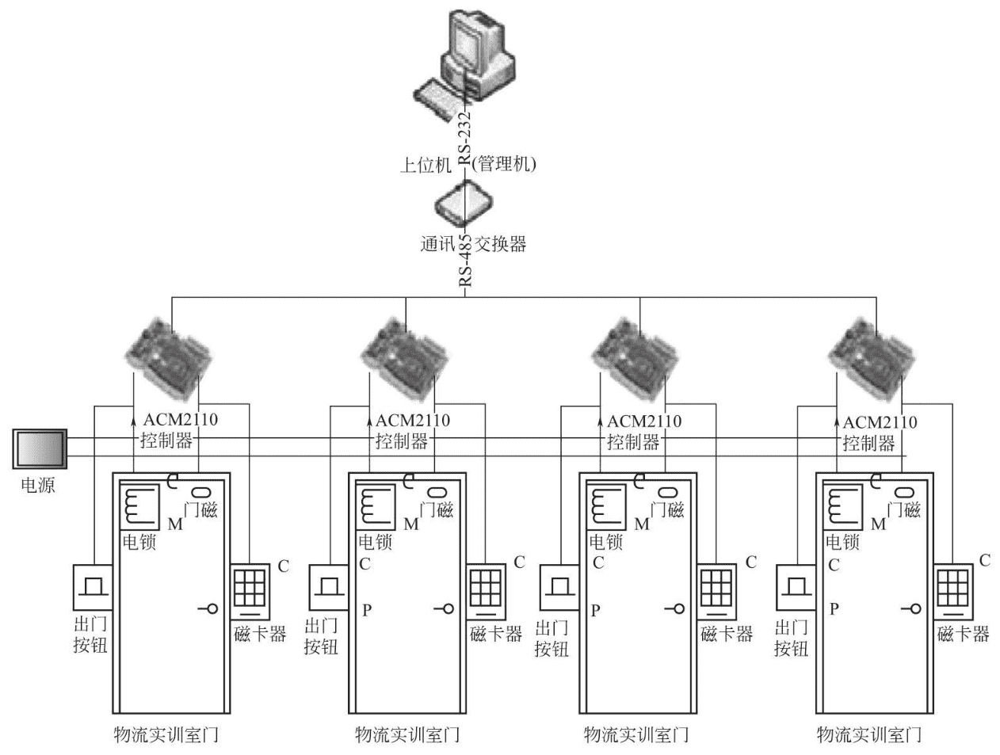
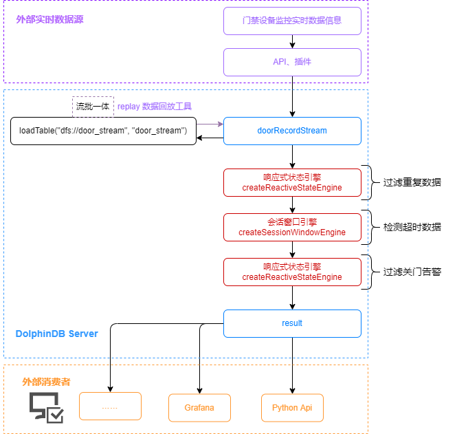

# DolphinDB 流计算应用：引擎级联监测门禁异常状态

物联网的发展为智能安防和自动化监控带来了更多便利，与此同时，新型城镇建设、智慧城市与智慧社区的发展也为门禁管理等安防问题智能化提出了更高的要求。在智能化发展的背景下，门禁不仅仅是门禁，更是一套集成了访客、考勤、消费、巡更、梯控等更多功能的全面便捷的系统安全应用。目前门禁系统主要用于出入口管理，在我国加速推动智慧城市、智慧工地、智慧社区等智慧化建设发展的前提下，门禁系统智能化升级的趋势成为必然，其普及率和使用率也将更加广泛，随着接入门禁系统设备越来越多，对其产生的海量数据进行实时快速的处理也成为了日益重要的问题。DolphinDB 提供了流数据表和流计算引擎用于实时数据处理，为智能安防提供了有力支持。本教程将介绍如何使用流计算引擎多级级联实现对门禁设备异常状态的实时监测。

- [1. 背景介绍](#1-背景介绍)
  - [1.1 行业背景](#11-行业背景)
  - [1.2 真实场景](#12-真实场景)
  - [1.3 DolphinDB优势](#13-dolphindb优势)
- [2. 需求](#2-需求)
- [3. 实验环境](#3-实验环境)
- [4. 设计思路](#4-设计思路)
  - [4.1 使用 DolphinDB 内置流计算引擎监测门禁异常状态](#41-使用-dolphindb-内置流计算引擎监测门禁异常状态)
  - [4.2 设计思路与方案](#42-设计思路与方案)
- [5. 实现步骤](#5-实现步骤)
  - [5.1 定义并共享输入输出流数据表](#51-定义并共享输入输出流数据表)
  - [5.2 创建响应式状态引擎过滤重复数据](#52-创建响应式状态引擎过滤重复数据)
  - [5.3 通过级联会话窗口引擎检测状态超时数据](#53-通过级联会话窗口引擎检测状态超时数据)
  - [5.4 响应式状态引擎过滤关门告警](#54-响应式状态引擎过滤关门告警)
  - [5.5 订阅流数据](#55-订阅流数据)
  - [5.6 从 MQTT 服务器接收数据](#56-从-mqtt-服务器接收数据)
- [6. 模拟写入与验证](#6-模拟写入与验证)
  - [6.1 模拟门禁设备写入数据](#61-模拟门禁设备写入数据)
  - [6.2 验证监测结果准确性](#62-验证监测结果准确性)
- [7. 总结](#7-总结)
- [参考文献](#参考文献)
- [附录](#附录)

## 1. 背景介绍

### 1.1 行业背景

我国新型城镇化建设、智慧城市以及智慧社区的不断发展，给智能安防产业提供了巨大的市场拓展空间。智能安防系统正在向安全、军事、交通、政府、电力、通信、能源、金融、文博、仓库、别墅、工厂等众多行业领域延伸，涵盖广泛的智能化系列产品及解决方案，主要包括智能安防视频分析系统、智能交通视频监控系统、智慧城市智能监控系统、基于异常行为的定制化系统以及计算机视觉分析的前瞻性技术探索等。

根据人们对智能安防系统日益增长的需求，智能安防系统逐渐向指标性能优异、环境适应性强、运行可靠稳定和技术更加兼容的方向发展。常见的智能安防系统一般包含有监控、报警、门禁和远程控制 4 个主要功能，可以单独运行也可统一管理。而门禁则是整个智能安防系统中的基础应用，同时也关系到物联网领域中的公共安全、城市管理、智能家居等多个方面。

### 1.2 真实场景

目前一般的门禁系统工作于客户端/服务器端方式，包含以下功能设置，可以完成事件监控、报警联动。

①门禁、报警综合管理系统服务器：提供集中管理及监控，输出，联动功能。②门禁工作站：门禁工作站提供功能设置及事件监控，可以接上发卡设备作为发卡工作站。③报警输入：每个控制箱具有独立的报警输入接口，接报警输入设备，如红外报警器等。④报警输出：每个控制箱具有独立的报警输出接口，接报警输出设备，如声光报警器等。⑤门禁控制器：是门禁管理系统的核心部分，对系统的卡直接管理及控制相关设备，具有存储功能，可存放持卡人资料及各种事件记录。⑥读卡器：工作于射频方式，采集感应卡的数据传输到门禁控制器，以便控制器进行各种管理及相应的控制。⑦电锁：电子方式开关，实现开门及锁门，由门禁控制器直接控制。⑧开门按钮：提供方便的开门方式。⑨门磁：检测门的状态信息，然后传输到控制器。⑩报警输入输出设备：为加强系统的保安，可以将输入输出设备接入门禁控器的输入输出接口，实现系统的报警及联动。



　图1 工业中心门禁管理系统结构

上图展示了一个常见的门禁管理系统结构，一般而言，报警系统是安防及门禁系统中保障安全问题的重要功能组件及环节，也可以实现与其他监控设备的联防联控。随着接入智能门禁系统的终端越来越多，如何对海量数据进行实时高效计算，及时反馈报警消息，成为智能门禁以及智慧社区建设的关键问题。

### 1.3 DolphinDB优势

DolphinDB 是一款高性能分布式时序数据库，集成了功能强大的编程语言和高容量高速度的流数据分析系统，为海量结构化数据的快速存储、检索、分析及计算提供一站式解决方案，适用于工业物联网领域。DolphinDB 提供的流式计算框架具备高性能实时流数据处理能力，支持毫秒甚至微秒级别数据计算，非常适合用于门禁安防数据的处理和分析。

## 2. 需求

假定有一个监控系统，对所有门禁设备每5秒钟采集1次数据，同时开门或关门的事件会主动上报数据，采集后的数据以 `json` 格式写入 mqtt 服务器，本文使用到的数据示例如下：

```
| recordType | doorEventCode | eventDate           | readerType | sn    | doorNum | card     |
|------------|---------------|---------------------|------------|-------|---------|----------|
| 0          | 11            | 2022.12.01 00:00:00 | false      | a1008 | 1       | ic100000 |
| 1          | 65            | 2022.12.01 00:00:00 | false      | a1010 | 2       | ic100000 |
| 3          | 61            | 2022.12.01 00:00:53 | true       | a1004 | 1       | ic100044 |
| 2          | 66            | 2022.12.01 00:00:53 | true       | a1002 | 2       | ic100020 |
| 2          | 60            | 2022.12.01 00:19:54 | false      | a1008 | 1       | ic100000 |
| 3          | 11            | 2022.12.01 00:19:54 | true       | a1000 | 2       | ic100000 |
| 2          | 66            | 2022.12.01 00:23:21 | true       | a1009 | 1       | ic100082 |
| 2          | 61            | 2022.12.01 00:23:21 | false      | a1006 | 2       | ic100068 |
| 3          | 12            | 2022.12.01 00:45:26 | true       | a1003 | 1       | ic100000 |
| 1          | 11            | 2022.12.01 00:45:26 | false      | a1004 | 2       | ic100000 |
```

本教程实现门禁异常状态检测需要用到的数据字段说明如下：

| **字段名**  | **说明**                                                                                  |
| :---------------- | :---------------------------------------------------------------------------------------------- |
| `doorEventCode` | `事件码``11: 合法开门 12: 密码开门 56: 按钮开门 60: 开门  61: 关门 65: 软件开门 66:软件关门 ` |
| `eventDate`     | `事件时间 `                                                                                   |
| `doorNum`       | `门号 0-4`                                                                                    |

保持门禁正常关闭状态是保证社区或楼宇内居民安全的基础需求之一，因此本案例需要实现的门禁异常状态检测需求是：开门状态连续存在超过5分钟报警。

## 3. 实验环境

实验环境的配置如下：

- 服务器环境：
  - CPU类型：Intel(R) Core(TM) i5-11500 @ 2.70GHz   2.71 GHz
  - 逻辑 CPU 总数：12
  - 内存：16 GB
  - OS：64位 Windows
- DolphinDB server 部署
  - server 版本：2.00.8 Windows 64，社区版
  - 部署模式：单节点模式
- DolphinDB GUI：1.30.14 版本
- MQTT 服务器：[mosquitto-2.0.15](https://gitee.com/link?target=https%3A%2F%2Fmosquitto.org%2Fdownload%2F)

## 4. 设计思路

DolphinDB 的流计算框架目前已提供时序聚合引擎、横截面聚合引擎、异常检测引擎、会话窗口引擎和响应式状态引擎等10余种计算引擎应对不同计算场景。本文主要介绍如何用响应式状态引擎和会话窗口引擎实现门禁异常状态的实时监测。

### 4.1 使用 DolphinDB 内置流计算引擎监测门禁异常状态

- 响应式状态引擎（createReactiveStateEngine）

DolphinDB 流数据引擎所计算的因子可分为无状态因子与有状态因子。无状态因子仅根据最新一条数据即可完成计算，不需要之前的数据，亦不依赖之前的计算结果。有状态因子计算除需要最新的数据，还需要历史数据或之前计算得到的中间结果，统称为“状态”。因此有状态因子计算需要存储状态，以供后续因子计算使用，且每次计算都会更新状态。响应式状态引擎每输入一条数据都将触发一条结果输出，因此输入和输出数据量一致。响应式状态引擎的算子中只能包含向量函数，DolphinDB 针对生产业务中的常见状态算子（滑动窗口函数、累积函数、序列相关函数和 `topN` 相关函数等）进行了优化，大幅提升了这些算子在响应式状态引擎中的计算效率。

- 会话窗口引擎（creatSessionWindowEngine）

会话窗口可以理解为一个活动阶段（数据产生阶段），其前后都是非活动阶段（无数据产生阶段）。会话窗口引擎与时间序列引擎极为相似，它们计算规则和触发计算的方式相同。不同之处在于时间序列引擎具有固定的窗口长度和滑动步长，但会话窗口引擎的窗口不是按照固定的频率产生的，其窗口长度也不是固定的。会话窗口引擎以引擎收到的第一条数据的时间戳作为第一个会话窗口的起始时间。会话窗口收到某条数据之后，若在指定的等待时间内仍未收到下一条新数据，则（该数据的时间戳 + 等待时间）是该窗口的结束时间。窗口结束后收到的第一条新数据的时间戳是新的会话窗口的起始时间。

在物联网领域应用场景中，由于设备在线的时间段不同，可能某些时间段有大量数据产生，而某些时间段完全没有数据。若对这类特征的数据进行滑动窗口计算，无数据的窗口会增加不必要的计算开销。因此 DolphinDB 开发了会话窗口引擎，以解决此类问题。

### 4.2 设计思路与方案

对于本案例的需求，由于门禁监控设备采用轮询方式5秒采集一次数据，在没有新事件上报的时间里，会产生重复记录的数据，因此需要首先对采集数据进行去重处理，再检测出数据中状态持续超时的记录。此时的记录会包括所有状态持续超过 5 分钟的数据，因此仍需将数据接入下一级引擎去除关门告警，只保留开门状态超时报警。根据 DolphinDB 各个引擎的特点，采用响应式状态引擎完成第一个与第三个过滤筛选数据的任务，并通过会话窗口引擎检测出超时数据。将三个引擎级联，实现多级引擎级联检测开门时间大于5分钟的异常门禁状态的流水线处理模式。

在 DolphinDB 中的处理流程如下图所示：



图2 门禁异常状态数据处理流程

## 5. 实现步骤

### 5.1 定义并共享输入输出流数据表

首先定义一个用于实时接收门禁监控设备数据的流数据表，表结构共包含七列，通过 [enableTableShareAndPersistence](https://gitee.com/link?target=https%3A%2F%2Fwww.dolphindb.cn%2Fcn%2Fhelp%2FFunctionsandCommands%2FCommandsReferences%2Fe%2FenableTableShareAndPersistence.html) 函数共享流数据表并持久化到硬盘上。通过 *cacheSize* 参数将内存中可保存的最大数据量设定为10万行。代码如下：

```
st=streamTable(
	array(INT,0) as recordype, //记录类型
	array(INT,0) as doorEventCode, //事件码
    array(DATETIME,0) as eventDate, //事件时间 
    array(BOOL,0) as readerType, //进出类型 1:入 0:出
   	array(SYMBOL,0) as sn, //设备SN号
    array(INT,0) as doorNum, //门号
    array(SYMBOL,0) as card //卡号            
	)
enableTableShareAndPersistence(st,`doorRecord, false, true, 100000, 100, 0);
```

其次定义异常状态流数据表 `outputSt1` ，用于响应式状态引擎的输出，并将其持久化到磁盘上。[createReactiveStateEngine](https://www.dolphindb.cn/cn/help/FunctionsandCommands/FunctionReferences/c/createReactiveStateEngine.html) 响应式状态引擎对输出表的格式有严格要求，它的第一列必须是分组列，其中，根据 `keyColumn` 的设置，输出表的前几列必须和 `keyColumn` 设置的列及其顺序保持一致。在本例中，分组列为门号 `doorNum` ，数据类型为 INT 。之后的两列分别为 DATETIME 类型和 INT 类型，用于记录时间和事件码。创建及共享流数据表代码如下：

```
out1 =streamTable(10000:0,`doorNum`eventDate`doorEventCode,[INT,DATETIME, INT])
enableTableShareAndPersistence(out1,`outputSt,false,true,100000)
```

有关函数及各参数的详细说明，参考 [DolphinDB用户手册](https://www.dolphindb.cn/cn/help/index.html)

### 5.2 创建响应式状态引擎过滤重复数据

响应式状态引擎会对输入的每一条消息做出计算响应，产生一条记录作为结果，计算的结果在默认情况下都会输出到结果表，也就是说输入 n 个消息，输出 n 条记录。如果希望仅输出一部分结果，可以启用过滤条件，只有满足条件的结果才会输出。

下面的例子检查记录数据是否有变化，只有事件类型有变化的记录才会输出。设置分组列为 `doorNum`，输出表各列的顺序为分组列、计算结果列，需要注意保持下一级引擎 `dummyTable` 的 Schema 与该顺序一致。设置 filter 为 `prev(doorEventCode)!=doorEventCode`，这里以元代码的形式表示过滤条件，只有符合过滤条件的结果，即事件码有变化的数据数据才会被输出到通过 `outputTable` 设置的输出表中。两个计算指标为 `eventDate` 和 `doorEventCode`，表示原样输出。

DolphinDB 内置的流计算引擎均实现了数据表（table）的接口，因此多个引擎流水线处理变得异常简单，只要将后一个引擎作为前一个引擎的输出即可。引入流水线处理，可以解决更为复杂的计算问题。在本例中，将输出表通过 `getStreamEngine()` 方法接入下一级会话窗口引擎。具体创建引擎代码如下：

```
reactivEngine1 = createReactiveStateEngine(name=`reactivEngine1,metrics=<[eventDate,doorEventCode]>,
    dummyTable=objByName(`doorRecord),outputTable= getStreamEngine("swEngine"),keyColumn=`doorNum,
    filter=<prev(doorEventCode)!=doorEventCode>)
```

有关函数及各参数的详细说明，参考 [DolphinDB用户手册](https://www.dolphindb.cn/cn/help/index.html)。

### 5.3 通过级联会话窗口引擎检测状态超时数据

首先创建一张内存表，为响应式状态引擎提供输入的表结构，该表结构需要与上一级引擎输出表的结构一致。在会话窗口引擎中，设置分组列 `keyColumn`为门号 `doorNum`，时间列 `timeColumn` 为时间 `eventDate`。检测需求是五分钟内无数据报警，因此 `sessionGap` 为300（单位为秒，同 `eventDate` 列），表示收到某条数据后经过该时间的等待仍无新数据到来，就终止当前窗口。`metrics` 设为 `last(doorEventCode)`，即返回窗口内的最后一条记录数据。设置 `useSessionStartTime` 为 `false`，表示输出表中的时刻为数据窗口结束时刻，即每个窗口中最后一条数据的时刻 + `sessionGap`。订阅流数据后，会话窗口引擎的输入数据为上一级响应式状态引擎的输出，输出作为下一级响应式状态引擎的输入。参考 DolphinDB 用户手册中 [createSessionWindowEngine](https://gitee.com/link?target=https%3A%2F%2Fwww.dolphindb.cn%2Fcn%2Fhelp%2FFunctionsandCommands%2FFunctionReferences%2Fc%2FcreateSessionWindowEngine.html) 页面内容完成对其他参数的设置。代码如下：

```
swOut2 = table(1:0,`doorNum`eventDate`doorEventCode,[INT,DATETIME,INT])
swEngine = createSessionWindowEngine(name="swEngine",sessionGap = 300,metrics=<last(doorEventCode)>,
    dummyTable = objByName(`doorRecord), outputTable = getStreamEngine("reactivEngine"), 
    timeColumn = `eventDate, keyColumn =`doorNum, useSessionStartTime = false)
```

### 5.4 响应式状态引擎过滤关门告警

上级会话窗口引擎获取到的数据包括开门和关门超过5分钟的数据，因此需要再通过响应式状态引擎过滤掉关门状态超时数据，只保留开门告警。与上一级引擎类似，首先同样创建一张内存表，为响应式状态引擎提供输入的表结构，在该响应式状态引擎中，设置分组列 `keyColumn` 为门号 `doorNum` ，两个计算指标为 `eventDate` 和 `doorEventCode`，表示原样输出。filter参数设置为 `doorEventCode in [11,12,56,60,65,67]`，即只输出记录的事件码为开门事件的数据。参考 DolphinDB 用户手册中 [createReactiveStateEngine](https://www.dolphindb.cn/cn/help/FunctionsandCommands/FunctionReferences/c/createReactiveStateEngine.html) 页面内容完成对其他参数的设置。代码如下：

```
swOut1 =table(1:0,`eventDate`doorNum`doorEventCode,[DATETIME,INT, INT])
reactivEngine = createReactiveStateEngine(name=`reactivEngine, metrics=<[eventDate,doorEventCode]>, 
    dummyTable=swOut1,outputTable= objByName(`outputSt),keyColumn= "doorNum",
    filter=<doorEventCode in [11,12,56,60,65,67]>)
```

### 5.5 订阅流数据

过滤了关门告警数据后，订阅流数据表 `doorRecord` 并将 handler 设置为 “向 `reactivEngine1` 中添加数据”，把收到的流数据写入上述会话窗口引擎，`msgAsTable` 设为 `true` ，表示订阅的数据是由列组成的元组。代码如下：

```
subscribeTable(tableName="doorRecord", actionName="monitor", offset=0,
               handler=append!{reactivEngine1}, msgAsTable=true
```

### 5.6 从 MQTT 服务器接收数据

DolphinDB 提供了 [MQTT](https://gitee.com/dolphindb/DolphinDBPlugin/tree/release200/mqtt) 插件用于订阅 MQTT 服务器的数据。DolphinDB server 2.00.8 linux 64 JIT 版本已包含 MQTT 插件在 *server/plugins/mqtt* 目录下，不用下载插件即可直接加载使用。用户可以使用 `mqtt::subscribe` 从 MQTT 服务器订阅数据，在订阅时需要数据格式解析函数，目前插件提供了 `json` 和 `csv` 格式的解析函数，本例使用 `mqtt::createJsonParser` 解析 `json` 格式数据。示例代码如下：

```
loadPlugin(getHomeDir()+"/plugins/mqtt/PluginMQTTClient.txt")
sp = createJsonParser([INT,INT,DATETIME, BOOL,SYMBOL,INT,SYMBOL], 
    `recordType`doorEventCode`eventDate`readerType`sn`doorNum`card)
mqtt::subscribe(host, port, topic, sp, objByName(`doorRecord))
```

## 6. 模拟写入与验证

### 6.1 模拟门禁设备写入数据

下列代码模拟门禁设备写入开门事件与关门事件，每五秒产生一次数据，共产生350条门禁数据记录，非重复记录有7次，超时数据有3条，其中开门超时记录有两条，模拟写入数据代码如下：

```
def duplicateData(mutable st, num, doorCode, time){
    for(i in 0:num){
        eventTime = time
        st.append!(table(rand(0..5,1) as recordType, doorCode as doorEventCode, eventTime as eventDate, rand([true,false],1) as readerType, rand(`a+string(1000..1010),1) as sn, 1 as doorNum, rand(`ic+string(100000..100000),1) as card))
        eventTime = datetimeAdd(eventTime, 5, `s)
    }
}
startEventDate = 2022.12.01T00:00:00
duplicateData(st, 75, 11, startEventDate)
startEventDate=datetimeAdd(startEventDate , 375, `s)
duplicateData(st, 25, 56, startEventDate)
startEventDate=datetimeAdd(startEventDate , 125, `s)
duplicateData(st, 100, 61, startEventDate)
startEventDate=datetimeAdd(startEventDate , 500, `s)
duplicateData(st, 25, 66, startEventDate)
startEventDate=datetimeAdd(startEventDate , 125, `s)
duplicateData(st, 70, 12, startEventDate)
startEventDate=datetimeAdd(startEventDate , 350, `s)
duplicateData(st, 30, 60, startEventDate)
startEventDate=datetimeAdd(startEventDate , 150, `s)
duplicateData(st, 25, 67, startEventDate)
startEventDate=datetimeAdd(startEventDate , 125, `s)
```

### 6.2 验证监测结果准确性

从模拟的数据中查询出开门超时且符合过滤条件的数据，通过 [eqObj()](https://www.dolphindb.cn/cn/help/FunctionsandCommands/FunctionReferences/e/eqObj.html?highlight=eqobj) 方法比较流计算引擎获取到的异常数据与真实异常数据是否相同，从而验证监测结果的准确性。

```
t = select *, deltas(eventDate), prev(doorNum), prev(eventDate), prev(doorEventCode) 
    from doorRecord context by doorNum 
resultTable = select prev_doorNum as doorNum,prev_eventDate+300 as eventDate,
              prev_doorEventCode as doorEventCode from t 
              where deltas_eventDate>= 300 and prev_doorEventCode in [11,12,56,60,65,67] 
              and (prev(eventDate)!=eventDate or prev(doorEventCode)!=doorEventCode)
              order by eventDate
eqObj(resultTable.values(),outputSt1.values())
```

## 7. 总结

在网络与数字技术飞速发展的今天，门禁系统早已不再是单纯的门道及钥匙管理，而是逐渐发展成为一套完整的出入门禁安全管理系统。如今的门禁管理系统集微机自动识别技术和现代安全管理措施为一体，涉及电子、机械、光学、声学、计算机技术、通讯技术、生物技术等诸多新技术，为各类机要部门实现出入口安全防范管理提供了有效措施。

本教程基于 DolphinDB 流数据处理框架，提供了一种实时监测门禁设备异常状态的低延时解决方案，能够有效提升对于海量数据的实时计算效率，满足了门禁系统智能化的计算需求。利用 DolphinDB 流数据处理框架中引擎的流水线处理方式，实现了会话窗口引擎和响应式状态引擎级联，将开发难度大大降低。本教程旨在提高开发人员在使用 DolphinDB 内置的流数据框架开发物联网领域流计算业务场景时的开发效率、降低开发难度，更好地挖掘 DolphinDB 在复杂实时流计算场景中的价值。

## 参考文献

① 《智能化楼宇技术》

② 《安防&智能化》

③ 《智能安防对于智慧社区的重要性》

④ 《浅谈门禁为何是智能家居安防的基础》

⑤ 《智能安防系统在智慧城市中的应用及展望》

⑥ 《浅谈智能化门禁系统的当下与未来》

## 附录

代码： [streaming_engine_anomaly_alerts](script/streaming_engine_anomaly_alerts)
