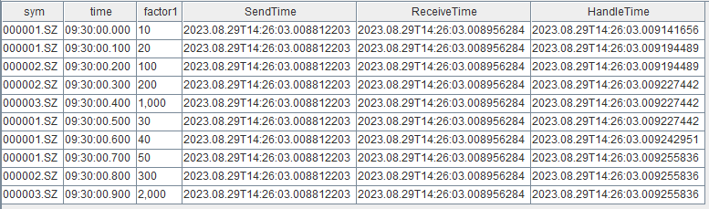
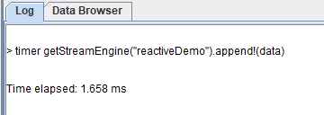
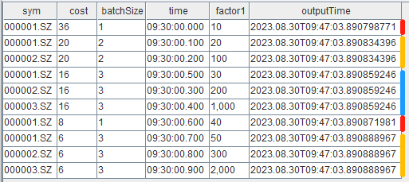
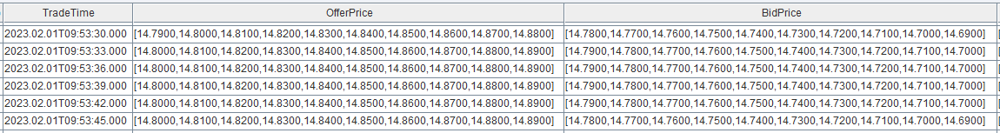

# 《DolphinDB 流计算时延统计与性能优化》

在实时计算中，端到端的响应延迟是衡量计算性能时最重要的指标。DolphinDB 内置的流数据框架支持流数据的发布与订阅、流式增量计算、实时关联等，用户能够快速实现复杂的实时计算任务，达到毫秒级甚至亚毫秒级的效果，而无需编写大量代码。

本文介绍如何对 DolphinDB 流计算任务进行全链路的时延统计，以及如何优化脚本以实现更低时延的实时计算：

- [1. 耗时统计](#1-耗时统计)
  - [1.1 使用 now 函数记录数据处理时刻](#11-使用-now-函数记录数据处理时刻)
  - [1.2 使用 timer 语句快速验证流计算引擎性能](#12-使用-timer-语句快速验证流计算引擎性能)
  - [1.3 使用 outputElapsedMicroseconds 参数统计流计算引擎的耗时明细](#13-使用-outputelapsedmicroseconds-参数统计流计算引擎的耗时明细)
- [2. 性能优化](#2-性能优化)
  - [2.1 写入](#21-写入)
  - [2.2 计算](#22-计算)
  - [2.3 框架](#23-框架)
- [3. 总结](#3-总结)

 


## 1. 耗时统计
在关键链路上记录处理的时刻，可以反映流计算各个环节的时延。此外，DolphinDB 流计算引擎本身还内置了耗时统计功能，可提供更详细的耗时情况，帮助进行分析与进一步性能优化。

### 1.1 使用 now 函数记录数据处理时刻

在数据发布、接收以及计算结果输出时，通过 `now` 函数获取当前时刻，并在数据表中记录数据到达各个环节的时刻。示例脚本如下：

```
// create engine and subscribe
share streamTable(1:0, `sym`time`qty`SendTime, [STRING, TIME, DOUBLE, NANOTIMESTAMP]) as tickStream
result = table(1000:0, `sym`time`factor1`SendTime`ReceiveTime`HandleTime, [STRING, TIME, DOUBLE, NANOTIMESTAMP, NANOTIMESTAMP, NANOTIMESTAMP])
dummyTable = table(1:0, tickStream.schema().colDefs.name join `ReceiveTime, tickStream.schema().colDefs.typeString join `NANOTIMESTAMP) 
rse = createReactiveStateEngine(name="reactiveDemo", metrics =[<time>, <cumsum(qty)>, <SendTime>, <ReceiveTime>, <now(true)>], dummyTable=dummyTable, outputTable=result, keyColumn="sym")
def addHandleTime(mutable msg){
	update msg set ReceiveTime = now(true)
	getStreamEngine("reactiveDemo").append!(msg) 
}
subscribeTable(tableName="tickStream", actionName="addTimestampDemo", offset=-1, handler=addHandleTime, msgAsTable=true)
// generate input data
data1 = table(take("000001.SZ", 5) as sym, 09:30:00.000 + [0, 1, 5, 6, 7] * 100 as time, take(10, 5) as qty)
data2 = table(take("000002.SZ", 3) as sym, 09:30:00.000 + [2, 3, 8] * 100 as time, take(100, 3) as qty)
data3 = table(take("000003.SZ", 2) as sym, 09:30:00.000 + [4, 9] * 100 as time, take(1000, 2) as qty)
data = data1.unionAll(data2).unionAll(data3).sortBy!(`time)
// insert data into engine
update data set SendTime = now(true)
tickStream.append!(data)
```

结果表 result 如下，SendTime 是数据注入发布端流数据表的时刻，ReceiveTime 是订阅端接收到输入数据的时刻，HandleTime 是响应式状态引擎进行因子计算结束的时刻。



在流计算引擎的 *metrics* 参数中使用 `now` 函数需要注意以下几点：
- 在 *metrics* 参数中指定最后一个元素为 now()，表示引擎对该条输出结果计算完成的时刻，不包含将计算结果注入输出表的写入耗时。
- 对于时序聚合引擎、会话窗口引擎等时间窗口聚合引擎(`createTimeSeriesEngine`/`createDailyTimeSeriesEngine`/`createSessionWindowEngine`)，需要注意：
  - 在时间窗口聚合引擎的 *metrics* 参数中可以直接使用 `now` 函数，注意，不要在 `now` 函数外层嵌套聚合函数。
  - 在 2.00.10、1.30.23 之前的版本中，若同时触发了多个分组的结果输出（例如 *useSystemTime*=true ），时间窗口聚合引擎中使用 `now` 函数时对每一个分组都依次获取一次当前时刻。在之后的版本中，优化后的时间窗口聚合引擎使用 `now` 函数时会对同一批输出的全部分组只获取一次当前时刻。

### 1.2 使用 timer 语句快速验证流计算引擎性能 

将一批数据批量注入引擎，通过 `timer` 语句统计从数据注入引擎到本批数据全部计算结束的总耗时。本方法适用于在因子开发和优化阶段快速验证引擎的计算性能。具体实践请参考 [金融因子流式实现教程：4.3 性能测试](Streaming_computing_of_financial_quantifiers.md#43-性能测试) ，文中用 `timer` 语句比较了同一个因子的 4 种不同的实现对应的性能。 

```
timer getStreamEngine("reactiveDemo").append!(data)
```

- `timer` 语句用于计算一条命令的执行时间。
- 对引擎进行 append 操作是同步返回的，即 append 语句执行结束时表示这一批数据在引擎里的处理已经全部结束，因此结合 `timer` 语法可以统计出这一批数据的总计算耗时。
- 值得注意的是，使用本方法时，建议注入批量数据来考察总耗时。
- 若注入少量数据如仅一条数据，则需要考虑输入数据的特征和不同引擎的特性差异。响应式状态引擎由于是逐条触发输出的因此，注入任意一条数据即会触发并输出对应结果条输出，可以反应响应式状态引擎的单次响应时延。但是，若使用时序聚合引擎且选择用非系统事件（*useSystemTime*=false）触发的话，并不是任意一批数据都会触发输出的，单次响应时延需要注入能够触发输出的那一条特定时间戳的数据来测定。

完整的示例脚本如下：

```
// create engine
def sumDiff(x, y) {
	return (x-y)/(x+y)
}
factor1 = <ema(1000 * sumDiff(ema(price, 20), ema(price, 40)),10) -  ema(1000 * sumDiff(ema(price, 20), ema(price, 40)), 20)>
share streamTable(1:0, `sym`time`price, [STRING, TIME, DOUBLE]) as tickStream
result = table(1000:0, `sym`time`factor1, [STRING, TIME, DOUBLE])
rse = createReactiveStateEngine(name="reactiveDemo", metrics =[<time>, factor1], dummyTable=tickStream, outputTable=result, keyColumn="sym")
// generate input data
data1 = table(take("000001.SZ", 100) as sym, 09:30:00 + 1..100 *3 as time, 10+cumsum(rand(0.1, 100)-0.05) as price)
data2 = table(take("000002.SZ", 100) as sym, 09:30:00 + 1..100 *3 as time, 20+cumsum(rand(0.2, 100)-0.1) as price)
data3 = table(take("000003.SZ", 100) as sym, 09:30:00 + 1..100 *3 as time, 30+cumsum(rand(0.3, 100)-0.15) as price)
data.append!(data1.unionAll(data2).unionAll(data3).sortBy!(`time))
// test perfomance
timer getStreamEngine("reactiveDemo").append!(data)
```

在 GUI 中耗时统计如下：



### 1.3 使用 outputElapsedMicroseconds 参数统计流计算引擎的耗时明细

在 2.00.9、1.30.21 及以上版本中，流计算引擎新增了 *outputElapsedMicroseconds* 参数，该参数设置为 true 时表示开启对引擎内部计算耗时明细的统计，统计结果将作为两列输出到结果表中。目前支持该参数的引擎包括`createTimeSeriesEngine`、`createDailyTimeSeriesEngine`、`createReactiveStateEngine`、`createWindowJoinEngine`。示例脚本如下：

```
// create engine
share streamTable(1:0, `sym`time`qty, [STRING, TIME, LONG]) as tickStream
result = table(1000:0, `sym`cost`batchSize`time`factor1`outputTime, [STRING, LONG, INT, TIME, LONG, NANOTIMESTAMP])
rse = createReactiveStateEngine(name="reactiveDemo", metrics =[<time>, <cumsum(qty)>, <now(true)>], dummyTable=tickStream, outputTable=result, keyColumn="sym", outputElapsedMicroseconds=true)
// generate input data
data1 = table(take("000001.SZ", 5) as sym, 09:30:00.000 + [0, 1, 5, 6, 7] * 100 as time, take(10, 5) as qty)
data2 = table(take("000002.SZ", 3) as sym, 09:30:00.000 + [2, 3, 8] * 100 as time, take(100, 3) as qty)
data3 = table(take("000003.SZ", 2) as sym, 09:30:00.000 + [4, 9] * 100 as time, take(1000, 2) as qty)
data = data1.unionAll(data2).unionAll(data3).sortBy!(`time)
// insert data into engine
getStreamEngine("reactiveDemo").append!(data)
```

结果表 result 如下，cost 列和 batchSize 列为耗时明细，cost 列为引擎内部处理时每一个批次的计算耗时（单位：微秒），batchSize 列为同一批次处理的总记录数。

本例向响应式状态引擎注入了一批共 10 条数据，在引擎内部实际上分为了 5 个小的批次处理， 这是响应式状态引擎的特性和输入数据之间的顺序决定的。在同一个分组内响应式状态引擎逐条处理输入数据，同时，不同分组会放到同一批做向量化处理，因此可以看到，第一条分组列为 000001.SZ 的记录单独是一个批次，之后第二条 000001.SZ 和随后的 000002.SZ 在同一批中进行了计算输出。



本次 10 条输入数据注入引擎的总计算耗时：

```
select sum(cost\batchSize) as totalCost from result
```

## 2. 性能优化
在 DolphinDB 流计算框架中，实时数据首先注入到流数据表中，之后基于发布-订阅-消费模型，由发布端主动推送增量的输入数据至消费端，通过回调的方式在消息处理线程上不断执行指定好的消息处理函数进行计算，并将计算结果再写入到表中。纵观整个计算链路，我们发现可以从写入、计算和框架等三个方面进行流计算任务的性能优化。

### 2.1 写入

DolphinDB 流计算框架的核心之一是流数据表，在整个计算链路中往往涉及到多次对流数据表的写入：比如从外部设备或者交易系统等源源不断产生的记录会实时写入流数据表，以作为之后实时计算的输入；此外，流计算引擎的计算结果也需要输出到表中。总之，对表的写入耗时会体现在整体的计算时延上，通过以下方式可以优化写入耗时。

#### 2.1.1 创建表时预分配内存

- 普通共享流数据表

创建时指定足够大的 *capacity* 参数。比如对于股票行情数据可以根据历史数据预估好一天的数据总量，将 *capacity* 设置为略大于该数值。

```
capacity = 1000000
share(streamTable(capacity:0, `sym`time`price, [STRING,DATETIME,DOUBLE]), `tickStream)
```

`streamTable` 函数的 *capacity* 参数是正整数，表示建表时系统为该表分配的内存（以记录数为单位）。当记录数首次超过 *capacity* 时，系统会首先分配 *capacity* 的1.2倍的新的内存空间，然后复制数据到新的内存空间，最后释放原来的内存，再写入新的数据。当记录数继续增加并超过被分配的内存空间时，会再次进行类似的扩容操作。

从时延统计上看，由于扩容涉及到内存分配和复制等较为耗时的操作，因此若某一批数据写入时触发了扩容则会出现一次写入时延的峰值。可以想象，如果 *capacity* 仅仅设置为 1 ，在持续写入的过程中则会发生多次动态扩容，每次的峰值耗时将随总数据量增加而逐渐增高，因为需要拷贝的数据越来越多。

- 持久化流数据表

创建时指定合理的 *cacheSize* 和 *capacity* 参数。在内存充足的情况下，对于股票行情数据可以根据历史数据预估好一天的数据总量，将 *cacheSize* 和 *capacity* 设置为略大于该数值。

```
cacheSize = 1000000
enableTableShareAndPersistence(table=streamTable(cacheSize:0, `sym`time`price, [STRING,DATETIME,DOUBLE]), tableName="tickStream", asynWrite=true, compress=true, cacheSize=cacheSize, retentionMinutes=1440, flushMode=0, preCache=10000)
```

`enableTableShareAndPersistence` 函数的 *cacheSize* 参数是长整型数据类型（long）的整数，表示该表在内存中最多保留多少行，当内存中的行数超过 *cacheSize* 且确认目前的所有数据都已经保存到磁盘后，系统会申请新的内存空间，将内存中后 50% 的数据拷贝到新的内存空间，并释放掉原来的内存。

从时延统计上看，由于清理内存中的过期数据涉及到内存分配、复制等较为耗时的操作，因此若某一批数据写入时触发了清理则会出现一次写入的时延峰值。若内存充足，则可以考虑设置足够大的 *cacheSize* 将全部数据都保留在内存里，不触发清理操作。若需要进行内存控制，则设置合理 *cacheSize* 以平衡峰值出现的频率和单次峰值的大小，因为 *cacheSize* 的大小决定了拷贝的数据量进而会影响单次的耗时。

### 2.2 计算

流计算引擎是 DolphinDB 中专门用于处理实时流计算的模块，不同的流计算引擎对应不同的计算场景，如窗口聚合、事件驱动等。创建流计算引擎需要指定 *metrics* 参数，其为以元代码的形式表示计算公式，引擎的 *metrics* 为实时指标在 DolphinDB 脚本中的实现。针对不同场景选择合适的流计算引擎后，实现高效的实时指标则是降低流计算时延的关键，因此，本章前三小节介绍在流式指标实现上的优化方法，最后一小节介绍在部分计算场景中不必使用流计算引擎的建议。

#### 2.2.1 内置状态函数与增量计算

假设我们接收实时逐笔成交数据，并对每条成交记录逐条响应，累计最新的当日成交总量，如果每一次计算都是用截止当前的全量成交数据，则会响应性能不佳，而通过增量的流式实现则可以大大提升性能。具体的，最新的累计成交总量可以在上一次计算出的成交总量的基础上加上最新的一条成交记录的成交量得到，可以看到，这里的增量计算需要用到历史状态（上一次计算出的成交总量），我们称之为有状态计算。

DolphinDB 在响应式状态引擎、时序聚合引擎、窗口连接引擎中，提供了大量的内置状态函数，在 *metrics* 中使用内置状态函数即可以实现上述的增量有状态计算，而历史状态由引擎内部自动维护。比如，在响应式状态引擎中使用 `cumsum` 函数可以实现增量的累加。

各个引擎已经支持的状态函数请参考用户手册 `createTimeSeriesEngine`、 `createReactiveStateEngine`、`createWindowJoinEngine`，建议优先选择内置状态函数以增量算法实现实时指标。


#### 2.2.2 即时编译 (JIT) 

即时编译 (英文: Just-in-time compilation, 缩写: JIT)，又译及时编译或实时编译，是动态编译的一种形式，可提高程序运行效率。DolphinDB 的编程语言是解释执行，运行程序时首先对程序进行语法分析生成语法树，然后递归执行。在不能使用向量化的情况下，解释成本会比较高。这是由于 DolphinDB 底层由 C++ 实现，脚本中的一次函数调用会转化为多次 C++ 内的虚拟函数调用。JIT 具体介绍请参考 [DolphinDB JIT 教程](jit.md) 。

流计算任务由于不断地被触发计算，因此会反复地调用函数，以 1.3 小节响应式状态引擎的计算为例，仅仅注入 10 条数据便会触发 5 次对 *metrics* 中函数的调用。解释耗时也会反应到整体的计算耗时中，尤其对于响应式状态引擎，在某些场景下总计算耗时中可能大部分为解释耗时，因此，建议通过实现 JIT 版本的函数来减少解释成本 。具体实践请参考 [金融因子流式实现教程：4.2 即时编译 (JIT)](Streaming_computing_of_financial_quantifiers.md#42-即时编译jit) ，文中使用 JIT 优化了移动平均买卖压力指标的性能。


#### 2.2.3 数组向量 (array vector)

DolphinDB 中的数组向量 (array vector) 是一种特殊的向量，用于存储可变长度的二维数组。这种存储方式可以显著简化某些常用的查询与计算。array vector 具体介绍请参考 DolphinDB array vector 教程。



十档量价是行情快照中最重要的信息，实现高频因子时为了让十档量价数据能够方便地实现向量化计算，在 DolphinDB 中可以通过 `fixedLengthArrayVector` 函数组合十档数据。针对这个特点，建议直接使用数组向量 (array vector) 来存储 level 2 行情快照中的十档量价字段，以省去函数实现过程中组装十档数据的步骤，来降低计算延时。具体实践请参考请参考 [金融因子流式实现教程：4.1 数组向量 (array vector)](Streaming_computing_of_financial_quantifiers.md#41-数组向量-array-vector) ，文中使用 array vector 优化了移动买卖压力指标的性能。

#### 2.2.4 自定义函数作为 handler 与无状态计算

并不是所有的计算都需要通过流计算引擎进行，一些简单的无状态计算建议在自定义函数中实现。比如，下例希望在引擎中仅对 9:30 之后的数据进行计算，则可以在 handler 函数中首先对输入数据进行过滤再注入计算引擎。

```
def filterTime(msg){
	tmp = select * from msg where time > 09:30:00.000
	getStreamEngine("reactiveDemo").append!(tmp) 
}
subscribeTable(tableName="tickStream", actionName="demo", offset=-1, handler=filterTime, msgAsTable=true)
```

- 通过多加一层响应式状态引擎也可以实现同样的过滤，但是由于流计算引擎内部计算时进行分组以及维护状态等开销，在这种无状态计算的场景下，自定义函数是比流计算引擎更高效的实现方式。
- 注意，handler 函数每次处理的是增量的数据，即以上脚本中的 msg 变量是订阅端收到的新增的数据，而不是最新的 tickStream 表的全量快照。

### 2.3 框架

在某些场景下，对单个指标的实现已经优化到了极致，但是由于输入数据流量极大，仍然可能导致系统来不及处理，也会表现为相当大的响应时延。若单位时间内输入数据的流量总是大于系统能够处理的流量，则会看到在订阅端的消息处理线程监控表（`getStreamingStat().subWorkers`）中的 queueDepth 数值不断上升，这是流计算任务不健康的表现，需要停止任务并优化。

DolohinDB 流计算任务是通过流数据表、流计算引擎、消息处理线程等不同模块的组合来构建的。流计算任务可以被简单理解为后台线程在反复执行一个计算函数，流计算引擎以及其他自定义函数可以被指定为计算函数，流数据表以发布订阅的方式不断地触发后台线程调用对应的计算函数，每次函数调用的入参是流数据表中新增的一批记录。本小节从搭建流计算任务的框架方面介绍优化方法。

#### 2.3.1 微批处理

使用 `subscribeTable` 时设置适当的 *batchSize* 和 *throttle* 参数，可以达到微批处理的效果，以此来提升吞吐避免阻塞，进而降低时延。这是基于单次处理的耗时并不是随着单次处理的数据量而线性增长的，最典型的场景是实时写入分布式数据库，一次写入 1000 条数据和写入 10 条数据的耗时可能相差无几，那么发挥数据批处理的性能优势则可以降低整体的时延。

 *batchSize* 和 *throttle* 参数均表示了触发消费的条件，这两个条件之间是或的关系。订阅队列中的数据积累到 *batchSize* 设置的量时会触发消费，但是考虑到实际场景中，流量在不同时刻的波动，某些时候可能会长时间达不到 *batchSize* 而不能被消费，因此需要设置 *throttle* 参数，通过等待达到一定的时长来触发消费，消费会对队列中未处理的全部数据进行处理。 *batchSize* 和 *throttle* 参数建议综合考虑输入数据的流量和数据处理的速度进行调整。

此外，请注意以下两点：

- 修改系统配置项（dolphindb.cfg 或者 cluster.cfg）中 *subThrottle*=1 后，*throttle* 才可以被设置为小于1秒。若不修改，则即使在 `subscribeTable` 函数中指定 *throttle* 为 0.001，实际值仍为 1 秒。
- 建议在 `subscribeTable` 时一定要指定 *batchSize* 和 *throttle* 参数。若不指定，则每次处理的数据量为到达订阅队列的一块数据块的大小，而不是队列里的全部数据。举个例子，假设此时订阅队列里的仍未处理的数据有 10 条，它们分别是以 2 条、3 条、5 条的大小分三批到达订阅队列的，那么消息处理线程会依次分三批处理这 10 条数据，而不是批处理一次。因此，若输入数据频繁插入，但是每次插入的记录数较少，则未设置 *batchSize* 和 *throttle* 参数的订阅可能会表现较差。

#### 2.3.2 并行计算

使用 `subscribeTable` 时设置适当的 *hash* 参数，以提升并行度来降低时延。执行 `subscribeTable` 函数相当于为其 *handler* 参数对应的计算函数分配了一个固定的消息处理线程，合理的分配消息处理线程可以尽可能充分里利用 CPU 资源。大致分为以下两类优化建议：

- 将多个不同的流计算任务指定到不同的处理线程
  - 尽量将不同的任务指定到不同的消息处理线程。假设系统中有 3 个流计算任务，若在提交`subscribeTable` 函数时均指定同一个 *hash* 值，则它们会被分配到同一个处理线程中，当同时都有新的消息需要处理时会通过轮转的方式执行计算，这种对计算资源的竞争会影响每一个任务的响应时延。
  - 若任务数过多，超过了消息处理线程数量的上限，则建议至少将复杂任务分配到不同的线程，复杂任务指需要长时间占用线程进行计算的任务。
- 将某一个流计算任务拆分到多个线程上并行处理
  - 若输入数据流量过大，一个线程处理不过来，则建议将数据分发到多个线程上并行处理。实现脚本请参考 [DolphinDB 流计算教程：4.2 并行处理](streaming_tutorial.md#42-并行处理) ，注意，若多个线程均将结果写到同一张共享内存表，那么同时写入时会等待写锁而带来一定的耗时，为了避免这部分等待可以将结果也写入到不同的数据表。
  - 在本文 2.3.4 小节将介绍使用 `dispatchStreamEngine` 进行流数据分发和并行计算，是替代 `subscribeTable` 的更轻量级的数据分发方式。

#### 2.3.3 流计算引擎级联

DolphinDB 中实现复杂计算指标的思路是把指标分解成多个阶段，每一个阶段由一个计算引擎来完成。如果两个引擎之间由一张中间表来承接中间的计算结果，并且由中间表的发布订阅来串联两个引擎，则会存在一定的内存和耗时的开销。因此，DolphinDB 内置的流计算引擎均实现了数据表（table）的接口，允许将后一个引擎作为前一个引擎的输出，称为流计算引擎级联，与通过多个流数据表与多次订阅串联引擎相比，有更好的性能表现。实现脚本请参考 [DolphinDB 流计算教程：4.1 流水线处理](streaming_tutorial.md#41-流水线处理) 

#### 2.3.4 使用流数据分发引擎进行数据分发

在 2.3.2 小节中介绍了将某一个流计算任务拆分到多个线程上并行处理的优化建议，但是通过 `subscribeTable` 进行发布端过滤并提交多个并行任务的方式，可能会因为订阅的客户端太多而导致发布瓶颈，使得并发处理带来的优化受发布瓶颈的影响而减弱，因为在同一个节点上只有一个发布线程。在 1.30.22、2.00.9 以及之后的版本中，新增了流数据分发引擎（`createStreamDispatchEngine`），支持将输入的数据分发到不同的线程，并且在该线程中完成将增量的输入数据注入到对应的输出表的操作，这里的输出表可以指定为流计算引擎。

以下脚本中进行了一次发布订阅，在订阅端的消息处理线程中将数据写入到一个分发引擎中，由该分发引擎将数据按 sym 字段哈希分组后分发到 3 个不同的线程进行实际的计算，计算逻辑由响应式状态引擎定义。

```
//  create engine
share streamTable(1:0, `sym`price, [STRING,DOUBLE]) as tickStream
share streamTable(1000:0, `sym`factor1, [STRING,DOUBLE]) as resultStream
rseArr = array(ANY, 0)
for(i in 0..2){
	rse = createReactiveStateEngine(name="reactiveDemo"+string(i), metrics =<cumavg(price)>, dummyTable=tickStream, outputTable=resultStream, keyColumn="sym")
	rseArr.append!(rse)
}
dispatchEngine=createStreamDispatchEngine(name="dispatchDemo", dummyTable=tickStream, keyColumn=`sym, outputTable=rseArr, mode="buffer", dispatchType="uniform")
//  subscribe
subscribeTable(tableName="tickStream", actionName="dispatch", handler=dispatchEngine, msgAsTable=true)
```

**流数据分发引擎的原理：**

- 分发引擎的参数 *outputTable* 是一个表（或流计算引擎）组成的列表，创建引擎时会创建与之数量相等的多个线程以及多个缓冲队列（或表）。
- 引擎内部的每个线程会负责将缓冲队列中的增量数据注入到对应的输出表（或流计算引擎）。若分发引擎输出到流计算引擎，则此时的计算在分发引擎分配的该线程上进行。
- 分发引擎分配的线程与 `subscribeTable` 函数分配的消息处理线程是两个独立的概念，即分发引擎分配的线程不属于由系统配置参数 *subExecutor* 规定的订阅处理线程。


**流数据分发引擎的使用注意事项：**

- 建议参数 *mode* 使用默认设置 ”buffer”，在 ”buffer”模式下，总是把缓存表里未处理的全部数据进行批量计算，符合 2.3.1 小节建议的微批处理方式。
- 在某些情况下，参数 *dispatchType* 设置为 “hash” 时，可能因为哈希分配不均匀而造成数据倾斜，即某一个线程上处理的数据量过大而成为性能瓶颈。这时，为了优化性能建议使用 “uniform” 分配模式，其会将 key 均匀分配到各个输出表中。
  - “hash” 分配规则的效果等同于使用 `hashBucket` 函数进行分桶，总的桶数确定后，任意一个 key 值经过哈希取模后总是属于固定的一个桶。
  - “uniform” 分配规则是动态分配的，某一个 key 属于哪一个桶受到达引擎的先后顺序影响，每收到一个新的 key 都依次分配其对应的桶。假设一共分 2 个桶，key 值到来的顺序为 A、B、C，则 A 和 C 属于桶1，B 属于桶2。
- 建议分发引擎的线程数不要超过可用的逻辑 CPU 核数，否则频繁的线程切换将会带来一定的开销。

## 3. 总结

本文详细介绍了 DolphinDB 流计算中进行时延统计与性能优化的方法，以期帮助用户更好地分析和优化自己的流计算任务。流计算性能优化的大致思路如下：

- 首先，确保消息处理线程没有堆积，即消费的速率大于上游数据输入的速率。观察订阅端的消息处理线程监控表（`getStreamingStat().subWorkers`）中的 queueDepth 数值，使用各种优化手段提高消息处理的效率，以保证队列深度不会出现持续的增长。
- 其次，在订阅队列没有堆积的前提下，可以通过预分配内存来降低时延的峰值，通过优化算子实现和框架来降低时延的均值。
