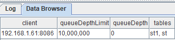
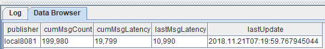
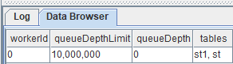
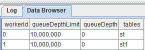
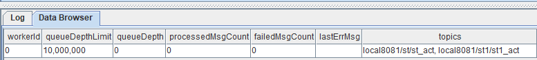
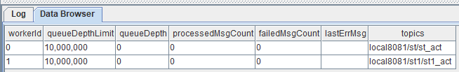
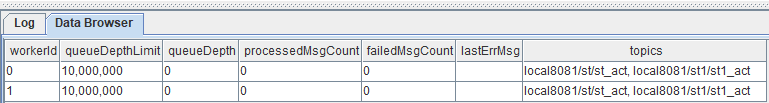
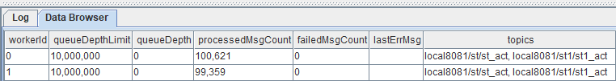
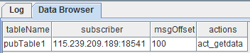
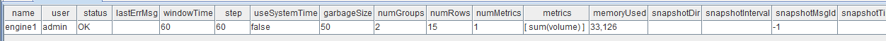

# 流数据教程

实时流处理是指将业务系统产生的持续增长的动态数据进行实时的收集、清洗、统计、入库，并对结果进行实时的展示。在金融交易、物联网、互联网/移动互联网等应用场景中，复杂的业务需求对大数据处理的实时性提出了极高的要求。面向静态数据表的传统计算引擎无法胜任流数据领域的分析和计算任务。

DolphinDB内置的流数据框架支持流数据的发布、订阅、预处理、实时内存计算、复杂指标的滚动窗口计算、实时关联、异常数据检测等，是一个运行高效，使用便捷的流数据处理框架。

与其它流数据系统相比，DolphinDB流数据处理系统的优点在于：
- 吞吐量大，低延迟，高可用。
- 与DolphinDB时序数据库无缝集成，提供一站式解决方案。
- 天然具备流表对偶性，支持使用SQL语句进行数据注入和查询分析。

DolphinDB流数据处理系统提供了多种方便的功能，例如：
- 内置流数据时间序列、横截面、异常检测、响应式状态、连接引擎
- 高频数据回放
- 流数据过滤

本教程将讲述以下有关流数据内容：

- [流数据教程](#流数据教程)
  - [1 流程图及相关概念](#1-流程图及相关概念)
    - [1.1 流数据表](#11-流数据表)
    - [1.2 发布与订阅](#12-发布与订阅)
    - [1.3 流数据计算引擎](#13-流数据计算引擎)
  - [2 核心功能](#2-核心功能)
    - [2.1 流数据发布](#21-流数据发布)
    - [2.2 流数据订阅](#22-流数据订阅)
    - [2.3 断线重连](#23-断线重连)
    - [2.4 发布端数据过滤](#24-发布端数据过滤)
    - [2.5 取消订阅](#25-取消订阅)
    - [2.6 流数据持久化](#26-流数据持久化)
  - [3 数据回放](#3-数据回放)
  - [4 流数据计算引擎](#4-流数据计算引擎)
    - [4.1 流水线处理](#41-流水线处理)
    - [4.2 并行处理](#42-并行处理)
    - [4.3 快照机制](#43-快照机制)
  - [5 高可用](#5-高可用)
    - [5.1 流数据高可用](#51-流数据高可用)
    - [5.2 流计算引擎高可用](#52-流计算引擎高可用)
  - [6 流数据API](#6-流数据api)
  - [7 状态监控](#7-状态监控)
    - [7.1 流数据引擎状态](#71-流数据引擎状态)
  - [8 性能调优](#8-性能调优)
  - [9 可视化](#9-可视化)

## 1 流程图及相关概念

DolphinDB流数据模块采用发布-订阅-消费的模式。流数据首先注入流数据表中，通过流数据表来发布数据，数据节点或者第三方的应用可以通过DolphinDB脚本或API来订阅及消费流数据。


上图展示了DolphinDB的流数据处理框架。把实时数据注入到发布节点流数据表后，发布的数据可同时供多方订阅消费：
- 可由数据仓库订阅并保存，作为分析系统与报表系统的数据源。
- 可由流数据计算引擎订阅，进行计算，并将结果输出到流数据表。计算结果既可以由Grafana等平台进行实时展示，也可以作为数据源再次发布，供二次订阅做事件处理。
- 可由API订阅，例如第三方的Java应用程序可以通过Java API订阅流数据进行业务操作。

### 1.1 流数据表

流数据表是一种特殊的内存表，用以存储及发布流数据。与普通内存表不同，流数据表支持同时读写，且只能添加记录，不可修改或删除记录。数据源发布一条消息等价于向流数据表插入一条记录。与普通内存表相同，可使用SQL语句对流数据表进行查询和分析。

### 1.2 发布与订阅

采用经典的发布订阅模式。每当有新的流数据注入负责发布消息的流数据表时，会通知所有的订阅方处理新的流数据。数据节点使用`subscribeTable`函数来订阅流数据。

### 1.3 流数据计算引擎

流数据计算引擎是专门用于处理流数据实时计算和分析的模块。DolphinDB提供`createTimeSeriesEngine`,`createDailyTimeSeriesEngine`,`createSessionWindowEngine`, `createAnomalyDetectionEngine`, `createReactiveStateEngine`, `createCrossSectionalEngine `, `createAsofJoinEngine`, `createEquiJoinEngine`, `createWindowJoinEngine`, `createLookupJoinEngine`等函数创建流数据计算引擎对流数据进行实时计算，并将计算结果持续输出到指定的数据表中。

*注：自 1.30.21/2.00.9 版本起，`createEqualJoinEngine` 更名为 `createEquiJoinEngine`，原函数名可继续使用。*

## 2 核心功能

要开启支持流数据功能的模块，必须对发布节点指定maxPubConnections配置参数，并对订阅节点指定subPort配置参数。以下为所有流数据相关配置参数。

发布节点的配置参数：

- maxPubConnections: 发布节点可以连接的订阅节点数量上限，默认值为0。只有指定maxPubConnections为正整数后，该节点才可作为发布节点。
- persistenceDir: 保存发布消息的流数据表的文件夹路径。若需要保存流数据表，必须指定该参数。所有生产环境中都强烈推荐设定此参数。若不设定此参数，随着消息的积累，内存会最终耗尽。
- persistenceWorkerNum: 负责以异步模式保存流数据表的工作线程数。默认值为0。
- maxPersistenceQueueDepth: 以异步模式保存流数据表时消息队列的最大深度（记录数量）。默认值为10,000,000。
- maxMsgNumPerBlock: 发布消息时，每个消息块中最多可容纳的记录数量。默认值为1024。
- maxPubQueueDepthPerSite: 发布节点消息队列的最大深度（记录数量）。默认值为10,000,000。

订阅节点的配置参数：

- subPort: 订阅线程监听的端口号，默认值为0。只有指定该参数后，该节点才可作为订阅节点。
- subExecutors: 订阅节点中消息处理线程的数量。默认值为0，表示解析消息线程也处理消息。
- maxSubConnections: 该订阅节点可以连接的的发布节点数量上限。默认值为64。
- subExecutorPooling: 表示执行流计算的线程是否处于pooling模式的布尔值。默认值是false。
- maxSubQueueDepth: 订阅节点消息队列的最大深度（记录数量）。默认值为10,000,000。

### 2.1 流数据发布

使用`streamTable`函数定义一个流数据表。实时数据写入该表后，向所有订阅端发布。由于通常有多个会话中的多个订阅端订阅同一个发布端，所以必须使用`share`函数将流数据表在所有会话中共享后才可发布流数据。未被共享的流数据表无法发布流数据。

定义并共享流数据表pubTable：
```
share streamTable(10000:0,`timestamp`temperature, [TIMESTAMP,DOUBLE]) as pubTable
```

`streamTable`函数创建的流数据表是可以包含重复记录的。如果要创建包含主键的流数据表，可以使用`keyedStreamTable`函数。包含主键的流数据表中，一旦写入某键值的数据，后续相同键值的数据不会写入此流数据表，将被丢弃。

```
share keyedStreamTable(`timestamp, 10000:0,`timestamp`temperature, [TIMESTAMP,DOUBLE]) as pubTable
```

可以用undef函数或者dropStreamTable删除上述语句创建的共享流数据表pubTable：

```
undef(`pubTable, SHARED)
dropStreamTable(`pubTable)
```

undef函数能够将变量或者函数定义从内存中释放。但是，若要删除2.6节的持久化流数据表，则必须使用dropStreamTable函数。此外，用户需要在取消所有订阅后才能删除相应的流数据表，取消订阅请参考2.5节。

### 2.2 流数据订阅

订阅流数据通过[`subscribeTable`](https://www.dolphindb.cn/cn/help/FunctionsandCommands/FunctionReferences/s/subscribeTable.html)函数来实现。
```
subscribeTable([server],tableName,[actionName],[offset=-1],handler,[msgAsTable=false],[batchSize=0],[throttle=1],[hash=-1],[reconnect=false],[filter],[persistOffset=false],[timeTrigger=false],[handlerNeedMsgId=false],[raftGroup],[userId=""],[password=""])
```
参数说明：

- 只有tableName和handler两个参数是必需的，其它所有参数均为可选参数。

- server 为字符串，表示流数据所在服务器的别名或远程连接handle。如果未指定或者为空字符串，表示流数据所在服务器是本地实例。

实际情况中，发布者与订阅者所在节点的关系有以下三种可能。这三种情况下的server参数设置分别为：

1. 发布者与订阅者是同一节点，均为本地实例：参数server不设置或使用空字符串。
```
subscribeTable(tableName="pubTable", actionName="act1", offset=0, handler=subTable, msgAsTable=true)
```
2. 发布者与订阅者是同一集群内的不同节点：参数server使用发布节点别名。
```
subscribeTable(server="NODE2", tableName="pubTable", actionName="act1", offset=0, handler=subTable, msgAsTable=true)
```
3. 发布者与订阅者不在同一个集群内：参数server使用发布节点的远程连接handle。
```
pubNodeHandler=xdb("192.168.1.13",8891)
subscribeTable(server=pubNodeHandler, tableName="pubTable", actionName="act1", offset=0, handler=subTable, msgAsTable=true)
```
- tableName：被订阅的流数据表名。该表必须为共享的流数据表。
```
subscribeTable(tableName="pubTable", actionName="act1", offset=0, handler=subTable, msgAsTable=true)
```
- actionName：一个字符串，表示订阅任务的名称。同一份流数据可以被多项任务订阅消费，既可用于实时运算，亦可存储到数据仓库供第三方应用做批处理。如果一个节点有多个订阅均订阅了同一张表，必须指定actionName。
```
topic1 = subscribeTable(tableName="pubTable", actionName="realtimeAnalytics", offset=0, handler=subTable, msgAsTable=true)
topic2 = subscribeTable(tableName="pubTable", actionName="saveToDataWarehouse", offset=0, handler=subTable, msgAsTable=true)
```
`subscribeTable`函数的返回值是订阅主题，它是订阅表所在节点的别名、流数据表名称和订阅任务名称（如果指定了actionName）的组合，使用"/"分隔。若当前节点别名为NODE1，上述例子返回的两个topic内容如下:

topic1:
```
NODE1/pubTable/realtimeAnalytics
```
topic2:
```
NODE1/pubTable/saveToDataWarehouse
```
如果订阅主题已经存在，将抛出异常。

- offset：订阅任务从流数据表的哪一行开始。如果未指定或设为-1，订阅将会从未来的新数据开始。如果offset=-2，系统会自动获取持久化到磁盘上的offset，并从该位置开始订阅。offset的值永远与流数据表创建时的第一行对应。如果某些行因为内存限制被删除，在决定订阅开始的位置时，这些行仍然考虑在内。

下例说明offset的作用。向pubTable写入100行数据，建立两个订阅：
```
share streamTable(10000:0,`timestamp`temperature, [TIMESTAMP,DOUBLE]) as pubTable
share streamTable(10000:0,`ts`temp, [TIMESTAMP,DOUBLE]) as subTable1
share streamTable(10000:0,`ts`temp, [TIMESTAMP,DOUBLE]) as subTable2
vtimestamp = 1..100
vtemp = norm(2,0.4,100)
tableInsert(pubTable,vtimestamp,vtemp)
topic1 = subscribeTable(tableName="pubTable", actionName="act1", offset=-1, handler=subTable1, msgAsTable=true)
topic2 = subscribeTable(tableName="pubTable", actionName="act2", offset=50, handler=subTable2, msgAsTable=true)
```
从结果可以看到，subTable1没有数据，而subTable2有50条数据。当offset为-1时，只有当新数据进入发布表时才能订阅到数据。

- handler：一元函数或数据表。若为函数，用于处理订阅数据，其唯一的参数是订阅的数据。订阅的数据可以以数据表或元组（订阅数据表的每个列是元组的一个元素）的形式注入handler。由于经常需要把订阅数据插入到数据表，为了方便使用，handler也可以是一个数据表，订阅数据直接插入到该表中。

下例展示handler的两种用法。在act1订阅中，直接把订阅数据写入subTable1；在act2订阅中，订阅数据通过自定义函数myHandler进行过滤后写入subTable2。
```
def myhandler(msg){
	t = select * from msg where temperature>0.2
	if(size(t)>0)
		subTable2.append!(t)
}
share streamTable(10000:0,`timestamp`temperature, [TIMESTAMP,DOUBLE]) as pubTable
share streamTable(10000:0,`ts`temp, [TIMESTAMP,DOUBLE]) as subTable1
share streamTable(10000:0,`ts`temp, [TIMESTAMP,DOUBLE]) as subTable2
topic1 = subscribeTable(tableName="pubTable", actionName="act1", offset=-1, handler=subTable1, msgAsTable=true)
topic2 = subscribeTable(tableName="pubTable", actionName="act2", offset=-1, handler=myhandler, msgAsTable=true)

vtimestamp = 1..10
vtemp = 2.0 2.2 2.3 2.4 2.5 2.6 2.7 0.13 0.23 2.9
tableInsert(pubTable,vtimestamp,vtemp)
```
从结果可以看到写入pubTable10条数据，subTable1全部接收了；而subTable2接收到9条数据，因为myhandler过滤掉了vtemp = 0.13这一条数据。

- msgAsTable：布尔值，表示订阅的数据以何种形式进入handler。若设为true，表示订阅的数据以table的形式注入handler，可使用SQL语句处理。默认值是false，表示订阅的数据是由列组成的元组。

```
def myhandler1(table){
	subTable1.append!(table)
}
def myhandler2(tuple){
	tableInsert(subTable2,tuple[0],tuple[1])
}
share streamTable(10000:0,`timestamp`temperature, [TIMESTAMP,DOUBLE]) as pubTable
share streamTable(10000:0,`ts`temp, [TIMESTAMP,DOUBLE]) as subTable1
share streamTable(10000:0,`ts`temp, [TIMESTAMP,DOUBLE]) as subTable2

topic1 = subscribeTable(tableName="pubTable", actionName="act1", offset=-1, handler=myhandler1, msgAsTable=true)
topic2 = subscribeTable(tableName="pubTable", actionName="act2", offset=-1, handler=myhandler2, msgAsTable=false)

vtimestamp = 1..10
vtemp = 2.0 2.2 2.3 2.4 2.5 2.6 2.7 0.13 0.23 2.9
tableInsert(pubTable,vtimestamp,vtemp)
```
- batchSize：一个整数。若为正数，表示未处理消息的数量达到batchSize时，handler才会处理消息。若未指定或为非正数，每一批次的消息到达之后，handler就会马上处理。

下例中，batchSize设置为11。 
```
share streamTable(10000:0,`timestamp`temperature, [TIMESTAMP,DOUBLE]) as pubTable
share streamTable(10000:0,`ts`temp, [TIMESTAMP,DOUBLE]) as subTable1
topic1 = subscribeTable(tableName="pubTable", actionName="act1", offset=-1, handler=subTable1, msgAsTable=true, batchSize=11)
vtimestamp = 1..10
vtemp = 2.0 2.2 2.3 2.4 2.5 2.6 2.7 0.13 0.23 2.9
tableInsert(pubTable,vtimestamp,vtemp)

print size(subTable1)
```
先向pubTable写入10条数据，订阅表subTable1此时为空。
```
insert into pubTable values(11,3.1)
print size(subTable1)
```
接着向pubTable写入1条数据。订阅表subTable1此时有11条数据。

- throttle：一个浮点数，表示继上次handler处理消息之后，若batchSize条件一直未达到，多久后再次处理消息。以秒为单位，默认值为1。如果没有指定batchSize，throttle即使指定，也不起作用。若throttle小于配置参数subThrottle/1000，throttle的效果等同于其被指定为subThrottle/1000。

handler处理一条数据与批量处理多条（例如1000条）数据的耗时差别很小。若每一条数据注入handler时都要处理一次，在写入速度极高的情况下有可能导致数据消费能力慢于数据写入速度，不仅不能及时处理所有数据，而且会造成数据不断堆积在订阅端缓冲区而耗光内存。合理设置batchSize与throttle参数，可通过调整handler处理消息的频率，以提升吞吐量。

- hash：一个非负整数，指定某个订阅线程处理消息。如果没有指定该参数，系统会自动分配一个线程，优先分配没有订阅的线程。若需要在多个订阅的处理过程中保持消息数据的同步，可以将多个订阅的hash值设置为相同，这样就能使用同一个线程来同步处理多个数据源，不会出现数据处理有先后而导致结果误差。
- reconnect是一个布尔值。默认值为false，表示如果网络异常等问题导致订阅中断，订阅端不会自动重新订阅；如果设为true，订阅端会在网络恢复正常时，自动从中断位置重新订阅。如果发布端崩溃或关闭导致订阅中断，那么订阅端会不断尝试重新订阅，直到能够重新与发布端建立连接。若发布端对流数据表启用了持久化，那么发布端重启后会首先读取硬盘上持久化的数据，直到发布端读取到订阅中断位置的数据，订阅端才能成功重新订阅。若发布端没有对流数据表启用持久化，那么重新订阅将会失败。订阅端不保存订阅信息，如果订阅端崩溃或关闭导致订阅中断，即使设置了reconnect=true，订阅端重启后也无法自动重新订阅。
- filter 参数需要配合`setStreamTableFilterColumn`函数一起使用。使用`setStreamTableFilterColumn`指定流数据表的过滤列，流数据表过滤列在filter中的数据才会发布到订阅端，不在filter中的数据不会发布。filter不支持过滤BOOL类型数据。filter 参数可以使用以下三种方法指定。其中范围过滤与哈希过滤于1.30.3版本发布。

  - 值过滤：一个向量。
  - 范围过滤：一个数据对。范围包含下限值，但不包括上限值。
  - 哈希过滤：一个元组。第一个元素表示bucket的个数；第二个元素是一个标量或数据对，其中标量表示bucket的索引（从0开始），数据对表示bucket的索引范围（包含下限值，但不包括上限值）。
- persistOffset是一个布尔值，表示是否持久化保存本次订阅已经处理的数据的偏移量，默认值为false。持久化保存的偏移量用于重订阅，可通过`getTopicProcessedOffset`函数获取。
- timeTrigger是一个布尔值。若设为true，表示即使没有新的消息进入，handler也会在throttle参数所设定的时间间隔被触发。
- handlerNeedMsgId是一个布尔值，默认值为false。若设为true，handler必须支持两个参数：一个是msgBody，一个是msgId。调用handler时，传入消息以及消息的偏移量。一个例子为函数`appendMsg`。若设为false，handler仅支持一个参数：msgBody。调用handler时，只传入消息本身。
- raftGroup是 raft 组的 ID。设置该参数表示开启订阅端高可用，不设置则表示普通订阅。设置 *raftGroup* 参数以指定 raft 组后，在对应 raft 组内 leader 发生切换时，新的 leader会 重新订阅。

### 2.3 断线重连

DolphinDB的流数据订阅提供了自动重连的功能。如果要启用自动重连，发布端必须对流数据持久化。启用持久化请参考2.6节。当reconnect参数设为true时，订阅端会记录流数据的offset，连接中断时订阅端会从offset开始重新订阅。如果订阅端关闭或者发布端没有对流数据持久化，订阅端无法自动重连。

### 2.4 发布端数据过滤

发布端可以过滤数据，只发布符合条件的数据。使用`setStreamTableFilterColumn`指定流数据表的过滤列（目前仅支持对一个列进行过滤），过滤列的值在filter中的数据会发布到订阅端，不在filter指定值中的数据不会发布。有关filter参数的介绍请见2.2小节。

下例中，值过滤的filter值是一个向量。发布端上的流数据表trades只发布symbol为IBM或GOOG的数据：

```
share streamTable(10000:0,`time`symbol`price, [TIMESTAMP,SYMBOL,INT]) as trades
setStreamTableFilterColumn(trades, `symbol)
trades_1=table(10000:0,`time`symbol`price, [TIMESTAMP,SYMBOL,INT])

filter=symbol(`IBM`GOOG)

subscribeTable(tableName="trades", actionName="trades_1", handler=append!{trades_1}, msgAsTable=true, filter=filter)
```

范围过滤的filter值是一个数据对。发布端上的流数据表trades只发布price大于等于1且小于100的数据：

```
share streamTable(10000:0,`time`symbol`price, [TIMESTAMP,SYMBOL,INT]) as trades
setStreamTableFilterColumn(trades, `price)
trades_1=table(10000:0,`time`symbol`price, [TIMESTAMP,SYMBOL,INT])

subscribeTable(tableName="trades", actionName="trades_1", handler=append!{trades_1}, msgAsTable=true, filter=1:100)
```

哈希过滤的filter值是一个元组。发布端上的流数据表trades对于symbol列使用哈希函数分为10个bucket，bucket索引从0开始，只发布索引大于等于1且小于5的数据：

```
share streamTable(10000:0,`time`symbol`price, [TIMESTAMP,SYMBOL,INT]) as trades
setStreamTableFilterColumn(trades, `symbol)
trades_1=table(10000:0,`time`symbol`price, [TIMESTAMP,SYMBOL,INT])

subscribeTable(tableName="trades", actionName="trades_1", handler=append!{trades_1}, msgAsTable=true, filter=(10,1:5))
```

### 2.5 取消订阅

每一次订阅都由一个订阅主题topic作为唯一标识。如果订阅时topic已存在，那么会订阅失败，需要通过`unsubscribeTable`函数取消订阅才能再次订阅。

取消订阅示例如下：

取消订阅一个本地表：
```
unsubscribeTable(tableName="pubTable", actionName="act1")
```
取消订阅一个远程表：
```
unsubscribeTable(server="NODE_1", tableName="pubTable", actionName="act1")
```
取消订阅一个本地表，但保留offset，以便下次从这个offset继续订阅：

```
unsubscribeTable(tableName="pubTable", actionName="act1", removeOffset=false)
```

从节点的内存中删除给定topic的offset：

```
removeTopicOffset(topic)
```

### 2.6 流数据持久化

默认情况下，流数据表把所有数据保存在内存中。基于以下三点考量，可将流数据持久化到磁盘。
- 流数据的备份和恢复。当节点出现异常重启时，持久化的数据会在重启时自动载入到流数据表。
- 避免内存不足。
- 可以从任意位置开始重新订阅数据。

可事先设定一个界限值。若流数据表的行数达到设定的界限值，前面一半的记录行会持久化到磁盘。持久化的数据支持重订阅，当订阅指定offset时，offset的计算包含持久化的数据。

要持久化流数据表，在发布节点首先需要设置持久化路径参数persistenceDir:
```
persistenceDir = /data/streamCache
```
然后执行[`enableTableShareAndPersistence`](https://www.dolphindb.cn/cn/help/FunctionsandCommands/CommandsReferences/e/enableTableShareAndPersistence.html)函数。下面的示例将pubTable共享为sharedPubTable，并把sharedPubTable持久化到磁盘。其中参数cacheSize=1000000，asynWrite与compress默认值均为true，表示当流数据表数据量达到100万行时启用持久化，将其中50%的数据采用异步方式压缩保存到磁盘。
```
pubTable=streamTable(10000:0,`timestamp`temperature, [TIMESTAMP,DOUBLE])
enableTableShareAndPersistence(table=pubTable, tableName=`sharedPubTable, cacheSize=1000000, preCache=500000)
```

若执行`enableTableShareAndPersistence`时，磁盘上已经存在sharedPubTable表的持久化数据，那么系统会加载最新的preCache=500000行记录到内存中。

对于持久化是否启用异步，需要在持久化数据一致性和性能之间作权衡。当流数据的一致性要求较高时，可以使用同步方式，这样可以保证持久化完成以后，数据才会进入发布队列；若对实时性要求较高，不希望磁盘IO影响到流数据的实时性，则可启用异步方式。只有启用异步方式时，持久化工作线程数persistenceWorkerNum配置项才会起作用。若有多个发布表需要持久化，增加persistenceWorkerNum的配置值可以提升异步保存的效率。

当不需要保存在磁盘上的流数据时，通过`clearTablePersistence`函数可以删除持久化数据：
```
clearTablePersistence(pubTable)
```
关闭持久化，可以使用[`disableTablePersistence`](https://www.dolphindb.cn/cn/help/FunctionsandCommands/CommandsReferences/d/disableTablePersistence.html)函数：
```
disableTablePersistence(pubTable)
```

使用`getPersistenceMeta`函数获取流数据表的持久化细节情况：
```
getPersistenceMeta(pubTable);
```
输出的结果是一个字典，有以下内容：
```
//内存中的数据记录数
sizeInMemory->0
//启用异步持久化
asynWrite->true
//流数据表总记录数
totalSize->0
//启用压缩存储
compress->true
//当前内存中数据相对总记录数的偏移量，在持久化运行过程中遵循公式 memoryOffset = totalSize - sizeInMemory
memoryOffset->0
//已经持久化到磁盘的数据记录数
sizeOnDisk->0
//日志文件的保留时间，默认值是1440分钟，即一天。
retentionMinutes->1440
//持久化路径
persistenceDir->/hdd/persistencePath/pubTable
//hashValue是对本表做持久化的工作线程标识。
hashValue->0
//磁盘上第一条数据相对总记录数的偏移量。例如，若diskOffset=10000，表示目前磁盘上的持久化流数据从第10000条记录开始。
diskOffset->0
```

调用dropStreamTable函数删除持久化流数据表，内存中和磁盘上的流数据均会被清除：

```
dropStreamTable(`pubTable);
```

## 3 数据回放

DolphinDB提供了`replay`函数，可以将历史数据按照时间顺序导入流数据表中。具体教程请参考[流数据回放教程](historical_data_replay.md)。

## 4 流数据计算引擎

DolphinDB提供`createTimeSeriesEngine`,`createDailyTimeSeriesEngine`,`createSessionWindowEngine`, `createAnomalyDetectionEngine`, `createReactiveStateEngine`, `createCrossSectionalEngine `, `createAsofJoinEngine`, `createEquiJoinEngine`, `createWindowJoinEngine`, `createLookupJoinEngine`等函数创建流数据计算引擎对流数据进行实时计算。

创建响应式状态引擎：

```
rse = createReactiveStateEngine(name="reactiveDemo", metrics =<cumsum(price)>, dummyTable=tickStream, outputTable=result, keyColumn="sym", snapshotDir= "/home/data/snapshot", snapshotIntervalInMsgCount=20000)
```

调用dropStreamEngine函数释放流数据引擎：

```
dropStreamEngine("reactiveDemo")
```

此外，DolphinDB流计算引擎还包括流水线处理、并行处理、快照机制等重要特性。

:bulb:**注意**：DolphinDB当前版本(截止于1.30.21/2.00.9版本)暂不支持对流计算引擎的并发访问（例如，两个输入表并发写入同一引擎）。该部分功能会在近期版本推出，敬请期待。

### 4.1 流水线处理

DolphinDB内置的流计算引擎均实现了数据表（table）的接口，因此多个引擎流水线处理变得异常简单，只要将后一个引擎作为前一个引擎的输出即可。引入流水线处理，可以解决更为复杂的因子计算问题。譬如，因子计算经常需要使用面板数据，完成时间序列和横截面两个维度的计算，只要把响应式状态引擎和横截面两个引擎串联处理即可完成。

下面的例子是World Quant 101个Alpha因子中的1号因子公式的流数据实现。rank函数是一个横截面操作。rank的参数部分用响应式状态引擎实现。rank函数本身用横截面引擎实现。横截面引擎作为状态引擎的输出。

```
Alpha#001公式：rank(Ts_ArgMax(SignedPower((returns<0?stddev(returns,20):close), 2), 5))-0.5

//创建横截面引擎，计算每个股票的rank
dummy = table(1:0, `sym`time`maxIndex, [SYMBOL, TIMESTAMP, DOUBLE])
resultTable = streamTable(10000:0, `time`sym`factor1, [TIMESTAMP, SYMBOL, DOUBLE])
ccsRank = createCrossSectionalAggregator(name="alpha1CCS", metrics=<[sym, rank(maxIndex, percent=true) - 0.5]>,  dummyTable=dummy, outputTable=resultTable,  keyColumn=`sym, triggeringPattern='keyCount', triggeringInterval=3000, timeColumn=`time, useSystemTime=false)

@state
def wqAlpha1TS(close){
    ret = ratios(close) - 1
    v = iif(ret < 0, mstd(ret, 20), close)
    return mimax(signum(v)*v*v, 5)
}

//创建响应式状态引擎，输出到前面的横截面引擎ccsRank
input = table(1:0, `sym`time`close, [SYMBOL, TIMESTAMP, DOUBLE])
rse = createReactiveStateEngine(name="alpha1", metrics=<[time, wqAlpha1TS(close)]>, dummyTable=input, outputTable=ccsRank, keyColumn="sym")
```

流水线处理（也称为引擎多级级联）和多个流表的级联处理有很大的区别。两者可以完成相同的任务，但是效率上有很大的区别。后者涉及多个流数据表与多次订阅。前者实际上只有一次订阅，所有的计算均在一个线程中依次顺序完成，因而有更好的性能。

上面的例子是由用户来区分哪一部分是横截面操作，哪一部分是时间序列操作以实现多个引擎的流水线。在1.30.16/2.00.4及之后的版本中，新增函数 `streamEngineParser`，支持将metrics自动分解成多个内置流计算引擎的流水线。在`streamEngineParser`中以行函数（rowRank，rowSum等）表示横截面操作的语义，以rolling函数表示时间序列操作，从而系统能够自动识别一个因子中的横截面操作和时间序列操作，进一步自动构建引擎流水线。因此，上述因子可以用`streamEngineParser`更简洁的实现，metrics几乎等同于因子的数学公式表达，而不需要考虑不同类型引擎的选择：

```
@state
def wqAlpha1TS(close){
    ret = ratios(close) - 1
    v = iif(ret < 0, mstd(ret, 20), close)
    return mimax(signum(v)*v*v, 5)
}

//构建计算因子
metrics=<[sym, rowRank(wqAlpha1TS(close), percent=true)- 0.5]>

streamEngine=streamEngineParser(name=`alpha1_parser, metrics=metrics, dummyTable=input, outputTable=resultTable, keyColumn=`sym, timeColumn=`time, triggeringPattern='keyCount', triggeringInterval=3000)
```

### 4.2 并行处理

当需要处理大量消息时，可在DolphinDB消息订阅函数`subscribeTable`中指定可选参数filter与hash，让多个订阅客户端并行处理消息。

下面是响应式状态引擎并行计算因子的例子。假设配置参数subExecutors=4，创建4个状态引擎，每个状态引擎根据流表的股票代码的哈希值来订阅不同股票的数据，并且指定不同的订阅线程来处理，最终将结果输出到同一个输出表中。

```
share streamTable(1:0, `sym`price, [STRING,DOUBLE]) as tickStream
setStreamTableFilterColumn(tickStream, `sym)
share streamTable(1000:0, `sym`factor1, [STRING,DOUBLE]) as resultStream

for(i in 0..3){
    rse = createReactiveStateEngine(name="reactiveDemo"+string(i), metrics =<cumsum(price)>, dummyTable=tickStream, outputTable=resultStream, keyColumn="sym")
    subscribeTable(tableName=`tickStream, actionName="sub"+string(i), handler=tableInsert{rse}, msgAsTable = true, hash = i, filter = (4,i))
}
```

> 需要注意的是，如果多个状态引擎是同一个输出表，该输出表必须是一个共享表。没有共享的表不是线程安全的，并行写入可能会导致系统崩溃。

### 4.3 快照机制

为了满足生产环境业务持续性的需要，DolphinDB内置的流式计算引擎除连接引擎外均支持快照（snapshot）输出。

以响应式状态引擎为例，该引擎的快照包括已处理的最后一条消息的ID以及引擎当前的状态（中间计算结果）。当系统出现异常，重新初始化状态引擎时，可恢复到最后一个快照的状态，并且从已处理的消息的下一条开始订阅。

```
share streamTable(1:0, `sym`price, [STRING,DOUBLE]) as tickStream
result = table(1000:0, `sym`factor1, [STRING,DOUBLE])
rse = createReactiveStateEngine(name="reactiveDemo", metrics =<cumsum(price)>, dummyTable=tickStream, outputTable=result, keyColumn="sym", snapshotDir= "/home/data/snapshot", snapshotIntervalInMsgCount=20000)
msgId = getSnapshotMsgId(rse)
if(msgId >= 0) msgId += 1
subscribeTable(tableName=`tickStream, actionName="factors", offset=msgId, handler=appendMsg{rse}, handlerNeedMsgId=true)
```

响应式状态引擎要启用快照机制，创建时需要指定两个额外的参数snapshotDir和snapshotIntervalInMsgCount。snapshotDir用于指定存储快照的目录。snapshotIntervalInMsgCount指定处理多少条消息后产生一个快照。引擎初始化时，系统会检查快照目录下是否存在一个以引擎名称命名，后缀为snapshot的文件。以上面的代码为例，如果存在文件/home/data/snapshot/reactiveDemo.snapshot，加载这个快照。函数getSnapshotMsgId可以获取最近一个快照对应的msgId。如果不存在快照，返回-1。

状态引擎要启用快照机制，调用subscribeTable函数也需相应的修改：

- 首先必须指定消息的offset。
- 其次，handler必须使用appendMsg函数。appendMsg函数接受两个参数，msgBody和msgId。
- 再次，参数handlerNeedMsgId必须指定为true。

上例为普通订阅在宕机后重新提交订阅并从快照处恢复流数据处理。在5高可用章节中，通过高可用流订阅自定恢复订阅时将不再需要通过getSnapshotMsgId函数获取msgId来指定offset，也不需要使用appendMsg函数。

## 5 高可用

### 5.1 流数据高可用

为满足流数据服务不中断的需求，DolphinDB采用了基于Raft协议的高可用多副本架构，以提供流数据的高可用功能。具体教程请参考[流数据高可用教程](haStreamingTutorial.md)。

### 5.2 流计算引擎高可用

在5.1小节提到的流数据和流数据订阅高可用的基础上，DolphinDB还支持了流计算引擎的高可用，以保证实时流处理不中断。若引擎开启高可用，在 leader 节点创建流数据引擎后，会同步在 follower 节点创建该引擎。引擎通过快照机制每次保存的 snapshot 也会同步到 follower。当 leader 节点宕机时，会自动切换新 leader 节点重新订阅流数据表，并且自动根据 snapshot 恢复到最后一个快照的状态并从此处继续实时处理。

下面的例子中在Raft组2上创建了两个高可用流数据表，创建了一个高可用状态引擎，并提交了高可用流订阅。

```
haStreamTable(raftGroup=2, table=table(1:0, `sym`price, [STRING,DOUBLE]), tableName="haTickStream", cacheLimit=10000)
haStreamTable(raftGroup=2, table=table(1:0, `sym`factor1, [STRING,DOUBLE]), tableName="result", cacheLimit=10000)		

ret = createReactiveStateEngine(name="haReact", metrics=<cumsum(price)>, dummyTable=objByName("haTickStream"), outputTable=objByName("result"), keyColumn=`sym, snapshotDir= "/home/data/snapshot", snapshotIntervalInMsgCount=20000, raftGroup=2)
subscribeTable(tableName="haTickStream", actionName="haFactors", offset=-1, handler=getStreamEngine("haReact"), msgAsTable=true, reconnect=true, persistOffset=true, handlerNeedMsgId=true, raftGroup=2)
```

在调用`createReactiveStateEngine`创建引擎时需要注意：启动引擎高可用必须指定参数 raftGroup ，并且必须同时指定参数 snapshotDir 和 snapshotIntervalInMsgCount 。

在调用调用`subscribeTable`时提交订阅时需要注意：

- 开启订阅端高可用，必须指定参数 raftGroup。若指定了 raftGroup，则只能在 leader 上执行。
- 启动计算引擎高可用，必须指定 handlerNeedMsgId 为true。此时， handler 只能是计算引擎，即 handler = engine(创建引擎时返回的句柄变量)或 handler = getStreamEngine(引擎名称)。

- 订阅高可用流表，需要设置 reconnect 为 true，以保证 leader 发生切换时可以成功连接新的 leader。
- 订阅高可用流表，需要设置 persistOffset 为 true，以防止订阅端丢失数据。

## 6 流数据API

流数据的消费者可能是DolphinDB内置的计算引擎，也可能是第三方的消息队列或者第三方程序。DolphinDB提供了streaming API供第三方程序来订阅流数据。当有新数据注入时，API的订阅者能够及时接收到通知，这使得DolphinDB的流数据框架可与第三方的应用进行深入的整合。DolphinDB的API（Java, Python, C++, C#）提供了接口来订阅流数据。关于API的订阅功能的详细介绍，请参考 [Java](https://gitee.com/dolphindb/api-java/blob/release130/README_CN.md#9-java流数据api), [C++](https://gitee.com/dolphindb/api-cplusplus/blob/master/README_CN.md#9-c-streaming-api), [C#](https://gitee.com/dolphindb/api-csharp/blob/master/README_CN.md#9-c流数据-api), [Python](https://gitee.com/dolphindb/api_python3/blob/master/README_CN.md#10-python-streaming-api)。

<!--这个案例比较完整，且不是完全复制python API的内容，可以考虑保留>
### 6.1 Python API

Python API提供流数据订阅的相关方法，用于订阅DolphinDB服务端的数据。

#### 6.1.1 Python客户端流数据订阅示例

下面简单介绍一下Python API提供的流数据订阅的相关方法与使用示例。

1. 指定客户端的订阅端口号

使用Python API提供的`enableStreaming`函数启用流数据功能：

```
import dolphindb as ddb
conn = ddb.session()
conn.enableStreaming(8000)
```

2. 调用订阅函数

使用Python API提供的`subscribe`函数来订阅DolphinDB中的流数据表。

示例：

在DolphinDB中创建共享的流数据表，并插入一些随机数据：

```
share streamTable(1:0,`id`price`qty,[INT,DOUBLE,INT]) as trades
trades.append!(table(1..10 as id,rand(10.0,10) as price,rand(10,10) as qty))
```

在Python中订阅trades表：
```
def printMsg(msg):
    print(msg)

conn.subscribe("192.168.1.103", 8941, printMsg, "trades", "sub_trades", 0)

[1, 0.47664969926699996, 8]
[2, 5.543625105638057, 4]
[3, 8.10016839299351, 4]
[4, 5.821204076055437, 9]
[5, 9.768875930458307, 0]
[6, 3.7460641632787883, 7]
[7, 2.4479272053577006, 6]
[8, 9.394394161645323, 5]
[9, 5.966209815815091, 6]
[10, 0.03534660907462239, 2]
```

3. 取消订阅

```
conn.unsubscribe("192.168.1.103", 8941,"trades","sub_trades")
```

#### 6.1.2 DolphinDB服务端流数据订阅示例

DolphinDB可以订阅来自Python客户端的流数据。下面的例子中，我们在Python客户端订阅第三方数据到多个DataFrame中，通过DolphinDB的流数据订阅功能将多个表中的数据写入到分布式表中。

首先，在DolphinDB服务端执行以下脚本，创建数据库和表：

```
login('admin','123456')

// 定义表结构
n=20000000
colNames =`Code`Date`DiffAskVol`DiffAskVolSum`DiffBidVol`DiffBidVolSum`FirstDerivedAskPrice`FirstDerivedAskVolume`FirstDerivedBidPrice`FirstDerivedBidVolume
colTypes = [SYMBOL,DATE,INT,INT,INT,INT,FLOAT,INT,FLOAT,INT]

// 创建数据库与分布式表
dbPath= "dfs://ticks"
if(existsDatabase(dbPath))
   dropDatabase(dbPath)
db=database(dbPath,VALUE, 2000.01.01..2030.12.31)
dfsTB=db.createPartitionedTable(table(n:0, colNames, colTypes),`tick,`Date)
```

下面，我们将定义两个流数据表`mem_stream_d`和`mem_stream_f`，客户端往流数据表写入数据，由服务端订阅数据。

```
// 定义mem_tb_d表,并开启流数据持久化，将共享表命名为mem_stream_d
mem_tb_d=streamTable(n:0, colNames, colTypes)
enableTableShareAndPersistence(mem_tb_d,'mem_stream_d',false,true,n)

// 定义mem_tb_f表,并开启流数据持久化，将共享表命名为mem_stream_f
mem_tb_f=streamTable(n:0,colNames, colTypes)
enableTableShareAndPersistence(mem_tb_f,'mem_stream_f',false,true,n)
```

**请注意**，由于表的分区字段是按照日期进行分区，而客户端往`mem_stream_d`和`mem_stream_f`表中写的数据会有日期上的重叠，若直接由分布式表`tick`同时订阅这两个表的数据，就会造成这两个表同时往同一个日期分区写数据，导致写入失败。因此，我们需要定义另一个流表`ticks_stream`来汇集`mem_stream_d`和`mem_stream_f`表的数据，最后串行写入`tick`分布式表。

```
// 定义ftb表，并开启流数据持久化，将共享表命名为ticks_stream
ftb=streamTable(n:0, colNames, colTypes)
enableTableShareAndPersistence(ftb,'ticks_stream',false,true,n)
go

// ticks_stream订阅mem_stream_d表的数据
def saveToTicksStreamd(mutable TB, msg): TB.append!(select * from msg)
subscribeTable(, 'mem_stream_d', 'action_to_ticksStream_tde', 0, saveToTicksStreamd{ticks_stream}, true, 100)

// ticks_stream同时订阅mem_stream_f表的数据
def saveToTicksStreamf(mutable TB, msg): TB.append!(select * from msg)
subscribeTable(, 'mem_stream_f', 'action_to_ticksStream_tfe', 0, saveToTicksStreamf{ticks_stream}, true, 100)

// dfsTB订阅ticks_stream表的数据
def saveToDFS(mutable TB, msg): TB.append!(select * from msg)
subscribeTable(, 'ticks_stream', 'action_to_dfsTB', 0, saveToDFS{dfsTB}, true, 100, 5)
```

上述几个步骤中，我们定义了一个数据库并创建分布式表`tick`，以及三个流数据表，分别为`mem_stream_d`、`mem_stream_f`和`ticks_stream`。客户端将第三方订阅而来的数据不断地追加到`mem_stream_d`和`mem_stream_f`表中，而写入这两个表的数据会被汇集到`ticks_stream`表。最后，`ticks_stream`表内的数据顺序地写入分布式表`tick`中。

下面，我们将第三方订阅到的数据上传到DolphinDB，通过DolphinDB流数据订阅功能将数据追加到分布式表。我们假定Python客户端从第三方订阅到的数据已经保存在两个名为`dfd`和`dff`的DataFrame中：

```Python
n = 10000
dfd = pd.DataFrame({'Code': np.repeat(['SH000001', 'SH000002', 'SH000003', 'SH000004', 'SH000005'], n/5),
                    'Date': np.repeat(pd.date_range('1990.01.01', periods=10000, freq='D'), n/10000),
                    'DiffAskVol': np.random.choice(100, n),
                    'DiffAskVolSum': np.random.choice(100, n),
                    'DiffBidVol': np.random.choice(100, n),
                    'DiffBidVolSum': np.random.choice(100, n),
                    'FirstDerivedAskPrice': np.random.choice(100, n)*0.9,
                    'FirstDerivedAskVolume': np.random.choice(100, n),
                    'FirstDerivedBidPrice': np.random.choice(100, n)*0.9,
                    'FirstDerivedBidVolume': np.random.choice(100, n)})

n = 20000
dff = pd.DataFrame({'Code': np.repeat(['SZ000001', 'SZ000002', 'SZ000003', 'SZ000004', 'SZ000005'], n/5),
                    'Date': np.repeat(pd.date_range('1990.01.01', periods=10000, freq='D'), n/10000),
                    'DiffAskVol': np.random.choice(100, n),
                    'DiffAskVolSum': np.random.choice(100, n),
                    'DiffBidVol': np.random.choice(100, n),
                    'DiffBidVolSum': np.random.choice(100, n),
                    'FirstDerivedAskPrice': np.random.choice(100, n)*0.9,
                    'FirstDerivedAskVolume': np.random.choice(100, n),
                    'FirstDerivedBidPrice': np.random.choice(100, n)*0.9,
                    'FirstDerivedBidVolume': np.random.choice(100, n)})
```

**请注意**，在向流数据表追加一个带有时间列的表时，我们需要对时间列进行时间类型转换：首先将整个DataFrame上传到DolphinDB服务器，再通过select语句将其中的列取出，并转换时间类型列的数据类型，最后通过`tableInsert`语句追加表。具体原因与向内存表追加一个DataFrame类似，请参见[DolphinDB Python API教程](#713-使用tableinsert函数追加表)。

```Python
dbDir = "dfs://ticks"
tableName = 'tick'
s.upload({'dfd': dfd, 'dff': dff})
inserts = """tableInsert(mem_stream_d,select Code,date(Date) as Date,DiffAskVol,DiffAskVolSum,DiffBidVol,DiffBidVolSum,FirstDerivedAskPrice,FirstDerivedAskVolume,FirstDerivedBidPrice,FirstDerivedBidVolume from dfd);
tableInsert(mem_stream_f,select Code,date(Date) as Date,DiffAskVol,DiffAskVolSum,DiffBidVol,DiffBidVolSum,FirstDerivedAskPrice,FirstDerivedAskVolume,FirstDerivedBidPrice,FirstDerivedBidVolume from dff)"""
s.run(inserts)
s.run("select count(*) from loadTable('{dbPath}', `{tbName})".format(dbPath=dbDir,tbName=tableName))

# output
   count
0  30000
```

在DolphinDB 服务端执行以下脚本结束订阅：

```
def clears(tbName,action)
{
	unsubscribeTable(tableName=tbName, actionName=action)
	clearTablePersistence(objByName(tbName))
	undef(tbName,SHARED)
}
clears(`ticks_stream, `action_to_dfsTB)
clears(`mem_stream_d,`action_to_ticksStream_tde)
clears(`mem_stream_f,`action_to_ticksStream_tfe)
```
<-->
## 7 状态监控

当通过订阅方式对流数据进行实时处理时，所有的计算都在后台进行，用户无法直观的看到运行的情况。DolphinDB提供以下函数监控流数据处理及流计算引擎的状态：

* [getStreamingStat](https://www.dolphindb.cn/cn/help/FunctionsandCommands/FunctionReferences/g/getStreamingStat.html)：全方位监控流数据处理过程。
* [getStreamEngineStat](https://www.dolphindb.cn/cn/help/FunctionsandCommands/FunctionReferences/g/getStreamEngineStat.html)：可以查看系统中定义的全部流计算引擎、各个引擎的内存占用等状态，每一类引擎对应一张表。

### 7.1 流数据处理状态

`getStreamingStat` 函数返回一个dictionary，包含以下五个表：

* pubConns：列出该节点所有的订阅节点信息，发布队列情况，以及流数据表名称。
* subConns：列出每个本地节点订阅的所有发布节点的连接状态和有关接收消息的统计信息。
* persistWorkers：只有持久化启用后，才能通过`getStreamingStat`获取persistWorkers表。这张表的记录数等于persistenceWorkerNum配置值。若要并行处理持久化数据表的任务，可设置persistenceWorkerNum>1。
* subWorkers：表监控流数据订阅工作线程。当有流数据进入时，可以通过该表观察到已处理数据的信息。
* pubTables：表监控流数据表被订阅情况
* 
在调用`subscribeTable`函数后，通过 getStreamingStat().pubTables 可以立刻查看到对应的订阅任务。在工作线程实际处理到数据后，才可以在 getStreamingStat().subWorkers 中查看到对应的工作线程的状态。

<!--和手册内容重复，考虑删除>
### 7.1 流计算状态

在调用`subscribeTable`函数后，用 getStreamingStat().pubTables 可以立刻查看到对应的订阅任务，在工作线程实际处理到数据后，才可以在 getStreamingStat().subWorkers 中查看到对应的工作线程的状态。

#### 7.1.1 pubConns表

pubConns表监控本地发布节点和它的所有订阅节点之间的连接状态。每一行表示本地发布节点的一个订阅节点。它包含以下列：

列名称|说明
---|---
client|订阅节点的IP和端口信息
queueDepthLimit|发布节点消息队列允许的最大深度（消息数）。每个发布节点只有一个发布消息队列。
queueDepth|发布节点消息队列深度（消息数）
tables|该节点上的所有共享的流数据表。若多表，彼此通过逗号分隔。

在GUI中运行getStreamingStat().pubConns查看表内容：



pubConns表会列出该节点所有的订阅节点信息，发布队列情况，以及流数据表名称。

#### 7.1.2 subConns表

subConns表监控本地订阅节点与其订阅的发布节点之间的连接状态。每个订阅的发布节点为表中一行。

列名称|说明
---|---
publisher|发布节点别名
cumMsgCount|累计接收消息数
cumMsgLatency|累计接收消息的平均延迟时间(毫秒)。延迟时间指的是消息从进入发布队列到进入订阅队列的耗时。
lastMsgLatency|最后一次接收数据延迟时间(毫秒)
lastUpdate|最后一次接收数据时刻

在GUI中运行getStreamingStat().subConns查看表内容：



这张表列出每个本地节点订阅的所有发布节点的连接状态和有关接收消息的统计信息。

#### 7.1.3 persistWorkers表

persistWorkers表监控流数据表持久化工作线程，每个工作线程为一行。

列名称|说明
---|---
workerId|工作线程编号
queueDepthLimit|持久化消息队列深度限制
queueDepth|持久化消息队列深度
tables|持久化表名。若多表，彼此通过逗号分隔。

只有持久化启用后，才能通过`getStreamingStat`获取persistWorkers表。这张表的记录数等于persistenceWorkerNum配置值。以下例子在GUI中运行getStreamingStat().persistWorkers查看持久化两张数据表的线程。

当persistenceWorkerNum=1时：



当persistenceWorkerNum=3时：



从图上可以直观的看出，若要并行处理持久化数据表的任务，可设置persistenceWorkerNum>1。

#### 7.1.4 subWorkers表

subWorkers表监控流数据订阅工作线程，每条记录代表一个订阅主题。

列名称|说明
---|---
workerId|工作线程编号
topic|订阅主题
queueDepthLimit|订阅消息队列最大限制
queueDepth|订阅消息队列深度
processedMsgCount|已进入handler的消息数量
failedMsgCount|handler处理异常的消息数量
lastErrMsg|上次handler处理异常的信息

配置项subExecutors与subExecutorPooling这两个配置项的对流数据处理的影响，在这张表上可以得到充分的展现。在GUI中使用getStreamingStat().subWorkers查看。

当subExecutorPooling=false,subExecutors=1时，内容如下：



此时，所有表的订阅消息共用一个线程队列。

当subExecutorPooling=false,subExecutors=2时，内容如下：



此时，各个表订阅消息分配到两个线程队列独立处理。

当subExecutorPooling=true,subExecutors=2时，内容如下：



此时，各个表的订阅消息共享由两个线程组成的线程池。

当有流数据进入时，可以通过这个表观察到已处理数据量等信息：



#### 7.1.5 pubTables表

pubTables表监控流数据表被订阅情况，每条记录代表流数据表一个订阅连接。

列名称|说明
---|---
tableName|发布表名称
subscriber|订阅方的host和port
msgOffset|订阅线程当前订阅消息的offset
actions|订阅的action。若有多个action，此处用逗号分割

比如存流数据发布表名称为pubTable1，发布了100条记录。 有一个订阅从offset=0开始，action名称为"
act_getdata"。那么当订阅完成之后，用getStreamingStat().pubTables 查看内容为：


<-->

### 7.2 流数据引擎状态

调用 [getStreamEngineStat()](https://www.dolphindb.cn/cn/help/FunctionsandCommands/FunctionReferences/g/getStreamEngineStat.html) 会返回一个字典，其key为引擎类型名称，value为一个表，包含key对应引擎的状态。

以getStreamEngineStat().DailyTimeSeriesEngine为例，查看内容为：



在上例中，系统中仅有一个DailyTimeSeriesEngine，其引擎名为engine1，目前占用了大约32KB内存。引擎的内存占用主要是因为随着订阅的流数据不断注入引擎，存放在内存中的数据越来越多。在创建引擎时可以通过参数 garbageSize 控制清理历史数据的频率以控制引擎中的内存占用。

对于不再使用的引擎建议及时释放。通过dropStreamEngine函数释放引擎会释放掉对应的内存，若流数据引擎的句柄仍在内存中也需要释放：创建引擎时返回的句柄变量 = NULL。

## 8 性能调优

当数据流量极大而系统来不及处理时，系统监控中会看到订阅端subWorkers表的queueDepth数值极高，此时系统会按照从订阅端队列-发布端队列-数据注入端逐级反馈数据压力。当订阅端队列深度达到上限时开始阻止发布端数据进入，此时发布端的队列开始累积。当发布端的队列深度达到上限时，系统会阻止流数据注入端写入数据。

可以通过以下几种方式来优化系统对流数据的处理性能：

- 调整订阅参数中的batchSize和throttle参数，来平衡发布端和订阅端的缓存，让流数据输入速度与数据处理速度达到一个动态的平衡。若要充分发挥数据批量处理的性能优势，可以设定batchSize参数等待流数据积累到一定量时才进行消费，但是这样会带来一定程度的内存占用，而且当batchSize参数较大的时候，可能会发生数据量没有达到batchSize而长期滞留在缓冲区的情况。对于这个问题，可以选择一个合适的throttle参数值。它的作用是即使batchSize未满足，也能将缓冲区的数据消费掉。

- 通过调整subExecutors配置参数增加订阅端计算的并行度，以加快订阅端队列的消费速度。

- 当有多个executor时，若每个executor处理不同的订阅，而且不同订阅的数据流的频率或者处理复杂度差异极大，容易导致低负载的executor资源闲置。通过设置subExecutorPooling=true，可以让所有executor作为一个共享线程池，共同处理所有订阅的消息。在这种共享池模式下，所有订阅的消息进入同一个队列，多个executor从队列中读取消息并行处理。需要指出，共享线程池处理流数据的一个副作用是不能保证消息按到达的时间顺序处理。当消息需要按照抵达时间顺序被处理时，不应开启此设置。系统默认采用哈希算法为每一个订阅分配一个executor。若需要保证两个流数据表的时序同步，可在订阅函数subscribeTable中对两个订阅使用相同的hash值，来指定用同一个线程来处理这两个订阅数据流。

- 若流数据表启用同步持久化，那么磁盘的I/O可能会成为瓶颈。可参考2.6小节采用异步方式持久化数据，同时设置一个合理的持久化队列(maxPersistenceQueueDepth参数，默认值为1000万条消息)。也可使用SSD硬盘替换HDD硬盘以提高写入性能。

- 如果数据发布端(publisher)成为系统的瓶颈，譬如订阅的客户端太多可能导致发布瓶颈，可以采用以下两种处理办法。首先通过多级级联降低每一个发布节点的订阅数量，对延迟不敏感的应用可以订阅二级甚至三级的发布节点。其次调整部分参数来平衡延迟和吞吐量两个指标。参数maxMsgNumPerBlock设置批量发送消息时批的大小，默认值是1024。一般情况下，较大的批量值能提升吞吐量，但会增加网络延迟。

- 若输入流数据的流量波动较大，高峰期导致消费队列积压至队列峰值(默认1000万)，那么可以修改配置项maxPubQueueDepthPerSite和maxSubQueueDepth以增加发布端和订阅端的最大队列深度，提高系统数据流大幅波动的能力。鉴于队列深度增加时内存消耗会增加，应估算并监控内存使用量以合理配置内存。


## 9 可视化

流数据可视化可分为两种类型：

- 实时值监控：定时刷新流数据在滑动窗口的聚合计算值，通常用于指标的监控和预警。

- 趋势监控：把新产生的数据附加到原有的数据上并以可视化图表的方式实时更新。

很多数据可视化的平台都能支持流数据的实时监控，比如当前流行的开源数据可视化框架Grafana。DolphinDB database 已经实现了Grafana的服务端和客户端的接口，具体配置可以参考[grafana教程](../../grafana-datasource/blob/master/README.zh.md)
