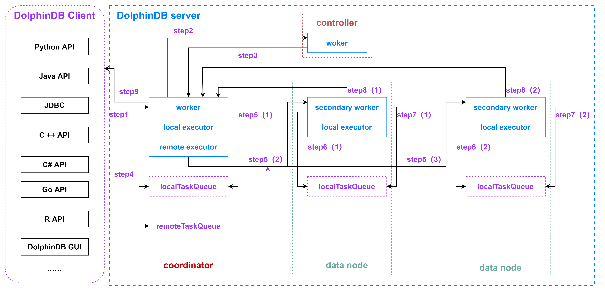

# 从一次 SQL 查询的全过程看 DolphinDB 的线程模型 <!-- omit in toc -->
- [1. 背景知识：DolphinDB 的主要节点类型](#1-背景知识dolphindb-的主要节点类型)
- [2. DolphinDB 线程类型](#2-dolphindb-线程类型)
- [3. 一次 SQL 查询的线程经历](#3-一次-sql-查询的线程经历)
- [4. 优化建议](#4-优化建议)
- [5. 不同类型线程与配置参数的关系](#5-不同类型线程与配置参数的关系)

分布式系统较为复杂，写入与查询都可能需要多个节点的配合以完成操作。通过了解 SQL 查询的全过程，帮助我们了解分布式系统，掌握 DolpinDB 的配置，以及优化系统性能的方法。

本教程以一个分布式 SQL 查询为例，介绍 DolphinDB 分布式数据库查询过程的数据流，以及其经历的各类线程池。

## 1. 背景知识：DolphinDB 的主要节点类型

* **controller（控制节点）**

  负责收集代理节点、数据节点和计算节点的心跳，监控每个节点的工作状态，管理分布式文件系统的元数据和事务。

* **data node（数据节点）**

  既可以存储数据，也可以用于数据的查询和计算。

* **compute node（计算节点）**

  只用于数据的查询和计算。计算节点应用于计算密集型的操作，包括流计算、分布式关联和机器学习等场景。计算节点不存储数据，但可以通过 loadTable 加载数据进行计算。通过在集群中配置计算节点，可以将写入任务提交到数据节点、所有计算任务提交到计算节点，实现存储和计算的分离。

  > 1.30.14/2.00.1版本开始支持计算节点。

## 2. DolphinDB 线程类型

* **worker**

  常规交互作业的工作线程。
  
  用于接收客户端请求，将任务分解为多个子任务。工作线程将根据任务涉及到的分区，将任务分配给对应分区所在的节点来执行。因此，各子任务可能由工作线程自己执行，或者发送给 local executor 或 remote executor 执行。

* **secondary worker**

  次级工作线程。
  
  当前节点产生的远程子任务，会在远程节点的次级工作线程上执行，用于避免作业环，解决节点间的任务循环依赖而导致的死锁问题。

* **local executor**

  本地执行线程。
  
  worker 拆解完任务后生成的本地子任务队列，由同节点下的 local executor 执行。每个 local executor 一次只能处理一个子任务。[`ploop`](https://www.dolphindb.cn/cn/help/200/Functionalprogramming/TemplateFunctions/loopPloop.html)、[`peach`](https://www.dolphindb.cn/cn/help/200/Functionalprogramming/TemplateFunctions/each.html) 等并行计算函数的计算任务在本地执行线程完成。

* **remote executor**

  远程执行线程。
  
  将远程子任务发送到远程节点的独立线程。

* **batch job worker**

  使用 [`submitJob`](https://www.dolphindb.cn/cn/help/FunctionsandCommands/FunctionReferences/s/submitJob.html) 或 [`submitJobEx`](https://www.dolphindb.cn/cn/help/FunctionsandCommands/FunctionReferences/s/submitJobEx.html) 创建批处理作业的工作线程。
  
  该线程在任务执行完后若闲置 60 秒，将被系统自动回收，不再占用系统资源。

* **web worker**

  处理 HTTP 请求的工作线程。
  
  DolphinDB 提供了基于 web 的集群管理界面，用户可以通过 web 与 DolphinDB 节点进行交互。交互过程中提交的请求由该线程处理。

* **dynamic worker**

  动态工作线程。
  
  当所有的工作线程被占满但仍有新任务到来时，系统会自动创建动态工作线程来执行新任务。根据系统并发任务的繁忙程度，总共可以创建三组动态工作线程，每一个级别可以创建 maxDynamicWorker 个动态工作线程。该线程在任务执行完后若闲置 60 秒则会被系统自动回收，不再占用系统资源。

* **infra worker**

  基础设施处理线程。
  
  当开启元数据高可用或流数据高可用时，系统会自动创建基础设施处理线程，用于处理 raft 组内各节点的信息同步工作。

* **urgent worker**

  紧急工作线程。
  
  接收时间敏感度高的系统级别任务，如登录 [`login`](https://www.dolphindb.cn/cn/help/200/FunctionsandCommands/CommandsReferences/l/login.html) ，取消作业 [`cancelJob`](https://www.dolphindb.cn/cn/help/FunctionsandCommands/CommandsReferences/c/cancelJob.html)、[`cancelConsoleJob`](https://www.dolphindb.cn/cn/help/FunctionsandCommands/CommandsReferences/c/cancelConsoleJob.html) 。

* **diskIO worker**

  磁盘数据读写线程。
  
  通过参数 diskIOConcurrencyLevel 控制。如果 diskIOConcurrencyLevel = 0，表示使用当前任务执行的线程来读写磁盘数据。如果 diskIOConcurrencyLevel > 0，系统将会创建指定个数的线程来读写磁盘数据。（diskIOConcurrencyLevel 详见本文第5节[不同类型线程与配置参数的关系](#5-不同类型线程与配置参数的关系)）。

## 3. 一次 SQL 查询的线程经历

SQL 查询可提交到集群中任一计算节点或数据节点。获得请求的节点作为该查询的协调节点。

下面以 API 向协调节点发起一次 SQL 查询为例，讲述整个过程中所调度的所有线程。



**step1：DolphinDB 客户端向协调节点（数据节点或计算节点）发起数据查询请求**

以协调节点为数据节点为例，发起一次聚合查询，查询语句如下：

```
select avg(price) from loadTable("dfs://database", "table") where date between 2021.01.01 : 2021.12.31 group by date
```

假设上述聚合查询语句总共涉及 300 个分区的数据，且正好平均分配在三个数据节点（即每个数据节点包含了100个查询的分区数据）。

DolphinDB 客户端将查询请求进行二进制序列化后通过 TCP 协议传输给 datanode1。

**step2：datanode1 收到查询请求**

datanode1 收到客户端的查询请求后，将分配 1 个 worker 线程对内容进行反序列化和解析。当发现内容是 SQL 查询时，会向 controller 发起请求，获取跟这个查询相关的所有分区的信息。整个 SQL 查询执行完毕前，这个 worker 线程会被一直占用。

**step3：controller 收到 datanode1 的请求**

controller 收到 datanode1 的请求后，将分配 1 个 worker 线程对内容进行反序列化和解析，准备好本次 SQL 查询涉及的数据分区信息后，由该 worker 线程序列化后通过 TCP 协议传输给 datanode1。controller 的 worker 完成该工作后将从队列中获取下一个请求。

**step4：datanode1 收到 controller 返回的信息**

datanode1 收到 controller 返回的信息后，由本节点下的 worker 线程对内容进行反序列化和解析。

得知本次 SQL 查询涉及的数据分区信息后，将位于本节点的分区数据计算任务添加到本地任务队列，此时本地任务队列会产生 100 个子任务。

同时，把需要使用远程节点 datanode2 与 datanode3 的分区数据的计算任务，以任务包的方式发送到远程任务队列。远程任务队列会被添加2个远程任务，分别打上 datanode2 和 datanode3 的标志。

**step5(1)：本地 worker 和 local executor 消费本地任务队列**

此时，datanode1 中的 worker 线程和 local executor 线程会同时并行消费本地任务队列的子任务。所以配置项中的 workerNum 和 localExecutors 很大程度上决定了系统的并发计算能力。

**step5(2)(3)：本地 remote executor 发送远程任务至远程节点**

同时，remote executor 线程将远程任务队列的内容序列化后，通过 TCP 协议分别发送到 datanode2 和 datanode3。

**step6(1)(2)：远程节点收到远程任务**

datanode2 和 datanode3 收到远程任务后，将分配 1 个 secondary worker 线程对内容进行反序列化和解析，并将计算任务发送到本地任务队列，此时 datanode2 和 datanode3 的本地任务队列各会产生 100 个子任务。

**step7(1)(2)：远程节点 secondary worker 和 local executor 消费本地任务队列**

此时，datanode2 和 datanode3 上一直占用的 secondary worker 线程和 local executor 线程会同时并行消费本地任务队列的子任务。所以配置项中的 secondaryWorkerNum 对系统的并发计算能力也有一定影响。

**step8(1)(2)：远程节点返回中间计算结果至 data node1**

当 datanode2 和 datanode3 涉及的计算任务完成后，分别得到了本次 SQL 查询的中间计算结果，由一直占用的 secondary worker 线程对内容进行序列化后，通过 TCP 协议传输给 datanode1。

**step9：datanode1 计算最终结果并返回给客户端**

datanode1 接收到 datanode2 和 datanode3 返回的中间计算结果后，由一直占用的 worker 线程对内容进行反序列化，然后在该线程上计算出最终结果，并在序列化后通过 TCP 协议传输给客户端。

DolphinDB 客户端接收到 datanode1 返回的信息后，经过反序列化显示本次 SQL 查询的结果。

**协调节点为数据节点和计算节点的区别：**

> 1. 数据节点可以存储数据，计算节点不能存储数据。但计算节点解析客户端的 SQL 查询后，从 controller 拿到本次 SQL 查询涉及的数据分区信息，会将所有数据查询任务都分配到数据节点执行，得到每个 数据节点返回的中间结果，最后调度计算节点的 worker 计算最终结果并返回给客户端。

> 2. 当实时写入的数据量非常大时，建议配置计算节点，将所有 SQL 查询都提交到计算节点，实现存储和计算的分离，减轻数据节点的计算工作负担。

## 4. 优化建议

通过分析上述的线程经历，可以发现，本次 SQL 查询一共发生了8次 TCP 传输，其中 2 次是 DolphinDB server 和 DolphinDB client 之间的传输。如果查询结果的数据量比较大，同时又对查询结果的延时性比较敏感，可以选择如下7个优化方向：

* 集群节点之间，以及节点和客户端之间的通信推荐使用万兆以太网。
* 线程配置参数优化。(详见本文第 5 节表格中的[优化推荐配置列](#5-不同类型线程与配置参数的关系))
* 增加每个节点的物理磁盘的数量。更多的磁盘可以更快速地并行读取多个分区的数据。
* SQL 语句优化：where 条件添加分区字段的信息过滤，起到分区剪枝的目的，避免全表扫描。
* 在查询数据量较大时，可对 API 查询结果进行数据压缩，提高传输效率。开启压缩后从 server 下载的数据即为压缩后的数据。Java 代码示例如下。
  
  ```Java
  //API 建立 connection 的时候将第三个参数 compress 设置为 true 即可开启压缩                     
    DBConnection connection = new DBConnection(false, false, true);        
    connection.connect(HOST, PORT, "admin", "123456");        
    BasicTable basicTable = (BasicTable) connection.run("select * from loadTable(\"dfs://database\", \"table\")");
  ```
* 增加 license 限制的 CPU 核心数和内存大小，提升系统的并发处理能力。

## 5. 不同类型线程与配置参数的关系

| 线程类型         | 配置参数               | 默认配置        |优化建议配置|
| ---------------- | ---------------------- | -------------- | ---------- |
| worker            | workerNum               | CPU 的内核数   |license 限制的 CPU 核心数与物理机 CPU 核心数两者的最小值|
| local executor   | localExecutors         | workerNum-1  |   |
| remote executor  | remoteExecutors        | 1            |集群的节点数-1*|
| batch job worker | maxBatchJobWorker      | workerNum |   |
| web worker       | webWorkerNum           | 1         |控制节点 webWorkerNum 配置为 4，数据节点 webWorkerNum 配置为 1**|
| secondary worker | secondaryWorkerNum     | workerNum |   |
| dynamic worker   | maxDynamicWorker       | workerNum |   |
| infra worker     | infraWorkerNum         | 2         |   |
| urgent worker    | urgentWorkerNum        | 1         |   |
| diskIO worker    | diskIOConcurrencyLevel | 1         |hdd 磁盘和ssd 磁盘建议不同配置***|

**备注：**

\*  如果是单节点 single 模式或者是单数据节点集群，不需要配置 remoteExecutors 的值。

**   大多情况下很少通过 web 与 DolphinDB 节点交互的方式提交查询任务。

***   对于 hdd 磁盘，推荐 diskIOConcurrencyLevel 设为对应节点下通过 volumes 参数配置的磁盘个数。对于 ssd 磁盘，推荐 diskIOConcurrencyLevel = 0。