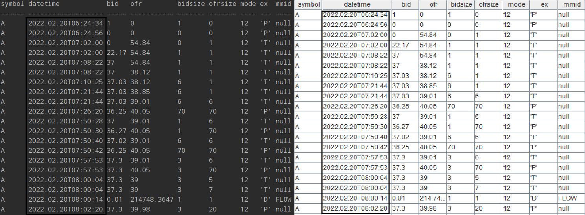
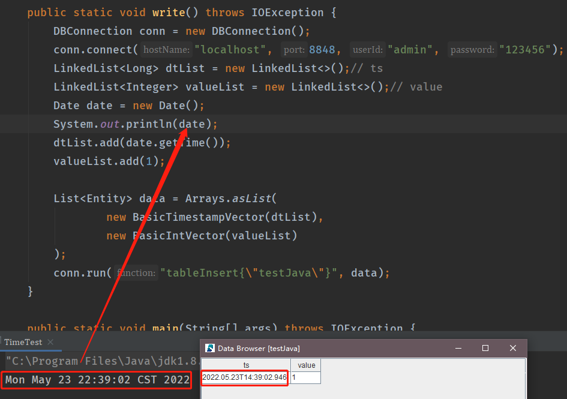
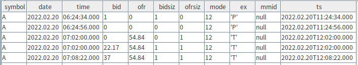
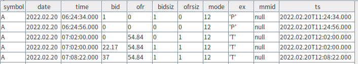
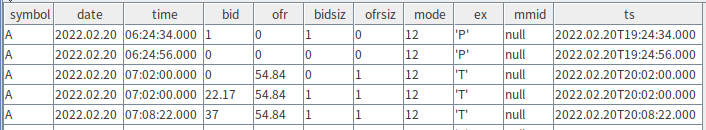
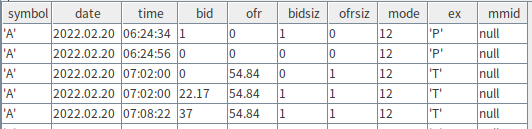
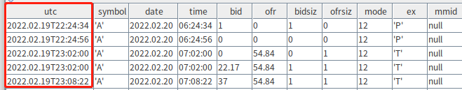
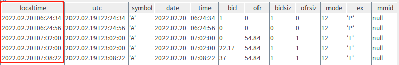
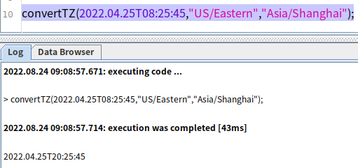

# DolphinDB 中有关时间信息的最佳实践指南

在实际业务场景中，我们经常会遇到如何正确处理数据时间信息的问题，比如存储一笔订单的交易时间、一条监控数据的产生时间等。在处理的过程中，我们会发现时间信息与业务场景紧密相连，所以在数据库中如何正确处理时间信息显得尤为重要。本篇教程会和大家一起探讨时间这个概念，并通过特定场景的描述来说明如何存储时间，最后结合实战代码，分享 DolphinDB 中 API 和插件处理时间的最佳实践指南。本教程包含以下内容：

- [1. 如何描述时间](#1-如何描述时间)
- [2. 如何存储时间](#2-如何存储时间)
- [3. Java API 的时间处理](#3-java-api-的时间处理)
- [4. MySQL 的时间处理](#4-mysql-的时间处理 )
- [5. CSV 文件的时间处理](#5-csv-文件的时间处理)
- [6. 总结](#6-总结)

DolphinDB 支持以下九种表示时间的数据类型：

| Data Type     | Example                                                      |
| ------------- | ------------------------------------------------------------ |
| MONTH         | 2012.06M                                                     |
| DATE          | 2012.06.13                                                   |
| MINUTE        | 13:30m                                                       |
| SECOND        | 13:30:10                                                     |
| TIME          | 13:30:10.008                                                 |
| NANOTIME      | 13:30:10.008000001                                           |
| DATETIME      | 2012.06.13 13:30:10 or 2012.06.13T13:30:10                   |
| TIMESTAMP     | 2012.06.13 13:30:10.008 or 2012.06.13T13:30:10.008           |
| NANOTIMESTAMP | 2012.06.13 13:30:10.008000001 or 2012.06.13T13:30:10.008000001 |

## 1. 如何描述时间

### 1.1 时区

由于地球是自西向东自转，理论上东边比西边先看到太阳，因此处于地球各个地理位置的国家看到太阳的时间各不相同，这种时间的差异会给不同地区的时间计算带来极大的不便，因此提出了时区的概念。正式的时区划分包括24个时区，一般可以用UTC偏移的方式表示，如东八区可以表示为UTC+8，当协调世界时（UTC）时间为早上8点时，东八区的时间为下午16点。

### 1.2 GMT

Greenwich Mean Time，格林威治时间。它规定太阳每天经过位于英国伦敦郊区的皇家格林威治天文台的时间为中午12点。

### 1.3 UTC

Universal Time Coordinated，协调世界时，又称世界标准时间。UTC 是现在全球通用的时间标准，全球各地都同意将各自的时间进行同步协调。

### 1.4 UTC vs. GMT

- GMT 是前世界标准时，UTC 是现世界标准时。

- 不需要精确到秒的场景下，两者视为等同。

- UTC 比 GMT 更精准，以原子时计时，适应现代社会的精确计时。

### 1.5 Unix时间戳

Unix 时间戳是从`1970.01.01 00:00:00`到现在的秒数/毫秒数。不难理解，这个时间戳在世界各地的值都是一致的，即 Unix 时间戳和时区无关。

### 1.6 本地时间

除了使用 UTC 时间和 Unix 时间戳表示时间外，在日常生活中我们通常会使用本地时间，就是我们所在时区内的当地时间。

**本地时间 = UTC 时间 + 时差**。比如我们在杭州，本地时间（东八区的时间）是`2022.02.20 09:35:03`，此时 UTC 时间是`2022.02.20 01:35:03`。

值得注意的是，**DolphinDB数据库存储的时间是本地时间，没有时区的概念**。更多的转换逻辑会在下一章中结合实际场景进行详细介绍。

## 2. 如何存储时间

下面将详细解释不同场景下两种方案（存储时区信息与存储本地时间）有关时间字段的存储转换过程，并对比说明两种方案的优劣。本章节涉及的所有场景仅介绍时间相关的字段，其余交易字段不讨论。

### 2.1 场景一

**场景信息概述**

- 以纽约某一家交易所的一条交易信息为例，其交易时间是本地时间（西五区）`2022.02.20 09:35:03`。
- DolphinDB 数据库服务部署在北京（东八区），同时另一家数据库服务A部署在北京（东八区）。
- 业务相关的端上服务（web、APP 等）一部分部署在北京（东八区），另一部分部署在美国西部（西八区）。

**业务需求概述**

* 数据批量入库，业务层多端暴露数据查询接口。
* 要求无论是在北京（东八区）还是美国西部（西八区）的用户，访问端上服务时，查询的数据时间显示和纽约交易所本地交易时间（西五区）一致，即显示`2022.02.20 09:35:03`。

#### 2.1.1 方案一：存储时区信息（即存储Unix时间戳 + 时区偏移量offset）

##### 技术选型：某数据库服务A

##### 存储转换过程：

- step 1 : 交易时间`2022.02.20 09:35:03`，对应的本地时间戳（西五区）是**1645349703**。
- step 2 : 由于纽约交易所处于西五区，对应的时差 **offset = -18000**，即5小时对应的秒数。根据公式Unix时间戳 = 本地时间戳 - offset（注意西五区对应的是负数），计算得到Unix时间戳为**1645367703**，对应的UTC时间为`2022.02.20 14:35:03`，存储入库。

- step 3 : 用户在端上请求查询接口时，分为两种情况：
  - 用户在北京（东八区）发起端上服务访问，如果按照服务器（部署在北京）所在时区进行解析，则显示`2022.02.20 22:35:03`；所以必须指定客户端按照西五区进行显示，才能正确显示`2022.02.20 09:35:03`。
  - 同理，用户在美国西部（西八区）发起端上服务时，也会遇到相同的转换问题。

从上述存储的时间转换过程来看，数据库存储时间时，如果带有时区的概念，需要在查询时指定显示的时区信息，引入一些时区转换的操作，给业务上带来一些不便。

#### 2.1.2 方案二：存储本地时间（即直接存储最终想要显示的时间）

##### 技术选型：DolphinDB

##### 存储转换过程：

- step 1 : 直接存储交易时间`2022.02.20 09:35:03`对应的时间戳 **1645349703** 入库即可。
- step 2 : 用户在端上请求查询接口时，直接显示时间戳 **1645349703** 对应的时间`2022.02.20 09:35:03`。

分析可知，场景一优先选择方案二：存储本地时间。在存储数据时，将交易时间`2022.02.20 09:35:03`的纽约本地时间直接存储入库，不用考虑时区的问题。在读取数据时，省去了计算 Unix 时间戳以及各种服务跨时区设置不同偏移量的问题，可以简单明了地描述时间信息。

### 2.2 场景二

在需要存储时区信息的场景下，DolphinDB 也可以通过一些内置函数实现存储时区信息。

**场景信息概述**

- 某跨境电商交易平台数据存储场景。
- 国内用户A（买方）和日本用户B（卖方）达成了一次线上交易，北京时间为`2022.05.20 11:30:05`，东京时间为`2022.05.20 12:30:05`。
- 用于存储国内交易数据的数据库服务部署在杭州，用于存储日本交易数据的数据库服务部署在日本。
- 中国处于东八区，日本处于东九区。

**业务需求概述**

* 用户查询交易订单时，交易时间需按照当前所在时区正确显示。
* 即用户A在查询自己的交易订单时显示北京时间，日本用户B在查询自己的交易订单时显示东京时间。

#### 2.2.1 方案一：存储时区信息

- step 1 : 北京买家的交易时间为`2022.05.20 11:30:05`，可以使用 DolphinDB 的内置函数 [gmtime](https://www.dolphindb.cn/cn/help/FunctionsandCommands/FunctionReferences/g/gmtime.html)，将本地时间转换成零时区时间，并配合 [long](https://www.dolphindb.cn/cn/help/FunctionsandCommands/FunctionReferences/l/long.html) 函数得到Unix时间戳，同理可得以卖方东京时间的 Unix 时间戳。以数据库服务部署在东八区的杭州为例，具体代码如下：

```
$ gmtime(2022.05.20 11:30:05)
2022.05.20 03:30:05
$ long(gmtime(2022.05.20 11:30:05))
1653017405
```

分析可知，无论在杭州还是日本，该笔交易数据对应的Unix时间戳是相同的。

- step 2 : 查询订单时，设置客户端拿到 Unix 时间戳后再自动根据服务器所在时区进行转换显示。国内用户A查询杭州的数据库服务时，取回的 Unix 时间戳为**1653017405**，根据数据库服务所在东八区，显示时间为`2022.05.20 11:30:05`。同理，日本用户B查询日本的数据库服务时，取回的 Unix 时间戳同为**1653017405**，根据数据库服务所在东九区，显示时间为`2022.05.20 12:30:05`。可以通过 DolphinDB 的内置函数 [localtime](https://www.dolphindb.cn/cn/help/FunctionsandCommands/FunctionReferences/l/localtime.html)，将零时区时间转换成本地时间，以数据库服务部署在东八区的杭州为例，具体代码如下：

```
$ localtime(2022.05.20 03:30:05)
2022.05.20 11:30:05
```

#### 2.2.2 方案二：存储本地时间

在上述场景中采用存储本地时间的方案，会存在以下几个问题：

- 以哪个时区的本地时间为准？
- 即便规定好之后，我们需要明确既定的本地时间和其他时区的偏移关系。

通过以上两个问题的思考，不难发现，在场景二中应该采用直接存储数据的 Unix 时间戳，并配合服务器的默认时区进行解析的方案。在该场景中，如果采用存储本地时间的方案，不仅要处理复杂的时差关系（夏令时等），还要考虑自定义规则中的潜在问题。

## 3. Java API 的时间处理

本节基于 DolphinDB Java API 1.30.17.1 版本进行说明。Java 中有关日期时间的常用类有以下四种： LocalDate、LocalTime、LocalDateTime 和 Date 。推荐大家使用 Java8 新特性中LocalDate 、LocalTime 和 LocalDateTime 本地时间相关的日期时间类配合 Java API 来处理时间信息。此外，如果大家不能完全掌握 Date 类的底层相关实现，不推荐大家使用该类处理时间。

### 3.1 最佳实践

#### LocalDateTime

```java
LocalDateTime now = LocalDateTime.now();//获取当前时间
LocalDateTime time = LocalDateTime.of(2022,2,20,9,35,3);// of方法指定年月日时分秒

// 时间计算相关
time.isAfter(now);
time.isBefore(now);
System.out.println(time.plusDays(1L));
System.out.println(time.minusHours(8));

// 支持指定时区偏移量
LocalDateTime.now(ZoneId.of("Australia/Sydney"));
```

对应本文第二节的介绍，这里不难发现 LocalDateTime 的语义即为**本地时间**，当读者需要存储本地时间到 DolphinDB 数据库时，推荐大家使用这个类来实现相关的操作。

**场景描述**：批量导入纽约交易所的csv数据，存储时间和csv中的交易时间一致，教程中的[csv文件](./data/timezone/taq.csv)。

| symbol | date       | time    | bid   | ofr    | bidsiz | ofrsiz | mode | ex   | mmid |
| ------ | ---------- | ------- | ----- | ------ | ------ | ------ | ---- | ---- | ---- |
| A      | 2022.02.20 | 8:02:20 | 36.32 | 201000 | 20     | 1      | 12   | 'D'  | EDGA |
| A      | 2022.02.20 | 8:02:20 | 36.32 | 39.98  | 20     | 20     | 12   | 'D'  | EDGX |
| A      | 2022.02.20 | 8:02:21 | 36.32 | 39.98  | 20     | 20     | 12   | 'D'  | EDGA |
| A      | 2022.02.20 | 8:05:19 | 36.33 | 39.98  | 20     | 20     | 12   | 'D'  | EDGX |
| A      | 2022.02.20 | 8:05:19 | 36.33 | 39.98  | 20     | 20     | 12   | 'D'  | EDGA |
| A      | 2022.02.20 | 8:05:20 | 36.33 | 39.97  | 20     | 20     | 12   | 'D'  | EDGX |
| ...    |            |         |       |        |        |        |      |      |      |

- **step1：创建 DolphinDB 共享内存表**

根据数据文件的结构建表，这里仅以写入共享内存表做为示例代码，读者可以根据实际情况进行调整。

```java
conn.run("t = table(100:0,`symbol`datetime`bid`ofr`bidsize`ofrsize`mode`ex`mmid,[SYMBOL,DATETIME,DOUBLE,DOUBLE,LONG,LONG,INT,CHAR,SYMBOL])\n" +
"share t as timeTest;");
```

- **step2：解析 csv**

这里笔者使用的第三方开源插件 OpenCSV 解析 csv 文件，使用时只需引入以下依赖即可。当然读者也可以根据自己的使用习惯或者已有的工具类来实现数据文件的解析。

```java
CSVReader csvReader = new CSVReader(reader) 
String[] record;
csvReader.readNext();// skip first line
while ((record = csvReader.readNext()) != null) {
    // record[i]对应某一个行的某一个字段，此处完整代码请参考附录
}
```

- **step3：定义时间处理方法**

csv 解析后的各个字段是 String 类型，这里通过 DateTimeFormatter 类指定时间信息的格式 yyyy.MM.dd H:mm:ss，实现 String 转化为 LocalDateTime。然后笔者将 LocalDateTime 的实例化对象转换成了本地时间戳，是为了方便后面写入时构建 BasicDateTimeVector。

```java
public static int getTime(String timeStr){
    DateTimeFormatter df = DateTimeFormatter.ofPattern("yyyy.MM.dd H:mm:ss");
    LocalDateTime ldt = LocalDateTime.parse(timeStr,df);
    return Utils.countSeconds(ldt);
}
```

- **step4：批量写入**

此处构建各个列的 BasicVector ，实现批量写入（省略部分冗余代码，完整代码请参考附录）

```java
public static void write() throws IOException {
    // 构建list，省略部分列
    LinkedList<String> symbolList = new LinkedList<>(); 
    try (Reader reader = Files.newBufferedReader(Paths.get(CSV));
        // 读取csv，插入到list中
    } catch (IOException | CsvValidationException ex) {
        ex.printStackTrace();
    }

    List<Entity> data = Arrays.asList(
        new BasicSymbolVector(symbolList),
        new BasicDateTimeVector(dtList),
        new BasicDoubleVector(bidList),
        new BasicDoubleVector(ofrList),
        new BasicLongVector(bidSizeList),
        new BasicLongVector(ofrSizeList),
        new BasicIntVector(modeList),
        new BasicByteVector(exList),
        new BasicSymbolVector(mmidList)
    );
    conn.run("tableInsert{\"timeTest\"}", data);
}
```

- **step5：查询验证**

Java API 查询示例代码如下：

  ```java
BasicTable res = (BasicTable) conn.run("select * from timeTest");
System.out.println(res.getString());
  ```

GUI 查询示例代码如下：

  ```
t = select * from timeTest
print(t)
  ```

Java API 和 GUI 的查询结果如下图所示：



观察可知，无论是通过 API 还是 GUI 查询返回的表中数据，时间信息的存储和 csv 中的交易时间是完全一致的，符合业务需求。

### 3.2 慎用 Date 类

- 实例化 Date 类

```java
Date date = new Date();
System.out.println(date);
// Mon May 23 22:22:10 CST 2022
```

这里要注意的是，尽管直接打印 date 对象显示的是当前服务器时间，但其底层存储的是 Unix 时间戳（长整型）。

- 存储入库

执行如下代码，在 DolphinDB Server 端创建一个两列的共享内存表：

```java
conn.run("t = table(100:0,`ts`value,[TIMESTAMP,INT]);share t as timeJava;");
```

通过 Java API 写入一条数据，示例代码如下：

```java
public static void write() throws IOException {
    DBConnection conn = new DBConnection();
    conn.connect("localhost", 8848, "admin", "123456");
    LinkedList<Long> dtList = new LinkedList<>();// ts
    LinkedList<Integer> valueList = new LinkedList<>();// value
    Date date = new Date();
    System.out.println(date);
    dtList.add(date.getTime());
    valueList.add(1);
    List<Entity> data = Arrays.asList(
    new BasicTimestampVector(dtList),
    new BasicIntVector(valueList)
    );
    conn.run("tableInsert{\"testJava\"}", data);
}
```

Java API 通过 `System.out.println(date)`将写入的时间打印到了前台，同时通过 DolphinDB GUI 查看共享内存表中写入的数据，对比结果如下图所示：



观察发现，Java 控制台打印的时间和数据入库时间不符，出现了时间错乱的现象，原因有以下两点：

（1）new Date() 实例化对象时，底层实际上通过复用有参构造，通过 `System.currentTimeMillis()` 方法获取的 Unix 时间戳来创建 Date 类的对象

```
/**
* Allocates a <code>Date</code> object and initializes it so that
* it represents the time at which it was allocated, measured to the
* nearest millisecond.
*
* @see     java.lang.System#currentTimeMillis()
*/
public Date() {
	this(System.currentTimeMillis());
}
```

（2）在 Java 中，可以通过重写类的 `toString` 方法来自定义 `System.out.print` 的打印信息，`Date` 类同样重写了该方法；不难猜到，`Date` 在该方法中做了时区处理，即存储的是 Unix 时间戳，但在打印时会根据服务器时区转换。

```java
public String toString() {
        // "EEE MMM dd HH:mm:ss zzz yyyy";
        BaseCalendar.Date date = normalize();
        StringBuilder sb = new StringBuilder(28);
        int index = date.getDayOfWeek();
        if (index == BaseCalendar.SUNDAY) {
            index = 8;
        }
        convertToAbbr(sb, wtb[index]).append(' ');                        // EEE
        convertToAbbr(sb, wtb[date.getMonth() - 1 + 2 + 7]).append(' ');  // MMM
        CalendarUtils.sprintf0d(sb, date.getDayOfMonth(), 2).append(' '); // dd
        CalendarUtils.sprintf0d(sb, date.getHours(), 2).append(':');   // HH
        CalendarUtils.sprintf0d(sb, date.getMinutes(), 2).append(':'); // mm
        CalendarUtils.sprintf0d(sb, date.getSeconds(), 2).append(' '); // ss
        TimeZone zi = date.getZone();
        if (zi != null) {
            sb.append(zi.getDisplayName(date.isDaylightTime(), TimeZone.SHORT, Locale.US)); // zzz
        } else {
            sb.append("GMT");
        }
        sb.append(' ').append(date.getYear());  // yyyy
        return sb.toString();
}
```

综上所述，因为使用者对 Date 类的底层存储逻辑以及打印规则理解不够深入，从而出现了所谓的时间错乱的现象。实际上该示例中并没有哪一个步骤发生了存储上的差异，我们只是把 Date 的 Unix 时间戳以长整形类型写入了 DolphinDB 中的 TIMESTAMP 类型，而查询返回的时间信息是以 UTC 时间显示的。

## 4. MySQL 的时间处理

本节基于 MySQL 5.7 版本进行说明，本节讨论的日期时间类型有：DATETIME、 TIMESTAMP、DATE、TIME

### 4.1 常用时间类型和时区的关系

- DATE, TIME, DATETIME：和时区无关，存进去的值不会根据时区的调整而改变。
- TIMESTAMP：和时区相关，TIMESTAMP 存储的是Unix时间戳，显示时会将时间戳转换为设置的时区进行显示。

首先使用如下命令查看当前时区，可以看到系统时区是 CST，表示东八区，且数据库时区和系统时区一致，也是东八区：

```mysql
mysql> show variables like '%time_zone%';
+------------------+--------+
| Variable_name    | Value  |
+------------------+--------+
| system_time_zone | CST    |
| time_zone        | SYSTEM |
+------------------+--------+
```

执行如下命令，创建数据库和表：

```mysql
mysql> USE testdb;
mysql> CREATE TABLE testTable(
    -> date DATE NOT NULL,
    -> time TIME NOT NULL,
    -> ts TIMESTAMP NOT NULL
    -> );
Query OK, 0 rows affected (0.11 sec)
```

插入测试数据，并查看数据：

```mysql
mysql> select * from testTable;
+------------+----------+---------------------+
| date       | time     | ts                  |
+------------+----------+---------------------+
| 2022-06-14 | 23:13:15 | 2022-06-14 23:13:15 |
+------------+----------+---------------------+
1 row in set (0.00 sec)
```

此时，设置数据库时区为东九区，再次查看数据：

```mysql
mysql> set time_zone='+09:00';
Query OK, 0 rows affected (0.01 sec)

mysql> show variables like '%time_zone%';
+------------------+--------+
| Variable_name    | Value  |
+------------------+--------+
| system_time_zone | CST    |
| time_zone        | +09:00 |
+------------------+--------+
2 rows in set (0.00 sec)

mysql> select * from testTable;
+------------+----------+---------------------+
| date       | time     | ts                  |
+------------+----------+---------------------+
| 2022-06-14 | 23:13:15 | 2022-06-15 00:13:15 |
+------------+----------+---------------------+
1 row in set (0.00 sec)
```

对比修改数据库时区前后的查询结果，date 和 time 两列是一个固定值没有变化，但是 ts 列（TIMESTAMP类型）的值会根据时区设定改变，设置东九区后查询显示早了一个小时。

### 4.2 MySQL 时间类型导入 DolphinDB

本节通过 DolphinDB 的 MySQL 插件，将 MySQL 中的数据快速导入 DolphinDB。MySQL 插件会自动完成数据类型转换。MySQL时间类型与DolphinDB时间类型转换关系如下表。关于插件更多使用介绍，请[参考教程](https://gitee.com/dolphindb/DolphinDBPlugin/blob/release200/mysql/README_CN.md)。

| MySQL类型 | DolphinDB类型 |
| --------- | ------------- |
| DATE      | DATE          |
| TIME      | TIME          |
| DATETIME  | DATETIME      |
| TIMESTAMP | TIMESTAMP     |

DolphinDB 还支持如下时间相关的类型：MONTH, MINUTE, SECOND, NANOTIME, NANOTIMESTAMP。

首先导入一批纽约交易所的 csv 数据至 MySQL 中，本次测试 MySQL 全局 time_zone 设置为 UTC，csv 示例数据和 MySQL 导入代码见附录。为了对比 DATE, TIME 和 TIMESTAMP 类型的值分别导入到 DolphinDB 中的效果，笔者新增一列 ts（TIMESTAMP 类型），插入了交易时间（西五区）对应的 UTC 时间数据，相比 time 列的数据晚了5个小时。

完成导入后查看数据：

```mysql
mysql> select * from taqTs limit 5;
+--------+------------+----------+-------+-------+--------+--------+------+-----+------+---------------------+
| symbol | date       | time     | bid   | ofr   | bidsiz | ofrsiz | mode | ex  | mmid | ts                  |
+--------+------------+----------+-------+-------+--------+--------+------+-----+------+---------------------+
| A      | 2022-02-20 | 06:24:34 |  1.00 |  0.00 |      1 |      0 |   12 | 'P' | null | 2022-02-20 11:24:34 |
| A      | 2022-02-20 | 06:24:56 |  0.00 |  0.00 |      0 |      0 |   12 | 'P' | null | 2022-02-20 11:24:56 |
| A      | 2022-02-20 | 07:02:00 |  0.00 | 54.84 |      0 |      1 |   12 | 'T' | null | 2022-02-20 12:02:00 |
| A      | 2022-02-20 | 07:02:00 | 22.17 | 54.84 |      1 |      1 |   12 | 'T' | null | 2022-02-20 12:02:00 |
| A      | 2022-02-20 | 07:08:22 | 37.00 | 54.84 |      1 |      1 |   12 | 'T' | null | 2022-02-20 12:08:22 |
+--------+------------+----------+-------+-------+--------+--------+------+-----+------+---------------------+
```

然后在 DolphinDB 中加载 MySQL 插件，将 MySQL 数据导入到 DolphinDB 内存表，具体代码如下：

```sql
// 加载插件
loadPlugin("/DolphinDB/server/plugins/mysql/PluginMySQL.txt");

// 连接 MySQL Server
conn = mysql::connect(`127.0.0.1, 3306, `root, "root", `testdb)

// 执行导入
taqDdb = mysql::load(conn, "SELECT * FROM taqTs");

// 查看数据
select * from taqDdb;
```



由此可见，如果用户想同步 MySQL 数据库中的 UTC 表示的 TIMESTAMP类型的列到 DolphinDB，需要先设置 MySQL 的全局 time_zone 为 UTC。对于 DATE, TIME 和 TIMESTAMP 类型的数据，导入前后对比可见，DolphinDB 和 MySQL 是完全一致的。

需要注意的是，MySQL 的 time_zone 时区设置分为全局和会话两种级别，如果用户发现在 MySQL 的客户端查询和导入到 DolphinDB 中的时间不一致，首先需要检查全局 time_zone 和会话 time_zone 是否一致，DolphinDB 处理 MySQL 的 TIMESTAMP 列时，会按照全局 time_zone 下的时间戳进行存储。

比如此时在 MySQL 查询客户端中设置会话 `time_zone = '+08:00'`，并查看数据，可以观察到本次查询会话中 ts 列的数据从 UTC 转换成了东八区时间进行显示：

```mysql
mysql> set time_zone='+08:00';
Query OK, 0 rows affected (0.00 sec)

mysql> select * from taqTs limit 5;
+--------+------------+----------+-------+-------+--------+--------+------+-----+------+---------------------+
| symbol | date       | time     | bid   | ofr   | bidsiz | ofrsiz | mode | ex  | mmid | ts                  |
+--------+------------+----------+-------+-------+--------+--------+------+-----+------+---------------------+
| A      | 2022-02-20 | 06:24:34 |  1.00 |  0.00 |      1 |      0 |   12 | 'P' | null | 2022-02-20 19:24:34 |
| A      | 2022-02-20 | 06:24:56 |  0.00 |  0.00 |      0 |      0 |   12 | 'P' | null | 2022-02-20 19:24:56 |
| A      | 2022-02-20 | 07:02:00 |  0.00 | 54.84 |      0 |      1 |   12 | 'T' | null | 2022-02-20 20:02:00 |
| A      | 2022-02-20 | 07:02:00 | 22.17 | 54.84 |      1 |      1 |   12 | 'T' | null | 2022-02-20 20:02:00 |
| A      | 2022-02-20 | 07:08:22 | 37.00 | 54.84 |      1 |      1 |   12 | 'T' | null | 2022-02-20 20:08:22 |
+--------+------------+----------+-------+-------+--------+--------+------+-----+------+---------------------+
5 rows in set (0.00 sec)
```

在 DolphinDB 中重新连接 MySQL，执行上述的数据导入代码，此时全局 time_zone 还是 UTC，且没有临时设置会话 time_zone，所以 ts 列的数据还是和 MySQL 中保持一致，查询同步到 DolphinDB 的结果表如下：



此时若通过 `set global time_zone='+08:00'`，设置 MySQL 的全局 time_zone 为东八区，然后在 DolphinDB 中重新连接 MySQL，执行上述的数据导入代码。此时，MySQL 的全局 time_zone 为东八区，ts 是 TIMESTAMP 类型，存储的是 unix 时间戳，根据设置的时区转换，从 MySQL 查询获得的 ts 列时间自动转换成了东八区的时间，所以比原始的 UTC 会晚8个小时，查询同步到 DolphinDB 的结果表如下：



## 5. CSV 文件的时间处理

DolphinDB 提供内置函数 [loadText](https://www.dolphindb.cn/cn/help/FunctionsandCommands/FunctionReferences/l/loadText.html) 和 [loadTextEx](https://www.dolphindb.cn/cn/help/FunctionsandCommands/FunctionReferences/l/loadTextEx.html) 函数，实现将 csv 数据加载到 DolphinDB 的内存表和分布式表中。本节以 [loadText](https://www.dolphindb.cn/cn/help/FunctionsandCommands/FunctionReferences/l/loadText.html)  函数为例，对于日期列或时间列，如果 DolphinDB 识别的数据类型不符合预期，不仅需要在 schema 的 type 列指定时间类型，还需要在 format 列中指定数据文件中日期或时间的格式（用字符串表示），如 "MM/dd/yyyy"。如何表示日期和时间格式请参考 [日期和时间的调整及格式](https://www.dolphindb.cn/cn/help/DataManipulation/TemporalObjects/ParsingandFormatofTemporalVariables.html)。如何加载文本数据请参考 [DolphinDB文本数据加载教程](https://gitee.com/dolphindb/Tutorials_CN/blob/master/import_csv.md)。

加载数据文件，查看数据，具体代码如下：

```shell
data = loadText("/data/taq.csv")
```



对于实现存储无时区的本地时间，date 列指定用 DolphinDB 的 DATE 类型存储，time 列指定用 DolphinDB 的 TIME 类型存储即可。

然而，在使用时，有时会面临以下几个问题，以上述 data 表为例进行说明：

- 利用 DolphinDB 内置时区转换函数[gmtime](https://www.dolphindb.cn/cn/help/FunctionsandCommands/FunctionReferences/g/gmtime.html)，把本地时间（测试系统的本地时间为东八区时间）转换成格林尼治时间（零时区时间）：

```
gmData = select gmtime(concatDateTime(date,time)) as utc, * from data;
```



- 利用 DolphinDB 内置时区转换函数[localtime](https://www.dolphindb.cn/cn/help/FunctionsandCommands/FunctionReferences/l/localtime.html)，把零时区时间转换成本地时间（测试系统的本地时间为东八区时间） ：

```
localData = select localtime(utc) as localtime,* from gmData;
```



- 利用 DolphinDB 内置时区转换函数[convertTZ](https://www.dolphindb.cn/cn/help/FunctionsandCommands/FunctionReferences/c/convertTZ.html)，完成两个指定时区之间的转换：

```
convertTZ(2022.04.25T08:25:45,"US/Eastern","Asia/Shanghai");
```



尽管 DolphinDB 的时间序列对象不包括时区信息，它是由用户来决定时序对象的时区，但是 DolphinDB 内置了丰富的时区转换函数，大家可以根据业务需求选择对应的函数来处理时间信息。

## 6. 总结

总的来说，用户在使用 DolphinDB 时，关于时间列的存储主要面临以下两个问题：

- **数据迁移后，时间列“显示”不一致的问题**
  - 这里需要注意的是，DolphinDB 不会主动修改时间列的整型值，所以会把查询取得的时间列的整型值存入 DolphinDB。本教程以 Java API 写入和 MySQL 数据同步为例，详细讲述了数据导入 DolphinDB 的过程中对时间列的处理细节，以解决数据迁移后，时间列”显示“不一致的问题。
- **如何实现有无时区的存储**
  - 对于不需要时区信息的存储，用户将原始时间（DATE , TIME , TIMESTAMP 类型均可）的数据直接存入 DolphinDB 即可。DolphinDB 将按原时间输出，不会增加时区转换。
  - 对于需要时区信息的存储，用户在写入数据库时可以通过 DolphinDB 内置时区转换函数 [gmtime](https://www.dolphindb.cn/cn/help/FunctionsandCommands/FunctionReferences/g/gmtime.html) 将本地时间转换成 UTC 时间进行存储，之后客户端查询时可以通过 DolphinDB 内置时区转换函数 [localtime](https://www.dolphindb.cn/cn/help/FunctionsandCommands/FunctionReferences/l/localtime.html) 和 [convertTZ](https://www.dolphindb.cn/cn/help/FunctionsandCommands/FunctionReferences/c/convertTZ.html) 将 UTC 时间转换成本地时间和其它时区的时间。

关于时间信息的处理，难点在于使用者需要深入了解数据库产品对于时间列存储的底层实现、以及各个编程语言有关日期 API 的实现。充分了解其存储和显示规则后，时间的处理就会变得十分简单；反之，当我们无法准确掌握插入的时间的意义时，会对我们的业务甚至功能带来很大的影响。本文介绍了不同场景下时间信息处理方式，方便读者在使用 DolphinDB 数据库时，能够准确合理地存储和读取时间列数据。无论哪种时间描述规则，只要使用者理解了各个规则的转化关系，便可以在实际场景中准确地处理时间列的显示问题。

## 附录
[01.Java API处理时间信息](script/timezone/01.DateTutorials.java)

[02.MySQL创建示例表](script/timezone/02.create.sql)

[03.MySQL导入DolphinDB](script/timezone/03.mysqlToDolphinDB.dos)

[样例数据：taq.csv](data/timezone/taq.csv)

[样例数据：taqTs.csv](data/timezone/taqTs.csv)