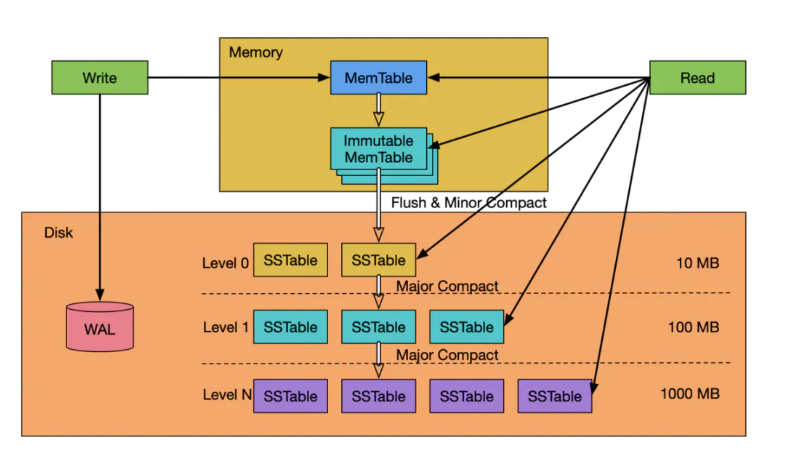
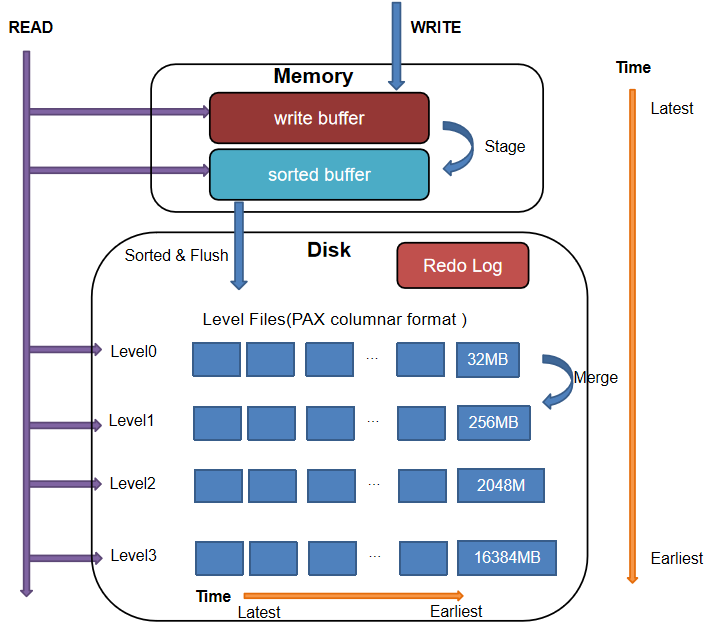
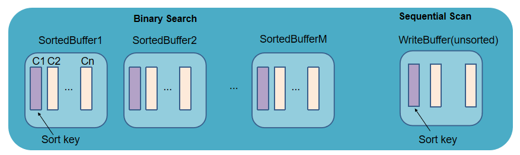
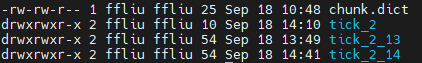
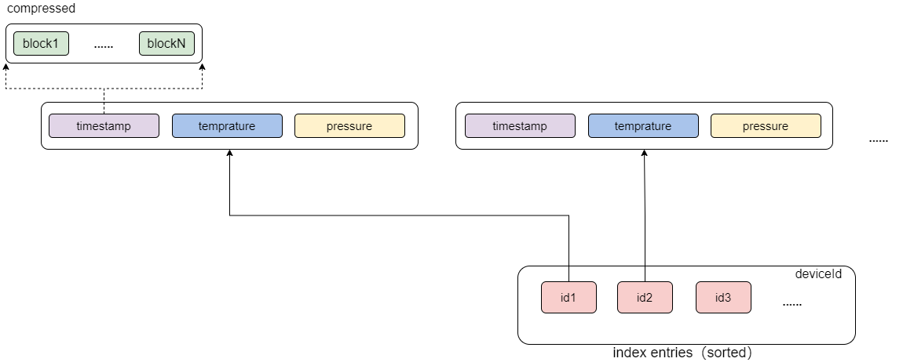
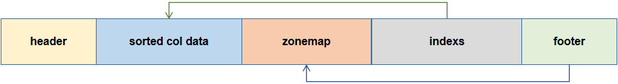
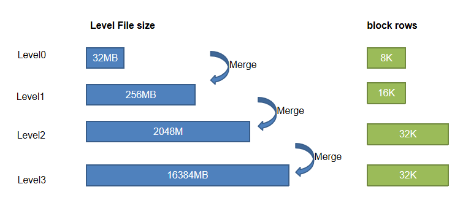
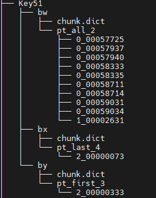

# TSDB 存储引擎详解
## 阅读指南

- 如果需要进行引擎间的迁移或希望了解 OLAP 引擎和 TSDB 引擎的区别，推荐阅读第 1 章。
- 如果需要了解底层的架构和工作原理推荐阅读第 2 章。
- 如果希望直接上手搭建 TSDB 数据库，推荐从第 3 章开始阅读。
- 第 4 章给出了 TSDB 查询优化案例。
- 更多 TSDB 的实践案例，请参考第 5 章的场景指南。
- 第 7 章附录列出了 TSDB 相关的配置项、运维函数以及常见问题一览表。

- [TSDB 存储引擎详解](#tsdb-存储引擎详解)
  - [阅读指南](#阅读指南)
  - [1. TSDB vs OLAP](#1-tsdb-vs-olap)
    - [术语对照](#术语对照)
  - [2. TSDB 存储引擎架构](#2-tsdb-存储引擎架构)
    - [2.1 LSM-Tree](#21-lsm-tree)
    - [2.2 TSDB 引擎 CRUD 流程](#22-tsdb-引擎-crud-流程)
    - [2.3 排序列 sortColumns](#23-排序列-sortcolumns)
    - [2.4 Level File 文件](#24-level-file-文件)
  - [3. 合理使用 TSDB 引擎](#3-合理使用-tsdb-引擎)
    - [3.1 数据库部署](#31-数据库部署)
    - [3.2 创建数据库](#32-创建数据库)
    - [3.3 创建数据表](#33-创建数据表)
  - [4. TSDB 引擎查询优化案例](#4-tsdb-引擎查询优化案例)
    - [4.1 sortKey 数量对查询性能的影响](#41-sortkey-数量对查询性能的影响)
    - [4.2 Level File 数量对查询性能的影响](#42-level-file-数量对查询性能的影响)
  - [5. TSDB 引擎场景实践案例](#5-tsdb-引擎场景实践案例)
    - [金融场景](#金融场景)
    - [物联网场景](#物联网场景)
  - [6. 总结](#6-总结)
  - [7. 附录](#7-附录)
    - [7.1 TSDB 引擎配置项汇总](#71-tsdb-引擎配置项汇总)
    - [7.2 TSDB 引擎运维函数汇总](#72-tsdb-引擎运维函数汇总)
    - [7.3 常见问题 Q \& A](#73-常见问题-q--a)
    - [7.4 案例脚本](#74-案例脚本)


时序数据是一种按照时间顺序排列的数据集合，例如传感器数据、金融市场数据、网络日志等。由于时序数据具有时间上的连续性和大量的时间戳，传统的关系型数据库或通用数据库在处理大规模时序数据时可能效率较低。因此，针对时序数据进行优化的专用数据库——TSDB 变得越来越重要。

为了更好地支持时序数据的分析和存储，DolphinDB 于 2.0 版本推出了”时序数据存储引擎“（Time Series Database Engine，以下简称 TSDB）。

2.0 版本以前 DolphinDB 仅支持分析型数据库存储引擎（Online Analytical Processing，以下简称 OLAP）。OLAP 引擎采用列式存储，压缩率高、查询和计算列的性能也十分优越。随着 DolphinDB 2.0 版本 TSDB 引擎的推出，用户在多模引擎的选择和使用上可能会遇到困难。本文的目标是通过原理解析、使用指导、案例分析的介绍，帮助用户更好地理解 TSDB 引擎，并能够在实际场景中配置更优的存储策略。

## 1. TSDB vs OLAP

关于 TSDB 和 OLAP 适用场景的描述性说明，请参照教程：[TSDB 存储引擎介绍](https://docs.dolphindb.cn/zh/tutorials/tsdb_engine.html) 

为了便于用户由浅入深地进行学习，本文开头提供了一个 TSDB 和 OLAP 引擎的区别表，以帮助用户对两者的区别有一个概括性的认识。除了列出区别点外，表格中标注了一些使用上的注意点；表格中的术语请参照表尾的术语对照表。

| **指标**                    | **TSDB**                                 | **OLAP**                                 |
| ------------------------- | ---------------------------------------- | ---------------------------------------- |
| 存储结构                      | 行列混存（Partition Attributes Across，简称 PAX）<br>写入时，每 32 M 数据存储为一个 Level File 文件（压缩后可能小于 10 M），文件内部进一步划分数据为多个 block 并记录索引信息。 | 列式存储<br>每个分区下每列都存储为一个文件。<br>**注：若列文件过多时，在 IO 时会造成性能瓶颈，因此 OLAP 不适合存储列数过多的宽表。建议 OLAP 字段不超过 100。** |
| 数据形式和类型（区别点）              | Array Vector、BLOB 类型                     | 不支持左述两类数据                                |
| 数据压缩                      | 以 block 为压缩单元                            | 以列文件为压缩单元。<br>**注：一般情况下，OLAP 压缩率会高于 TSDB。** |
| 数据加载（最小单元）                | 每个分区的 Level File 文件中的 block              | 每个分区的子表的列文件                              |
| 写入方式                      | 顺序写入<br>**注：TSDB 引擎每次刷盘都会直接存储为新的 Level File 文件，无需像 OLAP 引擎一样追加到对应列文件，磁盘几乎没有寻道压力。** | 顺序写入<br>**注：OLAP 引擎列文件过多时，写入时会增加磁盘（HDD）的寻道时间。** |
| 查找方式                      | 1. 分区剪枝 <br>查 Cache Engine 缓存（分为两个部分）：<br> &nbsp;&nbsp; a. unsorted buffer：遍历 <br> &nbsp;&nbsp; b. sorted buffer：二分查找<br> 3. 查找磁盘：根据索引快速定位到 block <br> **注：TSDB 没有用户态的缓存机制，只有操作系统的缓存。** | 1. 分区剪枝查<br>2. Cache Engine 缓存<br>3. 查找磁盘：读取相关列文件后遍历查找 <br> **注：OLAP 会维护用户态缓存。第一次查询后，会将上次查询的列文件缓存在内存中。** 该部分缓存会保存在内存中，直到缓存占用达到warningMemSize，系统才会回收部分内存。用户也可以调用 clearAllCache 手动清理缓存 。 |
| 是否支持索引                    | 支持，以 sortKey 字段的组合值作为索引。                 | 不支持                                      |
| 优化查询方法                    | 命中分区剪枝；通过索引加速查询。                         | 命中分区剪枝；读取整列数据较为高效，因此查询整个分区或整列数据时具有查询优势。  |
| 是否支持去重                    | 支持，基于 sortColumns 去重                     | 不支持                                      |
| 读写数据是否有序                  | 每批刷盘的数据会按照 sortColumns 排序。<br>**注：查询时，只保证单个 Level File 内的数据是有序的，Level File 之间的数据顺序不能保证。** | 按写入顺序写入磁盘。<br>**注：单个分区内，查询结果的顺序和写入顺序一致；跨分区查询时，单分区数据和写入顺序一致，系统会按固定的分区顺序合并各分区的查询结果返回给用户端，因此重复查询仍维持结果的一致性。** |
| 增删改                       | **增：** 每次写入的数据可能存储在不同的 Level File。Level File 是不可修改和追加的。<br>**删：** keepDuplicates=LAST 时，若 softDelete=true，则会先打上删除标记，追加写入到一个新的 Level File，然后在文件合并时将旧数据删除；若 softDelete=false，则读数据到内存，更新后再写回。keepDuplicates=FIRST/ALL 时：读数据到内存，更新后再写回 <br>**改：** 取决于去重机制keepDuplicates=LAST：直接追加写入到一个新的 Level File，文件合并时会将旧数据删除 keepDuplicates=FIRST/ALL：读数据到内存，更新后再写回 | **增：** 直接追加到列尾<br>**删：** 读取相关分区下的所有列文件到内存，删除后再写回<br>**改：** 读列文件到内存，更新完再写回 |
| DDL & DML 操作（仅列出两者存在区别的点） | 不支持 rename!（修改字段名），replaceColumn!（修改字段的值或类型），dropColumns! （删除列字段）等操作 | 支持左述操作                                   |
| 资源开销（仅列出两者存在区别的点）         | 内存：排序开销，索引缓存；磁盘：合并 Level File 的 IO 开销。   | 不存在左述开销                                  |

### 术语对照

- block：参见[2.3.1 确定索引键值](#231-确定索引键值)部分的说明。
- Level File：参见[2.4 Level File](#24-level-file-文件)部分的说明。
- unsorted buffer / sorted buffer：参见[2.2.1 写入流程](#221-写入流程)部分的说明。
- sortColumns：参见[2.3 sortColumns](#23-排序列-sortcolumns)的介绍。
- sortKey：参见[2.3.1](#231-确定索引键值) 部分的说明。

## 2. TSDB 存储引擎架构

本章将存储架构、读写流程，参数功能，以及底层文件组织层面详细解析 TSDB 引擎的工作原理，以帮助用户从架构层面理解 TSDB 引擎的机制，从而更好的调试和配置 TSDB 的功能参数，实现更优的解决方案。

### 2.1 LSM-Tree

TSDB 引擎是 DolphinDB 基于 Log Structured Merge Tree (以下简称 LSM-Tree) 自研的存储引擎。

LSM-Tree 是一种分层、有序、面向磁盘的数据结构，主要用于处理写入密集型的工作负载，如日志系统、实时分析系统和数据库等。其实现的核心思想是利用磁盘批量顺序写入大幅提高写入性能。其工作流程图如下所示：



- **LSM-Tree 的数据写入流程：**

1. 数据先写入 WAL Log（Write-Ahead Logging）用于故障恢复。
2. 完成 WAL Log 写入后，数据会先存储在内存中的一个有序数据结构中（通常称为“内存表”），可以是一个红黑树结构或者 Skip List。当内存表缓存到一定大小后，会将其冻结（immutable）等待刷盘，然后生成一个新的内存表供之后的写事务写入。
3. 将冻结的内存表写入磁盘的 SSTable（Sorted Strings Table） 文件中，SSTable 是一种有序且不可变的数据文件，其内部的数据按照键值进行排序。（HINT：SSTable 即对应 DolphinDB 的 Level File 文件）。
4. LSM-Tree 通常维护多个层级的 SSTable 文件，越旧的数据会存储在磁盘上越高的层级，且 SSTable 文件大小也会逐级递增。刚写入的 SSTable 文件存储在磁盘的 Level 0 层级，当单层的文件数过多或文件大小过大，系统会将多个 SSTable 文件合并成一个更大的文件，并在合并时进行去重操作，以保证数据的有序性。通过合并操作，可以提高查询性能，减少存储占用。但注意，合并操作会造成一定程度的写放大。

- **LSM-Tree 的数据查询流程：**

1. 首先在内存表进行检索，由于内存表是有序的数据结构，因此可以利用算法快速检索并返回结果。
2. 如果在内存表中找不到数据，则会按层级遍历磁盘上的 SSTable 进行检索，由于 SSTable 文件数据是按键值排序的，因此可以在单个 SSTable 内快速进行范围查询。为了提高 SSTable 遍历的效率，可以给 SSTable 增加 Bloom Filter，以减少不必要的磁盘扫描。
3. 查询时，SSTable 可能会包含多个不同历史版本的数据，此时需要根据查询条件，找到符合版本的数据（例如最新一条数据）。

    > 注：最坏的情况下，需要将所有层级的 SSTable 文件都遍历一遍，如果 SSTable 文件过多，查询是非常低效的，因此可以理解为什么 LSM-Tree 要引入合并机制，减小 SSTable 的文件数。

相较于传统的 B+ 树而言，LSM-Tree 的优势在于高吞吐写入与较低的随机写延迟，这非常契合 DolphinDB 海量数据高性能写入的设计诉求。虽然没有 B+ 树那样高效的随机读和范围查询性能，LSM-Tree 依靠键值排序使得单个 SSTable 文件的范围查询也十分高效。

> 参考资料：[Principle of LSM Tree](https://www.sobyte.net/post/2022-04/lsm-tree/) 

DolphinDB 的 TSDB 引擎是基于 LSM-Tree 架构进行开发的，因此大部分内部的流程机制也和 LSM-Tree 类似，但在某些步骤进行了优化：

- **写入：** 与 LSM-Tree 直接写入一个有序的数据结构不同，DolphinDB TSDB 引擎在写入数据到内存时，会先按写入顺序存储在一个写缓冲区域（unsorted write Buffer），当数据量累积到一定程度，再进行排序转化为一个 sorted buffer。
- **查询：** DolphinDB TSDB 引擎会预先遍历 Level File （对应 LSM-Tree 的 SSTable 文件），读取查询涉及的分区下所有 Level File 尾部的索引信息到内存的索引区域（一次性读，常驻内存）。后续查询时，系统会先查询内存中的索引，若命中，则可以快速定位到对应 Level File 的数据块，无需再遍历磁盘上的文件。

  

### 2.2 TSDB 引擎 CRUD 流程

本节将具体介绍 DolphinDB TSDB 引擎的增删改查（CRUD）流程。

#### 2.2.1 写入流程

TSDB 引擎写入整体上和 OLAP 一致，都是通过两阶段协议进行提交。写入时，先写 Redo Log（每个写事务都会产生一个 Redo Log），并写入 Cache Engine 缓存，最后 由后台线程异步批量写入磁盘。需要注意的是，TSDB 引擎和 OLAP 引擎各自单独维护 Redo 以及 Cache Engine，用户需要通过不同的配置项去设置两个引擎的 Cache Engine 大小，分别为 OLAPCacheEngineSize 和 TSDBCacheEngineSize。[功能配置](https://docs.dolphindb.cn/zh/DatabaseandDistributedComputing/Configuration/ConfigParamRef.html) 

**具体的写入流程如下：**

1. **写 Redo：** 先将数据写入 TSDB Redo Log。

2. **写 Cache Engine：** 写 Redo Log 的同时，将数据写入 TSDB Cache Engine 的 CacheTable，并在 CacheTable 内部完成数据的排序过程。

    

   CacheTable 分为两个部分：首先是 write buffer，数据刚写入时会追加到 write buffer 的尾部，该 buffer 的数据是未排序的。当 write buffer 超过 *TSDBCacheTableBufferThreshold* 的配置值（默认 16384 行），则按照 sortColumns 指定的列排序，转成一个 sorted buffer (该内存是 read only 的)，同时清空 write buffer。

3. **写磁盘：** 若某写事务到来时，Cache Engine 中的数据累计超过了  *TSDBCacheEngineSize*，或经过一定时间，系统将进行一次刷盘操作。

   - 刷盘前，系统会将 CacheTable 的所有数据按照 sortColumns 进行归并排序，**再按分区**写入磁盘 Level 0 层的 Level File 文件中（大小为 32M）。
   - 刷盘时，若单个分区的数据量很大，按 32 M 拆分可能产生多个 Level File 文件（见下注1）；若单个分区写入数据量不足 32 M或拆分后最后一部分数据不足 32 M，也会写为一个 Level File。由于 Level File 一旦写入就是不可变的，**下次写入不会向磁盘的 Level File 文件追加数据** 。

    > **注1：** 同属于一个 sortKey 值的数据不会被拆分到不同的 Level File 文件。因此实际场景我们会发现一个 Level File 的文件可能会大于 32 M，若一个 sortKey 值对应的数据量特别巨大，甚至可能达到更高！

    > **注2：** 可以通过设置刷盘的工作线程数配置项 *TSDBCacheFlushWorkNum* 来提高刷盘效率。

    > **注3：** 根据步骤 2，3，可以发现刷盘前数据先局部排序（sorted buffer），再整体排序，共执行了两次排序操作。实际就是通过分治的思想，提升了排序的效率。

若刷盘过程中，又有新的数据写入 Cache Engine，则系统会分配新的 Cache Engine 空间来进行写入。在极端情况下，TSDB 的 Cache Engine 占用的内存 **会达到两倍** 的 *TSDBCacheEngineSize*（配置项）的指定值。**在配置 *TSDBCacheEngineSize* 大小和 *maxMemSize*，需要注意这一点，以免造成内存溢出的情况。**

#### 2.2.2 查询流程

相较于 OLAP 引擎，TSDB 引擎增加了索引的机制，因此更适用于点查场景，因此在配置 TSDB 引擎的 sortKey 字段（参照[2.3.1确定索引键值](#231-确定索引键值)的说明）时，可以优先考虑从频繁查询的字段中进行选取（如需了解更多 sortColumns 的设置原则，请参见[3.3 创建数据表](#33-创建数据表)的合理设置排序字段部分）。

此外和 OLAP 引擎在用户态缓存数据不同（第一次执行查询语句会加载分区数据，这部分数据会常驻内存，后续的查询可以提速，但增大了内存开销），TSDB 引擎只有操作系统的缓存，没有用户态的缓存。

**具体的查询流程：**

1. **分区剪枝：** 根据查询语句进行分区剪枝，缩窄查询范围。
2. **加载索引：** 遍历涉及到的分区下的所有 Level File，将其尾部的索引信息加载到内存中（索引信息采用惰性缓存策略，即不会在节点启动时被立即加载进内存，而是在第一次查询命中该分区时才被加载进内存）。查询命中的分区的索引信息一旦被加载到内存后，会一直缓存在内存中（除非因内存不够被置换），后续查询若涉及该分区则不会重复此步骤，而是直接从内存中读取索引信息。

    > **注：** 内存中存放索引的区域大小由配置项 *TSDBLevelFileIndexCacheSize* 决定，用户可以通过函数 [getLevelFileIndexCacheStatus](https://docs.dolphindb.cn/zh/funcs/g/getLevelFileIndexCacheStats.html)  在线查询内存中的索引占用。若加载的索引大小超过了该值，内部会通过一些缓存淘汰算法进行置换，用户可配置 *TSDBLevelFileIndexCacheInvalidPercent* 来调整缓存淘汰算法的阈值。

3. **查找内存中的数据：** 先搜索 TSDB Cache Engine 中的数据。若数据在 write buffer 中，则采用顺序扫描的方式查找；若在 sorted buffer 种，则利用其有序性，采用二分查找。
4. **查找磁盘上的数据：** 根据索引查找磁盘 Level File 中各查询字段的数据块，解压到内存。若查询的过滤条件包含 sortKey 字段，即可根据索引加速查询。
5. **返回查询结果：** 合并上述两步的结果并返回。

**其中，具体索引流程：**


内存索引包含两个部分：sortKey 维护的 block 的偏移量信息（对应 Level File indexes 部分），zonemap 信息（对应 Level File zonemap 部分）。

1. **查询 indexes 定位 sortKey：** indexes 中记录了每个 Level File 中每个 sortKey 值下每个字段的 block 的地址偏移量。若查询条件包含 sortKey 字段，则可以根据索引剪枝，缩窄查询范围。命中 sortKey 索引后，即可获取到对应 sortKey 下所有 block 的地址偏移量信息。 

   例如，上图 sortColumns=\`deviceId\`location\`time，查询条件 deviceId = 0，则可以快速定位到所有 Level File 中 deviceId= 0 的 sortKey 及其对应所有字段的 block 数据。

2. **根据 zonemap 定位 block：** 由 1 定位到 sortKey 后，系统会查询对应 sortKey 在 zonemap 里的最值信息（min，max）。如果查询条件提供了 sortKey 以外的字段范围，则可以进一步过滤掉一些不在查询范围内的 block 数据。

   例如，上图 sortColumns=\`deviceId\`location\`time，查询条件 time between 13:30 and 15:00， 则可以根据 time 列的 zonemap 信息，快速定位到查询数据所在的 block 为 “block2”。系统根据该信息再去 indexes 找到 block2 的地址偏移量信息，然后根据索引到的所有 Level File 的 block2 的地址，把 block 数据从磁盘中读取出来，再根据去重策略过滤结果后返回给用户端。

#### 2.2.3 更新流程

TSDB 引擎的更新效率取决于 keepDuplicates 参数配置的去重机制。

- keepDuplicates=ALL/FIRST 时的更新流程：

1. **分区剪枝：** 根据查询语句进行分区剪枝，缩窄查询范围。
2. **查到内存更新：** 取出对应分区所有数据到内存后，更新数据。
3. **写回更新后的分区数据到新目录：** 将更新后的数据重新写入数据库，系统会使用一个新的版本目录（默认是 “物理表名_cid”，见下图，其中 tick_2 是物理表名）来保存更新后的分区数据，旧版本的分区数据文件将被定时回收（默认 30 min）。

    

- keepDuplicates=LAST 时的更新流程：

1. **分区剪枝：** 根据查询语句进行分区剪枝，缩窄查询范围。
2. **查到内存更新：** 根据查询条件，查询出需要更新的数据。（查询步骤见 [2.2.2 查询流程](#222-查询流程)）
3. **直接以写数据的方式追加写入：** 更新后，直接追加写入数据库。

更新后的数据和旧的数据可能同时存储在磁盘上，但查询时，由于会按照 LAST 机制进行去重，因此可以保证不会查询出旧的数据。旧数据会在 Level File 合并操作时进行删除。

若需要深入了解更新方法、更新流程以及不同策略的更新性能，请参考教程：[分布式表数据更新原理和性能介绍](https://docs.dolphindb.cn/zh/tutorials/dolphindb_update.html) 

#### 2.2.4 删除流程

TSDB 引擎的删除流程和更新流程一致，即：

指定 keepDuplicates=ALL/FIRST 时，按分区全量取数，根据条件删除后写入一个新版本目录；

指定 keepDuplicates=LAST 时，若同时指定 softDelete=true，则取出待删除的数据打上删除标记（软删除），再以追加的方式写回数据库；若指定 softDelete=false，则同 keepDuplicates=ALL/FIRST 时的删除流程。

具体流程详见 2.2.3 更新流程的介绍。

> **注：**
>
> 1. 在配置 keepDuplicates=ALL / FIRST 场景下，更新操作（keepDuplicates=ALL / FIRST）和删除操作是按分区全量修改，因此需要确保每次更新删除操作涉及分区总大小不会超过系统的可用内存大小，否正会造成内存溢出。
>
> 2. 在配置 keepDuplicates=LAST 场景下，更新操作和删除操作是按照直接追加的方式增量修改，效率更高，若业务场景需要高频更新和删除，可以配置此策略。

### 2.3 排序列 sortColumns

sortColumns 参数在 TSDB 引擎中起到三个作用：确定索引键值、数据排序、数据去重。

#### 2.3.1 确定索引键值

根据查询流程可以知道，TSDB 的索引机制可以提升查询性能，那么索引又是如何确定的？

写入流程提到，在 Cache Engine 中，数据会根据 sortColumns 指定的列进行排序，TSDB 引擎的索引列就是基于排序列建立的。

**sortColumns 由两部分组成： sortKey（可以是多列，其组合值作为数据的索引键）, timestamp（时间列）。**

假设 sortColumns 指定了 n 个字段，则系统取前 n-1 个字段的组合值，作为索引键 sortKey，每个 sortKey 值对应的数据按列存储在一起（如下图，假设 sortColumns 为 deviceId 和 timestamp）。

> **注：** 若 sortColumns 只有一列，则该列将作为 sortKey。




每个 sortKey 内部的数据仍然是按列存储的，其中每个列的数据又按记录数划分为多个 block（按固定行数划分，参见 Level File 层级示意图）。block 是内部最小的查询单元，也是数据压缩的单元，其内部数据按照时间列的顺序排序。

查询时，若查询条件包含 sortColumns 指定的字段，系统会先定位到对应的 sortKey 的数据所在的位置，然后根据 block 内部**数据的有序性**以及**列之间 block 的对齐性**，通过时间列快速定位到对应的 block，将相关列的 block 读取到内存中。 

> **注：**
>
> **（1）block 数据的有序性：** block 内部数据是按照时间列排好序的，此外每个 sortKey 的元数据都记录了对应每个 block 的第一条数据，因此根据和每个 block 的第一条数据比较，可以快速过滤掉一些不必要的 block 的查询，从而提升查询性能。
>
> **（2）block 的对齐性：** 由于 block 的数据量都是固定的，因此根据时间列快速定位到时间列所在的 block，就能根据该 block 的 offset 快速定位到其他列的 block。

sortKey 需要合理设置，每个分区的 sortKey 值不宜过多。因为同等数据量下，sortKey 值越多，意味着每个 sortKey 对应的数据量越少，不仅在命中索引的过程会增大查询开销，而且会增大读取每个 sortKey 元数据的开销，反而会降低查询效率。

#### 2.3.2 数据排序

写入流程提到，在 TSDB Cache Engine 中，每批刷盘的数据会根据 sortColumns 进行排序，然后再写入磁盘，可以推断：

- 每个写入事务的数据一定是有序的。
- 单个 Level File 文件内的数据一定是有序的。
- Level File 之间数据的顺序无法保证。
- 每个分区的数据的有序性无法保证。

结合[2.3.1 确定索引键值](#231-确定索引键值) 节的说明和上述推断，可以了解到 sortColumns 的数据排序功能，并不保证数据整体的有序性，而只是保证 Level File 内数据按 sortKey 有序排列，以及每个 sortKey 中 block 内数据的有序性，**这有助于：**

- 查询条件包含 sortKey 字段的范围查询或第一个 sortKey 字段的等值查询时，加速内存查找索引的效率。
- 命中 sortKey 索引时，可以根据 sortKey 的元数据信息，加速 block 的定位。

#### 2.3.3 数据去重

TSDB 的去重机制主要用于**同一个时间点产生多条数据，需要去重的场景**。

去重是基于 sortColumns 进行的，发生在写入时数据排序阶段以及 Level File 的合并阶段。其对应的配置参数为 keepDuplicates（在建表是设置），有三个可选项：ALL（保留所有数据，为默认值）， LAST（仅保留最新数据），FIRST（仅保留第一条数据）。

不同去重机制可能会对更新操作产生影响（具体参见 [2.2.3 更新流程](#223-更新流程)）：若 keepDuplicates=ALL/FIRST，那么每次更新，都需要将分区数据读取到内存更新后再写回磁盘；若 keepDuplicates=LAST，则更新数据将以追加的方式写入，真正的更新操作将会在 Level File 合并阶段进行。

**需要注意：**

1. 去重策略不能保证磁盘上存储数据不存在冗余，只能保证查询时不会返回冗余结果。查询数据时，会将对应 sortKey 所在各个 Level File 中的数据块读出，然后在内存中进行去重，再返回查询结果。
2. DolphinDB 不支持约束。现实场景下，很多用户会利用 sortColumns 的去重机制，将数据中的主键或唯一约束设置为 sortColumns，造成一个 sortKey 键值对应的数据量很少，从而导致 TSDB 数据库**数据膨胀**（详见案例[4.1](#41-sortkey-数量对查询性能的影响)） 。

### 2.4 Level File 文件

TSDB 引擎存储的数据文件在 DolphinDB 中被称为 Level File（对应 LSM-Tree 的 SSTable 文件），即 LSMTree 架构各 Level 层级的文件。Level File 主要保存了数据和索引信息，其中索引信息保存在 Level File 的尾部。为了更好地理解 Level File 在整个系统中发挥的作用，本节将对 Level File 进行一个简单介绍。

#### 2.4.1 Level File 的组成

Level File 文件存储的内容可以划分为：



- header：记录了一些保留字段、表结构以及事务相关的信息。
- sorted col data：按 sortKey 顺序排列，每个 sortKey 依次存储了每列的 block 数据块。
- zonemap：存储了数据的预聚合信息（每列每个 sortKey 对应数据的 min，max，sum，notnullcount）。
- indexes：sorted col data 的索引信息，记录了sortKey 个数，每个 sortKey 的记录数、每列 block 数据块在文件中的偏移量信息，checksum 等。
- footer：存储 zonemap 的起始位置，用来定位预聚合和索引区域。

 Level File 的 zonemap 和 indexes 部分在查询时会加载到内存中，用于索引。

#### 2.4.2 Level File 层级组织

Level File 层级间的组织形式如下图所示：




磁盘的 Level File 共分为 4 个层级， 即 Level 0, 1, 2, 3层。层级越高，Level File 文件大小越大，每个 Level File 中数据划分的 block 大小也越大。



#### 2.4.3 Level File 合并

多次写入后，多个相同的 sortKey 的数据可能分散在不同的 Level File 里。查询时，系统会将所有满足条件的数据读到内存，然后再根据去重机制进行去重。为此，TSDB 设计了文件合并的机制，通过合并操作（compaction）大大减少文件数，有效的清除无效数据，减少碎片化查找，提高磁盘空间利用率（压缩率提升）以及提升查询性能。

**文件合并机制：** 若一层的 Level File 超过 10 个，或者单层文件总大小超过下一层单个文件的大小，则做一次合并操作，合并时会根据参数 keepDuplicates 指定的去重策略进行去重。文件数过多时，用户也可以在线调用函数 [triggerTSDBCompaction](https://docs.dolphindb.cn/zh/funcs/t/triggerTSDBCompaction.html)  手动触发合并，以减少文件数，**提升查询性能**。合并状态可以通过调用函数 [getTSDBCompactionTaskStatus](https://docs.dolphindb.cn/zh/funcs/g/getTSDBCompactionTaskStatus.html)  进行查询。

**但需要注意：** 合并操作非常消耗 CPU 和磁盘 IO，会造成一定程度的写放大。且对于每个 volume 而言，合并是单线程进行的，当合并任务很多时，耗时将会非常久。如果在写入高峰期，发生合并操作，会降低整个系统的吞吐量。因此，**建议用户使用 scheduleJob 定时（在业务不密集的时间段）触发手动合并任务。**

## 3. 合理使用 TSDB 引擎

分区、索引等因素都会影响引擎的写入和查询性能，因此在建库建表时合理地配置 TSDB 引擎至关重要。本章将从功能参数配置， 以及使用时的注意事项方面，给出一些指导性的建议，方便用户快速上手。

### 3.1 数据库部署

在使用 TSDB 引擎前，可以按需调整系统的配置项（TSDB 引擎相关的配置项一览表见[附录 7.1](#71-tsdb-引擎配置项汇总)），以充分发挥系统的性能。本节主要介绍其中几个重点参数：

- TSDBRedoLogDir：为了提高写入效率，建议将 TSDB redo log 配置在 SSD 盘。
- TSDBCacheEngineSize：默认是 1G，写入压力较大的场景可以适当调大该值。
  - 若设置过小，可能导致 cache engine 频繁刷盘，影响系统性能；
  - 若设置过大，由于 cache engine 内缓存的数据量很大，但由于未达到 cache engine 的大小（且未达到十分钟），因此数据尚未刷盘，此时若发生了机器断电或关机，重启后就需要回放大量事务，导致系统启动过慢。
- TSDBLevelFileIndexCacheSize：默认是 5% \* maxMemSize，该配置项确定了索引数据（Level File indexes 和 zonemap）的上限，若配置过小，会造成索引频繁置换。在索引部分，较占内存空间的是 zonemap 部分，用户可以根据 “分区数量 × sortKey 数量 × （4 × Σ各字段字节数）” 进行估算（其中 4 表示 4 种预聚合指标 min，max，sum，notnullcount）。
- TSDBAsyncSortingWorkerNum：非负整数，默认值为1，用于指定 TSDB cache engine 异步排序的工作线程数。在 CPU 资源充足的情况下，可以适当增大该值，以提高写入性能。
- TSDBCacheFlushWorkNum：TSDB cache engine 刷盘的工作线程数，默认值是 volumes 指定的磁盘卷数。若配置值小于磁盘卷数，则仍取默认值。通常无需修改此配置。

### 3.2 创建数据库

下述脚本以创建一个组合分区的数据库为例，和 OLAP 引擎创库时的区别仅在于 engine 设置不同：

```
db1 = database(, VALUE, 2020.01.01..2021.01.01)
db2 = database(, HASH, [SYMBOL, 100])
db = database(directory=dbName, partitionType=COMPO, partitionScheme=[db1, db2], engine="TSDB")
```

- **库表对应关系：** 设计分布式数据库时，若存储的是分布式表，推荐一库一表，因为对于不同的表按照同一分区方案进行分区，可能造成每个分区的数据量不合理；若存储的是维度表，推荐一库多表，集中管理，因为维度表只有一个分区，且一次加载常驻内存。

- **分区设计：**

  - **TSDB 引擎单个分区推荐大小**： 400MB - 1GB（压缩前）

    分布式查询按照分区加载数据进行并行计算（包括查询、删除、修改等操作），若分区粒度过大，可能会造成内存不足、查询并行度降低、更新删除效率降低等问题；若分区粒度过小，可能会产生大量子任务增加节点负荷、大量小文件独写增加系统负荷、控制节点元数据爆炸等问题。

  - **分区设计步骤：**

    1. 以推荐大小作为参照，先根据表中的记录数和每个字段的大小**估算数据量**，再根据分区方案计算的**分区数（如天+股票HASH10 的组合分区，可以按天数 \* 10）**，通过数据量/分区数计算得到每个分区的大小。
    2. 若分区粒度不合理，调整分区粒度可以参考以下方案：
       - 粒度过小：若采用了值分区可以考虑改成范围分区，例如按天改成按月；若采用了 HASH 分区，可以考虑改小 HASH 分区数。
       - 粒度过大：若采用了范围分区可以考虑改成值分区，例如按年改成按月；若采用了 HASH 分区，可以考虑改大 HASH 分区数；若是一级分区，可以考虑用组合分区，此时新增一级通常是 HASH 分区，例按天单分区，粒度过大，考虑二级按股票代码 HASH 分区。

合理设置分区至关重要，如需了解详细的分区机制和如何设计合理的分区，可参见 [数据库分区](https://docs.dolphindb.cn/zh/tutorials/database.html) 

- **是否允许并发写入同一分区：**　

  此外，为了支持用户多线程能够并发写数据且不会因写入分区冲突而失败，DolphinDB 在创建数据库时支持了一个特殊的配置参数 atomic（该参数是 OLAP 和 TSDB  引擎共有参数）：

  - 默认为 ‘TRANS'，即不允许并发写入同一个 CHUNK 分区；
  - 设置为 ‘CHUNK'，则允许多线程并发写入同一分区。系统内部仍会串行执行写入任务，当一个线程正在写入某个分区时，其他写入该分区的线程检测到冲突会不断尝试重新写入。尝试 250 次（每次尝试间隔时间会随着尝试次数增加而增加，上限是 1s，整个尝试过程约持续 5 分钟）后仍然无法写入，则会写入失败。atomic='CHUNK' 配置可能会破坏事务的原子性，因为若某线程冲突重试达到上限后仍失败，则该部分数据将会丢失，需要谨慎设置。

实际场景下，若设置为 'CHUNK' 发生数据丢失，用户可能难以定位到具体的分区，针对该场景有几个较推荐的方案：

1. 使用 tableInsert 写入，该函数会返回写入数据的记录数，根据记录数可以定位到写入失败的线程任务，若线程涉及的分区没有重叠，可以删除相关分区数据后重新写入。
2. 若使用 TSDB 引擎，且去重策略设置为了 FIRST 或者 LAST，则直接重复提交写入失败的线程任务，系统会进行去重，查询时不会读出重复数据。不适用于去重策略为 ALL 的场景，若为 ALL，则参照方案 1。

### 3.3 创建数据表

创建分布式表/维度表时，与 OLAP 引擎不同， TSDB 需要额外设置 sortColumns 这个必选参数，以及 keepDuplicates,  sortKeyMappingFunction, softDelete 这几个可选参数。

```cpp
// 函数
createPartitionedTable(dbHandle, table, tableName, [partitionColumns], [compressMethods], [sortColumns], [keepDuplicates=ALL], [sortKeyMappingFunction], [softDelete=false])

// 标准 SQL
create table dbPath.tableName (
    schema[columnDescription]
)
[partitioned by partitionColumns],
[sortColumns],
[keepDuplicates=ALL],
[sortKeyMappingFunction]
```

这里以通过函数创建一个 TSDB 下的分布式表为例：

```cpp
colName = `SecurityID`TradeDate`TradeTime`TradePrice`TradeQty`TradeAmount`BuyNo`SellNo
colType = `SYMBOL`DATE`TIME`DOUBLE`INT`DOUBLE`INT`INT
tbSchema = table(1:0, colName, colType)
db.createPartitionedTable(table=tbSchema, tableName=tbName, partitionColumns=`TradeDate`SecurityID, compressMethods={TradeTime:"delta"}, sortColumns=`SecurityID`TradeDate`TradeTime, keepDuplicates=ALL)
```

- 对字段应用合适的压缩算法（compressMethods）：

  - 对重复较高的字符串，使用 SYMBOL 类型存储。需要注意单个分区下 SYMBOL 字段的唯一值数不能超过 2^21(2097152) 个，否则会抛异常，见 [S00003](https://docs.dolphindb.cn/zh/error_codes/s00003.html) 。
  - 对时序数据或顺序数据（整型）可以使用 delta 算法存储，压缩性能测试可以参考 [物联网应用范例](https://docs.dolphindb.cn/zh/tutorials/iot_examples.html) 。
  - 其余默认 lz4 压缩算法。

- 合理设置排序字段（sortColumns）：

  - **确保一个分区的 sortKey 的组合数小于 1000。**

    通常金融场景下会以 SecurityID+时间戳的组合、物联网场景下会以 deviceID+时间戳的组合来作为 sortColumns。
    在[2.4](#24-level-file-文件)提及，Level File 的每个 sortKey 都对应存储了许多索引信息，因此在数据量固定的情况下，如果 sortKey 的数量过多，元数据也会变多。极端场景下，数据库可能会膨胀 50 倍！**因此不推荐把主键或唯一约束设置为 sortColumns。**

  - **建议把查询频率高的字段作为 *sortColumns* 中的前置列。**

    索引键值是 sortKey 的组合值，查询时，如果过滤条件中包含 sortKey 字段，即可以快速定位索引，从而快速定位到数据块 block 加速查询。

    因为索引键在内存中是按照其组合值排序的，如果将频繁查询的字段前置，则若查询语句中包含前置的字段，则定位索引时可以通过二分查找进行加速，否则系统会对内存中的索引进行遍历。

  - **如果 sortColumns 只有一列，该列将作为 sortKey，块内数据是无序的。** 因此，对于每个 sortKey 需要遍历内部的每一个 block；如果 sortColumns 有多列，则除最后一列外的作为索引列 sortKey ，最后一列必须是时间列，block 内部按时间排序，如果查询条件指定了时间列，可以无需对每个 sortKey 下的 block 进行遍历。

  - **类型限制**：sortColumns 只支持 integer, temporal, string 或 symbol 类型；sortKey 不能为为 TIME, TIMESTAMP, NANOTIME, NANOTIMESTAMP 类型。

- 索引降维（sortKeyMappingFunction）：

  如果单纯的依靠合理配置 sortColumns 仍然不能降低每个分区的 sortKey 数量，则可以通过指定该参数进行降维。

  **例如：** 5000 只股票，按照日期分区，设置股票代码和时间戳为 sortColumns，每个分区 sortKey 组合数约为 5000，不满足每个分区 sortKey 组合数不超过 1000 的原则，则可以通过指定 sortKeyMappingFunction=[hashBucket{, 500}] 进行降维，使每个分区的 sortKey 组合数降为 500。

  - 降维是对每个 sortKey 的字段进行的，因此有几个 sortKey 字段就需要指定几个降维函数。
  - 常用的降维函数是 hashBucket，即进行哈希映射。
  - 降维后可以通过 [getTSDBSortKeyEntry](https://docs.dolphindb.cn/zh/funcs/g/getTSDBSortKeyEntry.html)  查询每个分区的 sortKey 信息。

- 数据去重（keepDuplicates）：

  - 对 **同一个时间点产生多条数据，需要去重的场景，** 可以根据业务需要设置 keepDuplicates=FIRST/LAST，分别对应每个 sortColumns 保留第一条还是最后一条数据。
  - 若对去重策略没有要求，则可以根据以下需求进行评估，以设置去重策略：
    - 高频更新：建议指定 keepDuplicates=LAST，因为 LAST 采用追加更新的方式效率更高（见 [2.2.3 更新流程](#223-更新流程)）。
    - 查询性能：较推荐使用 keepDuplicates=ALL，因为其他去重策略查询时有额外的去重开销。
    - atomic=CHUNK：推荐使用 keepDuplicates=FIRST/LAST，若并发写入失败，直接重复写入即可，无需删除数据再写。

## 4. TSDB 引擎查询优化案例

> **测试环境**
>
> CPU：48 核
>
> 内存：128 G
>
> 磁盘：HDD
>
> 数据库设置：单机集群 2 数据节点

### 4.1 sortKey 数量对查询性能的影响

**推荐每个分区的 sortKey 组合数不要超过 1000。**

**测试场景**

本节以一个极端场景为例，只利用 sortColumns 去重的特性，将其作为主键或唯一约束使用，每个 sortKey 只对应很少的数据。

**数据表结构**

宽表存储，包含 100 个指标值。

| **字段名**           | **字段类型** | **说明**     |
| ----------------- | -------- | ---------- |
| tradeDate         | DATE     |            |
| tradeTime         | TIME     |            |
| ID                | INT      | 每个日期下具有唯一性 |
| factor1~factor100 | DOUBLE   |            |

**分区方案**

写入 5 日数据，每日 50 万条数据（约 400M），总数据量为 1.9 G。

- 分区方案：单分区，按天 VALUE 分区。
- 排序列 sortColumns：ID，tradeDate，TradeTime。其中 ID 和 tradeDate 的组合值将作为 sortKey。
- 去重规则 keepDuplicates：LAST，对于重复数据只保存最新的一条。

**测试指标**

| **属性**                  | **值**     | **查询脚本**                                 |
| ----------------------- | --------- | ---------------------------------------- |
| 落盘实际大小                  | 17.05 G   | `use opsgetTableDiskUsage(dbName, tableName)` |
| sortKey 总数量             | 2,500,000 | `chunkIDs = exec chunkID from pnodeRun(getChunksMeta{"/test_tsdb%"}) where dfsPath not like "%tbl%" and dfsPath not like "%domain%"select count(*) from pnodeRun(getTSDBSortKeyEntry{chunkIDs})` |
| 查询前 10 条数据耗时            | 59.5 s    | `timer select top 10 *  from loadTable(dbName, tableName)` |
| 按照 ID  和 tradeDate 点查耗时 | 4.5 s     | `timer select *  from loadTable(dbName, tableName) where ID = 1 and tradeDate = 2023.03.09` |

**实验分析**

当每个 sortKey 对应很少的数据量的时候，会产生以下几个问题：

- 由于数据总量不变，导致 sortKey 非常多，索引信息占据大量内存。
- 数据碎片化存储，导致数据读写效率降低。
- 由于数据按照 block 进行压缩，而 block 是每个 sortKey 对应数据按照数据量进行划分的，若每个 block 数据量很少，压缩率也会降低。

**若要对上述场景进行优化**，可通过设置 sortKeyMappingFunction 对 sortKey 字段进行降维处理。该场景下，我们对 ID 字段进行降维，降维函数为 hashBucket{,500}，该函数用于将每个分区的 sortKey 数量降为 500：

```cpp
db.createPartitionedTable(table=tbSchema,tableName=tbName,partitionColumns=`tradeDate,sortColumns=`ID`tradeDate`TradeTime,keepDuplicates=LAST, sortKeyMappingFunction=[hashBucket{,500},])
```

| **属性**                  | **值**   | **查询脚本**                                 |
| ----------------------- | ------- | ---------------------------------------- |
| 落盘实际大小                  | 2.88 G  | `use opsgetTableDiskUsage(dbName, tableName)` |
| sortKey 总数量             | 2,500   | `chunkIDs = exec chunkID from pnodeRun(getChunksMeta{"/test_tsdb%"}) where dfsPath not like "%tbl%" and dfsPath not like "%domain%"select count(*) from pnodeRun(getTSDBSortKeyEntry{chunkIDs})` |
| 查询前 10 条数据耗时            | 104 ms  | `timer select top 10 *  from loadTable(dbName, tableName)` |
| 按照 ID  和 tradeDate 点查耗时 | 7.62 ms | `timer select *  from loadTable(dbName, tableName) where ID = 1 and tradeDate = 2023.03.09` |

可以看到降维后，实际落盘大小和查询性能都有显著提升。

### 4.2 Level File 数量对查询性能的影响

**测试场景**

不同去重策略下，Level File 合并前后对查询耗时的影响。

**数据表结构**

| **字段名**    | **字段类型**  |
| ---------- | --------- |
| machineId  | INT       |
| datetime   | TIMESTAMP |
| tag1~tag50 | DOUBLE    |

**分区方案**

每日写入 100,000,000 条数据（约 3800 M，包含 100000 个设备），通过脚本写入 10 天的数据量。

- 分区方案：组合分区，按 datetime（VALUE）+  machineId（HASH 100）分区。每个分区约 400 M 数据。
- 排序列 sortColumns：machineId，datetime。machineId 将作为 sortKey。
- 去重规则 keepDuplicates：建表时，通过 keepDuplicates 参数配置不同的去重策略，进行测试。

> 实际场景下，重复数据一般是由设备或通讯协议的机制产生的。一般数据重复率在 5% 左右。本实验模拟物联网场景下的数据产生，数据量也较贴合现实场景的数据重复率。

| **keepDuplicates** | **数据量**       | **合并前占用磁盘（GB）** | **合并后占用磁盘（GB）** | **合并前 Level File 文件数**     | **合并后 Level File 文件数**              |
| ------------------ | ------------- | --------------- | --------------- | -------------------------- | ----------------------------------- |
| ALL                | 1,000,000,000 | 357.43          | 347.50          | Level 0：9,000<br>Level 1：1,000 | Level 0：4,851<br>Level 1：539<br>Level 2：461 |
| FIRST              | 951,623,687   | 341.23          | 325.01          | Level 0：9,000<br>Level 1：1,000 | Level 0：2,070<br>Level 1：230<br>Level 2：760 |
| LAST               | 951,624,331   | 341.23          | 324.04          | Level 0：9,000<br>Level 1：1,000 | Level 0：1,656<br>Level 1：184<br>Level 2：816 |

**测试指标**

- 进行点查（命中 sortKey）

```
select * from loadTable(dbName, tbName_all) where machineId=999
```

| **keepDuplicates** | **数据量** | **合并前耗时（ms）** | **合并后耗时（ms）** |
| ------------------ | ------- | ------------- | ------------- |
| ALL                | 9,812   | 32.2          | 28.5          |
| FIRST              | 9,541   | 27.7          | 26.7          |
| LAST               | 9,507   | 29.7          | 26.3          |

```
select * from loadTable(dbName, tbName_all) where machineId=999 and datetime=2023.07.10
```

| **keepDuplicates** | **数据量** | **合并前耗时（ms）** | **合并后耗时（ms）** |
| ------------------ | ------- | ------------- | ------------- |
| ALL                | 1,054   | 8.7           | 8.2           |
| FIRST              | 916     | 7.6           | 6.6           |
| LAST               | 968     | 8.1           | 6.8           |

```
select * from loadTable(dbName, tbName_all) where machineId=999 and datetime=2023.07.10 and datetime between 2023.07.10 09:00:01.000 and 2023.07.10 09:00:03.000
```

| **keepDuplicates** | **数据量** | **合并前耗时（ms）** | **合并后耗时（ms）** |
| ------------------ | ------- | ------------- | ------------- |
| ALL                | 202     | 6.2           | 6.1           |
| FIRST              | 201     | 5.8           | 5.8           |
| LAST               | 197     | 5.8           | 5.8           |

- 查询单个分区所有记录

```
select * from loadTable(dbName, tbName_all) where datetime=2023.07.10
```

| **keepDuplicates** | **数据量**     | **合并前耗时（ms）** | **合并后耗时（ms）** |
| ------------------ | ----------- | ------------- | ------------- |
| ALL                | 100,000,000 | 59,566.7      | 47,474.3      |
| FIRST              | 95,161,440  | 54,275.1      | 46,069.2      |
| LAST               | 95,161,940  | 57,954.2      | 44,443.1      |

- 查询全表的总记录数（命中元数据）

```
select count(*) from loadTable(dbName, tbName)
```

| **keepDuplicates** | **数据量**       | **合并前耗时（ms）** | **合并后耗时（ms）** |
| ------------------ | ------------- | ------------- | ------------- |
| ALL                | 1,000,000,000 | 218.9         | 216.8         |
| FIRST              | 951,623,687   | 6,324.1       | 1,180.9       |
| LAST               | 951,624,331   | 6,470.2       | 958.7         |

**实验分析**

**（一）** 对比 Level File 合并前后，每个查询语句性能的区别：

- 在不去重的场景下（**keepDuplicates**=ALL），整体提升不显著，但在遍历整个分区数据时，由于文件数据减少，查询性能提升约 20 %。
- 在去重的场景下（**keepDuplicates**=LAST / FIRST）：
  - 命中 sortKey 的查询语句：性能几乎不受 Level File 文件合并的影响。
  - 遍历分区的查询语句：性能在合并后会略所提升，约为 15 % 左右。
  - 命中元数据的查询语句：性能在合并前后提升较为显著， 约提升 6 倍。

从内部机制分析，合并 Level File 对性能的影响主要在：

- 由于文件数减少，磁盘的寻道时间减少。但在查询数量大的场景下，磁盘的寻道时间可以忽略。
- 合并后重复数据减少，从而使数据去重的耗时也减少。
- 合并后文件数减少，从而使查询遍历的开销也减少。

Level File 的去重操作是在合并阶段完成的。若磁盘上存在较多的重复数据，查询时，会将这些数据全部读取到内存再进行去重。**冗余的重复数据越多，这一步骤的耗时开销越显著**。

**（二）** 对比使用三种不同的去重策略时，每个查询语句性能的区别：

- 命中 sortKey 的查询语句：三种去重策略性查询性能相差不大。
- 遍历分区的查询语句：ALL 策略的查询性能会略低于 FIRST 和 LAST 策略，主要是因为 ALL 策略无需去重，FIRST 和 LAST 都有一定的去重开销。
- 命中元数据的查询语句：ALL 的性能明显优于 FIRST 和 LAST（ALL 性能约为 FIRST/LAST 的 30 倍），这是因为 ALL 只需要读元数据即可，FIRST，ALL 需要对数据去重后进行统计，开销较大。

不同的查询策略对性能的影响主要在：

- ALL 策略文件数较 FIRST 和 LAST 策略多，理论上磁盘寻道时间应该更长，但在查询数量大的场景下，磁盘的寻道时间可以忽略。
- ALL 策略在查询时无需去重，而 FIRST 和 LAST 策略在查询时，需要读出所有满足查询条件的数据，然后在内存中进行去重操作，这一步较为耗时。

**实验结论**

在 Level File 文件数较多的场景下，若数据存在重复并设置了去重策略，则 Level  File 文件合并后，遍历分区和命中元数据的查询语句性能会显著提升，点查性能提升不明显；若数据重复率低，或者未设置去重机制，则文件合并前后，查询性能提升较小。

参考[2.4.3 Level File 合并](#243-level-file-合并)，DolphinDB TSDB 引擎内置了 Level File 的自动合并机制，依靠自动合并，大部分场景下 Level File 数量不会成为查询性能的瓶颈。

若自动合并后，Level File 数量仍比较多，且满足下述场景：

- 数据重复率较高
- 数据已经入库，不再变化（后续不再修改和写入）

用户也可以在线调用函数 [triggerTSDBCompaction](https://docs.dolphindb.cn/zh/funcs/t/triggerTSDBCompaction.html)  手动触发合并，以减少文件数，**提升查询性能**。合并状态可以通过调用函数 [getTSDBCompactionTaskStatus](https://docs.dolphindb.cn/zh/funcs/g/getTSDBCompactionTaskStatus.html)  进行查询。

## 5. TSDB 引擎场景实践案例

本章汇总了 DolphinDB 教程中 TSDB 引擎相关的实践案例，供大家快速索引。

### 金融场景

| **场景**         | **教程链接**                                 | **场景描述**                                 | **存储方案**                                 |
| -------------- | ---------------------------------------- | ---------------------------------------- | ---------------------------------------- |
| 中高频多因子库存储      | [中高频多因子库存储最佳实践](https://docs.dolphindb.cn/zh/tutorials/best_practices_for_multi_factor.html) | 测试 TSDB 宽表存储和 TSDB 窄表存储，在 HDD 和 SDD 这两种不同的硬件配置下的存储性能。 | 推荐采用 TSDB 窄表存储                           |
| Level 2 行情数据存储 | [金融 PoC 用户历史数据导入指导手册之股票 level2 逐笔篇](https://docs.dolphindb.cn/zh/tutorials/LoadDataForPoc.html)<br> [处理 Level 2 行情数据实例](https://docs.dolphindb.cn/zh/tutorials/l2_stk_data_proc.html)<br> [搭建行情回放服务的最佳实践](https://docs.dolphindb.cn/zh/tutorials/appendices_market_replay_bp.html) | 介绍行情快照、逐笔委托、逐笔成交的存储方案，以及数据导入的处理流程。       | 引擎：TSDB<br>分区方案：交易日按值分区+标的哈希20分区<br>sortColumns：market，SecurityID，TradeTime |
| 公募基金数据存储       | [公募基金历史数据基础分析教程](https://docs.dolphindb.cn/zh/tutorials/public_fund_basic_analysis.html) | 提供公开市场数据导入 TSDB 引擎的示例脚本。                 | 数据量较小，故存储为 TSDB 引擎维度表，sortColumns 为日期列。  |
| 实时波动率预测        | [金融实时实际波动率预测](https://docs.dolphindb.cn/zh/tutorials/ml_volatility.html) | 比较数据预处理阶段，OLAP 引擎和 TSDB 引擎的存储效率。         | 使用 TSDB 引擎，将多档数据以 [Array Vector](https://docs.dolphindb.cn/zh/progr/data_types_forms/arrayVector.html?hl=%E6%95%B0%E7%BB%84%2C%E7%BB%84%E5%90%91%2C%E5%90%91%E9%87%8F%2Carray%2Cvector) 的形式存储，原 40 列数据合并为 4 列，在数据压缩率、数据查询和计算性能上都会有大幅提升。 |
| ETL 数据清洗优化     | [利用 DolphinDB 高效清洗数据](https://docs.dolphindb.cn/zh/tutorials/data_ETL.html) | 优化 ETL 数据清洗流程的性能。                        | 利用 TSDB 的索引机制，可以通过扫描稀疏索引文件，来查询对应的数据块ID。进而只读取对应数据块，从而避免全表扫描。 |

### 物联网场景

| **案例**           | **教程链接**                                 | **场景描述**                      | **存储方案**                                 |
| ---------------- | ---------------------------------------- | ----------------------------- | ---------------------------------------- |
| 地震波形数据存储         | [地震波形数据存储解决方案](https://docs.dolphindb.cn/zh/tutorials/waveform_data_storage.html) | 介绍地震波形数据的存储方案，包含分区方案和字段压缩方案。  | 引擎：TSDB <br>分区方案：设备 ID 值分区+ 按天值分区 <br>sortColumns：设备 ID + 时间戳 |
| 实时数据异常预警：流数据入库存储 | [物联网实时数据异常率预警](https://docs.dolphindb.cn/zh/tutorials/knn_iot.html) | 数据预警场景，订阅数据持久化部分采用 TSDB 引擎存储。 | **消费数据入库：**<br>引擎：TSDB<br>分区方案：设备代码值分区+ 按小时值分区<br>sortColumns：设备代码 + 时间戳<br> **聚合计算结果入库：**<br>引擎：TSDB<br>分区方案：设备代码值分区+ 按天值分区<br>sortColumns：设备代码 + 时间戳 |

 
## 6. 总结

TSDB 引擎较 OLAP 引擎而言，内部实现机制更加复杂，对用户开放的配置也更多样。在使用时，需要根据用户的数据特性和查询场景，设置合理的去重机制和 sortColumns，才能够发挥 TSDB 的最佳性能。

**TSDB 引擎使用注意点汇总：**

- 由于导入数据时的内存占用可能达到 TSDBCacheEngineSize 的两倍，因此用户需要根据导数据量以及内存情况，合理设置 TSDBCacheEngine 的大小。
- 合理设置 sortColumns 字段，一个通用原则是：确保每个分区的 sortKey 组合数不超过 1000，以及每个 sortColumns 对应的数据量不能过少。
- 若查询性能较差，在引擎层面，可以从两个方面进行排查：
  - sortKey 组合数是否过多（可以在创建分布式表时指定 sortKeyMappingFunction 进行降维）。
  - Level File 文件数是否过多（可以手动调用 triggerTSDBCompaction 触发合并，减少 Level File文件数）。

## 7. 附录

### 7.1 TSDB 引擎配置项汇总

| **功能**                              | **配置项**                          | **描述**                                        |
| ------------------------------------- | ----------------------------------- | ------------------------------------------------ |
| Redo                                  | TSDBRedoLogDir                      | TSDB 存储引擎重做日志的目录                       |
| Cache Engine                          | TSDBCacheEngineSize <br> TSDBCacheTableBufferThreshold <br> TSDBCacheFlushWorkNum <br>  TSDBAsyncSortingWorkerNum           | 设置 TSDB 存储引擎 cache engine 的容量（单位为 GB） <br> TSDB 引擎缓存数据进行批量排序的阈值 <br>TSDB cache engine 刷盘的工作线程数 <br> TSDB cache engine 异步排序的工作线程数|
| Index                                 | TSDBLevelFileIndexCacheSize <br> TSDBLevelFileIndexCacheInvalidPercent | TSDB 存储引擎 level file 元数据内存占用空间上限 <br> TSDB 引擎 level file 索引缓存淘汰后保留数据的百分比。|

### 7.2 TSDB 引擎运维函数汇总

| **功能**                 | **函数**                                   | **描述**                           |
| ------------------------ | ---------------------------------------- | -------------------------------- |
| Level File 合并          | [triggerTSDBCompaction](https://docs.dolphindb.cn/zh/funcs/t/triggerTSDBCompaction.html) <br> [getTSDBCompactionTaskStatus](https://docs.dolphindb.cn/zh/funcs/g/getTSDBCompactionTaskStatus.html) | 触发合并  <br> 获取合并任务状态                         |
| 异步排序                 | [enableTSDBAsyncSorting](https://docs.dolphindb.cn/zh/funcs/e/enableTSDBAsyncSorting.html) <br> [disableTSDBAsyncSorting](https://docs.dolphindb.cn/zh/funcs/d/disableTSDBAsyncSorting.html) <br>  | 开启异步排 <br> 关闭异步排序序                         |
| Cache Engine             | [flushTSDBCache](https://docs.dolphindb.cn/zh/funcs/f/flushTSDBCache.html)  <br> [setTSDBCacheEngineSize](https://docs.dolphindb.cn/zh/funcs/s/setTSDBCacheEngineSize.html) <br>[getTSDBCacheEngineSize](https://docs.dolphindb.cn/zh/funcs/g/getTSDBCacheEngineSize.html) | 将 TSDB Cache Engine 中的数据强制刷盘 <br>  设置 TSDB Cache Engine 的内存大小 <br>  获取 TSDB Cache Engine 的内存大小 |
| 索引                     | [getLevelFileIndexCacheStatus](https://docs.dolphindb.cn/zh/funcs/g/getLevelFileIndexCacheStats.html) <br> invalidateLevelIndexCache | 获取所有 level file 的索引内存占用的情况  <br>    手动删除索引缓存 |
| SYMBOL 字段的缓存                             | [getTSDBCachedSymbolBaseMemSize](https://docs.dolphindb.cn/zh/funcs/g/getTSDBCachedSymbolBaseMemSize.html) | 获取 TSDB 引擎中 SYMBOL 类型的字典编码的缓存大小。 |
| 元数据信息                                    | [getTSDBMetaData](https://docs.dolphindb.cn/zh/funcs/g/getTSDBMetaData.html) <br> [getTSDBSortKeyEntry](https://docs.dolphindb.cn/zh/funcs/g/getTSDBSortKeyEntry.html) | 获取 TSDB 引擎 chunk 的元数据信息  <br> 获取 TSDB 引擎已经写入磁盘的 chunk 的 sort key 信息         |

触发集群中所有分区 Level File 合并脚本参考：

```cpp
// dbName 需要替换成自己的数据库名
chunkIDs = exec * from pnodeRun(getChunksMeta{"/dbName/%"}) where type=1
for(chunkID in chunkIDs){
    pnodeRun(triggerTSDBCompaction{chunkID})
}
// 检查是否完成 Level File 合并
select * from pnodeRun(getTSDBCompactionTaskStatus) where endTime is null
```

### 7.3 常见问题 Q & A

<table style="undefined;table-layout: fixed; width: 1360px"><colgroup><col style="width: 590px"><col style="width: 770px"></colgroup><thead><tr><th>问题<br></th><th>回答<br></th></tr></thead><tbody><tr><td>创建报错 TSDB engine is not enabled.</td><td>1. 检查 server 版本是否为 2.00 版本， 1.30 版本不支持 TSDB 引擎。<br><br>2. 检查配置文件是否设置了 TSDBCacheEngineSize 配置项。</td></tr><tr><td>TSDB 更新数据后，查询发现更新的数据出现在表末尾，而不是按时间序排序。</td><td>TSDB 引擎只保证 level file 内部是有序的，但是 level file 间可能是无序的，可以尝试通过调用 triggerTSDBCompaction 函数手动触发 level file 文件的合并。<br> </td></tr><tr><td>1.30 版本的 server 和 2.00 版本有什么区别？</td><td>相较于 1.30 版本，2.00 版本还支持了 TSDB 引擎， array vector 数据形式，DECIMAL 数据类型等功能。</td></tr><tr><td>如果希望表的数据写入后去重，可以使用 TSDB 引擎，然后将 sortColumns 设置为去重键吗？</td><td>- 如果去重键只有一个字段，不建议设置为 sortColumns，因为此时该字段会被作为 sortKey，去重后，一个 sortKey 只对应一条记录，会造成索引膨胀，影响查询效率。<br><br>- 如果去重键有多个字段，需要评估每个 sortKey 对应的数据量，若数据量很少，不建议将其设置为 sortColumns。<br><br>推荐使用 upsert! 方法写入数据，以达到数据去重的目的。 </td></tr><tr><td>TSDB 引擎查询性能低于预期。</td><td>- sortKey 字段设置是否合理，可以调用 getTSDBSortKeyEntry 函数查询 sortKey 的信息。<br><br>- LevelFile 的索引缓存是否设置过小。若每次查询设计的数据范围较大，可能造成索引的频繁置换，此时可以通过调整配置项 TSDBLevelFileIndexCacheSize，来调大索引的缓存空间，调整后需重启集群。</td></tr></tbody></table>

### 7.4 案例脚本

[test_4_1.dos](script/tsdb_explained/test_4_1.dos)

[test_4_2_.dos](script/tsdb_explained/test_4_2.dos)