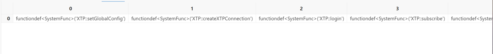
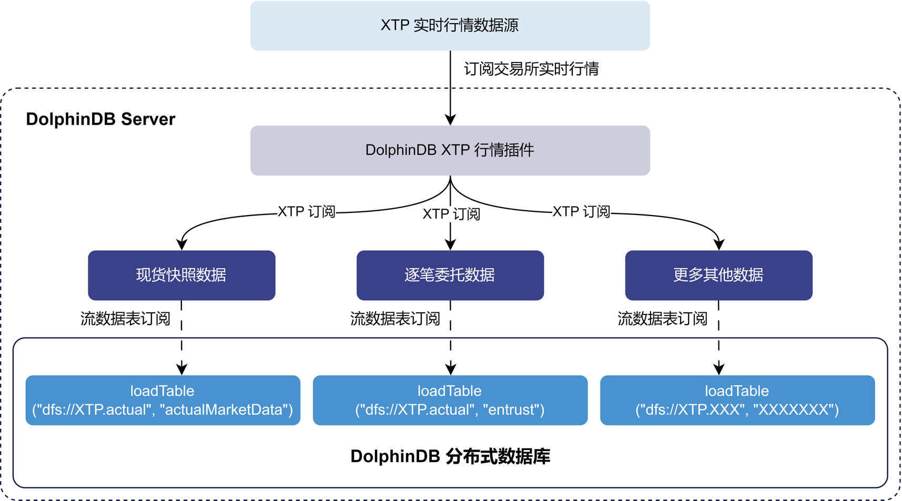
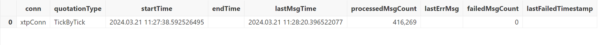
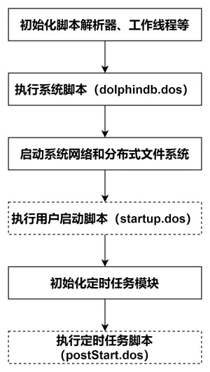

# DolphinDB XTP 插件最佳实践

XTP 是中泰证券推出的高性能交易平台，专为专业投资者提供高速行情及交易系统，旨在提供优质便捷的市场接入通道。目前支持股票、基金、ETF、债券、期权等多个市场，可满足不同投资者需求。

基于 XTP 官方 C++ SDK，DolphinDB 开发了 XTP 插件，提供便捷高效的方式将 XTP 实时行情数据导入 DolphinDB，进行流计算处理及持久化存储。

本文介绍如何使用该插件实现节点启动时自动订阅 XTP 行情数据并存储至 DolphinDB 分布式数据库。全部代码需在 2.00.11 或更高版本的 DolphinDB 服务器及插件上运行，目前仅支持 Linux 系统。

- [1. 关于 XTP 插件](#1-关于-xtp-插件)
- [2. 使用方法](#2-使用方法)
  - [2.1 安装插件](#21-安装插件)
  - [2.2 加载插件](#22-加载插件)
- [3. 通过 XTP 行情插件将实时行情数据写入分布式数据库](#3-通过-xtp-行情插件将实时行情数据写入分布式数据库)
  - [3.1 清理环境（可选）](#31-清理环境可选)
  - [3.2 创建库表](#32-创建库表)
  - [3.3 建立订阅消费关系](#33-建立订阅消费关系)
  - [3.4 订阅 XTP 行情实时写入分布式表](#34-订阅-xtp-行情实时写入分布式表)
  - [3.5 通过 XTP::getStatus 查看行情接收情况](#35-通过-xtpgetstatus-查看行情接收情况)
- [4. 节点启动自动订阅 XTP 实时行情](#4-节点启动自动订阅-xtp-实时行情)
- [5. 附录](#5-附录)


## 1. 关于 XTP 插件

DolphinDB XTP 行情插件支持通过参数配置的方式选择使用 TCP 或 UDP 的方式进行连接，插件通过调用 XTP API 实现行情订阅以及数据接收功能，具体实现严格参照 XTP 官方 API 文档：<https://xtp.zts.com.cn/doc/api/xtpDoc。>

XTP 行情插件目前支持行情源类型如下：

表 1-1 XTP 行情支持概览

|      | **快照** | **逐笔成交** | **逐笔委托** | **订单簿** |
| ---- | -------- | ------------ | ------------ | ---------- |
| 指数 |     √     |              |              |            |
| 股票 |     √     |       √       |       √       |     √       |
| 基金 |     √     |       √       |       √       |     √       |
| 债券 |     √     |      √        |       √       |     √       |
| 期权 |    √      |              |              |            |

该插件旨在提供高效便捷的方式接入 XTP 行情数据，并与 DolphinDB 无缝集成，支持对行情数据进行流式计算、分析、加工和持久化存储。使用者可根据需求灵活订阅不同市场及数据类型的行情，满足各种应用场景。

## 2. 使用方法

### 2.1 安装插件

*XTP 行情插件暂未正式发布，试用请联系 DolphinDB 小助手获取插件压缩包：添加微信号 dolphindb1*

获取插件压缩包后，请将 XTP 行情插件解压至 xtp 目录，其中包括：

- libPluginXTP.so
- libxtpquoteapi.so
- PluginXTP.txt
- README.md

将 xtp 文件夹及其目录下内容移至 /YOUR_DOLPHINDB_PATH/server/plugins/ 下即可完成安装：

```
mv ./xtp /YOUR_DOLPHINDB_PATH/server/plugins/
```

### 2.2 加载插件

在使用插件之前，我们需要通过 `loadPlugin` 函数加载插件：

```
loadPlugin("xtp")
```

插件加载成功，则返回 XTP 行情插件所提供的所有函数：



*图 2-1 插件成功加载返回图*

此外，需要注意，如果重复执行 loadPlugin 加载插件，会抛出模块已经被使用的错误提示，因为节点启动后，只允许加载一次 XTP 插件，即可在任意会话中调用该插件提供的函数。错误提示如下：

```
The module [XTP] is already in use.
```

可以通过 try-catch 语句捕获这个错误，避免因为插件已加载而中断后续脚本代码的执行：

```
try{loadPlugin("xtp")}catch(ex){print(ex)}
```

此外，节点重启需重新加载插件。

## 3. 通过 XTP 行情插件将实时行情数据写入分布式数据库

本章将介绍如何通过 XTP 行情插件，订阅交易所实时行情数据并写入分布式数据库落盘保存。下图以现货快照数据和逐笔委托数据为例，展示了从订阅到入库的完成流程：



*图 3-1 XTP 实时行情入库示意图*

- 通过 XTP 插件订阅逐笔数据写入 DolphinDB *actualMarketDataStream* 和 *entrustStream* 两个持久化流数据表。持久化流数据表是具备发布订阅功能的内存表。
- 订阅持久化流数据表，将数据写入 DolphinDB 分布式数据库。分布式数据库将数据持久化存储到磁盘上。

**注意：**请勿直接将行情数据写入分布式数据库，因为分布式数据库不适合高频逐条写入。建议利用流数据表及其发布订阅功能实现微批处理，以提高写入吞吐量。

下面分步骤介绍关键的 DolphinDB 代码实现，完整脚本见附录。

### 3.1 清理环境（可选）

为确保示例脚本可重复执行，提供了流环境清理脚本。由于相同流数据表名和订阅无法重复定义，因此需先取消相关订阅并清除所需流数据表。

```
try {
    xtpConn = XTP::getHandle("xtpConn")
    XTP::closeXTPConnection(xtpConn)
}
catch (ex) {
    print(ex)
}
go
// 取消订阅
try { unsubscribeTable(tableName="actualMarketDataStream", actionName="actualMarketDataAction") } catch(ex) { print(ex) }
try { unsubscribeTable(tableName="entrustStream", actionName="entrustAction") } catch(ex) { print(ex) }
try { unsubscribeTable(tableName="tradeStream", actionName="tradeAction") } catch(ex) { print(ex) }
try { unsubscribeTable(tableName="stateStream", actionName="stateAction") } catch(ex) { print(ex) }
try { unsubscribeTable(tableName="orderBookStream", actionName="orderBookAction") } catch(ex) { print(ex) }
try { unsubscribeTable(tableName="indexMarketDataStream", actionName="indexMarketDataAction") } catch(ex) { print(ex) }
try { unsubscribeTable(tableName="optionMarketDataStream", actionName="optionMarketDataAction") } catch(ex) { print(ex) }
try { unsubscribeTable(tableName="bondMarketDataStream", actionName="bondMarketDataAction") } catch(ex) { print(ex) }
go
// 取消流表
try { dropStreamTable(tableName="actualMarketDataStream") } catch(ex) { print(ex) }
try { dropStreamTable(tableName="entrustStream") } catch(ex) { print(ex) }
try { dropStreamTable(tableName="tradeStream") } catch(ex) { print(ex) }
try { dropStreamTable(tableName="stateStream") } catch(ex) { print(ex) }
try { dropStreamTable(tableName="orderBookStream") } catch(ex) { print(ex) }
try { dropStreamTable(tableName="indexMarketDataStream") } catch(ex) { print(ex) }
try { dropStreamTable(tableName="optionMarketDataStream") } catch(ex) { print(ex) }
try { dropStreamTable(tableName="bondMarketDataStream") } catch(ex) { print(ex) }
```

### 3.2 创建库表

运行以下语句创建数据库和分区表，包括：

- 创建数据库
- 通过 XTP::getSchema 方法获取表结构
- 创建分区表

根据数据频率与常用场景，将 *actualMarketData，entrust，trade，state，orderBook* 数据放在同一库内，并分别建表。另有 *indexMarketData，optionMarketData，bondMarketData* 的快照数据，单独建库建表。分区规则参考：[《基于 DolphinDB 存储金融数据的分区方案最佳实践》](https://docs.dolphindb.cn/zh/tutorials/best_practices_for_partitioned_storage.html)。

```
login("admin", "123456")
// 现货快照 + 逐笔成交 + 逐笔委托 + 逐笔状态 + 订单簿
// 现货快照包含：股票、基金ETF、可转债的快照数据
// 创建数据库
if (!existsDatabase("dfs://XTP.actual")) {
    dbVALUE = database(, VALUE, 2023.01.01..2023.01.02)
    dbHASH = database(, HASH, [SYMBOL, 50])
    db = database("dfs://XTP.actual", COMPO, [dbVALUE, dbHASH], , `TSDB)
}
else {
    db = database("dfs://XTP.actual")
}
// 获取表结构
actualSchema = table(1:0, XTP::getSchema(`actualMarketData)['name'], XTP::getSchema(`actualMarketData)['typeString'])
entrustSchema = table(1:0, XTP::getSchema(`entrust)['name'], XTP::getSchema(`entrust)['typeString'])
tradeSchema = table(1:0, XTP::getSchema(`trade)['name'], XTP::getSchema(`trade)['typeString'])
stateSchema = table(1:0, XTP::getSchema(`state)['name'], XTP::getSchema(`state)['typeString'])
orderBookSchema = table(1:0, XTP::getSchema(`orderBook)['name'], XTP::getSchema(`orderBook)['typeString'])
// 创建分区表
if (existsTable("dfs://XTP.actual", "actualMarketData")) {
    actualPt = loadTable("dfs://XTP.actual", "actualMarketData")
}
else {
    actualPt = db.createPartitionedTable(actualSchema, "actualMarketData", `dataTime`ticker, {dataTime: "delta"}, `ticker`dataTime)
}
if (existsTable("dfs://XTP.actual", "entrust")) {
    entrustPt = loadTable("dfs://XTP.actual", "entrust")
}
else {
    entrustPt = db.createPartitionedTable(entrustSchema, "entrust", `dataTime`ticker, {seq: "delta", dataTime: "delta", entrustSeq: "delta"}, `ticker`dataTime)
}
if (existsTable("dfs://XTP.actual", "trade")) {
    tradePt = loadTable("dfs://XTP.actual", "trade")
}
else {
    tradePt = db.createPartitionedTable(tradeSchema, "trade", `dataTime`ticker, {seq: "delta", dataTime: "delta", tradeSeq: "delta"}, `ticker`dataTime)
}
if (existsTable("dfs://XTP.actual", "state")) {
    statePt = loadTable("dfs://XTP.actual", "state")
}
else {
    statePt = db.createPartitionedTable(stateSchema, "state", `dataTime`ticker, {seq: "delta", dataTime: "delta"}, `ticker`dataTime)
}
if (existsTable("dfs://XTP.actual", "orderBook")) {
    orderBookPt = loadTable("dfs://XTP.actual", "orderBook")
}
else {
    orderBookPt = db.createPartitionedTable(orderBookSchema, "orderBook", `dataTime`ticker, {dataTime: "delta"}, `ticker`dataTime)
}

// 指数快照
if (!existsDatabase("dfs://XTP.index")) {
    dbVALUE = database(, VALUE, 2023.01.01..2023.01.02)
    dbHASH = database(, HASH, [SYMBOL, 5])
    db = database("dfs://XTP.index", COMPO, [dbVALUE, dbHASH], , `TSDB)
}
else {
    db = database("dfs://XTP.index")
}
indexSchema = table(1:0, XTP::getSchema(`indexMarketData)['name'], XTP::getSchema(`indexMarketData)['typeString'])
if (existsTable("dfs://XTP.index", "indexMarketData")) {
    indexPt = loadTable("dfs://XTP.index", "indexMarketData")
}
else {
    indexPt = db.createPartitionedTable(indexSchema, "indexMarketData", `dataTime`ticker, {dataTime: "delta"}, `ticker`dataTime)
}

// 期权快照
if (!existsDatabase("dfs://XTP.option")) {
    dbVALUE = database(, VALUE, 2023.01.01..2023.01.02)
    dbHASH = database(, HASH, [SYMBOL, 5])
    db = database("dfs://XTP.option", COMPO, [dbVALUE, dbHASH], , `TSDB)
}
else {
    db = database("dfs://XTP.option")
}
optionSchema = table(1:0, XTP::getSchema(`optionMarketData)['name'], XTP::getSchema(`optionMarketData)['typeString'])
if (existsTable("dfs://XTP.option", "optionMarketData")) {
    optionPt = loadTable("dfs://XTP.option", "optionMarketData")
}
else {
    optionPt = db.createPartitionedTable(optionSchema, "optionMarketData", `dataTime`ticker, {dataTime: "delta"}, `ticker`dataTime)
}

// 债券快照
if (!existsDatabase("dfs://XTP.bond")) {
    dbVALUE = database(, VALUE, 2023.01.01..2023.01.02)
    dbHASH = database(, HASH, [SYMBOL, 20])
    db = database("dfs://XTP.bond", COMPO, [dbVALUE, dbHASH], , `TSDB)
}
else {
    db = database("dfs://XTP.bond")
}
bondSchema = table(1:0, XTP::getSchema(`bondMarketData)['name'], XTP::getSchema(`bondMarketData)['typeString'])
if (existsTable("dfs://XTP.bond", "bondMarketData")) {
    bondPt = loadTable("dfs://XTP.bond", "bondMarketData")
}
else {
    bondPt = db.createPartitionedTable(bondSchema, "bondMarketData", `dataTime`ticker, {dataTime: "delta"}, `ticker`dataTime)
}
```

### 3.3 建立订阅消费关系

运行以下脚本建立订阅消费关系，包括：

- 获取表结构
- 建立持久化流表
- 定义入库函数
- 建立订阅消费关系

**注意**：采用持久化流表来进行处理，需要节点启动之前在配置文件中（单节点：*dolohindb.cfg*，集群：*cluster.cfg*）配置参数 *persistenceDir* ，配置参考[功能配置](https://docs.dolphindb.cn/zh/db_distr_comp/cfg/cfg_para_ref.html)。

```
// 现货快照 + 逐笔成交 + 逐笔委托 + 逐笔状态 + 订单簿
// 获取表结构
actualSchema = streamTable(1:0, XTP::getSchema(`actualMarketData)['name'], XTP::getSchema(`actualMarketData)['typeString'])
entrustSchema = streamTable(1:0, XTP::getSchema(`entrust)['name'], XTP::getSchema(`entrust)['typeString'])
tradeSchema = streamTable(1:0, XTP::getSchema(`trade)['name'], XTP::getSchema(`trade)['typeString'])
stateSchema = streamTable(1:0, XTP::getSchema(`state)['name'], XTP::getSchema(`state)['typeString'])
orderBookSchema = streamTable(1:0, XTP::getSchema(`orderBook)['name'], XTP::getSchema(`orderBook)['typeString'])
// 建立持久化流表
enableTableShareAndPersistence(table=actualSchema, tableName=`actualMarketDataStream, cacheSize=100000, preCache=1000)
enableTableShareAndPersistence(table=entrustSchema, tableName=`entrustStream, cacheSize=100000, preCache=1000)
enableTableShareAndPersistence(table=tradeSchema, tableName=`tradeStream, cacheSize=100000, preCache=1000)
enableTableShareAndPersistence(table=stateSchema, tableName=`stateStream, cacheSize=100000, preCache=1000)
enableTableShareAndPersistence(table=orderBookSchema, tableName=`orderBookStream, cacheSize=100000, preCache=1000)
go
// 定义入库函数
actualHandler = append!{loadTable("dfs://XTP.actual", "actualMarketData"), }
entrustHandler = append!{loadTable("dfs://XTP.actual", "entrust"), }
tradeHandler = append!{loadTable("dfs://XTP.actual", "trade"), }
stateHandler = append!{loadTable("dfs://XTP.actual", "state"), }
orderBookHandler = append!{loadTable("dfs://XTP.actual", "orderBook"), }
// 订阅
subscribeTable(tableName=`actualMarketDataStream, actionName=`actualMarketDataAction, offset=0, handler=actualHandler, msgAsTable=true, batchSize=1000, throttle=0.1)
subscribeTable(tableName=`entrustStream, actionName=`entrustAction, offset=0, handler=entrustHandler, msgAsTable=true, batchSize=1000, throttle=0.1)
subscribeTable(tableName=`tradeStream, actionName=`tradeAction, offset=0, handler=tradeHandler, msgAsTable=true, batchSize=1000, throttle=0.1)
subscribeTable(tableName=`stateStream, actionName=`stateAction, offset=0, handler=stateHandler, msgAsTable=true, batchSize=1000, throttle=0.1)
subscribeTable(tableName=`orderBookStream, actionName=`orderBookAction, offset=0, handler=orderBookHandler, msgAsTable=true, batchSize=1000, throttle=0.1)

// 指数快照
indexSchema = streamTable(1:0, XTP::getSchema(`indexMarketData)['name'], XTP::getSchema(`indexMarketData)['typeString'])
enableTableShareAndPersistence(table=indexSchema, tableName=`indexMarketDataStream, cacheSize=100000, preCache=1000)
go
indexHandler = append!{loadTable("dfs://XTP.index", "indexMarketData"), }
subscribeTable(tableName=`indexMarketDataStream, actionName=`indexMarketDataAction, offset=0, handler=indexHandler, msgAsTable=true, batchSize=1000, throttle=0.1)

// 期权快照
optionSchema = streamTable(1:0, XTP::getSchema(`optionMarketData)['name'], XTP::getSchema(`optionMarketData)['typeString'])
enableTableShareAndPersistence(table=optionSchema, tableName=`optionMarketDataStream, cacheSize=100000, preCache=1000)
go
optionHandler = append!{loadTable("dfs://XTP.option", "optionMarketData"), }
subscribeTable(tableName=`optionMarketDataStream, actionName=`optionMarketDataAction, offset=0, handler=optionHandler, msgAsTable=true, batchSize=1000, throttle=0.1)

// 债券快照
bondSchema = streamTable(1:0, XTP::getSchema(`bondMarketData)['name'], XTP::getSchema(`bondMarketData)['typeString'])
enableTableShareAndPersistence(table=bondSchema, tableName=`bondMarketDataStream, cacheSize=100000, preCache=1000)
go
bondHandler = append!{loadTable("dfs://XTP.bond", "bondMarketData"), }
subscribeTable(tableName=`bondMarketDataStream, actionName=`bondMarketDataAction, offset=0, handler=bondHandler, msgAsTable=true, batchSize=1000, throttle=0.1)
```

### 3.4 订阅 XTP 行情实时写入分布式表

运行以下脚本订阅 XTP 实时行情并写入分布式表，包括：

- XTP 账号的信息配置与登录
- XTP 快照行情接入
- XTP 逐笔行情接入
- XTP 订单簿行情接入

注意，XTP 本身的设计要求按照行情类别来进行订阅，因此若无特殊需求则直接按照如下代码进行接入即可。具体规则可以访问：<https://xtp.zts.com.cn/doc/api/xtpDoc>

```
try { XTP::setGlobalConfig(1, "./plugins/xtp/", 3) } catch(ex) { print(ex) }
go
// 创建连接
xtpConn = XTP::createXTPConnection("xtpConn")
// XTP 账户信息配置
xtpConfig = dict(STRING, ANY);
xtpConfig["ip"] = "111.111.111.111";
xtpConfig["port"] = 1111;
xtpConfig["user"] = "11111111111";
xtpConfig["password"] = "11111111111";  // 没有密码的情况下，请与user输入相同内容
xtpConfig["protocalType"] = 1;    //1 是 TCP 2 是 UDP, 测试环境只有TCP
xtpConfig["heartBeatInterval"] = 60;
go
// 登录XTP！
XTP::login(xtpConn, xtpConfig)

// 接入快照行情
tableDict = dict(STRING, ANY);
tableDict["indexTable"] = indexMarketDataStream
tableDict["optionTable"] = optionMarketDataStream
tableDict["actualTable"] = actualMarketDataStream
tableDict["bondTable"] = bondMarketDataStream
go
XTP::subscribe(xtpConn, 1, 4, , tableDict)  // 1 for 快照, 4 for 全市场，第四个参数不填，表示接入所有标的
// 接入逐笔行情
tableDict = dict(STRING, ANY);
tableDict["entrustTable"] = entrustStream
tableDict["tradeTable"] = tradeStream
tableDict["statusTable"] = stateStream
go
XTP::subscribe(xtpConn, 2, 4, , tableDict)  // 2 for 逐笔，4 for 沪深两市，第三个参数不填，表示接入所有股票
// 接入订单簿
tableDict = dict(STRING, ANY);
tableDict["orderBookTable"] = orderBookStream
go
XTP::subscribe(xtpConn, 3, 4, , tableDict)  // 3 for 订单簿，4 for 沪深两市，第三个参数不填，表示接入所有股票
```

运行完成后，XTP 插件会接受 XTP 实时行情，将行情写入持久化流表，订阅关系将消费流表中内容，并将数据写入分区表落盘保存。

至此，我们已完成 XTP 实时行情的接入全流程！

### 3.5 通过 XTP::getStatus 查看行情接收情况

XTP 行情插件提供 XTP::getStatus 方法以供用户查看行情接入情况：

```
xtpConn = XTP::getHandle("xtpConn")
XTP::getStatus(xtpConn)
```

此处以逐笔数据为例，用户可以根据该方法，观察到对应类别行情数据的开始时间、结束时间、最后处理的消息时间、已处理数据条数、最后错误信息、失败行情条数和最后失败行情时间戳的内容。



*图 3-2 查看行情接入状况*

## 4. 节点启动自动订阅 XTP 实时行情

如果您希望在节点启动时自动订阅 XTP 实时行情，可以通过配置 *startup.dos* 脚本实现。DolphinDB 系统的启动流程如下：



*图 4-1 DolphinDB 系统启动流程图*

1. **系统初始化脚本（*****dolphindb.dos*****）**
   - 该脚本是必需的，默认加载版本发布目录中的 *dolphindb.dos*。
   - 不建议修改该脚本，因为版本升级时需要用新版本发布包中的系统初始化脚本覆盖。
2. **用户启动脚本（*****startup.dos*****）**
   - 该脚本通过配置参数 startup 后才会执行。
   - 单节点模式在 *dolphindb.cfg* 中配置，集群模式在 *cluster.cfg* 中配置，可配置绝对路径或相对路径。
   - 若配置了相对路径或未指定目录，系统会依次搜索本地节点的 home 目录、工作目录和可执行文件所在目录。
   - 配置示例：startup=/DolphinDB/server/startup.dos

将附件中的代码添加到 */DolphinDB/server* 目录的 *startup.dos* 文件中，并在相应的配置文件中配置参数 *startup*，即可实现节点启动时自动订阅。

1. **定时任务脚本（*****postStart.dos*****）**
   - DolphinDB 中通过 scheduleJob 函数定义的定时任务会持久化。
   - 重启节点时，系统先执行用户启动脚本，然后在初始化定时任务模块时完成持久化定时任务的加载。
   - 完成上述步骤后，系统会执行定时任务脚本，此时可以调用 scheduleJob 函数定义新的定时任务。
   - 本教程未使用该功能，无需开启该配置项。1.30.15 和 2.00.3 版本开始支持配置 *postStart.dos* 实现节点启动自动执行定时任务脚本。

**注意**：XTP 的账户信息需要根据实际环境进行修改。

## 5. 附录

- 详细启动脚本配置可以参考官网文档教程：[启动脚本教程](https://docs.dolphindb.cn/zh/tutorials/Startup.html)。
- 关于节点启动时自动订阅处理业务的部署可以参考官网文档教程：[节点启动时的流计算自动订阅教程](https://docs.dolphindb.cn/zh/tutorials/streaming_auto_sub_2.html)。
- *startup.dos* 启动脚本（账户信息需要根据用户实际情况进行修改）：[点此下载](./script/xtp/startup.dos)。
